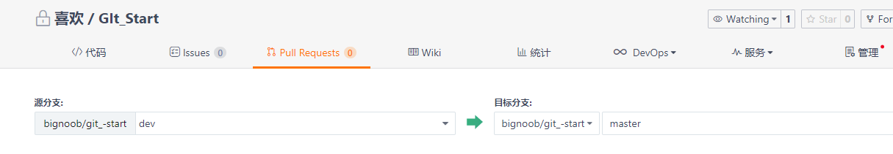

# *Git使用笔记*


## 1 版本控制

### 1.1 什么是版本控制

​		版本控制（Revision control）是一种在开发的过程中用于管理我们对文件、目录或工程等内容的修改历史，方便查看更改历史记录，备份以便恢复以前的版本的软件工程技术。简单说就是用于管理多人协同开发项目的技术。**也即通过版本控制,我们可以管理多人协同开发,每个开发人员都可以在办本控制中获取工程的修改、更新记录并实时更新工程文件。**


### 1.2 常见的版本控制

- **Git**

- **SVN**（Subversion）

- **CVS**（Concurrent Versions System）

- **VSS**（Micorosoft Visual SourceSafe）

- **TFS**（Team Foundation Server）

- Visual Studio Online

  目前最流行的是 **Git** 和 **SVN**


### 1.3 版本控制分类

#### 1) 本地版本控制

在本地记录版本的更新记录,适用与个人


#### 2) 集中版本控制(SVN)

所有的版本数据都保存在服务器上，协同开发者从服务器上同步更新或上传自己的修改。

**也即服务器保存了所有的版本历史记录,开发者需要联网从服务器获取版本迭代历史。加入服务器的数据崩溃,那么所有的历史记录就将丢失。**


#### 3) 分布式版本控制(Git)

**每个人都拥有全部的代码**  有一定的安全隐患

所有版本信息仓库全部同步到本地的每个用户，这样就可以在本地查看所有版本历史，可以离线在本地提交，只需在连网时push到相应的服务器或其他用户那里。由于每个用户那里保存的都是所有的版本数据，只要有一个用户的设备没有问题就可以恢复所有的数据，但这增加了本地存储空间的占用。

不会因为服务器损坏或者网络问题，造成不能工作的情况！


#### 4) Git与SVN的区别

SVN是集中式版本控制系统，版本库是集中放在中央服务器的，而工作的时候，用的都是自己的电脑，所以首先要从中央服务器得到最新的版本，然后工作，完成工作后，需要把自己做完的活推送到中央服务器。集中式版本控制系统是必须联网才能工作，对网络带宽要求较高。

Git是分布式版本控制系统，没有中央服务器，每个人的电脑就是一个完整的版本库，工作的时候不需要联网了，因为版本都在自己电脑上。协同的方法是这样的：比如说自己在电脑上改了文件A，其他人也在电脑上改了文件A，这时，你们两之间只需把各自的修改推送给对方，就可以互相看到对方的修改了。Git可以直接看到更新了哪些代码和文件！


## 2 工作区与工作流

### 2.1 工作区与工作流

Git本地有三个工作区域：工作目录（Working Directory）、暂存区(Stage/Index)、资源库(Repository或Git Directory)。如果在加上远程的git仓库(Remote Directory)就可以分为四个工作区域。

> Workspace：工作区，就是你平时存放项目代码的地方
>
> Index / Stage：暂存区，用于临时存放你的改动，事实上它只是一个文件，保存即将提交到文件列表信息
>
> Repository：仓库区（或本地仓库），就是安全存放数据的位置，这里面有你提交到所有版本的数据。其中HEAD指向最新放入仓库的版本
>
> Remote：远程仓库，托管代码的服务器，可以简单的认为是你项目组中的一台电脑用于远程数据交换


### 2.2 工作流程

git的工作流程一般是这样的：

１、在工作目录中添加、修改文件；      `git add`

２、将需要进行版本管理的文件放入暂存区域；   `git commit`

３、将暂存区域的文件提交到git仓库。    `git push`

因此，git管理的文件有三种状态：已修改（modified）,已暂存（staged）,已提交(committed)


## 3 本地仓库搭建与仓库克隆

### 3.1 仓库搭建与初始化

创建本地仓库的方法有两种：

> 一种是创建全新的仓库         在想要存放的位置调用git bash 或 cmd 执行    `git init`
>
> 另一种是克隆远程仓库。     在想要存放的位置调用git bash 或 cmd 执行    `git clone #URL#`

如果使用 IDEA 进行仓库创建时:  

>  VCS  > import into version control  > create git repository, 可以在项目本地创建一个 git 仓库。


### 3.2 克隆远程仓库

将远程服务器上的仓库完全镜像一份至本地

```
# 克隆一个项目和它的整个代码历史(版本信息)
$ git clone [url]  # https://gitee.com/kuangstudy/openclass.git
Current Root Directory > git clone 
```


## 4 Git 文件操作

### 4.1 文件的四种状态

版本控制就是对文件的版本控制，要对文件进行修改、提交等操作，首先要知道文件当前在什么状态，不然可能会提交了现在还不想提交的文件，或者要提交的文件没提交上。

> **Untracked**:  未跟踪, 此文件在文件夹中, 但并没有加入到git库, 不参与版本控制. 通过git add 状态变为Staged.
>
> **Unmodify**:  文件已经入库, 未修改, 即版本库中的文件快照内容与文件夹中完全一致. 这种类型的文件有两种去处, 如果它被修改, 而变为Modified. 如果使用git rm移出版本库, 则成为Untracked文件
>
> **Modified**:  文件已修改, 仅仅是修改, 并没有进行其他的操作. 这个文件也有两个去处, 通过git add可进入暂存staged状态, 使用git checkout 则丢弃修改过, 返回到 unmodify 状态, 这个git checkout即从库中取出文件, 覆盖当前修改 !
>
> **Staged**:  暂存状态. 执行git commit则将修改同步到库中, 这时库中的文件和本地文件又变为一致, 文件为Unmodify状态. 执行git reset HEAD filename取消暂存, 文件状态为Modified


### 4.2 查看文件状态

```
git status [filename]			#查看指定文件状态	
git status						#查看所有文件状态
git add .                  		添加所有文件到暂存区
git commit -m "消息内容"    	  提交暂存区中的内容到本地仓库 -m 提交信息
```


### 4.3 忽略文件

有些时候我们不想把某些文件纳入版本控制中，比如数据库文件，临时文件，设计文件等

在主目录下建立 ".*gitignore*" 文件，此文件有如下规则：

> 忽略文件中的空行或以井号（#）开始的行将会被忽略。
>
> 可以使用Linux通配符。例如：星号（*）代表任意多个字符，问号（？）代表一个字符，方括号（[abc]）代表可选字符范围，大括号（{string1,string2,...}）代表可选的字符串等。
>
> 如果名称的最前面有一个感叹号（!），表示例外规则，将不被忽略。
>
> 如果名称的最前面是一个路径分隔符（/），表示要忽略的文件在此目录下，而子目录中的文件不忽略。
>
> 如果名称的最后面是一个路径分隔符（/），表示要忽略的是此目录下该名称的子目录，而非文件（默认文件或目录都忽略）。
>

```
*.txt        	#忽略所有 .txt结尾的文件,这样的话上传就不会被选中！
!lib.txt     	#但lib.txt除外
/temp        	#仅忽略项目根目录下的TODO文件,不包括其它目录
tempbuild/      #忽略build/目录下的所有文件
doc/*.txt    	#会忽略 doc/notes.txt 但不包括 doc/server/arch.txt
```


## 5 Git 常用操作

### 5.1 分支常用操作

#### 1) git分支中常用指令

```Python
git branch        # 列出所有本地分支       
git branch -r     # 列出所有远程分支
git branch [branch-name]     # 新建一个分支，但依然停留在当前分支
git checkout -b [branch]     # 新建一个分支，并切换到该分支
git merge [branch]           # 合并指定分支到当前分支$ 
git branch -d [branch-name]  # 删除分支$ 
git push origin --delete [branch-name]$ git branch -dr [remote/branch]       # 删除远程分支$ 
```


#### 2) Idea 创建和切换分支 

> 1. 右击工程 > git > commit / push
> 2. VCS > Git > commit / push
> 3. Git CMD > commit / push


#### 3)  IDEA 集成 git

> 1. 右击工程 > git > commit / push
> 2. VCS > Git > commit / push
> 3. Git CMD > commit / push


### 5.2 Pull Request(合并分支)

**提交自己的修改到主分支(master),等待master审核完成后,可进行分支合并**

在自己分支里commit & push 完相关文件之后, 在 *gitee* 里面新建 Pull Requese , 选择自己所在分支和目标分支,提交相关描述和改动进行提交。



### 5.3 常用操作

```
git init		//初始化git仓库 (在当前路径下新建,可以使用 cd /d d: 切换路径)
git add .		//添加所有文件到暂存区
git commit -m "message"   //提交暂存区数据到仓库,后面为消息提示
git remote add origin ##git仓库地址##    //关联远程仓库
git push -u origin master				//提交到 master 分支
git checkout <branchName>               //切换不同分支
```


## 6 Git 使用问题总结

### 6.1 Push Rejected 问题

找到 IDEA 项目的 git 路径, cmd中进行切换,然后执行以下命令,重新 push 即可。

```
git pull
git pull origin master
git pull origin master –allow-unrelated-histories
git push -u origin master -f
```

[解决Blog](https://blog.csdn.net/Naide_S/article/details/80925678?utm_medium=distribute.pc_relevant.none-task-blog-2%7Edefault%7ECTRLIST%7Edefault-4.no_search_link&depth_1-utm_source=distribute.pc_relevant.none-task-blog-2%7Edefault%7ECTRLIST%7Edefault-4.no_search_link)


