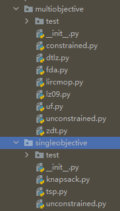

# 1 算法框架


## 1.1 Algorithm 类

*Algorithm* 提供了一个解决方案列表 *solutions* 以及 *run* 方法, 其中包含了一系列的算法检测和使用方法, 包括 *evaluate* 、 *init_progress* 、*update_progress* 、*get_result* 等基础函数, 来完成对算法执行的动态操作, 如 评估、初始化、更新、获取结果、运行、观察结果等相应操作。

```python
class Algorithm(Generic[S, R], threading.Thread, ABC):

    def __init__(self):
        threading.Thread.__init__(self)

        self.solutions: List[S] = []
        self.evaluations = 0
        self.start_computing_time = 0
        self.total_computing_time = 0

        self.observable = store.default_observable

    @abstractmethod
    def create_initial_solutions(self) -> List[S]:
        """ Creates the initial list of solutions of a metaheuristic. """
        pass

    @abstractmethod
    def evaluate(self, solution_list: List[S]) -> List[S]:
        """ Evaluates a solution list. """
        pass

    @abstractmethod
    def init_progress(self) -> None:
        """ Initialize the algorithm. """
        pass

    @abstractmethod
    def stopping_condition_is_met(self) -> bool:
        """ The stopping condition is met or not. """
        pass

    @abstractmethod
    def step(self) -> None:
        """ Performs one iteration/step of the algorithm's loop. """
        pass

    @abstractmethod
    def update_progress(self) -> None:
        """ Update the progress after each iteration. """
        pass

    @abstractmethod
    def get_observable_data(self) -> dict:
        """ Get observable data, with the information that will be send to all observers each time. """
        pass

    def run(self):
        """ Execute the algorithm. """
        self.start_computing_time = time.time()

        self.solutions = self.create_initial_solutions()
        self.solutions = self.evaluate(self.solutions)

        LOGGER.debug('Initializing progress')
        self.init_progress()

        LOGGER.debug('Running main loop until termination criteria is met')
        while not self.stopping_condition_is_met():
            self.step()
            self.update_progress()

        self.total_computing_time = time.time() - self.start_computing_time

    @abstractmethod
    def get_result(self) -> R:
        pass

    @abstractmethod
    def get_name(self) -> str:
        pass

```


## 1.2 Problem 类

*Problem* 类负责创建和评估解决方案, 它的拥有属性是决策变量、目标和约束的数量。 如下所示包括 变量个数、目标个数、约束个数、方向集合、目标集合等问题初始参数, 它规定了一个亟需解决的问题, 能够根据不同的问题类型(编码的不同)创建 *solution*  并对其性能进行评估。 *Problem* 根据编码类型分为: *DynamicProblem* 、*BinaryProblem*、*FloatProblem*、*IntegerProblem*、*PermutationProblem* 等不同的问题类型

```Python
class Problem(Generic[S], ABC):
    """ Class representing problems. """

    MINIMIZE = -1
    MAXIMIZE = 1

    def __init__(self):
        self.number_of_variables: int = 0
        self.number_of_objectives: int = 0
        self.number_of_constraints: int = 0

        self.reference_front: List[S] = []

        self.directions: List[int] = []
        self.labels: List[str] = []

    @abstractmethod
    def create_solution(self) -> S:
        """ Creates a random_search solution to the problem.

        :return: Solution. """
        pass

    @abstractmethod
    def evaluate(self, solution: S) -> S:
        """ Evaluate a solution. For any new problem inheriting from :class:`Problem`, this method should be
        replaced. Note that this framework ASSUMES minimization, thus solutions must be evaluated in consequence.

        :return: Evaluated solution. """
        pass

    @abstractmethod
    def get_name(self) -> str:
        pass

```


## 1.3 Operator 类

*Operator* 类( 算子 )包括有 *Mutation*(变异) 、*Crossover*(交叉) 、 *Selection*(选择) 等方法, 这些方法根据个体不同的编码类型给定源对象并指定 Solution 得出操作结果。 比如: 变异即对 输入基因 的某些基因片段进行修改、交叉则是根据输入的父母基因进行交叉得出子代、 选择则从集合中根据选择算子选择特定个数的个体。 

```python
class Operator(Generic[S, R], ABC):
    """ Class representing operator """

    @abstractmethod
    def execute(self, source: S) -> R:
        pass

    @abstractmethod
    def get_name(self) -> str:
        pass
    
    class Mutation(Operator[S, S], ABC):
    """ Class representing mutation operator. """

    @check_valid_probability_value
    def __init__(self, probability: float):
        self.probability = probability


class Crossover(Operator[List[S], List[R]], ABC):
    """ Class representing crossover operator. """

    @check_valid_probability_value
    def __init__(self, probability: float):
        self.probability = probability

    @abstractmethod
    def get_number_of_parents(self) -> int:
        pass

    @abstractmethod
    def get_number_of_children(self) -> int:
        pass


class Selection(Operator[S, R], ABC):
    """ Class representing selection operator. """

    def __init__(self):
        pass
```


## 1.4 Solution 类

*Solution* 类是 *jMetalPy* 中的关键组件, 因为它可以操作算子和相关方法为求解问题提供一套行之有效的解决办法。每个解决方案都由一个变量列表、一个目标值列表和一组作为键值对字典实现的属性组成。 Solution 可以为不同的编码类型提供服务, 如 :  *BinarySolution* 、 *FloatSolution* 、*IntegerSolution*、*CompositeSolution*、*PermutationSolution* 等不同的编码类型。

Observer  - 观察者     quality_indicator   质量指标

```python
class Solution(Generic[S], ABC):
    """ Class representing solutions """

    def __init__(self, number_of_variables: int, number_of_objectives: int, number_of_constraints: int = 0):
        self.number_of_variables = number_of_variables
        self.number_of_objectives = number_of_objectives
        self.number_of_constraints = number_of_constraints
        self.variables = [[] for _ in range(self.number_of_variables)]
        self.objectives = [0.0 for _ in range(self.number_of_objectives)]
        self.constraints = [0.0 for _ in range(self.number_of_constraints)]
        self.attributes = {}

    def __eq__(self, solution) -> bool:
        if isinstance(solution, self.__class__):
            return self.variables == solution.variables
        return False

    def __str__(self) -> str:
        return 'Solution(variables={},objectives={},constraints={})'.format(self.variables, self.objectives,
                                                                            self.constraints)
```


## 1.5 jMetal 各个包的作用

```
core		# 存放各个核心类的定义
algorithm	# 存放各种优化算法的 算法初始参数
lab			# 一些 API 依赖
operator	# 存放 选择、交叉、变异 的具体算法定义
util		# 数据处理方法
problem		# 定义常见的 单目标、多目标优化问题的 问题簇, 常见的单目标、多目标优化问题的定义
```


# 2 NSGA-II 举例

## 2.1 Algorithm class

```python
# 以下是 NSGA-II 算法类定义, 包含算法运行的必要参数, 这里对类进行了默认传参的构造
## problem  待解决的问题
## population_size	种群大小
## offspring_population_size	后代种群大小
## mutation		突变类型
## crossover	交叉算法
## selection	选择算法	二进制锦标选择
## termination_criterion	终止标准
## population_generator		种群生成器
## population_evaluator		种群评估器
#
class NSGAII(GeneticAlgorithm[S, R]):
	def __init__(self,
             problem: Problem,
             population_size: int,
             offspring_population_size: int,
             mutation: Mutation,
             crossover: Crossover,
             selection: Selection = BinaryTournamentSelection(
                 MultiComparator([FastNonDominatedRanking.get_comparator(),
                                  CrowdingDistance.get_comparator()])),
             termination_criterion: TerminationCriterion = store.default_termination_criteria,
             population_generator: Generator = store.default_generator,
             population_evaluator: Evaluator = store.default_evaluator,
             dominance_comparator: Comparator = store.default_comparator):
        super(NSGAII, self).__init__(
            problem=problem,
            population_size=population_size,
            offspring_population_size=offspring_population_size,
            mutation=mutation,
            crossover=crossover,
            selection=selection,
            termination_criterion=termination_criterion,
            population_evaluator=population_evaluator,
            population_generator=population_generator
        )
        self.dominance_comparator = dominance_comparator

# 种群替代函数: 这种方法将当前种群和后代种群结合起来产生下一代种群通过应用排名和拥挤距离选择。
def replacement(self, population: List[S], offspring_population: List[S]) -> List[List[S]]:
    
# 获取结果
def get_result(self) -> R:
    return self.solutions

#获取算法名称
def get_name(self) -> str:
    return 'NSGAII'

### 算法运行   -  core > algorithm class
def run(self):
        """ Execute the algorithm. """
        self.start_computing_time = time.time()

        self.solutions = self.create_initial_solutions()
        self.solutions = self.evaluate(self.solutions)

        LOGGER.debug('Initializing progress')
        self.init_progress()

        LOGGER.debug('Running main loop until termination criteria is met')
        while not self.stopping_condition_is_met():
            self.step()
            self.update_progress()

        self.total_computing_time = time.time() - self.start_computing_time
### 算法初始化,包括对 处理方法列表、评估、开始时间、总运行时间、观察者	-  core > algorithm class
    def __init__(self):
        threading.Thread.__init__(self)

        self.solutions: List[S] = []
        self.evaluations = 0
        self.start_computing_time = 0
        self.total_computing_time = 0

        self.observable = store.default_observable
```

---


## 2.2 Problem class

一些经典的多目标、单目标优化问题




---


## 2.3 operator class

一些典型的交叉、变异、选择算法。 如: 二进制锦标赛选择、轮盘赌选择、实数变异、二进制变异等


---


## 2.4 Solution class

```python
# 以下是 Solution 类的定义, 该类的目的在于根据种群个体不同的编码类型为其提供不同的解决方案, 根据编码不同 jMetal 提供了不同的解决方案, 如 
# : *Solution*、*BinarySolution* 、*FloatSolution* 、*IntegerSolution*、*CompositeSolution*、*PermutationSolution* 等
## number_of_variables		变量个数
## number_of_objectives		对象个数 - 目标个数
## number_of_constraints	约束个数
## variables				变量列表
## objectives				对象列表
## constraints				约束列表
## attributes				属性
class Solution(Generic[S], ABC):
    """ Class representing solutions """

    def __init__(self, number_of_variables: int, number_of_objectives: int, number_of_constraints: int = 0):
        self.number_of_variables = number_of_variables
        self.number_of_objectives = number_of_objectives
        self.number_of_constraints = number_of_constraints
        self.variables = [[] for _ in range(self.number_of_variables)]
        self.objectives = [0.0 for _ in range(self.number_of_objectives)]
        self.constraints = [0.0 for _ in range(self.number_of_constraints)]
        self.attributes = {}

    def __eq__(self, solution) -> bool:
        if isinstance(solution, self.__class__):
            return self.variables == solution.variables
        return False

    def __str__(self) -> str:
        return 'Solution(variables={},objectives={},constraints={})'.format(self.variables, self.objectives,
                                                                            self.constraints)
```

---


## 2.5 NSGA-II 实例

**定义与运行**

```python
from jmetal.algorithm.multiobjective.nsgaii import NSGAII
from jmetal.operator import SBXCrossover, PolynomialMutation
from jmetal.problem import ZDT1
from jmetal.util.termination_criterion import StoppingByEvaluations

problem = ZDT1()		# 问题类型

max_evaluations = 25000	# 迭代次数

# NSGA-II 算法参数构造
algorithm = NSGAII(
    problem=problem,
    population_size=100,
    offspring_population_size=100,
    mutation=PolynomialMutation(probability=1.0 / problem.number_of_variables, distribution_index=20),
    crossover=SBXCrossover(probability=1.0, distribution_index=20),
    termination_criterion=StoppingByEvaluations(max=max_evaluations)
)

algorithm.run()		# 运行算法
solutions = algorithm.get_result()		# 获取运行后的结果集
```

**打印非支配面**

```python
from jmetal.lab.visualization.plotting import Plot
from jmetal.util.solution import get_non_dominated_solutions

front = get_non_dominated_solutions(solutions)		# 获取非支配面数据

# 打印非支配面
plot_front = Plot(plot_title='Pareto front approximation', axis_labels=['x', 'y'])
plot_front.plot(front, label='NSGAII-ZDT1')
```

**算法流程**

```
1、Algorithm 构造算法, 初始化算法参数 问题、交叉、变异、选择算法、种群大小、解决方案列表等
2、根据不同的 Problem 和 Operator 类型选取不同的 Solution 方案, 获取处理结果
3、评估并不断迭代, 直到达到目标迭代次数终止, 返回结果
```

**运行结果**


