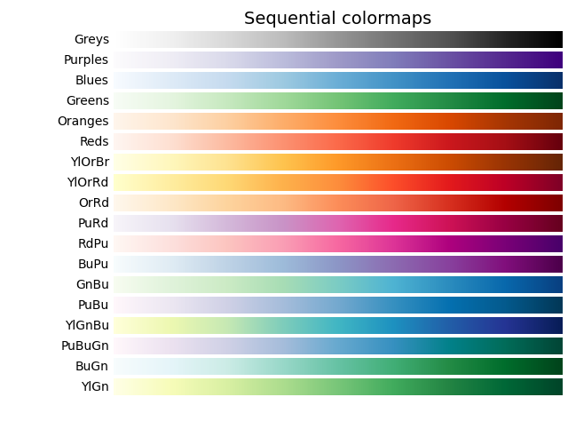

# 1  折线图

### 二维数据折线绘制

绘制二维数据曲线

```python
import matplotlib.pyplot as plt
import numpy as np

# 创建二维数据和坐标
x = np.linspace(0, 4, 4)      # 创建x的取值范围 0-20 范围内 20 个点
data = [[1,2,3,4],[5,6,7,8],[9,10,11,12],[13,14,15,16]]
lineSize = len(data) # 获取数据的行数 一维特征

# 生成绘图代码
## 绘图
y1 = x
code = ""
for i in range(lineSize):
    code += "plt.plot(x, data[{}], lw=0.8)".format(i) + "\n"  # 拼接图像

print(code,lineSize)
c1 = compile(code, "", mode="exec")     # 将字符串编译为 exec 可执行的类型
exec(code)  # 执行字符串代码
plt.show()  # 打印图像
```


### 多折线绘制

绘制多条曲线在一张图上, 不用 `subplots` 也可以实现

```python
import matplotlib.pyplot as plt
import numpy as np

fig, ax = plt.subplots() # 创建图实例
x = np.linspace(0,2,100) # 创建x的取值范围
y1 = x
ax.plot(x, y1, label='linear') # 作y1 = x 图，并标记此线名为linear
y2 = x ** 2
ax.plot(x, y2, label='quadratic') #作y2 = x^2 图，并标记此线名为quadratic
y3 = x ** 3
ax.plot(x, y3, label='cubic') # 作y3 = x^3 图，并标记此线名为cubic
ax.legend()
plt.show()
```


# 2  散点图

### 散点图绘制

```python
import matplotlib.pyplot as plt
import numpy as np

# 第一组散点
x = np.array([1, 2, 3, 4, 5, 6, 7, 8])
y = np.array([1, 4, 9, 16, 7, 11, 23, 18])
plt.scatter(x, y,s=10,c='red',alpha=0.8)      # s 点的大小  c 点的颜色 alpha 透明度

# 第二组散点
x = np.array([1, 2, 3, 4, 5, 6, 7, 8])
y = y + 5
plt.scatter(x, y,s=10,c='blue',alpha=0.5,cmap='viridis')      # s 点的大小  c 点的颜色 alpha 透明度 cmap 颜色条(color需要设置为数组)

# 第三组散点
x = np.array([5,7,8,7,2,17,2,9,4,11,12,9,6])
y = np.array([99,86,87,88,111,86,103,87,94,78,77,85,86])
colors = np.array([0, 10, 20, 30, 40, 45, 50, 55, 60, 70, 80, 90, 100])
plt.scatter(x, y, c=colors, cmap='afmhot_r') # s 点的大小  c 点的颜色  alpha 透明度  cmap 颜色条(默认为 viridis马可选择其他颜色 afmhot_r)
plt.colorbar()  # 显示颜色条

plt.show()
```

颜色参数



[LINK](https://www.runoob.com/matplotlib/matplotlib-scatter.html)

---


