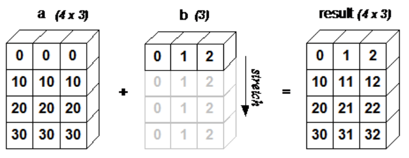

# numpy 学习笔记

## 1  ndarray 数组

### 1) 属性

#### ndim

`功能: 返回数组的维数，等于秩`

```python
import numpy as np

a = np.array([1,2,3],dtype=float)
print(a.ndim)
>>>
1
```


#### shape

`功能: 数组的维度，返回一个元组，这个元组的长度就是维度的数目，即 ndim 属性(秩)`

```python
import numpy as np

a = np.array([1,2,3],dtype=float)
print(a.shape)
>>>
(3,)
```


#### itemsize

`功能: 以字节的形式返回数组中每一个元素的大小, 如float64 的数组 itemsize 属性值为 8`

```python
import numpy as np

a = np.array([1,2,3,4],dtype=float)
print(a.itemsize)
>>>
8
```


#### size

`功能: 获取元素个数`

```python
import numpy as np

a = np.array([1,2,3,4],dtype=float)
print(a.size)
>>>
4
```


#### dtype

`功能: 获取元素类型`

```python
import numpy as np

a = np.array([1,2,3,4],dtype=float)
print(a.dtype)
>>>
float64
```


---


### 2) 创建数组

####  array()

`功能: 构建数组`

`参数: list + dtype(数据类型)`

```python
import numpy as np

a = np.array([1,2,3],dtype=float)
print(a)
>>>
[1. 2. 3.]
```


#### asarray()

`功能: 将不同的数据类型转换为 ndarray`

`numpy.asarray 类似 numpy.array，但 numpy.asarray 参数只有三个，比 numpy.array 少两个`

```python
import numpy as np

x = [1, 2, 3]
a = np.asarray(x)
print(a)
>>>
[1 2 3]
```


#### empty()

`功能: 创建一个指定形状（shape）、数据类型（dtype）且未初始化的数组`

`参数: shape(形状) dtype(数据类型) order(行优先/列优先)`

```python
import numpy as np

a = np.empty((2,3),dtype=float)
print(a)
>>>
[[1.19287531e-311 1.19287531e-311 1.19287531e-311]
 [1.19287531e-311 1.19287531e-311 1.19287531e-311]]
```


#### zeros()

`功能: 创建一个指定形状（shape）、数据类型（dtype）且数值为零的数组`

`参数: shape(形状) dtype(数据类型) order(行优先/列优先)`

```python
import numpy as np

a = np.zeros((2,3),dtype=float)
print(a)
>>>
[[0. 0. 0.]
 [0. 0. 0.]]
```


#### ones()

`功能: 创建一个指定形状（shape）、数据类型（dtype）且数值为 1 的数组`

`参数: shape(形状) dtype(数据类型) order(行优先/列优先)`

`功能: 创建一个指定形状（shape）、数据类型（dtype）且数值为零的数组`

`参数: shape(形状) dtype(数据类型) order(行优先/列优先)`

```python
import numpy as np

a = np.ones((2,3),dtype=float)
print(a)
>>>
[[1. 1. 1.]
 [1. 1. 1.]]
```


#### arange()

`功能: 根据 start 与 stop 指定的范围以及 step 设定的步长，生成一个 ndarray`

`参数: start - end   step(步长)   dtype(数据类型)`

```python
import numpy as np

a = np.arange(start=0,stop=5,step=1,dtype=float)
print(a)
>>>
[0. 1. 2. 3. 4.]
```


#### linspace()

**功能**

创建一个一维等差数组

**格式**

```
np.linspace(start, stop, num=50, endpoint=True, retstep=False, dtype=None)
```

|    参数    |                             描述                             |
| :--------: | :----------------------------------------------------------: |
|  `start`   |                         序列的起始值                         |
|   `stop`   |    序列的终止值，如果`endpoint`为`true`，该值包含于数列中    |
|   `num`    |             要生成的等步长的样本数量，默认为`50`             |
| `endpoint` | 该值为 `true` 时，数列中包含`stop`值，反之不包含，默认是True。 |
| `retstep`  |     如果为 True 时，生成的数组中会显示间距，反之不显示。     |
|  `dtype`   |                     `ndarray` 的数据类型                     |

```python
import numpy as np

a = np.linspace(start=1,stop=10,num=10,endpoint=True,retstep=True,dtype=float)
print(a)
>>>
(array([ 1.,  2.,  3.,  4.,  5.,  6.,  7.,  8.,  9., 10.]), 1.0)
```


#### logspace

**功能**

创建一个于等比数组

**格式**

```
np.logspace(start, stop, num=50, endpoint=True, base=10.0, dtype=None)
```

base 参数意思是取对数的时候 log 的下标。

| 参数       | 描述                                                         |
| :--------- | :----------------------------------------------------------- |
| `start`    | 序列的起始值为：base ** start                                |
| `stop`     | 序列的终止值为：base ** stop。如果`endpoint`为`true`，该值包含于数列中 |
| `num`      | 要生成的等步长的样本数量，默认为`50`                         |
| `endpoint` | 该值为 `true` 时，数列中中包含`stop`值，反之不包含，默认是True。 |
| `base`     | 对数 log 的底数。                                            |
| `dtype`    | `ndarray` 的数据类型                                         |

```python
import numpy as np

# 默认底数是 10
a = np.logspace(start=0,stop=9,num=10,endpoint=True,base=2,dtype=float)
print(a)
>>>
[  1.   2.   4.   8.  16.  32.  64. 128. 256. 512.]
```


### 3) 索引和切片

#### slince()

`功能: 对简单数组进行切片`

```
import numpy as np

a = np.arange(10)
s = slice(start=2,stop=7,step=2)  # 从索引 2 开始到索引 7 停止，间隔为2
print(a[s])
```


#### : 分隔符

`参数: start - stop - step`

```
import numpy as np

a = np.arange(10)
b = a[2:7:2]  # 从索引 2 开始到索引 7 停止，间隔为 2
print(b)
>>>
[2 4 6]
```


### 4) 广播

> **广播(Broadcast)** 是 numpy 对不同形状(shape)的数组进行数值计算的方式， 对数组的算术运算通常在相应的元素上进行。如果两个数组 a 和 b 形状相同，即满足 **a.shape == b.shape**，那么 a*b 的结果就是 a 与 b 数组对应位相乘。这要求维数相同，且各维度的长度相同。

- **相同形状**

  ```python
  import numpy as np
  
  a = np.array([1, 2, 3, 4])
  b = np.array([10, 20, 30, 40])
  c = a * b
  print(c)
  >>>
  [ 10  40  90 160]
  ```

  

- **不同形状**

  4x3 的二维数组与长为 3 的一维数组相加，等效于把数组 b 在二维上重复 4 次再运算：

  

  ```python
  import numpy as np
  
  a = np.array([[0, 0, 0],
                [10, 10, 10],
                [20, 20, 20],
                [30, 30, 30]])
  b = np.array([1, 2, 3])
  print(a + b)
  >>>
  [[ 1  2  3]
   [11 12 13]
   [21 22 23]
   [31 32 33]]
  ```

  

---


### 5) 迭代数组

> NumPy 迭代器对象 numpy.nditer 提供了一种灵活访问一个或者多个数组元素的方式。迭代器最基本的任务的可以完成对数组元素的访问。


- **使用 arange() 函数创建一个 2X3 数组，并使用 nditer 对它进行迭代**

  ```python
  import numpy as np
  
  a = np.arange(6).reshape(2, 3)
  print('原始数组是：\n',a)
  print('迭代输出元素：')
  for x in np.nditer(a):
      print(x, end=", ")
  >>>
  原始数组是：
   [[0 1 2]
   [3 4 5]]
  迭代输出元素：
  0, 1, 2, 3, 4, 5, 
  ```

- **nditer 切换行序与列序**

  ```python
  import numpy as np
  
  a = np.arange(0, 60, 5)
  a = a.reshape(3, 4)
  print('以 行序 风格顺序排序：')
  for x in np.nditer(a, order='C'):
      print(x, end=", ")
  print('\n以 列序 风格顺序排序：')
  for x in np.nditer(a, order='F'):
      print(x, end=", ")
  >>>
  以 行序 风格顺序排序：
  0, 5, 10, 15, 20, 25, 30, 35, 40, 45, 50, 55, 
  以 列序 风格顺序排序：
  0, 20, 40, 5, 25, 45, 10, 30, 50, 15, 35, 55, 
  ```

- **修改元素的值**

  nditer 对象有另一个可选参数 op_flags。 默认情况下，nditer 将视待迭代遍历的数组为只读对象（read-only），为了在遍历数组的同时，实现对数组元素值得修改，必须指定 read-write 或者 write-only 的模式。

  ```python
  import numpy as np
  
  a = np.arange(0, 60, 5)
  a = a.reshape(3, 4)
  print('原始数组是：')
  print(a)
  for x in np.nditer(a, op_flags=['readwrite']):
      x[...] = 2 * x
  print('修改后的数组是：')
  print(a)
  >>>
  原始数组是：
  [[ 0  5 10 15]
   [20 25 30 35]
   [40 45 50 55]]
  修改后的数组是：
  [[  0  10  20  30]
   [ 40  50  60  70]
   [ 80  90 100 110]]
  ```


### 6) 数组操作

#### reshape()

`功能: 调整数组大小,改变数组维度`

```python
import numpy as np

a = np.array([1,2,3,4],dtype=float)
b = a.reshape(2,2)
print(b)
>>>
[[1. 2.]
 [3. 4.]]
```


#### flat()

`功能: 迭代数组`

```python
import numpy as np

a = np.arange(9).reshape(3, 3)
print('原始数组：')
for row in a:
    print(row)
# 对数组中每个元素都进行处理，可以使用flat属性，该属性是一个数组元素迭代器：
print('迭代后的数组：')
for element in a.flat:
    print(element,end=',')
>>>
原始数组：
[0 1 2]
[3 4 5]
[6 7 8]
迭代后的数组：
0,1,2,3,4,5,6,7,8,
```


#### flatten()

`功能: 返回一份数组拷贝，对拷贝所做的修改不会影响原始数组`

`格式: ndarray.flatten(order='C')`

`参数: order：'C' -- 按行，'F' -- 按列，'A' -- 原顺序，'K' -- 元素在内存中的出现顺序。`

```python
import numpy as np
a = np.arange(8).reshape(2, 4)
print('原数组：')
print(a)

# 默认按行
print('展开的数组：')
print(a.flatten())

print('以 F 风格顺序展开的数组：')
print(a.flatten(order='F'))
>>>
原数组：
[[0 1 2 3]
 [4 5 6 7]]
展开的数组：
[0 1 2 3 4 5 6 7]
以 F 风格顺序展开的数组：
[0 4 1 5 2 6 3 7]
```


#### ravel()

`功能: 展平的数组元素，顺序通常是"C风格"，返回数组视图（view，有点类似 C/C++引用reference的意味）`**修改会影响原始数组**

`格式: numpy.ravel(a, order='C')`

`参数: order：'C' -- 按行，'F' -- 按列，'A' -- 原顺序，'K' -- 元素在内存中的出现顺序。`

```python
import numpy as np

a = np.arange(8).reshape(2, 4)

print('原数组：')
print(a)
print('调用 ravel 函数之后：')
print(a.ravel())
print('以 F 风格顺序调用 ravel 函数之后：')
print(a.ravel(order='F'))
>>>
原数组：
[[0 1 2 3]
 [4 5 6 7]]
调用 ravel 函数之后：
[0 1 2 3 4 5 6 7]
以 F 风格顺序调用 ravel 函数之后：
[0 4 1 5 2 6 3 7]
```


### 7) 翻转数组

#### transpose()

**功能**

numpy.transpose 函数用于**对换数组的维度**

**格式**

```
numpy.transpose(arr, axes)
```

**参数说明**

- `arr`：要操作的数组
- `axes`：整数列表，对应维度，通常所有维度都会对换。

```python
import numpy as np

a = np.arange(12).reshape(3, 4)

print('原数组：')
print(a)
print('\n')

print('对换数组：')
print(np.transpose(a))
>>>
原数组：
[[ 0  1  2  3]
 [ 4  5  6  7]
 [ 8  9 10 11]]
对换数组：
[[ 0  4  8]
 [ 1  5  9]
 [ 2  6 10]
 [ 3  7 11]]
```


### 8) 修改数组维度

#### expand_dims()

numpy.expand_dims 函数通过在指定位置插入新的轴来扩展数组形状，函数格式如下:

```
 numpy.expand_dims(arr, axis)
```

参数说明：

- `arr`：输入数组
- `axis`：新轴插入的位置

```python
import numpy as np

x = np.array(([1, 2], [3, 4]))
print(x.shape)
y = np.expand_dims(x,axis=0)
print(y.shape)
z = np.expand_dims(x,axis=1)
print(z.shape)
l = np.expand_dims(x,axis=2)
print(l.shape)
>>>
(2, 2)
(1, 2, 2)
(2, 1, 2)
(2, 2, 1)
```


#### squeeze()

`numpy.squeeze` 函数从给定数组的形状中删除一维的条目，函数格式如下：

```
numpy.squeeze(arr, axis)
```

**参数说明**

- `arr`：输入数组
- `axis`：整数或整数元组，用于选择形状中一维条目的子集

```python
import numpy as np

x = np.arange(9).reshape(1,3,3)
print(x.shape)
y = np.squeeze(x,axis=0)
print(y.shape)
>>>
(1, 3, 3)
(3, 3)
```


### 9) 连接数组

#### concatenate()

concatenate 函数用于沿指定轴连接相同形状的两个或多个数组，格式如下：

```
numpy.concatenate((a1, a2, ...), axis)
```

**参数说明**

- `a1, a2, ...`：相同类型的数组
- `axis`：沿着它连接数组的轴，默认为 0

```python
import numpy as np

a = np.array([[1, 2], [3, 4]])
print('第一个数组：')
print(a)
b = np.array([[5, 6], [7, 8]])
print('第二个数组：')
print(b)
# 两个数组的维度相同
print('沿轴 0 连接两个数组：')
print(np.concatenate((a, b)))
print('沿轴 1 连接两个数组：')
print(np.concatenate((a, b), axis=1))
>>>
第一个数组：
[[1 2]
 [3 4]]
第二个数组：
[[5 6]
 [7 8]]
沿轴 0 连接两个数组：
[[1 2]
 [3 4]
 [5 6]
 [7 8]]
沿轴 1 连接两个数组：
[[1 2 5 6]
 [3 4 7 8]]
```


#### stack()

numpy.stack 函数用于沿新轴连接数组序列，格式如下：

```
numpy.stack(arrays, axis)
```

**参数说明**

- `arrays`相同形状的数组序列
- `axis`：返回数组中的轴，输入数组沿着它来堆叠

```python
import numpy as np

a = np.array([[1, 2], [3, 4]])

print('第一个数组：')
print(a)
b = np.array([[5, 6], [7, 8]])

print('第二个数组：')
print(b)

print('沿轴 0 堆叠两个数组：')
print(np.stack((a, b), 0))
print('沿轴 1 堆叠两个数组：')
print(np.stack((a, b), 1))
>>>
第一个数组：
[[1 2]
 [3 4]]
第二个数组：
[[5 6]
 [7 8]]
沿轴 0 堆叠两个数组：
[[[1 2]
  [3 4]]

 [[5 6]
  [7 8]]]
沿轴 1 堆叠两个数组：
[[[1 2]
  [5 6]]

 [[3 4]
  [7 8]]]
```


#### hstack()

numpy.hstack 是 numpy.stack 函数的变体，它通过水平堆叠来生成数组。

```python
import numpy as np

a = np.array([[1, 2], [3, 4]])
print('第一个数组：')
print(a)
b = np.array([[5, 6], [7, 8]])
print('第二个数组：')
print(b)
print('水平堆叠：')
c = np.hstack((a, b))
print(c)
>>>
第一个数组：
[[1 2]
 [3 4]]
第二个数组：
[[5 6]
 [7 8]]
水平堆叠：
[[1 2 5 6]
 [3 4 7 8]]
```


#### vstack()

numpy.vstack 是 numpy.stack 函数的变体，它通过垂直堆叠来生成数组。

```python
import numpy as np

a = np.array([[1, 2], [3, 4]])

print('第一个数组：')
print(a)
b = np.array([[5, 6], [7, 8]])
print('第二个数组：')
print(b)
print('竖直堆叠：')
c = np.vstack((a, b))
print(c)
>>>
第一个数组：
[[1 2]
 [3 4]]
第二个数组：
[[5 6]
 [7 8]]
竖直堆叠：
[[1 2]
 [3 4]
 [5 6]
 [7 8]]
```


### 10)分割数组

#### split()

split 函数沿特定的轴将数组分割为子数组，格式如下：

```
numpy.split(ary, indices_or_sections, axis)
```

参数说明：

- `ary`：被分割的数组
- `indices_or_sections`：如果是一个整数，就用该数平均切分，如果是一个数组，为沿轴切分的位置（左开右闭）
- `axis`：设置沿着哪个方向进行切分，默认为 0，横向切分，即水平方向。为 1 时，纵向切分，即竖直方向。

```python
import numpy as np
 
a = np.arange(9)
 
print ('第一个数组：')
print (a)
print ('\n')
 
print ('将数组分为三个大小相等的子数组：')
b = np.split(a,3)
print (b)
print ('\n')
 
print ('将数组在一维数组中表明的位置分割：')
b = np.split(a,[4,7])
print (b)
>>>
第一个数组：
[0 1 2 3 4 5 6 7 8]
将数组分为三个大小相等的子数组：
[array([0, 1, 2]), array([3, 4, 5]), array([6, 7, 8])]
将数组在一维数组中表明的位置分割：
[array([0, 1, 2, 3]), array([4, 5, 6]), array([7, 8])]
```


#### hsplit()

numpy.hsplit 函数用于水平分割数组，通过指定要返回的相同形状的数组数量来拆分原数组。

```python
import numpy as np
 
harr = np.floor(10 * np.random.random((2, 6)))
print ('原array：')
print(harr)
 
print ('拆分后：')
print(np.hsplit(harr, 3))
>>>
原array：
[[8. 7. 5. 5. 6. 2.]
 [6. 3. 5. 7. 3. 2.]]
拆分后：
[array([[8., 7.],
       [6., 3.]]), 
 array([[5., 5.],
       [5., 7.]]), 
 array([[6., 2.],
       [3., 2.]])]
```


#### vsplit()

vsplit 沿着垂直轴分割，其分割方式与hsplit用法相同。

```python
import numpy as np

a = np.arange(16).reshape(4, 4)
print('第一个数组：')
print(a)
print('竖直分割：')
b = np.vsplit(a, 2)
print(b)
>>>
第一个数组：
[[ 0  1  2  3]
 [ 4  5  6  7]
 [ 8  9 10 11]
 [12 13 14 15]]
竖直分割：
[array([[0, 1, 2, 3],
       [4, 5, 6, 7]]), 
 array([[ 8,  9, 10, 11],
       [12, 13, 14, 15]])]
```


### 11) 数组的添加与删除

#### resize()

resize 函数返回指定大小的新数组。如果新数组大小大于原始大小，则包含原始数组中的元素的副本。

```
numpy.resize(arr, shape)
```

**参数说明**

- `arr`：要修改大小的数组
- `shape`：返回数组的新形状

```python
import numpy as np

a = np.array([[1, 2, 3], [4, 5, 6]])
print(a)
print(a.shape)
print ('修改后：')
b = np.resize(a, (3, 2))
print(b)
print(b.shape)
>>>
[[1 2 3]
 [4 5 6]]
(2, 3)
修改后：
[[1 2]
 [3 4]
 [5 6]]
(3, 2)
```


#### append()

`append` 函数在数组的末尾添加值。 追加操作会分配整个数组，并把原来的数组复制到新数组中。 此外，输入数组的维度必须匹配否则将生成 `ValueError`。

`append` 函数返回的始终是一个一维数组。

```python
numpy.append(arr, values, axis=None)
```

**参数说明**

- `arr`：输入数组
- `values`：要向`arr`添加的值，需要和`arr`形状相同（除了要添加的轴）
- `axis`：默认为 None。当axis无定义时，是横向加成，返回总是为一维数组！当axis有定义的时候，分别为0和1的时候。当axis有定义的时候，分别为0和1的时候（列数要相同）。当axis为1时，数组是加在右边（行数要相同）。

```python
import numpy as np

a = np.array([[1, 2, 3], [4, 5, 6]])

print('数组：')
print(a)
print('向数组添加元素：')
print(np.append(a, [7, 8, 9]))

print('沿轴 0 添加元素：')
print(np.append(a, [[7, 8, 9]], axis=0))

print('沿轴 1 添加元素：')
print(np.append(a, [[7, 8, 9], [7, 8, 9]], axis=1))
>>>
数组：
[[1 2 3]
 [4 5 6]]
向数组添加元素：
[1 2 3 4 5 6 7 8 9]
沿轴 0 添加元素：
[[1 2 3]
 [4 5 6]
 [7 8 9]]
沿轴 1 添加元素：
[[1 2 3 7 8 9]
 [4 5 6 7 8 9]]
```


#### insert()

insert 函数在给定索引之前，沿给定轴在输入数组中插入值。

如果值的类型转换为要插入，则它与输入数组不同。 插入没有原地的，函数会返回一个新数组。 此外，如果未提供轴，则输入数组会被展开。

```
numpy.insert(arr, obj, values, axis)
```

**参数说明**

- `arr`：输入数组
- `obj`：在其之前插入值的索引
- `values`：要插入的值
- `axis`：沿着它插入的轴，如果未提供，则输入数组会被展开

```python
import numpy as np

a = np.array([[1, 2], [3, 4], [5, 6]])

print('第一个数组：')
print(a)
print('未传递 Axis 参数。 在删除之前输入数组会被展开。')
print(np.insert(a, 3, [11, 12]))
print('传递了 Axis 参数。 会广播值数组来配输入数组。')
print('沿轴 0 广播：')
print(np.insert(a, 1, [11], axis=0))
print('沿轴 1 广播：')
print(np.insert(a, 1, 11, axis=1))
>>>
第一个数组：
[[1 2]
 [3 4]
 [5 6]]
未传递 Axis 参数。 在删除之前输入数组会被展开。
[ 1  2  3 11 12  4  5  6]
传递了 Axis 参数。 会广播值数组来配输入数组。
沿轴 0 广播：
[[ 1  2]
 [11 11]
 [ 3  4]
 [ 5  6]]
沿轴 1 广播：
[[ 1 11  2]
 [ 3 11  4]
 [ 5 11  6]]
```


#### delete

numpy.delete 函数返回从输入数组中删除指定子数组的新数组。 与 insert() 函数的情况一样，如果未提供轴参数，则输入数组将展开。

```
Numpy.delete(arr, obj, axis)
```

参数说明：

- `arr`：输入数组
- `obj`：可以被切片，整数或者整数数组，表明要从输入数组删除的子数组
- `axis`：沿着它删除给定子数组的轴，如果未提供，则输入数组会被展开

```python
import numpy as np

a = np.arange(12).reshape(3, 4)

print('第一个数组：')
print(a)

print('未传递 Axis 参数。 在插入之前输入数组会被展开。')
print(np.delete(a, 5))

print('删除第二列：')
print(np.delete(a, 1, axis=1))

print('包含从数组中删除的替代值的切片：')
a = np.array([1, 2, 3, 4, 5, 6, 7, 8, 9, 10])
print(np.delete(a, np.s_[::2]))
>>>
第一个数组：
[[ 0  1  2  3]
 [ 4  5  6  7]
 [ 8  9 10 11]]
未传递 Axis 参数。 在插入之前输入数组会被展开。
[ 0  1  2  3  4  6  7  8  9 10 11]
删除第二列：
[[ 0  2  3]
 [ 4  6  7]
 [ 8 10 11]]
包含从数组中删除的替代值的切片：
[ 2  4  6  8 10]
```


#### unique

numpy.unique 函数用于去除数组中的重复元素。

```
numpy.unique(arr, return_index, return_inverse, return_counts)
```

- `arr`：输入数组，如果不是一维数组则会展开
- `return_index`：如果为`true`，返回新列表元素在旧列表中的位置（下标），并以列表形式储
- `return_inverse`：如果为`true`，返回旧列表元素在新列表中的位置（下标），并以列表形式储
- `return_counts`：如果为`true`，返回去重数组中的元素在原数组中的出现次数

```python
import numpy as np

a = np.array([5, 2, 6, 2, 7, 5, 6, 8, 2, 9])

print('第一个数组：')
print(a)

print('第一个数组的去重值：')
u = np.unique(a)
print(u)

print('去重数组的索引数组：')
u, indices = np.unique(a, return_index=True)
print(indices)

print('我们可以看到每个和原数组下标对应的数值：')
print(a)

print('去重数组的下标：')
u, indices = np.unique(a, return_inverse=True)
print(u)

print('下标为：')
print(indices)

print('使用下标重构原数组：')
print(u[indices])

print('返回去重元素的重复数量：')
u, indices = np.unique(a, return_counts=True)
print(u)
print(indices)
>>>
第一个数组：
[5 2 6 2 7 5 6 8 2 9]
第一个数组的去重值：
[2 5 6 7 8 9]
去重数组的索引数组：
[1 0 2 4 7 9]
我们可以看到每个和原数组下标对应的数值：
[5 2 6 2 7 5 6 8 2 9]
去重数组的下标：
[2 5 6 7 8 9]
下标为：
[1 0 2 0 3 1 2 4 0 5]
使用下标重构原数组：
[5 2 6 2 7 5 6 8 2 9]
返回去重元素的重复数量：
[2 5 6 7 8 9]
[3 2 2 1 1 1]
```


