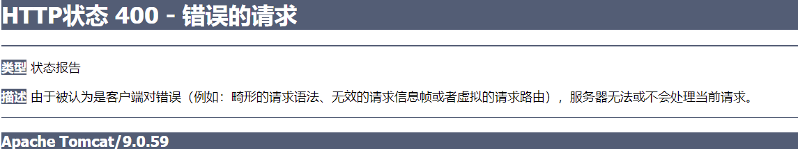
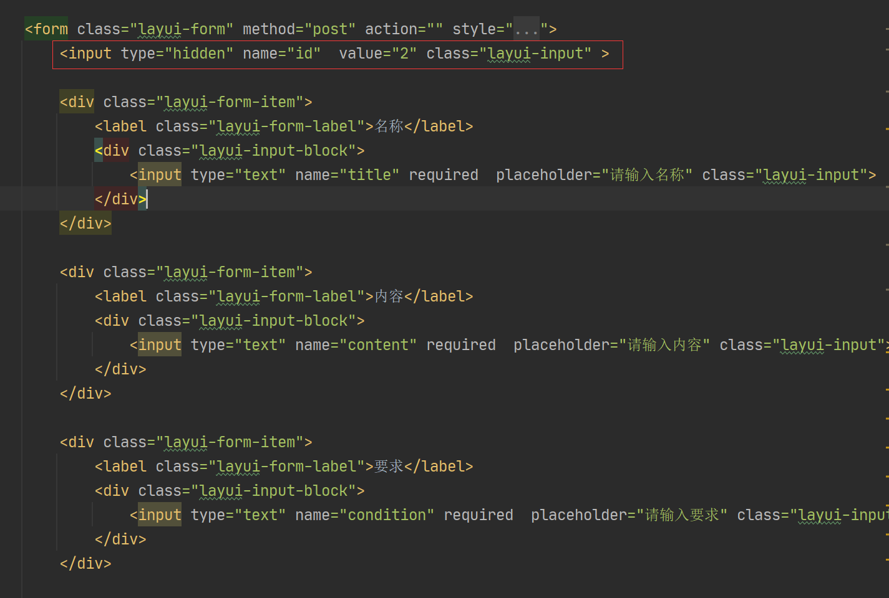
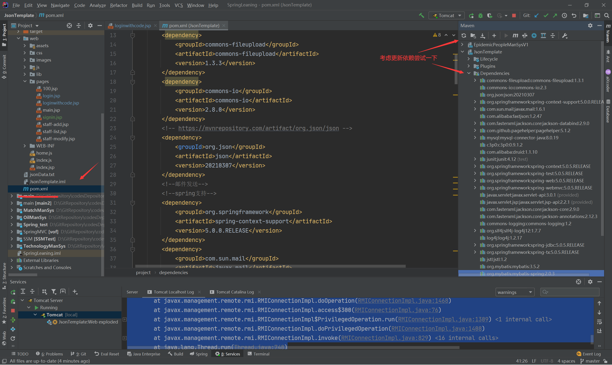
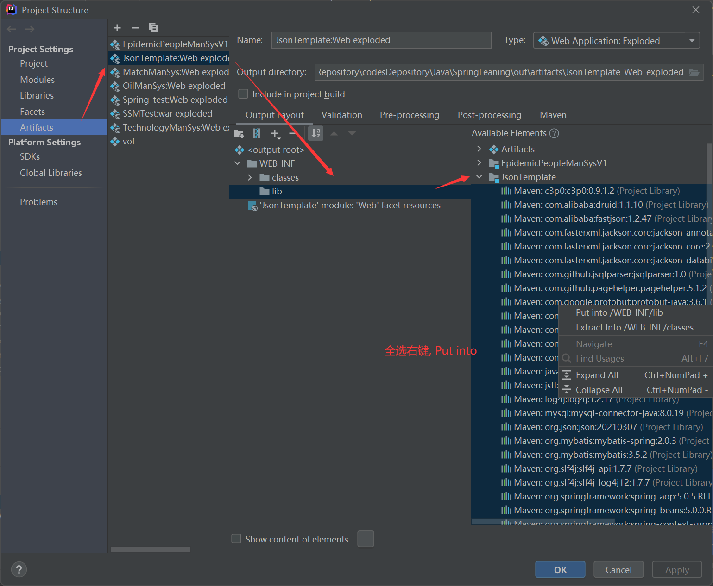
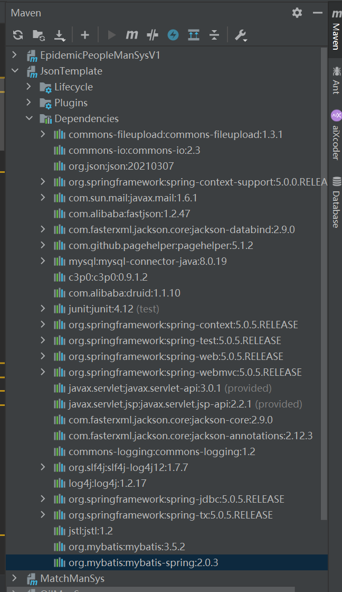
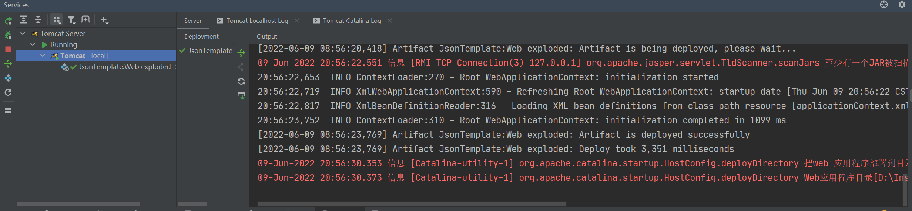

# HTTP状态 400 - 错误的请求

## 错误日志




---


## 问题

SSM 项目, 前段使用 `ajax` 向后台 `post` 表单时报 `400错误`

---


## 解决办法

使用 `ajax` 发送表单提交请求时报错。 原因是提交的表单属性和实体类属性无法对应,因为数据库使用的 `id` 是自增的主键, 便没有在表单中添加 `id` 属性, 所以这里报错了。后面添加对应的 id 属性, 后台置 `null` 即可。 

**注意检查自己是否漏写了某个属性 或者 写错了前端标签的 `name` 名称。** 



---


# SSM 部署项目时出现的 java.lang.ClassNotFoundException 错误

## 问题描述

`当部署 SSM项目 到 tomcat时出现找不到类的错误,查看 pom.xml 和 maven dependency 包都存在,但是项目跑不通报错。`


## 错误日志

```cmd
java.lang.ClassNotFoundException: org.springframework.web.context.ContextLoaderListener
		at org.apache.catalina.loader.WebappClassLoaderBase.loadClass(WebappClassLoaderBase.java:1407)
		at org.apache.catalina.loader.WebappClassLoaderBase.loadClass(WebappClassLoaderBase.java:1215)
		at org.apache.catalina.core.DefaultInstanceManager.loadClass(DefaultInstanceManager.java:534)
		at org.apache.catalina.core.DefaultInstanceManager.loadClassMaybePrivileged(DefaultInstanceManager.java:515)
		at org.apache.catalina.core.DefaultInstanceManager.newInstance(DefaultInstanceManager.java:149)
		at org.apache.catalina.core.StandardContext.listenerStart(StandardContext.java:4691)
		at org.apache.catalina.core.StandardContext.startInternal(StandardContext.java:5230)
		at org.apache.catalina.util.LifecycleBase.start(LifecycleBase.java:183)
		at org.apache.catalina.core.ContainerBase.addChildInternal(ContainerBase.java:726)
		at org.apache.catalina.core.ContainerBase.addChild(ContainerBase.java:698)
		at org.apache.catalina.core.StandardHost.addChild(StandardHost.java:696)
		at org.apache.catalina.startup.HostConfig.manageApp(HostConfig.java:1783)
		at sun.reflect.NativeMethodAccessorImpl.invoke0(Native Method)
		at sun.reflect.NativeMethodAccessorImpl.invoke(NativeMethodAccessorImpl.java:62)
		at sun.reflect.DelegatingMethodAccessorImpl.invoke(DelegatingMethodAccessorImpl.java:43)
		at java.lang.reflect.Method.invoke(Method.java:498)
		at org.apache.tomcat.util.modeler.BaseModelMBean.invoke(BaseModelMBean.java:293)
		at com.sun.jmx.interceptor.DefaultMBeanServerInterceptor.invoke(DefaultMBeanServerInterceptor.java:819)
		at com.sun.jmx.mbeanserver.JmxMBeanServer.invoke(JmxMBeanServer.java:801)
		at org.apache.catalina.mbeans.MBeanFactory.createStandardContext(MBeanFactory.java:460)
		at org.apache.catalina.mbeans.MBeanFactory.createStandardContext(MBeanFactory.java:408)
		at sun.reflect.NativeMethodAccessorImpl.invoke0(Native Method)
		at sun.reflect.NativeMethodAccessorImpl.invoke(NativeMethodAccessorImpl.java:62)
		at sun.reflect.DelegatingMethodAccessorImpl.invoke(DelegatingMethodAccessorImpl.java:43)
		at java.lang.reflect.Method.invoke(Method.java:498)
		at org.apache.tomcat.util.modeler.BaseModelMBean.invoke(BaseModelMBean.java:293)
		at com.sun.jmx.interceptor.DefaultMBeanServerInterceptor.invoke(DefaultMBeanServerInterceptor.java:819)
		at com.sun.jmx.mbeanserver.JmxMBeanServer.invoke(JmxMBeanServer.java:801)
		at com.sun.jmx.remote.security.MBeanServerAccessController.invoke(MBeanServerAccessController.java:468)
		at javax.management.remote.rmi.RMIConnectionImpl.doOperation(RMIConnectionImpl.java:1468)
		at javax.management.remote.rmi.RMIConnectionImpl.access$300(RMIConnectionImpl.java:76)
		at javax.management.remote.rmi.RMIConnectionImpl$PrivilegedOperation.run(RMIConnectionImpl.java:1309)
		at java.security.AccessController.doPrivileged(Native Method)
		at javax.management.remote.rmi.RMIConnectionImpl.doPrivilegedOperation(RMIConnectionImpl.java:1408)
		at javax.management.remote.rmi.RMIConnectionImpl.invoke(RMIConnectionImpl.java:829)
		at sun.reflect.NativeMethodAccessorImpl.invoke0(Native Method)
		at sun.reflect.NativeMethodAccessorImpl.invoke(NativeMethodAccessorImpl.java:62)
		at sun.reflect.DelegatingMethodAccessorImpl.invoke(DelegatingMethodAccessorImpl.java:43)
		at java.lang.reflect.Method.invoke(Method.java:498)
		at sun.rmi.server.UnicastServerRef.dispatch(UnicastServerRef.java:346)
		at sun.rmi.transport.Transport$1.run(Transport.java:200)
		at sun.rmi.transport.Transport$1.run(Transport.java:197)
		at java.security.AccessController.doPrivileged(Native Method)
		at sun.rmi.transport.Transport.serviceCall(Transport.java:196)
		at sun.rmi.transport.tcp.TCPTransport.handleMessages(TCPTransport.java:568)
		at sun.rmi.transport.tcp.TCPTransport$ConnectionHandler.run0(TCPTransport.java:826)
		at sun.rmi.transport.tcp.TCPTransport$ConnectionHandler.lambda$run$0(TCPTransport.java:683)
		at java.security.AccessController.doPrivileged(Native Method)
		at sun.rmi.transport.tcp.TCPTransport$ConnectionHandler.run(TCPTransport.java:682)
		at java.util.concurrent.ThreadPoolExecutor.runWorker(ThreadPoolExecutor.java:1142)
		at java.util.concurrent.ThreadPoolExecutor$Worker.run(ThreadPoolExecutor.java:617)
		at java.lang.Thread.run(Thread.java:748)
```


## 解决办法

### ① 查看 pom.xml 是否导入当前包, 依赖是否存在




### ② 依赖没有部署到服务器上, 导致服务器无法运行(我遇到的问题)

`左上角 File > Project Structure > Actifacts > 打开module`

`将 maven 的依赖包配置到 WEB-INF 的 lib 目录下, 重新运行即可。`




### Success~


---


# 启动SSM项目出现 java.lang.NoSuchMethodError: org.springframework.core.annotation.AnnotationUtils.clearCache()V 问题

## 问题描述

`当启动 SSM项目出现如上报错。`


## 错误日志

```cmd
java.lang.NoSuchMethodError: org.springframework.core.annotation.AnnotationUtils.clearCache()V
	at org.springframework.context.support.AbstractApplicationContext.resetCommonCaches(AbstractApplicationContext.java:915)
	at org.springframework.context.support.AbstractApplicationContext.refresh(AbstractApplicationContext.java:575)
	at org.springframework.web.context.ContextLoader.configureAndRefreshWebApplicationContext(ContextLoader.java:409)
	at org.springframework.web.context.ContextLoader.initWebApplicationContext(ContextLoader.java:291)
	at org.springframework.web.context.ContextLoaderListener.contextInitialized(ContextLoaderListener.java:103)
	at org.apache.catalina.core.StandardContext.listenerStart(StandardContext.java:4768)
	at org.apache.catalina.core.StandardContext.startInternal(StandardContext.java:5230)
	at org.apache.catalina.util.LifecycleBase.start(LifecycleBase.java:183)
	at org.apache.catalina.core.ContainerBase.addChildInternal(ContainerBase.java:726)
	at org.apache.catalina.core.ContainerBase.addChild(ContainerBase.java:698)
	at org.apache.catalina.core.StandardHost.addChild(StandardHost.java:696)
	at org.apache.catalina.startup.HostConfig.manageApp(HostConfig.java:1783)
	at sun.reflect.NativeMethodAccessorImpl.invoke0(Native Method)
	at sun.reflect.NativeMethodAccessorImpl.invoke(NativeMethodAccessorImpl.java:62)
	at sun.reflect.DelegatingMethodAccessorImpl.invoke(DelegatingMethodAccessorImpl.java:43)
	at java.lang.reflect.Method.invoke(Method.java:498)
	at org.apache.tomcat.util.modeler.BaseModelMBean.invoke(BaseModelMBean.java:293)
	at com.sun.jmx.interceptor.DefaultMBeanServerInterceptor.invoke(DefaultMBeanServerInterceptor.java:819)
	at com.sun.jmx.mbeanserver.JmxMBeanServer.invoke(JmxMBeanServer.java:801)
	at org.apache.catalina.mbeans.MBeanFactory.createStandardContext(MBeanFactory.java:460)
	at org.apache.catalina.mbeans.MBeanFactory.createStandardContext(MBeanFactory.java:408)
	at sun.reflect.NativeMethodAccessorImpl.invoke0(Native Method)
	at sun.reflect.NativeMethodAccessorImpl.invoke(NativeMethodAccessorImpl.java:62)
	at sun.reflect.DelegatingMethodAccessorImpl.invoke(DelegatingMethodAccessorImpl.java:43)
	at java.lang.reflect.Method.invoke(Method.java:498)
	at org.apache.tomcat.util.modeler.BaseModelMBean.invoke(BaseModelMBean.java:293)
	at com.sun.jmx.interceptor.DefaultMBeanServerInterceptor.invoke(DefaultMBeanServerInterceptor.java:819)
	at com.sun.jmx.mbeanserver.JmxMBeanServer.invoke(JmxMBeanServer.java:801)
	at com.sun.jmx.remote.security.MBeanServerAccessController.invoke(MBeanServerAccessController.java:468)
	at javax.management.remote.rmi.RMIConnectionImpl.doOperation(RMIConnectionImpl.java:1468)
	at javax.management.remote.rmi.RMIConnectionImpl.access$300(RMIConnectionImpl.java:76)
	at javax.management.remote.rmi.RMIConnectionImpl$PrivilegedOperation.run(RMIConnectionImpl.java:1309)
	at java.security.AccessController.doPrivileged(Native Method)
	at javax.management.remote.rmi.RMIConnectionImpl.doPrivilegedOperation(RMIConnectionImpl.java:1408)
	at javax.management.remote.rmi.RMIConnectionImpl.invoke(RMIConnectionImpl.java:829)
	at sun.reflect.NativeMethodAccessorImpl.invoke0(Native Method)
	at sun.reflect.NativeMethodAccessorImpl.invoke(NativeMethodAccessorImpl.java:62)
	at sun.reflect.DelegatingMethodAccessorImpl.invoke(DelegatingMethodAccessorImpl.java:43)
	at java.lang.reflect.Method.invoke(Method.java:498)
	at sun.rmi.server.UnicastServerRef.dispatch(UnicastServerRef.java:346)
	at sun.rmi.transport.Transport$1.run(Transport.java:200)
	at sun.rmi.transport.Transport$1.run(Transport.java:197)
	at java.security.AccessController.doPrivileged(Native Method)
	at sun.rmi.transport.Transport.serviceCall(Transport.java:196)
	at sun.rmi.transport.tcp.TCPTransport.handleMessages(TCPTransport.java:568)
	at sun.rmi.transport.tcp.TCPTransport$ConnectionHandler.run0(TCPTransport.java:826)
	at sun.rmi.transport.tcp.TCPTransport$ConnectionHandler.lambda$run$0(TCPTransport.java:683)
	at java.security.AccessController.doPrivileged(Native Method)
	at sun.rmi.transport.tcp.TCPTransport$ConnectionHandler.run(TCPTransport.java:682)
	at java.util.concurrent.ThreadPoolExecutor.runWorker(ThreadPoolExecutor.java:1142)
	at java.util.concurrent.ThreadPoolExecutor$Worker.run(ThreadPoolExecutor.java:617)
	at java.lang.Thread.run(Thread.java:748)

```


## 解决办法

`这是因为导入的 jar 包存在冲突, 仔细查找一下, 把冲突的 jar 包移除即可`

`左上角 File > Project Structure > Actifacts > 打开module`


`或者你可以在 pom 文件中查看引入的 springframework 相关包版本是否一致`




## success~



---


#  SSM 创建多个 bean 出现 org.springframework.beans.factory.BeanDefinitionStoreException 问题

## 问题描述

`当启动 SSM项目时, 由于需要引入 mail 和 数据库 的两个 bean 依赖导致出现如上报错。`


## 错误日志

```cmd
org.springframework.beans.factory.BeanDefinitionStoreException: Invalid bean definition with name 'dataSource' defined in class path resource [applicationContext.xml]: Could not resolve placeholder 'driver' in value "${driver}"; nested exception is java.lang.IllegalArgumentException: Could not resolve placeholder 'driver' in value "${driver}"
	at org.springframework.beans.factory.config.PlaceholderConfigurerSupport.doProcessProperties(PlaceholderConfigurerSupport.java:228)
	at org.springframework.context.support.PropertySourcesPlaceholderConfigurer.processProperties(PropertySourcesPlaceholderConfigurer.java:182)
	at org.springframework.context.support.PropertySourcesPlaceholderConfigurer.postProcessBeanFactory(PropertySourcesPlaceholderConfigurer.java:157)
	at org.springframework.context.support.PostProcessorRegistrationDelegate.invokeBeanFactoryPostProcessors(PostProcessorRegistrationDelegate.java:284)
	at org.springframework.context.support.PostProcessorRegistrationDelegate.invokeBeanFactoryPostProcessors(PostProcessorRegistrationDelegate.java:164)
	at org.springframework.context.support.AbstractApplicationContext.invokeBeanFactoryPostProcessors(AbstractApplicationContext.java:694)
	at org.springframework.context.support.AbstractApplicationContext.refresh(AbstractApplicationContext.java:532)
	at org.springframework.web.context.ContextLoader.configureAndRefreshWebApplicationContext(ContextLoader.java:409)
	at org.springframework.web.context.ContextLoader.initWebApplicationContext(ContextLoader.java:291)
	at org.springframework.web.context.ContextLoaderListener.contextInitialized(ContextLoaderListener.java:103)
	at org.apache.catalina.core.StandardContext.listenerStart(StandardContext.java:4768)
	at org.apache.catalina.core.StandardContext.startInternal(StandardContext.java:5230)
	at org.apache.catalina.util.LifecycleBase.start(LifecycleBase.java:183)
	at org.apache.catalina.core.ContainerBase.addChildInternal(ContainerBase.java:726)
	at org.apache.catalina.core.ContainerBase.addChild(ContainerBase.java:698)
	at org.apache.catalina.core.StandardHost.addChild(StandardHost.java:696)
	at org.apache.catalina.startup.HostConfig.manageApp(HostConfig.java:1783)
	at sun.reflect.NativeMethodAccessorImpl.invoke0(Native Method)
	at sun.reflect.NativeMethodAccessorImpl.invoke(NativeMethodAccessorImpl.java:62)
	at sun.reflect.DelegatingMethodAccessorImpl.invoke(DelegatingMethodAccessorImpl.java:43)
	at java.lang.reflect.Method.invoke(Method.java:498)
	at org.apache.tomcat.util.modeler.BaseModelMBean.invoke(BaseModelMBean.java:293)
	at com.sun.jmx.interceptor.DefaultMBeanServerInterceptor.invoke(DefaultMBeanServerInterceptor.java:819)
	at com.sun.jmx.mbeanserver.JmxMBeanServer.invoke(JmxMBeanServer.java:801)
	at org.apache.catalina.mbeans.MBeanFactory.createStandardContext(MBeanFactory.java:460)
	at org.apache.catalina.mbeans.MBeanFactory.createStandardContext(MBeanFactory.java:408)
	at sun.reflect.NativeMethodAccessorImpl.invoke0(Native Method)
	at sun.reflect.NativeMethodAccessorImpl.invoke(NativeMethodAccessorImpl.java:62)
	at sun.reflect.DelegatingMethodAccessorImpl.invoke(DelegatingMethodAccessorImpl.java:43)
	at java.lang.reflect.Method.invoke(Method.java:498)
	at org.apache.tomcat.util.modeler.BaseModelMBean.invoke(BaseModelMBean.java:293)
	at com.sun.jmx.interceptor.DefaultMBeanServerInterceptor.invoke(DefaultMBeanServerInterceptor.java:819)
	at com.sun.jmx.mbeanserver.JmxMBeanServer.invoke(JmxMBeanServer.java:801)
	at com.sun.jmx.remote.security.MBeanServerAccessController.invoke(MBeanServerAccessController.java:468)
	at javax.management.remote.rmi.RMIConnectionImpl.doOperation(RMIConnectionImpl.java:1468)
	at javax.management.remote.rmi.RMIConnectionImpl.access$300(RMIConnectionImpl.java:76)
	at javax.management.remote.rmi.RMIConnectionImpl$PrivilegedOperation.run(RMIConnectionImpl.java:1309)
	at java.security.AccessController.doPrivileged(Native Method)
	at javax.management.remote.rmi.RMIConnectionImpl.doPrivilegedOperation(RMIConnectionImpl.java:1408)
	at javax.management.remote.rmi.RMIConnectionImpl.invoke(RMIConnectionImpl.java:829)
	at sun.reflect.NativeMethodAccessorImpl.invoke0(Native Method)
	at sun.reflect.NativeMethodAccessorImpl.invoke(NativeMethodAccessorImpl.java:62)
	at sun.reflect.DelegatingMethodAccessorImpl.invoke(DelegatingMethodAccessorImpl.java:43)
	at java.lang.reflect.Method.invoke(Method.java:498)
	at sun.rmi.server.UnicastServerRef.dispatch(UnicastServerRef.java:346)
	at sun.rmi.transport.Transport$1.run(Transport.java:200)
	at sun.rmi.transport.Transport$1.run(Transport.java:197)
	at java.security.AccessController.doPrivileged(Native Method)
	at sun.rmi.transport.Transport.serviceCall(Transport.java:196)
	at sun.rmi.transport.tcp.TCPTransport.handleMessages(TCPTransport.java:568)
	at sun.rmi.transport.tcp.TCPTransport$ConnectionHandler.run0(TCPTransport.java:826)
	at sun.rmi.transport.tcp.TCPTransport$ConnectionHandler.lambda$run$0(TCPTransport.java:683)
	at java.security.AccessController.doPrivileged(Native Method)
	at sun.rmi.transport.tcp.TCPTransport$ConnectionHandler.run(TCPTransport.java:682)
	at java.util.concurrent.ThreadPoolExecutor.runWorker(ThreadPoolExecutor.java:1142)
	at java.util.concurrent.ThreadPoolExecutor$Worker.run(ThreadPoolExecutor.java:617)
	at java.lang.Thread.run(Thread.java:748)
Caused by: java.lang.IllegalArgumentException: Could not resolve placeholder 'driver' in value "${driver}"
	at org.springframework.util.PropertyPlaceholderHelper.parseStringValue(PropertyPlaceholderHelper.java:172)
	at org.springframework.util.PropertyPlaceholderHelper.replacePlaceholders(PropertyPlaceholderHelper.java:124)
	at org.springframework.core.env.AbstractPropertyResolver.doResolvePlaceholders(AbstractPropertyResolver.java:237)
	at org.springframework.core.env.AbstractPropertyResolver.resolveRequiredPlaceholders(AbstractPropertyResolver.java:211)
	at org.springframework.context.support.PropertySourcesPlaceholderConfigurer.lambda$processProperties$0(PropertySourcesPlaceholderConfigurer.java:175)
	at org.springframework.beans.factory.config.BeanDefinitionVisitor.resolveStringValue(BeanDefinitionVisitor.java:292)
	at org.springframework.beans.factory.config.BeanDefinitionVisitor.resolveValue(BeanDefinitionVisitor.java:213)
	at org.springframework.beans.factory.config.BeanDefinitionVisitor.visitPropertyValues(BeanDefinitionVisitor.java:143)
	at org.springframework.beans.factory.config.BeanDefinitionVisitor.visitBeanDefinition(BeanDefinitionVisitor.java:84)
	at org.springframework.beans.factory.config.PlaceholderConfigurerSupport.doProcessProperties(PlaceholderConfigurerSupport.java:225)
	... 56 more
```


## 解决办法

`该问题是因为在引入多个 bean 时, Spring 扫到第一个 bean 时就不往下扫了, 因此需要在位于前置位的 bean 添加  ignore-unresolvable="true" 语句, 如下所示`

```xml
 <!--邮件配置-->
    <!--
            读取邮件配置文件,
            其中ignore-unresolvable="true"属性是配置文件中存在
            多个property-placeholder时出现解析不了的占位符进行忽略掉，
        -->
    <context:property-placeholder location="classpath:mail.properties" ignore-unresolvable="true"/>
    <!--配置邮件接口-->
    <bean id="javaMailSender" class="org.springframework.mail.javamail.JavaMailSenderImpl">
        <property name="host" value="${mail.smtp.host}"/>
        <property name="username" value="${mail.smtp.username}"/>
        <property name="password" value="${mail.smtp.password}"/>
        <property name="defaultEncoding" value="${mail.smtp.defaultEncoding}"/>
        <property name="javaMailProperties">
            <props>
                <prop key="mail.smtp.auth">${mail.smtp.auth}</prop>
                <prop key="mail.smtp.timeout">${mail.smtp.timeout}</prop>
            </props>
        </property>
    </bean>

    <!--数据源对象-->
    <!-- 加载 jdbc.properties -->
    <context:property-placeholder location="classpath:jdbc.properties" ignore-unresolvable="true"/>
    <bean id="dataSource" class="com.alibaba.druid.pool.DruidDataSource">
        <property name="driverClassName" value="${driver}"></property>
        <property name="url" value="${url}"></property>
        <property name="username" value="${user}"></property>
        <property name="password" value="${password}"></property>
    </bean>
```


## success~


---


# org.springframework.core.annotation.AnnotationUtils.clearCache()V 错误解决(SSM项目)

## 问题描述
> 之前在写了一些 **SSM** 的项目之后, 自己搭了一个简单的 **CRUD+邮件注册和登录** 的脚手架,前几天运行过一次结果良好, 今天想迁移一部分东西到 SpringBoot 的项目上结果死活没法用, 出现如题这个问题, 折磨了人近4个小时不断查资料。。。
> 我遇到的问题跟大多数回答和博客上的解决方法并不一样,  由于没遇到过这种问题, 就一直以为是 maven依赖冲突的原因 ,但是结果显然没有这么简单。过程忽略, 直接说结果吧。
- **报错日志**

  ```java
  java.lang.NoSuchMethodError: org.springframework.core.annotation.AnnotationUtils.clearCache()V
  	at org.springframework.context.support.AbstractApplicationContext.resetCommonCaches(AbstractApplicationContext.java:915)
  	at org.springframework.context.support.AbstractApplicationContext.refresh(AbstractApplicationContext.java:575)
  	at org.springframework.web.context.ContextLoader.configureAndRefreshWebApplicationContext(ContextLoader.java:409)
  	at org.springframework.web.context.ContextLoader.initWebApplicationContext(ContextLoader.java:291)
  	at org.springframework.web.context.ContextLoaderListener.contextInitialized(ContextLoaderListener.java:103)
  	at org.apache.catalina.core.StandardContext.listenerStart(StandardContext.java:4768)
  	at org.apache.catalina.core.StandardContext.startInternal(StandardContext.java:5230)
  	at org.apache.catalina.util.LifecycleBase.start(LifecycleBase.java:183)
  	at org.apache.catalina.core.ContainerBase.addChildInternal(ContainerBase.java:726)
  	at org.apache.catalina.core.ContainerBase.addChild(ContainerBase.java:698)
  	at org.apache.catalina.core.StandardHost.addChild(StandardHost.java:696)
  	at org.apache.catalina.startup.HostConfig.manageApp(HostConfig.java:1783)
  	at sun.reflect.NativeMethodAccessorImpl.invoke0(Native Method)
  	at sun.reflect.NativeMethodAccessorImpl.invoke(NativeMethodAccessorImpl.java:62)
  	at sun.reflect.DelegatingMethodAccessorImpl.invoke(DelegatingMethodAccessorImpl.java:43)
  	at java.lang.reflect.Method.invoke(Method.java:498)
  	at org.apache.tomcat.util.modeler.BaseModelMBean.invoke(BaseModelMBean.java:293)
  	at com.sun.jmx.interceptor.DefaultMBeanServerInterceptor.invoke(DefaultMBeanServerInterceptor.java:819)
  	at com.sun.jmx.mbeanserver.JmxMBeanServer.invoke(JmxMBeanServer.java:801)
  	at org.apache.catalina.mbeans.MBeanFactory.createStandardContext(MBeanFactory.java:460)
  	at org.apache.catalina.mbeans.MBeanFactory.createStandardContext(MBeanFactory.java:408)
  	at sun.reflect.NativeMethodAccessorImpl.invoke0(Native Method)
  	at sun.reflect.NativeMethodAccessorImpl.invoke(NativeMethodAccessorImpl.java:62)
  	at sun.reflect.DelegatingMethodAccessorImpl.invoke(DelegatingMethodAccessorImpl.java:43)
  	at java.lang.reflect.Method.invoke(Method.java:498)
  	at org.apache.tomcat.util.modeler.BaseModelMBean.invoke(BaseModelMBean.java:293)
  	at com.sun.jmx.interceptor.DefaultMBeanServerInterceptor.invoke(DefaultMBeanServerInterceptor.java:819)
  	at com.sun.jmx.mbeanserver.JmxMBeanServer.invoke(JmxMBeanServer.java:801)
  	at com.sun.jmx.remote.security.MBeanServerAccessController.invoke(MBeanServerAccessController.java:468)
  	at javax.management.remote.rmi.RMIConnectionImpl.doOperation(RMIConnectionImpl.java:1468)
  	at javax.management.remote.rmi.RMIConnectionImpl.access$300(RMIConnectionImpl.java:76)
  	at javax.management.remote.rmi.RMIConnectionImpl$PrivilegedOperation.run(RMIConnectionImpl.java:1309)
  	at java.security.AccessController.doPrivileged(Native Method)
  	at javax.management.remote.rmi.RMIConnectionImpl.doPrivilegedOperation(RMIConnectionImpl.java:1408)
  	at javax.management.remote.rmi.RMIConnectionImpl.invoke(RMIConnectionImpl.java:829)
  	at sun.reflect.NativeMethodAccessorImpl.invoke0(Native Method)
  	at sun.reflect.NativeMethodAccessorImpl.invoke(NativeMethodAccessorImpl.java:62)
  	at sun.reflect.DelegatingMethodAccessorImpl.invoke(DelegatingMethodAccessorImpl.java:43)
  	at java.lang.reflect.Method.invoke(Method.java:498)
  	at sun.rmi.server.UnicastServerRef.dispatch(UnicastServerRef.java:346)
  	at sun.rmi.transport.Transport$1.run(Transport.java:200)
  	at sun.rmi.transport.Transport$1.run(Transport.java:197)
  	at java.security.AccessController.doPrivileged(Native Method)
  	at sun.rmi.transport.Transport.serviceCall(Transport.java:196)
  	at sun.rmi.transport.tcp.TCPTransport.handleMessages(TCPTransport.java:568)
  	at sun.rmi.transport.tcp.TCPTransport$ConnectionHandler.run0(TCPTransport.java:826)
  	at sun.rmi.transport.tcp.TCPTransport$ConnectionHandler.lambda$run$0(TCPTransport.java:683)
  	at java.security.AccessController.doPrivileged(Native Method)
  	at sun.rmi.transport.tcp.TCPTransport$ConnectionHandler.run(TCPTransport.java:682)
  	at java.util.concurrent.ThreadPoolExecutor.runWorker(ThreadPoolExecutor.java:1142)
  	at java.util.concurrent.ThreadPoolExecutor$Worker.run(ThreadPoolExecutor.java:617)
  	at java.lang.Thread.run(Thread.java:748)
  ```


## 解决办法

### 方法一

>如同网上大多数博文列举的方法, 查看 maven 依赖的包是否发生冲突。

点开如下图所示 **maven 管理界面** 或者 **打开 pom.xml** 查看是否有

>- **依赖重复导入** 
>  - spring-context:5.0   与    spring-context:4.8 重复导入。
>- **Spring依赖包版本不一致** 
>  -  spring-context:5.0      spring-bean:4.0  则为不一致
>- **Spring依赖包循环依赖的情况**
>  - 比如: spring-webmvc 依赖了 spring-web, 则需要检查 spring-webmvc 和 spring-web 是否是相同版本。
>  - spring-context-support 依赖 spring-context, 则需要检查 spring-context-support 和 spring-context 是否是相同版本。


### 方法二

> 显然如果我的问题像方法一样, 肯定不会花我 4个小时时间了。
>
> 非常令人无语的是, 这个问题最终并不需要其他专业的解决方法, 只要把项目重新导入或者迁移到新的项目就好了。。。

$也即这个问题实质上是导入过程或者缓存的问题, 总之很玄学, 请恕我无法理解。$

- **迁移项目**

  我这里把报错的项目复制粘贴到一个空的新项目中运行就 OK 了。

  

- **重新导入项目**

  这里推荐把有问题的项目复制到另一个位置, 然后重新导入到 IDEA。

  


## Success

结果如下, 说多了都是泪, 哎。。。


---


# SpringBoot 正常访问 Controller, 网页报 404(Whitelabel Error Page) 错误

## 问题描述

> 该问题是做 SpringBoot + Redis 整合的过程中遇到的问题, 网页的请求发送和传参都没问题, Controller 也可以打印返回的结果, 但是网页显示不出返回的数据信息。


## 报错信息


## 解决办法

> 出现 404 的原因是, Controller 的函数上方没有添加 @ResponseBody 参数, 因此返回的数据没法被前台解析, 添加上该参数即可。

```java
@Controller
@RequestMapping("/user")
public class UserController {
    @Autowired
    private UserService userService;

    @RequestMapping("/addUser")
    @ResponseBody		//添加
    public String addUser(){
        User user = new User();
        userService.addUser(user);
        return "ok";
    }

    @RequestMapping("/getUser/{id}")
    @ResponseBody		//添加
    public User getUser(@PathVariable("id") int id){
        System.out.println("controller:"  + userService.getUserById(id));
        return userService.getUserById(id);
    }
}
```


## Success


---


# Mybatis-Plus 实现用户ID自增出现的问题

### 问题描述

> 项目基于 SpringBoot + MybatisPlus 3.5.2 使用数据库自增ID时, 出现重复键的问题。


### 自增ID介绍

#### 1) 局部式配置

> 如下述代码所示, 通过 `@TableId` 字段来指定自增字段, `Value` 为数据库字段名(可以大写), `IdType` 为自增类型。 

```java
public class User {
    @TableId(type = IdType.AUTO)
    //@TableId(value = "id", type = IdType.AUTO)
    private Integer id;
    private String name;
    private Integer age;
}
```


#### 2) 全局式配置

> 在 `application.yaml` 配置中配置 `id-type: auto` | 如果使用 SpringMVC 管理则在XML中配置即可, 会对所有 POJO 类配置自增。

```yaml
mybatis-plus:
  configuration:
    map-underscore-to-camel-case: true
    log-impl: org.apache.ibatis.logging.stdout.StdOutImpl
  global-config:
    db-config:
      id-type: auto
```


### 问题

> 在使用 `MybatisPlus 3.5.2` 版本时, 会根据你配置的属性来灵活的决定是否添加主键 `id` 作为插入条件, 执行语句如下:

```cmd
==>  Preparing: INSERT INTO news (id, title, content, time ) VALUES ( ?, ?, ? )
==> Parameters: 2(int), 3(String), 333(String), 2023-07-20 18:38:53.0(Timestamp)
```

这是因为我在前端使用了 `hidden` 类型的 `input` 框作为id的替代值, 这时由于主键冲突就会报错。

```html
<input type="hidden" name="id" value="2" class="layui-input">
```


### 解决方案

**Stage1 - 方案一**

这时我将前端的 `hidden` 框删去, 依旧没有解决问题, 它还是会在 `.save()` 方法调用 `Object.getId()` 时报 `null` 异常, 也即直接使用 `save` 方法时不可行的。这是可以考虑作以下处理:

- 配置 `MybatisPlus` 在 `save` 方法也即 `insert` 语句执行时忽略 `id` 的获取
- `Override .save 方法`
- 使用 `nanoid + 雪花算法` 自动生成id并赋值


**Stage2 - 方案二**

在我之前的项目使用中, 使用 `hidden` 类型的 `input` 框作为id的替代值并`save`的方案是可以使用的, 但是在 `MybatisPlus 3.5.2 `版本中没法使用, 之前的版本为 `MybatisPlus 3.4.2`, 也许是更新修改了底层逻辑, 所以后面我进行了回退。


