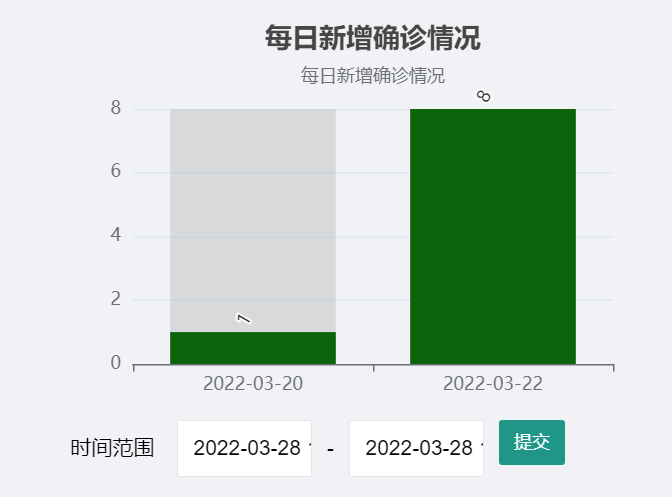
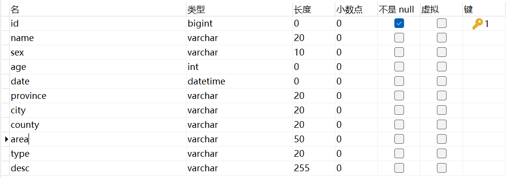
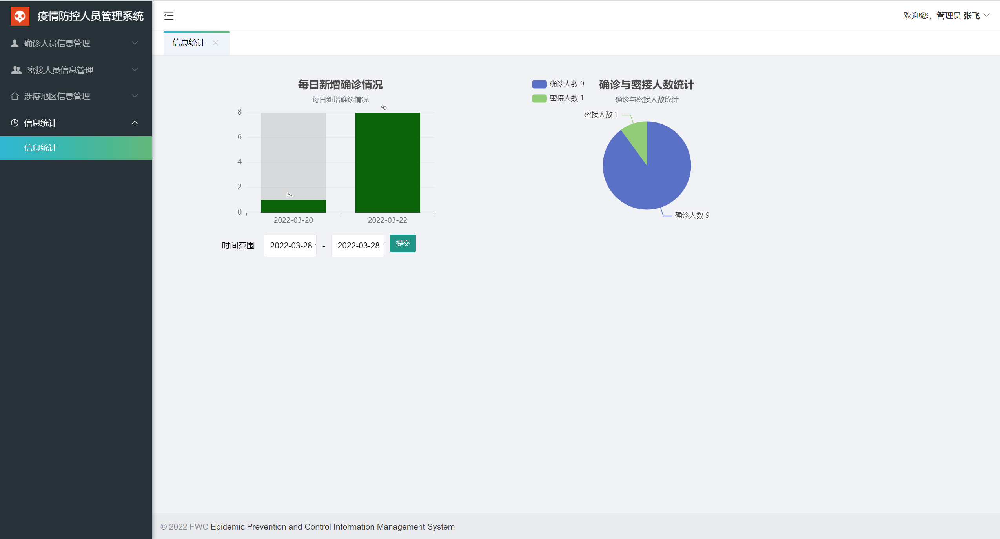

# echarts + ssm 实现时间范围内柱状图绘制

> 需求: 这里我需要做的是一个疫情防控管理系统, 需要根据新增确诊人员的数据来获取某个时间段内的新增人员数据的柱状图。也即如果前台输入时间 `2021-03-01` 和 `2021-03-31`, 我们就给出日期在此之间的确诊人员新增信息的柱状统计图。
>
> 注意: 如果数据库中没有在时间段内的数据,那么该图将不会输出任何信息,也即不会创建当天的数据柱,如下图所示




## 1  数据库配置



> 核心操作数据: date 		//datetime类型


## 2 ConfirmedMapper

### 接口

`ConfirmedMapper.java`

```java
//获取日期范围内的确诊信息
List<Confirmed> findByTimeRange(Map map);
```


### xml 文件

`ConfirmedMapper.xml`

```xml
<select id="findByTimeRange" parameterType="map" resultType="confirmed">
    SELECT * FROM confirmed
    where 1 = 1
    <if test="startTime != null and endTime != null and startTime != '' and endTime != ''">
        AND DATE_FORMAT(date, "%Y-%m-%d")
        BETWEEN DATE_FORMAT(#{startTime,jdbcType=VARCHAR}, "%Y-%m-%d")
        AND DATE_FORMAT(#{endTime,jdbcType=VARCHAR}, "%Y-%m-%d")
    </if>
</select>
```


## 3 Service

### 接口

```java
List<Confirmed> findByTimeRange(String startTime, String endTime);
```


### 实现类

```java
public List<Confirmed> findByTimeRange(String startTime, String endTime) {
    Map dateMap = new HashMap();
    dateMap.put("startTime",startTime);
    dateMap.put("endTime",endTime);
    return confirmedMapper.findByTimeRange(dateMap);
}
```


## 4 Controller

`findByTimeRange`

`该函数自己可以根据需求进行修改, 只要获取到对象将其封装为 json 格式, 即可返回页面进行图表展示。`

```java
package controller;

import bean.Confirmed;
import com.fasterxml.jackson.core.JsonProcessingException;
import com.fasterxml.jackson.databind.ObjectMapper;
import com.github.pagehelper.PageInfo;
import org.springframework.beans.factory.annotation.Autowired;
import org.springframework.stereotype.Controller;
import org.springframework.web.bind.annotation.PathVariable;
import org.springframework.web.bind.annotation.RequestMapping;
import org.springframework.web.bind.annotation.RequestParam;
import org.springframework.web.servlet.ModelAndView;
import services.ClosedService;
import services.ConfirmedService;
import utils.DateUtil;

import java.util.ArrayList;
import java.util.HashMap;
import java.util.List;
import java.util.Map;

@RequestMapping("/statistic")
@Controller
public class StaController {
    @Autowired
    private ConfirmedService confirmedService;
    @Autowired
    private ClosedService  closedService;

    //获取密接和确诊总人数
    @RequestMapping("/loadData")
    public ModelAndView loadData(@RequestParam(value = "startTime", defaultValue = "2022-03-01")String startTime,
                                 @RequestParam(value = "endTime", defaultValue = "2022-03-31")String endTime) throws JsonProcessingException {
        ModelAndView mv = new ModelAndView();
        //获取饼状图
        int[] sum = new int[2];
        sum[0] = confirmedService.getConfirmedSum();
        sum[1] = closedService.getClosedSum();
        mv.addObject("sum", sum);
        System.out.println(sum);

        //获取柱状图
        Map<String,String> histMap = findByTimeRange(startTime,endTime);
        for (Map.Entry<String,String> entry : histMap.entrySet()) {
            mv.addObject(entry.getKey(), entry.getValue());
        }
        mv.setViewName("info-statistics");
        return mv;
    }

    //获取密接和确诊总人数
    @RequestMapping("/getIncreaseData")
    public ModelAndView getIncreaseData() {
        ModelAndView mv = new ModelAndView();
        int[] sum = new int[2];
        sum[0] = confirmedService.getConfirmedSum();
        sum[1] = closedService.getClosedSum();
        mv.addObject("sum", sum);
        System.out.println(sum);
        mv.setViewName("info-statistics");
        return mv;
    }

    //根据 时间 范围查询
    @RequestMapping("/findByTimeRange")
    public Map<String,String> findByTimeRange(@RequestParam(value = "startTime", defaultValue = "2022-03-01")String startTime,
                                              @RequestParam(value = "endTime", defaultValue = "2022-03-31")String endTime) throws JsonProcessingException {
        System.out.println(startTime + "  " + endTime);

        ModelAndView mv = new ModelAndView();
        List<Confirmed> confirmedList = confirmedService.findByTimeRange(startTime,endTime);
        System.out.println(confirmedList);
        //根据得到的日期间隔内的数据划分 map, 统计不同日期出现的确诊人数
        List<String> dates = new ArrayList<String>();
        List<Integer> datesCount = new ArrayList<Integer>();
        for(int i = 0; i < confirmedList.size(); i++){
            int count = 1;  //由于忽略了自身
            //忽略重复的 date
            if(dates.contains(DateUtil.dateToStringNoTime(confirmedList.get(i).getDate())))
                continue;
            for(int j = i + 1; j < confirmedList.size(); j++){
                if(DateUtil.isSameDate(confirmedList.get(i).getDate(),confirmedList.get(j).getDate()))
                    count++;
            }
            dates.add(DateUtil.dateToStringNoTime(confirmedList.get(i).getDate()));
            datesCount.add(count);
        }

        //转换为 json 格式
        ObjectMapper mapper = new ObjectMapper();    //提供java-json相互转换功能的类
        String dateList = mapper.writeValueAsString(dates);
        String dateCount = mapper.writeValueAsString(datesCount);

        //输出信息
        System.out.println(dateList);
        System.out.println(dateCount);

        //转换为 map 格式返回出去
        Map<String,String> map = new HashMap<String,String>();
        map.put("dateList", dateList);
        map.put("dateCount", dateCount);
        return map;
    }
}
```


## 5 JSP

`这里使用了 LayUI 框架进行渲染, 使用了日期选择器接口, 无需自行定义, 如果使用其他的日期选择器, 自行修改即可。`

```javascript
<%@ page contentType="text/html;charset=UTF-8" language="java" %>
<%@taglib prefix="c" uri="http://java.sun.com/jsp/jstl/core" %><!DOCTYPE html>
<!DOCTYPE html>
<html style="height: 100%">
    <head>
        <meta charset="utf-8">
        <link rel="stylesheet" href="css/bootstrap.min.css"><!-- Bootstrap-Core-CSS -->
        <link rel="stylesheet" href="../assets/css/layui.css">
        <script src="../js/jquery-2.1.0.min.js"></script>
        <script type="text/javascript" src="../js/echarts.min.js"></script>
        <script src="../assets/layui.js"></script>
        <!--    引入日期选择器-->
        <script>
            layui.use('laydate', function(){
                var laydate = layui.laydate;

                //执行一个laydate实例
                laydate.render({
                    elem: '#startTime' //指定元素
                    ,type: 'datetime'
                    ,format: 'yyyy-MM-dd HH:mm:ss',
                    value: new Date()
                });

                //执行一个laydate实例
                laydate.render({
                    elem: '#endTime' //指定元素
                    ,type: 'datetime'
                    ,format: 'yyyy-MM-dd HH:mm:ss',
                    value: new Date()
                });
            });
        </script>
    </head>
    <body>
        <div class="layui-row layui-col-space14" style="margin-top: 40px;">
            <div class="layui-col-md6 layui-col-md-offset1" id="first" style="width:400px;height: 300px;"></div>
            <div class="layui-col-md6 layui-col-md-offset1" id="second" style="width:400px;height: 300px;"></div>
            <div class="layui-col-md6 layui-col-md-offset1" id="third" style="width:400px;height: 300px;"></div>
        </div>

        <form class="layui-form-item" method="post" action="${pageContext.request.contextPath}/statistic/loadData" style="float:left;margin-top:-23%;margin-left: 80px">
            <div class="layui-inline">
                <label class="layui-form-label">时间范围</label>
                <div class="layui-input-inline" style="width: 90px;">
                    <input type="text" id="startTime" name="startTime" class="layui-input">
                </div>
                <div class="layui-form-mid">-</div>
                <div class="layui-input-inline" style="width: 90px;">
                    <input type="text" id="endTime" name="endTime" class="layui-input">
                </div>
                <button type="submit" id="check" class="layui-btn layui-btn-sm">提交</button>
            </div>

        </form>

        
        <script type="text/javascript">
            var chartDom = document.getElementById('first');
            var myChart = echarts.init(chartDom);
            var option;
            option = {
                title: {
                    text: '每日新增确诊情况',
                    subtext: '每日新增确诊情况',
                    left: 'center'
                },
                tooltip: {
                    trigger: 'item'
                },
                legend: {
                    orient: 'vertical',
                    left: 'left',
                },
                xAxis: {
                    type: 'category',
                    data: ${dateList}
                },
                yAxis: {
                    type: 'value'
                },
                series: [{
                    data: ${dateCount},
                    type: 'bar',
                    showBackground: true,
                    barwidth: '30%', //柱的宽度
                    itemStyle: {
                        color: 'darkgreen'
                    },
                    backgroundStyle: {
                        color: 'rgba(180, 180, 180, 0.4)'
                    },
                    //最大值 最小值
                    markPoint: {
                        data: [
                            {
                                type: 'max', name: '最大值'
                            },
                            {
                                type: 'min', name: '最小值'
                            }
                        ]
                    },
                    //label 的字体样式
                    label: {
                        show: true,	// 是否可见
                        rotate: 60, 	// 旋转角度
                        position: 'top' // 显示位置
                    }
                }]
            };

            option && myChart.setOption(option);
        </script>

        <script type="text/javascript">
            var chartDom = document.getElementById('second');
            var myChart = echarts.init(chartDom);
            var option;

            option = {
                title: {
                    text: '确诊与密接人数统计',
                    subtext: '确诊与密接人数统计',
                    left: 'center'
                },
                tooltip: {
                    trigger: 'item'
                },
                legend: {
                    orient: 'vertical',
                    left: 'left',
                },
                series: [
                    {
                        name: '确诊与密接人数统计',
                        type: 'pie',
                        radius: '50%',
                        data: [
                            {value: ${sum[0]}, name: '确诊人数 ${sum[0]}'},
                            {value: ${sum[1]}, name: '密接人数 ${sum[1]}'},
                        ],
                        emphasis: {
                            itemStyle: {
                                shadowBlur: 10,
                                shadowOffsetX: 0,
                                shadowColor: 'rgba(0, 100, 0, 0.5)'
                            }
                        }
                    }
                ]
            };
            option && myChart.setOption(option);
        </script>
    </body>
</html>
    
```


## 6 结果




