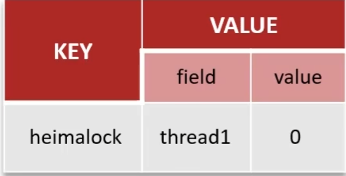

## 1 Redis

### 1.1 缓存

#### 1) 缓存穿透

> 概念: 查询一个不存在的数据, MySQL查询不到数据也不会直接写入缓存,就会导致每次请求都查询数据库。

- 方案一: 缓存空数据, 查询返回的结果为空,仍把空结果进行缓存
  - 优点: 简单
  - 缺点: 消耗内存, 可能发生不一致的问题
- 方案二: 布隆过滤器
  - bitmap(位图): 以 bit 为单位的数组, 数组中的值为 0|1
  - 布隆过滤器通过初始1个值全为0的数组, 再通过 hash (3次hash) 的方法判断元素是否在集合中。**存储数据**: id为1的数据，通过多个hash函数获取hash值，根据hash计算数组对应位置改为1; **查询数据**:使用相同hash函数获取hash值，判断对应位置是否都为1。
  - 存在误判, 如果某个 id 对应的hash值被其他已存在 id 的hash值覆盖, 就会使得本来不存在的数据被判定为存在(一般设置误判率为5%以内)。
  - 在查询时首先通过布隆过滤器查询是否存在, 不存在则直接返回, 存在则查redis。注意: 缓存预热时需要同步预热布隆过滤器, 也即 redis 的相关更新也需要同步到布隆过滤器。

#### 2) 缓存击穿

> 概念: 给某一个 key 设置了过期时间, 当 key 过期的时候, 恰好这时间点对这个 key 有大量的并发请求过来, 这些并发的请求可能会瞬间把 DB 击穿。


- 互斥锁
  - 由于 key 过期需要进行缓存重建, 为了避免"击穿"的发生, 给用以重建缓存数据的线程1加锁(也即获取互斥锁), 此时在线程1没有完成缓存重建过程之前, 其余线程只能不断重试, 直到线程1缓存重建成功并释放 互斥锁。  
  - **特点**:强一致性 性能差 
- 逻辑过期
  - redis key 并不设置过期时间, 而是为数据添加过期字段'expire'。当线程1发现字段逻辑过期之后, 获取互斥锁开启新线程2, 用以重建缓存数据。 这时线程1会直接返回过期数据, 如果在线程2重建缓存的过程中还有新的线程获取该数据, 由于互斥锁被占用, 此时该线程会返回过期数据; 当线程2完成重建缓存之后, 所有的线程就可以访问到最新的数据了。
  - **特点**: 高可用、性能优  -  实质上就是通过维护缓存时间字段来判断过期与否, 不为 redis 设置过期时间。

#### 3) 缓存雪崩

> 在同一时间段内缓存key同时过期或者 redis 服务宕机, 导致大量请求访问到数据库, 带来巨大压力。

- 给不同的 Key 的 TTL(失效时间) 添加随机值
- 给 redis 集群提高服务可用型  - 哨兵模式、集群模式
- 给缓存业务添加降级限流策略 - ngxin | SpringCloud GateWay (同样可用于穿透、击穿)
- 给业务添加多级缓存 -  Guava | Caffeine

#### 4) 双写一致性

> 当修改了数据库的数据同时需要更新缓存的数据, 缓存和数据库的数据需要保持一致。

- 读取

  - 缓存命中直接返回; 缓存未命中查询数据库, 写入缓存, 设定超时时间。

- 写入

  **强一致性**

  - **延迟双删**

    删除缓存 -> 修改数据库 ->(延时) 删除缓存  (一般的是删除缓存->修改数据库)。这样极大的控制了脏数据的风险, 但是由于数据库的主从模式, 延时也不一定能保证"脏数据"不存在。

    特点: 脏数据 - 性能高

  - **分布式锁**

    共享锁: 读锁 `readLock`，加锁之后，其他线程可以共享读操作。

    排他锁: 独占锁 `writeLock`，加锁之后，阻塞其他线程读写操作。

    特点: 强一致 性能低

  **允许短暂不同步**

  - MQ 作为中间件完成消息传递, 保证一致性
  - Canal 作为中间件通过 MySQL 的变化监听并向缓存发送消息提示更新。

#### 5) 持久化

> 持久化方式: 
>
> - RDB: RDB全称Redis Database Backup file(Redis数据备份文件)，也被叫做Redis数据快照。简单来说就是把内存中的所有数据都记录到磁盘中。当Redis实例故障重启后，从磁盘读取快照文件，恢复数据。fork采用的是copy-on-write技术:
>   当主进程执行读操作时，访问共享内存;
>   当主进程执行写操作时，则会拷贝一份数据，执行写操作。
>
>   ```cmd
>   > save
>   > bgsave
>   > save 900 1   //900s内有1个key被修改
>   > save 300 10
>   > save 60 10000
>   ```
>
>   执行原理: bgsave 会 fork(拷贝) 主进程得到子进程, 子进程共享主进程的内存数据(拷贝了页表-映射关系), 完成 fork 后读取内存数据并写入 RDB 文件。
>
> - AOF: AOF全称为Append Only File(追加文件)。Redis处理的每一个写命令都会记录在AOF文件，可以看做是命令日志文件。
>
>   因为是记录命令，AOF文件会比RDB文件大的多。而且AOF会记录对同一个key的多次写操作，但只有最后一次写操作才有意义。通过执行 `bgrewriteaof` 命令，可以让AOF文件执行重写功能，用最少的命令达到相同效果。
>
>   
>
>   ```cmd
>   #AOF文件比上次文件增长超过多少百分比则触发重写
>   auto-aof-rewrite-percentage 100
>   #AOF文件体积最小多大以上才触发重写入
>   auto-aof-rewrite-min-size 64mb
>   ```
>
> - 对比
>
>   

#### 6) 过期策略

惰性删除

- 设置 key 的过期时间后, 不会自动删除。只会当需要 key 时, 检查是否过期, 过期则删除 key, 反之返回该 key。

  优点: 对 CPU 友好,  不用耗费时间进行过期检查。

  缺点: 对内存不友好, key 过期时不会及时删除, 内存得不到及时释放。

定期删除

- 每隔一段时间, 我们就对一些 key 进行检查, 删除里面过期的 key(从一定数据数据库中取一定数量的随机key检查,并删除其中过期的key)

  **模式**

  - SLOW - 定时任务, 执行频率 10hz, 每次不超过 25ms, 通过 redis.conf 调整次数
  - FAST - 执行频率不固定, 但执行间隔不低于2ms, 每次耗时不超过1ms

  **优点**:可以通过限制删除操作执行的时长和频率来减少删除操作对CPU的影响。另外定期删除，也能有效释放过期键占用的内存。
  **缺点**:难以确定删除操作执行的时长和频率。

Redis过期策略: 两者都使用

#### 7) 淘汰策略

> 数据的淘汰策略: 当Redis中的内存不够用时，此时在向Redis中添加新的key，那么Redis就会按照某一种规则将内存中的数据删除掉，这种数据的删除规则被称之为内存的淘汰策略。

- noeviction: 不淘汰任何key，但是内存满时不允许写入新数据，默认策略。

- volatile-ttl: 对设置了TTL的key，比较key的剩余TTL值，TTL越小越先被淘汰。

- allkeys-random: 对全体key，随机进行淘汰。
- volatile-random: 对设置了TTL的key，随机进行淘汰。
- alkeys-lru: 对全体key，基于LRU算法进行淘汰
- volatile-Iru: 对设置了TTL的key，基于LRU算法进行淘汰

- allkeys-lfu: 对全体key，基于LFU算法进行淘汰

- volatile-lfu: 对设置了TTL的key，基于LFU算法进行淘汰

- 使用建议:

  1．优先使用allkeys-lru 策略。充分利用LRU算法的优势，把最近最常访问的数据留在缓存中。如果业务有明显的冷热数据区分，建议使用。
  2．如果业务中数据访问频率差别不大，没有明显冷热数据区分，建议使用alkeys-random，随机选择淘汰

  3．如果业务中有置顶的需求，可以使用volatile-lru策略，同时置顶数据不设置过期时间，这些数据就一直不被删除，会淘汰其他设置过期时间的数据。
  4．如果业务中有短时高频访问的数据，可以使用alkeys-lfu或volatile-lfu策略。

  


### 1.2 分布式锁

#### 1) 使用场景

> 当用在秒杀、抢劵等业务场景时, 如果是不考虑集群和负载均衡的概念, 使用互斥锁即可安全的完成流程。而如果使用 Nginx 实现负载均衡, 也即服务运行在多个服务端之下, 互斥锁由于运行在本地被JVM所运行,无法完后多个服务端的服务情况。因此需要使用 **分布式锁** 来该业务。

#### 2) 实现原理

- setnx 命令

  

  Redis实现分布式锁主要利用Redis的setnx命令。setnx是SET if not exists(如果不存在，则SET)的简写。

  `redis 分布式锁: 由redisson实现的分布式锁，底层是setnx和lua脚本（保证原子性)`

  ```cmd
  set lock value NX EX 10		//添加锁, NX 互斥, EX 超时时间
  DEL key	//释放锁
  ```

- 控制锁的有效时长

  - 锁续期

    Watch Dog - 每隔 (releaseTime / 3)的时间为锁自动续期, 默认为10s续期一次。

- **可重入**

  redisson 实现分布式锁, 利用 hash结构 记录线程id和重入次数

  

- 主从一致性

  本地实现的分布式锁当Redis结点宕机之后, 新的线程与等待线程持有了同一把锁, 而新的Redis结点由于没有及时同步数据, 会造成脏数据的情况。

  

  `redisson 实现的分布式锁`

  RedLock(红锁): 不能只在一个redis实例上创建锁，应该是在多个redis实例上创建锁(n / 2＋1)，避免在一个redis实例上加锁。

  >  **Redisson锁能解决主从数据一致的问题吗?**
  > 	不能解决，但是可以使用redisson提供的红锁来解决，但是这样的话，性能就太低了，如果业务中非要保证数据的强一致性，建议采用zookeeper实现的分布式锁  

  在多个节点上创建锁, 就不会出现多个线程持有同一把锁的情况。

  

  性能比较差, 建议使用 Zookeeper


### 1.3 Redis 核心问题

#### 1) 主从复制

> 单节点Redis的并发能力是有上限的，要进一步提高Redis的并发能力，就需要搭建主从集群，实现读写分离。主节点为master吗,从节点为slave/replica,需要保证主节点和从节点之间数据的及时同步。


- 主从数据同步

  >全量同步:
  >1. 从节点请求主节点同步数据（(replication id、 offset )
  >2. 主节点判断是否是第一次请求，是第一次就与从节点同步版本信息(replication id和offset)
  >3. 主节点执行bgsave，生成rdb文件后，发送给从节点去执行
  >4. 在rdb生成执行期间，主节点会以命令的方式记录到缓冲区（一个日志文件)5.把生成之后的命令日志文件发送给从节点进行同步
  >
  >增量同步:
  >
  >1. 从节点请求主节点同步数据，主节点判断不是第一次请求，
  >     不是第一次就获取从节点的offset值
  >2. 主节点从命令日志中获取offset值之后的数据，发送给从节点进行数据同步

  - 主从全量同步

    

  - 主从增量同步

    

#### 2) 哨兵模式

> 哨兵模式保证了 Redis 的高并发和高可用
>
> - 你们使用redis是单点还是集群，哪种集群
>   	主从（1主1从)+哨兵就可以了。单节点不超过10G内存，如果Redis内存不足则可以给不同服务分配独立的Redis主从节点
> - redis集群脑裂，该怎么解决呢?
>   	**集群脑裂**是由于主节点和从节点和sentinel处于不同的网络分区，使得sentinel没有能够心跳感知到主节点，所以通过选举的方式提升了一个从节点为主，这样就存在了两个master，就像大脑分裂了一样，这样会导致客户端还在老的主节点那里写入数据，新节点无法同步数据，当网络恢复后,sentinel会将老的主节点降为从节点，这时再从新master同步数据，就会导致数据丢失
>   	解决︰我们可以修改redis的配置，可以设置最少的从节点数量以及缩短主从数据同步的延迟时间，达不到要求就拒绝请求，就可以避免大量的数据丢失

Redis提供了哨兵(Sentinel)机制来实现主从集群的自动故障恢复。哨兵的结构和作用如下:

- **监控**: Sentinel 会不断检查您的master和slave是否按预期工作
- **自动故障恢复**:如果 master 故障，Sentinel会将一个slave提升为master。当故障实例恢复后也以新的master为主
- **通知**: Sentinel 充当 Redis客户端的服务发现来源，当集群发生故障转移时，会将最新信息推送给Redis的客户端

Sentinel基于心跳机制监测服务状态，每隔1秒向集群的每个实例发送ping命令:

- 主观下线: 如果某sentinel节点发现某实例未在规定时间响应，则认为该实例主观下线。
- 客观下线: 若超过指定数量(quorum)的sentinel都认为该实例主观下线，则该实例客观下线。quoru
  m值最好超过Sentinel实例数量的一半。

哨兵选主规则

- 首先判断主与从节点断开时间长短，如超过指定值就排该从节点
- 然后判断从节点的slave-priority值，越小优先级越高
- 如果slave-prority一样，则判断slave节点的offset值，越大优先级越高
- 最后是判断slave节点的运行id大小，越小优先级越高。

Redis 集群(哨兵模式)脑裂

- 当 Redis 主节点由于网络问题发生宕机, 此时哨兵会选取一个从节点作为主节点使用。但是先前的主节点只是因为网络问题无法接受数据, 客户端在其恢复后依然后向其发送数据请求, 这是如果哨兵将这个主节点降为从节点, 会引发数据清空操作, 会引发数据丢失问题。这样的问题称为**脑裂**。

#### 3) 分片集群

主从和哨兵可以解决高可用、高并发读的问题。但是依然有两个问题没有解决:

- 海量数据存储问题
- 高并发写的问题

使用分片集群可以解决上述问题，分片集群特征:

- 集群中有多个master，每个master保存不同数据。
- 每个master都可以有多个slave节点
- master之间通过ping监测彼此健康状态
- 客户端请求可以访问集群任意节点，最终都会被转发到正确节点
  

- 分片集群结构 - 数据读写

  Redis分片集群引入了哈希槽的概念，Redis集群有16384个哈希槽，每个key通过CRC16校验后对16
  384取模来决定放置哪个槽，集群的每个节点负责一部分hash槽。

  

>**Redis分片集群中数据是怎么存储和读取的?**
>Redis 分片集群引入了哈希槽的概念，Redis集群有16384个哈希槽将16384个插槽分配到不同的实例
>读写数据:根据key的有效部分计算哈希值，对16384取余
>(有效部分，如果key前面有大括号，大括号的
>内容就是有效部分，如果没有，则以key本身做为有效部分）余数做为插槽，寻找插槽所在的实例

#### 4) Redis 问题

> **Redis是单线程的，但是为什么还那么快**
>
> - Redis是纯内存操作，执行速度非常快
> - 采用单线程，避免不必要的上下文切换可竞争条件,多线程还要考虑线程安全问题
> - 使用I/O多路复用模型，非阻塞IO
>
> **能解释一下I/O多路复用模型?**
> Redis是纯内存操作，执行速度非常快，它的性能瓶颈是网络延迟而不是执行速度，IO多路复用模型主要就是实现了高效的网络请求
>
> - 用户空间和内核空间
>
> - 常见的IO模型
>
>   阻塞IO(Blocking lO)
>   非阻塞IO(Nonblocking lO)
>
>   IO多路复用(IO Multiplexing)
>
> - Redis网络模型

- 用户空间和内核空间

  - 用户空间只能执行受限的部分命令, 而不能调用系统资源。
  - 内核空间可以执行特权命令, 调用一切系统资源。

  - Linux系统为了提高IO效率，会在用户空间和内核空间都加入缓冲区:
    写数据时，要把用户缓冲数据拷贝到内核缓冲区，然后写入设备; 读数据时，要从设备读取数据到内核缓冲区，然后拷贝到用户缓冲区

- 阻塞I/O

  阶段一:
  用户进程尝试读取数据（比如网卡数据)

  此时数据尚未到达，内核需要等待数据
  此时用户进程也处于阻塞状态
  阶段二:
  数据到达并拷贝到内核缓冲区，代表已就绪
  将内核数据拷贝到用户缓冲区
  拷贝过程中，用户进程依然阻塞等待拷贝完成，用户进程解除阻塞，处理数据
  可以看到，阻塞IO模型中，用户进程在两个阶段都是阻塞状态。

  

- 非阻塞I/O

  顾名思义，非阻塞lO的recvfrom操作会立即返回结果而不是阻塞用户进程。

  阶段一:
  用户进程尝试读取数据（比如网卡数据)
  此时数据尚未到达，内核需要等待数据③返回异常给用户进程
  用户进程拿到error后，再次尝试读取⑤循环往复，直到数据就绪
  阶段二:
  将内核数据拷贝到用户缓冲区
  拷贝过程中，用户进程依然阻塞等待拷贝完成，用户进程解除阻塞，处理数据

  拷贝完成，用户进程解除阻塞，处理数据
  可以看到，非阻塞IO模型中，用户进程在第一个阶段是非阻塞，第二个阶段是阻塞状态。虽然是非阻塞，但性能并没有得到提高。而且忙等机制会导致CPU空转，CPU使用率暴增。

  

- I/O多路复用

  IO多路复用:是利用单个线程来同时监听多个Socket，并在某个Socket可读、可写时得到通知，从而避免,无效的等待，充分利用CPU资源。

  阶段一:
  用户进程调用select，指定要监听的Socket集合

  内核监听对应的多个socket
  任意一个或多个socket数据就绪则返回readable

  此过程中用户进程阻塞
  阶段二:
  用户进程找到就绪的socket

  依次调用recvfrom读取数据

  内核将数据拷贝到用户空间

  用户进程处理数据

  

  - I/O多路复用是利用单个线程来同时监听多个Socket，并在某个Socket可读、可写时得到通知，从而避免无效等待，充分利用CPU资源。不过监听Socket的方式、通知的方式又有多种实现，常见的有:

    select

    poll

    epoll

    差异:

    - select和poll只会通知用户进程有Socket就绪，但不确定具体是哪个Socket，需要用户进程逐个遍历 Socket 来确认
    - epoll则会在通知用户进程Socket就绪的同时，把已就绪的Socket写入用户空间

  - Redis 网络模型

    Redis通过I0多路复用来提高网络性能，并且支持各种不同的多路复用实现，并且将这些实现进行封装，提供了统一的高性能事件库。

    

    > 1. I/O多路复用
    > 是指利用单个线程来同时监听多个Socket，并在某个Socket可读、可写时得到通知，从而避免无效的等待，充分利用CPU资源。目前的I/O多路复用都是采用的epoll模式实现，它会在通知用户进程Socket就绪的同时，把已就绪的Socket写入用户空间，不需要挨个遍历Socket来判断是否就绪，提升了性能。
    > 2. Redis网络模型
    > 就是使用I/O多路复用结合事件的处理器来应对多个Socket请求
    > 连接应答处理器
    > 命令回复处理器，在Redis6.0之后，为了提升更好的性能，
    > 使用了多线程来处理回复事件
    > 命令请求处理器，在Redis6.0之后，将命令的转换使用了多线程，增加命令转换速度，在命令执行的时候，依然
    > 是单线程


## 2 MySQL

### 2.1 如何定位慢查询

> 如何定位慢查询?
>
> 1. 介绍一下当时产生问题的场景（我们当时的一个接口测试的时候非常的慢，压测的结果大概5秒钟)
>
> 2. 我们系统中当时采用了运维工具（ Skywalking )，可以监测出哪个接口，最终因为是sql的问题
>
> 3. 在mysql中开启了慢日志查询，我们设置的值就是2秒，一旦sql执行超过2秒就会记录到日志中(调试阶段)

- 工具

  Skywalking

- MySQL 自带慢日志

  慢查询日志记录了所有执行时间超过指定参数(long_query_time，单位:秒，默认10秒)的所有SQL语句的日志
  如果要开启慢查询日志，需要在MySQL的配置文件(/etc/my.cnf）中配置如下信息:

  ```cmd
  #开启MySQL慢日志查询开关
  slow_query_log=1
  #设置慢日志的时间为2秒，SQL语句执行时间超过2秒，就会视为慢查询，记录慢查询日志
  long_query_time=2
  ```

  配置完毕之后，通过以下指令重新启动MySQL服务器进行测试，查看慢日志文件中记录信息

  /var/lib/mysql/localhost-slow.log

### 2.2 SQL 执行慢的优化与分析

> 可以使用 EXPLAIN 和 DESC 命令获取 MySQL 执行 SELECT 语句的信息
>
> 语法:
>
> 直接在 select 语句之间加上关键字 explain/desc
>
> ```sql
> EXPLAIN SELECT 字段列表 FROM 表名 WHERE 条件;
> ```
>
> 如果SQL执行很慢, 如何分析?
>
> 可以采用MySQL自带的分析工具EXPLAIN
> 通过key和key_len检查是否命中了索引（索引本身存在是否有失效的情况)
> 通过type字段查看sql是否有进一步的优化空间，是否存在全索引扫描或全盘扫描
> 通过extra建议判断，是否出现了回表的情况，如果出现了，可以尝试添加索引或修改返回字段来修复


-  字段含义

  - possible_key: 当前 sql 可能会使用到的索引

  - key: 当前 sql 实际命中的索引  `判断是否命中索引`

  - key_len: 索引占用的大小

  - Extra 额外的优化建议

    

  - type: 这条sql的连接的类型，性能由好到差为NULL、system、const、eq_ref、ref、range、index、all

    - system: 查询系统中的表
    - const: 根据主键查询
    - eq_ref: 根据主键索引/唯一索引查询
    - ref: 索引查询
    - range: 范围查询
    - index: 索引树查询 `需要优化`
    - all: 全盘扫描 `需要优化`

### 2.3 索引

#### 1) 概念

> 索引(index)是帮助 MySQL 高效获取数据的数据结构(有序)。在数据之外，数据库系统还维护着满足特定查找算法的数据结构（B+树)，这些数据结构以某种方式引用(指向）数据，这样就可以在这些数据结构上实现高级查找算法，这种数据结构就是索引。
>
> **了解过索引吗?(什么是索引)**
> 	索引(index)是帮助MySQL高效获取数据的数据结构(有序)提高数据检索的效率，降低数据库的IO成本（不需要全表扫描)
> 	通过索引列对数据进行排序，降低数据排序的成本，降低了CPU的消耗
> **索引的底层数据结构了解过嘛?**
> 	MySQL的InnoDB引警采用的B+树的数据结构来存储索引
> 	阶数更多，路径更短
> 	磁盘读写代价B+树更低，非叶子节点只存储指针，叶子阶段存储数据
>
> ​	B+树便于扫库和区间查询，叶子节点是一个双向链表

- 索引的底层结构

  B-Tree，B树是一种多叉路衡查找树，相对于二叉树，B树每个节点可以有多个分支，即多叉。以一颗最大度数(max-degree)为5(5阶)的b-tree为例，那这个B树每个节点最多存储4个key。

  

  B+ Tree: 在BTree基础上的一种优化，使其更适合实现外存储索引结构，InnoDB存储引擎就是用B+Tree实现其索引结构

  

  B树和B+数对比:

  ①:磁盘读写代价B+树更低; ②:查询效率B+树更加稳定; ③B+树便于扫库和区间查询

#### 2) 聚簇索引和非聚簇索引

> **聚集|聚簇索引(Clustered Index)**
> 	将数据存储与索引放到了一块，索引结构的叶子节点保存了行数据;必须有,而且只有一个
> **二级索引|非聚簇索引(Secondary Index)**
> 	将数据与索引分开存储，索引结构的叶子节点关联的是对应的主键;可以存在多个
>
> **件么是聚族索引件么是非聚族索引?**
> 	聚簇索引(聚集索引)︰数据与索引放到一块，B+树的叶子节点保存了整行数据，有且只有一个
>
> ​	非聚簇索引(二级索引)︰数据与索引分开存储，B+树的叶子节点保存对应的主键，可以有多个
> **知道什么是回表查询嘛?**
> ​	通过二级索引找到对应的主键值，到聚集索引中查找整行数据，这个过程就是回表

- 聚簇索引

  聚簇索引选取规则:

  - 知果存在主键，主键索引就是聚集索引。
  - 如果不存在主键，将使用第一个唯一(UNIQUE）索引作为聚集索引。
  - 如果表没有主键，或没有合适的唯一索引，则InnoDB会自动生成一个rowid作为隐藏的聚集索引。

- 回表查询

  当一个表同时存在聚集索引和二级索引时, 首先通过二级索引查询到信息对应的关键字(主键等), 然后根据查找的关键字信息在聚集索引中查找到对应 ROW。

  

#### 3) 覆盖索引

> 覆盖索引是指查询使用了索引，并且需要返回的列，在该索引中已经全部能够找到。
>
> **知道什么叫覆盖索引嘛?**
> 	覆盖索引是指查询使用了索引，返回的列，必须在索引中全部能够老够找到
> 	使用id查询，直接走聚集索引查询，一次索引扫描，直接返回数据，性能高。
> 	如果返回的列中没有创建索引，有可能会触发回表查询，尽量避免使用 select *

 

- 超大分页

  问题:在数据量比较大时，limit分页查询，需要对数据进行排序，效率低
  解决方案:覆盖索引+子查询

#### 4) 索引创建的原则

> **原则**:
>
> 针对于数据量较大，且查询比较频繁的表建立索引。单表超过10万数据（增加用户体验)
> 2).针对于常作为查询条件(where)、排序(order by)、分组(group by)操作的字段建立索引。3).尽量选择区分度高的列作为索引，尽量建立唯一索引，区分度越高，使用索引的效率越高。
> 4).如果是字符串类型的字段，字段的长度较长，可以针对于字段的特点，建立前缀索引。
> 5).尽量使用联合索引，减少单列索引，查询时，联合索引很多时候可以覆盖索引，节省存储空间，避免回表，提高查询效率6).要控制索引的数量，索引并不是多多益善，索引越多，维护索引结构的代价也就越大，会影响增删改的效率。
> 7).如果索引例列不能存储NULL值，请在创建表时使用NOT NULL约束它。当优化器知道每列是否包含NULL值时，它可以更好
> 地确定哪个索引最有效地用于查询。
>
> **索引创建原则有哪些?**
> 1).数据量较大，且查询比较频繁的表  `重要`
> 2).常作为查询条件、排序、分组的字段  `重要`
> 3).字段内容区分度高
> 4).内容较长，使用前缀索引5).尽量联合索引  `重要`
> 6).要控制索引的数量  `重要`
> 7).如果索引列不能存储NULL值，请在创建表时使用NOT NULL约束它

#### 5） 索引失效的情况

> **什么情况下索引会失效?**
>
> - 违反最左前缀法则
> - 范围查询右边的列，不能使用索引
> - 不要在索引列上进行运算操作，索引将失效
> - 字符串不加单引号，造成索引失效。(类型转换)
> - 以%开头的Like模糊查询，索引失效


### 2.4 SQL 优化

> **表的设计优化:**
>
> - 比如设置合适的数值(tinyint int bigint)，要根据实际情况选择
> - 比如设置合适的字符串类型(char和varchar) char定长效率高,varchar可变长度，效率稍低
>
> **SQL语句优化**
>
> - SELECT语句务必指明字段名称（避免直接使用select * )
> - SQL语句要避免造成索引失效的写法
> - 尽量用union all代替union union会多一次过滤，效率低
> - 避免在where子句中对字段进行表达式操作
> - Join优化能用innerjoin就不用left join right join，如必须使用一定要以小表为驱动，
> - 内连接会对两个表进行优化，优先把小表放到外边，把大表放到里边。left join或 right join，不会重新调整顺序
>
> **主从复制,读写分离**
>
> 如果数据库的使用场景读的操作比较多的时候，为了避免写的操作所造成的性能影响可以采用读写分离的架构。读写分离解决的是，数据库的写入，影响了查询的效率。   **写库为主库, 读库为从库**


### 2.5 事务

#### 1) 概念

> `事务是一组操作的集合，它是一个不可分割的工作单位，事务会把所有的操作作为一个整体一起向系统提交或撤销操作请求，即这些操作要么同时成功，要么同时失败。`
>
> ACID是什么?可以详细说一下吗?
>
> - 原子性(Atomicity) :事务是不可分割的最小操作单元，要么全部成功，要么全部失败。
> - 一致性(Consistency) :事务完成时，必须使所有的数据都保持一致状态。
> - 隔离性(Isolation)︰数据库系统提供的隔离机制，保证事务在不受外部并发操作影响的独立环境下运行
> - 持久性(Durability) ︰事务一旦提交或回滚，它对数据库中的数据的改变就是永久的。

#### 2) 并发事务的问题

- 脏读 一个事务读到另外一个事务还没有提交的数据。

- 不可重复读 一个事务先后读取同一条记录，但两次读取的数据不同，称之为不可重复读。

- 幻读 一个事务按照条件查询数据时，没有对应的数据行，但是在插入数据时，又发现这行数据已经存在，好
  像出现了”幻影”。 

- 解决方案: 对事物进行隔离(一般使用可重复读)

  

#### 3) undo | redo log

> redo log: 记录的是数据页的物理变化，服务宕机可用来同步数据(保证服务宕机情况下的数据一致性)
> undo log: 记录的是逻辑日志，当事务回滚时，通过逆操作恢复原来的数据(记录逆操作, 用于事务回滚)
>
> `redo log 保证了事务的持久性，undo log保证了事务的原子性和一致性`

- redo log

  重做日志，记录的是事务提交时数据页的物理修改，是用来实现事务的持久性。
  该日志文件由两部分组成:重做日志缓冲（redo log buffer)以及重做日志文件(redo log file),前者是在内存中，后者在
  磁盘中。当事务提交之后会把所有修改信息都存到该日志文件中，用于在刷新脏页到磁盘,发生错误时,进行数据恢复使用。

- undo log

  回滚日志，用于记录数据被修改前的信息，作用包含两个:提供回滚和MNCC(多版本并发控制)。undo log和redo log记
  录物理日志不一样，它是逻辑日志。

  - 可以认为当delete一条记录时,undo log中会记录一条对应的insert记录，反之亦然，
  - 当update一条记录时，它记录一条对应相反的update记录。当执行rollback时，就可以从undo log中的逻辑记录读取
    到相应的内容并进行回滚。

#### 4) MVCC - 多版本并发控制

> 事务中的隔离性是如何保证的(解释一下MVCC)?
>
> MySQL中的多版本并发控制。指维护一个数据的多个版本，使得读写操作没有冲突
>
> 隐藏字段(数据库每个表都会添加3个隐藏字段):
>
> - trx_id(事务id)，记录每一次操作的事务id，是自增的
> - roll_pointer(回滚指针)，指向上一个版本的事务版本记录地址
>
> undo log:
>
> - 回滚日志，存储老版本数据
> - 版本链:多个事务并行操作某一行记录，记录不同事务修改数据的版本，通过roll pointer指针形成一个链表
>
> readView解决的是一个事务查询选择版本的问题
>
> - 根据readView的匹配规则和当前的一些事务id判断该访问那个版本的数据
> - 不同的隔离级别快照读是不一样的，最终的访问的结果不一样
>   RC:每一次执行快照读时生成 ReadView
>   RR:仅在事务中第一次执行快照读时生成 ReadView ，后续复用之前的 ReadView 


### 2.6 主从同步原理

> 核心:
>
> 二进制日志
>
> - 二进制日志(BINLOG)记录了所有的DDL(数据定义语言）语句和DML(数据操纵语言）语句，但不包括数据查询(SELECT、SHOW)语句
>
> **主从同步原理**
> MySQL主从复制的核心就是二进制日志binlog(DDL(数据定义语言）语句和DML(数据操纵语言）语句)
>
> - 主库在事务提交时，会把数据变更记录在二进制日志文件 Binlog中。
> - 从库读取主库的二进制日志文件 Binlog，写入到从库的中继日志 Relay Log。
> - 从库重做中继日志中的事件，将改变反映到它自己的数据中


### 2.7 分库分表

> 你们项目用过分库分表吗
> 业务介绍
> 	1，根据自己简历上的项目，想一个数据量较大业务(请求数多或业务累积大)
>
> ​	2，达到了什么样的量级（单表1000万或超过20G)
> 具体拆分策略
> ​	1，水平分库，将一个库的数据拆分到多个库中，解决海量数据存储和高并发的问题
>
> ​	2，水平分表，解决单表存储和性能的问题
> ​	3，垂直分库，根据业务进行拆分，高并发下提高磁盘IO和网络连接数
>
> ​	4，垂直分表，冷热数据分离，多表互不影响

- 分库分表的时机: 

  1，前提，项目业务数据逐渐增多，或业务发展比较迅速。    单表的数据量达1000W或20G以后
  2，优化已解决不了性能问题（主从读写分离、查询索引...)
  3，IO瓶颈（磁盘IO、网络lO)、CPU瓶颈（聚合查询、连接数太多)

- 拆分策略

  - 垂直分库

    以表为依据, 根据业务讲不同表拆分到不同的库中。

    特点:  1.按业务对数据分级管理、维护、监控、扩展   2．在高并发下，提高磁盘IO和数据量连接数

  - 垂直分表

    以字段为依据, 根据字段属性将不同字段拆分到不同的表中

    拆分规则: 将不常用的字段单独放在一张表, 把 text, blob 等大字段拆分出来放在附表中

    特点:  1，冷热数据分离  2，减少IO过渡争抢，两表互不影响

  - 水平分库

    将一个库的数据拆分到多个库中

    水平分库:将一个库的数据拆分到多个库中。
    路由规则:  根据id节点取模; 按id也就是范围路由，节点1(1-100万),节点2(100万-200万)
    特点: 解决了单库大数量，高并发的性能瓶颈问题;  提高了系统的稳定性和可用性

  - 水平分表

    将一个表的数据拆分到多个表中(可以在同一个库中)

    特点:  1.优化单一表数据量过大而产生的性能问题;  2．避免IO争抢并减少锁表的几率;

- 分库分表的策略

  - 分布式事务一致性问题
  - 跨节点关联查询
  - 跨节点分页、排序函数
  - 主键避重

- 分库分表中间件

  - sharding-sphere
  - mycat


## 3 Java 框架

### 3.1 Spring

#### 1) Spring 框架的单例 Bean 是线程安全的吗

不是线程安全的; Spring框架中有一个@Scope 注解，默认的值就是 singleton，单例的。
因为一般在spring的bean的中都是注入无状态的对象，没有线程安全问题，如果在bean中定义了可修改的成员变量，是要考虑线程安全问题的，可以使用多例或者加锁来解决

#### 2) AOP

> 概念: AOP 称为面向切面编程，用于将那些与业务无关，但却对多个对象产生影响的公共行为和逻辑，抽取并封装为一个可重用的模块，这个模块被命名为“切面”(Aspect)，减少系统中的重复代码，降低了模块间的耦合度，同时提高了系统的可维护性。
>
> **什么是AOP?**
> 	面向切面编程，用于将那些与业务无关，但却对多个对象产生影响的公共行为和逻辑，抽取公共模块复用，降低耦合
> **你们项目中有没有使用到AOP?**
> 	记录操作日志，缓存，spring实现的事务
> 	核心是:使用aop中的环绕通知+切点表达式(找到要记录日志的方法)，通过环绕通知的参数获取请求方法的参数（类、方法、注解、请求方式等)，获取到这些参数以后，保存到数据库
> **Spring中的事务是如何实现的?**
> 	其本质是通过AOP功能，对方法前后进行拦截，在执行方法之前开启事务，在执行完目标方法之后根据执行情况提交或者回滚事务。

#### 3) Spring 事务失效的场景

> Spring中事务失效的场景有哪些
> 	异常捕获处理，自己处理了异常，没有抛出，解决:手动抛出
> 	抛出检查异常，配置rollbackFor属性为Exception
> 	非public方法导致的事务失效，改为public

- 异常捕获处理
  - 原因
    事务通知只有捉到了目标抛出的异常，才能进行后续的回滚处理，如果目标自己处理掉异常，事务通知无法知悉
  - 解决
    在 catch 块添加 throw new RuntimeException(e) 抛出, 不能在 catch 块内自行处理 `e.printStackTrake()`

- 抛出检查异常
  - 原因
    Spring默认只会回滚非检查异常
  - 解决
    配置rollbackFor属性 `Transactional(rollbackFor=Exception.class)`
- 非 public 方法导致的事务失效
  - 原因
    Spring为方法创建代理、添加事务通知、前提条件都是该方法是public的
  - 解决
    改为public方法

#### 4) Bean 的生命周期

> Spring的bean的生命周期
>
> - 通过BeanDefinition获取bean的定义信息
> - 调用构造函数实例化bean
> - bean的依赖注入
> - 处理Aware接口(BeanNameAware、BeanFactoryAware、ApplicationContextAware)
> - Bean的后置处理器BeanPostProcessor-前置
> - 初始化方法(InitializingBean、init-method)
> - Bean的后置处理器BeanPostProcessor-后置销毁bean


#### 5) 循环引用

> 两个类相互引用, 或者多个类引用形成环。
>
> **Spring中的循环引用**
>
> - 循环依赖:循环依赖其实就是循环引用,也就是两个或两个以上的bean互相持有对方,最终形成闭环。比如A依赖于B,B依赖于A
>
> - 循环依赖在spring中是允许存在，spring框架依据三级缓存已经解决了大部分的循环依赖
>   ①一级缓存:单例池，缓存已经经历了完整的生命周期，已经初始化完成的bean对象
>
>   ②二级缓存:缓存早期的bean对象（生命周期还没走完)
>   ③三级缓存:缓存的是ObjectFactory，表示对象工厂，用来创建某个对象的
>
> **构造方法出现了循环依赖怎么解决?**
>
> ​	A依赖于B，B依赖于A，注入的方式是构造函数
> ​	原因:由于bean的生命周期中构造函数是第一个执行的,spring框架并不能解决构造函数的的依赖注入
> ​	解决方案:使用@Lazy进行懒加载，什么时候需要对象再进行bean对象的创建


- 解决方法

  三级缓存

  - 概念

    

  - 一级+二级缓存解决循环依赖

    

  - 一+二+三解决循环依赖

    

  - 构造方法产生的循环依赖

    三级缓存只能结果对象初始化过程中的循环依赖问题, 而构造方法处于第一步无法解决。这里我们只要对构造方法中对添加 `@Lazy` 注解即可。

    ```java
    public A(@Lazy B b){
        ...
    }
    ```


### 3.2 SpringMVC

>**SpringMVC的执行流程知道嘛? (版本1∶视图版本，jsp)**
>	用户发送出请求到前端控制器DispatcherServlet
>	DispatcherServlet收到请求调用HandlerMapping (处理器映射器)
>	HandlerMapping找到具体的处理器，生成处理器对象及处理器拦截器(如果有)，再一起返回给DispatcherServlet,DispatcherServlet调用
>
>​		HandlerAdapter (处理器适配器)
>​	HandlerAdapter经过适配调用具体的处理器(Handler/Controller)Controller执行完成返回ModelAndView对象
>​	HandlerAdapter将Controller执行结果ModelAndView返回给DispatcherServlet
>
>​	DispatcherServlet将ModelAndView传给ViewReslover (视图解析器)
>​	ViewReslover解析后返回具体View(视图)
>​	DispatcherServlet根据View进行渲染视图(即将模型数据填充至视图中)⑾DispatcherServlet响应用户
>
>**SpringMVC的执行流程知道嘛? (版本2:前后端开发，接口开发)**
>	用户发送出请求到前端控制器DispatcherServlet
>	DispatcherServlet收到请求调用HandlerMapping(处理器映射器)
>	HandlerMapping找到具体的处理器，生成处理器对象及处理器拦截器(如果有)，再一起返回给DispatcherServlet。
>	DispatcherServlet调用HandlerAdapter(处理器适配器)
>	HandlerAdapter经过适配调用具体的处理器(Handler/Controller)

- 视图 | JSP 阶段

  
  
- 前后端分离开发(接口开发、异步请求)

  

  

### 3.3 SpringBoot

#### 1) SpringBoot 自动配置原理

1. 在Spring Boot项目中的引导类上有一个注解 `@SpringBootApplication`，这个注解是对三个注解进行了封装，分别是:
   `@SpringBootConfiguration`
   `@EnableAutoConfiguration`

   `@ComponentScan`

2. 其中 `@EnableAutoConfiguration` 是实现自动化配置的核心注解。该注解通过 `@Import` 注解导入对应的配置选择器。
   内部就是读取了该项目和该项目引用的Jar包的的classpath路径下 `META-INF/spring.factories` 文件中的所配置的类的全类名。在这些配置类中所定义的 Bean 会根据条件注解所指定的条件来决定是否需要将其导入到Spring容器中。

3. 条件判断会有像 `@ConditionalOnClass` 这样的注解，判断是否有对应的class文件，如果有则加载该类，把这个配置类的所有的Bean放入spring容器中使用。

> 总结: SpringBoot 预先定义了多种自动配置类, 加载了 spring.factories 内配置类的全类名, 这些预定的配置类通过 .class 字节码判断是否存在的方式判定是否需要加载该配置类。


### 3.4 Spring 框架常见注解

#### 1) Spring 常见注解


#### 2) SpringMVC 常见注解


#### 3) SpringBoot 常见注解


## 4 Mybatis

### 4.1 Mybatis 执行流程

> **MyBatis执行流程?**
>
> - 读取MyBatis配置文件: mybatis-config.xml加载运行环境和映射文件
> - 构造会话工厂SqlSessionFactory
> - 会话工厂创建SqlSession对象(包含了执行SQL语句的所有方法)
> - 操作数据库的接口，Executor执行器，同时负责查询缓存的维护
> - Executor接口的执行方法中有一个MappedStatement类型的参数，封装了映射信息
> - 输入参数映射
> - 输出结果映射


### 4.2 延迟加载

> 概念: 在一次查询中只查询需求的数据, 而不会将所有的数据带回。 eg: 用户对象包含订单对象, 查询用户时不会查询包含的订单数据。
>
> **Mybatis是否支持延迟加载?**
> 延迟加载的意思是:就是在需要用到数据时才进行加载，不需要用到数据时就不加载数据。
>
> Mybatis支持一对一关联对象和一对多关联集合对象的延迟加载
> 在Mybatis配置文件中，可以配置是否启用延迟加载 lazyLoadingEnabled=true | false，默认是关闭的
> **延迟加载的底层原理知道吗?**
> 1.使用CGLIB创建目标对象的代理对象
> 2.当调用目标方法时，进入拦截器invoke方法，发现目标方法是null值，执行sql查询
>
> 3.获取数据以后，调用set方法设置属性值，再继续查询目标方法，就有值了

- 延迟加载的原理

  1.使用CGLIB创建目标对象的代理对象
  2.当调用目标方法 user.getOrderList() 时，进入拦截器invoke方法，发现 user.getOrderList() 是null值，执行 sql 查询order列表

  3.把order查询上来，然后调用 user.setOrderList(List<Order> orderList) ，接着完成 user.getOrderList() 方法的调用


### 4.3 缓存

> **Mybatis的一级、二级缓存用过吗?**
> 	一级缓存: 基于PerpetualCache的 HashMap本地缓存，其存储作用域为Session，当Session进行flush或close之后，该Session中的所有Cache就将清空，默认打开一级缓存
> 	二级缓存: 基于namespace和mapper的作用域起作用的，不是依赖于 SQL session，默认也是采用PerpetualCache，HashMap存储。需要单独开启，一个是核心配置，一个是mapper映射文件
>
> **Mybatis的二级缓存什么时候会清理缓存中的数据?**
> 当某一个作用域(一级缓存Session/二级缓存Namespaces)的进行了新增、修改、删除操作后，默诚该作用域下所有select 中的缓存将被clear。

- 一级缓存

  基于 PerpetualCache 的 HashMap本地缓存，其存储作用域为Session，当Session进行flush或close之后，该Session中的所有Cache就将清空，默认打开一级缓存。  eg: 根据id查询两次, 只会向数据库查询1次

- 二级缓存

  二级缓存是基于namespace和mapper的作用域起作用的，不是依赖于SQL session，默认也是采用PerpetualCache,HashMap存储。 eg: 对在作用域内建立两个相同对象的 SQLSession, 不会重复创建, 会从缓存中取出使用。

  > 注意事项:
  > 1，对于缓存数据更新机制，当某一个作用域(一级缓存Session/二级缓存Namespaces)的进行了新增、修改、删除操作后，默认该作用域下所有select中的缓存将被clear
  > 2，二级缓存需要缓存的数据实现Serializable接口
  > 3，只有会话提交或者关闭以后，一级缓存中的数据才会转移到二级缓存中、

  

## 5 微服务

### 5.1 SpringCloud

#### 1) 组件

- 常见组件
  - Eureka | Nacos : 注册中心
  - Ribbon: 负载均衡
  - Feign: 远程调用
  - Hystrix | Sentinel:服务熔断
  - zuul/Gateway :网关

#### 2) 注册中心

> 微服务中必须要使用的组件，考察我们使用微服务的程度
>
> 注册中心的核心作用是:服务注册和发现|健康监控
> 常见的注册中心: eureka、nocas、zookeeper
>
> **服务注册和发现是什么意思? Spring Cloud 如何实现服务注册发现?**
> 我们当时项目采用的eureka作为注册中心，这个也是spring cloud体系中的一个核心组件
>
> - 服务注册︰服务提供者需要把自己的信息注册到eureka，由eureka来保存这些信息，比如服务名称、ip、端口等等
> - 服务发现:消费者向eureka拉取服务列表信息，如果服务提供者有集群，则消费者会利用负载均衡算法，选择一个发起调用
> - 服务监控:服务提供者会每隔30秒向eureka发送心跳，报告健康状态，如果eureka服务90秒没接收到心跳，从eureka中剔除
>
> **我看你之前也用过nacos、你能说下nacos与eureka的区别?**
>
> - Nacos与eureka的共同点（注册中心)
>   都支持服务注册和服务拉取
>   都支持服务提供者心跳方式做健康检测
>
> - Nacos与Eureka的区别（注册中心)
>   Nacos支持服务端主动检测提供者状态:临时实例采用心跳模式，非临时实例采用主动检测模式
>
>   临时实例心跳不正常会被剔除，非临时实例则不会被剔除
>   Nacos支持服务列表变更的消息推送模式，服务列表更新更及时
>   Nacos集群默认采用AP方式，当集群中存在非临时实例时，采用CP模式; Eureka采用AP方式
>
> - Nacos还支持了配置中心,eureka则只有注册中心，也是选择使用nacos的一个重要原因

- 注册中心的作用(Eureka)

  

  

- Nacos 工作流程

  当设置为临时实例时, Nacos 的执行流程和 Eureka 的流程一致。如果设置为非临时实例, Nacos 会主动询问服务是否在线, 并主动推送服务的变更信息到服务消费者。

  


### 5.2 负载均衡

#### 1) Ribbon 负载均衡

> Ribbon 负载均衡策略
>
> - **RoundRobinRule:简单轮询服务列表来选择服务器**
> - **WeightedResponseTimeRule:按照权重来选择服务器，响应时间越长，权重越小**
> - **RandomRule: 随机选择一个可用的服务器**
> - BestAvailableRule: 忽略那些短路的服务器，并选择并发数较低的服务器
> - RetryRule:重试机制的选择逻辑
> - AvailabilityFilteringRule:可用性敏感策略，先过滤非健康的，再选择连接数较小的实例
> - **ZoneAvoidanceRule: 以区域可用的服务器为基础进行服务器的选择。使用Zone对服务器进行分类，这个Zone可以理解为一个机房、一个机架等。而后再对Zone内的多个服务做轮询  (默认策略)**

- 执行流程

  

- 自定义负载均衡策略

  如果想自定义负载均衡策略如何实现?
  提供了两种方式:
  1，创建类实现lRule接口，可以指定负载均衡策略(全局)
  2，在客户端的配置文件中，可以配置某一个服务调用的负载均衡策略（局部)

  

### 5.3 服务雪崩

> 雪崩: 一个服务失败，导致整条链路的服务都失败的情形
>
> **什么是服务雪崩，怎么解决这个问题?**
>
> - 服务雪崩:一个服务失败，导致整条链路的服务都失败的情形
> - 服务降级:服务自我保护的一种方式，或者保护下游服务的一种方式，用于确保服务不会受请求突增影响变得不可用，确保服务不会崩溃，一般在实际开发中与feign接口整合编写降级逻辑
> - 服务熔断︰默认关闭，需要手动打开，如果检测到10秒内请求的失败率超过50%，就触发熔断机制。之后每隔5秒重新尝试请求微服务，如果微服务不能响应，继续走熔断机制。如果微服务可达，则关闭熔断机制，恢复正常请求
> - 限流(用作预防)

- 服务降级

  服务降级是服务自我保护的一种方式，或者保护下游服务的一种方式，用于确保服务不会受请求突增影响变得不可用，确保服务不会崩溃。

  总结: 实质上就是为每一个服务方法定义降级逻辑, 如果可以正常使用就正常调用方法, 如果不能正常访问就执行降级逻辑(如返回获取数据失败等)

- 服务熔断

  Hystrix熔断机制，用于监控微服务调用情况，默认是关闭的，如果需要开启需要在引导类上添加注解:@EnableCircuitBreaker如果检测到10秒内请求的失败率超过50%，就触发熔断机制。之后每隔5秒重新尝试请求微服务，如果微服务不能响应，继续走熔断机制。如果微服务可达，则关闭熔断机制，恢复正常请求

  

### 5.4 服务监控

> **为什么需要监控服务 | 服务监控的作用?**
>
> - 问题丁文
> - 性能分析
> - 服务关系
> - 服务告警
>
> **服务监控的技术栈?**
>
> - Springboot-admin
> - prometheus+Grafana
> - zipkin
> - skywalking
>
> **你们的微服务是怎么监控的?**
>
> ​	我们项目中采用的skywalking进行监控的
> ​	1，skywalking主要可以监控接口、服务、物理实例的一些状态。特别是在压测的时候可以看到众多服务中哪些服务和接口比较慢，我们可以针对性的分析和优化。
> ​	2，我们还在skywalking设置了告警规则，特别是在项目上线以后，如果报错，我们分别设置了可以给相关负责人发短信和发邮件，第一时间知道项目的bug情况，第一时间修复

- Skywalking

  一个分布式系统的应用程序性能监控工具（Application Performance Managment )，提供了完善的链路追踪能力, apache的顶级项目(前华为产品经理吴晟主导开源)

  


### 5.4 服务限流

> **为什么要限流?**
> 1，并发的确大(突发流量)
>
> 2，防止用户恶意刷接口
> **限流的实现方式?**
>
> - Tomcat: 可以设置最大连接数
> - Nginx，漏桶算法
> - 网关，令牌桶算法
> - 自定义拦截器
>
> **你们项目中有没有做过限流?怎么做的?**
>
> 1. 先来介绍业务，什么情况下去做限流，需要说明QPS具体多少
>    我们当时有一个活动，到了假期就会抢购优惠券，QPS最高可以达到2000，平时10-50之间，为了应对突发流量,需要做限流
>    常规限流，为了防止恶意攻击，保护系统正常运行，我们当时系统能够承受最大的QPS是多少(压测结果)
>
> 2. nginx限流
>    控制速率（突发流量)，使用的漏桶算法来实现过滤，让请求以固定的速率处理请求，可以应对突发流量控制并发数，限制单个ip的链接数和并发链接的总数
> 3. 网关限流
>    在spring cloud gateway中支持局部过滤器RequestRateLimiter来做限流，使用的是令牌桶算法可以根据ip或路径进行限流，可以设置每秒填充平均速率，和令牌桶总容量
>
> **限流常见的算法?**
>
> 令牌桶、漏桶

- Nginx 限流

  - 控制速率(突发流量)

    > 漏桶算法: 设计一个以固定速率漏出请求的桶, 将超过桶范围的请求丢弃或等待以达到限流的目的, 同时漏桶存储请求并及时处理漏出的请求。

    

    语法: limit_req_zone key zone rate
    key: 定义限流对象，binary_remote_addr就是一种key，基于客户端ip限流

    Zone: 定义共享存储区来存储访问信息，10m可以存储16wip地址访问信息Rate:最大访问速率，rate=10r/s表示每秒最多请求10个请求
    burst=20: 相当于桶的大小
    Nodelay: 快速处理

  - 控制并发连接数

    limit_conn perip 20: 对应的key是$binary_remote_addr，表示限制单个IP同时最多能持有20个连接。

    limit conn perserver 100: 对应的key是$server_ name，表示虚拟主机(server)同时能处理并发连接的总数。

- 网关限流

  yml配置文件中，微服务路由设置添加局部过滤器 RequestRateLimiter, 使用令牌桶。

  key-resolver:定义限流对象（ ip、路径、参数)，需代码实现，使用spel表达式获取

  replenishRate :令牌桶每秒填充平均速率。
  urstCapacity :令牌桶总容量。

  

  

  

### 5.5 分布式系统理论

> 解释一下CAP和BASE
>
> - CAP定理(一致性、可用性、分区容错性)
>   1.分布式系统节点通过网络连接，一定会出现分区问题（(P)
>   2．当分区出现时，系统的一致性（C）和可用性(A)就无法同时满足
>
> - BASE理论
>   1．基本可用
>
>   2．软状态
>
>   3.最终一致
>
> - 解决分布式事务的思想和模型:
>   1．最终一致思想:各分支事务分别执行并提交，如果有不一致的情况，再想办法恢复数据（AP)
>
>   2．强一致思想:各分支事务执行完业务不要提交，等待彼此结果。而后统一提交或回滚(CP)

- CAP 原理

  - Consistency (一致性)

    用户访问分布式系统中的任意节点，得到的数据必须一致

  - Availability(可用性)

    用户访问集群中的任意健康节点，必须能得到响应，而不是超时或拒绝

  - Partition Tolerance(分区容错性)∶

    Partition (分区): 因为网络故障或其它原因导致分布式系统中的部分节点与其它节点失去连接，形成独立分区。

    Tolerance(容错)︰在集群出现分区时，整个系统也要持续对外提供服务

  - 结论

    分布式系统节点之间肯定是需要网络连接的，分区(P)是必然存在的
    如果保证访问的高可用性(A),可以持续对外提供服务，但不能保证数据的强一致性-->AP如果保证访问的数据强一致性(C),就要放充高可用性-CP

- BASE 理论

  **BASE理论是对CAP的一种解决思路，包含三个思想:**
  Basically Available (基本可用)∶分布式系统在出现故障时，允许损失部分可用性，即保证核心可用。

  Soft State(软状态)︰在一定时间内，允许出现中间状态，比如临时的不一致状态。
  Eventually Consistent(最终一致性)︰虽然无法保证强一致性，但是在软状态结束后，最终达到数据一致。

  总结: AP 多个服务执行完会直接提交事务, 如果某个事务执行失败则逆向操作恢复到之前的状态(事务提交后无法回滚); CP 多个服务执行完会向事务协调器报告执行结果, 如果全部执行完毕则提交, 否则回滚。   

  eg: 下单(订单服务)->账户服务(扣款)->库存服务(扣库存)


### 5.6 分布式事务解决方案


### 5.7 分布式事务的接口幂等性

> 幂等: 多次调用方法或者接口不会改变业务状态，可以保证重复调用的结果和单次调用的结果一致。
>
> **分布式服务的接口幂等性如何设计?**
>
> - 幂等:多次调用方法或者接口不会改变业务状态，可以保证重复调用的结果和单次调用的结果一致
> - 如果是新增数据，可以使用数据库的唯一索引
> - 如果是新增或修改数据
>   - 分布式锁，性能较低
>   - 使用token+redis来实现，性能较好
>     - 第一次请求，生成一个唯一token存入redis，返回给前端
>     - 第二次请求，业务处理，携带之前的token，到redis进行验证，如果存在，可以执行业务，删除token;如果不存在，则直接返回，不处理业务

- 场景

  

- 解决方法

  - 数据库唯一索引

    解决新增

  - token + redis

    创建商品、提交订单、转账、支付等操作

  

- 分布式锁

  - 快速失败(强化不到锁的进程)
  - 控制锁的粒度


### 5.8 分布式任务调度

> **xxl-job路由策略有哪些?**
> 	xxl-job提供了很多的路由策略，我们平时用的较多就是:轮询、故障转移、分片广播..
> **xxl-job任务执行失败怎么解决?**
> 	路由策略选择故障转移，使用健康的实例来执行任务设置重试次数
> 	查看日志+邮件告警来通知相关负责人解决
> **如果有大数据量的任务同时都需要执行，怎么解决?**
> 	让多个实例一块去执行（部署集群)，路由策略分片广播
> 	在任务执行的代码中可以获取分片总数和当前分片，按照取模的方式分摊到各个实例执行

- xxl-job 路由策略

  1.FIRST(第一个)︰固定选择第一个机器;
  2.LAST(最后一个)∶固定选择最后一个机器;
  3.ROUND(轮询)
  4.RANDOM（随机)︰  随机选择在线的机器;
  5.CONSISTENT_HASH (一致性HASH):每个任务按照Hash算法固定选择某一台机器，且所有任务均匀散列在不同机器上。

  6.LEAST_FREQUENTLY_USED(最不经常使用)︰使用频率最低的机器优先被选举;
  7.LEAST_RECENTLY_USED(最近最久未使用)︰最久未使用的机器优先被选举;
  8.FAILOVER(故障转移）︰按照顺序依次进行心跳检测，第一个心跳检测成功的机器选定为目标执行器并发起调度;

  9.BUSYOVER(忙碌转移)∶按照顺序依次进行空闲检测，第一个空闲检测成功的机器选定为目标执行器并发起调度;
  10.SHARDING_BROADCAST(分片广播):广播触发对应集群中所有机器执行一次任务，同时系统自动传递分片参数;可根据分片参数开发分片任务;

- 大数据量任务同时执行, 如何解决

  执行器集群部署时，任务路由策略选择分片广播情况下，一次任务调度将会广播触发对应集群中所有执行器执行一次任务

  **分片参数**

  - index:当前分片序号(从0开始)，执行器集群列表中当前执行器的序号;
  - total:总分片数，执行器集群的总机器数量;


## 6 消息中间件

### 6.1 RabbitMQ 

#### 1) 消息不丢失

> **RabbitMQ-如何保证消息不丢失?**
> 	开启生产者确认机制，确保生产者的消息能到达队列
>
> ​	开启持久化功能，确保消息未消费前在队列中不会丢失
> ​	开启消费者确认机制为auto，由spring确认消息处理成功后完成ack
> ​	开启消费者失败重试机制，多次重试失败后将消息投递到异常交换机，交由人工处理

- 场景

  

- 生产者确认机制

  RabbitMQ 提供了 publisher confirm 机制来避免消息发送到MQ过程中丢失。消息发送到MQ以后，会返回一个结果给发送者，表示消息是否处理成功

  **消息失败之后如何处理呢?**

  - 回调方法即时重发
  - 记录日志
  - 保存到数据库然后定时重发，成功发送后即刻删除表中的数据

  

- 消息持久化

  MQ默认是内存存储消息，开启持久化功能可以确保缓存在MQ中的消息不丢失。

  

- 消费者确认

  > RabbitMQ 支持消费者确认机制，即:消费者处理消息后可以向 MQ 发送 ack 回执，MQ 收到 ack 回执后才会删除该消息。而 SpringAMQP 则允许配置三种确认模式:
  >
  > - manual: 手动ack，需要在业务代码结束后，调用api发送ack。
  > - auto: 自动ack，由spring监测listener代码是否出现异常，没有异常则返回ack;抛出异常则返回nack
  > - none: 关闭ack，MQ假定消费者获取消息后会成功处理，因此消息投递后立即被删除
  >
  > 我们可以利用Spring的retry机制，在消费者出现异常时利用本地重试，设置重试次数，当次数达到了以后，如果消息依然失败，将消息投递到异常交换机，交由人工处理。
  >
  > 


#### 2) 重复消费问题[幂等性]

> 由于网络抖动、消费者挂了等原因, 导致消费者在波动前消费的消息又被重新消费。
>
> 解决办法:
>
> 1、每条消息设置一个唯一的标识id
> 2、幂等方案:【分布式锁、数据库锁（悲观锁、乐观锁)】


#### 3) 死信交换机(延迟队列)

> 延迟队列: 进入队列的消息会被延迟消费的队列 = 死信交换机 + TTL
>
> 场景: 超时订单、限时优惠、定时发布
>
> **RabbitMQ中死信交换机?(RabbitMQ延迟队列有了解过嘛)**
> 	我们当时一个什么业务使用到了延迟队列(超时订单、限时优惠、定时发布...)
>
> ​	其中延迟队列就用到了死信交换机和TTL(消息存活时间)实现的
> ​	消息超时未消费就会变成死信（死信的其他情况:拒绝被消费，队列满了)
>
> - 延迟队列插件实现延迟队列DelayExchange
>
>   声明一个交换机，添加delayed属性为true
>
>   发送消息时，添加x-delay头，值为超时时间

- 死信交换机

  死信: 当一个队列中的消息满足下列情况之一时，可以成为死信(dead letter), 也即无法被消费。

  - 消费者使用 basic.reject 或 basic.nack 声明消费失败，并且消息的requeue参数设置为false
  - 消息是一个过期消息，超时无人消费
  - 要投递的队列消息堆积满了，最早的消息可能成为死信

  如果该队列配置了dead-letter-exchange属性，指定了一个交换机，那么队列中的死信就会投递到这个交换机中，而这个交换机称为死信交换机 (Dead Letter Exchange，简称DLX)。

  

- TTL(Time-to-Live)

  TTL，也就是Time-To-Live。如果一个队列中的消息TTL结束仍未消费，则会变为死信，ttl超时分为两种情况:

  - 消息所在的队列设置了存活时间
  - 消息本身设置了存活时间

- 延迟队列插件(直接使用插件方式完成)

  DelayExchange 的本质还是官方的三种交换机，只是添加了延迟功能。因此使用时只需要声明一个交换机，交换机的类型可以是任意类型，然后设定delayed属性为true即可。


#### 4) 消息堆积

> 消息堆积: 当生产者发送消息的速度超过了消费者处理消息的速度，就会导致队列中的消息堆积，直到队列存储消息达到上限。之后发送的消息就会成为死信，可能会被丢弃。
>
> **RabbitMQ如果有100万消息堆积在MQ，如何解决(消息堆积怎么解决)?**
>
> - 增加更多消费者，提高消费速度
> - 在消费者内开启线程池加快消息处理速度
> - 扩大队列容积，提高堆积上限，采用惰性队列
>   - 在声明队列的时候可以设置属性x-queue-mode为lazy，即为惰性队列
>   - 基于磁盘存储，消息上限高
>   - 性能比较稳定，但基于磁盘存储，受限于磁盘IO，时效性会降低

- 惰性队列

  惰性队列的特征如下:
  接收到消息后直接存入磁盘而非内存
  消费者要消费消息时才会从磁盘中读取并加载到内存支持数百万条的消息存储


#### 5) 高可用机制

> **RabbitMQ的高可用机制有了解过嘛?**
>
> - 在生产环境下，我们当时采用的镜像模式搭建的集群，共有3个节点
> - 镜像队列结构是一主多从（从就是镜像），所有操作都是主节点完成，然后同步给镜像节点
> - 主宕机后，镜像节点会替代成新的主(如果在主从同步完成前，主就已经宕机，可能出现数据丢失)
>
> **那出现丢数据怎么解决呢?**
>    我们可以采用仲裁队列，与镜像队列一样，都是主从模式，支持主从数据同步，主从同步基于Raft协议，强一致。并且使用起来也非常简单，不需要额外的配置，在声明队列的时候只要指定这个是仲裁队列即可

- 普通集群

  普通集群，或者叫标准集群(classic cluster)，具备下列特征:

  - 会在集群的**各个节点间共享部分数据**，包括:交换机、队列元信息。不包含队列中的消息。

  - 当访问集群某节点时，如果队列不在该节点，会从数据所在节点传递到当前节点并返回。

  - 队列所在节点宕机，队列中的消息就会丢失

    

- 镜像集群

  镜像集群: 本质是主从模式，具备下面的特征:

  - 交换机、队列、队列中的消息会在各个 mq 的镜像节点之间同步备份。
  - 创建队列的节点被称为该队列的主节点，备份到的其它节点叫做该队列的镜像节点。
  - 一个队列的主节点可能是另一个队列的镜像节点
  - 所有操作都是主节点完成，然后同步给镜像节点
  - 主结点宕机后，镜像节点会替代成新的主节点

- 仲裁队列

  仲裁队列:仲裁队列是3.8版本以后才有的新功能，用来替代镜像队列，具备下列特征:

  - 与镜像队列一样，都是主从模式，支持主从数据同步
  - 使用非常简单，没有复杂的配置
  - 主从同步基于Raft协议，强一致


### 6.2 Kafka

#### 1) 消息不丢失

> **Kafka是如何保证消息不丢失?**
> 需要从三个层面去解决这个问题:
>
> - 生产者发送消息到Brocker丢失
>   设置异步发送，发送失败使用回调进行记录或重发
>
>   失败重试，参数配置，可以设置重试次数
>
> - 消息在Brocker中存储丢失
>   发送确认acks，选择all，让所有的副本都参与保存数据后确认
>
> - 消费者从Brocker接收消息丢失
>   关闭自动提交偏移量，开启手动提交偏移量
>
>   提交方式，最好是同步+异步提交
>
> **Kafka中消息的重复消费问题如何解决的?**
>
> - 关闭自动提交偏移量，开启手动提交偏移量
> - 提交方式，最好是同步+异步提交
> - 幂等方案

- 消息在 Beocker 中存储丢失

  - 发送确认机制 acks

    

- 消息从 Brocker 接收消息丢失

  消费者组会对不同的 Brocker 进行消费, 每次消费会提交消费的下标(偏移量),以方便下一次的消费。而消费者默认是自动按期提交已经消费的偏移量，默认是每隔5s提交一次如果出现重平衡的情况，可能会重复消费或丢失数据

  *重平衡: 某个消费者宕机, 此时其他消费者接替高消费者继续消费的过程*

  解决方法: 禁用自动提交偏移量，改为手动

  - 同步提交
  - 异步提交
  - 同步+异步组合提交


#### 2) 消费的顺序性

> **Kafka是如何保证消费的顺序性?**
> 问题原因:
>
> - 一个topic的数据可能存储在不同的分区中,每个分区都有一个按照顺序的存储的偏移量，如果消费者关联了多个分区不能保证顺序性
> - 解决方案:
> 发送消息时指定分区号
> 发送消息时按照相同的业务设置相同的key

- 应用场景:
  即时消息中的单对单聊天和群聊，保证发送方消息发送顺序与接收方的顺序一致充值转账两个渠道在同一个时间进行余额变更，短信通知必须要有顺序


#### 3) 高可用机制

> **Kafka的高可用机制有了解过嘛?**
> 可以从两个层面回答，第一个是集群，第二个是复制机制
>
> - 集群:
>   一个kafka集群由多个broker实例组成，即使某一台宕机，也不耽误其他broker继续对外提供服务
> - 复制机制:
>   - 一个topic有多个分区，每个分区有多个副本，有一个leader，其余的follower，副本存储在不同的broker中
>   - 所有的分区副本的内容是都是相同的，如果leader发生故障时，会自动将其中一个follower提升为leader,保证了系统的容错性、高可用性
>
> **解释一下复制机制中的ISR?**
> ISR(in-sync replica）需要同步复制保存的follower。分区副本分为了两类，一个是ISR，与leader副本同步保存数据，另外一个普通的副本，是异步同步数据，当leader挂掉之后，会优先从ISR副本列表中选取一个作为leader


#### 4) 数据清理机制

> **Kafka数据清理机制了解过嘛?**
>
> - Kafka存储结构
>
>   - Kafka中topic的数据存储在分区上，分区如果文件过大会分段存储segment
>
>   - 每个分段都在磁盘上以索引(xxxx.index)和日志文件(xxxx.log)的形式存储
>   - 分段的好处是，第一能够减少单个文件内容的大小，查找数据方便，第二方便kafka进行日志清理。
>
> - 日志的清理策略有两个:
>
>   - 根据消息的保留时间，当消息保存的时间超过了指定的时间，就会触发清理，默认是168小时（7天)
>   - 根据topic存储的数据大小，当topic所占的日志文件大小大于一定的阈值，则开始删除最久的消息。(默认关闭)


#### 5) 高性能设计

- 设计
  - *消息分区:不受单台服务器的限制，可以不受限的处理更多的数据*
  - *顺序读写:磁盘顺序读写，提升读写效率*
  - *页缓存:把磁盘中的数据缓存到内存中，把对磁盘的访问变为对内存的访问*
  - *零拷贝:减少上下文切换及数据拷贝 - 相比于传统的减少了拷贝数据的次数*
  - 消息压缩:减少磁盘IO和网络IO
  - 分批发送:将消息打包批量发送，减少网络开销


## 7 Java 集合

### 7.1 ArrayList

#### 1) 源码分析

- 数组(ArrayList 的底层实现结构)

  数组(Array)是一种用连续的内存空间存储相同数据类型数据的线性数据结构。

- 扩容机制

  - `ArrayList()` 会使用长度为零的数组
  - `ArrayList(int initialCapacity) `会使用指定容量的数组
  - `public ArrayList(Collection<? extends E> c)` 会使用 c 的大小作为数组容量 `add(Object o)` 首次扩容为10，再次扩容为上次容量的1.5倍
  - `addAll(Collectior,c)` 没有元素时，扩容为 `Math.max(10,实际元素个数)`，有元素时为 `Math.max(原容量1.5倍,实际元素个数)`
  - JDK1.7 的时候是初始化就创建一个容量为 10 的数组; JDK1.8 后是初始化先创建一个空数组，第一次add时才扩容为10


#### 2) 面试问题

- ArrayList底层的实现原理是什么

  - ArrayList底层是用动态的数组实现的
    ArrayList初始容量为0，当第一次添加数据的时候才会初始化容量为10
  - ArrayList在进行扩容的时候是原来容量的1.5倍，每次扩容都需要拷贝数组
  - ArrayList在添加数据的时候
    - 确保数组已使用长度(size)加1之后足够存下下一个数据
    - 计算数组的容量，如果当前数组已使用长度+1后的大于当前的数组长度，则调用grow方法扩容（原来的1.5倍)
    - 确保新增的数据有地方存储之后，则将新元素添加到位于size的位置上。
    - 返回添加成功布尔值。

- 如何实现数组和List的转换

  - 数组转List，使用JDK中java.util.Arrays工具类的asList方法
  - List转数组，使用List的toArray方法。无参toArray方法返回Object数组，传入初始化长度的数组对象，返回该对象数组

  *用 Arrays.asList 转 List 后，如果修改了数组内容，list 受影响吗?*

  - 受影响, Arrays.asList 没有新建对象, 只是使用了对象的引用, 所以指向了同一块地址。

  *List 用 toArray 转数组后，如果修改了 List 内容，数组受影响吗?*

  - 不影响，当调用了 toArray 以后，在底层是它是进行了数组的拷贝，跟原来的元素就没啥关系了，所以即使list修改了以后，数组也不受影响。


#### 3) ArrayList vs LinkedList

- ArrayList
  - 基于动态数组，需要连续内存
  - 随机访问快（指根据下标访问)
  - 尾部插入、删除性能可以，其它部分插入、删除都会移动数据，因此性能会低
  - ArrayList 底层是数组，内存连续，节省内存
  - 线程不安全(使用线程安全的 ArrayList )
- LinkedList
  - 基于双向链表，无需连续内存
  - 随机访问慢（要沿着链表遍历)
  - 头尾插入删除性能高
  - LinkedList 是双向链表需要存储数据，和两个指针，更占用内存
  - 线程不安全(使用线程安全的 LinkedList)


### 7.2 HashMap

#### 7.2.1 数据结构

- 二叉树

- 红黑树

  - 概念

    红黑树(Red Black Tree):也是一种自平衡的二叉搜索树(BST)

    所有的红黑规则都是希望红黑树能够保证平衡
    红黑树的时间复杂度:查找、添加、删除都是O(logn)

  - 性质:

    性质1: 节点要么是红色,要么是黑色

    性质2: 根节点是黑色
    性质3: 叶子节点都是黑色的空节点
    性质4: 红黑树中红色节点的子节点都是黑色
    性质5: 从任一节点到叶子节点的所有路径都包含相同数目的黑色节点

    

  - 复杂度

    - 查找:
      红黑树也是一棵BST(二叉搜索树)树，查找操作的时间复杂度为: $O(log_n)$

    - 添加

      添加先要从根节点开始找到元素添加的位置，时间复杂度 $O(log_n)$

      添加完成后涉及到复杂度为 $O(1)$ 的旋转调整操作
      故整体复杂度为: $O(log_n)$

    - 删除:
      首先从根节点开始找到被删除元素的位置，时间复杂度$O(log_n)$

      删除完成后涉及到复杂度为O(1)的旋转调整操作

      故整体复杂度为: $O(log_n)$

- 散列表(Hash Table)

  在 HashMap 中的最重要的一个数据结构就是散列表，在散列表中又使用到了红黑树和链表

  散列表(Hash Table)又名哈希表/Hash表，是根据键（Key)直接访问在内存存储位置值(Value)的数据结构，它是由数组演化而来的，利用了数组支持按照下标进行随机访问数据的特性

  

##### 1) HashMap 的底层数据结构是什么?

- JDK 1.7

  - **"数组+链表"**	

    数组是 HashMap 的主体，链表则是主要为了解决哈希冲突而存在的。

- JDK 1.8

  - **"数组+ 链表|红黑树"**	

    当链表过长，则会严重影响 HashMap 的性能，红黑树搜索时间复杂度是 O(logn)，而链表是糟糕的 O(n)。因此，JDK1.8 对数据结构做了进一步的优化，引入了红黑树，链表和红黑树在达到一定条件会进行转换：

    - 当链表长度超过 8 且数据总量超过 64 才会转红黑树。
    - 将链表转换成红黑树前会判断，如果当前数组的长度小于 64，那么会选择先进行数组扩容，而不是转换为红黑树，以减少搜索时间。


##### 2) 为什么在解决 hash 冲突的时候，不直接用红黑树？而选择先用链表，再转红黑树?

因为红黑树需要进行左旋，右旋，变色这些操作来保持平衡，而单链表不需要。当元素小于 8 个的时候，此时做查询操作，链表结构已经能保证查询性能。当元素大于 8 个的时候， 红黑树搜索时间复杂度是 $O(log_2 n)$，而链表是 $O(n)$，此时需要红黑树来加快查询速度，但是新增节点的效率变慢了。

因此，如果一开始就用红黑树结构，元素少，新增效率又比较慢，无疑这是浪费性能的。


##### 3) 不用红黑树，用二叉查找树可以么?

可以。但是二叉查找树在特殊情况下会变成一条线性结构（这就跟原来使用链表结构一样了，造成很深的问题），遍历查找会非常慢。


##### 4) 为什么链表改为红黑树的阈值是 8?

理想情况下使用随机的哈希码，容器中节点分布在 hash 桶中的频率遵循 **泊松分布** ，按照泊松分布的计算公式计算出了桶中元素个数和概率的对照表，可以看到链表中元素个数为 8 时的概率已经非常小，再多的就更少了，所以原作者在选择链表元素个数时选择了 8，是根据概率统计而选择的。


##### 5) HashMap 的加载因子是多少? 为什么是 0.75?

0.75 是在在空间占用与查询时间之间取得较好的权衡, 大于这个值，空间节省了，但链表就会比较长影响性能; 小于这个值,冲突减少了，但扩容就会更频繁,空间占用多。


#### 7.2.2 索引计算(Hash 值)

##### 1) HashMap 中 key 的存储索引是怎么计算的？

1. 根据 Key 值计算 hashcode 的值 (ASCII a - 97)
2. 根据 hashcode 计算出 hash 值 (hash = )
3. 最后通 过 `hash &（length-1）| hash % length` 计算得到存储的位置


##### 2) JDK1.8 为什么要 hashcode 异或其右移十六位的值？

> 为什么要二次 hash?
>
> ​	综合高位数据, 让哈希分布更为均匀。

因为在JDK 1.7 中扰动了 4 次，计算 hash 值的性能会稍差一点点。 从速度、功效、质量来考虑，JDK1.8 优化了高位运算的算法，通过hashCode()的高16位异或低16位实现：(h = k.hashCode()) ^ (h >>> 16)。这么做可以在数组 table 的 length 比较小的时候，也能保证考虑到高低Bit都参与到Hash的计算中，同时不会有太大的开销。


##### 3) 为什么 hash 值要与 length-1 相与, 而不采用取模？

- 把 hash 值对数组长度取模运算，模运算的消耗很大，没有位运算快。
- 当 length 总是 2 的n次方时，`h & (length-1)` 运算等价于对 length 取模，也就是 `h % length`，但是 & 比 % 具有更高的效率。
- 扩容时 hash & oldCap == 0的元素留在原来位置，否则新位置 = 旧位置 + oldCap(旧容量)。


##### 4) HashMap数组的长度为什么是 2 的幂次方？

综合考虑的结果,计算索引时，如果是2的n次幂可以使用位与运算代替取模，效率更高


##### 5) Hash 数组扩充

HashMap 构造函数允许用户传入的容量不是 2 的 n 次方，因为它可以自动地将传入的容量转换为 2 的 n 次方。会取大于或等于这个数的 且最近的2次幂作为 table 数组的初始容量，使用`tableSizeFor(int)`方法，如 tableSizeFor(10) = 16（2 的 4 次幂），tableSizeFor(20) = 32（2 的 5 次幂），也就是说 table 数组的长度总是 2 的次幂。JDK1.8 源码如下：

```java
/*
解释：位或( | )
int n = cap - 1; 让cap-1再赋值给n的目的是另找到的目标值大于或等于原值。例如二进制1000，十进制数值为8。如果不对它减1而直接操作，将得到答案10000，即16。显然不是结果。减1后二进制为111，再进行操作则会得到原来的数值1000，即8。
*/
static final int tableSizeFor(int cap) {
        int n = cap - 1;
        n |= n >>> 1;
        n |= n >>> 2;
        n |= n >>> 4;
        n |= n >>> 8;
        n |= n >>> 16;
        return (n < 0) ? 1 : (n >= MAXIMUM_CAPACITY) ? MAXIMUM_CAPACITY : n + 1;
}
```


#### 7.2.3 put 方法

##### 1) HashMap 的put方法流程？

简要流程如下：

1. 首先根据 key 的值计算 hash 值，找到该元素在数组中存储的下标；
2. 如果数组是空的，则调用 resize 进行初始化；
3. 如果没有哈希冲突直接放在对应的数组下标里；
4. 如果冲突了，且 key 已经存在，就覆盖掉 value；
5. 如果冲突后，发现该节点是红黑树，就将这个节点挂在树上；
6. 如果冲突后是链表，判断该链表是否大于 8 ，如果大于 8 并且数组容量小于 64，就进行扩容；如果链表节点大于 8 并且数组的容量大于 64，则将这个结构转换为红黑树；否则，链表插入键值对，若 key 存在，就覆盖掉 value。


##### 2) JDK1.7 和 JDK1.8 的 put 方法区别是什么？

区别在两处：

- 解决哈希冲突时，JDK1.7 只使用链表，JDK1.8 使用链表+红黑树，当满足一定条件，链表会转换为红黑树。

- 链表插入元素时，JDK1.7 使用头插法插入元素，在多线程的环境下有可能导致环形链表的出现，扩容的时候会导致死循环。因此，JDK1.8 使用尾插法插入元素，在扩容时会保持链表元素原本的顺序，就不会出现链表成环的问题了，但 JDK1.8 的 HashMap 仍然是线程不安全的。


##### 3) 多线程下, HashMap 有哪些问题?

- **扩容死链**
  - JDK1.7 使用头插法插入元素，在多线程的环境下有可能导致环形链表的出现，扩容的时候会导致死循环。
- **数据错乱**
  - 线程A和线程B同时操作一个 Hash 表时会造成重复写的问题, 也即 A | B线程会覆盖 B|A 所写的数据。


####  7.2.4 扩容机制

##### 1) HashMap 的扩容方式?

- JDK 1.7 
  - 使用一个容量更大的数组来代替已有的容量小的数组，transfer()方法将原有Entry数组的元素拷贝到新的Entry数组里。
- JDK 1.8
  - resize 之后，元素的位置在原来的位置，或者原来的位置 +oldCap (原来哈希表的长度）。不需要像 JDK1.7 的实现那样重新计算hash ，只需要看看原来的 hash 值新增的那个bit是1还是0就好了，是0的话索引没变，是1的话索引变成 `原索引 + oldCap`。这个设计非常的巧妙，省去了重新计算 hash 值的时间。
  - 使用尾插法消除 1.7 带来的死链问题。


####  7.2.5 补充

##### 1) 还知道哪些hash算法？

Hash函数是指把一个大范围映射到一个小范围，目的往往是为了节省空间，使得数据容易保存。 比较出名的有MurmurHash、MD4、MD5等等。


##### 2) key 可以为 Null 吗?

可以，key 为 Null 的时候，hash算法最后的值以0来计算，也就是放在数组的第一个位置。


##### 3) 一般用什么作为 HashMap 的 key

一般用Integer、String 这种不可变类当 HashMap 当 key，而且 String 最为常用。

- 因为字符串是不可变的，所以在它创建的时候 hashcode 就被缓存了，不需要重新计算。这就是 HashMap 中的键往往都使用字符串的原因。
- 因为获取对象的时候要用到 equals() 和 hashCode() 方法，那么键对象正确的重写这两个方法是非常重要的,这些类已经很规范的重写了 hashCode() 以及 equals() 方法。(`如果以对象为 HashMap 的 key 该对象必须实现 equals() 和 hashCode() 方法`)


##### 4) 用可变类当 HashMap 的 key 有什么问题?

hashcode 可能发生改变，导致 put 进去的值，无法 get 出。如下所示

```text
    HashMap<List<String>, Object> changeMap = new HashMap<>();
    List<String> list = new ArrayList<>();
    list.add("hello");
    Object objectValue = new Object();
    changeMap.put(list, objectValue);
    System.out.println(changeMap.get(list));
    list.add("hello world");//hashcode发生了改变
    System.out.println(changeMap.get(list));
```

输出值如下

```text
    java.lang.Object@74a14482
    null
```


## 8 ElasticSearch 分布式搜索引擎

### 8.1 概述

> elasticsearch 是一款非常强大的开源搜索引擎，具备非常多强大功能，可以帮助我们从海量数据中快速找到需要的内容。来实现搜索、日志统计、分析、系统监控等功能


### 8.2 相关概念

#### 1) 倒排索引

倒排索引中有两个非常重要的概念：

- 文档（`Document`）：用来搜索的数据，其中的每一条数据就是一个文档。例如一个网页、一个商品信息
- 词条（`Term`）：对文档数据或用户搜索数据，利用某种算法分词，得到的具备含义的词语就是词条。例如：我是中国人，就可以分为：我、是、中国人、中国、国人这样的几个词条

- **搜索流程**

  倒排索引的**搜索流程**如下（以搜索"华为手机"为例）：

  1）用户输入条件`"华为手机"`进行搜索。

  2）对用户输入内容**分词**，得到词条：`华为`、`手机`。

  3）拿着词条在倒排索引中查找，可以得到包含词条的文档id：1、2、3。

  4）拿着文档id到正向索引中查找具体文档。

- **为什么一个叫做正向索引，一个叫做倒排索引呢？**

  - **正向索引**是最传统的，根据id索引的方式。但根据词条查询时，必须先逐条获取每个文档，然后判断文档中是否包含所需要的词条，是**根据文档找词条的过程**。

  - 而**倒排索引**则相反，是先找到用户要搜索的词条，根据词条得到保护词条的文档的id，然后根据id获取文档。是**根据词条找文档的过程**。

  - **正向索引**：

    - 优点：可以给多个字段创建索引; 根据索引字段搜索、排序速度非常快
    - 缺点：根据非索引字段，或者索引字段中的部分词条查找时，只能全表扫描。

    **倒排索引**：

    - 优点：根据词条搜索、模糊搜索时，速度非常快
    - 缺点：只能给词条创建索引，而不是字段; 无法根据字段做排序


#### 2) 文档和字段

> elasticsearch是面向**文档（Document）**存储的，可以是数据库中的一条商品数据，一个订单信息。文档数据会被序列化为json格式后存储在elasticsearch中。而Json文档中往往包含很多的**字段（Field）**，类似于数据库中的列。


#### 3) 索引与映射

**索引（Index）**，就是相同类型的文档的集合。

例如：

- 所有用户文档，就可以组织在一起，称为用户的索引；
- 所有商品的文档，可以组织在一起，称为商品的索引；
- 所有订单的文档，可以组织在一起，称为订单的索引；

> 因此，我们可以把索引当做是数据库中的表。
>
> 数据库的表会有约束信息，用来定义表的结构、字段的名称、类型等信息。因此，索引库中就有**映射（mapping）**，是索引中文档的字段约束信息，类似表的结构约束。


#### 4) MySQL 与 ElasticSearch

我们统一的把mysql与elasticsearch的概念做一下对比：

| **MySQL** | **ElasticSearch** |                           **说明**                           |
| :-------: | :---------------: | :----------------------------------------------------------: |
|   Table   |       Index       |      索引(index)，就是文档的集合，类似数据库的表(table)      |
|    Row    |     Document      | 文档（Document），就是一条条的数据，类似数据库中的行（Row），文档都是JSON格式 |
|  Column   |       Field       | 字段（Field），就是JSON文档中的字段，类似数据库中的列（Column） |
|  Schema   |      Mapping      | Mapping（映射）是索引中文档的约束，例如字段类型约束。类似数据库的表结构（Schema） |
|    SQL    |        DSL        | DSL 是 elasticsearch 提供的 JSON风格的请求语句，用来操作 ElasticSearch，实现CRUD |

**比较**

- Mysql：擅长事务类型操作，可以确保数据的安全和一致性

- Elasticsearch：擅长海量数据的搜索、分析、计算

因此在企业中，往往是两者结合使用：

- 对安全性要求较高的写操作，使用mysql实现
- 对查询性能要求较高的搜索需求，使用elasticsearch实现
- 两者再基于某种方式，实现数据的同步，保证一致性


## 9 线程

### 9.1 概念

#### 1) 概念组

**线程与进程**

- 进程是正在运行程序的实例，进程中包含了线程，每个线程执行不同的任务
- 不同的进程使用不同的内存空间，在当前进程下的所有线程可以共享内存空间
- 线程更轻量，线程上下文切换成本一般上要比进程上下文切换低(上下文切换指的是从一个线程切换到另一个线程)

**并行与并发**

- 并发是同一时间应对多件事情的能力，多个线程轮流使用一个或多个CPU
- 并行是同一时间动手做多件事情的能力，4核CPU同时执行4个线程
- eg: 并行-浏览器下载文件的同时还可以看电视; 在下载软件中同时执行多个文件的下载


**线程状态与切换?**


- 线程包括哪些状态
  新建(NEW)、可运行(RUNNABLE)、阻塞(BLOCKED)、等待（ WAITING )、时间等待(TIMED_WALTING)、终止(TERMINATED)
- 线程状态之间是如何变化的
  创建线程对象是 `新建状态`
  调用了start()方法转变为 `可执行状态`
  线程获取到了CPU的执行权，执行结束是 `终止状态`
  在可执行状态的过程中，如果没有获取CPU的执行权，可能会切换其他状态
  - 如果没有获取锁(synchronized或lock)进入 `阻塞状态`，获得锁再切换为可执行状态
  - 如果线程调用了wait()方法进入 `等待状态`，其他线程调用notify()唤醒后可切换为可执行状态
  - 如果线程调用了sleep(50)方法，进入`计时等待状态`，到时间后可切换为可执行状态


#### 2) notify 和 notifyAll 的区别

- notifyAll:唤醒所有wait的线程
- notify:只随机唤醒一个wait线程


#### 3) wait 与 sleep 方法的不同

- 共同点
  wait(),wait(long)和sleep(long)的效果都是让当前线程暂时放弃CPU的使用权，进入阻塞状态

- 不同点

  - 方法归属不同

    sleep(long)是Thread 的静态方法, 而wait()，wait(long)都是Object的成员方法，每个对象都有

  - 醒来时机不同
    执行sleep(long)和wait(long)的线程都会在等待相应毫秒后醒来
    wait(long)和wait()还可以被notify唤醒,wait()如果不唤醒就一直等下去它们都可以被打断唤醒

  - 锁特性不同(重点)
    wait方法的调用必须先获取 wait 对象的锁(必须与锁配合使用)，而 sleep 则无此限制。
    wait方法执行后会释放对象锁，允许其它线程获得该对象锁（我放弃cpu，但你们还可以用)

    sleep如果在synchronized 代码块中执行，并不会释放对象锁(我放弃cpu，你们也用不了)


### 9.2 方法

#### 1) 创建线程的方法

**继承 Thread 类**

```java
public class MyThread extends Thread { 
    @Override
    public void run() {
        System.out.println("MyThread...run...");
    }

    public static void main(String[] args) {
        //创建MyThread对象
        MyThread t1 = new MyThread();
        MyThread t2 = new MyThread() ;
        //调用start方法启动线程
        t1.start();
        t2.start();
    }
}
```


**实现 Runnable 接口**

```jaVA
public class MyRunnable implements Runnable {Override
public void run() {
	System.out.println("MyRunnable...run...");
}
                                             
public static void main(String[] args) {
    //创建MyRunnable对象
	MyRunnable mr = new MyRunnable();
    //创建Thread对象
	Thread t1 = new Thread(mr);
    Thread t2 = new Thread(mr);
    //调用start方法启动线程
    t1.start();
    t2.start();
    }
}

```


**实现 Callable 接口**

```java
public class MyCallable implements Callable<String> {
    @Override
    public String call() throws Exception {
        System.out.println(Thread.currentThread().getName());
        return "ok";
    }

    public static void main(String] args) throws ExecutionException, InterruptedException {
        //创建MyCallable对象
        MyCallable mc= new MyCallable() ;
        //创建FutureTask
        FutureTask<String> ft = new FutureTask<String(mc);
        //创建Thread对象
        Thread t1 = new Thread(ft) ;Thread t2 = new Thread(ft) ;
        //调用start方法启动线程
        // t1.start();
        String result = ft.get();
        System.out.println(result);
    }
}
```


**线程池(项目中)**

```java
public class MyExecutors implements Runnable{
    @Override
    public void run() {
        System.out.println("MyRunnable...run.….");
    }
    public static void main(String[] args) {
        //创建线程池对象
        ExecutorService threadPool = Executors.newFixedThreadPool(3);
        threadPool.submit(new MyExecutors());
        //关闭线程池
        threadPool.shutdown();
    }
}
```


**创建线程的方式有哪些?**

- 继承Thread类
- 实现runnable接口
- 实现callable接口
- 线程池创建线程(项目中使用方式)
  ·


**继承 Runnable 和 Callable 实现线程创建的区别**

1. Runnable 接口run方法没有返回值
2. Callable接口call方法有返回值，是个泛型，和 Future、FutureTask 配合可以用来获取异步执行的结果
3. Callable接口的call（）方法允许抛出异常；而Runnable接口的run（）方法的异常只能在内部消化，不能继续上抛


**线程的run()和start()有什么区别?**

- start():用来启动线程，通过该线程调用run方法执行run方法中所定义的逻辑代码。start方法只能被调用一次。
- run(): 封装了要被线程执行的代码，可以被调用多次。


#### 2) 保证线程顺序执行

- join() 方法

  > join 可以保证加入的线程执行完毕才会执行在此之后的线程

  ```java
  Thread t1 = new Thread(()->{
      System.out.println("t1");
  });
  Thread t2= new Thread(()->{ 
      try{
          //加入线程1，只有t1线程执行完毕以后，再次执行该线程
          t1.join(); 
      }catch (interruptedException e) { 
          e.printStackTrace(); 
      }
      System.out.println("t2"); 
  });
  Thread t3 = new Thread(()->{
      try{
          //加入线程1，只有t1线程执行完毕以后，再次执行该线程
          t2.join();
      }catch (interruptedException e) {
          e.printStackTrace();
      }
      System.out.println("t3");
  });
  //启动线程
  t1.start();
  t2.start();
  t3.start();
  ```


#### 3) 终止线程的方法

- 退出标记

  使用退出标记, 到了标记点或条件正常退出

- stop() 强制终止(作废)

- interrupt() 打断进程

   打断阻塞的线程（sleep,wait,join）的线程，线程会抛 出`InterruptedException` 异常

  打断正常的线程，可以根据打断状态来标记是否退出线程


### 9.3 线程安全

#### 1) synchronized 方法的底层原理

>  Synchronized【对象锁】采用互斥的方式让同一时刻至多只有一个线程能持有【对象锁】，其它线程再想获取这个【对象锁】时就会阻塞住。

- Synchronized【对象锁】采用互斥的方式让同一时刻至多只有一个线程能持有【对象锁】
- 它的底层由monitor实现的,monitor是jvm级别的对象（C++实现)线程获得锁需要使用对象（锁)关联 monitor
- 在monitor内部有三个属性，分别是 owner、entrylist、waitset
- 其中owner是关联的获得锁的线程，并且只能关联一个线程; entrylist 关联的是处于阻塞状态的线程; waitset 关联的是处于 Waiting状态的线程


**Monitor 实现的锁属于重量级锁, 锁升级?**

> Monitor实现的锁属于重量级锁，里面涉及到了用户态和内核态的切换、进程的上下文切换，成本较高，性能比较低。在JDK 1.6引入了两种新型锁机制:偏向锁和轻量级锁，它们的引入是为了解决在 `没有多线程竞争或基本没有竞争` 的场景下因使用传统锁机制带来的性能开销问题。

- 轻量锁

  加锁流程
  1.在线程栈中创建一个Lock Record，将其obj字段指向锁对象。
  2通过CAS指令将Lock Record的地址存储在对象头的mark word中，如果对象处于无锁状态则修改成功，代表该线程获得了轻量级锁。
  3.如果是当前线程已经持有该锁了，代表这是一次锁重入。设置Lock Record第一部分为null，起到了一个重入计数器的作用。
  4.如果CAS修改失败，说明发生了竞争，需要膨胀为重量级锁。

  解锁过程
  1.遍历线程栈,找到所有obj字段等于当前锁对象的Lock Record。
  ⒉如果Lock Record的Mark Word为null，代表这是一次重入，将obj设置为null后continue。
  3.如果Lock Record的 Mark Word不为null，则利用CAS指令将对象头的mark word恢复成为无锁状态。如果失败则膨胀为重量级锁。

- 偏向锁

  CAS 操作与轻量级不一致, CAS 只会在第一次加锁才会执行


**什么是 CAS?**

- CAS的全称是: Compare And Swap(比较再交换)，它体现的一种乐观锁的思想，在无锁情况下保证线程操作共享数据的原子性。在JUC ( java.util.concurrent )包下实现的

- 很多类都用到了CAS操作

  - AbstractQueuedSynchronizer (AQS框架)

  - AtomicXXX类

- 在操作共享变量的时候使用的自旋锁，效率上更高一些

- CAS的底层是调用的Unsafe类中的方法，都是操作系统提供的，其他语言实现。

乐观锁和悲观锁

- `CAS` 是基于乐观锁的思想:最乐观的估计，不怕别的线程来修改共享变量，就算改了也没关系，我吃亏点再重试呗。
- `synchronized` 是基于悲观锁的思想:最悲观的估计，得防着其它线程来修改共享变量，我上了锁你们都别想改，我改完了解开锁，你们才有
  机会。


#### 2) JMM(Java Memory Model)

- **Java内存模型**
  - JMM(Java Memory Model) Java内存模型，定义了共享内存中多线程程序读写操作的行为规范，通过这些规则来规范对内存的读写操作从而保证指令的正确性。
  - JMM把内存分为两块，一块是私有线程的工作区域(工作内存)，一块是所有线程的共享区域(主内存)
  - 线程跟线程之间是相互隔离，线程跟线程交互需要通过主内存


#### 3) volatile 关键字

- 保证线程之间的可见性

  volatile 关闭 JIT(即时编译器) 对其所修饰变量的优化(多线程并发的情况下, JIT 优化有时候会导致非预期的结果)

- 禁止指令重排序

  volatile 禁止指令重排序(添加屏障)

  写操作加的屏障是阻止上方其它写操作越过屏障排到volatile变量写之下
  读操作加的屏障是阻止下方其它读操作越过屏障排到volatile变量读之上

  volatile使用技巧:

  - 写变量让volatile修饰的变量的在代码最后位置
  - 读变量让volatile修饰的变量的在代码最开始位置


#### 4) AQS(抽象队列同步器)

什么是AQS?

- 是多线程中的队列同步器。是一种锁机制，它是做为一个基础框架使用的，像ReentrantLock、Semaphore都是基于AQS实现的

- AQS内部维护了一个先进先出的双向队列，队列中存储的排队的线程在AQS内部还有一个属性state，这个state就相当于是一个资源，默认是0(无锁状态)，如果队列中的有一个线程修改成功了state为1，则当前线程就相等于获取了资源

- 在对state修改的时候使用的cas操作，保证多个线程修改的情况下原子性


#### 5) ReentrantLock

- ReentrantLock的实现原理
- ReentrantLock表示支持重新进入的锁，调用lock方法获取了锁之后，再次调用lock，是不会再阻塞
- ReentrantLock主要利用CAS+AQS队列来实现
- 支持公平锁和非公平锁，在提供的构造器的中无参默认是非公平锁，也可以传参设置为公平锁


#### 6) synchronized 与 Lock 区别

- 语法层面
  synchronized是关键字，源码在jvm 中，用c++语言实现Lock是接口，源码由jdk提供，用java语言实现
  使用synchronized时，退出同步代码块锁会自动释放，而使用Lock时，需要手动调用unlock方法释放锁

- 功能层面
  二者均属于悲观锁、都具备基本的互斥、同步、锁重入功能
  Lock提供了许多synchronized 不具备的功能，例如公平锁、可打断、可超时、多条件变量Lock有适合不同场景的实现，如ReentrantLock，ReentrantReadWriteLock(读写锁)

- 性能层面

  在没有竞争时，synchronized 做了很多优化，如偏向锁、轻量级锁，性能不赖在竞争激烈时，Lock的实现通常会提供更好的性能


## 10 JVM

### 10.1 JVM 组成

#### 1) 堆 Heap

- 你能给我详细的介绍Java堆吗?

  Jdk 1.7 和 1.8 的区别

  - 1.7 中有有一个永久代，存储的是类信息、静态变量、常量、编译后的代码
  - 1.8 移除了永久代，把数据存储到了本地内存的元空间中，防止内存溢出

  线程共享的区域: 主要用来保存对象实例，数组等，内存不够则抛出OutOfMemoryError异常。

  组成: 年轻代 + 老年代

  - 年轻代被划分为三部分，Eden区和两个大小严格相同的Survivor区
  - 老年代主要保存生命周期长的对象，一般是一些老的对象

#### 2) 虚拟机栈

> **Java Virtual machine Stacks (java 虚拟机栈)**
> 	每个线程运行时所需要的内存，称为虚拟机栈，先进后出
> 	每个栈由多个栈帧(frame)组成，对应着每次方法调用时所占用的内存每个线程只能有一个活动栈帧，对应着当前正在执行的那个方法

**问题**

- 垃圾回收是否涉及栈内存?
  垃圾回收主要指就是堆内存，当栈帧弹栈以后，内存就会释放
- 栈内存分配越大越好吗?
  未必，默认的栈内存通常为1024k, 一般选取默认值即可。栈帧过大会导致线程数变少，例如，机器总内存为512m，目前能活动的线程数则为512个，如果把栈内存改为2048k，那么能活动的栈帧就会减半
- 方法内的局部变量是否线程安全?
  如果方法内局部变量没有逃离方法的作用范围，它是线程安全的如果是局部变量引用了对象，并逃离方法的作用范围，需要考虑线程安全
- 栈内存溢出情况
  栈帧过多导致栈内存溢出，典型问题:递归调用栈帧过大导致栈内存溢出

#### 3) 方法区

> **方法区(Method Area)**
>
> ​	各个线程共享的内存区域主要存储类的信息
>
> ​	运行时常量池
> ​	虚拟机启动的时候创建，关闭虚拟机时释放
> ​	如果方法区域中的内存无法满足分配请求，则会抛出OutOfMemoryError:Metaspace

- 常量池

  常量池:可以看作是一张表，虚拟机指令根据这张常量表找到要执行的类名、方法名、参数类型、字面量等信息

- 运行时常量池

  当类被加载，它的常量池信息就会放入运行时常量池，并把里面的符号地址变为真实地址


#### 4) 直接内存

> **直接内存**
>
> ​	并不属于JVM中的内存结构，不由JVM进行管理。是虚拟机的系统内存，常见于 `NIO` 操作时，用于数据缓冲区，它分配回收成本较高，但读写性能高
>
> ，不受JVM内存回收管理
>
> ​	(eg: 文件拷贝) - `NIO` 比 `BIO` 操作少了一级 `Java缓冲区`, 而使用了 `直接内存` 作为读写的中介; 而 `BIO` 需要从 `系统缓冲 -> Java缓冲` 做迁移, 因此 `NIO` 效率更好。


### 10.2 类加载器

#### 1) 类加载器与双亲委派模类型

> **类加载器**
> 	JVM只会运行二进制文件，类加载器的作用就是将字节码文件加载到JVM中，从而让Java程序能够启动起来。
>
> **类加载器有哪些**
> 	启动类加载器(BootStrap ClassLoader):加载JAVA_HOME/jre/lib目录下的库
> 	扩展类加载器(ExtClassLoader):主要加载JAVA_HOME/jre/lib/ext目录中的类
> 	应用类加载器(AppClassLoader):用于加载classPath下的类
> 	自定义类加载器(CustomizeClassLoader):自定义类继承ClassLoader，实现自定义类加载规则。	`不常用`

- 双亲委派模型

  加载某一个类，先委托上一级的加载器进行加载，如果上级加载器也有上级，则会继续向上委托，如果该类委托上级没有被加载，子加载器尝试加载该类。

- JVM为什么采用双亲委派机制?
  (1）通过双亲委派机制可以避免某一个类被重复加载，当父类已经加载后则无需重复加载，保证唯一性。

  (2）为了安全，保证类库API不会被修改(也即用户自定义的类与类库API名一致时直接报错, 保证类库不被修改)


#### 2) 类装载的流程

****

- **说一下类装载的执行过程?**
  加载: 查找和导入class文件
  验证: 保证加载类的准确性
  准备: 为类变量分配内存并设置类变量初始值
  解析: 把类中的符号引用转换为直接引用
  初始化: 对类的静态变量，静态代码块执行初始化操作
  使用: JVM 开始从入口方法开始执行用户的程序代码
  卸载: 当用户程序代码执行完毕后，JVM便开始销毁创建的Class对象。


### 10.3 垃圾回收

#### 1) 对象垃圾回收的时机

- 对象什么时候可以被垃圾器回收
  如果一个或多个对象没有任何的引用指向它了，那么这个对象现在就是垃圾，如果定位了垃圾，则有可能会被垃圾回收器回收。
  **定位垃圾的方式有两种**

  - 引用计数法

    通过判定一个对象是否存在可用的引用, 也即引用个数是否为 0 来判定它是否为垃圾。 一个对象被引用了一次，在当前的对象头上递增一次引用次数，如果这个对象的引用次数为0，代表这个对象可回收。

  - 可达性分析算法

    扫描堆中的对象，看是否能够沿着 `GC Root` 对象为起点的引用链找到该对象，找不到，表示可以回收。

    - 哪些对象可以作为 `GC Root` ?
      虚拟机栈（栈帧中的本地变量表)中引用的对象方法区中类静态属性引用的对象
      方法区中常量引用的对象
      本地方法栈中JNI(即一般说的Native方法)引用的对象

#### 2) JVM 垃圾回收算法

- 标记清除算法
  标记清除算法，是将垃圾回收分为2个阶段，分别是标记和清除(不整理)
  - 根据可达性分析算法得出的垃圾进行标记
  - 对这些标记为可回收的内容进行垃圾回收
  - 优点:标记和清除速度较快    缺点:碎片化较为严重，内存不连贯的

- 标记整理算法(老年代)

  通过可达性分析先标记垃圾, 然后再对垃圾进行整理(排序), 最后清空连贯的整理后的垃圾。

  优缺点: 同标记清除算法，解决了标记清除算法的碎片化的问题，同时，标记压缩算法多了一步，对象移动内存位置的步骤，其效率也有有一定的影响。

- 复制算法(新生代)

  通过可达性分析先标记垃圾, 将垃圾复制到新的内存空间, 最后清空内存空间。

  优点: 在垃圾对象多的情况下，效率较高; 清理后，内存无碎片
  缺点: 分配的2块内存空间，在同一个时刻，只能使用一半，内存使用率较低

#### 3) JVM 分代回收

- 堆的区域划分
  1．堆被分为了两份:新生代和老年代 [1:2]
  2．对于新生代，内部又被分为了三个区域。Eden区，幸存者区survivor(分成from和to)【8: 1: 1】二、对象回收分代回收策略

- 分代收集算法

  新创建的对象，都会先分配到eden区入
  当伊甸园内存不足，标记伊甸园与from(现阶段没有)的存活对象
  将存活对象采用复制算法复制到to 中，复制完毕后，伊甸园和from 内存都得到释放
  经过一段时间后伊甸园的内存又出现不足，标记eden区域to区存活的对象，将存活的对象复制到from区

  当幸存区对象熬过几次回收(最多15次），晋升到老年代（幸存区内存不足或大对象会导致提前晋升)

  MinorGC、Mixed GC 、FullGC的区别是什么?

  - MinorGC 【young GC】发生在新生代的垃圾回收，暂停时间短（STW)

  - Mixed GC新生代＋老年代部分区域的垃圾回收，G1收集器特有

  - FullGC:新生代＋老年代完整垃圾回收，暂停时间长(STW) ，应尽力避免

    notes: *STW (Stop-The-World) : 暂停所有应用程序线程，等待垃圾回收的完成*


#### 4) JVM 垃圾回收器分类

- 串行垃圾收集器(仅一个)

  `Serial` 和 `Serial Old` 串行垃圾收集器，是指使用单线程进行垃圾回收，堆内存较小，适合个人电脑。

  Serial 作用于新生代，采用复制算法
  Serial Old作用于老年代，采用标记-整理算法
  垃圾回收时，只有一个线程在工作，并且java应用中的所有线程都要暂停（STW)，等待垃圾回收的完成。

- 并行垃圾回收器(多个同时回收)

  Parallel New 和 Parallel Old 是一个并行垃圾回收器，JDK8 默认使用此垃圾回收器

  Parallel New作用于新生代，采用复制算法
  Parallel Old作用于老年代，采用标记-整理算法
  垃圾回收时，多个线程在工作，并且 java 应用中的所有线程都要暂停(STW)，等待垃圾回收的完成。

- CMS(并发)垃圾收集器
  CMS全称Concurrent Mark Sweep，是一款 `并发` 的、使用 `标记-清除算法` 的垃圾回收器，该回收器是`针对老年代垃圾回收`的，是一款以获取最短回收停顿时间为目标的收集器，停顿时间短，用户体验就好。其最大特点是在进行垃圾回收时，应用仍然能正常运行。

  

#### 5) G1 垃圾收集器

- 应用于新生代和老年代，在JDK9之后默认使用G1
  划分成多个区域，每个区域都可以充当 eden，survivor，old，humongous，其中 humongous 专为大对象准备采用复制算法
  响应时间与吞吐量兼顾
  分成三个阶段: 新生代回收、并发标记、混合收集
  如果并发失败（即回收速度赶不上创建新对象速度)，会触发 Full GC

- **新生代回收**

  初始时，所有区域都处于空闲状态
  创建了一些对象，挑出一些空闲区域作为伊甸园区存储这些对象
  当伊甸园需要垃圾回收时，挑出一个空闲区域作为幸存区，用复制算法复制存活对象，需要暂停用户线程

  - **Young Collection(年轻代垃圾回收)**

    随着时间流逝，伊甸园的内存又有不足
    将伊甸园以及之前幸存区中的存活对象，采用复制算法，复制到新的幸存区，其中较老对象晋升至老年代

- Concurrent Mark (并发标记)
  当老年代占用内存超过阈值(默认是45%)后，触发并发标记，这时无需暂停用户线程。

  并发标记之后，会有重新标记阶段解决漏标问题，此时需要暂停用户线程。
  这些都完成后就知道了老年代有哪些存活对象，随后进入混合收集阶段。

- Mixed Collection(混合垃圾回收)

  此时不会对所有老年代区域进行回收，而是根据暂停时间目标优先回收价值高（存活对象少) 的区域(这也是Gabage First名称的由来)。

  复制完成，内存得到释放。进入下一轮的新生代回收、并发标记、混合收集


#### 6) 强引用、软引用、弱引用、虚引用的区别

- 强引用、软引用、弱引用、虚引用的区别
  强引用: 只要所有 GC Roots 能找到，就不会被回收
  软引用: 需要配合 `SoftReference` 使用，当垃圾多次回收，内存依然不够的时候会回收软引用对象
  弱引用: 需要配合 `WeakReference` 使用，只要进行了垃圾回收，就会把弱引用对象回收
  虚引用: 必须配合引用队列使用，被引用对象回收时，会将虚引用入队，由 `Reference Handler` 线程调用虚引用相关方法释放直接内存

  - 强引用:只有所有GC Roots对象都不通过【强引用】引用该对象，该对象才能被垃圾回收。

    `User user = new User();`

  - 软引用: 仅有软引用  `SoftReference` 引用该对象时，在垃圾回收后，内存仍不足时会再次出发垃圾回收。

    ```java
    User user = new User();
    SoftReference softReference = new SoftReference(user);
    ```

  - 弱引用: 仅有弱引用 `WeakReference` 引用该对象时，在垃圾回收时，无论内存是否充足，都会回收弱引用对象  

    ```java
    User user = new User();
    WeakReference weakReference = new WeakReference(user);
    ```

    eg: ThreadLocal 内存泄露问题

  - 虚引用: 必须配合引用队列使用，被引用对象回收时，会将虚引用入队，由 Reference Handler 线程调用虚引用相关方法释放直接内存

    ```java
    User user = new User();
    ReferenceQueue referenceQueue = new ReferenceQueue();
    PhantomReference phantomReference = new PhantomReference(user,queue);
    ```

    

### 10.4 JVM 实践

#### 1) JVM 调优的参数有哪些

- 用的JVM调优的参数都有哪些?
  对于JVM调优，主要就是调整年轻代、老年代、元空间的内存空间大小及使用的垃圾回收器类型。

  - **#设置堆空间大小**

    设置堆的初始大小和最大大小，为了防止垃圾收集器在初始大小、最大大小之间收缩堆而产生额外的时间，通常把最大、初始大小设置为相同的值。

    - 堆空间设置多少合适?
      最大大小的默认值是物理内存的1/4，初始大小是物理内存的1/64堆太小，可能会频繁的导致年轻代和老年代的垃圾回收，会产生stw，暂停用户线程; 堆内存大肯定是好的，但存在风险，假如发生了fullgc,它会扫描整个堆空间，暂停用户线程的时间长

      设置参考推荐: 尽量大，也要考察一下当前计算机其他程序的内存使用情况

  - **#虚拟机栈的设置**

    虚拟机栈的设置:每个线程默认会开启 1M 的内存，用于存放栈帧、调用参数、局部变量等，但一般256K就够用。通常减少每个线程的堆栈，可以产生更多的线程，但这实际上还受限于操作系统。

  - **年轻代中Eden区和两个Survivor区的大小比例**

    设置年轻代中Eden区和两个Survivor区的大小比例。该值如果不设置，则默认比例为8:1:1。通过增大Eden区的大小，来减少 `YGC` 发生的次数，但有时我们发现，虽然次数减少了，但Eden区满的时候，由于占用的空间较大，导致释放缓慢，此时 STW 的时间较长，因此需要按照程序情况去调优。

  - **年轻代晋升老年代阈值**

    默认为 15 取值范围 0-15

  - **#设置垃圾回收收集器**

    通过增大吞吐量提高系统性能，可以通过设置并行垃圾回收收集器。


#### 2) JVM 调优的工具

- 命令工具

  jps 进程状态信息
  jstack 查看java进程内线程的堆栈信息

  jmap 查看堆转信息

  jhat 堆转储快照分析工具 

  jstatJVM 统计监测工具

- 可视化工具

  jconsole 用于对jvm的内存，线程，类的监控

  VisualVM 能够监控线程，内存情况


#### 3) Java 内存泄漏排查

1. 通过jmap指定打印他的内存快照dump(Dump文件是进程的内存镜像。可以把程序的执行状态通过调试器保存到dump文件中)

   - 使用jmap命令获取运行中程序的dump文件

     ```
     jmap -dump:format=b,file=heap.hprof pid
     ```

   - 使用vm参数获取dump文件
     有的情况是内存溢出之后程序则会直接中断，而jmap只能打印在运行中的程序，所以建议通过参数的方式的生成dump文件

     ```
     -XX:+HeapDumpOnOutOfMemoryError
     -XX:HeapDumpPath=/home/appldumps/
     ```

2. 通过工具, VisualVM 去分析 dump 文件，VisualVM 可以加载离线的dump文件
   文件-->装入--->选择dump文件 即可查看堆快照信息

3. 通过查看堆信息的情况，可以大概定位内存溢出是哪行代码出了问题
4. 找到对应的代码，通过阅读上下文的情况，进行修复即可


#### 4) CPU 飚升的排查

1. 使用top命令查看占用cpu的情况
2. 通过top命令查看后，可以查看是哪一个进程占用cpu较高
3. 使用ps命令查看进程中的线程信息
4. 使用jstack命令查看进程中哪些线程出现了问题，最终定位问题


## 11 设计模式

### 11.1 工厂模式

#### 1) 简单工厂模式

工厂类拥有一个工厂方法（create），接受了一个参数，通过不同的参数实例化不同的产品类。

简单工厂包含如下角色:
**抽象产品**︰定义了产品的规范，描述了产品的主要特性和功能

**具体产品**︰实现或者继承抽象产品的子类
**具体工厂**: 提供了创建产品的方法，调用者通过该方法来获取产品。

简单工厂模式的核心思想就是：有一个专门的类（**工厂类**）来负责创建实例的过程。

- 优点：
  1. 很明显，简单工厂的特点就是“简单粗暴”，通过一个含参的工厂方法，我们可以实例化任何产品类，上至飞机火箭，下至土豆面条，无所不能。
  2. 所以简单工厂有一个别名：上帝类。

- 缺点：
  1. 任何”东西“的子类都可以被生产，负担太重。当所要生产产品种类非常多时，工厂方法的代码量可能会很庞大。
  2. 在遵循**开闭原则（对拓展开放，对修改关闭）**的条件下，简单工厂对于增加新的产品，无能为力。因为增加新产品只能通过修改工厂方法来实现。


#### 2) 工厂方法模式

工厂方法模式的主要角色:
**抽象工厂**(Abstract Factory)︰ 提供了创建产品的接口，调用者通过它访问具体工厂的工厂方法来创建产品。

**具体工厂**(ConcreteFactory): 主要是实现抽象工厂中的抽象方法，完成具体产品的创建。
**抽象产品**(Product): 定义了产品的规范，描述了产品的主要特性和功能。
**具体产品**(ConcreteProduct): 实现了抽象产品角色所定义的接口，由具体工厂来创建，它同具体工厂之间一一对应。

Notes: 比简单工厂多了抽象工厂, 

- 优点:
  用户只需要知道具体工厂的名称就可得到所要的产品，无须知道产品的具体创建过程;
  在系统增加新的产品时只需要添加具体产品类和对应的具体工厂类，无须对原工厂进行任何修改，满足开闭原则;

- 缺点:
  每增加一个产品就要增加一个具体产品类和一个对应的具体工厂类，这增加了系统的复杂度。


#### 3) 抽象工厂模式

提供一个接口，用于创建相关或依赖对象的家族，而不需要明确指定具体类。

**优点**:
	当一个产品族中的多个对象被设计成一起工作时，它能保证客户端始终只使用同一个产品族中的对象。

**缺点**:
	当产品族中需要增加一个新的产品时，所有的工厂类都需要进行修改。


#### 4) 区别

**工厂模式区别**

- 简单工厂︰ 使用一个工厂对象用来生产同一等级结构中的任意产品。(不支持拓展增加产品)。

- 工厂方法︰ 使用多个工厂对象用来生产同一等级结构中对应的固定产品(手机|电脑)。(支持拓展增加产品)

- 抽象工厂︰ 使用多个工厂对象用来生产不同产品族的全部产品(手机和电脑)。(不支持拓展增加产品;支持增加产品族)

1．简单工厂
	所有的产品都共有一个工厂，如果新增产品，则需要修改代码，违反开闭原则●是一种编程习惯，可以借鉴这种编程思路
2.工厂方法模式
	给每个产品都提供了一个工厂，让工厂专门负责对应的产品的生产，遵循开闭原则●项目中用的最多
3．抽象工厂方法模式
	如果有多个纬度的产品需要配合生产时，优先建议采用抽象工厂(工厂的工厂)一般的企业开发中的较少


### 11.2 策略模式

#### 1) 策略模式概述

> 该模式定义了一系列算法，并将每个算法封装起来，使它们可以相互替换，且算法的变化不会影响使用算法的客户它通过对算法进行封装，把使用算法的责任和算法的实现分割开来，并委派给不同的对象对这些算法进行管理。

策略模式的主要角色如下:

- 抽象策略(Strategy)类:这是一个抽象角色，通常由一个接口或抽象类实现。此角色给出所有的具体策略类所需的接口。
- 具体策略(Concrete Strategy)类:实现了抽象策略定义的接口，提供具体的算法实现或行为。
- 环境(Context)类:持有一个策略类的引用，最终给客户端调用。

优点:

- 策略类之间可以自由切换
- 易于扩展
- 避免使用多重条件选择语句(if else)，充分体现面向对象设计思想。

缺点:

- 客户端必须知道所有的策略类，并自行决定使用哪一个策略类。
- 策略模式将造成产生很多策略类


#### 2) 策略模式 + 工厂模式 案例

用户登录: 验证码、账号、微信登录 - 首先创建登录工厂拿到对应3中方法的登录码信息, 然后创建3种不同的策略并继承登录工厂。 那么在 Service 调用时就可以通过不同的 `type` 参数通过输入来调用不同的工厂。如果要添加QQ登录, 只需要再新建一组QQ登录策略然后添加对应配置调用即可完成, 满足`开闭原则（对拓展开放，对修改关闭）`。


### 11.3 责任链模式

> 责任链模式: 为了避免请求发送者与多个请求处理者耦合在起，将所有请求的处理者通过前一对象记住其下一个对象的引用而连成一条链;当有请求发生时，可将请求沿着这条链传递，直到有对象处理它为止。

- 包含角色

  抽象处理者(Handler)角色: 定义一个处理请求的接口，包含抽象处理方法和一个后继连接。	`Handle 接口实现`

  具体处理者(Concrete Handler)角色: 实现抽象处理者的处理方法判断能否处理本次请求，如果可以处理请求则处理，否则将该请求转给它的后继者。
  客户类(Client)角色: 创建处理链，并向链头的具体处理者对象提交请求，它不关心处理细节和请求的传递过程。 `链接所有处理者的 Handler 链`

- 优点:
  降低了对象之间的耦合度

  增强了系统的可扩展性
  增强了给对象指派职责的灵活性

  责任链简化了对象之间的连接

  责任分担

- 缺点

  缺点:
  对比较长的职责链，请求的处理可能涉及多个处理对象，系统性能将受到一定影响。
  职责链建立的合理性要靠客户端来保证，增加了客户端的复杂性，可能会由詈职责链的错误设置而导致系统出错，如可能会造成循环调用。

- 常见场景

  内容审核(视频、文章、课程)

  订单创建

  

##  12 常见技术问题

### 12.1 单点登录如何实现

- 单点登录

  单点登录的英文名叫做: Single Sign On(简称SSO),只需要登录一次，就可以访问所有信任的应用系统

  

- **解决方案**

  **JWT 解决单点登录**

  I.用户访问其他系统，会在网关判断token是否有效
  ll.如果token无效则会返回401(认证失败）前端跳转到登录页面

  Ⅲ.用户发送登录请求，返回浏览器一个 token，浏览器把 token 保存到cookie
  IV．再去访问其他服务的时候，都需要携带 token，由网关统一验证后路由到目标服务

  


### 12.2 权限认证如何实现

后台的管理系统，更注重权限控制，最常见的就是RBAC模型来指导实现权限

- RBAC(Role-Based Access Control)基于角色的访问控制
  3个基础部分组成:用户、角色、权限

  - 具体实现
    5张表（用户表、角色表、权限表、用户角色中间表、角色权限中间表)

    7张表（用户表、角色表、权限表、菜单表、用户角色中间表、角色权限中间表、权限菜单中间表)


### 12.3 上传数据的安全性

- 上传数据的安全性你们怎么控制?

  使用非对称加密（或对称加密），给前端一个公钥让他把数据加密后传到后台，后台负责解密后处理数据

  文件很大, 建议使用对称加密，不过不能保存敏感信息; 文件较小，要求安全性高，建议采用非对称加密

- 对称与非对称加密

  文件加密和解密使用相同的密钥，即加密密钥也可以用作解密密钥。

  优点:加密速度快，效率高
  缺点:相对不太安全(不要保存敏感信息)

- 非对称加密

  两个密钥:公开密钥(publickey)和私有密钥，公有密钥加密，私有密钥解密。

  优点: 与对称加密相比，安全性更高
  缺点: 加密和解密速度慢，建议少量数据加密


### 12.4 项目中棘手的问题

- **关键点**
  - 设计模式
  - 线上BUG: CPU飚高、死锁、内存泄露
  - 调优: 慢接口、慢SQL、缓存方案
  - 组件封装: 分布式锁、接口幂、支付通用、分布式事务


### 12.5 项目日志如何采集


