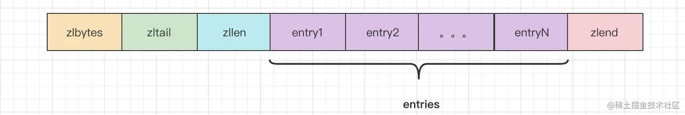
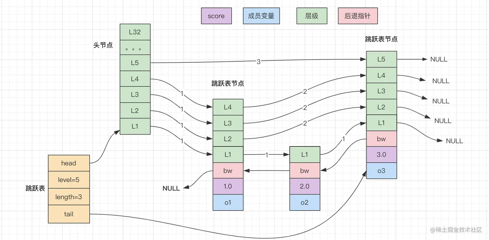

## Redis

> Redis 是基于键值对的非关系型数据库。Redis 拥有string、hash、list、set、zset等多种数据结构, redis具有惊人的读写性能, 其优秀的持久化机制是的它在断电和机械故障时也不会发生数据丢失, 可以用于热点数据存放, 还提供了键过期、发布订阅、食物、流水线、LUA脚本等多个高级功能。

### 1 Redis 数据结构

- `string`: 最基本数据类型, 可以存放入二进制、序列化数据、JSON对象、图片等数据

  - 底层实现: `SDS(Simple Dynamic String) - 动态字符串 `

    可修改字符串, 采用预分配冗余空间的方式减少内存的频繁分配。与Java中的ArrayList比较类似, 实质上也是在空间不足时触发扩容机制, 如果 SDS 值大小< 1M , 则增加一倍；反之如果>1M , 则当前空间加1M作为新的空间。

    

    ```java
    struct sdshdr{
    	//记录buf数组中已使用字节的数量//等于SDS保存字符串的长度4byte
        int len;
    	//记录 buf数组中未使用字节的数量 4 byte
        int free;
    	//字节数组，用于保存字符串字节\0结尾的字符串占用了1byte
        char buf[];
    }
    ```

- `list`:   字符串列表, 按照插入的顺序排序, 元素可以重复, 底层由 `链表` 实现。

  - 底层实现: `ZIPList| LinkedList(双向链表)` 

    当元素字符串的长度小于64字节而且元素个数小于512时，采用 zipList；否则采用likedList；

    - `ZIPList - 压缩列表`: 由连续内存块组成且用于存储小型有序集合或哈希集合的数据结构。主要参数包括: 整个列表占用字节数、偏移量、元素个数、内容列表、结束标志。 **优点: 节省空间**

      

      ```c++
      struct ziplist<T> {
          int32 zlbytes; // 整个压缩列表占用字节数
          int32 zltail_offset; // 最后一个元素距离压缩列表起始位置的偏移量，用于快速定位到最后一个节点
          int16 zllength; // 元素个数
          T[] entries; // 元素内容列表，挨个挨个紧凑存储
          int8 zlend; // 标志压缩列表的结束，值恒为 0xFF
      }
      ```

- `hash`:   string 类型 field 和 value 的集合, 适合存放对象

  - 底层实现: `ZIPList | HashTable` 

    当hash对象的键与值的长度都小于64字节时而且键值对的个数小于512个，采用zipList，其它情况，采用hashTable

    - `ZIPLIST: 参考上述`

    - `HashTable - 哈希表`

      ① 数组 + 链表  ②数组+红黑树(树化方便查找)

      

      根据Key value而直接进行访问的数据结构。它通过**把关键码值映射到表中一个位置来访问记录**（类似索引），以加快查找的速度。这个映射函数叫做**散列函数**，存放记录的数组叫做散列表。

- `set`:    无序不重复的集合

  - 底层实现: `INTSet | HashTable`

    当保存的元素都是整形数字，而且元素个数小于配置范围的时候，则使用intset，否则使用hash表。

    - `INTSet - 整数集合`

      可变长度的整型数组 - 基于整数数组来实现，并且具备长度可变、有序等特征, 包含: 编码方式、长度、内容等主要属性(可以选择不同位数的整数存储)。

      

      ```c
      typedef struct intset {
          uint32_t encoding; /* 编码方式，支持存放16位、32位、64位整数 */
          uint32_t length;  /* 元素个数 */
          int8_t contents[];  /* 整数数组，保存集合数据 */
      } intset;
      ```

- `zset`:   与 set 一样都是 String 类型元素的集合, 且不允许重复, 但 zset 每个元素都会关联一个分数, Redis通过分数来为集合汇总的成员进行从小到大的排序。

  - 底层实现: `ZIPList| SKIPList`

    - `ZIPList: 参考上述`

    - `SKIPList`: 

      一种有序的数据结构，通过在每个节点维护多个指针，从而达到快速访问的目的。 **优点: 实现简单、内存消耗少** **缺点: 不适合范围查询**

      

      跳跃表 - 跳跃表节点结构定义

      ```c
      typedef struct zskiplist{
          // 表头节点和表尾节点
          struct zskiplist *header,*tail;
          // 表节点个数
          unsigned long length;
          // 表节点最大层数
          int level;
      }zskiplist；
      ```

      ```c
      typedef struct zskiplistNode{
           // 层
          struct zskiplistLevel{
              // 前进指针
              struct zskiplistNode *forward;
              // 跨度
              unsigned int span;
              
          }level[];
          // 后退指针
          struct zskiplistNode *backward;
          // 分值
          double score;
          // 成员对象
          robj *robj;
      }zskiplistNode;
      ```

- 四种特殊数据类型: 1）bitmap 2）hyperloglog 3）geo 4）stream


#### 1) zset 与 set 的区别

- set 无序, zset 有序

- zset 底层使用压缩列表和跳跃列表( ziplist & skiplist )

  set 使用 INTSet 和 HashTable


## 计算机网络

### 1 OSI 七层模型 | TCP与UDP | 响应状态码

- OSI 模型

  

  - 应用层: 计算机用户，以及各种应用程序和网络之间的接口，其功能是直接向用户提供服务，完成用户希望在网络上完成的各种工作。

    `HTTP` `SMTP` `FTP` `DNS`

  - 表示层: 负责数据格式的转换，将应用处理的信息转换为适合网络传输的格式，或者将来自下一层的数据转换为上层能处理的格式。

  - 会话层: 建立和管理应用程序之间的通信。 ``

  - 传输层: 监控数据传输服务的质量，保证报文的正确传输。  `报文`  `TCP | UDP`

  - 网络层: 通过路由选择算法，为报文通过通信子网选择最适当的路径。 `数据报` `IP | ICMP | ARP | RARP`

  - 数据链路层: 过各种控制协议，将有差错的物理信道变为无差错的、能可靠传输数据帧的数据链路。 `帧` `MAC`

  - 物理层: 解决硬件通信的问题 `比特`

- **TCP**

  基于连接, 提供可靠传输, 适合对网络通讯要求高的场景, 如: 传输文件、发送邮件、浏览网页等。

- **UDP**

  非连接, 提供不可靠交付, 适合网络通讯要求弱的场景, 如: 视频、语音、直播等

- **响应状态码**

  `200`  请求成功

  `404`  请求资源不存在

  `401`  未验证, 需要进行身份验证

  `500`  服务器错误, 无法完成请求(参数错误、请求方式错误无法响应)

  


### 2 HTTP 请求的过程 | HTTP 与 HTTPS 的区别

- **流程**

  1. 浏览器根据域名解析IP地址(DNS 解析)
  2. 浏览器与服务器建立 TCP 链接(三次握手: 确保双方都同意链接, 防止失效的请求再次发送到服务器)
  3. 浏览器与服务器建立 HTTP 链接
  4. 服务器响应请求, 返回 Response
  5. 浏览器解析 Response 并请求资源
  6. 结束关闭 TCP 链接, 浏览器展示页面(四次挥手: 确保正确的关闭 TCP 链接, 保证数据完整性和可靠性)

- **HTTP 与 HTTPS 的区别**

  HTTP与HTTPS都是位于应用层的数据传输协议, 它们最大的区别在于 HTTPS 对数据的安全性给予保障。

  - 安全性

    HTTP 明文传输未经过加密, 不需要使用证书; HTTPS 使用 SSL | TLS 协议进行加密, 通过证书授权来验证身份进而实现通信加密

  - 连接方式

    HTTP 是无状态协议, 服务端不保存请求信息; HTTPS 是基于安全连接的, 服务端会保存客户端的会话状态。


### 3 三次握手 | 四次挥手

- **三次握手**

  

  客户端向服务端发送 SYN 包, 如果服务端同意返回 SYN+ACK 确认, 客户端收到后再发送 ACK , 服务端收到后即可建立连接。

  `举例`: A 与 B 隔着墙丢沙包, A说: "你可以听到我说话吗?"; B说: "可以听到"; A再说: "那我开始丢沙包了"

  - **问题**

    **1) 为什么不能两次握手?**

    ​	`为了防止已经失效的请求再次请求服务器` - 客户端挂掉的请求再次发送, 会导致服务端陷入长等待。

    `	为了确定双方都具有收发信息的能力`

    **2) 可以四次握手吗?**

    ​	理论上是可以的, 但是三次握手就可以确保双方都拥有收发信息的能力, 4次多余了一次做了无用功。

- **四次挥手**

  

  已经传输数据完毕的客户端和服务端断开连接时, 客户端发送 FIN 报文标识要关闭连接, 服务端收到后发送 ACK 报文询问是否关闭并进入关闭等待状态(资源整理关闭的时间), 在处理等待完之后再次发送 FIN 字段标志服务端已经准备好关闭了, 此时客户端发送确认到服务端, 服务端关闭服务, 客户端进入超时等待。

  `举例`: A 和 B 打电话，通话即将结束后，A 说 “我没啥要说的了”，B 回答 “我知道了”，于是 A 向 B 的连接释放了。但是 B 可能还会有要说的话，于是 B 可能又巴拉巴拉说了一通，最后 B 说“我说完了”，A 回答“知道了”，于是 B 向 A 的连接释放了，这样整个通话就结束了。

- **问题**

  **1) 为什么不可以三次挥手?**

  ​	三次挥手一般指的是将服务端发送 ACK+FIN 报文的过程合并为一次, 这时服务端就无法保证服务端数据是否发送完毕。  `与下面的问题等价↓`

  **2) 为什么连接的时候是三次握手，关闭的时候却是四次握手？**

  ​	在建立连接时服务端收到客户端的SYN连接报文后, 服务端发送SYN用于同步, ACK报文用于应答, 这时并没有数据处理过程自然也不需要等待。但是关闭连接时服务端收到FIN报文时, 很可能还需要发送数据, 这时服务端就会先发送 ACK 报文应答, 然后等待服务端数据发送完毕再发送FIN字段标志发送完毕。

  **3) 为什么客户端要等待超时时间 2MSL？**

  ​	①保证客户端发送的最后一个ACK报文段能够到达服务器。 ②防止已经失效的连接请求报文段出现在本连接中(客户端在发送完最后一个ACK报文段后，再经过时间2MSL。就可以使本连接持续的时间内所产生的所有报文段都在网络中消失。这样就可以在下一个新的连接中不会出现这种旧的连接请求报文段)。


## JUC

### 1 Java 常用的锁和原理

`Synchronized` 和 `Lock` 

- **Synchronized**

  `关键字`; `synchronized 可以自动释放`; `synchronized 不可以判断加锁状态`

  synchronize 的用法及原理:

  synchronized 可以修饰静态方法、代码块、普通方法。它能够保证同一时间只有一个线程执行该代码, 保证线程安全。它能够在执行完毕或出现异常后自动释放锁。底层是采用Java对象头来存储锁信息的,并且还支持锁升级。在JVM里的实现都是 基于进入和退出 Monitor 对象来实现方法同步和代码块同步。synchronized 加在普通方法上, 锁当前实例; 加在静态方法, 锁当前类的从class对象;加在代码块上, 则需要在关键字后面的小括号里,显式指定一个对象作为锁对象。

- **Lock**

  `接口`; `Lock 加锁不会自动释放`; `Lock 可以通过 tryLock() 判断加锁状态`;

  


### 2 volatile 的用法及原理

`volatile 是一个Java的关键字，用来解决内存可见性问题的。它能够保证线程之间可见, 通过添加屏障的方式避免指令重排序导致的线程安全问题。`

- 保证线程之间的可见性

  volatile 关闭 JIT(即时编译器) 对其所修饰变量的优化(多线程并发的情况下, JIT 优化有时候会导致非预期的结果)

- 禁止指令重排序

  volatile 禁止指令重排序(添加屏障)

  写操作加的屏障是阻止上方其它写操作越过屏障排到volatile变量写之下
  读操作加的屏障是阻止下方其它读操作越过屏障排到volatile变量读之上

  volatile使用技巧:

  - 写变量让 volatile 修饰的变量的在代码最后位置
  - 读变量让 volatile 修饰的变量的在代码最开始位置


## 设计模式


### 1 单例模式 | 工厂模式 | 策略模式 | 观察者模式

#### 1) **单例模式**

分为饿汉式和懒汉式单例模式

- 饿汉式模式

  在类加载时就创建实例并初始化

  ```java
  public class Singleton(){
      private Singleton(){};
      private static Singleton instance = new Singleton1();
  	private static Singleton getInstance()
      {
          return single;
      }
  }
  ```

- 懒汉式模式

  在类加载时创建实例但不初始化, 只有在用时才初始化。

  ```java
  public class Singleton(){
      private static Singleton instance;
      private Singleton(){};
  	private static synchronized Singleton getInstance()
      {
     		if(instance == null){
              instance = new Singleton();
          }     
          return instance;
      }
  }
  ```


#### 2) **工厂模式**

分为简单工厂、工厂方法、抽象工厂

- 简单工厂

  提供一个统一的工厂类对实现了同一接口的一些类进行实例的创建。如 Animal 生产 Dog、Cat等多个动物。 

  ```java
  interface Sender {
      void Send();
  }
  
  class MailSender implements Sender {
  
      @Override
      public void Send() {
          System.out.println("This is mail sender...");
      }
  }
  
  class SmsSender implements Sender {
  
      @Override
      public void Send() {
          System.out.println("This is sms sender...");
      }
  }
  
  public class FactoryPattern {
      public static void main(String[] args) {
          Sender sender = produce("mail");
          sender.Send();
      }
      public static Sender produce(String str) {
          if ("mail".equals(str)) {
              return new MailSender();
          } else if ("sms".equals(str)) {
              return new SmsSender();
          } else {
              System.out.println("输入错误...");
              return null;
          }
      }
  }
  ```

- 工厂方法

  针对不同的对象提供不同的工厂。如 Animal 分配 DogFactory、CatFactory 生产不同的动物。

- 抽象工厂

  针对不同维度(多个品牌的手机、电脑)的产品提供总的接口, 用于创建不同维度的工厂, 而不需要指定具体类。如: Animal 分为 DogFactory 和 CatFactory, Dog 和 Cat 又分为不同品种, 这时再细分具体的如 OneDog | TwoDog 继承自 DogFactory 实现自己所需的方法。

  工厂方法模式有一个问题就是，类的创建依赖工厂类，也就是说，如果想要扩展程序，必须对工厂类进行修改，这违背了闭包原则，所以，从设计角度考虑，有一定的问题，如何解决？
  那么这就用到了抽象工厂模式，创建多个工厂类，这样一旦需要增加新的功能，直接增加新的工厂类就可以了，不需要修改之前的代码。

  ```java
  interface Provider {
      Sender produce();
  }
  
  interface Sender {
      void Send();
  }
  
  class MailSender implements Sender {
  
      public void Send() {
          System.out.println("This is mail sender...");
      }
  }
  
  class SmsSender implements Sender {
  
      public void Send() {
          System.out.println("This is sms sender...");
      }
  }
  
  class SendMailFactory implements Provider {
  
      public Sender produce() {
          return new MailSender();
      }
  }
  
  class SendSmsFactory implements Provider {
  
      public Sender produce() {
          return new SmsSender();
      }
  }
  
  
  public class FactoryPattern {
      public static void main(String[] args) {
          Provider provider = new SendMailFactory();
          Sender sender = provider.produce();
          sender.Send();
      }
  }
  
  ```

  

#### 3) **策略模式**

> 概念: 策略设计模式是一种行为设计模式。*当在处理一个业务时，有多种处理方式，并且需要再运行时决定使哪一种具体实现时，就会使用策略模式。*
>
> **策略模式本质是**：`分离算法，选择实现`
>
> 通俗来讲：策略模式对应于解决某一个问题的一个算法族，允许用户从该算法族中任选一个算法解决某一问题，同时可以方便的更换算法或者增加新的算法。并且由客户端决定调用哪个算法。
>
> **策略模式的宗旨** 就是将各项方法之间连接起来，达到一个新的方法，微服务的宗旨也是防止服务的多次调用，降低代码的耦合度，因此这么看来策略模式和微服务还是比较相像的。

策略模式:

```java
public interface PaymentStrategy {
    public void payment(BigDecimal amount);
}

public class CreditPaymentStrategy implements PaymentStrategy{
    @Override
    public void payment(BigDecimal amount) {
        System.out.println("使用银行卡支付" + amount);
        // 去调用网联接口
    }
}

public class WechatPaymentStrategy implements PaymentStrategy{
    @Override
    public void payment(BigDecimal amount) {
        System.out.println("使用微信支付" + amount);
        // 调用微信支付API
    }
}

public class AlipayPaymentStrategy implements PaymentStrategy {
    @Override
    public void payment(BigDecimal amount) {
        System.out.println("使用支付宝支付" + amount);
        // 调用支付宝支付API
    }
}

public class PaymentService {
    /**
    * 将strategy作为参数传递给支付服务
    */
    public void payment(PaymentStrategy strategy, BigDecimal amount) {
        strategy.payment(amount);
    }
}


public class StrategyTest {
    public static void main(String[] args) {
        PaymentService paymentService = new PaymentService();
        // 使用微信支付
        paymentService.payment(new WechatPaymentStrategy(), new BigDecimal("100"));
        //使用支付宝支付
        paymentService.payment(new AlipayPaymentStrategy(), new BigDecimal("100"));
    }
}
```

**总结**: 策略模式主要是在需要提供多种业务处理逻辑时, 提供任选的接口, 在拓展是只需要扩展新类即可, 而不需要修改原有的类, 满足开闭原则; 遇到工厂模式需要分类处理(if-else)的时候, 增加功能会违反 `开闭原则` , 策略模式则不会。 [Link1](https://www.cnblogs.com/ysocean/p/15635852.html) [Link2](https://mp.weixin.qq.com/s?__biz=MzIwNjg4MzY4NA==&mid=2247507414&idx=2&sn=ee20414b9c8bcfc2505c3a0110e2e583&chksm=971843dda06fcacba299e137e869496e0503bdba9841114f134736eb92fc4afe0a8cccae3e65&scene=21#wechat_redirect) [Link3](https://juejin.cn/post/7030976391596212255)


- JDK中使用策略模式的例子

  在JDK中最经典的使用策略模式的例子就是`Collections.sort(List<T> list, Comparator<? super T> c)`方法，这个方法接受一个比较器`Compartor`参数，客户端在运行时可以传入一个比较器的实现，`sort()`方法中根据不同实现，按照不同的方式进行排序。

- 策略模式使用场景

  在实际工作中，会有很多场景可以使用策略模式，比如上面例子中的多个支付方式，再比如与不同的第三方销售渠道对接等等。

  **总结一下**

  - 如果在一个系统里面有许多类，它们仅仅在行为上有区别，那么使用策略模式可以动态地让一个对象在许多行为中选择一种行为；
  - 一个系统需要动态地在几种算法中选择一种；
  - 如果一个对象有很多的行为，如果不用恰当的模式，这些行为就只好使用多重的条件选择语句来实现。


#### 4) 观察者模式

> 观察者模式又称为发布/订阅(Publish/Subscribe)模式,在对象之间定义了一对多的依赖，这样一来，当一个对象改变状态，依赖它的对象会收到通知并自动更新(广播)。
>
> 在 `Java` 中，观察者模式通常由两个接口组成：`Subject` 和 `Observer`。`Subject`是被观察的对象，`Observer` 是观察者。`Subject` 接口定义了一系列方法，用于添加、删除和通知观察者，`Observer` 接口定义了一个 `update()` 方法，当 `Subject` 状态发生改变时，该方法被调用。

**实现**

在这个例子中，我们创建了一个`Subject`类，它包含一个列表`observers`，其中包含所有注册的观察者。`Subject`类还有一个状态`state`，它表示主题状态的变化。当状态改变时，`notifyAllObservers()`方法被调用，通知所有观察者更新它们的状态。

我们还创建了三个具体的观察者：`BinaryObserver`，`OctalObserver`和`HexaObserver`。每个观察者都需要一个`Subject`对象，并注册自己到该对象中。当`Subject`状态改变时，每个观察者都会收到通知并更新自己的状态，其中`update()`方法用于更新观察者状态。在`ObserverPatternDemo`类中，我们创建一个`Subject`对象，并向其注册三个观察者。然后，我们对主题进行两次状态更改，并在控制台输出每个观察者的状态。

@: `抽象类 Observer 与主题类 Subject, 实际观察者 A B C 分别继承抽象类。抽象类包含主题, 主题类包含观察者数组。在实际观察值设定主体的同时会把自身传递到主题类的观察者数组中, 这时就能够实现广播 - 调用更新。`

```java
import java.util.ArrayList;
import java.util.List;

public class Subject {
    private List<Observer> observers = new ArrayList<Observer>();
    private int state;

    public int getState() {
        return state;
    }

    public void setState(int state) {
        this.state = state;
        notifyAllObservers();
    }

    public void attach(Observer observer){
        observers.add(observer);
    }

    public void notifyAllObservers(){
        for (Observer observer : observers) {
            observer.update();
        }
    }
}

public abstract class Observer {
    protected Subject subject;
    public abstract void update();
}

public class BinaryObserver extends Observer{

    public BinaryObserver(Subject subject){
        this.subject = subject;
        this.subject.attach(this);
    }

    public void update() {
        System.out.println( "Binary String: " + Integer.toBinaryString( subject.getState() ) );
    }
}

public class OctalObserver extends Observer{

    public OctalObserver(Subject subject){
        this.subject = subject;
        this.subject.attach(this);
    }

    public void update() {
        System.out.println( "Octal String: " + Integer.toOctalString( subject.getState() ) );
    }
}

public class HexaObserver extends Observer{

    public HexaObserver(Subject subject){
        this.subject = subject;
        this.subject.attach(this);
    }

    public void update() {
        System.out.println( "Hex String: " + Integer.toHexString( subject.getState() ).toUpperCase() );
    }
}

public class ObserverPatternDemo {
    public static void main(String[] args) {
        Subject subject = new Subject();

        new HexaObserver(subject);
        new OctalObserver(subject);
        new BinaryObserver(subject);

        System.out.println("First state change: 15");	
        subject.setState(15);
        System.out.println("Second state change: 10");	
        subject.setState(10);
    }
}
```

**OUT**

```cmd
First state change: 15
Hex String: F
Octal String: 17
Binary String: 1111
Second state change: 10
Hex String: A
Octal String: 12
Binary String: 1010
```

- **优点**
  1. 降低耦合性：观察者模式将主题（`Subject`）和观察者（`Observer`）之间的依赖关系解耦，使得它们可以独立地改变。主题不需要知道哪些观察者正在观察它，观察者也不需要知道主题的细节。
  2. 易于扩展：由于观察者模式是松散耦合的，因此可以很容易地添加或删除观察者，而不会影响主题或其他观察者。这使得代码更加灵活，易于扩展。
  3. 实现了开放/封闭原则：观察者模式遵循开放/封闭原则，即对于扩展是开放的，对于修改是封闭的。这意味着可以通过添加新的观察者来扩展系统的功能，而不必更改现有代码。
  4. 实现了可重用性：观察者模式将主题和观察者分离，使它们可以独立地进行测试和重用。
  5. 提高了灵活性和可维护性：观察者模式使得系统中的对象之间的通信变得更加灵活和可维护。它还使代码更易于理解和维护。
- **缺点**
  1. 内存泄漏：在观察者模式中，观察者需要注册到主题对象，当观察者不再需要时，需要从主题中注销，否则会导致内存泄漏。因为如果观察者对象没有被注销，则主题对象将保留对它的引用，这将防止观察者被垃圾回收。
  2. 性能问题：观察者模式在一些情况下可能会导致性能问题。当主题对象有大量观察者时，每当主题状态发生变化时，所有观察者都会被通知，这可能会导致性能问题。
  3. 并发问题：如果多个线程同时访问主题对象，并且主题对象在处理一个观察者时状态发生了变化，则可能会导致并发问题。因此，在使用观察者模式时需要小心处理并发问题。
  4. 对象的生命周期问题：观察者模式中的主题对象和观察者对象之间可能存在生命周期的问题。如果观察者对象在主题对象的生命周期内保持活动状态，这可能会导致一些不必要的问题


#### 5) 代理模式

- 静态代理

  `为其它所有对象编写代理类, 提供一种代理以控制对这个对象的访问(可以增强代码) - 外包 | 中介`

  假如一个班的同学要向老师交班费，但是都是通过班长把自己的钱转交给老师。这里，班长就是代理学生上交班费，班长就是学生的代理。

  首先，我们创建一个Person接口。这个接口就是学生（被代理类），和班长（代理类）的公共接口，他们都有上交班费的行为。这样，学生上交班费就可以让班长来代理执行。

  ```php
  /** * 创建Person接口
   * @author Gonjan
   */public interface Person {    
       //上交班费    
       void giveMoney();
   }
  ```

  Student类实现Person接口。Student可以具体实施上交班费的动作。

  ```java
  public class Student implements Person {    
      private String name;    
      public Student(String name) {        
          this.name = name;    
      }
      @Override    
      public void giveMoney() {       
          System.out.println(name + "上交班费50元");    
      }
  }
  ```

  StudentsProxy类，这个类也实现了Person接口，但是还另外持有一个学生类对象，由于实现了Peson接口，同时持有一个学生对象，那么他可以代理学生类对象执行上交班费（执行giveMoney()方法）行为。

  ```java
  /** * 学生代理类，也实现了Person接口，保存一个学生实体，这样既可以代理学生产生行为
   * @author Gonjan
   *
   */public class StudentsProxy implements Person{    
       //被代理的学生    
       Student stu;
      public StudentsProxy(Person stu) {        
          // 只代理学生对象        
          if(stu.getClass() == Student.class) {            
              this.stu = (Student)stu;        
          }    
      }
      //代理上交班费，调用被代理学生的上交班费行为    
       public void giveMoney() {        
           stu.giveMoney();    
       }
   }
  ```

  下面测试一下，看如何使用代理模式：

  ```cpp
  public class StaticProxyTest {    
      public static void main(String[] args) {        
          //被代理的学生张三，他的班费上交有代理对象monitor（班长）完成        
          Person zhangsan = new Student("张三");
              //生成代理对象，并将张三传给代理对象        
          Person monitor = new StudentsProxy(zhangsan);
              //班长代理上交班费        
          monitor.giveMoney();    
  	}
  } 
  ```

- 动态代理

  不事先为每个需要代理的类写代理类, 而是在运行时动态的创建对应的代理类。实质上也就是通过反射技术, 在运行时判断是否需要代理, 如果需要代理的就使用反射获取对应的类再加以控制。


