## Redis

> Redis 是基于键值对的非关系型数据库。Redis 拥有 string、hash、list、set、zset 等多种数据结构, redis 具有惊人的读写性能, 其优秀的持久化机制是的它在断电和机械故障时也不会发生数据丢失, 可以用于热点数据存放, 还提供了键过期、发布订阅、食物、流水线、LUA脚本等多个高级功能。

### 1 Redis 数据结构 

- `string`: 最基本数据类型, 可以存放入二进制、序列化数据、JSON对象、图片等数据 

  - 语法:

    ```redis
    set key value   //存储
    	set username super     
    get key			//获取
    	get username
    del key 		//删除
    	del username
    ```

  - 底层实现: `SDS(Simple Dynamic String) - 动态字符串 `

    可修改字符串, 采用预分配冗余空间的方式减少内存的频繁分配。与Java中的ArrayList比较类似, 实质上也是在空间不足时触发扩容机制, 如果 SDS 值大小< 1M , 则增加一倍；反之如果>1M , 则当前空间加1M作为新的空间。

    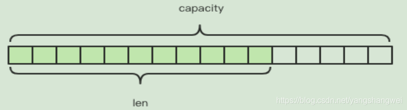

    ```java
    struct sdshdr{
    	//记录buf数组中已使用字节的数量//等于SDS保存字符串的长度4byte
        int len;
    	//记录 buf数组中未使用字节的数量 4 byte
        int free;
    	//字节数组，用于保存字符串字节\0结尾的字符串占用了1byte
        char buf[];
    }
    ```
  
- `list`:   字符串列表, 按照插入的顺序排序, 元素可以重复, 底层由 `链表` 实现。

  - 语法:

    ```redis
    lpush key value			//元素加入左列表
    	lpush username super
    rpush key value			//元素加入右列表
    	rpush username super
    lrange key start end		//范围获取
    	lrange person 0 -1			//获取全部
    lpop person				//删除列表最左边的元素，并将元素返回
    	lpop person
    rpop key				//删除列表最右边的元素，并将元素返回
    	rpop person
    ```

  - 底层实现: `ZIPList| LinkedList(双向链表)` 

    当元素字符串的长度小于64字节而且元素个数小于512时，采用 zipList；否则采用linkedList；

    - `ZIPList - 压缩列表`: 由连续内存块组成且用于存储小型有序集合或哈希集合的数据结构。主要参数包括: 整个列表占用字节数、偏移量、元素个数、内容列表、结束标志。 **优点: 节省空间**

      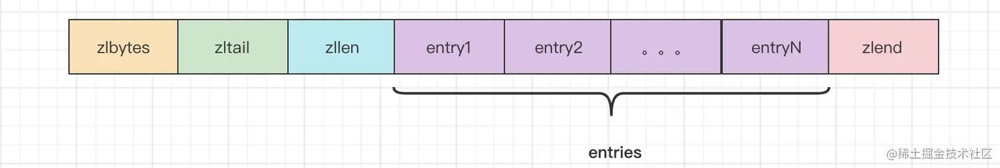

      ```c++
      struct ziplist<T> {
          int32 zlbytes; // 整个压缩列表占用字节数
          int32 zltail_offset; // 最后一个元素距离压缩列表起始位置的偏移量，用于快速定位到最后一个节点
          int16 zllength; // 元素个数
          T[] entries; // 元素内容列表，挨个挨个紧凑存储
          int8 zlend; // 标志压缩列表的结束，值恒为 0xFF
      }
      ```

- `hash`:   string 类型 field 和 value 的集合, 适合存放对象

  - 语法:

    ```redis
    hset key field value 		//存储
    	hset person username super
    hget person username		//获取
    	hget person username
    hgetall key					//获取所有的key : value
    	hgetall person	
    hdel key field				//删除
    	hdel person username
    ```

  - 底层实现: `ZIPList | HashTable` 

    当hash对象的键与值的长度都小于64字节时而且键值对的个数小于512个，采用zipList，其它情况，采用hashTable

    - `ZIPLIST: 参考上述`

    - `HashTable - 哈希表`

      ① 数组 + 链表  ②数组+红黑树(树化方便查找)

      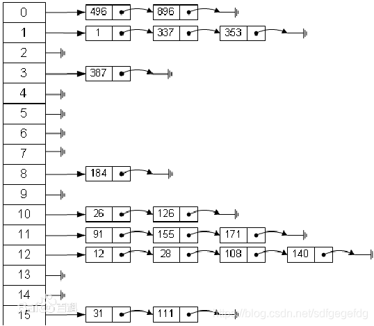

      根据Key value而直接进行访问的数据结构。它通过**把关键码值映射到表中一个位置来访问记录**（类似索引），以加快查找的速度。这个映射函数叫做**散列函数**，存放记录的数组叫做散列表。

- `set`:    无序不重复的集合

  - 语法

    ```redis
    sadd key value		//存储
    	sadd person a
    smembers key 		/获取所有
    	smembers person
    srem key value		//删除元素
    	srem person a	
    ```

    

  - 底层实现: `INTSet | HashTable`

    当保存的元素都是整形数字，而且元素个数小于配置范围的时候，则使用intset，否则使用hash表。

    - `INTSet - 整数集合`

      可变长度的整型数组 - 基于整数数组来实现，并且具备长度可变、有序等特征, 包含: 编码方式、长度、内容等主要属性(可以选择不同位数的整数存储)。

      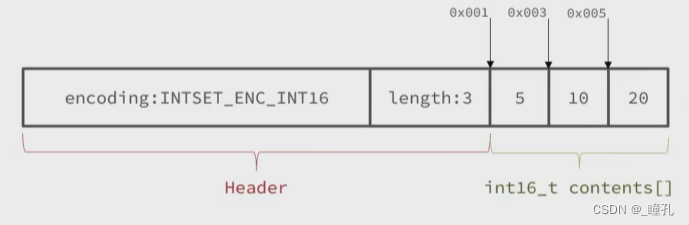

      ```c
      typedef struct intset {
          uint32_t encoding; /* 编码方式，支持存放16位、32位、64位整数 */
          uint32_t length;  /* 元素个数 */
          int8_t contents[];  /* 整数数组，保存集合数据 */
      } intset;
      ```

- `zset`:   与 set 一样都是 String 类型元素的集合, 且不允许重复, 但 zset 每个元素都会关联一个分数, Redis通过分数来为集合汇总的成员进行从小到大的排序。

  - 语法

    ```redis
    zadd key score value		//存储
    	zadd person 30 math
    zrange key start end		//获取
    	zrange person 0 -1   	 //获取所有
    zrem key value				//删除
    	zren person math	   
    ```

  - 底层实现: `ZIPList| SKIPList`

    - `ZIPList: 参考上述`

    - `SKIPList`: 

      一种有序的数据结构，通过在每个节点维护多个指针，从而达到快速访问的目的。 **优点: 实现简单、内存消耗少** **缺点: 不适合范围查询**

      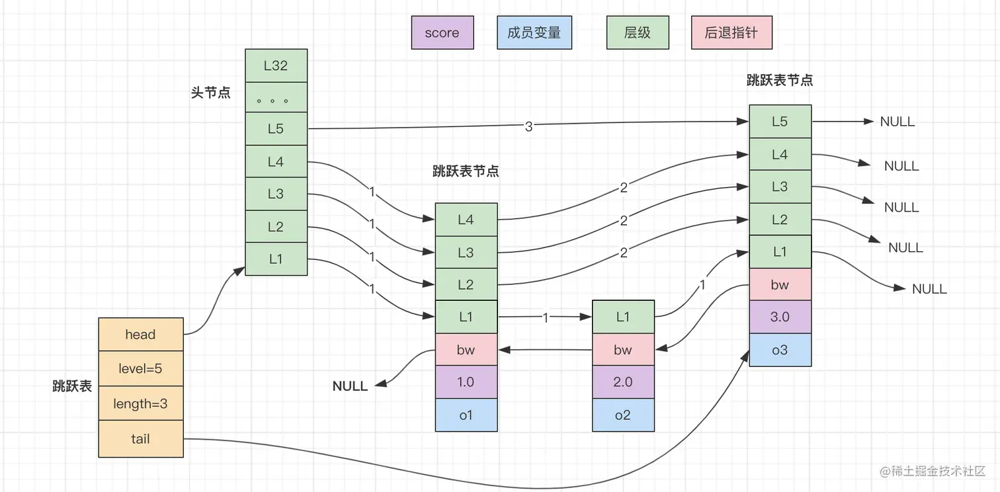

      跳跃表 - 跳跃表节点结构定义

      ```c
      typedef struct zskiplist{
          // 表头节点和表尾节点
          struct zskiplist *header,*tail;
          // 表节点个数
          unsigned long length;
          // 表节点最大层数
          int level;
      }zskiplist；
      ```

      ```c
      typedef struct zskiplistNode{
           // 层
          struct zskiplistLevel{
              // 前进指针
              struct zskiplistNode *forward;
              // 跨度
              unsigned int span;
              
          }level[];
          // 后退指针
          struct zskiplistNode *backward;
          // 分值
          double score;
          // 成员对象
          robj *robj;
      }zskiplistNode;
      ```

- 四种特殊数据类型: 1）bitmap 2）hyperloglog 3）geo 4）stream


#### 1) zset 与 set 的区别

- set 无序, zset 有序

- zset 底层使用压缩列表和跳跃列表( ziplist & skiplist )

  set 使用 INTSet 和 HashTable


### 2 Key 过期策略

- `定期删除 ` - `过期 Key 保存在字典, 定期随机抽取20个Key, 删除其中过期的, 如果比例超过1/4, 重复删除步骤。`

  redis 会将每个设置了过期时间的 key 放入到一个独立的字典中，以后会定期遍历这个字典来删除到期的 key。

  Redis 默认会每秒进行十次过期扫描（100ms一次），过期扫描不会遍历过期字典中所有的 key，而是采用了一种简单的贪心策略。

  1.从过期字典中随机 20 个 key；

  2.删除这 20 个 key 中已经过期的 key；

  3.如果过期的 key 比率超过 1/4，那就重复步骤 1；

  redis默认是每隔 100ms就随机抽取一些设置了过期时间的key，检查其是否过期，如果过期就删除。注意这里是随机抽取的。为什么要随机呢？你想一想假如 redis 存了几十万个 key ，每隔100ms就遍历所有的设置过期时间的 key 的话，就会给 CPU 带来很大的负载。

- `惰性删除` - `访问时发现 Key 过期, 直接删除不返回任何值`

  在客户端访问这个key的时候，redis对key的过期时间进行检查，如果过期了就立即删除，不会给你返回任何东西。

  定期删除可能会导致很多过期key到了时间并没有被删除掉。所以就有了惰性删除。假如你的过期 key，靠定期删除没有被删除掉，还停留在内存里，除非你的系统去查一下那个 key，才会被redis给删除掉。这就是所谓的惰性删除，即当你主动去查过期的key时,如果发现key过期了,就立即进行删除,不返回任何东西。


### 3 内存淘汰策略

LFU: 最近最少使用(频次)   LRU: 最近最久未用(使用记录: 最近使用的放在前边（最左边），最近没用的放到后边（最右边）)

> 数据的淘汰策略: 当Redis中的内存不够用时，此时在向Redis中添加新的key，那么Redis就会按照某一种规则将内存中的数据删除掉，这种数据的删除规则被称之为内存的淘汰策略。

- noeviction:      不淘汰任何key，但是内存满时不允许写入新数据，默认策略。

- volatile-TTL:    对设置了TTL的key，比较key的剩余TTL值，TTL越小越先被淘汰。

- allkeys -RANDOM: 对全体key，随机进行淘汰。
- volatile-RANDOM: 对设置了TTL的key，随机进行淘汰。
- alkeys  -LRU:    对全体key，基于LRU算法进行淘汰
- volatile-LRU:    对设置了TTL的key，基于LRU算法进行淘汰

- allkeys -LFU:    对全体key，基于LFU算法进行淘汰

- volatile-LFU:    对设置了TTL的key，基于LFU算法进行淘汰


### 4 主从同步机制

- 主从同步

  - 全量同步 `RDB(快照)`

    一般发生在第一次连接时, 原理为将当前数据写入到 RDB文件 后发送给从机读取到丛机的内存中。

  - 增量同步 `AOF(命令)`

    一般发生在第一次之后的链接时, 主机同步期间发生的数据变化会以命令的形式写入缓存中, 当校验到正确的从机ID时获取从机的偏移量,然后从偏移量记录的命令开始将未同步的数据操作命令发送给从机执行, 进而完成数据同步。


### 5 Redis 分布式锁

- **SETNX（SET if Not eXists）**

  通过在 Redis 中设置一个特定的键值对来表示锁的状态。使用 SETNX 指令可以确保只有一个客户端能够成功设置该键，其他客户端会得到失败的返回值。通过设置适当的超时时间，可以避免锁被永久占用。  *无法指定过期时间 - 可通过LUA脚本设置*

  如果返回值为 1，则表示获取到了锁；如果返回值为 0，则表示锁已经被其他客户端占用。

  ```redis
  SETNX lock_key 1
  ```

- **SET + NX + EX|PX**

  使用 SET + NX + EX 指令结合 EX（过期时间）, 但在设置锁时，同时设置一个适当的过期时间。这样即使锁没有被主动释放，也能保证一段时间后自动释放，避免死锁。

  下述代码中，锁的过期时间被设置为 10 秒，10 秒后锁会自动释放。

  ```cmd
  SET lock_key 1 EX 10 NX
  ```

- **其它**

  `Redlock` `Redisson` `Lua 脚本`

- **问题**

  - 确保锁的唯一性：使用一个全局唯一的键来表示锁，避免不同客户端之间的冲突。

  - 避免死锁：设置适当的超时时间或过期时间，确保即使锁没有被主动释放，也能够自动释放。

  - 处理异常情况：在获取锁和释放锁的过程中，需要处理异常情况，确保锁的正常使用。

  - 考虑锁的可重入性：根据具体需求，决定是否支持同一个客户端多次获取同一把锁。


### 6 LUA 脚本 | SETNX PX EX

- **LUA**

  Lua是一种轻量小巧的脚本语言，用标准C语言编写并以源代码形式开放。其设计目的就是为了嵌入应用程序中，从而为应用程序提供灵活的扩展和定制功能。

  `C语言编写 `的脚本语言, 在 Redis 默认 `支持原子操作` , 即所有的操作要么都完成, 要么都不完成。

  \- EVAL
  \- EVALSHA
  \- SCRIPT LOAD - SCRIPT EXISTS
  \- SCRIPT FLUSH
  \- SCRIPT KILL

  ```c
  // 释放锁时，先比较锁对应的 value 值是否相等，避免锁的误释放
  if redis.call("get",KEYS[1]) == ARGV[1] then
      return redis.call("del",KEYS[1])
  else
      return 0
  end
  ```

- **NX PX EX**

  3者都是SET命令的参数, 用于设置键的值和过期时间。

  - NX(if Not eXists)  

    表示只有在键不存在时才设置键的值。如果键已经存在，则设置操作会被忽略，不会对键进行任何修改。

  - EX(Expire) | PX

    过期时间 **秒** | 过期时间 **毫秒**

  Example: 如果 lock_key 键不存在，则设置它的值为1，同时设置过期时间为`10`秒。如果`lock_key`键已经存在，则不做任何操作，同时返回`NULL`表示设置失败。

  ```cmd
  SET lock_key 1 EX 10 NX
  ```

  

### 6 数据库与缓存双写一致性

`更新 | 写入才存在`  `读取时先更数据库, 再删缓存`

四种同步策略: 

- 先更新数据库再更新缓存

  多线程并发会出现数据不一致情况

- 先更缓存再更数据库

  每次数据变化可以及时更新缓存, 但是消耗大、性能不高。

- **先删除缓存再更新数据库 + 延时双删**

  也可能导致数据不一致情况(Redis删除两次 - 中间间隔一定时间)

  ```java
  //一致性策略: 先删缓存, 再更新数据库 + 延时双删
  redisUtils.delete("staffCache::" + object.getId());
  //更新数据库
  staffService.save(object);
  //延时
  Thread.sleep(200);
  redisUtils.delete("staffCache::" + object.getId());
  ```

- 先更新数据库再删除缓存

  也可能导致数据不一致情况, 最优方案: 出错时可以使用重试机制来异步重新处理。


### 7 缓存穿透、击穿、雪崩的区别

- **缓存穿透**

  客户端访问不存在的数据, 请求直接发送到数据库, 导致数据库负荷过大宕机。

  解决方式: 缓存 `NULL` 值, 直接返回 `NULL`; 使用布隆过滤器, 访问缓存时先经过过滤器拦截, 如果请求的数据不存在直接返回空。

- **缓存击穿**

  某个热点数据在其过期的瞬间, 访问量特别大, 导致大量请求发送到数据库造成宕机。  *单个KEY*

  解决方式: `互斥锁` `永不过期, 不设置过期时间` `随机逼退, 查询失败随机睡眠一段时间` 

- **缓存雪崩**

  设置相同过期时间, 大量数据同时到期; 某个 `Redis` 节点故障导致服务不可用, 所有的数据请求直达数据库造成数据库宕机。   *大量KEY*

  解决方式: `设置随机过期时间`  `永不过期` `互斥锁` `降级和熔断措施` `主从|集群保证高可用`

  *降级: 降级指系统将某些业务或者接口的功能降低，可以是只提供部分功能，也可以是完全停掉所有功能。降级的核心思想就是丢车保帅，优先保证核心业务。*


### 8 Redis 高可用

- 主从复制

  数据写放在主服务器上, 从服务器负责同步数据。缺点: 当主服务器挂掉, 不能切换到从服务器上。优点:一定程度上可以分担主服务器读的压力。

- 哨兵模式

  构建多个哨兵节点监视主服务器, 当主服务器挂掉则自动将对应的从服务器设为主服务器。

  优点: 自动切换、可用性高。  缺点: 主从服务器存储数据一致, 内存可用性较差, 还需要维护哨兵系统比较麻烦。

- 集群模式

  采用无中心节点的方式实现, 多个服务器相连, 一个主服务器可以有多个从服务器, 不同主服务器存储不同的数据。

  优点: 可用性更高


### 9 Redis 的单线程架构 | 持久化策略?

- 单线程架构

  Redis 采用了 单线程 + IO 复用技术, 这里的单线程指Redis读写操作和网络IO使用一个线程完成, 其他操作如持久化、异步删除等依赖于其他线程执行。Redis 快的原因在于, 其使用`单线程`避免了线程切换和锁竞争带来的消耗; 将操作放在 `内存中执行` ; 采用 `IO多路复用`, 实现在网络IO中处理大量并发请求, 实现高吞吐率。

- 持久化策略

  - **RDB** redis database 快照机制

    `将某一时刻的内存快照数据以二进制方式写入磁盘` Redis 要求在指定的时间隔内将内存中数据快照写入磁盘, 文件名为 dump.rdb, 适合大规模数据恢复, 对数据库完整性和读写一致性要求不是很高, 一定时间间隔备份一次。出现意外故障时, 数据无法恢复。

  - **AOF** append only file 文件追加机制

    `将所有的操作命令按顺序记录下来，追加到特殊的文件中` 以日志的形式记录每次写操作, 只允许追加而不允许修改文件, Redis 启动都会读取该文件, 从头到尾执行一次来恢复数据。但对磁盘IO较多, 性能比较差, 但安全性高, 一般也推荐使用 AOF 格式。
    
  - **混合机制**
  
    二者混合


### 10 布隆过滤器

**位数组（二进制数组）+ 多个无偏hash函数**

布隆过滤器提供了两个参数，分别是预计加入元素的大小n，运行的错误率f。布隆过滤器中有算法根据这两个参数会计算出二进制数组的大小l，以及无偏hash函数的个数k。

- 错误率越低，位数组越长，控件占用较大
- 错误率越低，无偏hash函数越多，计算耗时较长

`添加`

1. 使用布隆过滤器中的哈希函数对元素值进行计算，得到哈希值（有几个哈希函数得到几个哈希值）。
2. 根据得到的哈希值，在位数组中把对应下标的值置为 1。

`查询`

1. 对给定元素再次进行相同的哈希计算；
2. 得到值之后判断位数组中的每个元素是否都为 1，如果值都为 1，那么说明这个值在布隆过滤器中，如果存在一个值不为 1，说明该元素不在布隆过滤器中。


### 11 脑裂

> 概念: Redis 集群中出现两个主节点的情况。
>
> 原因: 当前主库突然出现暂时性 “失联”，而并不是真的发生了故障，此时监听的哨兵会自动启动主从切换机制。当这个原始的主库从假故障中恢复后，又开始处理请求，但是哨兵已经选出了新的主库，这样一来，旧的主库和新主库就会同时存在，这就是**脑裂现象**。

- **影响**

  客户端不知道应该往哪个主节点写入数据，结果就是不同的客户端会往不同的主节点上写入数据, 脑裂会进一步导致数据丢失。等到哨兵让原主库和新主库做全量同步后,原主库需要清空本地的数据后加载新主库发送的RDB 文件,原主库在切换期间保存的数据就丢失了。

- **解决办法**

  `min-slaves-to-write 3`  *最小从服务器数* 主库最少得有 N 个健康的从库存活才能执行写命令
  `min-slaves-max-lag 10`  *从连接的最大延迟时间*   从库和主库进行数据复制时的 ACK 消息延迟的最大时间

  解释: 要求至少3个slave节点，且数据复制和同步的延迟不能超过10秒，否则的话master就会拒绝写请求，配置了这两个参数之后，如果发生集群脑裂，原先的master节点接收到客户端的写入请求会拒绝，就可以减少数据同步之后的数据丢失。  *防止原先的主库依旧接受请求导致的数据丢失情况*


## 计算机网络

### 1 OSI 七层模型 | TCP与UDP | 响应状态码

- OSI 模型

  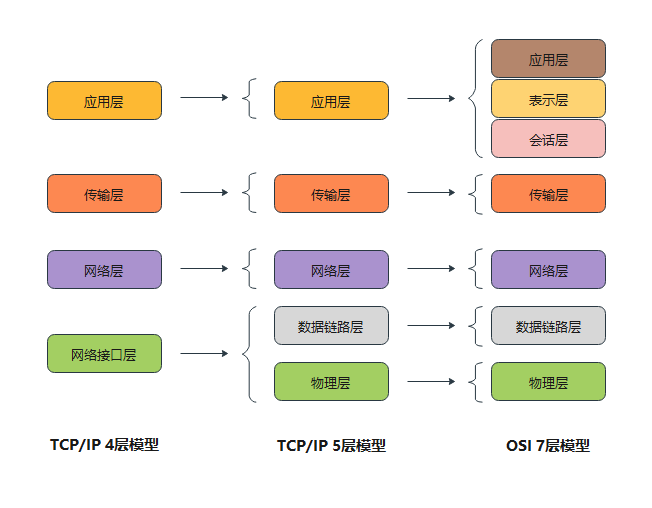

  - 应用层: 提供用户与应用程序和网络之间的服务接口，完成用户希望在网络上完成的各种工作。

    `HTTP` `SMTP` `FTP` `DNS`

  - 表示层: 负责数据格式的转换，将应用处理的信息转换为适合网络传输的格式，或者将来自下一层的数据转换为上层能处理的格式。

  - 会话层: 建立和管理应用程序之间的通信。 

  - 传输层: 监控数据传输服务的质量，保证报文的正确传输。  `报文`  `TCP | UDP`

  - 网络层: 通过路由选择算法，为报文通过通信子网选择最适当的路径。 `数据报` `IP | ICMP | ARP | RARP`

  - 数据链路层: 过各种控制协议，将有差错的物理信道变为无差错的、能可靠传输数据帧的数据链路。 `帧` `MAC`

  - 物理层: 解决硬件通信的问题 `比特`

- **响应状态码**

  `200`  请求成功

  `400`  客户端请求报文中存在语法错误，服务器无法理解

  `401`  未验证, 需要进行身份验证

  `403`  服务器拒绝执行

  `404`  请求资源不存在
  
  `500`  服务器错误, 无法完成请求(参数错误、请求方式错误无法响应)


### 2 HTTP 请求的过程 | HTTP 与 HTTPS 的区别

- **流程**

  1. 浏览器根据域名解析IP地址(DNS 解析)
  2. 浏览器与服务器建立 TCP 链接(三次握手: 确保双方都同意链接, 防止失效的请求再次发送到服务器)
  3. 浏览器与服务器建立 HTTP 链接
  4. 服务器响应请求, 返回 Response
  5. 浏览器解析 Response 并请求资源
  6. 结束关闭 TCP 链接, 浏览器展示页面(四次挥手: 确保正确的关闭 TCP 链接, 保证数据完整性和可靠性)

- **HTTP 与 HTTPS 的区别**

  HTTP 与 HTTPS 都是位于应用层的数据传输协议, 它们最大的区别在于 HTTPS 对数据的安全性给予保障。

  - 安全性

    HTTP 明文传输未经过加密, 不需要使用证书; HTTPS 使用 SSL | TLS 协议进行加密, 通过证书授权来验证身份进而实现通信加密

  - 连接方式

    HTTP 是无状态协议, 服务端不保存请求信息; HTTPS 是基于安全连接的, 服务端会保存客户端的会话状态。


### 3 三次握手 | 四次挥手

- **三次握手**

  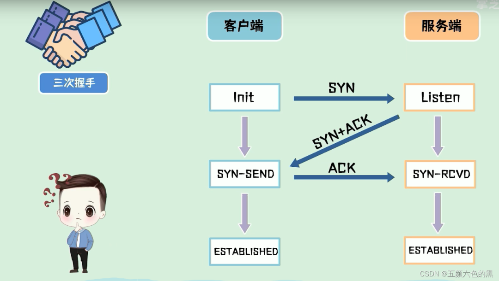

  客户端向服务端发送 SYN 包, 如果服务端同意返回 SYN+ACK 确认, 客户端收到后再发送 ACK , 服务端收到后即可建立连接。

  `举例`: A 与 B 隔着墙丢沙包, A说: "你可以听到我说话吗?"; B 说: "可以听到"; A 再说: "那我开始丢沙包了"

  - **问题**

    **1) 为什么不能两次握手?**

    ​	`为了防止已经失效的请求再次请求服务器` - 客户端挂掉的请求再次发送, 会导致服务端陷入长等待。

       `为了确定双方都具有收发信息的能力`

    **2) 可以四次握手吗?**

    ​	理论上是可以的, 但是三次握手就可以确保双方都拥有收发信息的能力, 4次多余了一次做了无用功。

- **四次挥手**

  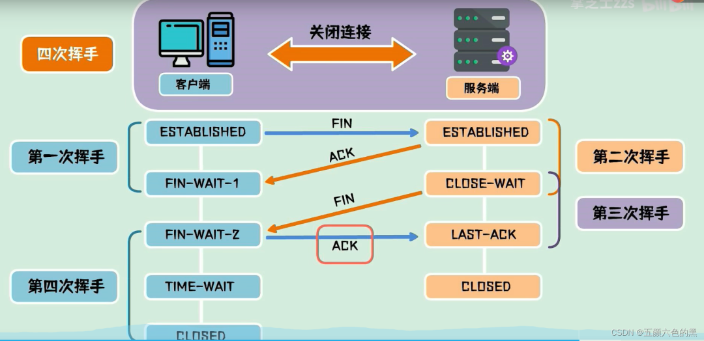

  已经传输数据完毕的客户端和服务端断开连接时, 客户端发送 FIN 报文标识要关闭连接, 服务端收到后发送 ACK 报文询问是否关闭并进入关闭等待状态(资源整理关闭的时间), 在处理等待完之后再次发送 FIN 字段标志服务端已经准备好关闭了, 此时客户端发送确认到服务端, 服务端关闭服务, 客户端进入超时等待。

  `举例`: A 和 B 打电话，通话即将结束后，A 说 “我没啥要说的了”，B 回答 “我知道了”，于是 A 向 B 的连接释放了。但是 B 可能还会有要说的话，于是 B 可能又巴拉巴拉说了一通，最后 B 说“我说完了”，A 回答“知道了”，于是 B 向 A 的连接释放了，这样整个通话就结束了。

- **问题**

  **1) 为什么不可以三次挥手?**

  ​	三次挥手一般指的是将服务端发送 ACK+FIN 报文的过程合并为一次, 这时服务端就无法保证服务端数据是否发送完毕。  `与下面的问题等价↓`

  **2) 为什么连接的时候是三次握手，关闭的时候却是四次握手？**

  ​	在建立连接时服务端收到客户端的SYN连接报文后, 服务端发送SYN用于同步, ACK报文用于应答, 这时并没有数据处理过程自然也不需要等待。但是关闭连接时服务端收到FIN报文时, 很可能还需要发送数据, 这时服务端就会先发送 ACK 报文应答, 然后等待服务端数据发送完毕再发送FIN字段标志发送完毕。

  **3) 为什么客户端要等待超时时间 2MSL？**

  ​	①*保证客户端发送的最后一个ACK报文段能够到达服务器*。 ②*避免上一次TCP连接的数据包影响到下一次的TCP连接*  防止已经失效的连接请求报文段出现在本连接中(客户端在发送完最后一个ACK报文段后，再经过时间2MSL。就可以使本连接持续的时间内所产生的所有报文段都在网络中消失。这样就可以在下一个新的连接中不会出现这种旧的连接请求报文段)。


### 4 JWT 为什么比 cookie 和 session 安全

- `Cookie`

  是以键值对的形式储存在浏览器中，而且在浏览器中可以直接看到数据。

  - 优点：
    1. 结构简单。cookie是一种基于文本的轻量结构，包含简单的键值对。
    2. 数据持久。虽然客户端计算机上cookie的持续时间取决于客户端上的cookie过期处理和用户干预，cookie通常是客户端上持续时间最长的数据保留形式。

  - 缺点：
    1. 大小受到限制。大多数浏览器对 cookie 的大小有 4096 字节的限制，尽管在当今新的浏览器和客户端设备版本中，支持 8192 字节的 cookie 大小已愈发常见。
    2. 非常不安全。cookie将数据裸露在浏览器中，这样大大增大了数据被盗取的风险，所有我们不应该将中要的数据放在cookie中，或者将数据加密处理。
    3. 容易被csrf攻击。可以设置csrf_token来避免攻击。

- `Session`

  session 存储在服务器中，然后发送一个cookie存储在浏览器中，cookie中存储的是session_id，之后每次请求服务器通过session_id可以获取对应的session信息

  - 优点：
    1. session的信息存储在服务端，相比于cookie就在一定程度上加大了数据的安全性；相比于jwt方便进行管理，也就是说当用户登录和主动注销，只需要添加删除对应的session就可以，这样管理起来很方便。

  - 缺点：
    1. session存储在服务端，这就增大了服务器的开销，当用户多的情况下，服务器性能会大大降低。
    2. 因为是基于cookie来进行用户识别的, cookie如果被截获，用户就会很容易受到跨站请求伪造的攻击。
    3. 用户认证之后，服务端做认证记录，如果认证的记录被保存在内存中的话，这意味着用户下次请求还必须要请求在这台服务器上,这样才能拿到授权的资源，这样在分布式的应用上，会限制负载均衡和集群水平拓展的能力。

- `JWT`

  JWT 存储在浏览器的 storage 或者 cookie 中。由服务器产生加密的json数据包括：header，payload和signature三部分组成。header中通常来说由token的生成算法和类型组成；payload中则用来保存相关的状态信息；signature 部分由 header，payload，secret_key 三部分加密生成。 注意，不要在 JWT 的 payload 或 header 中放置敏感信息，除非它们是加密的。

  - 优点：
    1. 因为json的通用性，jwt可以支持跨语言请求，像 JAVA,JavaScript,PHP 等很多语言都可以使用。
    2. 因为有了payload部分，所以JWT可以在自身存储一些其他业务逻辑所必要的非敏感信息。
    3. 便于传输，JWT的构成非常简单，字节占用很小，所以它是非常便于传输的。
    4. 不需要在服务端保存会话信息, 利于服务器横向拓展。

  - 缺点：
    1. 登录状态信息续签问题。比如设置token的有效期为一个小时，那么一个小时后，如果用户仍然在这个web应用上，这个时候当然不能指望用户再登录一次。目前可用的解决办法是在每次用户发出请求都返回一个新的token，前端再用这个新的token来替代旧的，这样每一次请求都会刷新token的有效期。但是这样，需要频繁的生成token。另外一种方案是判断还有多久这个token会过期，在token快要过期时，返回一个新的token。
    2. 用户主动注销。JWT并不支持用户主动退出登录，客户端在别处使用token仍然可以正常访问。为了支持注销，我的解决方案是在注销时将该token加入到服务器的redis黑名单中。

 

### 5 I/O 通信模型

Socket 是一种网络通信的编程接口，它提供了一种机制，使得不同计算机上的程序可以通过网络进行通信。以下的 BIO、AIO、NIO 都是 Socket 通信模型的一种。

- BIO - Blocked IO(阻塞IO)。 当用户线程发送请求后会一直阻塞线程直到数据准备完毕。 `阻塞IO`

- NIO - Nonblocking IO(非阻塞IO)。用户进程发送请求后可做其他工作并不断访问内核数据, 但在数据复制阶段, 用户线程依旧阻塞。 `非阻塞IO`

- AIO - Asynchronous IO(异步IO) 。当用户线程发送请求后, 内核返回回调函数, 该回调函数不包含数据, 用户线程可以处理其他操作, 当数据准备完成后内核将数据发送给用户线程, 而不像同步IO那样由用户线程自己读取。

- IO 多路复用: 单个线程同时处理多个客户端请求。基于 `select`、`poll`、`epoll`三个操作。`select`: 查询多少个文件描述符需要IO, 底层为数组, 因此文件描述符个数有上限。 `poll`: 与select基本一致, 底层为链表, 因此文件描述符个数没有上限。 `epoll`: 更高效, 使用红黑树+链表。

  `poll` 和 `select` 都为轮询方式, 区别在于 `poll` 使用了链表, 因此文件描述符没有上限; `epoll` 则采用回调方式, 它将文件描述符加入到红黑书中, 当每个IO就绪之后直接返回数据, 而不需要多次复制操作。

- Java NIO: 同步非阻塞IO, 


### 6 TCP 粘包和拆包

- **粘包**

  TCP协议中，发送方发送的若干包数据到接收方接收时粘成一包，从接收缓冲区看，后一包数据的头紧接着前一包数据的尾。 *多个包粘在一起, 接收端分不清界限* 

- **拆包**

  TCP 协议发送包过大进行拆分发送(TCP传输数据上限)。 *大数据包拆分* 

- **原因**

  1、要发送的数据大于TCP发送缓冲区剩余空间大小，将会发生拆包。
  2、待发送数据大于MSS（最大报文长度），TCP在传输前将进行拆包。
  3、要发送的数据小于TCP发送缓冲区的大小，TCP将多次写入缓冲区的数据一次发送出去，将会发生粘包。
  4、接收数据端的应用层没有及时读取接收缓冲区中的数据，将发生粘包。

- **解决办法** 

  `关键在于给每个数据包添加边界信息`

  1、*发送端给每个数据包添加包首部*，首部中应该至少包含数据包的长度，这样接收端在接收到数据后，通过读取包首部的长度字段，便知道每一个数据包的实际长度了。
  2、*发送端将每个数据包封装为固定长度*（不够的可以通过补0填充），这样接收端每次从接收缓冲区中读取固定长度的数据就自然而然的把每个数据包拆分开来。
  3、*可以在数据包之间设置边界*，如添加特殊符号，这样，接收端通过这个边界就可以将不同的数据包拆分开。


### 7 TCP 与 UDP

- **TCP**

  `基于连接` `提供可靠传输` `面向字节流` 适合对网络通讯要求高的场景, 如: 传输文件、发送邮件、浏览网页等。

  - **滑动窗口**

    *发送方与接收方各自维护一个窗口, 窗口的大小代表了可以发送或接收的数据量, 发送方通过滑动窗口大小来控制发送数据的速率，接收方通过滑动窗口大小来告知发送方自己可以接收的数据量。* 

    示例：假设发送方的滑动窗口大小为10个数据包，接收方的滑动窗口大小为5个数据包。发送方可以连续发送10个数据包，然后等待接收方确认收到其中的一部分数据后，再发送新的数据。

  - **流量控制**

    *接收方使用滑动窗口的大小来告知发送方自己的接收能力，发送方根据接收方的窗口大小来控制发送数据的速率，确保不会发送超出接收方处理能力范围的数据。* 流量控制是TCP协议中用于调节发送方发送数据的速率，以避免接收方无法及时处理大量数据或发生数据丢失的情况。

    示例：假设接收方的滑动窗口大小为1000字节，表示接收方还有1000字节的缓冲区可用来接收数据。发送方会根据接收方的窗口大小发送适当数量的数据，以确保接收方能够及时处理和接收数据。

  - **拥塞控制**
    *拥塞控制通过动态调整发送方发送数据的速率，以适应网络的拥塞程度。拥塞控制算法包括慢启动、拥塞避免、快速重传和快速恢复等。*  拥塞控制是TCP协议中用于避免网络拥塞和保持网络性能的机制。

    示例：当网络发生拥塞时，路由器的缓冲区可能已满，导致数据包丢失。TCP通过检测到数据包丢失并接收到重复的确认来判断网络是否发生拥塞。一旦拥塞发生，TCP会减小发送窗口的大小，降低发送速率，以避免进一步加重网络拥塞。

    - **算法**
      1. 慢启动（Slow Start）
         慢启动算法是TCP连接刚开始时的拥塞控制阶段。发送方初始将拥塞窗口（Congestion Window）设置为一个较小的值，然后每收到一个确认确认，拥塞窗口就会加倍。这样，拥塞窗口的增长速率呈指数级增长，从而快速适应网络的带宽。
      2. 拥塞避免（Congestion Avoidance）
         拥塞避免算法在慢启动阶段之后启动。发送方每收到一个确认确认，拥塞窗口的增长速率不再是指数级增长，而是线性增长。这样可以避免快速消耗网络资源，使网络更加稳定。
      3. 快速重传（Fast Retransmit）
         快速重传算法用于快速检测丢失的数据包。当发送方连续收到相同的确认确认时，它会认为有个别数据包丢失。而不是等待超时后再重传，发送方立即重传丢失的数据包，以提高数据传输的效率。
      4. 快速恢复（Fast Recovery）
         快速恢复算法是与快速重传算法结合使用的。当发送方检测到丢失的数据包后，它将拥塞窗口减半，并将拥塞窗口设置为慢启动阈值（Slow Start Threshold）的一半。然后，在每次收到确认确认时，拥塞窗口增加一个数据包大小，而不是线性增长。这样可以更快地恢复到正常的拥塞避免阶段。

- **UDP**

  `非连接` `提供不可靠交付` `面向数据报文` 适合网络通讯要求弱的场景, 如: 视频、语音、直播等


### 8 断点续传

- **断点**

  在下载过程中，将一个下载文件分成了多个部分，同时进行多个部分一起的下载，当某个时间点任务被暂停了，此时下载暂停的位置就是断点了。

- **续传**

  当一个未完成的下载任务再次开始时，会从上次的断点继续传送。

- **思路**

  使用多线程断点续传下载的时候，将下载或上传任务（一个文件或一个压缩包）人为的划分为几个部分，每一个部分采用一个线程进行上传或下载，多个线程并发可以占用服务器端更多资源，从而加快下载速度。
  在下载（或上传）过程中，如果网络故障、电量不足等原因导致下载中断，这就需要使用到断点续传功能。下次启动时，可以从记录位置（已经下载的部分）开始，继续下载以后未下载的部分，避免重复部分的下载。断点续传实质就是能记录上一次已下载完成的位置。

- **过程**

  1. 在下载过程中记录每条线程的下载进度。

  2. 每次下载开始之前先读取数据库，查询是否有未完成的记录，有就继续下载，没有则创建新记录插入数据库。

  3. 在每次向文件中写入数据之后，在数据库中更新下载进度。

  4. 下载完成之后删除数据库中下载记录。


### 9 HTTP 和 TCP 长连接的区别

- HTTP

  Keep-Alive，是由应用层（用户态）实现的，称为 HTTP 长连接；  *实质上还是依赖 TCP 保证长连接建立*

  短连接: `建立 TCP -> 请求资源 -> 响应资源 -> 释放连接(不加 Keep-Alive 参数, 资源响应完毕自动断开连接)`

  长连接: `请求-应答模式 - 设置Keep-Alive参数保证客户和服务器端持有同一个TCP链接通信且均不断开连接, 直到某一方提出断开请求` 

- TCP

  Keepalive，是由TCP 层（内核态）实现的，称为 TCP 保活机制；

  `TCP保活机制 - 内核TCP协议栈发送探测报文, 如果及时收到回复则保活; 否则多次未收到回复则判定TCP链接死亡`


## 操作系统

### 1 用户态和内核态

- `用户态 `   User Mode

  运行用户程序, 只能执行一些非特权指令。

- `内核态 `   Kernel Mode

  运行操作系统程序，操作硬件, 能够执行特权指令, 调用IO设备。

- **区别**

  处于用户态执行时，进程所能访问的内存空间和对象受到限制，其所处于占有的处理器是可被抢占的; 处于内核态执行时，则能访问所有的内存空间和对象，且所占有的处理器是不允许被抢占。
  
- **切换方式**  用户态 -> 内核态

   `系统调用`  应用程序需要访问操作系统提供的服务或执行特权操作

   `异常和中断处理`  当发生异常（如除零错误、缺页错误等）或外部中断（如硬件中断、时钟中断等）时

   `信号处理`  当应用程序收到信号时（如SIGINT、SIGTERM等）, 需要执行函数时

   `进程切换`  当操作系统需要进行进程切换时


### 2 进程与线程与协程 | 进程通信 | 线程同步

- 进程通信

  - `管道（Pipe）`：管道是一种半双工的通信方式，数据只能单向流动，而且只能在具有亲缘关系进程间的通信，允许一个进程和另一个与它有共同祖先的进程之间进行通信。（半双工：数据传输指数据可以在一个信号载体的两个方向上传输，但是不能同时传输。）

  - `有名管道（named pipe）`： 有名管道也是半双工的通信方式，但是它允许无亲缘关系进程间的通信。命名管道在文件系统中有对应的文件名。命名管道通过命令 mkfifo 或系统调用 mkfifo 来创建。
  - `信号（Signal）`：信号是比较复杂的通信方式，用于通知接受进程有某种事件发生。

  - `消息（Message）队列`：消息队列是消息的链接表。有足够权限的进程可以向队列中添加消息，被赋予读权限的进程则可以读走队列中的消息。消息队列克服了信号承载信息量少，管道只能承载无格式字节流以及缓冲区大小受限等缺点。
  - `共享内存`：使得多个进程可以访问同一块内存空间，是最快的可用IPC形式。是针对其他通信机制运行效率较低而设计的。往往与其它通信机制，如信号量结合使用，来达到进程间的同步及互斥。
  - `内存映射（mapped memory）`：内存映射允许任何多个进程间通信，每一个使用该机制的进程通过把一个共享的文件映射到自己的进程地址空间来实现它。
  - `信号量（semaphore）`：信号量是一个计数器，可以用来控制多个进程对共享资源的访问。它常作为一种锁机制，防止某进程正在访问共享资源时，其他进程也访问该资源。因此，主要作为进程间以及同一进程内不同线程之间的同步手段。
  - `套接口（Socket）`：更为一般的进程间通信机制，与其他通信机制不同的是，它可用于不同及其间的进程通信。可用于不同机器之间的进程间通信。

- **进程 - 线程 - 协程**

  - 进程: 操作系统的执行单元, 具有独立的内存空间和资源, 进程之间独立运行。

  - 线程: 进程内的一个执行单元, 共享进程的内存空间和资源, 多个线程可以并发执行。

  - 协程: 用户级的轻量级线程, 调度完全由用户控制。切换开销很小, 更适合高并发和IO密集型服务。协程拥有自己的寄存器上下文和栈。协程调度切换时，将寄存器上下文和栈保存到其他地方，在切回来的时候，恢复先前保存的寄存器上下文和栈。因此，协程能保留上一次调用时的状态（即所有局部状态的一个特定组合），每次过程重入时，就相当于进入上一次调用的状态。这个过程完全由程序控制，不需要内核进行调度。  `轻量级并发 - 开销更小` `异步编程 - IO等待而不阻塞, 异步操作` `并发简化 - 不需要考虑竞争锁和细节`

  - **区别**

    `线程 - 协程`:  协程是用户态的轻量级线程，不受内核调度；线程是任务调度和系统执行的最小单位，需要内核调度; 协程不需要内核调度, 系统开销更小; 进程和线程都可以拥有多个协程; 线程与进程都是同步机制, 协程是异步机制; 线程是抢占式的, 协程是非抢占式的, 因此需要用户主动释放。
    
    `进程 - 线程`: *进程有独立的内存空间和资源, 线程则共享进程的资源*; *进程是操作系统资源分配的基本单位*, *线程是处理器调度的基本单位*; *进程切换的资源开销大于线程*; *一个进程包含多个线程*; *进程崩溃不影响其他进程, 线程崩溃则整个进程都故障*。

- **线程同步**

  线程同步（Thread Synchronization）是指在多线程环境下对共享资源的访问进行协调和控制，以避免并发访问造成的数据不一致性或竞争条件问题。当多个线程并发地访问共享资源时，如果没有适当的同步机制，可能会导致数据的不确定性或错误的结果。  `synchronized 和 Lock`

  **线程同步机制**

  `互斥锁` `条件变量` `信号量`   保证在给定的时刻只有一个线程可以访问共享资源，或者在满足特定条件之前线程需要等待。


### 3 死锁 | 产生条件 | 解决办法

- 死锁

  两个或两个以上进程互相争枪对方的资源且不释放自己的资源。

- 原因

  互斥: 一个资源在同一时刻只可被一个线程执行

  请求和保持: 一个线程在请求资源时, 不释放自己持有的资源

  不可剥夺: 资源在使用过程中无法被其它进程强行剥夺, 只能自行释放。

  环路等待: 线程资源需求形成了一条环路, 都无法执行。

- 解决方法

  破坏死锁产生的条件。 如: 资源可剥夺、主动释放等


### 4 JAVA 进程和线程的状态有哪些

- 进程的状态

  `创建`、`就绪`、`运行`、`阻塞`、`销毁`

  new 一个线程时为创建状态, 执行 start() 方法后为就绪状态, 当线程获取CPU资源后执行 run() 进入运行状态, 调用 sleep() 进入阻塞状态, 进程执行完或抛出异常进入销毁状态。

- 线程的状态: Java线程一共有6种状态。

  `NEW`: 新建状态，还没调用 start 方法。

  `Runnable`: 运行状态，线程正在JVM中执行，也可能在等待操作系统的调度。

  `BLOCKED`：阻塞状态，线程正在等待获取监视器锁。

  `WAITING`: 等待状态，线程正在等待其他线程的通知或中断。

  `TIMED_WAITING`: 超时等待状态，在WAITING的基础上增加了超时时间，即超出时间自动返回。

  `TERMINATED`：终止状态，线程已执行完毕。 


## 数据结构

### 1 B | B+ | 红黑树 | MySQL 索引

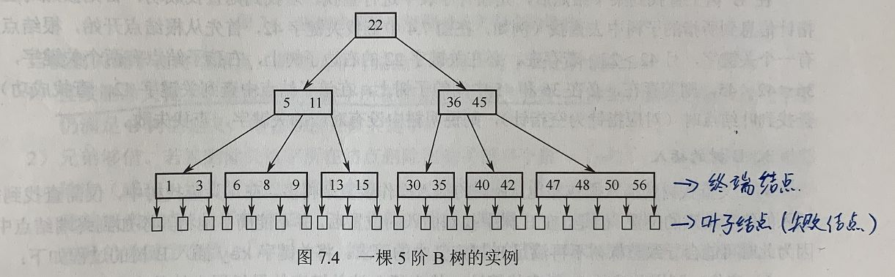

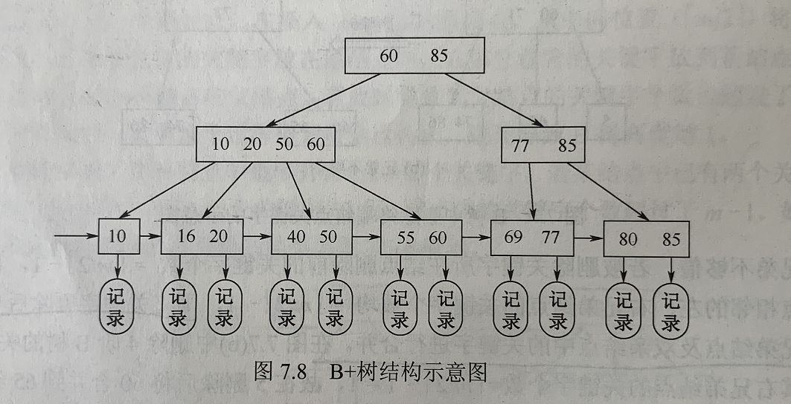

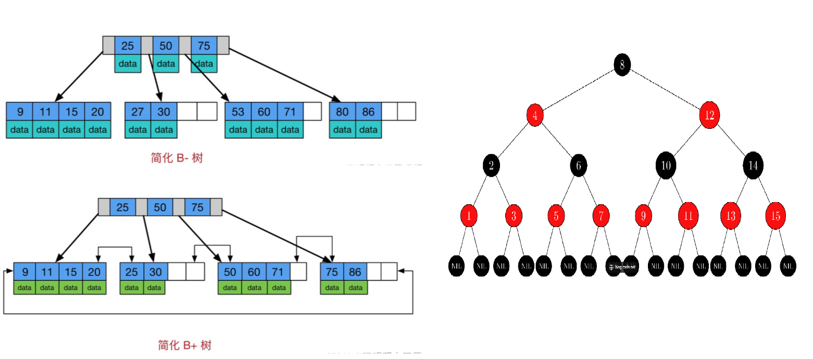

- `B` 树: 平衡的多路搜索树，每个节点可以存储多个键值对。数据存放在叶子结点和非叶子结点上, 所有的叶子结点独立。

- `B+` 树: 非叶子结点只存放 Key, 叶子结点存放数据, 所有的叶子结点之间通过**双向链表**进行连接。 **B+ 树比 B 树更加稳定**

- `红黑树`: 一种自平衡的二叉查找树, 能够在 $O(logN)$ 时间内完成查询、增加、删除操作。

  - **性质**

    结点是红色 | 黑色

    根和叶子都是黑色

    从每个叶子到根的所有路径上不能有两个连续的红色节点 - 父子不能同时为红

    从任一节点到其每个叶子的所有简单路径都包含相同数目的黑色节点（简称黑高）

  - 以上的性质是为了 `红黑树退化为链表`。

- MySQL 索引

  索引是一种帮助快速查找的数据结构, 可以理解为书的目录, 通过索引可以快速找到数据所在的位置。

  为什么不用别的树(红黑树、B树)?

  - 红黑树是二叉树的自平衡二叉树, 它的结构导致它的树高很高, 不利于磁盘I/O操作。 在 `Innodb` 中使用 B+ 树作为索引结构, 相比于二叉树 B+ 树这种多叉树更加矮胖, 能够减少 IO 次数; 同时B+树数据之间的链更适合范围查询。


## 设计模式

### 1 单例模式

#### 1) 饿汉式

`一开始就生成实例`

```java
public class Singleton {
    private static Singleton instance = new Singleton();

    private Singleton(){};

    private static Singleton getInstance(){
        return instance;
    }
}
```


#### 2) 懒汉式

`用时才生成实例`

```java
public class Singleton {
    private static Singleton instance;

    private Singleton(){};

    private static synchronized Singleton getInstance(){
        if(instance == null){
            instance = new Singleton();
        }
        return instance;
    }
}
```


#### 3) 双重校验

> 双重校验(Double-Checked Locking)是一种在单例模式中实现延迟初始化和线程安全的方式。它通过在获取实例时进行额外的检查来避免不必要的同步开销。

```java
public class Singleton {
    private volatile static Singleton instance;

    private Singleton() {
        // 私有构造函数
    }

    public static Singleton getInstance() {
        if (instance == null) {  // 第一次检查
            synchronized (Singleton.class) {
                if (instance == null) {  // 第二次检查
                    instance = new Singleton();
                }
            }
        }
        return instance;
    }
}
```

在上面的代码中，`getInstance()`方法是获取单例对象的静态方法。它使用了双重检查来确保只有在实例为null时才进行同步和实例化。具体的步骤如下：

1. 在第一次检查时，如果实例已经存在（非null），则直接返回实例，避免进入同步块。这样可以提高性能并避免不必要的同步操作。
2. 如果实例为null，表示还没有进行初始化，则进入同步块。
3. 在同步块内部，再次检查实例是否为null。这是为了防止在多个线程同时通过了第一次检查后，只有一个线程进入同步块进行实例化，其他线程仍然可以继续创建实例。
4. 在同步块内部，进行实例的创建操作。

这种双重检查的方式可以在多线程环境下保证单例对象的线程安全性，并且只有在第一次获取实例时才会进入同步块进行实例化，避免了每次获取实例都进行同步的开销。


### 2 工厂模式

分为简单工厂、工厂方法、抽象工厂

- 简单工厂

  提供一个统一的工厂类对实现了同一接口的一些类进行实例的创建。如 Animal 生产 Dog、Cat等多个动物。 

  ```java
  interface Sender {
      void Send();
  }
  
  class MailSender implements Sender {
  
      @Override
      public void Send() {
          System.out.println("This is mail sender...");
      }
  }
  
  class SmsSender implements Sender {
  
      @Override
      public void Send() {
          System.out.println("This is sms sender...");
      }
  }
  
  public class FactoryPattern {
      public static void main(String[] args) {
          Sender sender = produce("mail");
          sender.Send();
      }
      public static Sender produce(String str) {
          if ("mail".equals(str)) {
              return new MailSender();
          } else if ("sms".equals(str)) {
              return new SmsSender();
          } else {
              System.out.println("输入错误...");
              return null;
          }
      }
  }
  ```

- 工厂方法

  针对不同的对象提供不同的工厂。如 Animal 分配 DogFactory、CatFactory 生产不同的动物。

- 抽象工厂

  针对不同维度(多个品牌的手机、电脑)的产品提供总的接口, 用于创建不同维度的工厂, 而不需要指定具体类。如: Animal 分为 DogFactory 和 CatFactory, Dog 和 Cat 又分为不同品种, 这时再细分具体的如 OneDog | TwoDog 继承自 DogFactory 实现自己所需的方法。

  工厂方法模式有一个问题就是，类的创建依赖工厂类，也就是说，如果想要扩展程序，必须对工厂类进行修改，这违背了闭包原则，所以，从设计角度考虑，有一定的问题，如何解决？
  那么这就用到了抽象工厂模式，创建多个工厂类，这样一旦需要增加新的功能，直接增加新的工厂类就可以了，不需要修改之前的代码。

  ```java
  interface Provider {
      Sender produce();
  }
  
  interface Sender {
      void Send();
  }
  
  class MailSender implements Sender {
  
      public void Send() {
          System.out.println("This is mail sender...");
      }
  }
  
  class SmsSender implements Sender {
  
      public void Send() {
          System.out.println("This is sms sender...");
      }
  }
  
  class SendMailFactory implements Provider {
  
      public Sender produce() {
          return new MailSender();
      }
  }
  
  class SendSmsFactory implements Provider {
  
      public Sender produce() {
          return new SmsSender();
      }
  }
  
  
  public class FactoryPattern {
      public static void main(String[] args) {
          Provider provider = new SendMailFactory();
          Sender sender = provider.produce();
          sender.Send();
      }
  }
  
  ```

  

### 3 策略模式

> 概念: 策略设计模式是一种行为设计模式。*当在处理一个业务时，有多种处理方式，并且需要再运行时决定使哪一种具体实现时，就会使用策略模式。*
>
> **策略模式本质是**：`分离算法，选择实现`
>
> 通俗来讲：策略模式对应于解决某一个问题的一个算法族，允许用户从该算法族中任选一个算法解决某一问题，同时可以方便的更换算法或者增加新的算法。并且由客户端决定调用哪个算法。
>
> **策略模式的宗旨** 就是将各项方法之间连接起来，达到一个新的方法，微服务的宗旨也是防止服务的多次调用，降低代码的耦合度，因此这么看来策略模式和微服务还是比较相像的。

策略模式:

```java
public interface PaymentStrategy {
    public void payment(BigDecimal amount);
}

public class CreditPaymentStrategy implements PaymentStrategy{
    @Override
    public void payment(BigDecimal amount) {
        System.out.println("使用银行卡支付" + amount);
        // 去调用网联接口
    }
}

public class WechatPaymentStrategy implements PaymentStrategy{
    @Override
    public void payment(BigDecimal amount) {
        System.out.println("使用微信支付" + amount);
        // 调用微信支付API
    }
}

public class AlipayPaymentStrategy implements PaymentStrategy {
    @Override
    public void payment(BigDecimal amount) {
        System.out.println("使用支付宝支付" + amount);
        // 调用支付宝支付API
    }
}

public class PaymentService {
    /**
    * 将strategy作为参数传递给支付服务
    */
    public void payment(PaymentStrategy strategy, BigDecimal amount) {
        strategy.payment(amount);
    }
}


public class StrategyTest {
    public static void main(String[] args) {
        PaymentService paymentService = new PaymentService();
        // 使用微信支付
        paymentService.payment(new WechatPaymentStrategy(), new BigDecimal("100"));
        //使用支付宝支付
        paymentService.payment(new AlipayPaymentStrategy(), new BigDecimal("100"));
    }
}
```

**总结**: 策略模式主要是在需要提供多种业务处理逻辑时, 提供任选的接口, 在拓展是只需要扩展新类即可, 而不需要修改原有的类, 满足开闭原则; 遇到工厂模式需要分类处理(if-else)的时候, 增加功能会违反 `开闭原则` , 策略模式则不会。 [Link1](https://www.cnblogs.com/ysocean/p/15635852.html) [Link2](https://mp.weixin.qq.com/s?__biz=MzIwNjg4MzY4NA==&mid=2247507414&idx=2&sn=ee20414b9c8bcfc2505c3a0110e2e583&chksm=971843dda06fcacba299e137e869496e0503bdba9841114f134736eb92fc4afe0a8cccae3e65&scene=21#wechat_redirect) [Link3](https://juejin.cn/post/7030976391596212255)


- JDK中使用策略模式的例子

  在JDK中最经典的使用策略模式的例子就是`Collections.sort(List<T> list, Comparator<? super T> c)`方法，这个方法接受一个比较器`Compartor`参数，客户端在运行时可以传入一个比较器的实现，`sort()`方法中根据不同实现，按照不同的方式进行排序。

- 策略模式使用场景

  在实际工作中，会有很多场景可以使用策略模式，比如上面例子中的多个支付方式，再比如与不同的第三方销售渠道对接等等。

  **总结一下**

  - 如果在一个系统里面有许多类，它们仅仅在行为上有区别，那么使用策略模式可以动态地让一个对象在许多行为中选择一种行为；
  - 一个系统需要动态地在几种算法中选择一种；
  - 如果一个对象有很多的行为，如果不用恰当的模式，这些行为就只好使用多重的条件选择语句来实现。


### 4 观察者模式

> 观察者模式又称为发布/订阅(Publish/Subscribe)模式,在对象之间定义了一对多的依赖，这样一来，当一个对象改变状态，依赖它的对象会收到通知并自动更新(广播)。
>
> 在 `Java` 中，观察者模式通常由两个接口组成：`Subject` 和 `Observer`。`Subject`是被观察的对象，`Observer` 是观察者。`Subject` 接口定义了一系列方法，用于添加、删除和通知观察者，`Observer` 接口定义了一个 `update()` 方法，当 `Subject` 状态发生改变时，该方法被调用。

**实现**

在这个例子中，我们创建了一个`Subject`类，它包含一个列表`observers`，其中包含所有注册的观察者。`Subject`类还有一个状态`state`，它表示主题状态的变化。当状态改变时，`notifyAllObservers()`方法被调用，通知所有观察者更新它们的状态。

我们还创建了三个具体的观察者：`BinaryObserver`，`OctalObserver`和`HexaObserver`。每个观察者都需要一个`Subject`对象，并注册自己到该对象中。当`Subject`状态改变时，每个观察者都会收到通知并更新自己的状态，其中`update()`方法用于更新观察者状态。在`ObserverPatternDemo`类中，我们创建一个`Subject`对象，并向其注册三个观察者。然后，我们对主题进行两次状态更改，并在控制台输出每个观察者的状态。

@: `抽象类 Observer 与主题类 Subject, 实际观察者 A B C 分别继承抽象类。抽象类包含主题, 主题类包含观察者数组。在实际观察值设定主体的同时会把自身传递到主题类的观察者数组中, 这时就能够实现广播 - 调用更新。`

```java
import java.util.ArrayList;
import java.util.List;

public class Subject {
    private List<Observer> observers = new ArrayList<Observer>();
    private int state;

    public int getState() {
        return state;
    }

    public void setState(int state) {
        this.state = state;
        notifyAllObservers();
    }

    public void attach(Observer observer){
        observers.add(observer);
    }

    public void notifyAllObservers(){
        for (Observer observer : observers) {
            observer.update();
        }
    }
}

public abstract class Observer {
    protected Subject subject;
    public abstract void update();
}

public class BinaryObserver extends Observer{

    public BinaryObserver(Subject subject){
        this.subject = subject;
        this.subject.attach(this);
    }

    public void update() {
        System.out.println( "Binary String: " + Integer.toBinaryString( subject.getState() ) );
    }
}

public class OctalObserver extends Observer{

    public OctalObserver(Subject subject){
        this.subject = subject;
        this.subject.attach(this);
    }

    public void update() {
        System.out.println( "Octal String: " + Integer.toOctalString( subject.getState() ) );
    }
}

public class HexaObserver extends Observer{

    public HexaObserver(Subject subject){
        this.subject = subject;
        this.subject.attach(this);
    }

    public void update() {
        System.out.println( "Hex String: " + Integer.toHexString( subject.getState() ).toUpperCase() );
    }
}

public class ObserverPatternDemo {
    public static void main(String[] args) {
        Subject subject = new Subject();

        new HexaObserver(subject);
        new OctalObserver(subject);
        new BinaryObserver(subject);

        System.out.println("First state change: 15");	
        subject.setState(15);
        System.out.println("Second state change: 10");	
        subject.setState(10);
    }
}
```

**OUT**

```cmd
First state change: 15
Hex String: F
Octal String: 17
Binary String: 1111
Second state change: 10
Hex String: A
Octal String: 12
Binary String: 1010
```

- **优点**
  1. 降低耦合性：观察者模式将主题（`Subject`）和观察者（`Observer`）之间的依赖关系解耦，使得它们可以独立地改变。主题不需要知道哪些观察者正在观察它，观察者也不需要知道主题的细节。
  2. 易于扩展：由于观察者模式是松散耦合的，因此可以很容易地添加或删除观察者，而不会影响主题或其他观察者。这使得代码更加灵活，易于扩展。
  3. 实现了开放/封闭原则：观察者模式遵循开放/封闭原则，即对于扩展是开放的，对于修改是封闭的。这意味着可以通过添加新的观察者来扩展系统的功能，而不必更改现有代码。
  4. 实现了可重用性：观察者模式将主题和观察者分离，使它们可以独立地进行测试和重用。
  5. 提高了灵活性和可维护性：观察者模式使得系统中的对象之间的通信变得更加灵活和可维护。它还使代码更易于理解和维护。
- **缺点**
  1. 内存泄漏：在观察者模式中，观察者需要注册到主题对象，当观察者不再需要时，需要从主题中注销，否则会导致内存泄漏。因为如果观察者对象没有被注销，则主题对象将保留对它的引用，这将防止观察者被垃圾回收。
  2. 性能问题：观察者模式在一些情况下可能会导致性能问题。当主题对象有大量观察者时，每当主题状态发生变化时，所有观察者都会被通知，这可能会导致性能问题。
  3. 并发问题：如果多个线程同时访问主题对象，并且主题对象在处理一个观察者时状态发生了变化，则可能会导致并发问题。因此，在使用观察者模式时需要小心处理并发问题。
  4. 对象的生命周期问题：观察者模式中的主题对象和观察者对象之间可能存在生命周期的问题。如果观察者对象在主题对象的生命周期内保持活动状态，这可能会导致一些不必要的问题


### 5 代理模式

- 静态代理

  `为其它所有对象编写代理类, 提供一种代理以控制对这个对象的访问(可以增强代码) - 外包 | 中介`

  假如一个班的同学要向老师交班费，但是都是通过班长把自己的钱转交给老师。这里，班长就是代理学生上交班费，班长就是学生的代理。

  首先，我们创建一个Person接口。这个接口就是学生（被代理类），和班长（代理类）的公共接口，他们都有上交班费的行为。这样，学生上交班费就可以让班长来代理执行。

  ```php
  /** * 创建Person接口
   * @author Gonjan
   */public interface Person {    
       //上交班费    
       void giveMoney();
   }
  ```

  Student类实现Person接口。Student可以具体实施上交班费的动作。

  ```java
  public class Student implements Person {    
      private String name;    
      public Student(String name) {        
          this.name = name;    
      }
      @Override    
      public void giveMoney() {       
          System.out.println(name + "上交班费50元");    
      }
  }
  ```

  StudentsProxy类，这个类也实现了Person接口，但是还另外持有一个学生类对象，由于实现了Peson接口，同时持有一个学生对象，那么他可以代理学生类对象执行上交班费（执行giveMoney()方法）行为。

  ```java
  /** * 学生代理类，也实现了Person接口，保存一个学生实体，这样既可以代理学生产生行为
   * @author Gonjan
   *
   */public class StudentsProxy implements Person{    
       //被代理的学生    
       Student stu;
      public StudentsProxy(Person stu) {        
          // 只代理学生对象        
          if(stu.getClass() == Student.class) {            
              this.stu = (Student)stu;        
          }    
      }
      //代理上交班费，调用被代理学生的上交班费行为    
       public void giveMoney() {        
           stu.giveMoney();    
       }
   }
  ```

  下面测试一下，看如何使用代理模式：

  ```cpp
  public class StaticProxyTest {    
      public static void main(String[] args) {        
          //被代理的学生张三，他的班费上交有代理对象monitor（班长）完成        
          Person zhangsan = new Student("张三");
              //生成代理对象，并将张三传给代理对象        
          Person monitor = new StudentsProxy(zhangsan);
              //班长代理上交班费        
          monitor.giveMoney();    
  	}
  } 
  ```

- 动态代理

  不事先为每个需要代理的类写代理类, 而是在运行时动态的创建对应的代理类。实质上也就是通过反射技术, 在运行时判断是否需要代理, 如果需要代理的就使用反射获取对应的类再加以控制。


### 6 适配器模式（Adapter Pattern）

一种结构型设计模式，用于将一个类的接口转换成另一个客户端所期望的接口。它允许不兼容的接口之间进行协同工作，使得原本由于接口不匹配而无法合作的类能够一起工作。

适配器模式涉及以下几个角色：

1. 目标接口（Target Interface）：客户端所期望的接口，定义了客户端可以使用的方法。
2. 适配器（Adapter）：适配器是一个实现了目标接口的类。它包装了一个已有的类（被适配者）的实例，并将客户端的请求转发给被适配者。
3. 被适配者（Adaptee）：被适配者是已经存在的类，其接口与目标接口不兼容。适配器通过封装被适配者，将其接口转换为目标接口。

适配器模式的工作流程如下：

1. 客户端通过与目标接口进行交互，调用目标接口中定义的方法。
2. 适配器接收客户端的请求，并将其转发给被适配者。
3. 被适配者执行相应的操作，并将结果返回给适配器。
4. 适配器将被适配者的返回结果转换为客户端期望的格式，并将其返回给客户端。

适配器模式的优点包括：

- 解决接口不兼容问题：适配器模式允许不兼容的接口进行协同工作，使得原本无法合作的类能够一起工作。
- 可以重用现有的类：适配器模式可以重用已经存在的类，而无需修改其源代码。
- 灵活性和扩展性：通过适配器模式，可以灵活地添加新的适配器来适配不同的类和接口，从而提高系统的扩展性。

**使用场景**

1. `Java集合框架` 中的适配器模式：Java提供了一组集合框架接口（如List、Set、Map），以及它们的具体实现类（如ArrayList、HashSet、HashMap）。这些接口和实现类之间存在一定的差异，但通过适配器模式，我们可以使用适配器类（如Arrays.asList()、Collections类中的方法）将一个集合类型转换为另一个集合类型，以满足特定的需求。
2. Java IO中的适配器模式：Java IO库中的InputStream和OutputStream是字节流的抽象类，而Reader和Writer是字符流的抽象类。它们之间的接口不同，但通过适配器模式，我们可以使用InputStreamReader和OutputStreamWriter等适配器类，将字节流适配为字符流，以便处理字符数据。
3. Swing GUI编程中的适配器模式：在Swing中，事件处理是通过监听器（Listener）来实现的。由于监听器通常需要实现多个方法，为了简化使用，Swing提供了适配器类，如WindowAdapter、MouseListenerAdapter等。这些适配器类允许我们只需实现感兴趣的方法，而无需实现其他方法。
4. JDBC中的适配器模式：JDBC（Java Database Connectivity）是Java访问数据库的标准接口。在JDBC中，提供了一组接口以及相关的适配器类，如Connection、Statement、ResultSet等。这些适配器类允许我们通过实现特定的接口方法，与不同的数据库进行交互。
5. ArrayAdapter和BaseAdapter等Android框架中的适配器模式：在Android开发中，适配器模式经常用于将数据适配到列表视图（ListView）、网格视图（GridView）等控件中。Android提供了一些适配器类，如ArrayAdapter和BaseAdapter，用于将数据源适配到列表视图中显示。


### 7 MVC 和 MVVM 的区别

- MVC

  - Model: 通常模型对象负责**在数据库中存取数据**。处理数据的crud
  - View: 处理数据显示和用户输入的部分, 通常依据模型数据创建
  - Controller: 控制器负责从视图读取数据，控制用户输入，并将数据发送给模型。

- MVVM

  - Model: 代表数据模型（Vue的data），**数据和业务逻辑**都在Model层中定义；
  - View: 代表UI视图，负责**数据的展示**（Vue的el）；
  - ViewModel: 一个对象，负责**监听 Model 中数据的改变**并且**控制View视图的更新**，处理用户交互操作；

- 区别

  MVVM 和 MVC都是一种设计思想; MVVM 与 MVC 最大的区别在于, MVVM 数据和模型之间存在绑定关系, 数据会自动刷新。

  其实现了 View 和 Model 的自动同步, 当 Model属性改变时，不用手动操作 Dom 元素去改变 View 的显示, 该属性对应 View 的显示会自动改变, 也即

  


## 数据库

### 1 数据库引擎 innodb 和 myisam 的区别

- **innodb**

  `支持事务` `默认行级锁` `支持外键` `删改性能更优` `innodb 聚簇与非聚簇索引都有 `

  支持MySQL事务，具有提交，回滚和崩溃恢复功能能够更加安全的保护用户数据；支持行级锁，提高多用户并发和性能；支持外键，维护数据完整性。  *应用: 事务、并发要求高、外键约束*

- **myisam**

  `不支持事务` `默认表级锁` `不支持外键` `查询性能更优` `MyisAM 引擎没有聚簇索引`
  
  占用空间较小，支持表级锁，能够限制读写工作的负载的性能，查询效率较高，常用于只读场景。    *应用: 读写操作少、不需要事务、简单数据结构*


### 2 聚簇与非聚簇索引(二级索引)

- **聚簇索引**

  找到了索引就找到了需要的数据，那么这个索引就是聚簇索引，所以主键就是聚簇索引，修改聚簇索引其实就是修改主键。

- **非聚簇索引**

  索引的存储和数据的存储是分离的，也就是说找到了索引但没找到数据，需要根据索引上的值(主键)再次回表查询, 非聚簇索引也叫做辅助索引。

- **区别**

  索引与数据是否放在一起。 聚簇 - 在一起; 非聚簇 - 不在一起

  主键一定是聚簇索引, 其它普通索引需要区分SQL场景，当SQL查询的列就是索引本身时，我们称这种场景下该普通索引也可以叫做聚簇索引。


### 3 事务隔离级别 | 事务的 ACID 特性 | 实现原理

- 问题
  - 脏读: 一个事务读取了另一个事务未提交的数据
  - 不可重复读: 事务两次读取的数据不一致  - 数据不一致
  - 幻读: 事务两次读取数据库，两次读取结果的条数不同(查询到了第一次不存在的数据) - 数目不一致
  
- 事务隔离级别
  - 读未提交: 一个事务可以读到其他事物未提交的数据 
  - 读已提交: 一个事务可以读到其它事务提交的数据  避免 `脏读`
  - 可重复读: 一个事务两次读取到的数据相同  避免 `脏读` `不可重复读`
  - 串行化: 读取时加共享锁, 修改时加排它锁,效率最低。  避免 `脏读` `不可重复读` `幻读`
  
- ACID 特性
  - A(Atomicity - 原子性): 事务要么做要么不做
  - C(Consistency - 一致性): 事务执行的结果必须是使数据库从一个一致性状态变成另一个一致性状态。*张三向李四转100元，转账前和转账后的数据是正确的状态，这就叫一致性，如果出现张三转出100元，李四账号没有增加100元这就出现了数据错误，就没有达到一致性。*
  - I(Isolation - 隔离性): 事务的执行不能干扰其他事务
  - D(Durability - 持续性): 事务一旦完成，对数据库的修改是永久的
  
- **原理**

  日志、锁、MVCC 等机制
  
- **MySQL 默认隔离级别**

  可重复读: 一个事务两次读取到的数据相同  避免 `脏读` `不可重复读`


### 4 MVCC 特性

*背*: `MVCC 是数据库中一种多版本并发控制逻辑。它会对每个事务设定一个版本号也即事务id, 通过隐藏字段存储。这时根据当前操作事务的id 与 ReadView 中的 m_ids(活跃事务ID)的最小值和最大值进行比较, 如果小于最小值则可见, 大于则不可见, 在此中间则根据当前事务ID是否位于m_ids中以及是否等于创建该ReadView的id判断, 如果不位于m_ids中或等于creator_id则可见, 其余不可见。然后根据ReadView的结果, 得到结果。`

> **Multi-Version Concurrency Control （多版本并发控制）**: 一种并发控制的方法，一般在数据库管理系统中，实现对数据库的并发访问，在编程语言中实现事务内存。MySQL 数据库管理系统使用的一种并发控制机制，它允许多个事务同时读取数据库中的数据，而不会出现读写冲突。 `解决 脏读、不可重复读、幻读`
>
> 通俗的讲，数据库中同时存在多个版本的数据，并不是整个数据库的多个版本，而是某一条记录的多个版本同时存在，在某个事务对其进行操作的时候，需要查看这一条记录的隐藏列事务版本id，比对事务id并根据事物隔离级别去判断读取哪个版本的数据。数据库隔离级别**读已提交、可重复读** 都是基于MVCC实现的，相对于加锁简单粗暴的方式，它用更好的方式去处理读写冲突，能有效提高数据库并发性能。   [Link](https://juejin.cn/post/7016165148020703246#heading-30)

- 关键点

  - 事务版本号: 事务开启前, 都会获取一个自增长的事务ID, 根据ID判断事务执行先后顺序。

  - 隐式字段: 对于InnoDB存储引擎，每一行记录都有两个隐藏列**trx_id**、**roll_pointer**，如果表中没有主键和非NULL唯一键时，则还会有第三个隐藏的主键列**row_id**。

    | 列名         | 是否必须 | 描述                                             |
    | ------------ | -------- | ------------------------------------------------ |
    | row_id       | 否       | 单调递增的行ID，不是必需的，占用6个字节。        |
    | trx_id       | 是       | 记录操作该数据事务的事务ID                       |
    | roll_pointer | 是       | 这个隐藏列就相当于一个指针，指向回滚段的undo日志 |

  - undo log: **回滚日志**，用于记录数据被修改前的信息。在表记录修改之前，会先把数据拷贝到undo log里，如果事务回滚，即可以通过undo log来还原数据。

    可以这样认为，当delete一条记录时，undo log 中会记录一条对应的insert记录，当update一条记录时，它记录一条对应相反的update记录。

    undo log 用途？

    1. 事务回滚时，保证原子性和一致性。
    2. 用于MVCC快照读。

  - 版本链: 多个事务并行操作某一行数据时，不同事务对该行数据的修改会产生多个版本，然后通过回滚指针（roll_pointer），连成一个链表，这个链表就称为**版本链**。(实质上就是多个事务执行事务完成后得到的不同版本随机链接起来)

  - 快照读: 读取的是记录数据的可见版本（有旧的版本）。不加锁,普通的select语句都是快照读,如：

    ```sql
    select * from core_user where id > 2;
    ```

  - 当前读: 读取的是记录数据的最新版本，显式加锁的都是当前读

    ```csharp
    select * from core_user where id > 2 for update;
    select * from account where id>2 lock in share mode;
    ```

  - Read View

    事务执行SQL语句时，产生的读视图。实质上就是根据:

      m_ids:当前系统中那些活跃(未提交)的读写事务ID, 它数据结构为一个List。

      min_limit_id:表示在生成ReadView时，当前系统中活跃的读写事务中最小的事务id，即m_ids中的最小值。

      max_limit_id:表示生成ReadView时，系统中应该分配给下一个事务的id值。

      creator_trx_id: 创建当前read view的事务ID

    *判断当前事务 trx_id 是否在 ReadView 之前|之后完成, 则可见|不可见。在两者中间根据情况讨论。*

    **Read view 匹配条件规则**:

    1. 如果数据事务ID `trx_id < min_limit_id`，表明生成该版本的事务在生成Read View前，已经提交(因为事务ID是递增的)，所以该版本可以被当前事务访问。
    2. 如果`trx_id>= max_limit_id`，表明生成该版本的事务在生成ReadView后才生成，所以该版本不可以被当前事务访问。
    3. 如果 `min_limit_id =<trx_id< max_limit_id`,需腰分3种情况讨论

    - 如果`m_ids`包含`trx_id`,则代表Read View生成时刻，这个事务还未提交，但是如果数据的`trx_id`等于`creator_trx_id`的话，表明数据是自己生成的，因此是**可见**的。
    - 如果`m_ids`包含`trx_id`，并且`trx_id`不等于`creator_trx_id`，则 ReadView生成时，事务未提交，并且不是自己生产的，所以当前事务也是**看不见**的；
    - 如果`m_ids`不包含`trx_id`，则说明你这个事务在Read View生成之前就已经提交了，修改的结果，当前事务是能看见的。

- 原理分析

  - 查询一条记录，基于MVCC，是怎样的流程

    1. 获取事务自己的版本号，即事务ID
    2. 获取Read View
    3. 查询得到的数据，然后Read View中的事务版本号进行比较。
    4. 如果不符合Read View的可见性规则， 即就需要Undo log中历史快照;
    5. 最后返回符合规则的数据

    InnoDB 实现MVCC，是通过 ` Read View + Undo Log` 实现的，Undo Log 保存了历史快照，Read View可见性规则帮助判断当前版本的数据是否可见。

  - 当一个事务对数据库进行修改时，MySQL不会直接修改原始数据，而是将其标记为删除，并创建一个新版本的数据。新版本的数据会被加上新的创建时间和事务ID。

  - 当一个事务查询数据时，MySQL会根据该事务ID和创建时间来确定该事务能够看到哪些数据版本。如果该事务的开始时间早于某个数据版本的创建时间，则该事务不能看到该数据版本。

  - 当一个事务提交时，MySQL会将该事务的所有修改操作应用到数据库中，并将其事务ID与当前时间一起记录在数据库的undo日志中，用于回滚操作。

**MVCC 机制的好处是可以允许并发的读取和写入，提高数据库的并发性能。同时，MVCC也提供了高度的隔离性，保证了事务之间的数据不会相互影响。**


### 5 MySQL 加锁方式

在MySQL中，可以通过使用锁来控制并发访问数据库的行为。MySQL支持多种类型的锁，包括行级锁和表级锁。以下是MySQL中常用的加锁方式：

- 行级锁

  行级锁可以在MySQL中使用SELECT ... FOR UPDATE语句进行加锁。该语句会在查询时对选中的行进行加锁，防止其他事务同时对同一行进行修改。例如：

  ```
  SELECT * FROM table_name WHERE id = 1 FOR UPDATE;
  ```

  该语句会将id为1的行加上行级锁，直到当前事务提交或回滚之前，其他事务无法对该行进行修改。

- 表级锁

  表级锁可以在MySQL中使用LOCK TABLES语句进行加锁。该语句会将整个表加上锁，防止其他事务对该表进行修改。例如：

  ```
  LOCK TABLES table_name WRITE;
  ```

  该语句将table_name表加上写锁，其他事务无法对该表进行写操作，直到当前事务提交或回滚之后，锁才会释放。


### 6 慢 SQL 优化

*定位慢 SQL* -> `Explain 分析执行计划` -> *profile 耗时分析* -> `optimizer trace 分析详情`

- **慢 SQL 定位**

  `通过慢查询日志定位慢 SQL,` 

- **EXPLAIN**

  `通过执行计划分析索引和IO开销, 定位原因。`

  ```sql
  explain select * from user where id > 1;
  ```

  | 列名          | 含义                                                         |
  | ------------- | ------------------------------------------------------------ |
  | select_type   | select 子句类型                                              |
  | partitions    | 匹配的分区                                                   |
  | type          | 访问类型，即怎么找数据行的方式(ALL, index, range, ref, eq_ref, const, system, NULL  从左到右效率越来越高) |
  | possible_keys | 能使用的索引                                                 |
  | key           | 预测使用的索引                                               |
  | key_len       | 索引使用的字节数                                             |
  | ref           | 连接匹配条件                                                 |
  | rows          | 估算出所查到的数据行数                                       |
  | filtered      | 通过条件过滤出的行数所占百分比估计值，1~100，100表示没有做任何过滤 |
  | Extra         | 该列包含MySQL解决查询的详细信息                              |

  慢 SQL 的常见原因：

  - 索引使用问题，通过两个字段分析

    ```
    possible_keys(能用到的索引) | key(实际用到的索引)
    ```

    - 没有使用索引
    - 优化器选择了错误索引
    - 没有实现覆盖索引

  - I/O开销问题，通过两个字段分析

    ```
    filtered(有效行数/扫描行数比值) | rows(执行当前查询要遍历的行数)
    ```

    - 扫描的行数过多
    - 返回无用列且无用列有明显I/O性能开销(比如text、blob、json 等类型）

- **PROFILE**

  `show profile 分析实际SQL执行过程中的资源消耗情况, 进一步分析慢SQL。`

  后续执行的SQL语句都会记录其资源开销，包括 IO，上下文切换，CPU，Memory、执行耗时 信息。

- **Optimizer Trace**

  `分析优化器如何选择执行计划, 如何实际执行SQL语句。`

- **优化方案**

  **不使用子查询**

  ```text
  SELECT * FROM t1 WHERE id (SELECT id FROM t2 WHERE name='hechunyang');
  ```

  在MySQL5.5版本中，内部执行计划器是先查外表再匹配内表，如果外表数据量很大，查询速度会非常慢

  再MySQL5.6中，有对内查询做了优化，优化后SQL如下

  ```text
  SELECT t1.* FROM t1 JOIN t2 ON t1.id = t2.id;
  ```

  但也仅针对select语句有效，update、delete子查询无效，所以生产环境不建议使用子查询

  **避免函数索引**

  ```text
  SELECT * FROM t WHERE YEAR(d) >= 2016;
  ```

  即使d字段有索引，也会全盘扫描，应该优化为：

  ```text
  SELECT * FROM t WHERE d >= '2016-01-01';
  ```

  **使用IN替换OR**

  ```text
  SELECT * FROM t WHERE LOC_ID = 10 OR LOC_ID = 20 OR LOC_ID = 30;
  ```

  非聚簇索引走了3次，使用IN之后只走一次：

  ```text
  SELECT * FROM t WHERE LOC_IN IN (10,20,30);
  ```

  **LIKE双百分号无法使用到索引**

  ```text
  SELECT * FROM t WHERE name LIKE '%de%';
  ```

  应优化为右模糊

  ```text
  SELECT * FROM t WHERE name LIKE 'de%';
  ```

  **增加LIMIT M,N 限制读取的条数避免数据类型不一致**

  ```text
  SELECT * FROM t WHERE id = '19';
  ```

  应优化为

  ```text
  SELECT * FROM t WHERE id = 19;
  ```

  **分组统计时可以禁止排序**

  ```text
  SELECT goods_id,count(*) FROM t GROUP BY goods_id;
  ```

  默认情况下MySQL会对所有GROUP BY co1，col2 …的字段进行排序，我们可以对其使用

  ```text
  ORDER BY NULL
  ```

  **禁止排序，避免排序消耗资源**

  ```text
  SELECT goods_id,count(*) FROM t GROUP BY goods_id ORDER BY NULL;
  ```

  **去除不必要的ORDER BY语句**

  **总结**

  总的来说，我们知道慢查询的SQL后，优化方案可以做如下尝试：

  1. SQL语句优化，尽量精简，去除非必要语句
  2. 索引优化，让所有SQL都能够走索引
  3. 如果是表的瓶颈问题，则分表，单表数据量维持在2000W（理论上）以内
  4. 如果是单库瓶颈问题，则分库，读写分离
  5. 如果是物理机器性能问题，则分多个数据库节点


### 7 MySQL 的索引类型 | 种类 | 索引失效 | 联合索引

> 速背:
>
> - 按存储方式:  聚簇和非聚簇
> - 按索引方法:  BTree | Hash
> - 按索引类型:  主键、唯一、常规、联合、全文、空间索引

MySQL 使用 Innodb 引擎, 底层由 B+ 树实现, 索引可以加快数据查询的速度。

- **索引方法**

  BTree索引: 常见和默认的索引方法。

  Hash 索引: 哈希表作为底层数据结构, 适用于等值查询，将索引列的值进行哈希计算并存储索引。Hash索引对于快速查找具有相等条件的数据非常有效，但不适用于范围查询或排序操作。

- **索引类型**

  主键索引(PRIMARY KEY): 某一个属性组可以标识一条记录。

  唯一索引(UNIQUE): 避免同一个表中某些数据列重复。

  常规索引(INDEX): 快速定位数据

  联合索引(UNION INDEX): 多个字段上创建的索引，只有在查询条件中使用了创建索引时的第一个字段，索引才会被使用。遵循最左前缀集合

  全文索引(FULLTEXT): 主要用来查找文本中的关键字，而不是直接与索引中的值相比较。

  空间索引(Spatial): 用于存储和查询具有空间属性的数据，例如地理位置和几何图形。

- **索引失效**

  - **原因**   

    `不使用索引列查询` `使用索引列进行范围查询(索引未完全覆盖范围内数据)` `索引列上存在函数或表达式 | 参与运算(需要全表扫描再执行)` `以 % 开头的 Like 模糊查询，索引失效` `类型隐式转换(参数类型与字段类型不匹配，导致类型发生了隐式转换，索引失效)`  `OR(左右某个列没做索引) | 两列比较 `  `违反最左前缀法则` [Link](https://juejin.cn/post/7069562982711164965)

    - 违反最左前缀法则

      ① 对于联合索引，MySQL 会一直向右匹配直到遇到范围查询（> ， < ，between，like）就停止匹配。比如 a = 3 and b = 4 and c > 5 and d = 6，如果建立的是（a,b,c,d）这种顺序的索引，那么 d 是用不到索引的，但是如果建立的是 （a,b,d,c）这种顺序的索引的话，那么就没问题，而且 a，b，d 的顺序可以随意调换。

      ② = 和 in 可以乱序，比如 a = 3 and b = 4 and c = 5 建立 （a，b，c）索引可以任意顺序。

      ③ 如果建立的索引顺序是 （a，b）那么直接采用 where b = 5 这种查询条件是无法利用到索引的，这一条最能体现最左匹配的特性。

      ④ 使用 OR 时, 比如 a = 3 or b = 4 or c = 5 建立 （a，b，c）索引只会匹配到 a = 3 则停止使用索引
      
      *联合查询的一个特点：要是走联合索引(a，b)，那么在B+树中，a和b字段的数据必然都是有序的。*

  - **解决方法**

    首先确认索引是否正确使用, 通过查询语句查看执行计划查看索引类型。然后查看查询语句是否会引起索引失效的情况, 其次再查看数据结构是否影响索引建立。

- **联合索引**

  指在多个列上创建的索引, 可以同时覆盖多个列, 提供更好的查询效果。 如: 表 A B C 字段, *在 A B 列同时设置索引*（注意，这里不是在这两个列上各自设置一个索引），这就是联合索引，我们执行下面的 sql 语句来设置联合索引。

  `① 是否使用联合索引的前缀列: 如索引 A、B、C, 使用 A | AB | ABC 均可使用联合索引, BC 则不可以, 因为不符合最左前缀 - 同时ABC的顺序可以乱序只要包含即可`

  `② 范围查询（> ， < ，between，like）右边失效: 联合索引遇到范围查询就终止匹配` 

- **索引级别**

  `system > const > eq_ref > ref > range > index > ALL`


### 8 SQL 的执行流程

- 在打开客户端后，最初需要和 SQL服务器建立连接，账号认证和校验权限。

- 认证后，客户端发生查询 SQL脚本 给服务器

- 服务器先检查查询缓存，如果命中了缓存，则立刻返回存储在缓存中的结果。否则进入下一阶段。

- 服务器端进行 SQL解析、预处理，再由优化器生成对应的执行计划。

- MySQL 根据优化器生成的执行计划，再调用存储引擎的API来执行查询。

- 将结果返回给客户端。


### 9 undo | redo | binlog

- `Undolog（回滚日志）`

  *撤销写入性操作* Undolog 用于处理事务的回滚操作, 保证 **原子性**。记录对数据库增删改的撤销日志, 以便在需要时可以撤消事务的更改。

- `Redolog（重做日志）`

  *记录事务提交的操作* Redolog 用于确保事务的 **持久性**（durability）。当事务提交时，相关的数据修改操作将被记录在重做日志中。重做日志的目的是在数据库崩溃或意外关闭后，通过重新执行日志中的操作，将数据恢复到崩溃之前的状态。 *数据恢复*

- `Binlog（二进制日志）`

  *记录写入性操作* Binlog 是 MySQL 中的二进制日志文件，用于记录数据库的所有更改操作。它包含了对数据库执行的所有更新、插入、删除等操作的日志记录。 *主从复制 数据恢复*
  
- **binlog 与 redo log 的基本区别**

  1. 使用方式不一样
     binlog 是用作人工恢复数据，redo log 是 MySQL 自己使用，用于保证在数据库崩溃时的事务持久性。

  2. 存储方式不一样

     binlog 存储逻辑日志(SQL语句); redolog 存储物理日志(物理页的变化)  `"Page 42:image at 367,2; before:'ke';after:'ca'"`

  3. 所属不一样

     binlog 是 MySQL 的 Server 层实现的, 所有引擎都可以使用; redo log 是 InnoDB 引擎特有的

  4. 写入逻辑不一样

     redo log 文件是固定大小的，是循环写的，写满了会从头继续写，而 binlog 是追加写的，写满了再新建文件接着写。


### 10 MySQL 索引使用 B+ 树?

`树高较低-比较矮胖` - *高度为3~4层B+树可存储50亿数据, 查询效率高, IO次数少*

`排序效率高` - *最优排序效率的数据结构*

`更利于范围查询和排序` - *B+ 树叶子结点构成链表, 方便范围查询和排序*


### 11 MySQL 刷盘

> 刷盘 = 持久化 = 写入物理磁盘

- 日志刷盘

  `Binlog 刷盘` `Redolog 刷盘`

- BufferPool 刷盘

  缓冲池是一块内存区域用于提高数据库的读写性能, InnoDB首先将更改写入缓冲池，然后按照一定的策略将数据刷新到磁盘。

- 刷盘策略

  `脏页刷盘` 当 Buffer Pool 中的内存数据页跟磁盘数据页内容不一致的时候，我们称这个内存页为“脏页”。将内存数据写入到磁盘后，内存和磁盘上的数据页的内容就一致了，称为“干净页”。 时机: buffer pool内存不足; 系统空闲时; MySQL正常关闭时


### 11 快照读和当前读

- **快照读**

  快照读，读取的是**快照数据**，不加锁的普通 SELECT 都属于快照读。

- **当前读**

  当前读就是读的是**最新数据**，而不是历史的数据，加锁的 SELECT，或者对数据进行增删改都会进行当前读。


### 12 MySQL是怎么解决幻读问题的

[Linkl](https://www.cnblogs.com/wudanyang/p/10655180.html)

- **多版本并发控制（MVCC）（快照读/一致性读）** 

  采用多版本并发控制，靠保存数据快照实现。

  原理: 将历史数据存一份快照，所以其他事务增加与删除数据，对于当前事务来说是不可见的。 `快照读`

- **next-key 锁 （当前读)**

  next-key 锁包含两部分

  - 记录锁（行锁）
  - 间隙锁

  原理: 将当前数据行与上一条数据和下一条数据之间的间隙锁定, 划定可见范围, 保证此范围内读取的数据是一致的。


### 13 MySQL 里面有哪些锁

- **行级锁**

  `对当前操作的行进行加锁`    特点: 开销大，加锁慢，会出现死锁。发生锁冲突的概率最低，并发度也最高。

  *行级锁分为共享锁和排他锁*

  **InnoDB 行锁算法**

  1, Record Lock（记录锁）：单个行记录上的锁。这个也是我们日常认为的行锁。

  2，Gap Lock（间隙锁）：间隙锁，锁定一个范围，但不包括记录本身（只不过它的锁粒度比记录锁的锁整行更大一些，他是锁住了某个范围内的多个行，包括根本不存在的数据）。GAP锁的目的，是为了防止同一事务的两次当前读，出现幻读的情况。该锁只会在隔离级别是RR或者以上的级别内存在。间隙锁的目的是为了让其他事务无法在间隙中新增数据。

  3，Next-Key Lock（临键锁）：它是记录锁和间隙锁的结合，锁定一个范围，并且锁定记录本身。对于行的查询，都是采用该方法，主要目的是解决幻读的问题。next-key锁是InnoDB默认的锁

  上面这三种锁都是排它锁（X锁）

- **表级锁**

  `对当前操作的整张表加锁`     特点: 开销小，加锁快，不会出现死锁。发生锁冲突的概率最高，并发度也最低。

  *表级锁定分为表共享读锁（共享锁）与表独占写锁（排他锁）*

- **页级锁**

  `锁定相邻的一组记录(页)`     特点: 开销和加锁时间界于表锁和行锁之间；会出现死锁；锁定粒度界于表锁和行锁之间，并发度一般。

- **间隙锁**

  `在索引记录之间的间隙上的锁`   特点: 保证某个间隙内的数据在锁定情况下不会发生任何变化。


### 14 数据库连接语法

- LEFT JOIN  取左表全部, 右表没有的为 NULL

- RIGHT JOIN  取右表全部, 左表没有的为 NULL

- INNER JOIN   取两表交集

- FULL JOIN    取两表并集(MYSQL没有)

- **LEFT | RIGHT JOIN 查询慢的优化方法?**

  `采用小表驱动大表` - A * JOIN B, A 为小表, B 为大表

  `使用慢SQL分析 - EXPLAIN 分析执行计划和索引情况, PROFILE 分析资源使用情况, OPTIMIZER TRACE 分析数据库语句具体执行情况  `


### 15 两段锁协议

> 概念: 所有事务必须分两个阶段对数据项加锁和解锁。事务分两个阶段，第一个阶段是 `获得封锁` 事务可以获得任何数据项上的任何类型的锁，但是不能释放；第二阶段是 `释放封锁`，事务可以释放任何数据项上的任何类型的锁，但不能申请。  *获得锁 - 释放锁 分为两个阶段, 不可交替执行*

- **扩展阶段**

  第一阶段是获得封锁的阶段, 该阶段可以进入加锁操作，`在对任何数据进行读操作之前要申请获得S锁`，`在进行写操作之前要申请并获得X锁`，`加锁不成功，则事务进入等待状态`，直到加锁成功才继续执行。就是加锁后就不能解锁了。

- **收缩阶段**

  第二阶段是释放封锁的阶段, 当事务释放一个封锁后，事务进入封锁阶段，在该阶段只能进行解锁而不能再进行加锁操作。


### 16 count(1) | count(*) | count(列名) 的区别

**执行效果**

- `count(*)` 和 `count(1)` 直接查询符合条件的数据库表的行数，不会忽略为NULL的值。 *执行计划、效率一致* *count(1)执行计划会转化为count(\*)*
- `count(列名)` 查询符合条件的列的值不为NULL的行数, 忽略为NULL的值。 `全表所秒`

**执行效率**

- count(*) ≈ count(1) > count(id) > count(字段)


## RabbitMQ

### 1 RabbitMQ 延时消息如何实现

通过消息的`延时级别（Delay Level）`来实现的。延时级别是一个预定义的参数，用于指定消息发送后的延时时间。延时级别是通过设置消息的属性来实现的。

- 延时级别

  RabbitMQ 配送的延时时间间隔有 1s，5s，10s，30s，1m，2m，3m，4m，5m，6m，7m，8m，9m，10m，20m，30m，1h，2h 对应 1,2,3,4...n, 用等级来表示时间间隔。

- Broker持久化延时消息

  Broker对于接收到的消息首先会判断一下是不是延时消息，如果是延时消息会将消息以 SCHEDULE_TOPIC_XXXX 为 topic 替换原有的 topic名称进行持久化，实现方法在CommitLog的putMessage中。

- 延时消息处理

  通过 `定时任务服务 ScheduleMessageService` 的方式不断的读取topic为SCHEDULE_TOPIC_XXXX何queueId为延时等级的消息进行消息还原处理，这样消息被还原之后消费者就可以拉取消息了。

- 消费者消费消息


### 2 重复消费 | 消息不丢失 | 幂等性 | 可靠性投递

- 重复消费

  `生产和消费阶段都会生成一个ID作为去重的依据(投递失败则重传) `

- 消息不丢失

  `持久化日志文件` 

- 幂等性

  `全局唯一ID + Redis`

- 可靠性投递

  **生产者发送确认** 和 **消费者接收确认**


### 3 RabbitMQ 和 Kafka 的区别

- **RabbitMQ**

  应用场景: `实时的，对可靠性要求较高的消息传递`

  特点: `吞吐量略低` `可靠性高` `支持事务` `需要其它组件提供负载均衡` `不支持批量操作` `推送消息到服务端` `处理完毕消息及时删除`

  `多消费者同时从一个队列读取消息无法保证处理顺序` - 对于订单状态 创建->待支付->已支付->已完成 的严谨流式消息处理不太适用

- **Kafka**

  应用场景: `活跃的流式数据，大数据量的数据处理` 

  特点: `吞吐量高` `保证消息处理顺序` `通过zookeeper提供负载均衡` `支持批量操作` `服务端手动拉取消息` `处理完毕消息保存到磁盘`


## ElasticSearch

### 1 同步 MySQL 内容到 ElasticSearch

- 同步双写: 写入 MySQL，直接也同步往 ES 里写一份数据
- 异步双写: 写入 mySQL, ES 搜索再写入
- 定时写入: 写入 MySQL, 设置定时任务进行写入
- Logstash: Logstash 是一个开源的数据收集引擎，可以将数据从各种来源收集并发送到不同的目标，包括 Elasticsearch。你可以使用 Logstash 的 JDBC 输入插件来连接 MySQL 数据库，并使用 Elasticsearch 输出插件将数据发送到 Elasticsearch。配置 Logstash 来定期轮询 MySQL 数据库，读取更新的数据，并将其索引到 Elasticsearch 中。


### 2 ElasticSearch 使用 | 存储 | 内部原理

- 使用

  通过设置 ik 分词器实现单井的搜索词提示

  `查询` 查询倒排索引拿到ID，再根据ID查询到对应的数据

  `增加` 发送请求判断文档位于那个索引、分片存储

  `删除` 发送请求判断文档位于那个索引、分片删除

  `更新` 发送请求判断文档位于那个索引、分片先删除然后再添加

- 存储

  >  Elasticsearch 将数据划分为多个分片，每个分片是一个独立的倒排索引。分片可以分布在不同的节点上，并可以有多个副本以提高可用性和容错性。

  `索引` 相同类型文档的集合 *SQL 表*

  `文档` *SQL 行*

  `字段` 文档内的属性  *SQL 列*

  `映射` *SQL 表结构*

  `语句` SQL - DSL(JSON风格的请求语句)

  `倒排索引` 文档 = 数据库内的行; 词条对应多个文档(小米手机 - 文档id1、文档id1) 

  `分片` 为了实现分布式存储和搜索，Elasticsearch 将索引划分为多个分片。每个分片都是一个独立的倒排索引，包含一部分数据和索引的副本。

- 优点

  1. 数据存储：Elasticsearch 将数据划分为多个分片，每个分片是一个独立的倒排索引。分片可以分布在不同的节点上，并可以有多个副本以提高可用性和容错性。
  2. 倒排索引：Elasticsearch 使用倒排索引来加速搜索。倒排索引将每个词条映射到出现该词条的文档位置，以便快速定位包含特定词条的文档。
  3. 倒排索引的结构：每个分片的倒排索引由多个词条组成，每个词条包含词项和对应的文档位置信息。倒排索引还包含词频信息和文档频率信息，用于计算相关性和搜索结果排序。
  4. 分布式搜索：当执行搜索请求时，Elasticsearch 将查询分发到所有相关分片上，并将结果合并返回。这样可以并行处理查询，提高搜索性能。
  5. 聚合和分析：除了搜索，Elasticsearch 提供了强大的聚合和分析功能。它可以根据指定的条件对数据进行分组、求和、平均等操作，以便进行数据分析和可视化。
  6. 节点通信和协调：Elasticsearch 集群中的节点通过内部通信来协调和管理数据。节点之间交换索引信息、分片分配和复制信息，并共同决策如何处理查询和写入操作。
  7. 水平扩展和容错性：Elasticsearch 的分布式架构允许在集群中添加或删除节点，实现水平扩展和容错性。当节点加入或离开集群时，分片会自动重新分配以保持数据的平衡和可用性。


### 3 多条件查询

**条件**

- `must`: 表示所有条件都必须满足，相当于逻辑运算符 AND。
- `must_not`: 表示指定的条件不应满足，相当于逻辑运算符 NOT。
- `should`: 表示至少一个条件满足，相当于逻辑运算符 OR。

```json
{
  "query": {
    "bool": {
      "must": [
        { "match": { "field1": "value1" } },
        { "range": { "field2": { "gte": 10, "lte": 20 } } }
      ],
      "must_not": [
        { "term": { "field3": "value3" } }
      ],
      "should": [
        { "term": { "field4": "value4" } },
        { "term": { "field5": "value5" } }
      ]
    }
  }
}
```


### 4 多表查询

- **嵌套文档**

  在一个文档中嵌套另一个类型的文档。这样可以在一个查询中跨多个嵌套对象进行联合查询。但是需要注意，嵌套查询会带来一些性能开销。 `嵌套查询`

- **父子文档**

  在不同的类型之间建立父子关系。父文档和子文档之间可以通过指定的关联字段进行关联查询。父子关系可以在 Elasticsearch 中使用专门的父子类型来建模。 `has_child query`

  `has_parent query`


## Java 基础

### 1 接口与抽象类的区别

- 接口

  *Interface*  *多继承*  *没有构造方法* 

  *包含抽象、默认、静态方法和常量*   JDK1.8之后接口可以包含抽象方法、默认方法、静态方法, 后两者可以有方法的实现   常量必须赋初值不能被修改

  *接口用于定义统一的操作和功能 强调特定功能的实现*

  *访问类型默认 public*

- 抽象类

  *abstract* *单继承*  *有构造方法*  

  *包含抽象和其它方法和实例字段* 

  *包含抽象方法的一定是抽象类, 抽象类不一定有抽象方法*

  *抽象类适用于提供统一接口和属性, 子类需要继承父类属性和方法的场景  强调所属关系*

  *访问类型默认 default*

- 相同点

  都不能被实例化; 继承抽象类和实现接口的子类都要实现声明的抽象方法; 
  
- 应用

  接口被用于常用的功能，便于日后维护和添加删除，而抽象类更倾向于充当公共类的角色，不适用于日后重新对立面的代码修改。功能需要累积时用抽象类，不需要累积时用接口。


### 2 Java 基本类型和引用类型 | 装箱拆箱

8种基本类型: 

`byte 8 1` `short 16 2` `int 32 4` `long 64 8` `float 32 4` `double 64 8` `char 16 2` `boolean 1` (不同JVM大小不同)

其他数据类型如: 数组、类、接口、String 等在生命时不会被立即分配内存, 只是存储了内存地址。


`自动装箱`: 将基本类型赋值给对应的包装类型。 

`自动拆箱`: 将包装类型对象赋值给基本类型。

通过自动装箱、自动拆箱功能,简化基本类型变量和包装类对象之间的转换过程。

| 基本数据类型 | 对应包装类 |
| ------------ | ---------- |
| byte         | Byte       |
| short        | Short      |
| int          | Integer    |
| long         | Long       |
| float        | Float      |
| double       | Double     |
| char         | Character  |
| boolean      | Boolean    |

**为什么要有包装类型?**

1. 包装类里面有一些很有用的方法和属性，如HashCode,ParseInt

2. 基本类型不能赋 null 值，某些场合需要。

3. 基本数据类型方便、简单、高效，但泛型不支持、集合元素不支持


### 3 final | static

- **final**

  final 修饰类, 该类不可被继承;

  final 修饰方法, 该方法不能被重写;

  final 修饰变量, 基本类型值不可改变, 引用类型值可变地址不可变;

- **static**

  Java类中包含: 成员变量、方法、构造器、初始化块和内部类（包括接口、枚举）5种成员。

  `static` 关键字可以修饰除了构造器外的其他4种成员。

  静态方法只能访问用 `static` 修饰的成员 

  1. 修饰方法与成员变量  

     *静态变量是在类初始化之前就在方法去的静态域中分配内存空间了* *程序运行结束时被销毁*

     static 修饰的变量是存储于方法区的, 表示类方法或者类成员变量，是所有对象所共享的。可以通过类名调用，也可以通过实例对象调用。  *无需创建对象就可以个使用这个属性*

  2. 静态代码块:

     当类被加载时，静态代码块会执行一次，因为一个类只加载一次，所以静态代码块只执行一次。通常使用静态代码块对类的成员变量进行初始化。  *优先于普通代码块先执行* *静态代码块可以给静态成员变量和静态常量进行赋值* *调用当前类的静态方法时会先执行静态代码块* *静态代码块-->普通代码块-->构造器*

  3. 修饰内部类 

     可以在不创建外部类对象的情况下被实例化。

     *静态内部类可以定义静态变量、静态常量、静态方法，普通内部类则不可以。普通内部类只可创建普通的成员变量和方法，和static有关的操作都不可使用。*

     *在其他对象中可以创建静态内部类的实例对象，例如TestStatic.ClassStatic tcs = new TestStatic.ClassStatic();*

     *静态内部类与外部类是平级, 访问需要 new*

     *静态内部类属于类, 普通内部类属于对象*


### 4 String | String、StringBuffer、Stringbuilder

- **String**

  String 类由 `final` 修饰, 所以它不可被继承。 

  *创建方式不同*

  - 直接赋值

    直接赋值方式创建 `String` 对象, 现在常量池检查是否有相同内容字符串,  有直接返回, 没有才执行创建。    `存储在字符串常量池`

  - new

    至少会创建一个对象，也有可能创建两个。使用new创建字符串时, 首先在堆中创建字符串, 再判断常量池是否有该字符串,如果有指向堆内变量; 没有则创建并指向堆内变量。  `存储在堆`

  - 区别

    直接赋值更高效, 可以节约内存和提高性能。而使用 `new` 关键字创建的字符串对象在堆内存中独立存储，适用于需要动态创建和修改字符串的情况。

  *为什么设计为不可变*

  - **性能需要**

    `常量池需要` `hashCode 缓存需要` `多线程安全` 

  - **原理**

    `私有的字符数组和hashCode变量` `所有对字符串的更改方法都是新建String实现` `final不可继承` `构造函数深拷贝`

- **String | StringBuffer | Stringbuilder 区别**

  Java 提供了 String、StringBuffer 两个类和大量的方法来封装字符串。

  String 被创建后不可变、效率低, 但复用率高; 

  StringBuffer 创建后可变、效率高, 线程安全; 

  StringBuilder 也可变、效率最高, 但线程不安全; 

  `总结`: 单线程下使用 StringBuilder 效率高; 多线程下使用 StringBuffer, 保证安全性。
  
- **String 为什么是不可变的?**

  `通过 final 修饰且私有, 不可被继承, 也没有修改字符串的方法` 

  

### 5  == 与 equals() 的区别 | 为什么重写 equals() 就要重写 hashCode()

- **区别**

  `==` 比较基本类型时比较值是否相等, 引用类型则比较地址是否相等; 

  `equals()` 没有重写之前与 `==` 一致, 重写后可使用 按值比较。

- **equals() 与 hashCode()**

  `hashCode` 用于获取哈希值, `equals()` 用于比较对象是否相等; 如果两个对象相等, 它们必须有相同的哈希码；若两个对象的哈希码相同, 他们却不一定相等。也就是说, equals() 比较两个对象相等时 hashCode() 一定相等, hashCode() 相等的两个对象 equqls() 不一定相等; 由于hashCode() 与 equals() 具有联动关系, equals() 重写时, hashCode() 进行重写, 使得这两个方法始终满足相关的约定。


### 6 反射 | 优缺点 | 为什么需要反射

> 提供运行时分析类以及执行类中方法的能力。通过反射可以获取任意一个类的所有属性和方法，你还可以调用这些方法和属性。

- 优点

  `代码更灵活` 

- 缺点

  `性能差` `安全问题 - 无视泛型参数的安全检查 `

- 应用场景

  `Spring SpringBoot MyBatis` 动态代理通过反射获取方法并处理; MVC 架构下配置的 xml 包扫描, MyBatis 的 mapper 文件配置的扫描。


### 8 封装 | 继承 | 多态 | 面向对象

- **封装**

  `将数据和操作结合为一个不可分割的整体, 隐藏对象属性和细节, 只提供对外接口。使用者无需了解细节, 只需通过外部接口即可访问和完成操作。`

  - private: 只能被当前类内部访问
  - default: 只能被当前类和其所在包的其他类访问
  - protected: 只能被当前类和其所在包的其他类以及子类访问。
  - public: 可以被当前项目中的所有类访问

  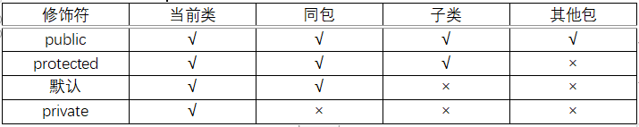

- **继承**

  `子类继承父类, 让子类对象具有父类对象的属性、方法和行为`

  Animal <- Dog   <- Cat

- **多态**

  `同一个行为具有多个不同表现形式或形态的能力`

  现实生活中，同一个方法，具体实现会完全不同。 比如：同样是调用人的"休息"方法，张三是睡觉，李四是旅游，王五是听音乐； 同样是调用人“吃饭”的方法，中国人用筷子吃饭，英国人用刀叉吃饭，印度人用手吃饭。

  1. 多态是方法的多态，不是属性的多态（多态与属性无关）。

  2. 多态的存在要有 3 个必要条件：继承，方法重写，父类引用指向子类对象。

  3. 父类引用指向子类对象后，用该父类引用调用子类重写的方法，此时多态就出现了。

     使用父类做方法的形参和返回值，是多态使用最多的场合。即使增加了新的子类，方法也无需改变，符合开闭原则。

  **重载和重写的区别 | 构造方法能不能重写**

  - 重写 `override` 

    在父子类中发生, 用于方法的拓展, 方法与参数都相同; 

  - 重载 `overload`

    在类中发生, 方法名相同参数不同。构造方法无法重写, 重写要求类名一致, 而父类和子类的构造方法名不一致, 因此无法重写。

- 面向对象 - 面向过程

  `面向过程` - C语言中实现猫吃饭这样一个动作, 面向过程可能拆解为多个函数, 猫、饭的初始化函数, 吃饭的函数, 3个函数组合就完成了功能。

  `面向对象` - Java 实现猫吃饭动作, 首先定义猫、饭这两个对象(类), 然后在猫的类中定义吃饭的方法并传递饭作为参数, 最终完成功能。 `面向过程更关注于功能的实现, 面向对象更关注于模式的设计(对象提取)便于维护` 

  面向对象有三大基础特征: **封装、继承、多态**。

  封装: 将对象的状态信息隐藏起来, 不允许外界直接访问, 只能通过暴露的接口进行操作访问, 提高代码可维护性; 

  继承: 实现代码复用的手段, 能够通过 extends 关键字继承父类的属性和方法; 

  多态: 依赖于继承, 子类可以选择重写父类方法, 也可选择直接调用父类方法实现功能的复用与拓展。


### 9 泛型 | 泛型擦除 | 通配符

> JDK1.5 之后引入泛型, 泛型可以为类型指定参数, 减少了插入对象的类型出错问题(泛型需求的为 Person, 传入其他的就会报错), 所有强制转换都是自动且隐藏的提高了代码的复用率。

- 泛型擦除

  Java 的泛型是伪泛型, 因为编译器在编译期间需要在进行擦除, 然后进行类型转换。如在代码中定义 `List<Object>` 和 `List<String>` 等类型，在编译后都会变成 `List` ，JVM看到的只是List，而由泛型附加的类型信息对JVM是看不到的。

- 泛型应用

  `项目中后端返回前端的 DATA 使用泛型指定` `ExcelUtil 类动态指定导出数据类型`

- 通配符

  - ？ 表示不确定的 java 类型
  - T (type) 表示具体的一个 java 类型
  - K V (key value) 分别代表 java 键值中的Key Value
  - E (element) 代表 Element
  - ？无界通配符 (让泛型能够接受未知类型的数据。)
  - 上界通配符 < ? extends E> (类型1指定一个数据类型，那么类型2就只能是类型1或者是类型1的子类)
  - 下界通配符 < ? super E>   (类型1指定一个数据类型，那么类型2就只能是类型1或者是类型1的父类)


### 10 内部类

- 成员内部类(非静态内部类)

  定义在类的内部, 像是外部类的一个成员，所以内部类可以拥有 private、public 等访问权限修饰; 成员内部类可以访问外部类的所有成员,（包括private）成员; 

- 静态内部类

  定义在类的内部, 在成员内部类前面加上一个 static: 静态内部类可以访问外部类的静态成员; 静态内部类当中不仅可以定义静态成员也可以定义非静态成员

- 局部(方法)内部类

  定义在方法的内部类: 局部内部类不能有访问权限修饰符; 局部内部类不能被定义为static; 局部内部类不能定义static成员; 局部内部类也可以使用 Outer.this 语法制定访问外部类成员

- 匿名内部类

  定义在代码中的类，没有类名，用于实现某个接口或者继承某个类。

  匿名内部类必须继承一个抽象类或者实现一个接口; 匿名内部类没有类名，因此没有构造方法。


### 11 Java 程序执行过程


1. 编译: 将 `.java` 文件编译为 `.class` 字节码文件

2. 加载: 类加载器将 `.class` 文件加载到内存

   **类加载机制**

   类加载模型主要经过7个阶段, 分别是: 加载、验证、准备、解析、初始化、使用、卸载。

   - 加载: 查找和导入 `class` 文件
   - 验证: 保证加载类的准确性
   - 准备: 为类变量分配内存并设置类变量初始值
   - 解析: 把类中的符号引用转换为直接引用
   - 初始化: 对类的静态变量，静态代码块执行初始化操作
   - 使用: JVM 开始从入口方法开始执行用户的程序代码
   - 卸载: 当用户程序代码执行完毕后，JVM 便开始销毁创建的 Class 对象。

   **双亲委派模型**

   - 原理是: 在加载一个类时首先委托上一级的类加载器加载, 如果上一级也有上级, 则继续往上委托; 如果该类委托上级没有加载, 子加载器则尝试加载该类。 原因: 可以避免一个类被重复加载; 保证类库 API 不会被修改, 也即用户自定义的类与 API 一致时会报错而非加载。

3. 执行: 找到程序入口 `main()` 函数, 执行字节码指令


### 12 Java 的4种引用方式

- 强引用: 以 NEW 关键字创建的引用都是强引用。被强引用引用的对象永远不会回收。
- 软引用: 以 `SoftReference` 类创建的对象为软引用。系统内存不足时会被GC回收。
- 弱引用: 以 `WeakReference` 类创建的对象为弱引用。无论内存充足与否都会被GC回收
- 虚引用: 以 `PhantomReference` 类创建的对象为虚引用。它是最弱的引用类型, 被GC回收时会得到通知。


### 13 类的实例化过程

类的实例化主要包括以下步骤: 

1. 类加载: 将类加载到虚拟机的内存中。
2. 分配内存: 给类分配足够的内存空间。
3. 初始化: 对类分配的内存空间进行初始化 - 赋0。
4. 执行构造器: 对变使用构造器进行初始化操作。
5. 返回对象: 实例化完成后返回指向对象的引用。


### 14 常见线程安全集合有哪些

`Vector`：是一个动态数组，实现了List接口，并且线程安全。  `synchronized`
`Hashtable`：实现了Map接口，是一个键值对的集合，线程安全。  `synchronized`
`Stack`：是一个后进先出（LIFO）的集合，线程安全。
`ConcurrentHashMap`：是对HashMap的改进，实现了ConcurrentMap接口，线程安全。
`CopyOnWriteArrayList`：是一个可变的、线程安全的ArrayList，使用了写时复制的策略，适用于读多写少的场景。 
`CopyOnWriteArraySet`：是一个可变的、线程安全的Set，也使用了写时复制的策略。
`Properties`


### 15 克隆

- 浅克隆：原对象和克隆对象不同,但对象内的成员引用相同
- 深克隆：原对象和克隆对象不同,且对象内的成员引用也不同


### 16 fail-fast(快失败) - fail-safe(安全失败)

- fail-fast

  直接在容器上进行遍历，在遍历过程中，一旦发现容器中的数据被修改了，会立刻抛出异常遍历失败 `不支持并发修改(不允许遍历时修改数据)`

- fail-safe

  在容器的克隆上遍历，对容器内容的修改不影响遍历。java.util.concurrent包下的容器都是安全失败的,可以在多线程下并发使用,并发修改。采用安全失败机制的集合容器，在遍历时不是直接在集合内容上访问的，而是先复制原有集合内容，在拷贝的集合上进行遍历。  `允许并发修改(允许遍历时修改数据)，但是 无法保证在迭代过程中获取到最新的值`


### 17 Java 类中的变量、方法、对象的保存位置

- `局部变量` - *栈*
- `成员变量、对象和对象数组` - *堆*
- `本地方法` - *本地方法栈*  本地方法: 就是一个为了提供C/C++程序功能的接口, 声明为 Java 的 Native Method, 但是实现是其它语言。
- `字段、方法、修饰符` - *方法区*
- `常量` - *常量池*

- `基本类型` - *栈中直接分配内存*
- `引用类型` - *引用在栈, 存储在堆*


### 18 JDK proxy 和 cglib 的区别

JDK proxy 和 CGLIB 是Java中两种常用的动态代理实现方式。

- **JDK proxy**

  `Java自带` `拦截器+反射实现` `直接操作字节码` `实现调用简单`  *基于接口进行代理* (InvocationHandler拦截+代理)  JDK动态代理的代理类字节码在创建时，需要业务实现类所实现的接口作为参数。如果业务实现类是没有实现接口而是直接定义业务方法的话，就无法使用JDK动态代理了。

  ```java
  // Java Proxy
  // 1. 首先实现一个InvocationHandler，方法调用会被转发到该类的invoke()方法。
  class LogInvocationHandler implements InvocationHandler{
  	...
  	private Hello hello;
  	public LogInvocationHandler(Hello hello) {
  		this.hello = hello;
  	}
  	@Override
  	public Object invoke(Object proxy, Method method, Object[] args) throws Throwable {
  		if("sayHello".equals(method.getName())) {
  			logger.info("You said: " + Arrays.toString(args));
  		}
  		return method.invoke(hello, args);
  	}
  }
  // 2. 然后在需要使用Hello的时候，通过JDK动态代理获取Hello的代理对象。
  Hello hello = (Hello)Proxy.newProxyInstance(
      getClass().getClassLoader(), // 1. 类加载器
      new Class<?>[] {Hello.class}, // 2. 代理需要实现的接口，可以有多个
      new LogInvocationHandler(new HelloImp()));// 3. 方法调用的实际处理者
  System.out.println(hello.sayHello("I love you!"));
  ```

- **CGLib**

  `第三方`  `性能高` `基于 ASM`(ASM - Java 字节码操作框架)  *基于继承实现代理* (MethodInterceptor+Enhancer)   通过定义 Enhancer 对象继承代理对象实现动态代理, 因此被代理类不能被关键字 final 修饰，如果被 final 修饰，再使用 Enhancer 设置父类时会报错，动态代理的构建会失败。

  ```java
  // CGLIB动态代理
  // 1. 首先实现一个MethodInterceptor，方法调用会被转发到该类的intercept()方法。
  class MyMethodInterceptor implements MethodInterceptor{
    ...
  	@Override
  	public Object intercept(Object obj, Method method, Object[] args, MethodProxy proxy) throws Throwable {
  		logger.info("You said: " + Arrays.toString(args));
  		return proxy.invokeSuper(obj, args);
  	}
  }
  // 2. 然后在需要使用HelloConcrete的时候，通过CGLIB动态代理获取代理对象。
  Enhancer enhancer = new Enhancer();
  enhancer.setSuperclass(HelloConcrete.class);
  enhancer.setCallback(new MyMethodInterceptor());
  
  HelloConcrete hello = (HelloConcrete)enhancer.create();
  System.out.println(hello.sayHello("I love you!"));
  ```

- **区别**

  JDK 动态代理是实现了被代理对象所实现的接口，CGLib是继承了被代理对象。 JDK和CGLib 都是在运行期生成字节码,JDK是直接写Class字节码，CGLib 使用 ASM 框架写Class字节码，Cglib代理实现更复杂，生成代理类的效率比JDK代理低。JDK 调用代理方法，是通过反射机制调用,CGLib 是通过FastClass机制直接调用方法,CGLib 执行效率更高。cglib是针对类来实现代理的，他的原理是对指定的目标类生成一个子类，并覆盖其中方法实现增强，*


### 19 类加载过程

`加载`   `验证` `准备` `解析`   `初始化` `使用` `卸载`     

- 加载:  Java 类的字节码文件加载到机器内存
- 验证:  保证加载的字节码是合法、合理并符合规范的
- 准备:  为类的静态变量分配内存，并将其初始化为默认值
- 解析:  将类、接口、字段和方法的符号引用转为直接引用。将符号引用转为直接引用，也就是得到类、字段、方法在内存中的指针或者偏移量。
- 初始化: 为类的静态变量赋予正确的初始值
- 使用 - 卸载

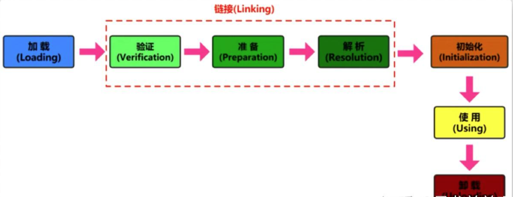


### 20 int 与 Integer 

- **Integer**

  `int的包装类-对象` `默认值是null` `提供额外的方法` 

  - **缓存机制**

    `仅在自动装箱有用` 

    通过 IntegerCache 类提供缓存支持, 支持 -128 到 127 之间的自动装箱过程。这样在如下场景下会从缓存中取对象而非创建新对象。

    ```
    Integer j = 100;
    Integer b = 100;		//缓存中取
    ```

  

- **int**

  `基本类型` `默认值是0` `直接存储数值` 

- **比较**

  *两个通过new生成的Integer变量永远是不相等 - 因为new生成的是两个对象，其内存地址不同*

  *Integer变量和int变量比较时，只要两个变量的值是向等的，则结果为true - 拆箱值比较*

  *非new生成的Integer变量和new Integer()生成的变量比较时，结果为false - 非new生成的Integer变量指向的是java常量池中的对象，而new Integer()生成的变量指向堆中新建的对象*

  ```
  Integer i = new Integer(100);
  Integer j = 100;
  System.out.print(i == j); //false
  ```

  *对于两个非new生成的 Integer对象，进行比较时，如果两个变量的值在区间-128到127之间，则比较结果为true，如果两个变量的值不在此区间，则比较结果为false* 缓存机制

  原因： java在编译Integer i = 100 ;时，会翻译成为Integer i = Integer.valueOf(100)。而java API中对Integer类型的valueOf的定义如下，对于-128到127之间的数，会进行缓存，Integer i = 127时，会将127这个Integer对象进行缓存，下次再写Integer j = 127时，就会直接从缓存中取，就不会new了。

  

### 21 字符串直接量和 new 的区别

- 字符串直接量

  创建时, 先在字符串池中查找是否存在值为"ab"的字符串对象。如果存在，就将引用指向该对象；如果不存在，则在字符串池中创建一个新的字符串对象，并将引用指向它。

- new String(A)

  创建时, 常量池内没有则创建新对象, 再在堆内存区新建一个对象引用常量池中的对象, 返回堆内对象 `2`; 有则在堆中新建一个对象引用常量池中的对象 `1`。


### 22 OOM 问题与解决办法

- **堆溢出**

  ```java
  java.lang.OutOfMemoryError: Java heap space
  ```

  原因: 1、代码中可能存在大对象分配 2、可能存在内存泄露，导致在多次GC之后，还是无法找到一块足够大的内存容纳当前对象。

  方案: 1、检查是否存在大对象的分配，最有可能的是大数组分配 2、通过jmap命令，把堆内存dump下来，使用mat工具分析一下，检查是否存在内存泄露的问题 3、如果没有找到明显的内存泄露，使用 -Xmx 加大堆内存 4、还有一点容易被忽略，检查是否有大量的自定义的 Finalizable 对象，也有可能是框架内部提供的，考虑其存在的必要性

- **永久代/元空间溢出**

  ```java
  java.lang.OutOfMemoryError: PermGen spacejava.lang.OutOfMemoryError: Metaspace
  ```

  原因: 1、在Java7之前，频繁的错误使用String.intern()方法 2、运行期间生成了大量的代理类，导致方法区被撑爆，无法卸载 3、应用长时间运行，没有重启

  方案: 1、检查是否永久代空间或者元空间设置的过小 2、检查代码中是否存在大量的反射操作 3、dump之后通过mat检查是否存在大量由于反射生成的代理类 4、放大招，重启JVM

- **方法栈溢出**

  ```java
  java.lang.OutOfMemoryError : unable to create new native Thread
  ```

  原因: 创建大量线程

  方案: 通过 -Xss 降低的每个线程栈大小的容量


### 23 Lambda 表达式

> 概念: `函数式编程(函数编程思想) - 通过一段代码完成面向对象想要做的代码量` 起源于匿名类, 在代码中可以通过匿名类的方式创建对象, 这种方式简化了类的创建过程, 如 `Comparator` 接口可以直接通过内部类创建实例。允许把函数作为一个方法的参数（函数作为参数传递进方法中）, 使用 Lambda 表达式可以使代码变的更加简洁紧凑。

**语法**

- 小括内的语法与传统方法参数列表一致，没有参数就留空，有多个参数就用逗号分隔   书写的内容和接口中的抽象方法的参数列表一致

- 【->】 是新引入的语法格式，代表指向动作

- 大括号内的语法与传统方法体要求一致   书写的内容和实现接口中的抽象方法体一致

```java
(参数列表） -> {代码}
```

**使用条件**

通过接口实现,  规定接口中只能有一个需要被实现的方法（即只能有一个抽象方法），不是规定接口中只能有一个方法，这也称之为“函数式接口”, 想定义函数式接口需要使用`@FunctionalInterface`注解，要求接口中的抽象方法只有一个。  *接口中不使用 default|static 的方法都是抽象方法, 如果使用Lambda表达式只能声明一个抽象方法*


*使用匿名类方式对 words 排序*

```java
import java.util.*;

public class Main {
    public static void main(String args[]) {
        ArrayList<String> words = new ArrayList<>();
        words.add("A");
        words.add("BC");
        words.add("DBAD");
        words.add("CDD");
        words.add("EA");
        //根据字符串的长度 短->长 排序
        words.sort(new Comparator<String>() {
            @Override
            public int compare(String s1, String s2) {
                return Integer.compare(s1.length(), s2.length());
            }
        });
        for (String word : words) {
            System.out.println(word);
        }
    }
}
```

*使用 Lambda 方式对 words 排序*

```java
import java.util.*;

public class Main {
    public static void main(String args[]) {
        ArrayList<String> words = new ArrayList<>();
        words.add("A");
        words.add("BC");
        words.add("DBAD");
        words.add("CDD");
        words.add("EA");
        //根据字符串的长度 短->长 排序
        words.sort((s1, s2) -> Integer.compare(s1.length(), s2.length()));
        for (String word : words) {
            System.out.println(word);
        }
    }
}
```

*实例*

```java
// 1. 不需要参数,返回值为 5  
() -> 5  
// 2. 接收一个参数(数字类型),返回其2倍的值  
x -> 2 * x  
// 3. 接受2个参数(数字),并返回他们的差值  
(x, y) -> x – y  
// 4. 接收2个int型整数,返回他们的和  
(int x, int y) -> x + y  
// 5. 接受一个 string 对象,并在控制台打印,不返回任何值(看起来像是返回void)  
(String s) -> System.out.print(s)
```


## Java 集合

### 1 List | Set | Queue | Map  概述

List、Set、Queue 继承 Collection 接口， Map 单独的顶级接口

- **List** `有序可重复`

  ArrayList  数组实现的，常用于查询。
  LinedList  链表实现的，常用与增删改查。

- **Set** `不可重复`

  HashSet  哈希表实现的，数据无序。

  TreeSet  二叉树实现的，数据自动排序。

- **Queue** `有序可重复`

  PriorityQueue:  Object[] 数组来实现二叉堆

  ArrayQueue:     Object[] 数组 + 双指针

- **Map** `Key 无序不可重复, value 无序可重复`

  HashMap   线程不安全，效率快，适用于单线程操作

  TreeMap   二叉树实现的，数据有序，HashTable 与 HashMap无序

  HashTable  线程安全，因为底层都加了 synchronized 关键字来确保线程同步，适用于多线程操作


### 2 List

- **ArrayList**

  - 底层

    Object[] 数组

  - 特性

    `有序可重复` `查找速度快, 插入删除速度慢`

  - 扩容机制

    JDK 1.7: 创建容器时会自动创建一个长度为 10 的对象数组

    JDK 1.8: 不会立即创建数组, 而是在第一次执行 add() 方法时才创建长度为10的数组。

    默认情况下, ArrayList 扩容时会扩容为原来容量的1.5倍, 同时将原有的数据赋值到新数组中完成扩容。

- **Vector**

  - 底层

    Object[] 数组
    
  - 特性

    `线程安全`  `扩容为原来的一倍` `需要连续的内存空间`

- **LinkedList**

  - 底层

    `双向链表(JDK1.6 之前为循环链表，JDK1.7 取消了循环)`

  - 特性

    `查找速度慢, 插入删除速度快` `占用的内存更多`

  

### 3 Set

- **HashSet**

  - 底层

    `HashMap(数组+链表 | 数组+链表+红黑树)`

  - 特性

    `无序` `元素值允许为NULL` `不允许重复` `非线程安全` `基于HashMap实现` `JDK8之前，数组+链表;  JDK8以后，数组+链表+红黑树 - 扩容原则与 HashMap 一致`

  - 保证不重复

    使用 `hashCode` 与 `equals` 方法检测重复。一个元素, 使用 `hashCode` 判断该元素key值是否存在, 已存在则不添加; 不存在再调用 `equals` 方法判断结果, 如果依旧一样则不添加, 不一样则添加到 Set 集合。

- **LinkedHashSet**

  - 底层

    `LinkedHashMap(LinkedList)` 

  - 特性

    HashSet 的子类，并且其内部是通过 LinkedHashMap 来实现的。 `按插入顺序有序`  

- **TreeSet**

  - 底层

    `TreeMap(红黑树)`

  - 特性

    `基于 TreeMap 实现(红黑树)` `有序且不重复` `依照比较器去重(不使用hashCode|equals方法)`


- 区别
  - `HashSet`、`LinkedHashSet` 和 `TreeSet` 都是 `Set` 接口的实现类，都能保证元素唯一，并且都不是线程安全的。
  - `HashSet`、`LinkedHashSet` 和 `TreeSet` 的主要区别在于底层数据结构不同。`HashSet` 的底层数据结构是哈希表（基于 `HashMap` 实现）。`LinkedHashSet` 的底层数据结构是链表和哈希表，元素的插入和取出顺序满足 FIFO。`TreeSet` 底层数据结构是红黑树，元素是有序的，排序的方式有自然排序和定制排序。
  - 底层数据结构不同又导致这三者的应用场景不同。`HashSet` 用于不需要保证元素插入和取出顺序的场景，`LinkedHashSet` 用于保证元素的插入和取出顺序满足 FIFO 的场景，`TreeSet` 用于支持对元素自定义排序规则的场景。


### 4 Queue

- **Deque**

  `Deque` 是双端队列，在队列的两端均可以插入或删除元素。`Queue` 是单端队列，只能从一端插入元素，另一端删除元素，实现上一般遵循先进先出（FIFO）规则。

- **PriorityQueue**

  - 底层

    Object[] 数组来实现二叉堆  

  - 特性

    元素出队顺序是与优先级相关的，即总是优先级最高的元素先出队。

- **ArrayQueue**

  - 底层

    Object[] 数组 + 双指针

  - 特性

    `不能存储null` `线程不安全` `不支持随机访问和随机插入数据` 


### 5 Map

- **HashMap**

  - 底层

    - Beafor 1.8: 数组 + 链表
    - After 1.8:  数组 + 链表 + 红黑树

  - 特性

    `null可以作为键，这样的键只有一个 - 可以有一个或多个键所对应的值为null` `数组 + 链表 + 红黑树` `非线程安全`

  - PUT 流程

    通过计算存入 KEY 的 Hash 值确定存入位置, 如果当前位置存在数据也即发生碰撞则通过链表接在一起。

    `树化:` 当链表长度达到 8 时则转为红黑树存放, 以此提高查询效率。

  - 初始化

    创建时如果给定了容量初始值, `HashMap` 会将其扩充为 2 的幂次方大小

  - 扩容机制

    HashMap 数组初始容量为 16, 达到默认装载因子 0.75 时会触发 2 倍扩容。

  
  `HashMap 线程安全的吗？如果不是该如何解决？`
  
  - 使用 HashTable 效率低
  - 使用 Collection 下的 synchronizedXX() 方法包装 HashMap
  - 使用 ConcurrentHashMap 
  
  `为什么不安全?`
  
  - JDK1.7 HashMap线程不安全体现在：死循环、数据丢失
  - JDK1.8 HashMap线程不安全体现在：数据覆盖。 *多个线程在put操作时, 线程A在判重完毕后被阻塞, 线程B拿到时间片在A插入的位置插入数据, A拿回时间片直接插入引起数据的覆盖。*

  `负载因子`
  
  - **概念**
  
    负载因子是一个介于0和1之间的值，表示散列表中已存储元素数量与散列表容量之间的比率。在HashMap中，当已存储元素数量超过负载因子与容量的乘积时，就会触发扩容操作，即重新调整散列表的大小，以提供更多的存储空间。 *默认为0.75*
  
  - **调大负载因子的问题**
  
    会导致散列表的平均链表长度增加，可能会影响HashMap的性能和效率。 *内存占用大* *冲突可能高* *扩容频率低*
  
  `为什么使用红黑树`
  
  - *查找性能高*：红黑树是一种自平衡的二叉搜索树，具有较快的查找性能。在红黑树中，查找、插入和删除操作的时间复杂度都是 $O(log n)$ ，相较于链表的线性查找$O(n)$，红黑树可以更高效地处理大量元素。

  - *平衡性好*：红黑树的自平衡性质保证了树的高度相对较低，即使在极端情况下，也能保持较快的查找性能。红黑树通过旋转和重新着色等操作来保持平衡，确保树的高度在可控范围内，避免出现极度不平衡的情况。
  
  - *插入和删除性能优秀*：红黑树的插入和删除操作相对链表来说更高效。当需要插入或删除元素时，红黑树通过调整树的结构和重新着色来保持平衡，不会像链表一样需要遍历整个链表来进行插入或删除操作
  
- **ConcurrentHashMap**

  - `ConcurrentHashMap` 的底层数据结构与 HashMap 一样, 也是采用“数组+链表+红黑树 

  - 采用锁定头节点的方式降低了锁粒度, 以较低的性能代价实现了线程安全。 
  
  - 实现机制(*锁定头结点*)
  
    初始化数组或头节点时, ConcurrentHashMap并没有加锁, 而是以 CAS 的方式进行原子替换 
  
    插入数据时会进行加锁处理, 但锁定的不是整个数组, 而是槽中的头节点。所以, ConcurrentHashMap 中锁的粒度是槽, 而不是整个数组,并发的性能很好。
  
    扩容时会进行加锁处理, 锁定的仍然是头节点。并且, 支持多个线程同时对数组扩容, 提高并发能力。 
  
    在扩容的过程中,依然可以支持查找操作。
  
  - `1.7 与 1.8 的区别?`
  
    1.7 - 分段锁(segments) - *ReentrantLock(可重入锁)* 最大并发为16, 通过对整个 HashMap 分段分为 	  
  
    ​      Segments 与 HashEntry 控制多段的并发。 *CAS + sychronized*
  
    1.8 - 去掉分段锁, 对数组的节点加锁。  *CAS + sychronized*
  
    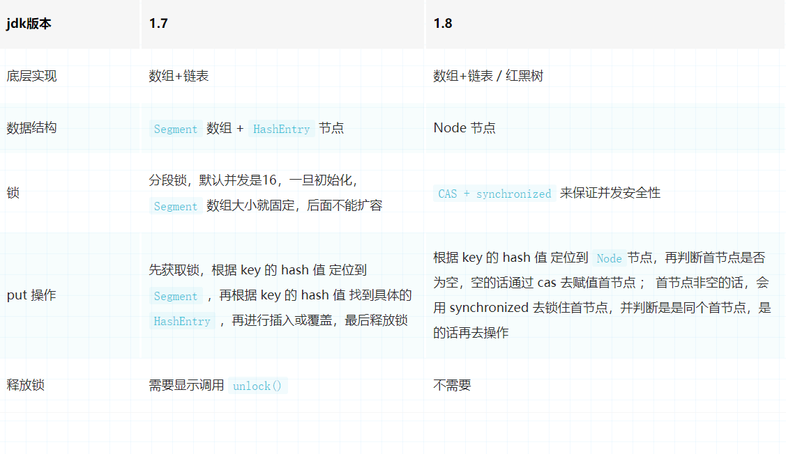
  
- **HashTable**

  - 底层

    `数组 + 链表`

  - 扩容机制

    `Hashtable` 默认的初始大小为 11，之后每次扩充，容量变为原来的 2n+1。

  - 初始化

    创建时如果给定了容量初始值， `Hashtable` 会直接使用你给定的大小。

  - 特性

    `线程安全` `不允许 NULL 值(key 和 value都不允许null值)` `底层为数组+链表`

- **TreeMap**

  - 底层

    `红黑树`

  - 特性

    `基于红黑树实现` `按 Key 顺序或 Comparator 顺序有序` `不允许重复` `动态扩容`    *效率低于HashMap, 一般在需要排序的情况下使用*

- **LinkedHashMap**

  - 底层

    `HashMap(数组+链表+红黑树) + LinkedList(HashMap操作数据结构, LinkedList维护插入元素的先后顺序)`

  - 特性

    `插入顺序有序` `HashMap(数组+链表+红黑树) + LinkedList`

  

### 6 HashMap 如何解决哈希冲突

`链地址法`

- **链地址法**

  `将所有冲突元素按照链表存储`

- 再散列法(二次哈希)

  `再次使用一个不同的哈希算法再计算一次`

- 开放地址法

  `寻找下一个为空的数组下标,而后将冲突元素存储`


### 7 Collection 下数据结构的特点 | 应用场景

- ArrayList  `查询快, 插入删除慢` *日常使用, 结构简单使用方便*
- Set   `不允许重复` *用于需要保证不重复的数据存储*
- Queue `先进先出` *用于符合该特点的数据存储*
- Stack `先进后出` *栈*
- TreeSet | TreeMap `按照key的字典顺序来排序（升序）` *需要保证有序的数据存储*
- HashTable | ConcurrentHashMap  `线程安全`


## JUC

> 基本概念:
>
> - 原子性
>   定义: 即一个操作或者多个操作要么全部执行并且执行的过程不会被任何因素打断，要么就都不执行。
> - 可见性
>   定义: 指当多个线程访问同一个变量时，一个线程修改了这个变量的值，其他线程能够立即看得到修改的值。
> - 有序性
>   定义: 即程序执行的顺序按照代码的先后顺序执行。


### 1 Sychronized | ReentrantLock | ThreadLocal

> Java 常用的锁和原理: `Synchronized` 和 `Lock` 

#### 1) Sychronized

`Sychronized ` 保证原子性(要么都做要么都不做)、资源可见性(变量的修改可以被其他线程看到)、有序性(指令按固定顺序执行 - volatile)。 

特点: `用于修饰静态方法(等于给类加锁)、代码块、普通方法`; `关键字`; `synchronized 可以自动释放`; `synchronized 不可以判断加锁状态`; `非公平锁`; `粒度较粗`


#### 2) Lock

*Lock* 是一个接口, 其中继承其的类有: 读锁、写锁、可重入锁(ReentrantLock)等, 其中最常见的是 ReentrantLock。常用方法包括 `lock() 获取锁` : `unlock() 释放锁` : `tryLock() 尝试获取锁` 等。特点: `接口`; `Lock 加锁不会自动释放`; `Lock 可以通过 tryLock() 判断加锁状态`; `公平锁 | 非公平锁`; `粒度较细`

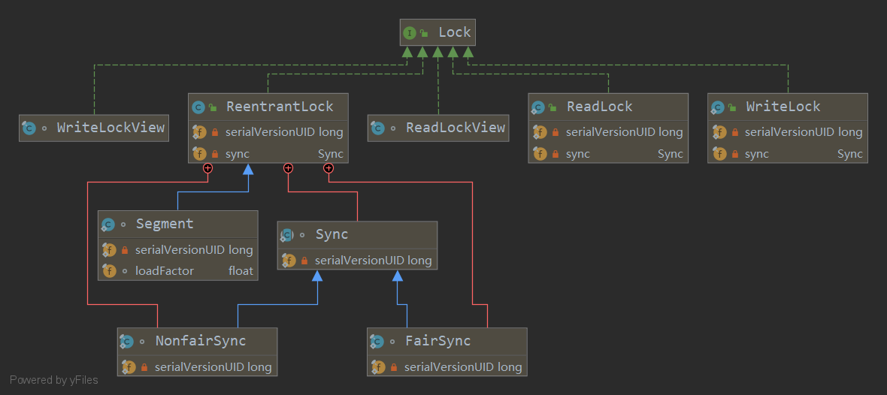


#### 3) ReentrantLock

`ReentrantLock` 继承了 `Lock` 接口来处理对共享对象的访问, 保证变量的互斥性和内存可见性。它的特点与 `Lock` 一致。如: `Lock 加锁不会自动释放`; `Lock 可以通过 tryLock() 判断加锁状态`; `公平锁 | 非公平锁`; `粒度较细`


#### 4) ThreadLocal

> 线程局部变量: 全称 thread local variable, 它的使用场合主要是为了解决多线程中因为数据并发产生不一致的问题。 ThreadLocal为每一个线程都提供了变量的副本，使得每一个线程在某一时间访问到的并不是同一个对象，这样就隔离了多个线程对数据的数据共享，这样的结果无非是耗费了内存，也大大减少了线程同步所带来的性能消耗，也减少了线程并发控制的复杂度。
>
> `* ThreadLocal 是 Java 中的一个线程级别的变量存储工具类，它提供了一种在多线程环境下，每个线程都拥有自己独立的变量副本的机制。 *`	
>
> **主要是为了解决多线程中因为数据并发产生不一致的问题; 同时可以保证同一个线程内, 不同方法之间的属性共享问题;每个线程都有一个 ThreadLocalMap 变量, ThreadLocalMap的存储位置是在Thread线程中。 **  [Link](https://juejin.cn/post/7042211997743579144)


ThreadLocal 是 JDK包提供的，它提供线程本地变量，如果创建一个 ThreadLocal 变量，那么访问这个变量的每个线程都会有这个变量的一个副本，在实际多线程操作的时候，操作的是自己本地内存中的变量，从而规避了线程安全问题，如下图所示。

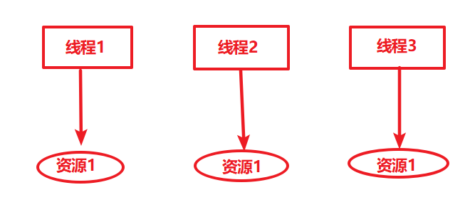

- **实现原理**

  哈希表 - ThreadLocalMap 实现。 `get ` `set` `remove`

- **优点**

  1. 线程封闭性（Thread Confinement）：ThreadLocal 可以实现将变量绑定到当前线程，使得变量对其他线程不可见，实现了线程封闭性。这在多线程环境下，可以避免共享变量引起的线程安全问题。
  2. 线程上下文传递（Thread Context Propagation）：ThreadLocal 可以用于在线程之间传递上下文信息。比如，在 Web 应用中，可以将当前用户的登录信息存储在 ThreadLocal 中，这样在不同的业务方法中都可以方便地获取到用户的登录信息。
  3. 隐式参数传递（Implicit Parameter Passing）：ThreadLocal 可以用于将一些公共参数在方法调用链中隐式传递，避免在每个方法参数中显式传递这些参数。这样可以简化方法的调用，提高代码的可读性。
  4. 数据隔离（Data Isolation）：在一些需要数据隔离的场景下，ThreadLocal 可以用于实现数据的隔离。比如，在数据库连接池中，可以使用 ThreadLocal 来保存每个线程使用的数据库连接，确保每个线程使用自己的连接，避免数据混乱。

- **源码**

  ThreadLocal源码中常用的方法有get、set和remove，这几个函数的源码很简单

  ```java
  public T get() {
      Thread t = Thread.currentThread();
      ThreadLocalMap map = getMap(t);
      if (map != null) {
          ThreadLocalMap.Entry e = map.getEntry(this);
          if (e != null) {
              @SuppressWarnings("unchecked")
              T result = (T)e.value;
              return result;
          }
      }
      return setInitialValue();
  }
  
  public void set(T value) {
      Thread t = Thread.currentThread();
      ThreadLocalMap map = getMap(t);
      if (map != null)
          map.set(this, value);
      else
          createMap(t, value);
  }
  public void remove() {
      ThreadLocalMap m = getMap(Thread.currentThread());
      if (m != null)
          m.remove(this);
  }
  ```

  这几个函数中都要先调用getMap这个函数来获取ThreadLocalMap对象，然后操作这个map对象来实现变量的存取。看下getMap这个函数

  ```java
  ThreadLocalMap getMap(Thread t) {
      return t.threadLocals;
  }
  ```

- 案例

  ```java
  package test;
  
  public class ThreadLocalTest {
  static ThreadLocal<String> localVar = new ThreadLocal<>();
  
  static void print(String str) {
      //打印当前线程中本地内存中本地变量的值
      System.out.println(str + " :" + localVar.get());
      //清除本地内存中的本地变量
      localVar.remove();
  }
  
  public static void main(String[] args) {
      Thread t1  = new Thread(new Runnable() {
          @Override
          public void run() {
              //设置线程1中本地变量的值
              localVar.set("localVar1");
              //调用打印方法
              print("thread1");
              //打印本地变量
              System.out.println("after remove : " + localVar.get());
          }
      });
  
      Thread t2  = new Thread(new Runnable() {
          @Override
          public void run() {
              //设置线程1中本地变量的值
              localVar.set("localVar2");
              //调用打印方法
              print("thread2");
              //打印本地变量
              System.out.println("after remove : " + localVar.get());
          }
      });
  
      t1.start();
      t2.start();
  }
  }
  
  >threadl : localVar1
  >after remove : null
  >thread2 : localVar2
  >after remove : null
  ```

- **内存泄露**

  ThreadLocal的引用在线程运行中，在没有执行remove的情况下被设置为null，即释放了强引用，ThreadLocal对象只有Entry的弱引用了。下次gc被回收，key是弱引用被回收，value是强引用一直存储在内存中。线程还在运行，value的内存就不会释放，这样发生了内存泄漏。

  

#### 5) 区别

1. `Synchronized` 和 `Lock` 

- **Synchronized**

  `关键字`; `synchronized 可以自动释放`; `synchronized 不可以判断加锁状态`; `非公平锁`; `粒度较粗`

  synchronize 的用法及原理:

  synchronized 可以。它能够保证同一时间只有一个线程执行该代码, 保证线程安全。它能够在执行完毕或出现异常后自动释放锁。底层是采用Java对象头来存储锁信息的,并且还支持锁升级。在JVM里的实现都是 基于进入和退出 Monitor 对象来实现方法同步和代码块同步。synchronized 加在普通方法上, 锁当前实例; 加在静态方法, 锁当前类的从class对象;加在代码块上, 则需要在关键字后面的小括号里, 显式指定一个对象作为锁对象。

- **Lock**

  `接口`; `Lock 加锁不会自动释放`; `Lock 可以通过 tryLock() 判断加锁状态`; `公平锁 | 非公平锁`; `粒度较细`

2. `Synchronized` 与 `ThreadLocal`  

   ThreadLocal 和 Synchonized 都用于解决多线程的并发访问; Synchronized是利用锁的机制，使得变量或者是代码块在某一时刻里只能被一个线程来进行访问。ThreadLocal是为每一个线程都提供了一个变量的副本，这样每一个线程在某一时刻里访问到的不是同一个对象，这样就隔离了多个线程对数据的数据共享。


### 2 公平锁和非公平锁 | 可重入锁

- 公平锁

  所有线程按申请顺序获得锁, 队列第一个才可以获得锁。

  - 优点：所有的线程都能得到资源，不会饿死在队列中。
  - 缺点：吞吐量会下降很多，队列里面除了第一个线程，其他的线程都会阻塞，cpu唤醒阻塞线程的开销会很大。

- 非公平锁

  所有线程获取锁先尝试, 没有的话才等待, 否则直接拿到锁。

  - 优点：可以减少 CPU 唤醒线程的开销，整体的吞吐效率会高点，CPU 也不必取唤醒所有线程，会减少唤起线程的数量。
  - 缺点：你们可能也发现了，这样可能导致队列中间的线程一直获取不到锁或者长时间获取不到锁，导致饿死。

- 可重入锁

  实质上就是一个线程可以多次获得某个锁而不会出现死锁。 `Sychronized` 与 `ReentrantLock` 都是可重入的锁

- Lock实现公平锁与非公平锁方法

  ReentrantLock 的构造函数可以传入一个boolean参数，用于控制锁的公平性, 如下所示

  ```java
  public ReentrantLock() {
      sync = new NonfairSync();
  }
  public ReentrantLock(boolean fair) {
      sync = fair ? new FairSync() : new NonfairSync();
  }
  ```

  公平锁会有 `hasQueuedPredecessors` 方法判断该线程是否位于队列头部, 只有在队列头部的线程才能获得锁。


### 3 volatile 的用法及原理

`volatile 是一个Java的关键字，用来解决内存可见性问题的。它能够保证线程之间可见, 通过添加屏障的方式避免指令重排序导致的线程安全问题。`  **只保证可见性和有序性, 不保证原子性。**

*应用场景*: 被 volatile 修饰的变量保证对所有线程可见, 可以用于状态标志位, 检查某个线程运行状态、任务完成状态等; 线程之间的共享变量; 

- 保证线程之间的可见性

  volatile 关闭 JIT(即时编译器) 对其所修饰变量的优化(多线程并发的情况下, JIT 优化有时候会导致非预期的结果)

- 禁止指令重排序

  volatile 禁止指令重排序(添加内存屏障)

  写操作加的屏障是阻止上方其它写操作越过屏障排到 volatile 变量写之下
  读操作加的屏障是阻止下方其它读操作越过屏障排到 volatile 变量读之上

  volatile使用技巧:

  - 写变量让 volatile 修饰的变量的在代码最后位置
  - 读变量让 volatile 修饰的变量的在代码最开始位置


### 3 Sychronized 锁升级

`无锁 ----> 偏向锁 ----> 轻量级锁 ----> 重量级锁`   锁升级是不可逆的，只能升级不能降级

- `无锁`

  不添加锁

- `偏向锁`

  **为什么引入**: 解决只有一个线程执行同步代码时提高性能。

  **升级过程**: 就是在锁对象的对象头中有个 `ThreadId` 字段, 这个字段如果是空的，线程第一次获取锁的时候，就将线程自身的 `ThreadId` 写入到锁的 `ThreadId` 字段内，将锁头内的是否偏向锁的状态位置 1。这样下次获取锁的时候，直接检查ThreadId是否和自身线程Id一致，如果一致，则认为当前线程已经获取了锁，因此不需再次获取锁，略过了轻量级锁和重量级锁的加锁阶段。

  **撤销过程**: 只有当其他线程竞争该锁时，持有偏向锁的线程才会被撤销，释放该偏向锁。并且撤销需要等待全局安全点，也就是该时间点没有字节码正在执行。

  **作用**: 当一段同步代码一直被同一个线程多次访问时，由于只有一个线程，该线程后续访问时无需再次获取锁。  -  性能高

- `轻量级锁`

  轻量级锁，偏向锁是单线程下的锁优化，这个就说多线程下的锁优化了，当有多个 线程竞争同一个临界资源，这个时候偏向锁就会被撤（这个步骤也是十分消耗资源的），然后升级为轻量级锁，这个也是一个基于 CAS 的乐观锁。

  **为什么引入 | 作用**: `在线程近乎交替执行同步代码时提高性能`。轻量级锁是为了在没有多线程竞争的前提下，减少传统的重量级锁使用操作系统的 Mutex Lock 带来的性能消耗，轻量级锁适用于线程交替执行同步代码的场景。所以轻量级锁是为了在线程近乎交替执行同步代码时提高性能。

  **升级过程**: *线程 A 与 线程 B 同时抢占锁对象时，偏向锁会被撤销并将锁升级为轻量级锁。*线程 A 在执行同步代码前，JVM 在线程的栈帧中创建用于存储锁记录的空间 Lock Record。当线程 A 抢占锁对象时，JVM 使用 CAS 操作将锁对象的对象头的 Mark Word 拷贝进线程 A 的锁记录 Lock Record 中（这个拷贝 Mark Word 的过程官方称为 `Displaced Mark Word`），并且将 Mark Word 中指向线程栈中 Lock Record 的指针指向线程 A 的锁空间。如果更新成功，则线程 A 持有该对象锁，并将对象锁的 Mark Word 的锁标志位更新为 00。即此时线程 A 持有轻量级锁会执行同步代码，而线程 B 会自旋等待获取该轻量级锁；如果更新失败，则说明该锁被线程 B 抢占。

  **撤销过程**: 1. 当有两个以上的线程同时竞争一个锁时，那么轻量级锁会被撤销并升级为重量级锁，不再通过自旋的方式等待获取锁而是直接阻塞线程；

  ​		  2. 当持有轻量级锁的线程执行完同步代码时，同样会释放轻量级锁，会使用 CAS 操作将锁对象的 Mark Word 中指针指向的锁记录 Lock Record 重新替换回锁对象的 Mark Word。

- `重量级锁`

  当存在两个以上的线程竞争同一把锁或线程竞争轻量级锁自旋多次仍然失败时，会导致锁升级为重量级锁。重量级锁会直接阻塞持有锁的线程以外的所有线程，防止 CPU 空转，减小 CPU 的开销。通过将锁对象的 Mark Word 的锁标志位更新为 10，从而将锁升级为重量级锁。此时可以看到 Mark Word 中有一个指向互斥量的指针，这个指针其实指向的就是 Monitor 对象的起始地址，通过 Monitor 对象即可实现互斥访问同步代码，也就是通过阻塞唤醒的方式实现同步。

- `锁自旋`

  锁自旋，什么是锁自旋呢，很简单就是线程自己做一些无用功，避免线程被挂起阻塞 ，它自己在哪里做一些空任务，然后去竞争锁，避免被挂起阻塞（阻塞和唤醒是又是十分消耗性能的行为，这边涉及到用户态和核心态的操作系统问题，一般我们操作的都是用户态，但是线程的挂起阻塞是需要从用户态切换到核心态，同样，线程唤醒也一样，这个步骤会造成巨大的性能消耗，能避免尽量避免）。当然，锁自旋也是会消耗一定的 CPU 的。

- 总结

  以上就是 synchronized 的锁升级内容了，JDK 1.6 之后采用锁升级的方式来优化 synchronized 同步锁，提高了程序的运行效率。接下来总结一下偏向锁、轻量级锁、重量级锁三者的优缺点以及使用场景。

  |  锁类型  |                             优点                             |                             缺点                             |
  | :------: | :----------------------------------------------------------: | :----------------------------------------------------------: |
  |  偏向锁  | `只有一个线程`访问同步代码时，只在置换ThreadID时进行一次CAS操作，锁的开销低，性能接近于无锁状态。 | 线程间存在竞争时，需要频繁暂停持有锁的线程并检查状态和撤销锁，反而带来额外的开销。 |
  | 轻量级锁 | (`两个线程`)线程间存在交替竞争时，竞争的线程不需要阻塞，提高了响应速度。 | 当大量线程存在竞争时，线程始终的抢占不到锁，会导致CPU空转消耗CPU性能。 |
  | 重量级锁 | `(多个线程竞争一个)`通过阻塞唤醒的方式实现同步，防止CPU空转，不会消耗CPU性能。 | 线程阻塞导致响应时间变长，频繁切换CPU状态，导致性能消耗增大。 |

  根据三类锁的优缺点可以知道使用场景：

  - 偏向锁：**适用于单线程的情况**，在不存在锁竞争的时候进入同步代码可以使用偏向锁。
  - 轻量级锁：**适用于竞争较不激烈且同步代码执行时间较短的情况**，存在竞争时升级为轻量级锁，轻量级锁采用的是自旋锁，采用轻量级锁虽然会占用cpu资源但是相对比使用重量级锁要更高效。
  - 重量级锁：**适用于竞争激烈且同步代码执行时间较长的情况**，此时使用轻量级锁自旋带来的性能消耗就比使用重量级锁更严重，这时候就需要升级为重量级锁。


### 5 JUC | CAS | AQS

`JUC(java.util.concurrent)` 包含多个支持并发操作的工具, 是Java支持并发操作的核心, 包括线程操作、线程池、并发容器、原子操作的具体实现。

- 原子类: 遵循 CAS(比较和替换)原则, 可用于解决单个变量的线程安全问题。
- 锁: 在包含 Synchronized 所有功能基础上, 支持超时和响应中断机制, 主要解决多个变量的线程安全问题。
- 线程池: 可以方便的管理线程, 避免重复开关线程导致的消耗。
- 并发容器: 例如ConcurrentHashMap，支持多线程操作的并发集合，效率更快。 

`CAS(Compare And Swap - 比较和替换)`

- CAS的全称是 Compare-and-Swap，也就是比较并交换，是并发编程中一种常用的算法。

  它包含了三个参数：V，A，B。其中，V表示要读写的内存位置，A表示旧的预期值，B表示新值。

  `CAS` 的核心思想是：在执行操作之前，先比较当前内存中的值是否等于期望值，如果相等，则执行修改操作；如果不相等，则不执行修改操作，继续进行比较，直到内存中的值与期望值相等为止。这个过程中不会出现线程的阻塞和唤醒，因此可以提高系统的并发性能。 CAS 操作需要输人两个数值，一个旧值(期望操作前的值)和一个新值，在操作期间先比较旧值有没有发生变化，如果没有发生变化，才交换成新值，发生了变化则不交换。

`AQS (Abstract Queued Synchronizer - 队列同步器)`

- **概念**: 用来构建锁和同步器的框架, 用于实现锁和其他同步组件和维护共享资源, 使用队列让线程进行排队的过程, Lock 基于其实现。

- **理解**: `AQS` 通过一个 `FIFO` 队列维护线程同步状态，实现类只需要继承该类，并重写指定方法即可实现一套线程同步机制。

- **原理**: AQS 维护了一个 `valatile int state` 变量和 `CLH 虚拟双向队列`(即不存在队列实例，仅存在节点之间的关联关系), 队列中的节点持有线程引用，每个节点均可通过`getState()`、`setState()`和`compareAndSetState()`对`state`进行修改和访问。当线程获取锁时，即试图对`state`变量做修改，如修改成功则获取锁；如修改失败则包装为节点挂载到队列中，等待持有锁的线程释放锁并唤醒队列中的节点。

- **底层和唤醒机制**: *先进先出的双向队列 - 双向链表*   *维护了 valatile int state 变量, 锁被释放即唤醒第一个任务, 加锁则阻塞所有任务*

  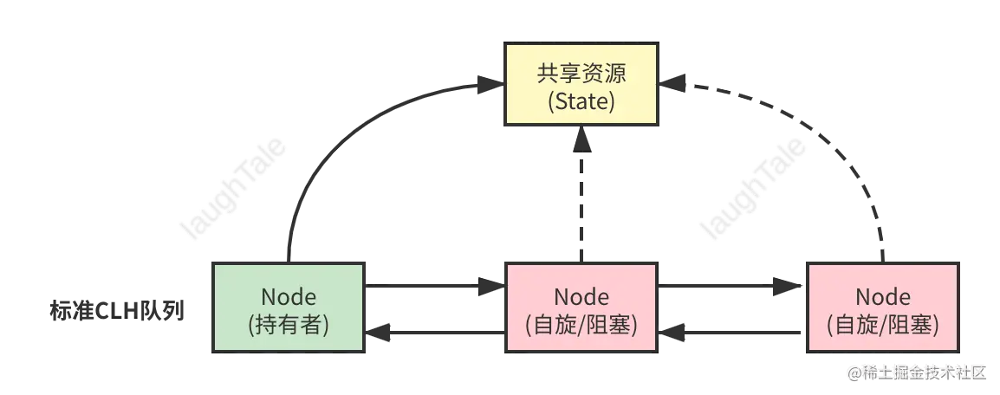


### 6 分布式锁实现

> 当多个进程不在同一个系统中，用于控制多个进程对资源访问的锁

- **数据库实现**

  创建锁表用于存储锁的信息 - 通过数据库的事务机制来保证并发安全。尝试在数据库中插入一条记录，如果插入成功，则表示获取到了锁；如果插入失败，则表示锁已被其他线程或进程获取。

  `加锁 - 向锁表插入; 解锁 - 删除锁表记录`

- **Redis 实现**

  创建锁键 - 通过 SETNX 设定

  `加锁 - 不存在设定键的值, 存在忽略; 解锁 - 删除键` 

- **其它**

  `Redisson` `zookeeper` 


### 7 线程池 创建 | 核心参数 | 扩容与缩容策略

> 线程池：主要起到管理线程作用, 可以有效的管理线程: 线程数量、线程复用。线程池的好处：1.更方便管理线程 2.可以减少因频繁创建线程和销毁线程带来的内存消耗，提高程序的运行效率。  1）它可以管理线程的数量，可以避免无节制的创建线程，导致超出系统负荷直至奔溃。2）它还可以让线程复用，可以大大地减少创建和销毁线程所带来的开销。

- **创建**

  一般使用 Executors 类创建, 提供了 4 个通用方法:

  - `newCachedThreadPool()` 

    线程数量随着任务增加⽽增加，如果线程执⾏完毕却空闲了⼀段时间则会被回收
    特点：没有核⼼线程数，也不会有缓冲队列，⼀个任务对应会创建⼀个线程，线程的最⼤空闲时间 1分钟。

    ```java
    public class TreadPoolTest {
        public static void main(String[] args) {
            ExecutorService executorService1 = Executors.newCachedThreadPool();
            ExecutorService executorService2 = Executors.newFixedThreadPool(10);
            ExecutorService executorService3 = Executors.newSingleThreadExecutor();
            for (int i = 0; i < 100; i++) {
            int idx = i;
            executorService1.submit(() ->
            	System.out.println(Thread.currentThread().getName() + " task execution i = " + idx));
            }
        }
    }
    ```

  - `newFixedThreadPool`

    创建固定线程数量的线程池，如果某个线程因为执⾏异常⽽结束，那么线程池会补充⼀个新线程代替它
    特点：没有核⼼线程数等于最⼤线程数，⽆界队列作为缓冲，排队可能导致 OOM。

    ```java
    public static ExecutorService newFixedThreadPool(int nThreads) {
        return new ThreadPoolExecutor(nThreads, nThreads,
            0L, TimeUnit.MILLISECONDS,
            new LinkedBlockingQueue<Runnable>());
    }
    ```

  - `newSingleThreadExecutor`

    创建只有⼀个线程的线程池对象，如果该线程出现异常⽽结束，那么线程池会补充⼀个线程
    特点： 只有⼀个线程的线程池，⽆界队列作为缓冲，排队可能导致 OOM。

    ```java
    public static ExecutorService newSingleThreadExecutor() {
        return new FinalizableDelegatedExecutorService
            (new ThreadPoolExecutor(1, 1,
                0L, TimeUnit.MILLISECONDS,
                new LinkedBlockingQueue<Runnable>()));
    }
    ```

  - `newScheduledThreadPool`

    创建⼀个线程池，可以实现在给定的延时后运⾏任务，或者定期执⾏任务

    ```java
    public static ScheduledExecutorService newScheduledThreadPool(int corePoolSize) {
    	return new ScheduledThreadPoolExecutor(corePoolSize);
    }
    ```

    `运行阶段`

    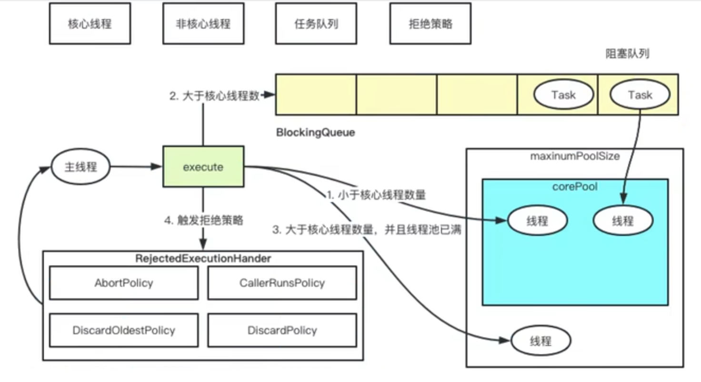

- **线程池核心参数**

  *ThreadPoolExecutor*

  ```java
  public ThreadPoolExecutor(int corePoolSize,
                           int maximumPoolSize,
                           long keepAliveTime,
                           TimeUnit unit,
                           BlockingQueue<Runnable> workQueue,
                           ThreadFactory threadFactory,
                           RejectedExecutionHandler handler)
  ```

  `corePoolSize`	线程池核心线程大小

  `maximumPoolSize` 线程池最大线程数量

  `keepAliveTime`  线程存活时间

  `unit`		  存活时间单位

  `workQueue`	 工作队列 - 4种: 基于数组、链表、不缓存、优先级的有界阻塞队列  (无界队列|有界队列)

  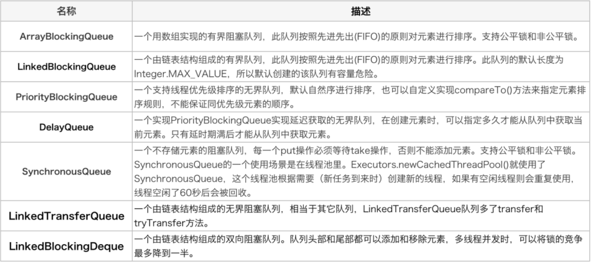

  `threadFactory`  线程工厂 - 创建线程用的工厂, 指定线程名等

  `handler`       拒绝策略

  - AbortPolicy：处理程序遭到拒绝，则直接抛出运行时异常 RejectedExecutionException。(默认策略)
  - CallerRunsPolicy：调用者所在线程来运行该任务，此策略提供简单的反馈控制机制，能够减缓新任务的提交速度。
  - DiscardPolicy：无法执行的任务将被删除。
  - DiscardOldestPolicy：如果执行程序尚未关闭，则位于工作队列头部的任务将被删除，然后重新尝试执行任务（如果再次失败，则重复此过程）。

- **扩容与缩容策略**

  线程池的扩容和缩容操作可以通过调整核心线程数和最大线程数来实现：

  - 扩容：当提交的任务数量超过核心线程数且工作队列已满时，线程池会创建新的线程来处理任务，直到达到最大线程数。可以通过适当增大核心线程数和最大线程数来提高线程池的并发能力。
  - 缩容：线程池中的线程在空闲一定时间后会被销毁，以减少资源消耗。可以通过设置合适的线程存活时间来控制线程的缩容。


### 10 线程的创建方式 | 通信方式 | 线程状态

**创建方式**

- 继承 Thread 类, 重写 run() 方法
- 实现 Runnable() 接口, 实现接口的 run() 方法
- 实现 Callable() 接口, 重写 call() 方法;  前两种方式线程执行完后都没有返回值，最后一种带返回值；
- 使用线程池

**通信方式**

- 共享变量: 如 volatile 修饰的变量, 可以在线程之间通信使用。
- 锁机制: Synchronized、ReentrantLock(维护的临界区变量) 等
- 条件变量: Condition 变量
- 信号量: Semaphore 类
- 管道: PipedInput|OutputStream


### 11 Thread 和 Runnable 的区别

> 都需要实现 run() 方法; 最终都需要通过 Thread.start() 方法启动

- Thread

  `类- 继承`  `start() run() 都有`  `单继承导致扩展型差` 

  ```java
   class MyThreadDemo extends Thread {
          @Override
          public void run(){
  			//多线程执行的方法
              for(int i=0;i<10;i++){
                  System.out.println("输出:"+i);
              }
          }
       
       @Test
       public void runTest2(){
           //实例化了两个对象。 
           MyThreadDemo thread1=new MyThreadDemo();
           MyThreadDemo thread2=new MyThreadDemo();
           //对同一个，是无法多次启动的。
           thread1.start();
           thread2.start();
       }
   }
  
  ```

- Runnable *常用*

  `接口 - 实现` `Thread 实现 Runnable` `没有 start(), 只有 run() 方法` `构造方法接受Runnable的子类实例 ` `接口可多继承扩展性好` `Thread 接受实的 Runnable 对象为参数`

  在程序开发中只要是多线程肯定永远以实现Runnable接口为主。

  实现Runnable接口相比继承Thread类有如下好处：
  1、避免继承的局限，一个类可以继承多个接口。
  2、适合于资源的共享。

  ```java
  class MyRunnableDemo implements Runnable{
      @Override
      public void run() {
          for(int i=0;i<10;i++){
              System.out.println("输出Runnable:"+i);
          }
      }
      
      @Test
      public void test1(){
          //实例化两次对象
          MyRunnableDemo myRunnableDemo1=new MyRunnableDemo();
          MyRunnableDemo myRunnableDemo2=new MyRunnableDemo();
          //分别放置到不同的线程里面
          Thread thread1=new Thread(myRunnableDemo1);
          Thread thread2=new Thread(myRunnableDemo2);
          //启动
          thread1.start();
          thread2.start();
      }
  }
  
  ```


### 12 run() 和 start() 方法区别

- run()

  `定义线程要执行的任务代码` `主线程中调用不会启动新线程, 只是当做普通方法串行运行`

- start()

  `用于启动新线程` `创建新线程` `只能被调用一次, 多次报 IllegalThreadStateException`


### 13 乐观锁 | 悲观锁

- 乐观锁

  总是假设最好的情况，每次操作数据的时候，认为别人不会修改，所以不会上锁, 只有在更新的时候会判断是否有人修改数据, 适合于多读。 `操作数据不加锁, 更新时判断是否被修改`

- 悲观锁

  总是假设最坏的情况，每次取数据时都认为别人会修改。所以在每次取数据时会自己上锁，这样线程在取数据时候就会进行阻塞。 `操作数据则加锁, 其它线程无法修改数据`


### 14 Java 线程阻塞的方法

- **线程睡眠**

  `Thread.sleep (long millis)`
  使线程转到阻塞状态。当睡眠结束后，就转为就绪（Runnable）状态。sleep()平台移植性好。

- **线程等待**

  `Object类中的 wait() 方法`
  导致当前的线程等待，直到其他线程调用此对象的 notify() 唤醒方法。wait() 使得线程进入阻塞状态，它有两种形式，一种允许 指定以毫秒为单位的一段时间作为参数，另一种没有参数，前者当对应的 notify() 被调用或者超出指定时间时线程重新进入可执行状态，后者则必须对应的 notify() 被调用。

- **线程礼让**

  `Thread.yield()`
  暂停当前正在执行的线程对象，把执行机会让给相同或者更高优先级的线程。yield() 使得线程放弃当前分得的 CPU 时间，但是不使线程阻塞，即线程仍处于可执行状态，随时可能再次分得 CPU 时间。调用 yield() 的效果等价于调度程序认为该线程已执行了足够的时间从而转到另一个线程。

- **线程自闭**

  `join()`
  等待其他线程终止。在当前线程中调用另一个线程的join()方法，则当前线程转入阻塞状态，直到另一个线程运行结束，当前线程再由阻塞转为就绪状态。


### 15 wait() 和 sleep() 的区别

- wait()

  `等待直到唤醒, 必须放在 synchronized 块 ` `需要 notify/ notifyAll 手动唤醒` `Object本地方法` `可释放线程获取的锁` `主要用于线程协作与通信`

- sleep()

  `休眠一定时间, 任何地方都可使用` `自动苏醒` `Thread的静态本地方法 ` `无法释放锁` `用于当前线程休眠，或者轮循暂停操作`

  ```java
  Thread.sleep(3000L);
  ```


### 16 锁的三种应用场景

- **互斥锁**

  `互斥锁用于保护共享资源，确保同一时间只有一个线程可以访问该资源`

  应用场景

  - *临界区保护*：在多线程环境下，当多个线程需要访问共享资源（如共享变量、全局数据结构等）时，通过互斥锁来保护临界区，避免竞争条件和数据不一致问题。
  - *数据库事务*：在数据库系统中，互斥锁用于保护事务的隔离性，确保同时只有一个事务可以修改某个数据项。

- **读写锁**
  `读写锁允许多个线程同时读取共享资源，但在写操作时需要独占访问`

  应用场景

  - *读多写少的数据结构*：当数据结构被频繁读取而很少修改时，可以使用读写锁来提高并发读取性能。
  - *数据库缓存*：在数据库缓存中，读写锁可以用于控制对缓存数据的访问，提供并发读取和独占写入的支持。

- **自旋锁**
  `自旋锁是一种忙等待的锁，线程在获取锁时会一直自旋（忙等待）直到获取到锁`

  应用场景

  - *短期的临界区保护*：当临界区的持有时间很短，线程在等待锁的时间相对较少时，使用自旋锁可以避免线程切换带来的开销。
  - *多核心处理器环境*：自旋锁在多核心处理器环境中更为有效，因为在一个核心上自旋等待时，其他核心仍可以继续执行其他任务。


## JVM

JVM 实现JAVA跨平台的核心, 能够将不同平台解释器的代码解释为相同的字节码进行编译。JVM 由类加载器、执行引擎、本地方法接口、运行时方法区(JVM内存模型: 堆、栈、程序计数器、本地方法栈、方法区)组成。

- **类加载器**

  根据给定的全限定名类名（如：java.lang.Object）来加载到运行时数据区（Running data area）的方法区中。

- **执行引擎**

  执行 classes 中的指令

- **本地方法接口**

  与Native libraries交互，是其它编程语言交互的接口。

- **运行时数据区**

  这块就是我们常说的JVM内存


### 1 Java 内存模型 | JVM 内存模型

- Java 内存模型

  主要围绕并发过程中原子性、可见性和有序性特性定义的。Java 内存模型是一种规范, 定义了Java程序中多线程并发访问共享内存时的行为和准则, 旨在提供一种统一的内存访问模型, 使得开发者能够编写正确、可靠而高效的多线程程序。

  如: 线程共享变量存储在主内存, 每个线程具有独立本地内存; 还定义了并发时主内存和工作内存的操作规则来保证并发性。

- JVM 内存模型

  指 JVM 对内存的组织和管理方式, JVM 内存模型定义了Java程序在运行时的内存结构, 包括堆、栈、方法区等。JVM内存模型规定了Java程序运行时的内存分配、使用和回收方式, 以及线程与内存的交互方式。

  **运行时数据区**

  - **堆**: 用于存储`对象实例和数组`, 是线程共享的内存区域。
  - **栈**: 每个线程都有自己的栈, 用于存储`方法调用、局部变量和操作数`。
  - **本地方法栈**: 用于`执行本地方法`的栈
  - **方法区**: 存储类的`结构信息、静态变量、常量池`等
  - **程序计数器**: 记录当前线程执行的`字节码指令地址`

- 特点

  - JVM 内存模型与硬件和操作系统的内存模型有一定的差异，JVM 可以在不同平台上实现统一的内存模型。
  - JVM 通过即时编译器（Just-in-Time Compiler，JIT）等技术进行代码优化和内存管理。
  - JVM 内存模型规定了对象的创建、访问、修改和销毁的方式，以及垃圾回收机制对内存的管理。


### 2 JVM 分代回收策略

> Java 虚拟机根据对象存活的周期不同，把堆内存划分为几块，一般分为新生代、老年代。 注意: 在 HotSpot 中除了新生代和老年代，还有永久代。

- **新生代**

  新生成的对象优先存放在新生代中，新生代对象存活率很低，在新生代中，常规应用进行一次垃圾收集一般可以回收 70%~95% 的空间，回收效率很高。新生代中因为要进行一些复制操作，所以一般采用的 GC 回收算法是**复制算法**。 新生代又可以继续细分为 3 部分：`Eden`、`Survivor0（简称 S0）`、`Survivor1（简称S1）`。这 3 部分按照 8:1:1 的比例来划分新生代。

- **老年代**

  一个对象如果在新生代存活了足够长的时间而没有被清理掉，则会被复制到老年代。老年代的内存大小一般比新生代大，能存放更多的对象。如果对象比较大（比如长字符串或者大数组），并且新生代的剩余空间不足，则这个大对象会直接被分配到老年代上。


### 3 GC 可达性分析的根节点有哪些

> 可达性分析: 通过一系列称为 `GC Roots` 的对象作为起始点，从这些节点开始向下搜索，搜索走过的路径称为“引用链”，当一个对象到 `GC Roots` 没有任何的引用链相连时(从`GC Roots`到这个对象不可达)时，证明此对象不可用。

在Java语言中，可以作为GCRoots的对象包括下面几种：

- 虚拟机栈（栈帧中的局部变量区，也叫做局部变量表）中引用的对象。
- 方法区中的类静态属性引用的对象。
- 方法区中常量引用的对象。
- 本地方法栈中JNI(Native方法)引用的对象。


### 4 垃圾回收器 GC

>  垃圾回收器是JVM中负责执行垃圾回收的组件。JVM 提供了不同类型的垃圾回收器，包括：

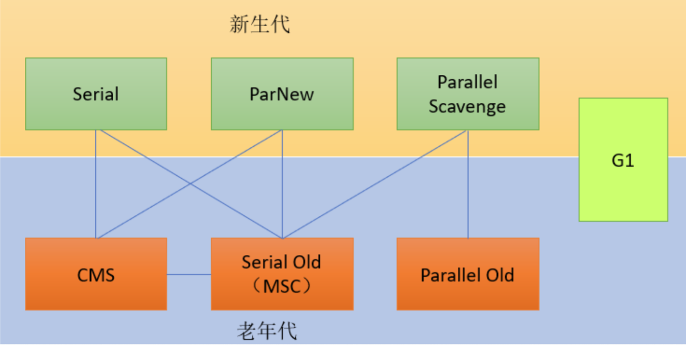


#### 1) 新生代收集器

- `Serial`  1

  *单线程* *复制算法*    在垃圾清理时，必须暂停其他所有工作线程, 单个线程收集垃圾。适用于小型应用和简单的客户端应用。  

- `Parallel Scavenge` 2

  *并行* *多线程* *复制算法*    在收集过程中会开启多个线程一起收集，整个过程都会暂停用户线程，多个线程同时收集垃圾, 直到整个垃圾收集过程结束。

- `ParNew` 3

  *多线程* *复制算法*    先停止应用线程，多线程同时收集，整个收集过程STW，直到垃圾收集完毕CPU多核环境下效率要比serial高，新生代唯一一个能与CMS配合的收集器。


#### 2) 老年代收集器

- `Serial Old`  1

  *单线程* *标记-整理算法*   内存资源占用少、单核CPU环境最佳选项。

- `Parallel Old` 2

  *多线程* *标记-整理算法*   多线程收集，CPU多核环境下效率要比serial高

- `CMS` Concurrent Mark and Sweep  *NEW* *1.9 后停用*

  *避免长时间的停顿时间(STW)*  *标记-清除 & 标记-整理* *多线程*  *初始标记、重新标记 需要STW, 其余不需要*      

  **优点:** 多线程收集，收集过程不停止用户线程，所以用户请求停顿时间短。

  **缺点:** *浮动垃圾* - 不需要STW的清理阶段用户产生的新垃圾; *空间碎片* - 标记清除算法导致的碎片问题    

  1. 初始标记: 对根节点与根节点有直接关系的对象进行可达性分析并标记。
  2. 并发标记: 根据根节点标记所有可达对象。
  3. 重新标记: 更新在并发标记阶段被复活的对象。
  4. 并发清除: 并发 *标记清除* 所有被标记为垃圾的对象并回收内存空间。空间碎片到达了一定程度时，此时CMS会使用 *标记整理* 解决空间碎片的问题。


#### 3) 混合收集器

- `G1（Garbage-First）`  *1.9 后成为默认的回收器*

  *复制 & 标记-整理*  局部-标记复制法: 把存活对象从一个Region复制到另外的Region; 全局-标记整理法，每次垃圾收集时会把存活的对象整理到其他对应区域的Region里

  **Region**

  在此之前, GC 将连续的内存空间划分为 **新生代、老生代和永久代 | 元空间 (JDK 1.8)**, 这种划分的特点是各代的存储地址（逻辑地址）是连续的。G1 (Garbage First) 的各代存储地址是不连续的，每一代都使用了 n 个不连续的大小相同的 region， 每个 region 占有一块连续的虚拟内存地址。

  舍弃内存上的物理分区，把堆内存拆分成了大小为1M-32M的 Region块，然后以Region为单位自由的组合成新生代、老年代、Eden区、survior区、大对象区（Humonggous Region），随着垃圾回收和对象分配每个Region也不会一直固定属于哪个分代，我们可以认为Region可以随时扮演任何一个分代区域的内存。

  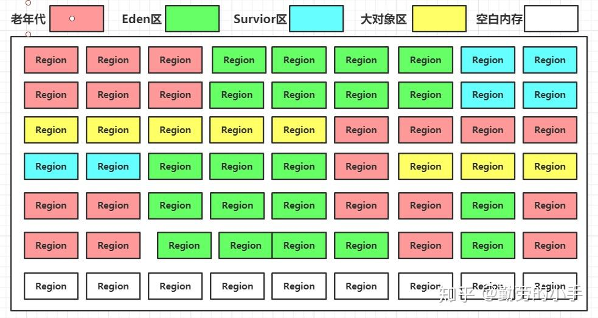

  **Collect Set（智能收集）**

  维护一个 Collect Set 集合，记录待回收的 Region 块信息和其可回收的大小空间, 这样就可以根据用户设定的可接受停顿时间来进行分析，在设定的时间范围内收集哪些区域最划算而择优先收集的区域，优先回收价值最大的 Region, 还可以根据用户的设定之间来计算收集哪些Region达到用户所期望的垃圾收集时间。  

  **优点:** 停顿时间可控，吞吐量高，可根据具体场景选择吞吐量有限还是停顿时间有限，不需要额外的收集器搭配, 提供良好的停顿时间和吞吐量。

  **缺点:** 因为需要维护的额外信息比较多，所以需要的内存空间也要大，6G以上的内存才能考虑使用G1收集器。

  **工作流程: **

  1. 初始标记: 暂停应用线程, 对根节点与根节点有直接关系的对象进行可达性分析并标记。

  2. 并发标记: 根据根节点标记所有可达对象。

  3. 最终标记: 标记在此前阶段用户线程运行产生的新垃圾, 产生 STW

  4. 筛选回收: 把存活对象复制到空闲Region，再根据Collect Set记录的可回收Region信息进行筛选，计算回收成本，根据用户设定的停顿时间值制定回收计划，根据回收计划筛选合适的Region区域进行回收 *复制算法*

     

### 5 垃圾回收算法

JVM 使用不同的垃圾回收算法来标记和回收垃圾对象。常见的垃圾回收算法包括：

- 引用计数法: 对象绑定计数器, 当引用指向该对象, 计数器+1;引用被删除, 计数器-1;为0时对象被回收(等待够一批次再进行回收) 。

- 标记-清除算法（Mark and Sweep）：标记所有活动对象，然后清除未标记的对象。	`优点：垃圾回收速度快。缺点：存在内存碎片`
- 标记-整理算法（Mark and Compact）：标记活动对象，然后将它们向一端移动，然后清除其余空间。 `优点：没有内存碎片。缺点：整理速度慢`
- 复制算法（Copying）：将存活对象复制到一个新的空间，并清除旧空间中的所有对象。  `优点：没有内存碎片。缺点：内存开销大`


### 6 三色标记

- **概念**

  三色标记是Java虚拟机（JVM）中垃圾回收算法中的一种常用标记方式，用于标记对象的存活状态。基本思想是从根对象（如根节点、全局变量等）开始，通过追踪对象之间的引用关系，递归地对对象进行标记。标记阶段完成后，未被标记的对象即为垃圾对象，可以被垃圾回收器回收。然后，JVM进行垃圾回收，回收垃圾对象所占用的内存空间，使其可供程序再次使用。   GC:  `CMS` `G1` - *标记阶段*

- **原理**

  1. 白色（White）：初始状态下，所有对象都被标记为白色，表示未被访问过，需要进行标记。
  2. 灰色（Gray）：灰色表示对象已经被访问过，但其引用的对象还未被标记。灰色对象的引用仍然需要被追踪和标记。
  3. 黑色（Black）：黑色表示对象已经被访问过，并且其引用的对象也已经被标记。黑色对象是被认定为存活对象，不会被垃圾回收。


### 7 线程池的执行流程

- **线程池策略**
  corePoolSize：核心线程数；maximunPoolSize：最大线程数
  每当有新的任务到线程池时，
  第一步： 先判断线程池中当前线程数量是否达到了corePoolSize，若未达到，则新建线程运行此任务，且任务结束后将该线程保留在线程池中，不做销毁处理，若当前线程数量已达到corePoolSize，则进入下一步；
  第二步： 判断工作队列(workQueue)是否已满，未满则将新的任务提交到工作队列中，满了则进入下一步；
  第三步： 判断线程池中的线程数量是否达到了maxumunPoolSize，如果未达到，则新建一个工作线程来执行这个任务，如果达到了则使用饱和策略来处理这个任务。注意： 在线程池中的线程数量超过corePoolSize时，每当有线程的空闲时间超过了keepAliveTime，这个线程就会被终止。直到线程池中线程的数量不大于corePoolSize为止。
  （由第三步可知，在一般情况下，Java线程池中会长期保持corePoolSize个线程。）

- **饱和策略**
  当工作队列满且线程个数达到maximunPoolSize后所采取的策略
  AbortPolicy：默认策略；新任务提交时直接抛出未检查的异常RejectedExecutionException，该异常可由调用者捕获。
  CallerRunsPolicy：既不抛弃任务也不抛出异常，使用调用者所在线程运行新的任务。
  DiscardPolicy：丢弃新的任务，且不抛出异常。
  DiscardOldestPolicy：调用poll方法丢弃工作队列队头的任务，然后尝试提交新任务
  自定义策略：根据用户需要定制。


### 8 JVM 调优

`最大堆内存大小` `初始堆内存大小` `年轻代大小` `年轻代和老年代的内存比例` `Eden区和Survivor区内存比例` `垃圾回收器选择` `垃圾回收最大停顿时间` ``

- **常见参数**

  1. 内存相关参数：

  - `-Xmx<size>`：设置堆的最大内存大小。

  - `-Xms<size>`：设置堆的初始内存大小。

  - `-Xmn<size>`：设置新生代的大小。

  - `-XX:MaxPermSize=<size>`（Java 7及之前）| `-XX:MaxMetaspaceSize=<size>`（Java 8及之后）:

    设置持久代（Java 7及之前版本）或元空间（Java 8及之后版本）的最大内存大小。

  2. 垃圾回收相关参数：

  - `-XX:+UseSerialGC`：使用串行垃圾回收器。
  - `-XX:+UseParallelGC`：使用并行垃圾回收器。
  - `-XX:+UseConcMarkSweepGC`：使用并发标记清除垃圾回收器。
  - `-XX:+UseG1GC`：使用G1垃圾回收器。
  - `-XX:ParallelGCThreads=<num>`：设置并行垃圾回收的线程数。

  3. 垃圾回收调优参数：

  - `-XX:MaxGCPauseMillis=<ms>`：设置最大垃圾回收停顿时间目标。
  - `-XX:GCTimeRatio=<n>`：设置垃圾回收时间与应用程序执行时间的比率。
  - `-XX:NewRatio=<n>`：设置新生代与老年代内存大小的比率。
  - `-XX:SurvivorRatio=<n>`：设置Eden区与Survivor区的内存大小比率。

  4. 线程相关参数：

  - `-XX:ParallelGCThreads=<num>`：设置并行垃圾回收的线程数。
  - `-XX:ConcGCThreads=<num>`：设置并发垃圾回收的线程数。
  - `-XX:ThreadStackSize=<size>`：设置线程栈大小。

  5. JIT编译器参数：

  - `-XX:+TieredCompilation`：启用分层编译，将热点代码逐步编译为本地机器码。
  - `-XX:+PrintCompilation`：打印方法的即时编译信息。

- **JVM 调优工具**

  1. 命令行工具：

  - `jps`：用于查看Java进程的状态信息，包括进程ID（PID）和执行的主类名称。
  - `jstack`：用于查看Java进程内线程的堆栈信息，可以用于分析线程的状态、死锁等问题。
  - `jmap`：用于生成Java堆的转储快照，并提供堆内存使用情况的统计信息，有助于分析内存泄漏和内存使用情况。
  - `jhat`：是一个堆转储快照分析工具，可将jmap生成的堆转储文件加载到内存中，以便进行分析和查询。

  2. 可视化工具：

  - `jconsole`：是Java监控与管理控制台，提供了对JVM的实时监控和管理功能，包括内存、线程、类加载、GC等信息的监控和分析。
  - `VisualVM`：是一个功能强大的可视化工具，用于监控和分析Java应用程序的性能。它能够提供线程、内存、CPU使用情况的图形化展示，还支持插件扩展和远程监控功能。


## Spring

> Spring 是一个轻量级的免费框架，它有两大核心功能，分别是 IOC 和 AOP ，IOC 控制反转是将创建对象的权限交给 spring 框架来控制。可以很好的起到解耦的作用。AOP 是一种编程思想以及面向切面编程，底层使用的是动态代理。可以在程序原有的功能上进行增强，常用的场景有日志记录和权限验证。

### 1 IOC | AOP

- **IOC**(控制反转)

  `将创建对象的权限交给spring`

  在之前创建对象时使用new关键字，而现在直接从spring框架中拿出已创建好的实例即可。Spring负责维护对象之间的依赖关系，降低对象之间的耦合度，它的实现方式为 DI - 依赖注入 主要的注入方式包括: 构造器、setter、接口注入。

- **AOP**(面向切面编程)

  `在方法上开一个切口，可以在这个类执行之前执行自定义的方法，在不修改源代码的前提下，对方法进行增强`
  
  AOP 面向切面编程是 spring 的两大核心之一，它是一种编程思想。。它可以对业务逻辑的各个部分进行隔离，降低耦合, 提高代码的可重用性。它的底层是通过动态代理来实现的，它主要场景包括日志记录和权限验证。 `动态代理: 实质上就是对方法加了一层代理, 然后在此之上增强它, 与静态代理的区别在于不需要一个个的实现, 而是通过反射判断是否需要代理, 需要则自动增加。`


### 2 BeanFactory 和 FactoryBean 的区别

BeanFactory 是最基础的IOC容器, 是一种规范模式; 而 FactoryBean 知识 SpringIOC 创建 Bean 的一种形式。

- beanfactory：是所有spring bean容器的顶级接口，是最基础的IOC容器，它为spring的容器定义了一套方法，并提供像getBean这样的方法从容器中获取指定的bean实例。它在产生bean的同时，还提供了解决bean之间的依赖注入的能力，也就是所谓的di。
- factory bean：工厂bean，只是SpringIOC容器创建Bean的一种形式，它是一个接口，它的主要功能是动态去生成某一类型的bean的一个实例，也就是说 我们可以自定义一个bean并且加载到ioc容器里面，getObject是用来实现动态构建bean的一个过程。


### 3 Spring 循环依赖和如何解决?

- 循环依赖

  两个或则两个以上的bean互相持有对方，最终形成闭环。比如A依赖于B，B依赖于C，C又依赖于A。

  Spring中循环依赖场景有： 
  （1）构造器的循环依赖 
  （2）field属性的循环依赖。

  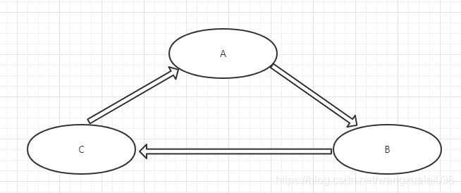

- 解决方案

  Spring 的循环依赖主要发生在属性注入阶段, 也即对 Bean对象注入实例属性的时候。当 A 属性注入需要 B, 则请求创建 B; 而 B 属性注入也需要 A, 此时就发生了类似死锁的循环依赖。

  `三级缓存` 

  ```java
  /** Cache of singleton objects: bean name to bean instance. */
  private final Map<String, Object> singletonObjects = new ConcurrentHashMap<>(256);
  
  /** Cache of singleton factories: bean name to ObjectFactory. */
  private final Map<String, ObjectFactory<?>> singletonFactories = new HashMap<>(16);
  
  /** Cache of early singleton objects: bean name to bean instance. */
  private final Map<String, Object> earlySingletonObjects = new HashMap<>(16);
  ```

  - 一级缓存（`singletonObjects`）：缓存的是**已经实例化、属性注入、初始化后**的 Bean 对象。
  - 二级缓存（`earlySingletonObjects`）：缓存的是**实例化后，但未属性注入、初始化**的 Bean对象（用于提前暴露 Bean）。
  - 三级缓存（`singletonFactories`）：缓存的是一个 `ObjectFactory`，主要作用是生成原始对象进行 AOP 操作后的**代理对象**（这一级缓存主要用于解决 AOP 问题，后续文章中讲解）。

  采用缓存的方式, 在A依赖B时, 创建B实体, 将A与B都放入二级缓存, 这是B在依赖A时直接拿到缓存中的A使用即可。Java采用三级缓存的意义在于, Spring 的 AOP操作会在 *属性注入阶段之后* 产生代理对象, 这时二级缓存缓存的只是 *未属性注入的对象*, 这时依赖的对象与真实对象不一致则会引发问题, 所以采用了三级缓存。使用 *三级缓存* 将滞后的 `AOP` 操作提前, 避免发生依赖对象不一致的问题。  [Blog](https://juejin.cn/post/7218080360403615804)


### 4 常用注解

- `@Autowired` `@Resource` 

  **联系**

  ​	@Autowired和@Resource注解都是作为bean对象注入的时候使用的

  ​	两者都可以声明在字段和setter方法上

  **区别**

  ​	@Autowired 注解是 Spring 提供的，而 @Resource 注解是 J2EE 本身提供的
  ​	@Autowird 注解默认通过 byType 方式注入，而 @Resource 注解默认通过 byName 方式注入(不匹配则 byType)
  ​	@Autowired 注解注入的对象需要在 IOC容器中存在，否则需要加上属性 required=false ，表示忽略当前要注入的 bean，如果有直接注入，没有跳过，不会报错

 

### 5 Spring Boot 常用注解

`@SpringbootAplication`: 程序入口 - 开启自动配置

`@EnableautoConfiguration`: 开启自动配置 - 自动配置程序运行所需的功能和组件

`@ComponentScan`: 用于扫描指定的包和组件

`@Import`: 导入依赖  @Conditional   @Unconditional 等


### 6 Spring 事务

- 编程式事务

  - 侵入性事务管理，直接使用底层的 `PlatformTransactionManager` , 使用 `TransactionTemplate` (Spring推荐使用)；

    编程式事务管理对基于 POJO 的应用来说是唯一选择。我们需要在代码中调用 `beginTransaction()、commit()、rollback()` 等事务管理相关的方法；

    ```java
    @Autowired
    private PlatformTransactionManager transactionManager;
    
    public void testTransaction() {
    
      TransactionStatus status = transactionManager.getTransaction(new DefaultTransactionDefinition());
              try {
                   // ....  业务代码
                  transactionManager.commit(status);
              } catch (Exception e) {
                  transactionManager.rollback(status);
              }
    }
    
    ```

- 声明式事务

  `基于AOP` `@Transactional 注解`  在 Service 层对应方法上配置 @Transaction 注解即可。本质是对方法前后进行拦截，然后在目标方法开始之前创建或加入一个事务，在执行完目标方法之后根据执行情况提交或回滚事务。 `@Transactional` 的工作机制是基于 AOP 实现的，AOP 又是使用动态代理实现的。如果目标对象实现了接口，默认情况下会采用 JDK 的动态代理，如果目标对象没有实现了接口, 会使用 CGLIB 动态代理。

  ```java
  @Transactional(propagation = Propagation.REQUIRED)
  public void aMethod {
    //do something
    B b = new B();
    C c = new C();
    b.bMethod();
    c.cMethod();
  }
  ```

  **@Transactional 的作用范围**

  - **方法**：推荐将注解使用于方法上，不过需要注意的是： 该注解只能应用到 public 方法上，否则不生效。
  - **类**：如果这个注解使用在类上的话，表明该注解对该类中所有的 public 方法都生效。
  - **接口**：不推荐在接口上使用。

  


### 7 Spring 事务的隔离级别 | 回滚规则 | 传播行为

`@Transactional` 注解属性

- **TransactionDefinition 隔离级别 - isolation **

  - `ISOLATION_DEFAULT - 默认` :使用后端数据库默认的隔离级别，MySQL 默认采用的 `REPEATABLE_READ` 隔离级别 Oracle 默认采用的 `READ_COMMITTED` 隔离级别.


  - `ISOLATION_READ_UNCOMMITTED - 读未提交` :最低的隔离级别，使用这个隔离级别很少，因为它允许读取尚未提交的数据变更，**可能会导致脏读、幻读或不可重复读**


  - `ISOLATION_READ_COMMITTED - 读已提交` : 允许读取并发事务已经提交的数据，**可以阻止脏读，但是幻读或不可重复读仍有可能发生**


  - `ISOLATION_REPEATABLE_READ - 可重复读` : 对同一字段的多次读取结果都是一致的，除非数据是被本身事务自己所修改，**可以阻止脏读和不可重复读，但幻读仍有可能发生。**


  - `ISOLATION_SERIALIZABLE - 串行化` : 最高的隔离级别，完全服从 ACID 的隔离级别。所有的事务依次逐个执行，这样事务之间就完全不可能产生干扰，也就是说，**该级别可以防止脏读、不可重复读以及幻读**。但是这将严重影响程序的性能。通常情况下也不会用到该级别。


- **回滚规则 rollbackFor**

  默认情况下，事务只有遇到运行期异常（`RuntimeException` 的子类）时才会回滚，`Error` 也会导致事务回滚，但是，在遇到检查型（Checked）异常时不会回滚。

- **传播行为 propagation **

  | 事务传播行为类型          | 说明                                                         |
  | ------------------------- | ------------------------------------------------------------ |
  | PROPAGATION_REQUIRED      | 如果当前没有事务，就新建一个事务，如果已经存在一个事务中，加入到这个事务中。这是最常见的选择。 |
  | PROPAGATION_SUPPORTS      | 支持当前事务，如果当前没有事务，就以非事务方式执行。         |
  | PROPAGATION_MANDATORY     | 使用当前的事务，如果当前没有事务，就抛出异常。               |
  | PROPAGATION_REQUIRES_NEW  | 新建事务，如果当前存在事务，把当前事务挂起。                 |
  | PROPAGATION_NOT_SUPPORTED | 以非事务方式执行操作，如果当前存在事务，就把当前事务挂起。   |
  | PROPAGATION_NEVER         | 以非事务方式执行，如果当前存在事务，则抛出异常。             |
  | PROPAGATION_NESTED        | 如果当前存在事务，则在嵌套事务内执行。如果当前没有事务，则执行与PROPAGATION_REQUIRED类似的操作。 |

- **timeout**

  事务的超时时间，默认值为 -1。如果超过该时间限制但事务还没有完成，则自动回滚事务。

- **value 和 transactionManager**

  它们两个是一样的意思。当配置了多个事务管理器时，可以使用该属性指定选择哪个事务管理器。


### 8 Spring 事务的实现原理

> 概念: 当在某个类或者方法上使用@Transactional注解后，spring会基于该类生成一个代理对象，并将这个代理对象作为bean。当调用这个代理对象的方法时，如果有事务处理，则会先关闭事务的自动功能，然后执行方法的具体业务逻辑，如果业务逻辑没有异常，那么代理逻辑就会直接提交，如果出现任何异常，那么直接进行回滚操作。  事务的实现原理。如果说你加了一个 `@Transactional` 注解，此时 Spring 会使用 AOP 思想，对你的这个方法在执行之前，先去开启一个事务。执行完毕之后，根据你的方法是否报错，来决定回滚还是提交事务。

`@EnableTransactionManagement` + `@Transactional`(基于AOP-动态代理实现)

**API**

- `PlatformTransactionManager 事务管理器` 

  创建事务，提交事物和回滚事务

- `TransactionStatus 事务状态`

  事务的状态和事务执行所需要的方法: 判断是否成功、是否回滚、是否新事物、回滚参数等

- `TransactionDefinition 事务属性`

  传播级别、隔离级别、超时时间等


### 9 Spring 事务失效

@Transactional失效的场景

- `非public的方法`  原因就是在为该Bean寻找匹配的Advisor时，如果是非public方法加了该注解会忽视掉。
- `数据库引擎不支持`
- `未指定RollbackOn，且抛出的异常并非RuntimeException`
- `在声明事务的类内部调用事务方法` 基于动态代理, 类内部拿到的是原对象, 而非代理对象。


### 10 SpringBoot 自动装配原理

`约定大于配置`  从每个 jar 包中的 `META-INF/spring.factories`文件中获取到对应的需要进行自动装配的类，根据 Conditional 条件注解判定是否生成相应的Bean对象，然后将它们交给Spring容器进行管理

`@SpringBootApplication`看作是 `@Configuration`、`@EnableAutoConfiguration`、`@ComponentScan` 注解的集合。


- `SpringBootConfiguration`: 源码为 `@Configuration`, 表示该类为主配置类，可用来装配bean;  `@Configuration`：允许在上下文中注册额外的 bean 或导入其他配置类

- `@EnableAutoConfiguration`：启用 SpringBoot 的自动配置机制。

  AutoConfigurationImportSelector 获取所有符合条件的类的全限定类名，这些类需要被加载到 IoC 容器中; 

  1. **@AutoConfigurationPackage**：自动配置包

     @AutoConfigurationPackage和@ComponentScan一样，也是将主配置类所在的包及其子包里面的组件扫描到IOC容器中，但是区别是

     @AutoConfigurationPackage扫描@Enitity、@MapperScan等第三方依赖的注解
     @ComponentScan只扫描@Controller/@Service/@Component/@Repository这些常见注解。所以这两个注解扫描的对象是不一样的。

  2. **@Import(AutoConfigurationImportSelector.class)**

     - 作用：通过import导入第三方提供的bean的配置类：AutoConfigurationImportSelector：给容器中导入组件
     - 作用：扫描所有jar包类路径下的META-INF/spring.factories文件，将扫描到的这些文件包装成properties对象，从properties中获取到EnableAutoConfiguration.class类名对应的值，将这些值添加到容器中，用这些类做自动配置功能

- `@ComponentScan`：扫描被`@Component` (`@Service`,`@Controller`)注解的 bean，注解默认会扫描启动类所在的包下所有的类 ，可以自定义不扫描某些 bean。如下图所示，容器中将排除`TypeExcludeFilter`和`AutoConfigurationExcludeFilter`。


## SpringCloud

### 1 核心组件作用

- Eureka | Nacos | Zookeeper

  `服务注册与发现` 通过注册信息服务30s向Eureka发送心跳以验证存活, 否则剔除服务。

- Ribbon | LoadBalancer

  `负载均衡` 对不同请求通过轮询、权重、区域划分、并发数、随机的逻辑划分到不同的服务器

- Hystrix | sentienl

  `保证服务之间不发生级联故障(雪崩效应)` 一个服务崩溃引发大面积的崩溃, 通过线程隔离(线程池限定并发, 已满直接返回失败)、服务降级(不等待, 返回成功/失败结果)、断路器(切断访问)

- Feign | OpenFeign

  `简化远程调用` 之前的微服务以`url`方式组合访问, Feign使得现在调用类似调用本地方法一样。

- Gateway | zuul | zuul2

  `路由、限流、监控、安全` 

- Config | Nacos

  `服务配置中心` 多个服务之间的配置信息的管理, 仿照Git本地修改push即可, 无需再集中在代码中修改。

- SpringBoot

  `代码开发`


## 应用场景

### 1 全局主键生成策略

- `数据库自增序列`

- `UUID`

  **UUID由以下几部分的组合：**    `当前时间` + `时钟序列` + `机器码`
  （1）当前日期和时间，UUID的第一个部分与时间有关，如果你在生成一个UUID之后，过几秒又生成一个UUID，则第一个部分不同，其余相同。
  （2）时钟序列。  *“uuid的随机组件”  随机序列, 避免因一些特殊情况导致的 id 重复问题*
  （3）全局唯一的 IEEE 机器识别号，如果有网卡，从网卡MAC地址获得，没有网卡以其他方式获得。

  ```java
  UUID uuid = UUID.randomUUID();
  ```

  **优点：**
  1）使用简单。
  2）生成ID性能高，基本不会有性能问题。
  3）全球唯一，当数据迁移、数据合并、数据库变更时，可以从容应对。

  **缺点**：
  1）数据无序，无法保证趋势递增。
  2）UUID使用字符串存储，查询效率较低。（常见优化方案为“转化为两个uint64整数存储”或者“折半存储”，折半后不能保证唯一性）
  3）存储空间较大，如果是海量数据库，需考虑存储量的问题。
  4）传输数据量大。
  5）可读性差。

- `SnowFlake 算法`

  snowflake 是 Twitter开源的分布式ID生成算法，结果是一个long型的ID。   `时间戳` + `机器码` + `序列号`

  **其核心思想是：**

  - 最高位是符号位，始终为0，不可用。
  - 41 bit 作为毫秒数 - 41位的长度可以使用69年
  - 10 bit 作为机器编号 （5个bit是数据中心，5个bit的机器ID） - 10位的长度最多支持部署1024个节点
  - 12 bit 作为毫秒内序列号 - 12位的计数顺序号支持每个节点每毫秒产生4096个ID序号

  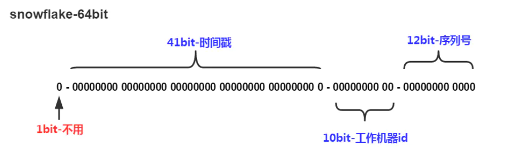

  算法单机每秒内理论上最多可以生成1000*(2^12)，也就是400W的ID，完全能满足业务的需求。

  snowflake算法可以根据自身项目的需要进行一定的修改。比如估算未来的数据中心个数，每个数据中心的机器数以及统一毫秒可以能的并发数来调整在算法中所需要的bit数。

  **优点：**

  - 不依赖于数据库，速度快，性能高。
  - ID 按照时间在单机上是递增的。
  - 可以根据实际情况调整各各位段，方便灵活。

  **缺点**：

  - 在单机上是递增的，由于涉及到分布式环境，每台机器上的时钟不可能完全同步，有时也会出现不是全局递增的情况。
  - 只能趋势递增。（如果绝对递增，竞对中午下单，第二天再下单即可大概判断该公司的订单量，危险！）
  - 依赖机器时间，如果发生回拨会导致可能生成id重复。


### 2 限流算法

- 令牌桶算法：

  - 原理：令牌桶算法通过维护一个固定容量的令牌桶，以固定的速率往桶中放入令牌。每个令牌代表一个请求或事件，桶中的令牌数量表示当前可处理的请求数量。当请求到达时，需要从令牌桶中获取一个令牌才能进行处理。如果桶中没有足够的令牌，则请求将被延迟或丢弃。

  - 应用场景：令牌桶算法适用于对 `请求` 进行限流的场景，可以控制单位时间内的请求速率，确保系统在高负载或突发请求情况下仍能保持稳定。

- 漏斗算法：

  - 原理：漏斗算法通过模拟一个漏斗的行为来控制请求的处理速率。漏斗具有一个固定的容量，以固定的速率流出。每个请求代表一定量的水，当请求到达时，如果漏斗有足够的容量，则可以处理该请求，漏斗容量减少；如果漏斗已满，则请求将被延迟或丢弃。

  - 应用场景：漏斗算法适用于对 `任务处理` 进行限流的场景，可以平滑请求的处理速率，防止突发请求对系统造成过大的压力。

- 区别：

  - 令牌桶算法是通过固定速率放入令牌，然后按需获取令牌来控制请求速率，而漏斗算法是通过固定速率流出来控制请求速率。

  - 令牌桶算法可以在固定的速率下处理请求，而漏斗算法可以适应突发请求，根据漏斗的容量来动态调整请求的处理速率。

  - 令牌桶算法的令牌可以积累一段时间，允许一定程度的突发请求，而漏斗算法是根据漏斗的固定容量来限制请求的处理速率。

  - 令牌桶算法对于请求速率的限制更加精确，可以精确控制每个请求的处理时间间隔，而漏斗算法更侧重于平滑请求的处理速率，对于突发请求的处理更具弹性。


### 3 Java 常见加密解密算法

- `Base64`

  用 64 个可打印字符来表示二进制数据。这 64 个字符是：小写字母 a-z、大写字母 A-Z、数字 0-9、符号"+"、"/"（再加上作为垫字的"="，实际上是 65 个字符），其他所有符号都转换成这个字符集中的字符。Base64 编码通常用作存储、传输一些二进制数据编码方法，所以说它本质上是一种将二进制数据转成文本数据的方案。

- `哈希加密`

  - MD5（Message Digest Algorithm 5）

    MD5 主要用做数据一致性验证、数字签名和安全访问认证，而不是用作加密。比如说用户在某个网站注册账户时，输入的密码一般经过 MD5 编码，更安全的做法还会加一层盐（salt），这样密码就具有不可逆性。然后把编码后的密码存入数据库，下次登录的时候把密码 MD5 编码，然后和数据库中的作对比，这样就提升了用户账户的安全性。生成128位散列值，常用于校验数据完整性。   `单向加密算法，只能加密不能解密`

  - bcrypt

    bcrypt 是一种自带盐值（自动加盐）的加密方案。 

    *加密* : 随机生成 salt -> salt; 跟 password 进行 hash

    *解密* : 从 hash 中取出salt -> salt跟 password 进行hash计算 -> 将得到的 hash 跟数据库中提取的的hash进行比对返回Boolean类型：true/false

    |    **项**    |                           **md5**                            |                          **bcrypt**                          |
    | :----------: | :----------------------------------------------------------: | :----------------------------------------------------------: |
    | **密文长度** |                             32位                             |                             60位                             |
    |  **安全性**  | 安全性差。密码相同时，加密后密文一样。提升安全性的方案：加密前生成随机的盐值（字符串），将它与密码拼接，然后再使用md5加密。 | 安全性好。密码相同时，生成的密文是不一样的。（因为它自动生成随机盐值） |
    | **加密耗时** |                              短                              |                             略长                             |

  - SHA（Secure Hash Algorithm - 安全散列算法）

    FIPS所认证的安全散列算法。能计算出一个数字消息所对应的长度固定字符串（又称消息摘要）的算法。且若输入的消息不同，它们对应到不同字符串的机率很高。数字签名等密码学应用中重要的工具，被广泛地应用于电子商务等信息安全领域。 SHA-1、SHA-256、SHA-512 等散列算法，生成不同长度的散列值。

- `非对称加密`

  - RSA（Rivest-Shamir-Adleman）

    非对称加密算法，用于实现公钥加密和数字签名。RSA使用公钥进行加密，私钥进行解密或签名。生成密钥对、公开公钥、公钥加密私钥解密、私钥加密公钥解密。

  - DSA（Digital Signature Algorithm）

    数字签名算法，用于生成和验证数字签名。

- `对称加密`

  - AES（Advanced Encryption Standard）

    目前最常用的对称加密算法之一，支持 128 位、192 位和 256 位密钥长度。密码学中又称 Rijndael 加密法，是美国联邦政府采用的一种区块加密标准。这个标准用来替代原先的 DES，已经被多方分析且广为全世界所使用。简单说就是 DES 的增强版，比 DES 的加密强度更高。

  - DES（Data Encryption Standard）

    DES 是一种对称加密算法，所谓对称加密算法就是：加密和解密使用相同密钥的算法。DES 加密算法出自 IBM 的研究，后来被美国政府正式采用，之后开始广泛流传。但近些年使用越来越少，因为 DES 使用 56 位密钥，以现代的计算能力，24 小时内即可被破解。

  - 3DES（Triple Data Encryption Algorithm）

    对DES进行了三重加密，提供更高的安全性。

- `对称加密和非对称加密的区别`

  对称加密：

  - 使用相同的密钥进行加密和解密操作，因此也称为共享密钥加密。
  - 加密速度较快，适合处理大量数据。
  - 密钥管理相对简单，只需保护好密钥的安全性。
  - 主要用于数据加密和解密，不适用于身份验证和数字签名。
  - 常见的对称加密算法有 AES、DES、3DES 等。

  非对称加密：

  - 使用一对密钥，即公钥和私钥，进行加密和解密操作，因此也称为公钥加密。
  - 公钥用于加密数据，私钥用于解密数据，公钥可以公开分发，私钥保密。
  - 加密速度较慢，适合处理较小的数据量。
  - 可用于身份验证、数字签名和密钥交换等场景。
  - 常见的非对称加密算法有RSA、DSA等。

  对称加密和非对称加密的主要区别如下：

  - 密钥数量：对称加密使用相同的密钥进行加密和解密，而非对称加密使用一对不同的密钥。
  - 加密速度：对称加密算法加密和解密速度较快，而非对称加密算法加密和解密速度较慢。
  - 安全性：对称加密的主要安全性依赖于密钥的保护，而非对称加密的安全性依赖于私钥的保密性。
  - 用途：对称加密主要用于数据加密和解密，而非对称加密可以用于身份验证、数字签名和密钥交换等场景。


### 4 高可用设计方案

- **集群和负载均衡** 

  `Redis 集群` `Ribbon 负载均衡`

- **服务容错与故障转移**

  `Hystrix | sentienl 重试、熔断、限流` 

- **数据库高可用**

  `主从复制 | 分库分表`


## 常规算法


### 1 树

#### 1) 二叉树的前 | 中 | 后 | 层序遍历

`前序`

$递归$

```java
public void preOrder(TreeNode head){
    if(head == null){
        return;
    }
    System.out.println(head.val);
    preOrder(head.left);
    preOrder(head.right);
}
```

$迭代$

```java
 public int[] preOrder(TreeNode root){
        List<Integer> res = new ArrayList<>();
        if(root == null){
            return res.stream().mapToInt(Integer::valueOf).toArray();
        }

        Deque<TreeNode> stack = new LinkedList<TreeNode>();
        while(root != null || !stack.isEmpty()){
            //先一条路走到头, 然后退栈
            while(root != null){
                stack.push(root);
                res.add(root.val);     //添加值到lsit
                root = root.left;
            }
            //到头了, 退栈
            root = stack.pop();
            root = root.right;      //向右遍历
        }
        int[] ress = res.stream().mapToInt(Integer::valueOf).toArray();
        return ress;
    }
```


`中序`

$递归$

```java
public void midOrder(TreeNode head){
    if(head == null){
        return;
    }
    midOrder(head.left);
    System.out.println(head.val);
    midOrder(head.right);
}
```

$迭代$

```java
public int[] midOrder(TreeNode root){
    Deque<TreeNode> stack = new LinkedList<TreeNode>();
    List<Integer> res = new ArrayList<>();
    while(root != null || !stack.isEmpty()){
        //先一条路走到头, 然后退栈
        while(root != null){
            stack.push(root);
            root = root.left;
        }
        //到头了, 退栈
        root = stack.pop();
        res.add(root.val);     //添加值到lsit
        root = root.right;      //向右遍历
    }
    int[] ress = res.stream().mapToInt(Integer::valueOf).toArray();
    return ress;
}
```


`后序`

$递归$

```java
public void afterOrder(TreeNode head){
    if(head == null){
        return;
    }
    afterOrder(head.left);
    afterOrder(head.right);
    System.out.println(head.val);
}
```

$迭代$

```java
public int[] afterOrder(TreeNode root){
    List<Integer> res = new ArrayList<>();
    if(root == null){
        return res.stream().mapToInt(Integer::valueOf).toArray();
    }

    Deque<TreeNode> stack = new LinkedList<TreeNode>();
    TreeNode pre = null;
    while(root != null || !stack.isEmpty()){
        //先一条路走到头, 然后退栈
        while(root != null){
            stack.push(root);
            root = root.left;
        }

        root = stack.pop();
        //根据情况判断是否有右结点 && 未被访问过
        if(root.right == null || root.right == pre){
            res.add(root.val);
            pre = root;
            root = null;

        } else{
            stack.push(root);
            root = root.right;
        }
    }
    return res.stream().mapToInt(Integer::valueOf).toArray();
}
```


`层序`

通过 BFS 改造而来, 记录每次入队的个数然后添加到二维数组的对应列 : 主要是通过BFS得到每一层的结点信息, 然后将节点信息存到新的数组, 再拼接为二维数组即可。

```java
 public List<List<Integer>> levelOrder(TreeNode root) {
     List<List<Integer>> res = new ArrayList<List<Integer>>();
     Queue<TreeNode> queue = new ArrayDeque<>();
     if(root != null){
         queue.add(root);
     }
     while(!queue.isEmpty()){
         List<Integer> level = new ArrayList<>();
         int n = queue.size();
         for(int i = 0; i < n; i++){
             //遍历每一层的所有节点, 添加到列表内 - 以下是层序遍历
             TreeNode node = queue.poll();
             if(node.left != null){
                 queue.add(node.left);
             }
             if(node.right != null){
                 queue.add(node.right);
             }
             level.add(node.val);
         }
         res.add(level);
     }
     return res;
 }
```


#### 2) 二叉树深度优先遍历(DFS) | 广度优先遍历(BFS)

`DFS`

```java
public void DFS(TreeNode head){
    if(head == null){
        return;
    }
    //list.add(node.val)
    DFS(head.left);
    DFS(head.right);
}
```

`BFS`

```java
public List<Integer> BFS(TreeNode root){
    Queue<TreeNode> queue = new LinkedList<TreeNode>();
    List<Integer> list= new LinkedList<Integer>();

    if(root == null){
        return res;
    }
    queue.add(root);
    while(!queue.isEmpty()){
        TreeNode node = queue.poll();
        if(node.left != null){
            queue.add(node.left);
        }
        if(node.right != null){
            queue.add(node.right);
        }
        list.add(node.val);
        System.out.println(node.val);
    }
    return list;
}
```


### 2 手撕算法

#### 1) 有效括号

```java
public boolean isValid(String s) {
    int n = s.length();
    if(n % 2 == 1){
        return false;
    }

    //定义 MAP 保存 Key - Value
    Map<Character, Character> map = new HashMap<Character, Character>() {{
        put(')', '(');
        put(']', '[');
        put('}', '{');
    }};
    //初始化栈
    Deque<Character> stack = new LinkedList<Character>();
    for(int i = 0; i < n; i++){
        char c = s.charAt(i);
        if(map.containsKey(c)){
            //如果后置括号出现: 1) 栈空, 匹配失败 2) 不等于map中匹配的括号, 匹配失败
            if(stack.isEmpty() || stack.peek() != map.get(c)){
                return false;
            }
            stack.pop();
        } else{
            stack.push(c);
        }
    }
    return stack.isEmpty();
}
```


#### 2) LRU

> 最近最久未用(Least Recently Used)算法: 也就是检查最近最少使用的数据的算法。这个算法通常使用在内存淘汰策略中，用于将不常用的数据转移出内存，将空间腾给最近更常用的“热点数据”。

```java
class LRUCache {
    int capacity;
    Map<Integer, Integer> map;

    public LRUCache(int capacity) {
        this.capacity = capacity;
        this.map = new LinkedHashMap<Integer, Integer>();
    }

    public int get(int key) {
        if(!map.containsKey(key)){
            return -1;
        }
        //先删除旧位置, 再放入新位置
        Integer value = map.remove(key);
        map.put(key, value);
        return value;
    }

    public void put(int key, int value) {
        if(map.containsKey(key)){
            map.remove(key);
            map.put(key, value);
            return;
        }
        map.put(key, value);
        //如果 size() 超出 capacity, 删除最近最久未用的元素, 也即删除最前面的一个元素
        if(map.size() >capacity){
            Integer tempKey = map.entrySet().iterator().next().getKey();
            map.remove(tempKey);
        }
    }
}
```


### 3 排序算法

> `不稳定` *快选希堆(快选稀队), 其余稳定*
>
> `时间复杂度`
>
> - $O(nlog_2n)$   *快归堆(快归队)*
>
> `空间复杂度`
>
> - $O(1)$   *查堆选希冒(插队选稀猫)*

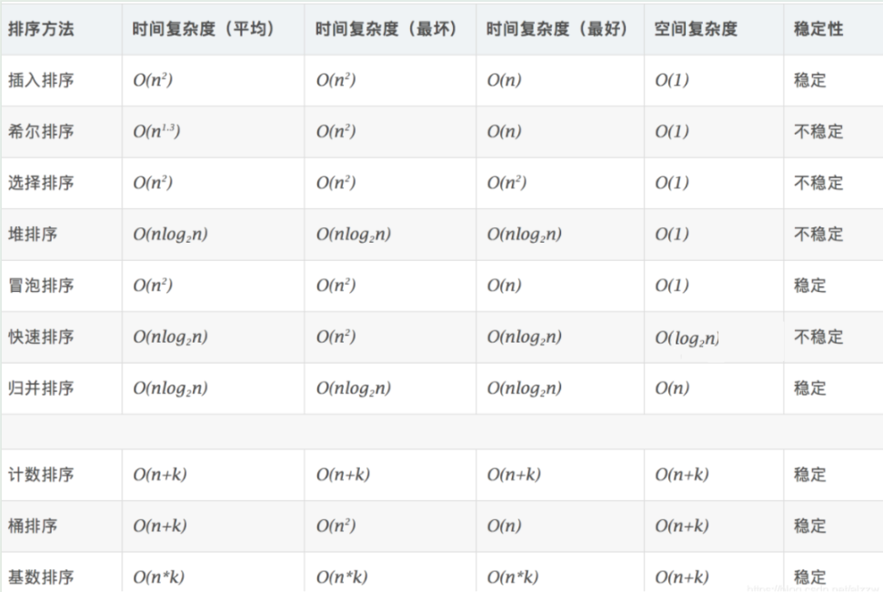


#### 1) 冒泡排序

```java
public static void bubbleSort(int []array){
    for (int i = 0; i < array.length - 1; i++) {
        for (int j = 0; j < array.length - i - 1; j++) {
            if(array[j] < array[j+1]){
                int temp = array[j];
                array[j] = array[j+1];
                array[j+1] = temp;
            }
        }
    }
}
```


#### 2) 快速排序

```java
public static void quickSort(int []array, int low, int high){
    if(low >= high){
        return;
    }
    int left = low, right = high;
    int key = array[left];
    while(left != right){
        while(key <= array[right] && left < right){
            right--;
        }
        while(key >= array[left] && left < right){
            left++;
        }
        if(right > left){
            int temp = array[left];
            array[left] = array[right];
            array[right] = temp;
        }
    }
    quickSort(array, low, left - 1);
    quickSort(array, left + 1, high);
}
```


#### 3) 插入排序

```java
public static void insertSort(int []array) {
    for (int i = 1; i < array.length; i++) {
        int key = array[i];
        //已排序元素下标
        int index = i - 1;
        //当前元素大于插入位置元素时, 整体后移直到找到小于插入位置元素的下标进行插入
        while(index >= 0 && array[index] > key){
            array[index + 1] = array[index];
            index--;
        }
        //插入元素
        array[index + 1] = key;
    }
}
```


#### 4) 选择排序

`选择最小的插入到前面, 维护有序和无序数组`

```java
import javax.swing.tree.TreeNode;
import java.util.*;

public class Main {
    public static void selectionSort(int []arr){
        for(int i = 0;i < arr.length; i++){
            int index = i;
            for(int j = i+1; j< arr.length; j++){
                if(arr[index] > arr[j]){
                    index = j;
                }
            }
            //swap
            if(index != i){
                int temp = arr[i];
                arr[i] = arr[index];
                arr[index] = temp;
            }
        }
        for(int i = 0; i < arr.length; i++){
            System.out.print(" " + arr[i]);
        }
    }


    public static void main(String args[]){
        selectionSort(new int[] {
            1,2,3,6,2,5,6,8,3,4,9,1
        });
    }

}
```


### 5 多线程

#### 1) 奇偶线程

`synchronized`

```java
import java.util.*;

public class Main {
    private static int count = 0;
    private static final Object object = new Object();

    public static void main(String[] args) {
        new Thread(new printer(), "偶数线程，").start();
        new Thread(new printer(), "奇数线程，").start();
    }

    static class printer implements Runnable {
        @Override
        public void run() {
            while (count <= 100) {
                synchronized (object) {
                    // 打印数字，并立即释放锁
                    System.out.println(Thread.currentThread().getName() + "打印:" + count++);
                    object.notify();
                    // 此处判断，是为了打印完了100个数字后，程序能够正常结束，否则程序将一直等待下去，耗费系统资源。
                    if (count <= 100) {
                        try {
                            object.wait();
                        } catch (InterruptedException e) {
                            e.printStackTrace();
                        }
                    }
                }
            }
        }
    }
}
```

`volatile + yield() 礼让`

```java
import java.util.*;

class OddEven {
    int n;
    volatile boolean flag = true;// flag为true则打印奇数，否则打印偶数

    public OddEven(int n) {
        this.n = n;
    }

    public void printOdd() {
        for (int i = 1; i <= n; i = i + 2) {
            while (!flag) {// 注意此判断在for循环里面，因为每次输出都要判断是否是该本线程输出
                Thread.yield();
            }

            System.out.println(i);
            flag = false;
        }
    }

    public void printEven() {
        for (int i = 2; i <= n; i = i + 2) {
            while (flag) {
                Thread.yield();
            }

            System.out.println(i);
            flag = true;
        }
    }
}

public class Main {
    public static void main(String args[]) {
        int n = 100;
        OddEven eddEven = new OddEven(n);

        Thread threadA = new Thread(new Runnable() {
            @Override
            public void run() {
                eddEven.printEven();
            }
        });

        Thread threadB = new Thread(new Runnable() {
            @Override
            public void run() {
                eddEven.printOdd();
            }
        });

        threadA.start();
        threadB.start();
    }
}
```

`ThreadLocal`


## 常见场景题

### 1 一亿个数找 top N

**方案**

- **全部排序** 

  *Hash 去重复 + 全部排序*

  缺点: 内存占用高 时间开销高 无用功

- **局部淘汰法**

  *Hash 去重复 + 局部淘汰*

  `数组`

  保存前N个数并得出最小数, 取最小数与后续数字比较如果小于后续数字则插入, 维护N大的容器。  $O(n+m^2) \ \ m为容器大小$

  `最小堆`

  读入N个数字构建最小堆, 遍历后续数字, 维护最小堆     $时间复杂度为O（nmlogm），空间复杂度是10000（常数）$

- **分治法**

  *Hash 去重复 + 分治*

  数据划分为M份, 在M份中找出最大的N个数字, 最后从M*N个数字里面找最大的N个数字


## 其它

### 1 MyBatis plus 和 MyBatis 的区别

`简化的 CRUD 方法` `内置代码生成器` `分页插件` 

`条件构造器` 可以通过链式调用的方式来构建复杂的查询条件，包括等于、不等于、大于、小于、模糊查询等。这样可以在代码中更加直观地组装查询条件，避免手动拼接 SQL 语句。


### 2 分布式事务

分布式事务是指涉及多个独立系统或服务的事务操作。 在分布式系统上一次大的操作由不同的小操作组成，这些小的操作分布在不同的服务节点上，且属于不同的应用，分布式事务需要保证这些小操作要么全部成功，要么全部失败。 eg: 用户下单, 订单表创建, 库存表库存--, 需要保证两步操作一定同时操作成功或失败，否则业务就会出现问题。

分布式事务有何需要满足 ACID 特性, 只是将多个执行单位看做一个整体, 在这个整体中实现该特性。

- **CAP** 

  WEB 服务无法同时满足一下3个属性, 一个分布式系统最多只能满足 CAP 中的2项

  - 一致性(Consistency) ： 客户端知道一系列的操作都会同时发生(生效)。更新操作成功并返回客户端完成后，所有节点在同一时间的数据完全一致，不能存在中间状态。
  - 可用性(Availability) ： 每个操作都必须以可预期的响应结束。系统提供的服务必须一直处于可用的状态，对于用户的每一个操作请求总是能够在有限的时间内返回结果。
  - 分区容错性(Partition tolerance) ： 即使出现单个组件无法可用，操作依然可以完成。分布式系统在遇到任何网络分区故障时，仍然需要能够保证对外提供满足一致性和可用性的服务，除非是整个网络环境都发生了故障。

- 保证一致性

  `2PC`  两阶段提交(准备阶段/提交-回滚阶段) - A 发起事务执行通知请求要参与的事务 - 是否准备好(取消/执行), 事务准备完毕后提交/回滚。

  `3PC`  *询问* *准备* *提交*    询问是否都准备好, 准备所需的资源(超时则取消事务), 提交/回滚事务 

  `消息队列`  将事务操作转化为消息发送和消费的过程。 (消息队列保证)

  `TCC`   *Try - Confirm - Cancel*   资源的预留和锁定 - 确认操作(提交成功与否) - 撤销操作(回滚) 

  `本地消息表`   存储各系统本地的事务, 根据执行情况选择执行方案


### 3 Linux 常用命令

```cmd
ls：列出目录中的文件和子目录。
cd：切换目录。
pwd：显示当前工作目录的路径。
mkdir：创建一个新目录。
rm：删除文件或目录。
cp：复制文件或目录。
mv：移动文件或目录，或者重命名文件或目录。
cat：显示文件内容。
grep：在文件中搜索指定的模式。
find：在文件系统中搜索文件。
ps：显示当前运行的进程。
top：实时显示系统的资源使用情况和进程状态。
kill：发送信号给进程以终止它。
chmod：修改文件或目录的权限。
chown：修改文件或目录的所有者。
tar：打包和解包文件。
ssh：通过安全的Shell连接到远程服务器。
```


### 4 Docker 如何实现不同容器之间的隔离

- `命名空间`

  调用Linux内核的方法，实现各种资源的隔离

  Docker 使用 Linux 命名空间来隔离不同的系统资源，例如进程、网络、文件系统等。每个容器都有自己的命名空间，使得容器中的进程只能看到自己的资源，无法感知其他容器的存在。

  *隔离文件系统、网络、进程通信、用户组*

- `Cgroups`

  Cgroups是Linux内核提供的资源限制和隔离的机制，全称：Control groups。调用 cgroups 的接口实现了**不同容器对物理资源的控制**, 如: CPU、内存、进程设备访问、网络等


### 5 Tomcat 如何实现不同项目的隔离

`每个项目都会打包成独立的war包, 运行使用独立的类加载器加载(独立的文件夹), 项目所需依赖放在各自的目录下 `   *不同类加载器* *不同依赖目录* *不同war包*

1. 使用独立的Web应用程序（WAR）：每个项目应该被打包为独立的WAR文件。每个WAR文件包含了项目所需的所有资源，包括依赖的JAR文件。将每个项目的WAR文件放置在Tomcat的`webapps`目录中。
2. 使用独立的类加载器：在Tomcat的`conf/Catalina/[host]`目录下，为每个项目创建一个单独的文件夹（例如，`conf/Catalina/localhost/app1`和`conf/Catalina/localhost/app2`）。在每个项目的文件夹中，创建一个`context.xml`文件，并在其中指定项目的独立类加载器。
3. 避免类库冲突：确保每个项目使用自己的依赖库，不与其他项目共享。将项目所需的JAR文件放置在各自项目的`WEB-INF/lib`目录下，而不是放置在Tomcat的共享库中。如果有共享的依赖库，可以将其放置在Tomcat的`lib`目录下，以供所有项目使用。


## 前端知识

### 1 VUE

#### 1) 环境搭建与启动

- `安装 node.js`  node -v 检查版本 (可以切换镜像, 提高下载速度)
- `安装 vue-cli 脚手架`  与node版本有所关联  vue-version 检查版本
- `vue create project-name` 创建 vue 工程
- `选择相关配置  编译器、检查器、路由、代码检查等`
- `npm run serve`  运行vue工程   通过 npm run 检查可运行的项目 *注意: 这里需要切换到vue项目根目录才可运行, 否则找不到*

router  路由


#### 2) 跨域请求

- `不同域名之间的请求`： 从 example.com 的页面向 api.test.net 发起请求。

- `不同子域之间的请求`： 从 [www.example.com](http://www.example.com/) 的页面向 api.example.com 发起请求。

- `不同端口号之间的请求`： 从 example.com:3000 的页面向 example.com:8080 发起请求。

- `不同协议之间的请求`： 从 [https://example.com](https://example.com/) 的页面向 [http://example.com](http://example.com/) 

- axios | Proxy 代理(Vue 跨域请求处理)


#### 3) RESTful API

> REST（Representational State Transfer）是一种设计和构建网络应用程序的软件架构风格。它是一种基于 HTTP 协议的通信方式，通过使用统一的接口和资源标识符（URI）来进行通信。REST API（RESTful API）是基于 REST 架构风格设计的应用程序接口。它通过 HTTP 协议定义了一组操作，允许客户端通过发送 HTTP 请求与服务器进行交互，并进行资源的创建、读取、更新和删除（CRUD）操作。

以下是 REST API 的一些关键概念和特点：

1. 资源（Resources）：在 REST 中，每个数据实体都被视为一个资源，通过 URI 进行唯一标识。资源可以是任何事物，如用户、订单、文章等。
2. 统一的接口（Uniform Interface）：REST API 使用统一的接口来进行通信，包括使用 HTTP 方法（GET、POST、PUT、DELETE 等）对资源进行操作，以及使用 URI 标识资源。
3. 状态无关（Stateless）：服务器不会保存客户端的状态信息，每个请求都是独立的，并不依赖于之前的请求。客户端的每个请求都需要提供足够的信息来进行处理。
4. 资源的表征（Representation）：资源的表征指的是以某种格式（如 JSON、XML）表示资源的数据。客户端和服务器之间通过资源的表征进行交互和传输。
5. 按需加载（Cacheable）：REST API 支持缓存，服务器可以在响应中设置缓存头信息，使得客户端可以缓存响应结果，提高性能和减轻服务器负载。

REST API 在 Web 开发和移动应用程序开发中得到了广泛应用。它具有简洁、灵活、可扩展的特点，使得不同平台的应用程序可以通过使用统一的接口进行通信。开发人员可以使用各种编程语言和框架来构建 REST API，如 Node.js、Python、Java、Ruby 等，并使用工具和库来简化开发过程，如 Express、Django、Spring Boot 等。通过使用 REST API，应用程序可以实现前后端分离、微服务架构、跨平台通信等目标，提供灵活、可伸缩和可维护的解决方案。同时，REST API 的设计也需要考虑安全性、性能优化、版本控制等方面的问题，以确保应用程序的稳定性和可靠性。


### 2 JavaScript

> 概念: 一种高级、动态、弱类型的编程语言，常用于在网页中实现交互效果、处理数据、控制页面行为等。它是一种脚本语言，可以直接嵌入到 HTML 页面中，由浏览器解析和执行。 `解释语言`

#### 1) 概念 | 特点

**概念**

1. 弱类型语言：JavaScript 是一种弱类型语言，不需要显式声明变量的类型，可以在运行时自动进行类型转换。
2. 动态脚本语言：JavaScript 是一种脚本语言，可以直接嵌入到 HTML 页面中，在浏览器中解析和执行。
3. 客户端脚本语言：JavaScript 在浏览器中执行，用于实现网页的交互效果和动态行为。
4. 事件驱动：JavaScript 基于事件和回调机制，可以响应用户的交互操作，如点击按钮、提交表单等。
5. 原型继承：JavaScript 使用原型继承来实现对象之间的继承关系，通过原型链进行属性和方法的继承。

**特点**

1. 跨平台性：JavaScript 可以在几乎所有现代浏览器中运行，并且可以在服务器端使用 Node.js 运行，实现前后端一致性。
2. 动态性：JavaScript 允许在运行时修改和添加对象的属性和方法，以及动态生成 HTML 内容，实现页面的动态更新。
3. 客户端交互：JavaScript 可以处理用户的交互行为，如表单验证、按钮点击事件、页面元素的显示和隐藏等，实现交互性和动态效果。
4. 异步通信：JavaScript 支持使用 Ajax 技术进行与服务器的异步通信，实现无需刷新页面的数据交换和更新。
5. 大量的库和框架：JavaScript 生态系统非常丰富，有大量的开源库和框架可供选择，如 React、Vue.js、Angular 等，加速了开发过程并提供了更多的功能扩展。


#### 2) 数据类型

1. 基本数据类型（Primitive Types）：包括字符串（String）、数字（Number）、布尔值（Boolean）、空值（Null）和未定义（Undefined）。
2. 对象类型（Object Types）：包括对象（Object）、数组（Array）、函数（Function）和日期（Date）等。
3. 引用类型（Reference Types）：包括对象、数组和函数等，它们在内存中以引用的方式存储和访问。  `typeof `


#### 3) 闭包

闭包（Closure）是指在函数内部创建并返回一个内部函数，并且该内部函数可以访问其外部函数的变量和作用域。闭包可以捕获外部函数的变量，并且在外部函数执行完毕后仍然可以访问和操作这些变量。闭包常用于创建私有变量、实现函数柯里化、延迟函数执行等场景。


#### 4) 原型链 | 继承

原型链（Prototype Chain）是 JavaScript 中实现继承的机制。每个对象都有一个内部属性 [[Prototype]]，当访问对象的属性时，如果该对象本身没有该属性，那么会通过原型链向上查找，直到找到该属性或到达原型链的末尾（null）。

**继承方法**

- 原型链

  可以通过将子类的原型对象指向父类的实例来实现原型链继承

  ```javascript
  function Parent() {
    this.name = 'Parent';
  }
  
  function Child() {
    this.name = 'Child';
  }
  
  Child.prototype = new Parent();
  
  var child = new Child();
  console.log(child.name); // 输出 "Child"
  ```


#### 5) 冒泡

事件冒泡（Event Bubbling）是指当一个元素上的事件被触发时，事件会从该元素开始向祖先元素逐级传播，直到达到文档对象。事件冒泡的默认行为使得可以在祖先元素上捕获和处理事件。

事件捕获（Event Capturing）是指当一个元素上的事件被触发时，事件会从文档对象开始向下传播，直到达到触发事件的元素。事件捕获阶段可以用于在事件到达目标元素之前捕获事件并进行处理。要阻止事件冒泡，可以使用 `event.stopPropagation()` 方法。例如：

```javascript
element.addEventListener('click', function(event) {
  event.stopPropagation();
});
```


#### 6) 同步异步

同步（Synchronous）和异步（Asynchronous）是指代码执行的方式。

同步代码按照程序的顺序一步一步执行，每个代码块完成后再执行下一个代码块。

异步代码不会阻塞后续代码的执行，而是在某个事件触发或者条件满足时执行。JavaScript 中处理异步操作的常用方式包括回调函数、Promise 和 async/await 等。


#### 7) 异常处理

处理 JavaScript 中的异常和错误可以使用 try-catch-finally 语句块。try 代码块用于包裹可能发生错误的代码，catch 代码块用于捕获和处理异常，finally 代码块用于执行无论是否发生异常都需要执行的代码。例如：

```javascript
try {
  // 可能发生错误的代码
} catch (error) {
  // 处理异常的代码
} finally {
  // 无论是否发生异常都会执行的代码
}
```


#### 8) AJAX

AJAX（Asynchronous JavaScript and XML）是一种通过 JavaScript 在后台与服务器进行数据交换的技术。它允许在不刷新整个页面的情况下，通过异步方式加载和发送数据。要使用 JavaScript 发起 AJAX 请求，可以使用原生的 XMLHttpRequest 对象或者使用现代的 fetch API 或 axios 等第三方库。以下是使用原生 XMLHttpRequest 对象发起 AJAX 请求的示例：

```javascript
var xhr = new XMLHttpRequest();
xhr.open('GET', 'https://api.example.com/data', true);

xhr.onreadystatechange = function() {
  if (xhr.readyState === 4 && xhr.status === 200) {
    var response = JSON.parse(xhr.responseText);
    // 处理响应数据
  }
};
xhr.send();
```


#### 9) 跨域请求

处理 JavaScript 中的跨域请求可以通过

1. 设置服务器端的 CORS（跨域资源共享）头部信息来允许跨域请求
2. 使用代理服务器进行请求转发。
3. 使用 JSONP（JSON with Padding）技术来绕过跨域限制。**原理**是通过在页面中动态创建一个 `<script>` 标签，将请求的 URL 设置为目标数据的地址，并指定一个回调函数作为查询参数传递给服务器。服务器在返回数据时，将数据作为参数传递给回调函数，并在页面中执行该回调函数，以便在页面中获取数据。JSONP 只支持 GET 请求，并且需要服务器端进行特殊的处理，以便将数据包装在回调函数中返回给客户端。此外，JSONP 也存在一些安全性和可靠性的问题，因为它需要明文传递回调函数的名称，存在被恶意利用的风险。
4. `$.ajax` 请求是基于 jQuery 的 AJAX 方法。它是 jQuery 提供的一种简化的方式来发起 AJAX 请求，并提供了丰富的配置选项和回调函数。


### 3 Nodejs

> 概念: 可以快速构建网络服务及应用的平台，是用Javascript语言构建的服务平台，**可用于后端建立服务器**。Chrome JavaScript 运行时建立的平台，它是对 Google V8 引擎进行了封装的运行环境。  `运行在服务端的 JavaScript`

#### 1) 特点与应用

1. `异步非阻塞 I/O`：Node.js 采用事件驱动和非阻塞 I/O 模型，使得它能够高效处理大量并发请求。这使得 Node.js 特别适合构建实时应用、聊天应用、游戏服务器等需要处理大量并发连接的场景。
2. `单线程和事件循环`：Node.js 采用单线程模型，并通过事件循环机制实现异步操作。这使得开发人员能够编写高效且可扩展的代码，而不必担心传统多线程编程中的锁和线程同步问题。
3. `跨平台`：Node.js 可以在多个操作系统上运行，包括 Windows、macOS 和 Linux。这使得开发人员能够使用相同的代码在不同的平台上构建应用程序。
4. `快速构建原型`：Node.js 提供了一系列丰富的内置模块和第三方模块，使得开发人员可以快速构建原型和快速开发应用。同时，Node.js 生态系统非常活跃，有大量的第三方库和工具可供选择。
5. `前后端一致性`：由于 Node.js 使用 JavaScript 作为开发语言，前端开发人员可以直接在后端使用相同的语言和技术栈进行开发，这简化了全栈开发过程，并促进了前后端之间的协作。

**应用场景**

`撘服务器处理请求`  `后端开发` `包管理工具 npm` 

1. `服务器端应用程序`：Node.js 可以用于构建各种类型的服务器端应用程序，包括 Web 应用程序、RESTful API、实时通信应用程序等。
2. `前端构建工具`：Node.js 提供了许多工具和模块，如包管理器 npm，使得前端开发人员能够更好地管理和构建前端项目。
3. `命令行工具`：Node.js 提供了一些内置模块，使得开发人员可以编写命令行工具，用于自动化任务、脚本编写等。
4. `实时应用程序`：由于 Node.js 的事件驱动和非阻塞模型，它特别适合构建实时应用程序，如聊天应用、实时协作工具、游戏服务器等。
5. `微服务架构`：Node.js 的轻量级和高性能特性使其成为构建微服务架构的理想选择。它可以与其他服务进行通信，并处理并发请求。


#### 2) nodejs 和 java 区别

- **Node.js比Java更快**

  node.js 开发快，运行的效率也算比较高，但是如果项目大了就容易乱，而且javascript不是静态类型的语言，要到运行时才知道类型错误，所以写的多了之后免不了会出现光知道有错但是找不到哪儿错的情况，所以测试就得些的更好更详细。

  java开发慢，但是如果项目大、复杂的话，用java就不容易乱，管理起来比node.js省。

- Node.js 前后端都采用 Javascript，代表未来发展的趋势，而 java 则是现在的最流行的服务器端编程语言。

- Node.js 由 C/C++ 编写的基于 Chrome V8 引擎的 JavaScript `运行环境`; Java EE 是 `编译语言`

- Java 严格来说是一种与浏览器无关的服务器端语言，而 Node JS 可以在客户端和服务器端有效地使用。nodejs 前后端都用的是 `javascript`, 更方便。


