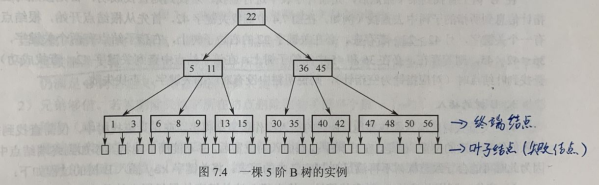
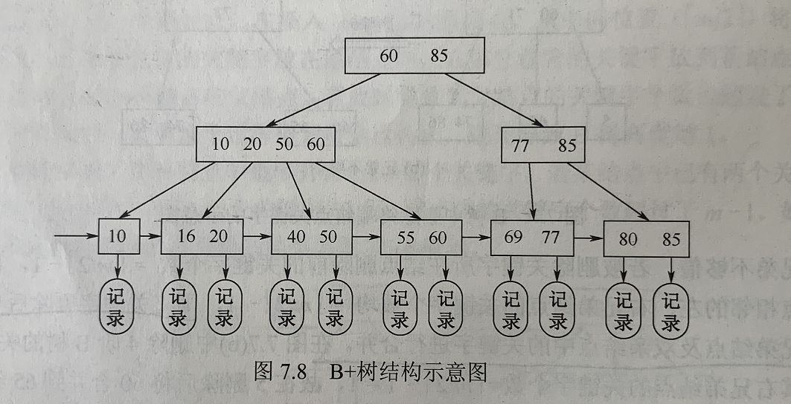
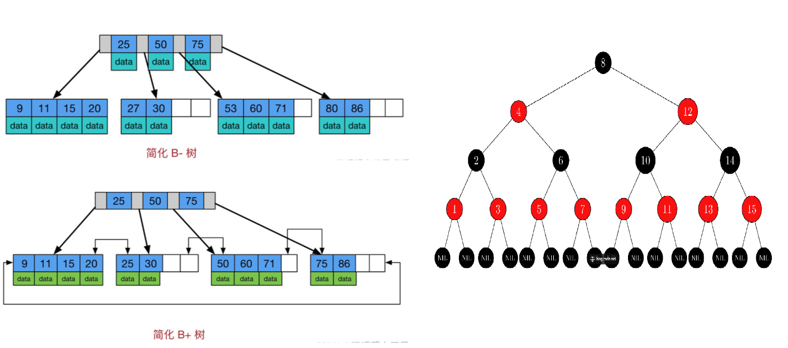

## Java 面试题一

### 1 请你说说Java的特点和优点, 为什么要选择Java？

Java 语言的特点: 一次编译, 到处运行, 即平台无关性, 是一种纯面向对象的语言。

优点: 内置的很多库函数简化了开发人员的设计工作; 具有较高的安全性和健壮性; 有较好的生态支持; 开发人员不需要对内存使用进行管理。

选择 Java 的原因: 使用范围很广, 包括 - web、大数据、安卓等, 生态与 API 支持很完备。

   

### 2 请你说说 Java 基本数据类型和引用类型

Java 语言提供了8种基本类型: byte 8、short 16、int 32、long 64、float 32、double 64、char 16、boolean (不同JVM大小不同), 这些基本数据类型有对应的封装类; 这些基本数据类型在声明之后就会立刻在栈上被分配内存空间。其他数据类型如: 数组、类、接口、String 等在生命时不会被立即分配内存, 知识存储了内存地址。

### 4 请你说一下 final 关键字

final 可以修饰类、方法、变量; final 修饰类, 该类不可被继承; final 修饰方法, 该方法不能被重写; final 修饰变量, 基本类型值不可改变, 引用类型值可变地址不可变; 

### 5 说说 static 修饰符的用法

Java类中包含: 成员变量、方法、构造器、初始化块和内部类（包括接口、枚举）5种成员。

`static` 关键字可以修饰除了构造器外的其他4种成员。

静态方法只能访问用 `static` 修饰的成员 

1. 修饰方法与成员变量  

   static修饰的变量是存储于方法区的, 表示类方法或者类成员变量，是所有对象所共享的。可以通过类名调用，也可以通过实例对象调用。 

2. 静态代码块:

   当类被加载时，静态代码块会执行一次，因为一个类只加载一次，所以静态代码块只执行一次。通常使用静态代码块对类的成员变量进行初始化。 

3. 修饰内部类 

   可以在不创建外部类对象的情况下被实例化。

### 6 请你说说 String 类, 以及使用 new 和 字符串常量 创建 String 的区别

String 类由 `final` 修饰, 所以它不可被继承。使用 String直接量方式赋值时, 字符串被保存到常量池; 使用 `new` 关键字创建字符串时, 会先使用常量池管理字符串直接量, 然后新创建一个 String 对象放在堆中, 比较耗内存。

### 7 String、StringBuffer、Stringbuilder有什么区别

Java 提供了 String、StringBuffer 两个类和大量的方法来封装字符串。String 被创建后不可变、效率低, 但复用率高; StringBuffer 创建后可变、效率高, 线程安全; StringBuilder 也可变、效率最高, 但线程不安全; 因此,如果是在单线程下操作大量数据,应优先使用 StringBuilder类；如果是在多线程下操作大量数据,应优先使用 StringBuffer 类。

### 8 请你说说 == 与 equals() 的区别

`==` 比较基本类型时比较值是否相等, 引用类型则比较地址是否相等; `equals()` 没有重写之前与 `==` 一致, 重写后可使用 按值比较。

### 9 请你说说 hashCode() 和 equals() 的区别,为什么重写 equals() 就要重写 hashCode()

`hashCode` 用于获取哈希值, `equals()` 用于比较对象是否相等; 如果两个对象相等, 它们必须有相同的哈希码；若两个对象的哈希码相同,他们却不一定相等。也就是说, equals() 比较两个对象相等时 hashCode() 一定相等, hashCode() 相等的两个对象 equqls() 不一定相等; 由于hashCode() 与 equals() 具有联动关系, equals() 重写时, hashCode() 进行重写, 使得这两个方法始终满足相关的约定。

### 10 请你讲一下Java 8的新特性

**Lambda 表达式** − Lambda 允许把函数作为一个方法的参数（函数作为参数传递到方法中）。   

**方法引用** − 方法引用提供了非常有用的语法，可以直接引用已有Java类或对象（实例）的方法或构造器。与lambda联合使用，方法引用可以使语言的构造更紧凑简洁，减少冗余代码。   

**对接口进行了改进**：允许在接口中定义默认方法,默认方法必须使用default修饰。  

**新工具** − 新的编译工具，如：Nashorn引擎 jjs、 类依赖分析器jdeps。   

**Stream API** −新添加的Stream API（java.util.stream） 把真正的函数式编程风格引入到Java中。   

**Date Time API** − 加强对日期与时间的处理。   

**Optional 类** − Optional 类已经成为 Java 8 类库的一部分，用来解决空指针异常。   

**Nashorn, JavaScript 引擎** − Java 8提供了一个新的Nashorn javascript引擎，它允许我们在JVM上运行特定的javascript应用。

### 11 介绍一下包装类的自动拆装箱与自动装箱

自动装箱和拆箱时 JDK 1.5 提供的功能; 自动装箱: 将基本类型赋值给对应的包装类型。 自动拆箱: 将包装类型对象赋值给基本类型。通过自动装箱、自动拆箱功能,简化基本类型变量和包装类对象之间的转换过程。

| 基本数据类型 | 对应包装类 |
| ------------ | ---------- |
| byte         | Byte       |
| short        | Short      |
| int          | Integer    |
| long         | Long       |
| float        | Float      |
| double       | Double     |
| char         | Character  |
| boolean      | Boolean    |

### 12 请你说说Java的异常处理机制

*try中写业务代码，catch用于捕获并处理某个异常，finally用于回收资源, throw主动抛出异常*

1. 异常处理机制让程序具有容错性和健壮性, 程序运行出现状况时,系统会生成一个Exception对象来通知程序 
2. 处理异常的语句由try、catch、finally三部分组成。try块用于包裹业务代码,catch块用于捕获并处理某个类型的异常,finally块则用于回收资源。 
3. 如果业务代码发生异常,系统创建一个异常对象, 并将其提交给JVM, 由JVM寻找可以处理这个异常的 catch 块,并将异常对象交给这个catch块处理。如果JVM没有找到，运行环境终止, Java程序退出。 
4. Java也允许程序主动抛出异常。当业务代码中,判断某项错误的条件成立时,可以使用throw关键字向外抛出异常。

### 13 说说你对面向对象的理解

面向对象有三大基础特征: 封装、继承、多态。封装: 将对象的状态信息隐藏起来, 不允许外界直接访问, 只能通过暴露的接口进行操作访问, 提高代码可维护性; 继承: 实现代码复用的手段, 能够通过 extends 关键字继承父类的属性和方法; 多态: 依赖于继承, 子类可以选择重写父类方法, 也可选择直接调用父类方法实现功能的复用与拓展。

### 16 请你说说泛型、泛型擦除

JDK1.5 之后引入泛型, 泛型可以为类型指定参数, 减少了插入对象的类型出错问题, 所有强制转换都是自动且隐藏的提高了代码的复用率。泛型擦除: Java 的泛型是伪泛型, 因此编译器在编译期间需要在进行擦除, 然后进行类型转换。

### 17 请说说你对反射的了解

反射就是在程序运行期间动态获取对象属性和方法的功能, 其使用基于class对象来处理, 它能够在程序运行期间直接获取任意类的方法和属性, 大大提高了代码的可扩展性, 但是同时破坏了 JAVA 的特性, 会引起一系列的安全问题, 同时降低程序的新梗。

### 18 请你说说多线程

进程是操作系统资源调度的最小单位, 线程是处理器任务调度和执行的基本单位, 一个进程可以创建多个线程。多个线程之间共享程序的内存空间和系统资源, 但都有自己的独立栈空间。多线程可以减小程序的响应时间,提高CPU利用率,创建和切换开销小,数据共享效率高,简化程序结构。

### 19 线程的创建方式

- 继承 Thread 类, 重写 Run() 方法
- 实现 Runnable() 接口, 实现接口的 run() 方法
- 实现 Callable() 接口, 重写 call() 方法;  前两种方式线程执行完后都没有返回值，最后一种带返回值；
- 使用线程池

### 20 说说进程和线程的状态

- 进程的状态: 创建、就绪、运行、阻塞、销毁。 new 一个线程时为创建状态, 执行 start() 方法后为就绪状态, 当线程获取CPU资源后执行 run() 进入运行状态, 调用 sleep() 进入阻塞状态, 进程执行完或抛出异常进入销毁状态。

- 线程的状态: Java线程一共有6种状态。`NEW` 初始状态，还没调用 start 方法。`Runnable` 运行状态，线程正在JVM中执行，也可能在等待操作系统的调度。 `BLOCKED`：阻塞状态，线程正在等待获取监视器锁。 `WAITING`: 等待状态，线程正在等待其他线程的通知或中断。`TIMED_WAITING`: 超时等待状态，在WAITING的基础上增加了超时时间，即超出时间自动返回。 `TERMINATED`：终止状态，线程已执行完毕。 

### 21 说说wait()和sleep()的区别

所属类型不同: wait() 为Object类的实例方法, 调用后进入WAITING状态; sleep() 属于 Thread 类的静态方法, 调用后进入 TIMED_WAITING 状态。

锁依赖不同: wait() 依赖于 synchronized 锁, 调用后线程会释放锁; sleep() 不依赖锁, 也不会释放锁。

返回条件不同: wait() 进入等待状态, 使用 notify() | notifyAll() 唤醒; sleep() 进入超时等待, 需要超时后自动返回。

### 22 如何保证线程安全

三种方案: 原子类、volatile、锁

- 原子类: 遵循 CAS - `比较和替换` 原则, 如果要更新的旧值与线程传入的旧值不一样, 则认为被其他线程修改, 修改不生效。

- volatile 关键字: 轻量级的 sychronized, 在多处理器开发中保证共享变量的可见性, 从而保证单个变量读写的线程安全。

  volatile 禁止指令重排序(添加屏障)

  写操作加的屏障是阻止上方其它写操作越过屏障排到volatile变量写之下
  读操作加的屏障是阻止下方其它读操作越过屏障排到volatile变量读之上

- sychronized 关键字: synchronized + juc 包下的 lock 锁。支持响应中断、支持超时机制、支持以非阻塞的方式获取锁、支持多个条件变量

### 23 说说你了解的线程同步方式

Java 通过加锁实现线程同步: synchronized 和 Lock。 synchronized 加在普通方法上, 锁当前实例;加在静态方法, 锁当前类的从class对象;加在代码块上, 则需要在关键字后面的小括号里,显式指定一个对象作为锁对象。 Lock 支持响应中断、支持超时机制、支持以非阻塞的方式获取锁、支持多个条件变量（阻塞队列）。

### 24 说说你了解的线程通信方式

线程通信: monitor 与 condition。 Synchronized 采用 monitor 的通信方式, 线程通过 monitor 调用 wait() 进入等待, 调用 notify() | notifyAll() 唤醒进程。 Lock 采用 condition 通信, 使用 await() 进入等待, 使用 signal()|signalAll() 唤醒线程。

### 28 说说你对线程池的理解

线程池：主要起到管理线程作用, 可以有效的管理线程: 线程数量、线程复用。线程池的好处：1.更方便管理线程 2.可以减少因频繁创建线程和销毁线程带来的内存消耗，提高程序的运行效率。  1）它可以管理线程的数量，可以避免无节制的创建线程，导致超出系统负荷直至奔溃。2）它还可以让线程复用，可以大大地减少创建和销毁线程所带来的开销。

### 30 说说你对 ThreadLocal 的理解

ThreadLoical 也即线程变量, 它用于实现线程隔离和线程内的资源共享, 每一个变量都存在一个 `ThreadLocalMap` 对象用以存储资源对象, 它用于通过 get()|set() 方法存取共享变量。在线程池的使用场景下需要手动 Remove 线程变量, 因为线程在线程池中未被销毁, 其他场景下会被 GC 自动回回收。

### 31 JUC | CAS | AQS

`JUC(java.util.concurrent)` 包含多个支持并发操作的工具, 是Java支持并发操作的核心, 包括线程操作、线程池、并发容器、原子操作的具体实现。

原子类: 遵循 CAS(比较和替换)原则, 可用于解决单个变量的线程安全问题。

锁: 在包含 Synchronized 所有功能基础上, 支持超时和响应中断机制, 主要解决多个变量的线程安全问题。

线程池: 可以方便的管理线程, 避免重复开关线程导致的消耗。

并发容器: 例如ConcurrentHashMap，支持多线程操作的并发集合，效率更快。 

`CAS(Compare And Swap - 比较和替换)`

- CAS的全称是 Compare-and-Swap，也就是比较并交换，是并发编程中一种常用的算法。

  它包含了三个参数：V，A，B。其中，V表示要读写的内存位置，A表示旧的预期值，B表示新值。

  `CAS` 的核心思想是：在执行操作之前，先比较当前内存中的值是否等于期望值，如果相等，则执行修改操作；如果不相等，则不执行修改操作，继续进行比较，直到内存中的值与期望值相等为止。这个过程中不会出现线程的阻塞和唤醒，因此可以提高系统的并发性能。 CAS 操作需要输人两个数值，一个旧值(期望操作前的值)和一个新值，在操作期间先比较旧值有没有发生变化，如果没有发生变化，才交换成新值，发生了变化则不交换。

`AQS (AbstractQueuedSynchronizer - 队列同步器)`

- 用来构建锁和同步器的框架, 用于实现锁和其他同步组件和维护共享资源, 使用队列让线程进行排队的过程, Lock 基于其实现。
- AQS 的主要作用是提供了一个通用的同步框架，使得开发者可以基于它来实现各种锁和同步器，如 ReentrantLock、Semaphore、CountDownLatch 等。同时，AQS 也提供了一些钩子方法，允许开发者自定义同步状态和条件，以及自定义获取锁和释放锁的行为。
- AQS 的实现基于 Java 中的 CAS（Compare and Swap）操作和 volatile 变量，保证了线程安全性和高效性。在 AQS 中，锁的获取和释放操作一般都是通过自旋 CAS 操作进行的，这使得 AQS 的性能相对于传统的 synchronized 关键字有了很大的提升。
- AQS 内部定义 先进先出 队列实现线程同步, 同时定义同步状态记录锁信息。

### 32 Java 集合的了解, 哪些是线程安全的集合?

Java 集合主要由 Collection 和 Map 接口派生而来, Collection 派生出 List、Set、Queue, 所有的集合类都是 List, Set, Queue, Map 这四个接口的实现类。List 代表有序可重复的数据集合; Set 代表无序不可重复的数据集合; Queue 代表先进先出的数据集合; Map 代表具有映射关系的数据集合。其中常见的类包括: ArrayList、LinkedList、HashMap、TreeMap、TreeSet、ArrayQueue 等。

`线程安全的集合`

- java.util 包下的集合大都是非线程安全的, 如: ArrayList、HashMap等。但如 Vector、HashTable 都是线程安全的, 基于 Synchronized 实现, 性能较差。一般使用 concurrent 下的 syncheronizedXxx() 将非线程安全的方法包装为线程安全的方法。在Java5 之后可以使用 concurrent 提供的大量支持并发访问的集合类, 如: ConcurrentHashMap | CopyOnWriteArrayList 等。

### 33 HashMap 原理以及其和 HashTable 的区别?

- 底层

  - Beafor 1.8: 数组+链表
  - After 1.8: 数组+链表+红黑树

- PUT流程: 通过计算存入 KEY 的 Hash 值确定存入位置, 如果当前位置存在数据也即发生碰撞则通过链表接在一起, 当链表长度达到8时则转为红黑树存放, 以此提高查询效率。

- 扩容机制

  HashMap 数组初始容量为 16, 的那个达到默认装载因子 0.75 时会触发2倍扩容。

- HashMap 非线程安全, 建议在多线程并发下使用 ConcurrentHashMap

`区别`

- HashTable 线程安全, HashMap 非线程安全, 性能 HashMap 比较好
- HashTable 不允许 NULL 存入, HashMap 允许
- HashTable 数组+链表,HashMap 数组+链表/红黑树

### 34 HashMap 线程安全的吗？如果不是该如何解决？

- 使用 HashTable 效率低
- 使用 Collection 下的 synchronizedXX() 方法包装 HashMap
- 使用 ConcurrentHashMap 

### 35 ConcurrentHashMap

- `ConcurrentHashMap` 的底层数据结构与 HashMap 一样, 也是采用“数组+链表+红黑树 

- 采用锁定头节点的方式降低了锁粒度, 以较低的性能代价实现了线程安全。 

- 实现机制(*锁定头结点*)

  初始化数组或头节点时, ConcurrentHashMap并没有加锁, 而是以 CAS 的方式进行原子替换 

  插入数据时会进行加锁处理, 但锁定的不是整个数组, 而是槽中的头节点。所以, ConcurrentHashMap 中锁的粒度是槽, 而不是整个数组,并发的性能很好。

  扩容时会进行加锁处理, 锁定的仍然是头节点。并且, 支持多个线程同时对数组扩容, 提高并发能力。 

  在扩容的过程中,依然可以支持查找操作。

## Java 面试 二

### 1 请说说对 ArrayList 的理解?

ArrayList是一个有序可重复的容器, 底层由数组实现。 1.7时创建容器时会自动创建一个长度为10的对象数组, 1.8时不会立即创建数组, 而是在第一次执行 add() 方法时才创建长度为10的数组。默认情况下, ArrayList 扩容时会扩容为原来容量的1.5倍, 同时将原有的数据赋值到新数组中完成扩容。

### 2 ArrayList 和 LinkedList 的区别

- ArrayList 基于`数组`实现, `LinkedList` 基于 `双向链表` 实现
- ArrayList 查找速度快, 插入删除速度慢; LinkedList 查找速度慢, 插入删除速度快
- LinkedList 占用的内存更多

### 3 List 和 Set 的区别

- List 是有序可重复的集合, Set 数组则是无序不可重复的集合; List 可以通过索引访问指定位置元素且每个元素都有对应的顺序索引, 而 Set 则无法记录元素的添加顺序同时不允许元素重复。

### 4 BIO NIO AIO IO多路复用 JavaNIO

- BIO - Blocked IO(阻塞IO)。 当用户线程发送请求后会一直阻塞线程直到数据准备完毕。 `同步IO`

- NIO - Nonblocking IO(非阻塞IO)。用户进程发送请求后可做其他工作并不断访问内核数据, 但在数据复制阶段, 用户线程依旧阻塞。 `同步IO`

- AIO - Asynchronous IO(异步IO) 。当用户线程发送请求后, 内核返回回调函数, 该回调函数不包含数据, 用户线程可以处理其他操作, 当数据准备完成后内核将数据发送给用户线程, 而不像同步IO那样由用户线程自己读取。

- IO 多路复用: 单个线程同时处理多个客户端请求。基于 `select`、`poll`、`epoll`三个操作。`select`: 查询多少个文件描述符需要IO, 底层为数组, 因此文件描述符个数有上限。 `poll`: 与select基本一致, 底层为链表, 因此文件描述符个数没有上限。 `epoll`: 更高效, 使用红黑树+链表。

  `poll` 和 `select` 都为轮询方式, 区别在于 `poll` 使用了链表, 因此文件描述符没有上限; `epoll` 则采用回调方式, 它将文件描述符加入到红黑书中, 当每个IO就绪之后直接返回数据, 而不需要多次复制操作。

- Java NIO: 同步非阻塞IO, 

### 5 JVM 了解?

- JVM 是 Java 语言跨平台的关键, 它实现了其它语言不具备的自动内存管理和垃圾回收机制, 类似于一个虚构的计算机, 使得代码可以跨平台执行。

  主要由类加载子系统、执行引擎、运行时数据区。 

  类加载系统: 可以根据指定的全限定名来载入类和接口。

  执行引擎: 负责执行包含被载入类方法中的指令。 

  **运行时数据区**: 用于保存程序运行过程中产生的如字节码、对象、参数、返回值等变量信息(运行中产生的变量信息)。运行时数据区又可以被分为方法区、堆、虚拟机栈、本地方法栈、程序计数器等。

### 6 Java 内存模型 与 JVM 内存模型?

- Java 内存模型

  Java 内存模型是一种规范, 定义了Java程序中多线程并发访问共享内存时的行为和准则, 旨在提供一种统一的内存访问模型, 使得开发者能够编写正确、可靠而高效的多线程程序。

- JVM 内存模型

  指JVM对内存的组织和管理方式, JVM 内存模型定义了Java程序在运行时的内存结构, 包括堆、栈、方法区等。JVM内存模型规定了Java程序运行时的内存分配、使用和回收方式, 以及线程与内存的交互方式。

  主要由以下5个部分组成(运行时数据区):

  **堆**: 用于存储对象实例和数组, 是线程共享的内存区域。

  **栈**: 每个线程都有自己的栈, 用于存储方法调用、局部变量和操作数栈。

  **方法区**: 存储类的结构信息、静态变量、常量池等

  **程序计数器**: 记录当前线程执行的字节码指令地址

  **本地方法栈**: 用于执行本地方法的栈

- 特点

  - JVM 内存模型与硬件和操作系统的内存模型有一定的差异，JVM 可以在不同平台上实现统一的内存模型。
  - JVM 通过即时编译器（Just-in-Time Compiler，JIT）等技术进行代码优化和内存管理。
  - JVM 内存模型规定了对象的创建、访问、修改和销毁的方式，以及垃圾回收机制对内存的管理。

### 7 JVM 的垃圾回收机制

JVM 的垃圾回收机制是指JVM对不再使用的对象进行自动回收和内存释放的过程, 主要目标在于管理和优化内存使用, 避免内存泄漏。

主要包括4种收集方式:

- 新生代收集: 新生代垃圾收集
- 老年代垃圾收集: 老年代垃圾收集, 只有 CMS 收集器会收集。
- 混合收集: 整个新生代和部分老年代的垃圾收集, 只有 G1 收集器才有。
- 整堆收集: 整个堆和方法区的垃圾收集。

**垃圾回收算法**

JVM使用不同的垃圾回收算法来标记和回收垃圾对象。常见的垃圾回收算法包括：

- 标记-清除算法（Mark and Sweep）：标记所有活动对象，然后清除未标记的对象。	`优点：垃圾回收速度快。缺点：存在内存碎片`
- 复制算法（Copying）：将存活对象复制到一个新的空间，并清除旧空间中的所有对象。 `优点：没有内存碎片。缺点：内存开销大`
- 标记-整理算法（Mark and Compact）：标记活动对象，然后将它们向一端移动，然后清除其余空间。 `优点：没有内存碎片。缺点：整理速度慢`

**垃圾回收器**（Garbage Collector）：

垃圾回收器是JVM中负责执行垃圾回收的组件。JVM提供了不同类型的垃圾回收器，包括：

- Serial收集器：单线程收集器，适用于小型应用和简单的客户端应用。
- Parallel收集器：多线程收集器，适用于多核CPU上的应用，可以并行进行垃圾回收。
- **CMS（Concurrent Mark and Sweep）收集器**：并发标记和清除收集器，避免长时间的停顿时间。 `1.9 后停用`
  1. 初始标记: 对根节点与根节点有直接关系的对象进行可达性分析并标记。
  2. 并发标记: 根据根节点标记所有可达对象。
  3. 重新标记: 更新在并发标记阶段被复活的对象。
  4. 并发清除: 并发清除所有被标记为垃圾的对象并回收内存空间。
  5. 缺点: 会产生内存碎片
- **G1（Garbage-First）收集器**：分代收集器，将堆划分为多个区域，分别进行垃圾回收。`1.9 后成为默认的回收器`
  1. 初始标记: 暂停应用线程, 对根节点与根节点有直接关系的对象进行可达性分析并标记。
  2. 并发标记: 根据根节点标记所有可达对象。
  3. 最终标记: 标记之前遗漏的对象, 线程被暂停。
  4. 筛选回收: 根据每个区域内存活的对象数量, 根据回收目标选择需要回收的区域, 然后将选中区域对象复制到空闲区, 并清理回收区域(复制算法)。
  5. 特点: 分代回收: 划分为不同的区域(新生代、老年代、存活区等); 并发执行; 更适合处理大堆内存和具有并发行性质的应用程序, 特别适用于服务器应用, 提供良好的停顿时间和吞吐量。

### 8 GC 的可达性分析

垃圾回收器(GC) 使用可达性分析来确定对象的存活状态和回收对象。可达性分析是一种基于根对象的算法, 其首先标记所有跟对象, 然后通过根对象的引用链逐个遍历对象, 并标记其为可达的对象, 未标记的对象被认为是不可达的, 也即垃圾对象进行回收。

### 9 Java 的4种引用方式

- 强引用: 以 NEW 关键字创建的引用都是强引用。被强引用引用的对象永远不会回收。
- 软引用: 以 `SoftReference` 类创建的对象为软引用。系统内存不足时会被GC回收。
- 弱引用: 以 `WeakReference` 类创建的对象为弱引用。无论内存充足与否都会被GC回收
- 虚引用: 以 `PhantomReference` 类创建的对象为虚引用。它是最弱的引用类型, 被GC回收时会得到通知。

### 11 类的实例化过程

类的实例化主要包括以下步骤: 

1. 类加载: 将类加载到虚拟机的内存中。
2. 分配内存: 给类分配足够的内存空间。
3. 初始化: 对类分配的内存空间进行初始化 - 赋0。
4. 执行构造器: 对变使用构造器进行初始化操作。
5. 返回对象: 实例化完成后返回指向对象的引用。

### 12 内存溢出 | 内存泄露 | 内存管理

- 内存溢出

  程序运行过程中申请的内存大于系统能够提供的内存, 导致无法申请到足够的内存, 于是发生内存溢出。

  原因: 死循环; 启动内存设定过小

- 内存泄露

  指不再使用的对象依旧被引用而导致 GC 无法回收内存, 导致 OOM
  
- 内存管理

  分为: 页式内存、段式内存、段页式内存管理三种。页式内存有效提高内存利用率; 段式内存可以反映程序逻辑结构并有利于段之间的共享; 段页式则结合两者, 先将程序分为若干段, 每段分为若干页, 使用段页表记录存储位置。

### 13 进程与线程与协程 | 进程通信

- 进程通信

  管道: 管道本质是内核中维护的一块内存缓冲区; 信号量; 消息队列: 消息链表; 共享内存: 多个进程共享的内存; 套接字

- 进程-线程-协程

  - 进程: 操作系统的执行单元, 具有独立的内存空间和资源, 进程之间独立运行。

  - 线程: 进程内的一个执行单元, 共享进程的内存空间和资源, 多个线程可以并发执行。

  - 协程: 轻量级线程, 调度完全由用户控制, 因此也被称作用户级线程, 切换开销很小, 更适合高并发和IO密集型服务。

  - 区别: 

    线程 - 协程: 协程更加轻量, 并发性更好;进程和线程都可以拥有多个协程; 线程与进程都是同步机制, 协程是异步机制; 线程是抢占式的, 协程是非抢占式的, 因此需要用户主动释放

### 14 死锁及产生条件

- 死锁

  两个或两个以上进程互相争枪对方的资源且不释放自己的资源。

- 原因

  互斥: 一个资源在同一时刻只可被一个线程执行

  请求和保持: 一个线程在请求资源时, 不释放自己持有的资源

  不可剥夺: 资源在使用过程中无法被其它进程强行剥夺, 只能自行释放。

  环路等待: 线程资源需求形成了一条环路, 都无法执行。

- 解决方法

  破坏死锁产生的条件。 如: 资源可剥夺、主动释放等

### 15 事务隔离级别和ACID特性

- 问题
  - 脏读: 一个事务读取了另一个事务未提交的数据
  - 不可重复读: 事务两次读取的数据不一致  - 数据不一致
  - 幻读: 事务两次读取数据库，两次查询结果的条数不同 - 数目不一致
- 事务隔离级别
  - 读未提交: 一个事务可以读到其他事物未提交的数据 
  - 读已提交: 一个事务可以读到其它事务提交的数据  避免 `脏读`
  - 可重复读: 一个事务两次读取到的数据相同  避免 `脏读` `不可重复读`
  - 串行化: 读取时加共享锁, 修改时加排它锁,效率最低。  避免 `脏读` `不可重复读` `幻读`
- ACID 特性
  - A(Atomicity - 原子性): 事务要么做要么不做
  - C(Consistency - 一致性): 事务执行的结果必须是使数据库从一个一致性状态变成另一个一致性状态
  - I(Isolation - 隔离性): 事务的执行不能干扰其他事务
  - D(Durability - 持续性): 事务一旦完成，对数据库的修改是永久的

### 16 数据库引擎 innodb 和 myisam 的区别 | 聚簇与非聚簇索引

- **innodb**: 支持事务、默认行级锁、删改性能更优、`innodb 聚簇与非聚簇索引都有 `

  支持MySQL事务，具有提交，回滚和崩溃恢复功能能够更加安全的保护用户数据；支持行级锁，提高多用户并发和性能；支持外键，维护数据完整性。

- **myisam**: 不支持事务、默认表级锁、查询性能更优、`MyisAM 引擎没有聚簇索引`。

  占用空间较小，支持表级锁，能够限制读写工作的负载的性能，查询效率较高，常用于只读场景。

- **聚簇索引**

  找到了索引就找到了需要的数据，那么这个索引就是聚簇索引，所以主键就是聚簇索引，修改聚簇索引其实就是修改主键。

- **非聚簇索引**

  索引的存储和数据的存储是分离的，也就是说找到了索引但没找到数据，需要根据索引上的值(主键)再次回表查询, 非聚簇索引也叫做辅助索引。

- **区别**

  索引与数据是否放在一起。 聚簇 - 在一起; 非聚簇 - 不在一起

  主键一定是聚簇索引, 其它普通索引需要区分SQL场景，当SQL查询的列就是索引本身时，我们称这种场景下该普通索引也可以叫做聚簇索引。

### 17 B | B+ | 红黑树 | MySQL 索引

- `B` 树: 平衡的多路搜索树，每个节点可以存储多个键值对。数据存放在叶子结点和非叶子结点上, 所有的叶子结点独立。

- `B+` 树: 非叶子结点只存放 Key, 叶子结点存放数据, 所有的叶子结点之间通过链进行连接。 **B+ 树比 B 树更加稳定**

- `红黑树`: 一种自平衡的二叉查找树, 能够在 $O(logN)$ 时间内完成查询、增加、删除操作。

  - **性质**

    结点是红色 | 黑色

    根和叶子都是黑色

    从每个叶子到根的所有路径上不能有两个连续的红色节点 - 父子不能同时为红

    从任一节点到其每个叶子的所有简单路径都包含相同数目的黑色节点（简称黑高）

  - 以上的性质是为了 `红黑树退化为链表`。

- MySQL 索引

  索引是一种帮助快速查找的数据结构, 可以理解为书的目录, 通过索引可以快速找到数据所在的位置。

  为什么不用别的树(红黑树、B树)?

  - 红黑树是二叉树的自平衡二叉树, 它的结构导致它的树高很高, 不利于磁盘I/O操作。 在 `Innodb` 中使用 B+ 树作为索引结构, 相比于二叉树 B+ 树这种多叉树更加矮胖, 能够减少 IO 次数; 同时B+树数据之间的链更适合范围查询。

### 18 MySQL 主从复制

- 主从复制

  本质上就是通过主服务器与从服务器通过日志进行复制拉取, 分为3个步骤。 主服务器将数据更改记录到二进制日志(binlog)中; 从服务器拉取主服务器的二进制日志复制到自己的中继日志(relay log)中; 从服务器重做中继服务器中的日志, 将更改应用到自己的服务器上。

  

### 19 MVC 和 MVVM 的区别

- MVC
  - Model: 通常模型对象负责**在数据库中存取数据**。处理数据的crud
  - View: 处理数据显示和用户输入的部分, 通常依据模型数据创建
  - Controller: 控制器负责从视图读取数据，控制用户输入，并将数据发送给模型。
- MVVM
  - Model: 代表数据模型（Vue的data），**数据和业务逻辑**都在Model层中定义；
  - View: 代表UI视图，负责**数据的展示**（Vue的el）；
  - ViewModel: 一个对象，负责**监听 Model 中数据的改变**并且**控制View视图的更新**，处理用户交互操作；

- 区别

  MVVM 和 MVC都是一种设计思想; MVVM 与 MVC 最大的区别在于, MVVM 数据和模型之间存在绑定关系, 数据会自动刷新。

  其实现了 View 和 Model 的自动同步, 当Model属性改变时，不用手动操作Dom 元素去改变 View 的显示, 该属性对应 View 的显示会自动改变, 也即

  

## Java 面试 三

### 1 请你说说索引怎么实现的B+树, 为什么选这个数据结构？

索引的本质就在于通过对数据的进行+树与排序来加快检索效率。在二叉查找树上检索数据时, 当出现海量数据时受制于树的深度效率低下。在二叉查找树的基础上改为多叉并添加条件形成B树。B+树是一种平衡多路查找树, 可以有效减少磁盘IO, 同时B+树增加了叶子结点的链接, 能保证范围内找到起点和终点快速取出需要的数据。

### 2 请你说说乐观锁和悲观锁

乐观锁总是假设最好的情况，每次去的数据的时候，认为别人不会修改，所以不会上锁, 只有在更新的时候会判断是否有人修改数据, 适合于多读; 悲观锁则总是假设最坏的情况，每次取数据时都认为别人会修改。所以在每次取数据时会自己上锁，这样线程在取数据时候就会进行阻塞。

### 3 说说你对Spring Boot的理解, 以及它和Spring的区别？

从本质上来说，spring boot 就是 spring。Spring boot 能够快速的完成 spring bean的配置Spring Boot使用约定大于配置的理念让项目快速运行起来。spring boot 本身并不提供 spring 的核心功能，而是作为spring的脚手架达到快速构建项目的目的。它可以可以快速构建项目、无需外部依赖selvlet容器、提供运行时的应用监控、大大的提高开发部署的效率。

### 4 说说Spring Boot常用的注解

@SpringbootAplication: 开启自动配置

@EnableautoConfiguration: 开启自动注解

@ComponentScan: 用于扫描指定的包和组件

@Import: 导入依赖  @Conditional   @Unconditional 等

### 5 说说Spring Boot的启步依赖、启动流程、自动装配

SpringBoot 启动依赖

- 将企业日常使用的各种业务场景抽取出来, 做成多个 starter整合该场景下所需的所有依赖, 用户只需要再 Maven 中引入 starter 依赖, SpringBoot 就可以自动扫描到加载信息和默认配置。

SpringBoot 启动流程

- 首先根据 `@SpringbootConfigration` 注解找到程序入口类, 通过 main 方法调用 SpringApplication 的 run() 方法实例化 SpringApplication 对象, 再调用该对象的 run() 方法, 获取监听器配置、打印 Bean 信息, 创建初始化容器, 监听器发送通知, 这样就完成了项目的初始化和启动。

SpringBoot 自动装配

- 使用 SpringBoot 时引入对应的 starter, SPringBoot 启动会自动加载对应依赖, 配置初始化参数。通过@EnableAutoConfirgation开启自动配置, 加在 Spring.factory 中注册的各种 AutoConfirgation 类, 满足 @Contional 条件时就实例化该类。

### 6 简单介绍 Spring | IOC | AOP

 Spring是一个轻量级的免费框架，它有两大核心功能，分别是 IOC 和 AOP ，IOC 控制反转是将创建对象的权限交给 spring 框架来控制。可以很好的起到解耦的作用。AOP 是一种编程思想以及面向切面编程，底层使用的是动态代理。可以在程序原有的功能上进行增强，常用的场景有日志记录和权限验证。

- IOC(控制反转)

  IOC 控制反转主要是指将创建对象的权限交给spring，在之前创建对象时使用new关键字，而现在直接从spring框架中拿出已创建好的实例即可。Spring负责维护对象之间的依赖关系，降低对象之间的耦合度，它的实现方式为DI - 依赖注入 主要的注入方式包括: 构造器、setter、接口注入。

- AOP(面向切面编程)

  AOP 面向切面编程是spring的两大核心之一，它是一种编程思想。在方法上开一个切口，可以在这个类执行之前执行自定义的方法，在不修改源代码的前提下，对方法进行增强。它可以对业务逻辑的各个部分进行隔离，降低耦合, 提高代码的可重用性。它的底层是通过动态代理来实现的，它主要场景包括日志记录和权限验证。
  

### 7 Bean 的生命周期与作用域

- Bean 的生命周期

  主要包括创建、初始化、调用、销毁等四个周期。首先通过构造器或工厂方法创建 Bean 实例, 为Bean设置值并调用bean的初始化方法, Bean 类使用，当容器关闭时调用并的销毁方法。

- Bean 的作用域

  singleton: 单例 - 仅存在一个实例

  prototype: 每次返回一个新的实例

  request: 发起 HTTP 请求时返回新的实例

  session: 在同一个 HTTP Session 中共享同一个实例

  global sessio: 在用一个全局 Sesson 中共享同一个实例。

### 8 说说@Autowired和@Resource注解的区别

@Autowired 是 Spring 提供的注解, @Resource 是JDK提供的注解。 @Autowired 只能按类型注入, 默认要求依赖对象存在, 只有当设置 required = false 才可为 null。 @Resource 默认按name属性设置的名称注入, 但也支持按类型装配。

### 9 Spring 事务管理

Spring 提供两种事务管理方案: 声明式事务和编程式事务, 编程式事务可以将事务管理的范围控制的更加精确; 声明式事务则不需要再业务代码中添加事务管理代码, 只需要添加@Transactional注解以声明事务特征即可。事务的四大特性: ACID(原子性、一致性、隔离性、持久性)

### 10 BeanFactory 和 FactoryBean 的区别

BeanFactory 是最基础的IOC容器, 是一种规范模式; 而 FactoryBean 知识 SpringIOC 创建 Bean 的一种形式。

- beanfactory：是所有spring bean容器的顶级接口，是最基础的IOC容器，它为spring的容器定义了一套方法，并提供像getBean这样的方法从容器中获取指定的bean实例。它在产生bean的同时，还提供了解决bean之间的依赖注入的能力，也就是所谓的di。

- factory bean：工厂bean，只是SpringIOC容器创建Bean的一种形式，它是一个接口，它的主要功能是动态去生成某一类型的bean的一个实例，也就是说 我们可以自定义一个bean并且加载到ioc容器里面，getObject是用来实现动态构建bean的一个过程。

### 11 MVC 和 SpringMVC 的执行流程是?

MVC: Model(模型层-数据层)、View(视图层 - 存放界面)、Controller(控制层- 业务逻辑)

- 执行流程

  用户向服务器发送请求到 DispatcherServlet 捕获请求;

  DispathcerServlet 根据 URL 解析根据特征调用 HandlerMapping 获取 Handler 配置的所有对象, 最后返回处理链。

  DispathcerServlet  再根据获取的 Handler 信息选定 HandlerAdapter, HandlerAdapter 再执行对应的 Handler(Controller), 最终返回一个ModelAndView 对象。

  DispathcerServlet  根据返回的ModelAndView 选择合适的 ViewResolver 匹配 View 信息得到 View 视图结果返回。最后对返回的 View 结果进行渲染并填充数据返回给客户端。

### 12 在MyBatis中$和#有什么区别

使用 `$ ` 设置参数是, Mybatis 会创建普通的SQL,执行SQL时将参数拼入SQL中。使用`#`设置参数时, Mybatis 会创建预编译的SQL语句, 然后再执行SQL时为编译的SQL占位符赋值, 预编译的SQL语句效率高且可以防止注入攻击, 效率和安全性都大大优于前者。

### 13 MyBatis 的缓存机制

一级缓存SQLSession缓存和二级缓存SQLSessionFactory级别缓存, 都默认开启。一级缓存又称作本地缓存, 作用域为session, 相同的SQL第一次查询写入缓存, 后续都从缓存中读取, Session 被关闭则清空缓存。二级缓存作用域为基于mapper文件的namespace, 多个 session 可以共享一个缓存区域, 不同的mapper文件只要namespace一致则都可以共享。

### 15 Redis 的单线程架构与持久化策略?

- 单线程架构

  Redis 采用了单线程+IO 复用技术, 这里的单线程指Redis读写操作和网络IO使用一个线程完成, 其他操作如持久化、异步删除等依赖于其他线程执行。Redis 快的原因在于, 其使用`单线程`避免了线程切换和锁竞争带来的消耗; 将操作放在`内存中执行`; 采用`IO多路复用`, 实现在网络IO中处理大量并发请求, 实现高吞吐率。

- 持久化策略

  - RDB redis database

    Redis 要求在指定的时间隔内将内存中数据快照写入磁盘, 文件名为 dump.rdb, 适合大规模数据恢复, 对数据库完整性和读写一致性要求不是很高, 一定时间间隔备份一次。出现意外故障时, 数据无法恢复。
    
  - AOF append only file
  
    以日志的形式记录每次写操作, 只允许追加而不允许修改文件, Redis 启动都会读取该文件, 从头到尾执行一次来恢复数据。但对磁盘IO较多, 性能比较差, 但安全性高, 一般也推荐使用 AOF 格式。

### 17 缓存穿透、击穿、雪崩的区别

- **缓存穿透**

  客户端访问不存在的数据, 请求直接发送到数据库, 导致数据库负荷过大宕机。

  解决方式: 缓存 `NULL` 值, 直接返回 `NULL`; 使用布隆过滤器, 访问缓存时先经过过滤器拦截, 如果请求的数据不存在直接返回空。

- **缓存击穿**

  某个热点数据在其过期的瞬间, 访问量特别大, 导致大量请求发送到数据库造成宕机。

  解决方式: 永不过期, 不设置过期时间; 互斥锁

- **缓存雪崩**

  大量数据同时到期或某个 `Redis` 节点故障导致服务不可用, 所有的数据请求直达数据库造成数据库宕机。

  解决方式: 设置随机过期时间, 避免同时过期; 降级和熔断措施; 设置永不过期; 集群方式, 当单个节点宕机依旧可用
  
  *降级: 降级指系统将某些业务或者接口的功能降低，可以是只提供部分功能，也可以是完全停掉所有功能。降级的核心思想就是丢车保帅，优先保证核心业务。*

### 18 Redis 如何与数据库保持双写一致性

四种同步策略: 

- 先更新数据库再更新缓存

  多线程并发会出现数据不一致情况

- 先更缓存再更数据库

  每次数据变化可以及时更新缓存, 但是消耗大、性能不高。

- 先删除缓存再更新数据库

  也可能导致数据不一致情况

- 先更新数据库再删除缓存

  也可能导致数据不一致情况, 最优方案: 出错时可以使用重试机制来异步重新处理。

### 19 Redis 高可用

- 主从复制

  数据写放在主服务器上, 从服务器负责同步数据。缺点: 当主服务器挂掉, 不能切换到从服务器上。优点:一定程度上可以分担主服务器读的压力。

- 哨兵模式

  构建多个哨兵节点监视主服务器, 当主服务器挂掉则自动将对应的从服务器设为主服务器。

  优点: 自动切换、可用性高。  缺点: 主从服务器存储数据一致, 内存可用性较差, 还需要维护哨兵系统比较麻烦。

- 集群模式

  采用无中心节点的方式实现, 多个服务器相连, 一个主服务器可以有多个从服务器, 不同主服务器存储不同的数据。

  优点: 可用性更高

### 20 Redis 实现分布式锁

**方案一**：SETNX + EXPIRE

**方案二**：SETNX + value值是（系统时间 + 过期时间）

**方案三**：使用Lua脚本（包含SETNX + EXPIRE两条指令）

**方案四**：SET的扩展命令（SET EX PX NX）

**方案五**：SET EX PX NX + 校验唯一随机值，再释放锁

**方案六**：开源框架：Redisson

**方案七**：多机实现的分布式锁Redlock

​	最简单redis分布式锁的实现方式：加锁：setnx（key,1），解锁：del(key),问题：如果客户忘记解锁，将会出现死锁。第二种分布式锁的实现方式：setnx(key,1)+expire(key,30),解锁：del(key).问题：，由于setnx和expire的非原子性，当第二步挂掉，仍然会出现死锁。第三种方式：加锁：将setnx和expire变成原子性操作，set(key,1,30,NX),解锁：del（key）。同时考虑到线程A还在执行，但是锁已经到期，当线程A执行结束时去释放锁时，可能就会释放别的线程锁，所以在解锁时要先判断一下value值，看是不是该锁，如果是，再进行删除。

### 21 设计模式了解么

创建型：单例、工厂    结构型：组合模式、代理模式  行为型：策略模式、观察者模式  

设计模式分为三种类型: 创建型、结构型和行为型

- 创建型

  创建对象的同时隐藏逻辑, 不使用 NEW 直接实例化对象, 使得程序在判断需要创建哪些对象时更加灵活。包括: 单例模式、原型模式、工厂方法模式、抽象工厂模式、建造者模式

- 结构型

  通过类和接口之间的继承与引用实现复杂结构的对象, 包括是适配者模式、桥接模式、装饰者模式、过滤器模式、代理模式、外观模式。

- 行为型

  通过类之间不同的通信方式实现不同的行为。职责链模式、备忘录模式、解释器模式、命名模式、状态模式、中介者模式、策略模式。

### 22 垃圾收集器

- Serial(新生代)、Serial Old(老年代)

  适合单核小CPU, 单核工作且回收时暂听其他工作 STOP TO WORLD (STW)

- PawNew（新生代）、CMS（老年代）

  适用于多核CPU，最求短暂停时间，多核工作，使用标记清除算法，最短的暂停时间。

- Parallel Scavenge（新生代-标记复制算法）、Parallel Old（老年代-标记整理算法）:

  JDK 1.7 1.8默认的组合，适用于多核CPU，追求最大吞吐量。

- G1

  jdk1.9默认，适用于大内存多核CPU服务器，不按整个新生代或老年代去回收，而是开辟了面向局部收集，实现了较小的收集暂停时间和高吞吐量。

## Java 常见面试题四

### 4 IO密集型与CPU密集型的区别

- IO 密集型

  主要指任务执行设计大量的输入输出操作, 如: 文件读写、网络通信、数据库查询等, 大部分时间耗费在IO等待上, CPU利用率低。

- CPU 密集型

  主要指任务执行涉及大量的运算, 如: 数学计算、图像处理、加密解密等, 大部分耗费在CPU计算上, IO操作少。

- 区别

  IO密集型任务的性能瓶颈主要在于 **IO操作的速度**，而CPU密集型任务的性能瓶颈主要在于 **CPU的计算能力**。对于IO密集型任务，提高IO操作的效率和并发处理能力可以提升整体性能；而对于CPU密集型任务，提高CPU的计算能力和优化算法可以提高整体性能。

### 5 MySQL 的索引 | 索引失效 | 联合索引 | 索引分类

MySQL 使用 Innodb 引擎, 底层由 B+ 树实现, 索引可以加快数据查询的速度。常见的索引失效场景包括: 

- **索引失效**

  - **原因**

    不使用索引列查询

    使用索引列进行范围查询(索引未完全覆盖范围内数据)

    更新频繁的表

    索引列上存在函数或表达式。

    违反最左前缀法则

    - 字符串不加单引号，造成索引失效。(类型转换)
    - 以 % 开头的 Like 模糊查询，索引失效

  - **解决方法**

    首先确认索引是否正确使用, 通过查询语句查看执行计划查看索引类型。然后查看查询语句是否会引起索引失效的情况, 其次再查看数据结构是否影响索引建立。

- **联合索引**

  指在多个列上创建的索引, 可以同时覆盖多个列, 提供更好的查询效果。 

  `① 是否使用联合索引的前缀列: 如索引 A、B、C, 使用 A | AB | ABC 均可使用联合索引, BC 则不可以, 因为不符合最左前缀 - 同时ABC的顺序可以乱序只要包含即可`

  `② 排序与分组是否与联合索引列顺序不一致` 

  `③ 表更新的频率: 太高会导致失效`

- **索引分类**

  主键索引(PRIMARY KEY): 某一个属性组可以标识一条记录。

  唯一索引(UNIQUE): 避免同一个表中某些数据列重复。

  常规索引(INDEX): 快速定位数据

  联合索引(UNION INDEX): 多个字段上创建的索引，只有在查询条件中使用了创建索引时的第一个字段，索引才会被使用。遵循最左前缀集合

  全文索引(FULLTEXT): 主要用来查找文本中的关键字，而不是直接与索引中的值相比较。

- **索引级别**

  `system > const > eq_ref > ref > range > index > ALL`

### 6 equals() 和 hashcode() 的关系

- equals() 

  定义在Object类中，意味着所有的java类中都实现了这个方法。其底层其实就是通过 `==` 来进行比较，也就是说通过比较两个对象的内存地址是否相同判断是否是同一个对象。

- hashcode()

  同样也定义在Object类中，意味着java中任何类都有这个函数, 起到一定的判重作用的，但是可能会存在哈希冲突，所以两个不同的对象其哈希值也有可能是相同的。

- **结论**

  如果两个对象相等，那么他们的hashcode值一定要相等；但两个hashcode值相等的对象，它们并不一定是相等的。 因此往往说重写 equals() 方法的时候，也需要重写 hashCode() 方法。

### 7 封装 | 继承 | 多态

- **封装**

  `将数据和操作结合为一个不可分割的整体, 隐藏对象属性和细节, 只提供对外接口。使用者无需了解细节, 只需通过外部接口即可访问和完成操作。`

  - private: 只能被当前类内部访问
  - default: 只能被当前类和其所在包的其他类访问
  - protected: 只能被当前类和其所在包的其他类以及子类访问。
  - public: 可以被当前项目中的所有类访问

  

- **继承**

  `子类继承父类, 让子类对象具有父类对象的属性、方法和行为`

  Animal <- Dog   <- Cat

- **多态**

  `同一个行为具有多个不同表现形式或形态的能力`

  现实生活中，同一个方法，具体实现会完全不同。 比如：同样是调用人的"休息"方法，张三是睡觉，李四是旅游，王五是听音乐； 同样是调用人“吃饭”的方法，中国人用筷子吃饭，英国人用刀叉吃饭，印度人用手吃饭。

  1. 多态是方法的多态，不是属性的多态（多态与属性无关）。

  2. 多态的存在要有 3 个必要条件：继承，方法重写，父类引用指向子类对象。

  3. 父类引用指向子类对象后，用该父类引用调用子类重写的方法，此时多态就出现了。
  
     使用父类做方法的形参和返回值，是多态使用最多的场合。即使增加了新的子类，方法也无需改变，符合开闭原则。
  
  **重载和重写的区别 | 构造方法能不能重写**
  
  - 重写 `override` 
  
    在父子类中发生, 用于方法的拓展, 方法与参数都相同; 
  
  - 重载 `overload`
  
    在类中发生, 方法名相同参数不同。构造方法无法重写, 重写要求类名一致, 而父类和子类的构造方法名不一致, 因此无法重写。

### 8 Java 程序执行过程

1. 编译: 将 `.java` 文件编译为 `.class` 字节码文件

2. 加载: 类加载器将 `.class` 文件加载到内存

   **类加载机制**

   类加载模型主要经过7个阶段, 分别是: 加载、验证、准备、解析、初始化、使用、卸载。

   - 加载: 查找和导入 `class` 文件
   - 验证: 保证加载类的准确性
   - 准备: 为类变量分配内存并设置类变量初始值
   - 解析: 把类中的符号引用转换为直接引用
   - 初始化: 对类的静态变量，静态代码块执行初始化操作
   - 使用: JVM 开始从入口方法开始执行用户的程序代码
   - 卸载: 当用户程序代码执行完毕后，JVM 便开始销毁创建的Class对象。

   **双亲委派模型**

   - 原理是: 在加载一个类时首先委托上一级的类加载器加载, 如果上一级也有上级, 则继续往上委托; 如果该类委托上级没有加载, 子加载器则尝试加载该类。 原因: 可以避免一个类被重复加载; 保证类库 API 不会被修改, 也即用户自定义的类与 API 一致时会报错而非加载。

3. 执行: 找到程序入口 `main()` 函数, 执行字节码指令

### 9 接口与抽象类的区别

- 接口

  使用 `Interface` 关键字修饰

  支持多继承, 一个接口可以继承多个接口, 一个类可以实现多个接口

  接口只能有定义, 不能有方法的实现

  接口可以包含变量、方法

  接口变量默认为 `public static final`, 必须赋初值, 不能被修改

  **需要实现统一的行为接口**

- 抽象类

  使用 `abstract` 关键字修饰

  不能被实例化只能被继承

  包含抽象方法的一定是抽象类, 抽象类不一定有抽象方法

  可以有方法的定义和实现

  抽象类可以包含属性、方法、构造方法

  抽象类变量默认`default`, 可在子类中重新定义, 也可被重新赋值

  **在既需要统一的接口，又需要实例变量或缺省的方法的情况下，就可以使用它。**

- 相同点

  不能被实例化; 继承抽象类和实现接口的子类都要实现声明的抽象方法

### 10 线程池的参数

- **参数**

  `corePoolSize`	线程池核心线程大小

  `maximumPoolSize` 线程池最大线程数量

  `keepAliveTime`  线程存活时间

  `unit`		  存活时间单位

  `workQueue`	 工作队列 - 4种: 基于数组、链表、不缓存、优先级的有界阻塞队列

  `threadFactory`  线程工厂 - 创建线程用的工厂, 指定线程名等

  `handler`       拒绝策略

