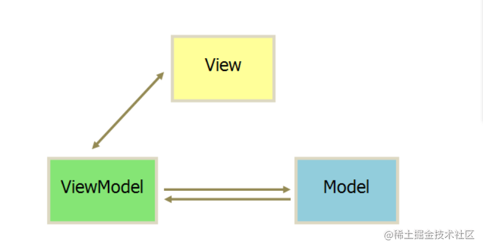

## Java 面试题一

### 1 请你说说Java的特点和优点, 为什么要选择Java？

Java 语言的特点: 一次编译, 到处运行, 即平台无关性, 是一种纯面向对象的语言。

优点: 内置的很多库函数简化了开发人员的设计工作; 具有较高的安全性和健壮性; 有较好的生态支持; 开发人员不需要对内存使用进行管理。

选择 Java 的原因: 使用范围很广, 包括 - web、大数据、安卓等, 生态与 API 支持很完备。

### 10 请你讲一下Java 8的新特性

**Lambda 表达式** − Lambda 允许把函数作为一个方法的参数（函数作为参数传递到方法中）。   

**方法引用** − 方法引用提供了非常有用的语法，可以直接引用已有Java类或对象（实例）的方法或构造器。与lambda联合使用，方法引用可以使语言的构造更紧凑简洁，减少冗余代码。   

**对接口进行了改进**：允许在接口中定义默认方法,默认方法必须使用default修饰。  

**新工具** − 新的编译工具，如：Nashorn引擎 jjs、 类依赖分析器jdeps。   

**Stream API** −新添加的Stream API（java.util.stream） 把真正的函数式编程风格引入到Java中。   

**Date Time API** − 加强对日期与时间的处理。   

**Optional 类** − Optional 类已经成为 Java 8 类库的一部分，用来解决空指针异常。   

**Nashorn, JavaScript 引擎** − Java 8提供了一个新的Nashorn javascript引擎，它允许我们在JVM上运行特定的javascript应用。

### 12 请你说说Java的异常处理机制

*try中写业务代码，catch用于捕获并处理某个异常，finally用于回收资源, throw主动抛出异常*

1. 异常处理机制让程序具有容错性和健壮性, 程序运行出现状况时,系统会生成一个 Exception 对象来通知程序 
2. 处理异常的语句由 try、catch、finally 三部分组成。try块用于包裹业务代码, catch块用于捕获并处理某个类型的异常, finally块则用于回收资源。 
3. 如果业务代码发生异常,系统创建一个异常对象, 并将其提交给JVM, 由 JVM 寻找可以处理这个异常的 catch 块,并将异常对象交给这个 catch 块处理。如果 JVM 没有找到，运行环境终止, Java 程序退出。 
4. Java 也允许程序主动抛出异常。当业务代码中,判断某项错误的条件成立时,可以使用 throw 关键字向外抛出异常。

### 18 请你说说多线程

进程是操作系统资源调度的最小单位, 线程是处理器任务调度和执行的基本单位, 一个进程可以创建多个线程。多个线程之间共享程序的内存空间和系统资源, 但都有自己的独立栈空间。多线程可以减小程序的响应时间,提高CPU利用率,创建和切换开销小,数据共享效率高,简化程序结构。

### 21 说说wait()和sleep()的区别

所属类型不同: wait() 为Object类的实例方法, 调用后进入WAITING状态; sleep() 属于 Thread 类的静态方法, 调用后进入 TIMED_WAITING 状态。

锁依赖不同: wait() 依赖于 synchronized 锁, 调用后线程会释放锁; sleep() 不依赖锁, 也不会释放锁。

返回条件不同: wait() 进入等待状态, 使用 notify() | notifyAll() 唤醒; sleep() 进入超时等待, 需要超时后自动返回。

### 22 如何保证线程安全

三种方案: 原子类、volatile、锁

- 原子类: 遵循 CAS - `比较和替换` 原则, 如果要更新的旧值与线程传入的旧值不一样, 则认为被其他线程修改, 修改不生效。

- volatile 关键字: 轻量级的 sychronized, 在多处理器开发中保证共享变量的可见性, 从而保证单个变量读写的线程安全。

  volatile 禁止指令重排序(添加屏障)

  写操作加的屏障是阻止上方其它写操作越过屏障排到volatile变量写之下
  读操作加的屏障是阻止下方其它读操作越过屏障排到volatile变量读之上

- sychronized 关键字: synchronized + juc 包下的 lock 锁。支持响应中断、支持超时机制、支持以非阻塞的方式获取锁、支持多个条件变量

### 23 说说你了解的线程同步方式

Java 通过加锁实现线程同步: synchronized 和 Lock。 synchronized 加在普通方法上, 锁当前实例;加在静态方法, 锁当前类的从class对象;加在代码块上, 则需要在关键字后面的小括号里,显式指定一个对象作为锁对象。 Lock 支持响应中断、支持超时机制、支持以非阻塞的方式获取锁、支持多个条件变量（阻塞队列）。

### 24 说说你了解的线程通信方式

线程通信: monitor 与 condition。 Synchronized 采用 monitor 的通信方式, 线程通过 monitor 调用 wait() 进入等待, 调用 notify() | notifyAll() 唤醒进程。 Lock 采用 condition 通信, 使用 await() 进入等待, 使用 signal()|signalAll() 唤醒线程。

### 32 Java 集合的了解, 哪些是线程安全的集合?

Java 集合主要由 Collection 和 Map 接口派生而来, Collection 派生出 List、Set、Queue, 所有的集合类都是 List, Set, Queue, Map 这四个接口的实现类。List 代表有序可重复的数据集合; Set 代表无序不可重复 的数据集合; Queue 代表先进先出的数据集合; Map 代表具有映射关系的数据集合。其中常见的类包括: ArrayList、LinkedList、HashMap、TreeMap、TreeSet、ArrayQueue 等。

`线程安全的集合`

- java.util 包下的集合大都是非线程安全的, 如: ArrayList、HashMap等。但如 Vector、HashTable 都是线程安全的, 基于 Synchronized 实现, 性能较差。一般使用 concurrent 下的 syncheronizedXxx() 将非线程安全的方法包装为线程安全的方法。在Java5 之后可以使用 concurrent 提供的大量支持并发访问的集合类, 如: ConcurrentHashMap | CopyOnWriteArrayList 等。

## Java 面试 二

### 3 List 和 Set 的区别

- List 是有序可重复的集合, Set 数组则是无序不可重复的集合; List 可以通过索引访问指定位置元素且每个元素都有对应的顺序索引, 而 Set 则无法记录元素的添加顺序同时不允许元素重复。

### 5 JVM 了解?

- JVM 是 Java 语言跨平台的关键, 它实现了其它语言不具备的自动内存管理和垃圾回收机制, 类似于一个虚构的计算机, 使得代码可以跨平台执行。

  主要由类加载子系统、执行引擎、运行时数据区。 

  类加载系统: 可以根据指定的全限定名来载入类和接口。

  执行引擎: 负责执行包含被载入类方法中的指令。 

  **运行时数据区**: 用于保存程序运行过程中产生的如字节码、对象、参数、返回值等变量信息(运行中产生的变量信息)。运行时数据区又可以被分为方法区、堆、虚拟机栈、本地方法栈、程序计数器等。

### 7 JVM 的垃圾回收机制

JVM 的垃圾回收机制是指JVM对不再使用的对象进行自动回收和内存释放的过程, 主要目标在于管理和优化内存使用, 避免内存泄漏。

主要包括4种收集方式:

- 新生代收集: 新生代垃圾收集
- 老年代垃圾收集: 老年代垃圾收集, 只有 CMS 收集器会收集。
- 混合收集: 整个新生代和部分老年代的垃圾收集, 只有 G1 收集器才有。
- 整堆收集: 整个堆和方法区的垃圾收集。

**垃圾回收算法**

JVM使用不同的垃圾回收算法来标记和回收垃圾对象。常见的垃圾回收算法包括：

- 标记-清除算法（Mark and Sweep）：标记所有活动对象，然后清除未标记的对象。	`优点：垃圾回收速度快。缺点：存在内存碎片`
- 复制算法（Copying）：将存活对象复制到一个新的空间，并清除旧空间中的所有对象。 `优点：没有内存碎片。缺点：内存开销大`
- 标记-整理算法（Mark and Compact）：标记活动对象，然后将它们向一端移动，然后清除其余空间。 `优点：没有内存碎片。缺点：整理速度慢`

### 8 GC 的可达性分析

垃圾回收器(GC) 使用可达性分析来确定对象的存活状态和回收对象。可达性分析是一种基于根对象的算法, 其首先标记所有跟对象, 然后通过根对象的引用链逐个遍历对象, 并标记其为可达的对象, 未标记的对象被认为是不可达的, 也即垃圾对象进行回收。

### 12 内存溢出 | 内存泄露 | 内存管理

- 内存溢出

  程序运行过程中申请的内存大于系统能够提供的内存, 导致无法申请到足够的内存, 于是发生内存溢出。

  原因: 死循环; 启动内存设定过小

- 内存泄露

  指不再使用的对象依旧被引用而导致 GC 无法回收内存, 导致 OOM
  
- 内存管理

  分为: 页式内存、段式内存、段页式内存管理三种。页式内存有效提高内存利用率; 段式内存可以反映程序逻辑结构并有利于段之间的共享; 段页式则结合两者, 先将程序分为若干段, 每段分为若干页, 使用段页表记录存储位置。

### 18 MySQL 主从复制

- 主从复制

  本质上就是通过主服务器与从服务器通过日志进行复制拉取, 分为3个步骤。 主服务器将数据更改记录到二进制日志(binlog)中; 从服务器拉取主服务器的二进制日志复制到自己的中继日志(relay log)中; 从服务器重做中继服务器中的日志, 将更改应用到自己的服务器上。

  

### 19 MVC 和 MVVM 的区别

- MVC
  - Model: 通常模型对象负责**在数据库中存取数据**。处理数据的crud
  - View: 处理数据显示和用户输入的部分, 通常依据模型数据创建
  - Controller: 控制器负责从视图读取数据，控制用户输入，并将数据发送给模型。
- MVVM
  - Model: 代表数据模型（Vue的data），**数据和业务逻辑**都在Model层中定义；
  - View: 代表UI视图，负责**数据的展示**（Vue的el）；
  - ViewModel: 一个对象，负责**监听 Model 中数据的改变**并且**控制View视图的更新**，处理用户交互操作；

- 区别

  MVVM 和 MVC都是一种设计思想; MVVM 与 MVC 最大的区别在于, MVVM 数据和模型之间存在绑定关系, 数据会自动刷新。

  其实现了 View 和 Model 的自动同步, 当Model属性改变时，不用手动操作Dom 元素去改变 View 的显示, 该属性对应 View 的显示会自动改变, 也即

  

## Java 面试 三

### 1 请你说说索引怎么实现的B+树, 为什么选这个数据结构？

索引的本质就在于通过对数据的进行+树与排序来加快检索效率。在二叉查找树上检索数据时, 当出现海量数据时受制于树的深度效率低下。在二叉查找树的基础上改为多叉并添加条件形成B树。B+树是一种平衡多路查找树, 可以有效减少磁盘IO, 同时B+树增加了叶子结点的链接, 能保证范围内找到起点和终点快速取出需要的数据。

### 3 说说你对Spring Boot的理解, 以及它和Spring的区别？

从本质上来说，spring boot 就是 spring。Spring boot 能够快速的完成 spring bean的配置Spring Boot使用约定大于配置的理念让项目快速运行起来。spring boot 本身并不提供 spring 的核心功能，而是作为spring的脚手架达到快速构建项目的目的。它可以可以快速构建项目、无需外部依赖selvlet容器、提供运行时的应用监控、大大的提高开发部署的效率。

### 5 说说Spring Boot的启步依赖、启动流程、自动装配

SpringBoot 启动依赖

- 将企业日常使用的各种业务场景抽取出来, 做成多个 starter整合该场景下所需的所有依赖, 用户只需要再 Maven 中引入 starter 依赖, SpringBoot 就可以自动扫描到加载信息和默认配置。

SpringBoot 启动流程

- 首先根据 `@SpringbootConfigration` 注解找到程序入口类, 通过 main 方法调用 SpringApplication 的 run() 方法实例化 SpringApplication 对象, 再调用该对象的 run() 方法, 获取监听器配置、打印 Bean 信息, 创建初始化容器, 监听器发送通知, 这样就完成了项目的初始化和启动。

SpringBoot 自动装配

- 使用 SpringBoot 时引入对应的 starter, SPringBoot 启动会自动加载对应依赖, 配置初始化参数。通过@EnableAutoConfirgation开启自动配置, 加在 Spring.factory 中注册的各种 AutoConfirgation 类, 满足 @Contional 条件时就实例化该类。

### 6 简单介绍 Spring | IOC | AOP

 Spring是一个轻量级的免费框架，它有两大核心功能，分别是 IOC 和 AOP ，IOC 控制反转是将创建对象的权限交给 spring 框架来控制。可以很好的起到解耦的作用。AOP 是一种编程思想以及面向切面编程，底层使用的是动态代理。可以在程序原有的功能上进行增强，常用的场景有日志记录和权限验证。

- IOC(控制反转)

  IOC 控制反转主要是指将创建对象的权限交给spring，在之前创建对象时使用new关键字，而现在直接从spring框架中拿出已创建好的实例即可。Spring负责维护对象之间的依赖关系，降低对象之间的耦合度，它的实现方式为DI - 依赖注入 主要的注入方式包括: 构造器、setter、接口注入。

- AOP(面向切面编程)

  AOP 面向切面编程是spring的两大核心之一，它是一种编程思想。在方法上开一个切口，可以在这个类执行之前执行自定义的方法，在不修改源代码的前提下，对方法进行增强。它可以对业务逻辑的各个部分进行隔离，降低耦合, 提高代码的可重用性。它的底层是通过动态代理来实现的，它主要场景包括日志记录和权限验证。
  

### 7 Bean 的生命周期与作用域

- Bean 的生命周期

  主要包括创建、初始化、调用、销毁等四个周期。首先通过构造器或工厂方法创建 Bean 实例, 为Bean设置值并调用bean的初始化方法, Bean 类使用，当容器关闭时调用并的销毁方法。

- Bean 的作用域

  singleton: 单例 - 仅存在一个实例

  prototype: 每次返回一个新的实例

  request: 发起 HTTP 请求时返回新的实例

  session: 在同一个 HTTP Session 中共享同一个实例

  global sessio: 在用一个全局 Sesson 中共享同一个实例。

### 8 说说@Autowired和@Resource注解的区别

@Autowired 是 Spring 提供的注解, @Resource 是JDK提供的注解。 @Autowired 只能按类型注入, 默认要求依赖对象存在, 只有当设置 required = false 才可为 null。 @Resource 默认按name属性设置的名称注入, 但也支持按类型装配。

### 9 Spring 事务管理

Spring 提供两种事务管理方案: 声明式事务和编程式事务, 编程式事务可以将事务管理的范围控制的更加精确; 声明式事务则不需要再业务代码中添加事务管理代码, 只需要添加@Transactional注解以声明事务特征即可。事务的四大特性: ACID(原子性、一致性、隔离性、持久性)

### 10 BeanFactory 和 FactoryBean 的区别

BeanFactory 是最基础的IOC容器, 是一种规范模式; 而 FactoryBean 知识 SpringIOC 创建 Bean 的一种形式。

- beanfactory：是所有spring bean容器的顶级接口，是最基础的IOC容器，它为spring的容器定义了一套方法，并提供像getBean这样的方法从容器中获取指定的bean实例。它在产生bean的同时，还提供了解决bean之间的依赖注入的能力，也就是所谓的di。

- factory bean：工厂bean，只是SpringIOC容器创建Bean的一种形式，它是一个接口，它的主要功能是动态去生成某一类型的bean的一个实例，也就是说 我们可以自定义一个bean并且加载到ioc容器里面，getObject是用来实现动态构建bean的一个过程。

### 11 MVC 和 SpringMVC 的执行流程是?

MVC: Model(模型层-数据层)、View(视图层 - 存放界面)、Controller(控制层- 业务逻辑)

- 执行流程

  用户向服务器发送请求到 DispatcherServlet 捕获请求;

  DispathcerServlet 根据 URL 解析根据特征调用 HandlerMapping 获取 Handler 配置的所有对象, 最后返回处理链。

  DispathcerServlet  再根据获取的 Handler 信息选定 HandlerAdapter, HandlerAdapter 再执行对应的 Handler(Controller), 最终返回一个ModelAndView 对象。

  DispathcerServlet  根据返回的ModelAndView 选择合适的 ViewResolver 匹配 View 信息得到 View 视图结果返回。最后对返回的 View 结果进行渲染并填充数据返回给客户端。

### 12 在MyBatis中$和#有什么区别

使用 `$ ` 设置参数是, Mybatis 会创建普通的SQL,执行SQL时将参数拼入SQL中。使用`#`设置参数时, Mybatis 会创建预编译的SQL语句, 然后再执行SQL时为编译的SQL占位符赋值, 预编译的SQL语句效率高且可以防止注入攻击, 效率和安全性都大大优于前者。

### 13 MyBatis 的缓存机制

一级缓存SQLSession缓存和二级缓存SQLSessionFactory级别缓存, 都默认开启。一级缓存又称作本地缓存, 作用域为session, 相同的SQL第一次查询写入缓存, 后续都从缓存中读取, Session 被关闭则清空缓存。二级缓存作用域为基于mapper文件的namespace, 多个 session 可以共享一个缓存区域, 不同的mapper文件只要namespace一致则都可以共享。

### 15 Redis 的单线程架构与持久化策略?

- 单线程架构

  Redis 采用了单线程+IO 复用技术, 这里的单线程指Redis读写操作和网络IO使用一个线程完成, 其他操作如持久化、异步删除等依赖于其他线程执行。Redis 快的原因在于, 其使用`单线程`避免了线程切换和锁竞争带来的消耗; 将操作放在`内存中执行`; 采用`IO多路复用`, 实现在网络IO中处理大量并发请求, 实现高吞吐率。

- 持久化策略

  - RDB redis database

    Redis 要求在指定的时间隔内将内存中数据快照写入磁盘, 文件名为 dump.rdb, 适合大规模数据恢复, 对数据库完整性和读写一致性要求不是很高, 一定时间间隔备份一次。出现意外故障时, 数据无法恢复。
    
  - AOF append only file
  
    以日志的形式记录每次写操作, 只允许追加而不允许修改文件, Redis 启动都会读取该文件, 从头到尾执行一次来恢复数据。但对磁盘IO较多, 性能比较差, 但安全性高, 一般也推荐使用 AOF 格式。

### 19 Redis 高可用

- 主从复制

  数据写放在主服务器上, 从服务器负责同步数据。缺点: 当主服务器挂掉, 不能切换到从服务器上。优点:一定程度上可以分担主服务器读的压力。

- 哨兵模式

  构建多个哨兵节点监视主服务器, 当主服务器挂掉则自动将对应的从服务器设为主服务器。

  优点: 自动切换、可用性高。  缺点: 主从服务器存储数据一致, 内存可用性较差, 还需要维护哨兵系统比较麻烦。

- 集群模式

  采用无中心节点的方式实现, 多个服务器相连, 一个主服务器可以有多个从服务器, 不同主服务器存储不同的数据。

  优点: 可用性更高

### 20 Redis 实现分布式锁

**方案一**：SETNX + EXPIRE

**方案二**：SETNX + value值是（系统时间 + 过期时间）

**方案三**：使用Lua脚本（包含SETNX + EXPIRE两条指令）

**方案四**：SET的扩展命令（SET EX PX NX）

**方案五**：SET EX PX NX + 校验唯一随机值，再释放锁

**方案六**：开源框架：Redisson

**方案七**：多机实现的分布式锁Redlock

​	最简单redis分布式锁的实现方式：加锁：setnx（key,1），解锁：del(key),问题：如果客户忘记解锁，将会出现死锁。第二种分布式锁的实现方式：setnx(key,1)+expire(key,30),解锁：del(key).问题：，由于setnx和expire的非原子性，当第二步挂掉，仍然会出现死锁。第三种方式：加锁：将setnx和expire变成原子性操作，set(key,1,30,NX),解锁：del（key）。同时考虑到线程A还在执行，但是锁已经到期，当线程A执行结束时去释放锁时，可能就会释放别的线程锁，所以在解锁时要先判断一下value值，看是不是该锁，如果是，再进行删除。

### 21 设计模式了解么

创建型：单例、工厂    结构型：组合模式、代理模式  行为型：策略模式、观察者模式  

设计模式分为三种类型: 创建型、结构型和行为型

- 创建型

  创建对象的同时隐藏逻辑, 不使用 NEW 直接实例化对象, 使得程序在判断需要创建哪些对象时更加灵活。包括: 单例模式、原型模式、工厂方法模式、抽象工厂模式、建造者模式

- 结构型

  通过类和接口之间的继承与引用实现复杂结构的对象, 包括是适配者模式、桥接模式、装饰者模式、过滤器模式、代理模式、外观模式。

- 行为型

  通过类之间不同的通信方式实现不同的行为。职责链模式、备忘录模式、解释器模式、命名模式、状态模式、中介者模式、策略模式。

### 22 垃圾收集器

- Serial(新生代)、Serial Old(老年代)

  适合单核小CPU, 单核工作且回收时暂听其他工作 STOP TO WORLD (STW)

- PawNew（新生代）、CMS（老年代）

  适用于多核CPU，最求短暂停时间，多核工作，使用标记清除算法，最短的暂停时间。

- Parallel Scavenge（新生代-标记复制算法）、Parallel Old（老年代-标记整理算法）:

  JDK 1.7 1.8默认的组合，适用于多核CPU，追求最大吞吐量。

- G1

  jdk1.9默认，适用于大内存多核CPU服务器，不按整个新生代或老年代去回收，而是开辟了面向局部收集，实现了较小的收集暂停时间和高吞吐量。

## Java 常见面试题四

### 4 IO密集型与CPU密集型的区别

- IO 密集型

  主要指任务执行设计大量的输入输出操作, 如: 文件读写、网络通信、数据库查询等, 大部分时间耗费在IO等待上, CPU利用率低。

- CPU 密集型

  主要指任务执行涉及大量的运算, 如: 数学计算、图像处理、加密解密等, 大部分耗费在CPU计算上, IO操作少。

- 区别

  IO密集型任务的性能瓶颈主要在于 **IO操作的速度**，而CPU密集型任务的性能瓶颈主要在于 **CPU的计算能力**。对于IO密集型任务，提高IO操作的效率和并发处理能力可以提升整体性能；而对于CPU密集型任务，提高CPU的计算能力和优化算法可以提高整体性能。

### 8

