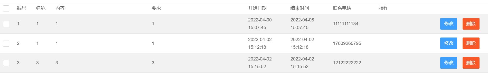

# 前后端日期转换 - 基于SSM

### 需求

> 在使用 SSM 框架写 WEB项目时,往往需要处理日期类型数据。而前端、后端、数据库使用的数据类型都不一致。
>
> **前端  String  yyyy-MM-dd HH:mm:ss**
>
> **后端  Date   yyyy/MM/dd HH:mm:ss**
>
> **数据库  datetime** 
>
> 因此我们就需要在项目中实现数据的转换。


## 1 实现日期Converter工具类

```java
package converter;


import org.springframework.core.convert.converter.Converter;

import java.text.ParseException;
import java.text.SimpleDateFormat;
import java.util.Date;

public class DateConverter implements Converter<String,Date> {
    public Date convert(String dateStr) {
        SimpleDateFormat  format= new SimpleDateFormat("yyyy-MM-dd HH:mm:ss");
        Date date = null;
        try {
            date = format.parse(dateStr);
        } catch (ParseException e) {
            e.printStackTrace();
        }
        return date;
    }
}

```

---


## 2 在 spring-mvc.xml 中配置 COnverter

```xml
<!-- 声明转换器 -->
<bean id="conversionService" class="org.springframework.context.support.ConversionServiceFactoryBean">
        <property name="converters">
            <list>
                <bean class="converter.DateConverter"/>
            </list>
        </property>
</bean>
```

---


## 3 前端显示

前端得到的数据可能不是 `2022-04-01` 格式, 所以要进行处理, 引入 `jstl-fmt`

```jsp
<!-- 引入 -->
<%@ taglib uri="http://java.sun.com/jsp/jstl/fmt" prefix="fmt" %>

<!-- 表格列 -->
<td>
    <fmt:formatDate value="${match.endDate}" pattern="yyyy-MM-dd HH:mm:ss"/>
</td>
```

---


## 4 效果




---

OVER~