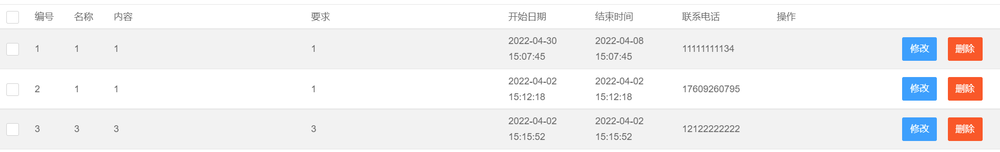

# 1 前后端日期转换 - 基于SSM

## 需求

> 在使用 SSM 框架写 WEB项目时,往往需要处理日期类型数据。而前端、后端、数据库使用的数据类型都不一致。
>
> **前端  String  yyyy-MM-dd HH:mm:ss**
>
> **后端  Date   yyyy/MM/dd HH:mm:ss**
>
> **数据库  datetime** 
>
> 因此我们就需要在项目中实现数据的转换。


##  实现日期Converter工具类

```java
package converter;


import org.springframework.core.convert.converter.Converter;

import java.text.ParseException;
import java.text.SimpleDateFormat;
import java.util.Date;

public class DateConverter implements Converter<String,Date> {
    public Date convert(String dateStr) {
        SimpleDateFormat  format= new SimpleDateFormat("yyyy-MM-dd HH:mm:ss");
        Date date = null;
        try {
            date = format.parse(dateStr);
        } catch (ParseException e) {
            e.printStackTrace();
        }
        return date;
    }
}

```

---


## 在 spring-mvc.xml 中配置 COnverter

```xml
<!-- 声明转换器 -->
<bean id="conversionService" class="org.springframework.context.support.ConversionServiceFactoryBean">
        <property name="converters">
            <list>
                <bean class="converter.DateConverter"/>
            </list>
        </property>
</bean>
```

---


## 前端显示

前端得到的数据可能不是 `2022-04-01` 格式, 所以要进行处理, 引入 `jstl-fmt`

```jsp
<!-- 引入 -->
<%@ taglib uri="http://java.sun.com/jsp/jstl/fmt" prefix="fmt" %>

<!-- 表格列 -->
<td>
    <fmt:formatDate value="${match.endDate}" pattern="yyyy-MM-dd HH:mm:ss"/>
</td>
```

---


## 效果




---


# 2 xlsx.js 实现前端 table 数据导出并下载为 excel

## 需求

> 在写一个 SSM 项目的时候需要添加 excel 数据导出的功能, 实质上也就是将从数据库中渲染到前端的数据保存为一个 excel 的形式并下载。


## ① 加载 xlsx.js

xlsx.js 是由 SheetJS 出品的js-xlsx是一款非常方便的只需要纯JS即可读取和导出excel的工具库，功能强大，支持格式众多，支持 xls、xlsx、ods等十几种格式。附链接 [Github ](https://github.com/SheetJS/sheetjs)打包下载取库内的 js 文件即可。

```
dist > xlsx.core.min.js
```

**导入 js**

```js
<script src="../js/xlsx.core.min.js"></script>
```


## ② 引入 JS 代码

[引自](https://segmentfault.com/a/1190000019700368?utm_source=tag-newest)

如果需要使用的话, 注意以下两个步骤

- 为你的 `table` 定义 id, 并添加在 `btn_export` 函数中替换 `table1`, 

- 定义 `button` 组件, 并添加 `onclick` 事件绑定函数 `btn_export`

```jsp
<script>
        function btn_export() {
            var table1 = document.querySelector("#table1");
            var sheet = XLSX.utils.table_to_sheet(table1);//将一个table对象转换成一个sheet对象
            openDownloadDialog(sheet2blob(sheet),'下载.xlsx');
        }

        // 将一个sheet转成最终的excel文件的blob对象，然后利用URL.createObjectURL下载
        function sheet2blob(sheet, sheetName) {
            sheetName = sheetName || 'sheet1';
            var workbook = {
                SheetNames: [sheetName],
                Sheets: {}
            };
            workbook.Sheets[sheetName] = sheet; // 生成excel的配置项

            var wopts = {
                bookType: 'xlsx', // 要生成的文件类型
                bookSST: false, // 是否生成Shared String Table，官方解释是，如果开启生成速度会下降，但在低版本IOS设备上有更好的兼容性
                type: 'binary'
            };
            var wbout = XLSX.write(workbook, wopts);
            var blob = new Blob([s2ab(wbout)], {
                type: "application/octet-stream"
            }); // 字符串转ArrayBuffer
            function s2ab(s) {
                var buf = new ArrayBuffer(s.length);
                var view = new Uint8Array(buf);
                for (var i = 0; i != s.length; ++i) view[i] = s.charCodeAt(i) & 0xFF;
                return buf;
            }
            return blob;
        }

        function openDownloadDialog(url, saveName) {
            if (typeof url == 'object' && url instanceof Blob) {
                url = URL.createObjectURL(url); // 创建blob地址
            }
            var aLink = document.createElement('a');
            aLink.href = url;
            aLink.download = saveName || ''; // HTML5新增的属性，指定保存文件名，可以不要后缀，注意，file:///模式下不会生效
            var event;
            if (window.MouseEvent) event = new MouseEvent('click');
            else {
                event = document.createEvent('MouseEvents');
                event.initMouseEvent('click', true, false, window, 0, 0, 0, 0, 0, false, false, false, false, 0, null);
            }
            aLink.dispatchEvent(event);
        }
    </script>
```


## ③ 按钮绑定事件

```html
<button class="layui-btn-radius" onclick="btn_export()">导出excel文档</button>
```


## 结果


### 附源码

```jsp
<%@ page contentType="text/html;charset=UTF-8" language="java" %>
<%@taglib prefix="c" uri="http://java.sun.com/jsp/jstl/core" %>
<%@ taglib uri="http://java.sun.com/jsp/jstl/fmt" prefix="fmt" %>
<!DOCTYPE html>
<html lang="en">
<head>
    <meta charset="UTF-8">
    <title>项目信息浏览</title>
    <!-- Meta tag Keywords -->
    <meta name="viewport" content="width=device-width, initial-scale=1">
    <meta charset="UTF-8" />
    <meta http-equiv="X-UA-Compatible" content="IE=edge">

    <!-- Custom-Files -->
    <link rel="stylesheet" href="../assets/css/layui.css">
    <link rel="stylesheet" href="../assets/css/bootstrap.min.css">
    <link rel="stylesheet" href="../css/admin.css">
    <!-- //Custom-Files -->

    <script src="../index.js" data-main="home"></script>
    <script src="../assets/layui.js"></script>
    <script src="../js/xlsx.core.min.js"></script>

    <!-- 注意：如果你直接复制所有代码到本地，上述js路径需要改成你本地的 -->
    <script>
        //layui实现全选
        layui.use('form', function () {
            const form = layui.form;
            /*此处对应页面属性lay-filter="allChoose" allChoose可更改为任意名*/
            form.on('checkbox(allChoose)', function (data) {
                /*此处为匹配页面属性class="itemSelect" 可任意更换*/
                $("input[class='itemSelect']").each(function () {
                    this.checked = data.elem.checked;
                });
                form.render('checkbox');
            });
        });
    </script>

    <script>
        function btn_export() {
            var table1 = document.querySelector("#table1");
            var sheet = XLSX.utils.table_to_sheet(table1);//将一个table对象转换成一个sheet对象
            openDownloadDialog(sheet2blob(sheet),'下载.xlsx');
        }

        // 将一个sheet转成最终的excel文件的blob对象，然后利用URL.createObjectURL下载
        function sheet2blob(sheet, sheetName) {
            sheetName = sheetName || 'sheet1';
            var workbook = {
                SheetNames: [sheetName],
                Sheets: {}
            };
            workbook.Sheets[sheetName] = sheet; // 生成excel的配置项

            var wopts = {
                bookType: 'xlsx', // 要生成的文件类型
                bookSST: false, // 是否生成Shared String Table，官方解释是，如果开启生成速度会下降，但在低版本IOS设备上有更好的兼容性
                type: 'binary'
            };
            var wbout = XLSX.write(workbook, wopts);
            var blob = new Blob([s2ab(wbout)], {
                type: "application/octet-stream"
            }); // 字符串转ArrayBuffer
            function s2ab(s) {
                var buf = new ArrayBuffer(s.length);
                var view = new Uint8Array(buf);
                for (var i = 0; i != s.length; ++i) view[i] = s.charCodeAt(i) & 0xFF;
                return buf;
            }
            return blob;
        }

        function openDownloadDialog(url, saveName) {
            if (typeof url == 'object' && url instanceof Blob) {
                url = URL.createObjectURL(url); // 创建blob地址
            }
            var aLink = document.createElement('a');
            aLink.href = url;
            aLink.download = saveName || ''; // HTML5新增的属性，指定保存文件名，可以不要后缀，注意，file:///模式下不会生效
            var event;
            if (window.MouseEvent) event = new MouseEvent('click');
            else {
                event = document.createEvent('MouseEvents');
                event.initMouseEvent('click', true, false, window, 0, 0, 0, 0, 0, false, false, false, false, 0, null);
            }
            aLink.dispatchEvent(event);
        }
    </script>

    <%--    获取layui属性依赖--%>
    <script>
        layui.use('form', function () {
            var form = layui.form;
            form.render('select'); //刷新select选择框渲染
            //各种基于事件的操作，下面会有进一步介绍
        });

        layui.use('element', function(){
            var element = layui.element;
            //一些事件触发
            element.on('tab(demo)', function(data){
                console.log(data);
            });
        });
    </script>

</head>
<body>
<div class="container" style='margin-top:30px;width:auto;height:800px;overflow-x:auto;overflow-y:auto'>
    <!--查询 -->
    <form class="layui-form" action="${pageContext.request.contextPath}/project/loadRank">
        <div class="layui-form-item">
            <label class="layui-form-label">比赛</label>
            <div class="layui-input-inline">
                <select name="match" lay-verify="required" >
                    <c:forEach items="${matchList}" var="match" varStatus="s">
                        <option value="${match.title}">${match.title}</option>
                    </c:forEach>
                </select>
            </div>
            <button class="layui-btn" lay-submit lay-filter="formDemo">获取</button>
        </div>
    </form>


    <!-- 表格 -->
    <table id="table1" lay-skin="line" class="layui-table" lay-even lay-skin="nob" id="userListTable" lay-size="sm">
        <!-- 列宽度 -->
        <colgroup>
            <col width="50">
            <col width="50">
            <col width="110">
            <col width="110">
            <col width="110">
            <col width="110">
            <col width="120">
            <col>
        </colgroup>
        <!-- 表头 -->
        <tr class="info" style=" text-align: center;">
            <th lay-size="5px">排名</th>
            <th>名称</th>
            <th>参加比赛名称</th>
            <th>项目类型</th>
            <th>学校</th>
            <th>负责人</th>
            <th>联系电话</th>
            <th>成员</th>
            <th>申请日期</th>
            <th>项目描述</th>
            <th>分数</th>
        </tr>


        <c:forEach items="${projects}" var="project" varStatus="s">
            <tr>
                <td>${s.count}</td>
                <td>${project.title}</td>
                <td>${project.match}</td>
                <td>${project.type}</td>
                <td>${project.college}</td>
                <td>${project.person}</td>
                <td>${project.phone}</td>
                <td>${project.member}</td>
                <td>
                    <fmt:formatDate value="${project.date}" pattern="yyyy-MM-dd HH:mm:ss"/>
                </td>
                <td>${project.desc}</td>
                <td>${project.score}</td>
            </tr>
        </c:forEach>
    </table>

    <button class="layui-btn-radius" onclick="btn_export()">导出excel文档</button>
</div>

<script src="../js/jquery-2.1.0.min.js" type="text/javascript"></script>
<script src="../js/bootstrap.min.js" type="text/javascript"></script>
</div>
</body>
</html>
```

---

OVER~


# 3 SSM + ajax + LayUI 实现验证码发送

## 需求描述

`想要实现一个验证码登录功能, 也就是用户直接使用邮箱注册, 加入存在该邮箱验证过的用户就直接登录; 不存在就提示让其注册账号, 完成数据绑定`

---


## 效果


---


## 代码实现

### 引入依赖

```xml
<!--邮件发送-->
<!--spring支持-->
<dependency>
    <groupId>org.springframework</groupId>
    <artifactId>spring-context-support</artifactId>
    <version>5.0.0.RELEASE</version>
</dependency>
<dependency>
    <groupId>com.sun.mail</groupId>
    <artifactId>javax.mail</artifactId>
    <version>1.6.1</version>
</dependency>
```


### 书写 properties 文件

`mail.properties `

```properties
#服务器主机名 smtp.xx.com
mail.smtp.host=smtp.qq.com
#若无法识别可以写IP地址58.251.106.181，此处可能会用在部署到云服务器运行时设置
mail.smtp.username=XXXX@qq.com
#密码/客户端授权码 - 需要在 qq邮箱中开启授权(设置里面)
mail.smtp.password=
#编码字符
mail.smtp.defaultEncoding=utf-8
#是否进行用户名密码校验
mail.smtp.auth=true
#设置超时时间
mail.smtp.timeout=20000
```


### 注册 bean 类

`注意: 如果有多个 bean 注入, 比如还有数据库注入的话, 需要在每个 bean 的后面写 ignore-unresolvable="true", 否则会提示找不到 bean 类`

`applicationContext.xml`

```xml
<!--邮件配置-->
    <!--
            读取邮件配置文件,
            其中ignore-unresolvable="true"属性是配置文件中存在
            多个property-placeholder时出现解析不了的占位符进行忽略掉，
        -->
    <context:property-placeholder location="classpath:mail.properties" ignore-unresolvable="true"/>
    <!--配置邮件接口-->
    <bean id="javaMailSender" class="org.springframework.mail.javamail.JavaMailSenderImpl">
        <property name="host" value="${mail.smtp.host}"/>
        <property name="username" value="${mail.smtp.username}"/>
        <property name="password" value="${mail.smtp.password}"/>
        <property name="defaultEncoding" value="${mail.smtp.defaultEncoding}"/>
        <property name="javaMailProperties">
            <props>
                <prop key="mail.smtp.auth">${mail.smtp.auth}</prop>
                <prop key="mail.smtp.timeout">${mail.smtp.timeout}</prop>
            </props>
        </property>
    </bean>
```


### 前端代码

**这里其实使用 html 也可以, 因为使用的是 ajax 方式, 同时没有使用 jsp 的组件。如果用别的框架也是可以的,  具体参照代码, 发送邮件主要还是后端比较重要, 前端你只需要获取数据比对。**

`login.jsp`

```jsp
<%@ page contentType="text/html;charset=UTF-8" language="java" %>
<!DOCTYPE html>
<html>
<head>
    <meta charset="UTF-8">
    <title>后台管理-登陆</title>
    <meta http-equiv="X-UA-Compatible" content="IE=edge,chrome=1">
    <meta http-equiv="Access-Control-Allow-Origin" content="*">
    <meta name="viewport" content="width=device-width, initial-scale=1, maximum-scale=1">
    <meta name="apple-mobile-web-app-status-bar-style" content="black">
    <meta name="apple-mobile-web-app-capable" content="yes">
    <meta name="format-detection" content="telephone=no">
    <link rel="stylesheet" href="../lib/layui-v2.6.3/css/layui.css" media="all">
    <!--[if lt IE 9]>
    <script src="https://cdn.staticfile.org/html5shiv/r29/html5.min.js"></script>
    <script src="https://cdn.staticfile.org/respond.js/1.4.2/respond.min.js"></script>
    <![endif]-->
    <style>
        body {background-image:url("../images/bg.jpg");height:100%;width:100%;}
        #container{height:100%;width:100%;}
        input:-webkit-autofill {-webkit-box-shadow:inset 0 0 0 1000px #fff;background-color:transparent;}
        .admin-login-background {width:300px;height:300px;position:absolute;left:50%;top:40%;margin-left:-150px;margin-top:-100px;}
        .admin-header {text-align:center;margin-bottom:20px;color:#ffffff;font-weight:bold;font-size:40px}
        .admin-input {border-top-style:none;border-right-style:solid;border-bottom-style:solid;border-left-style:solid;height:50px;width:300px;padding-bottom:0px;}
        .admin-input::-webkit-input-placeholder {color:#a78369}
        .layui-icon-username {color:#a78369 !important;}
        .layui-icon-username:hover {color:#9dadce !important;}
        .layui-icon-password {color:#a78369 !important;}
        .layui-icon-password:hover {color:#9dadce !important;}
        .admin-input-username {border-top-style:solid;border-radius:10px 10px 0 0;}
        .admin-input-verify {border-radius:0 0 10px 10px;}
        .admin-button {margin-top:20px;font-weight:bold;font-size:18px;width:300px;height:50px;border-radius:5px;background-color:#a78369;border:1px solid #d8b29f}
        .admin-icon {margin-left:260px;margin-top:10px;font-size:30px;}
        i {position:absolute;}
        .admin-captcha {position:absolute;margin-left:205px;margin-top:-40px;}
    </style>
    <script src="../js/jquery-2.1.0.min.js" type="text/javascript"></script>
</head>
<body>
<div id="container">
    <div></div>
    <div class="admin-login-background">
        <div class="admin-header">
            <span>layuimini</span>
        </div>
        <form class="layui-form" action="">
<%--            <!-- 附加, 为了封装方便 -->--%>
<%--            <input type="hidden" name="id"  value="2" class="layui-input">--%>

            <div>
                <i class="layui-icon layui-icon-username admin-icon"></i>
                <input type="text" name="username" placeholder="请输入用户名" autocomplete="off" class="layui-input admin-input admin-input-username" value="">
            </div>
            <div>
                <i class="layui-icon layui-icon-password admin-icon"></i>
                <input type="password" name="password" placeholder="请输入密码" autocomplete="off" class="layui-input admin-input" value="">
            </div>
            <div>
                <input type="text" name="verifycode" placeholder="请输入验证码" autocomplete="off" class="layui-input admin-input admin-input-verify" value="">
                
            </div>
            <button class="layui-btn admin-button" lay-submit="" lay-filter="login">登 陆</button>
        </form>
            <button class="layui-btn admin-button" onclick="loginWithCode()" >验 证 码 登 陆</button>
    </div>
</div>
<script src="../lib/layui-v2.6.3/layui.js" charset="utf-8"></script>
<script>
    function loginWithCode(){
        //使用验证码登录
        layer.open({
            //layer提供了5种层类型。可传入的值有：0（信息框，默认）1（页面层）2（iframe层）3（加载层）4（tips层）
            type:2,
            content:'${pageContext.request.contextPath}/pages/loginwithcode.jsp',
            area: ['30%', '30%'],
            offset: 'auto',
            id: 'add' //设定一个id，防止重复弹出
        });
    }
</script>
<script>
    layui.use(['form'], function () {
        var form = layui.form,
            layer = layui.layer;

        // 登录过期的时候，跳出ifram框架
        if (top.location !== self.location) top.location = self.location;

        // 进行登录操作
        form.on('submit(login)', function (data) {
            data = data.field;
            console.log(data)
            if (data.username == '') {
                layer.msg('用户名不能为空');
                return false;
            }
            if (data.password == '') {
                layer.msg('密码不能为空');
                return false;
            }
            if (data.captcha == '') {
                layer.msg('验证码不能为空');
                return false;
            }

            //发送异步登录请求
            $.ajax({
                url:'${pageContext.request.contextPath}/admin/login',
                type:'POST',
                data: {
                    username: data.username,
                    password: data.password,
                    verifycode: data.verifycode
                },
                success:
                    function (response) {
                        layer.msg(response.msg);
                        console.log(response)
                        //code = 1 代表登录成功
                        if(response.code == "0"){
                            setTimeout(function(){
                                //带参跳转
                                window.location.href = "${pageContext.request.contextPath}/pages/login.jsp"
                            }, 1000);
                            return false;
                        }
                        else if(response.code == "1"){
                            setTimeout(function(){
                                //带参跳转
                                window.location.href = "${pageContext.request.contextPath}/pages/main.jsp?username="
                                    + window.decodeURIComponent(response.data.username) + "&id=" + window.decodeURIComponent(response.data.id);
                            }, 1000);
                        }
                    },
            })
            return false;
        });
    });
</script>
</body>
</html>
```


`loginwithcode.jsp`

```jsp
<%@ page contentType="text/html;charset=UTF-8" language="java" %>
<%@taglib prefix="c" uri="http://java.sun.com/jsp/jstl/core" %><!DOCTYPE html>
<!DOCTYPE html>
<html>
<head>
    <meta charset="utf-8">
    <title>layui</title>
    <meta name="renderer" content="webkit">
    <meta http-equiv="X-UA-Compatible" content="IE=edge,chrome=1">
    <meta name="viewport" content="width=device-width, initial-scale=1, maximum-scale=1">
    <link rel="stylesheet" href="../css/public.css" media="all">

    <style>
        body {
            background-color: #ffffff;
        }
    </style>
</head>
<body>
    <form class="layui-form layuimini-form"  action="" style="margin-left: -80px">
        <div class="layui-form-item">
            <label class="layui-form-label required">邮箱</label>
            <div class="layui-input-block">
                <input type="text" id="email" name="email"  lay-verify="email" lay-reqtext="邮箱不能为空" placeholder="请输入邮箱(XX@qq/163/gmail.com)" value="" class="layui-input">
            </div>
        </div>

        <div class="layui-form-item">
            <label class="layui-form-label required">验证码</label>
            <div class="layui-input-inline">
                <input type="text" name="code" lay-verify="required" lay-reqtext="验证码不能为空" placeholder="请输入验证码" value="" class="layui-input">
            </div>
            <div class="layui-input-inline">
                <input type="button" class="layui-btn layui-inline" id="send" value="发送验证码" onclick="sendCode()">
            </div>
        </div>
        <div class="layui-form-item">
            <div class="layui-input-block">
                <button class="layui-btn layui-btn-normal"  lay-submit lay-filter="saveBtn">登录</button>
            </div>
        </div>
    </form>
    <link rel="stylesheet" href="../lib/layui-v2.6.3/css/layui.css" media="all">
    <script src="../lib/layui-v2.6.3/layui.js" charset="utf-8"></script>
    <script src="../js/jquery-2.1.0.min.js" type="text/javascript"></script>
<script>
    function sendCode(){
        //设置按钮不可点击
        document.getElementById("send").disabled = "true";
        document.getElementById("send").className = "layui-btn layui-btn-disabled layui-inline";

        var form = layui.form,
            layer = layui.layer;
        var mail = '';
        mail = $("#email").val();        //获取邮箱
        console.log(typeof mail)
        if (mail.length == 0) {
            alert("邮箱不能为空")
            layer.msg('邮箱不能为空');
            return false;
        }
        $.ajax({
            url:'${pageContext.request.contextPath}/admin/sendCode',
            type: 'post',
            async : false,  //同步请求
            data : {
                mail: mail
            },
            success:function (response) {
                if(response.code == '1'){
                    layer.msg("发送成功", {icon: 6});
                } else{
                    layer.msg("发送失败", {icon: 5});
                }
            }
        })
    }

    layui.use(['form'], function () {
        var form = layui.form,
            layer = layui.layer,
            $ = layui.$;

        //监听提交
        form.on('submit(saveBtn)', function (data) {
            console.log(data)
            $.ajax({
                url:'${pageContext.request.contextPath}/admin/loginWithCode',
                type:'post',
                data : {
                    email: data.field.email,
                    code: data.field.code
                },
                success:function (response) {
                    if(response.code == '1'){
                        layer.msg("登录成功", {icon: 6});
                        setTimeout(function(){
                            var index = parent.layer.getFrameIndex(window.name);//获取窗口索引
                            parent.layer.close(index);      //关闭弹出层
                            //带参跳转
                            parent.window.location.href = "${pageContext.request.contextPath}/pages/main.jsp?username="
                                + window.decodeURIComponent(response.data.username) + "&id=" + window.decodeURIComponent(response.data.id);
                        }, 1000);
                    } else if(response.code == '0'){
                        layer.msg(response.msg, {icon: 5});
                        setTimeout(function(){
                            var index = parent.layer.getFrameIndex(window.name);//获取窗口索引
                            parent.layer.close(index);//关闭弹出层
                            //带参跳转
                            //使用验证码登录
                            parent.layer.open({
                                //layer提供了5种层类型。可传入的值有：0（信息框，默认）1（页面层）2（iframe层）3（加载层）4（tips层）
                                type:2,
                                content: "${pageContext.request.contextPath}/pages/signin.jsp?email="+ window.decodeURIComponent($("#email").val()),
                                area: ['40%', '40%'],
                                offset: 'auto',
                                id: 'signin' //设定一个id，防止重复弹出
                            });
                            //parent.window.location.href = ;
                        }, 1000);
                    } else{
                        layer.msg(response.msg, {icon: 5});
                    }
                }
            })

            return false;
        });

    });
</script>


<script src="../lib/layui-v2.6.3/layui.js" charset="utf-8"></script>
</body>
</html>
```


`sign.jsp`

```jsp
<%@ page contentType="text/html;charset=UTF-8" language="java" %>
<%@taglib prefix="c" uri="http://java.sun.com/jsp/jstl/core" %><!DOCTYPE html>
<html lang="en">
<head>
    <meta charset="UTF-8">
    <!-- 指定字符集 -->
    <meta charset="utf-8">
    <!-- 使用Edge最新的浏览器的渲染方式 -->
    <meta http-equiv="X-UA-Compatible" content="IE=edge">
    <!-- viewport视口：网页可以根据设置的宽度自动进行适配，在浏览器的内部虚拟一个容器，容器的宽度与设备的宽度相同。
    width: 默认宽度与设备的宽度相同
    initial-scale: 初始的缩放比，为1:1 -->
    <meta name="viewport" content="width=device-width, initial-scale=1">
    <!-- 上述3个meta标签*必须*放在最前面，任何其他内容都*必须*跟随其后！ -->
    <link rel="stylesheet" href="../assets/css/layui.css">
    <script src="../assets/layui.js"></script>
    <script src="../js/jquery-2.1.0.min.js"></script>
    <title>用户注册</title>


    <%--    获取layui属性依赖--%>
    <script>
        layui.use('form', function () {
            var form = layui.form;
            form.render(); //刷新select选择框渲染
        });

        layui.use('element', function(){
            var element = layui.element;
            //一些事件触发
            element.on('tab(demo)', function(data){
                console.log(data);
            });
        });
    </script>

    <%-- 更新登录用户, 获取传递的参数   --%>
    <script type="text/javascript">
        var paramobj = {};
        window.onload = function () {
            //此时parameterURL为:name=张三&age=25
            var parameterURL = location.search.substring(1, location.search.length);
            //此时paramArr为一个数组:["name=张三","age=25"]
            var paramArr = parameterURL.split("&");
            var temp;
            //定义2个变量接收key，value并存到paramobj中
            for (i = 0; i < paramArr.length; i++) {
                temp = paramArr[i].split("=");
                if (temp.length === 1) {
                    paramobj[temp[0]] = "";
                }
                else if(temp.length>1){
                    for (j = 0; j < temp.length; j++) {
                        paramobj[temp[0]] = decodeURIComponent(temp[1]);
                    }
                }
            }
            //此时参数已全部保存至paramobj中,这里显示到div
            var showStr="";
            var email = '';
            var i = 0;
            for (var a in paramobj) {
                if(i === 0)
                    email = paramobj[a];
                showStr += (a + ":" + paramobj[a]);
                i++;
            }
            console.log(showStr, email)
            var input = document.getElementById("email");  //获取input对象
            input.setAttribute("value", email);  //为input对象设置value属性和值
            $("#email").text(email);
            //document.getElementById("mail").innerText = email;
        }
    </script>

    <script>
        layui.use('form', function(){
            var form = layui.form;
            form.on('submit(formDemo)', function(data){
                data = data.field
                console.log(data)
                console.log(data.field)
                console.log(data.form)
                //监听提交
                $.ajax({
                    url : '${pageContext.request.contextPath}/admin/signIn',
                    type : 'post',
                    data : {
                        id: data.id,
                        username: data.username,
                        password: data.password,
                        email: data.email
                    },
                    success : function(response) {
                        if (response.code == '1') {
                            layer.msg("登录成功", {icon: 6});
                            setTimeout(function(){
                                var index = parent.layer.getFrameIndex(window.name);//获取窗口索引
                                parent.layer.close(index);      //关闭弹出层
                                //带参跳转
                                parent.window.location.href = "${pageContext.request.contextPath}/pages/main.jsp?username="
                                    + window.decodeURIComponent(response.data.username) + "&id=" + window.decodeURIComponent(response.data.id);
                            }, 1000);
                        } else {
                            layer.msg("登录失败", {icon: 5});
                        }
                    }
                })
                return false;
            });
        });
    </script>
</head>
<body>
<div class="container" style="width: 100%">
    <div class="layui-card" style="text-align: center;">
        <h3><div class="layui-card-header layui-bg-cyan">用户注册</div></h3>
    </div>

    <form class="layui-form" method="post" action="" style="width: 60%; float:left; margin-left:15% ">
        <input type="hidden" name="id"  value="2" class="layui-input">

        <div class="layui-form-item">
            <label class="layui-form-label">用户名</label>
            <div class="layui-input-block">
                <input type="text" name="username" required  placeholder="请输入用户名" class="layui-input">
            </div>
        </div>

        <div class="layui-form-item">
            <label for="password" class="layui-form-label">密码</label>
            <div class="layui-input-block">
                <input type="text" id="password" name="password"  required  placeholder="请输入密码" class="layui-input">
            </div>
        </div>

        <div class="layui-form-item">
            <label for="email" class="layui-form-label">邮箱</label>
            <div class="layui-input-block">
                <input type="text" id="email" name="email" required class="layui-input" placeholder="请输入邮箱" readonly>
            </div>
        </div>

        <div class="layui-form-item">
            <div class="layui-input-block">
                <button class="layui-btn" lay-submit lay-filter="formDemo">立即提交</button>
                <button type="reset" class="layui-btn layui-btn-primary">重置</button>
            </div>
        </div>
    </form>
</div>
</body>
</html>
```


---


### 后端代码

`AdminController`

```java
@RequestMapping("/admin")
@Controller
public class AdminController {
    @Autowired
    private AdminService adminService;
    @Autowired
    private  JavaMailSenderImpl javaMailSender;
    @RequestMapping("/signIn")
        @ResponseBody
        public LayuiUtils<Admin> signIn(Admin admin){
            adminService.signIn(admin);
            System.out.println(admin.toString());
            //打印封装数据
            return new LayuiUtils<Admin>("注册成功", admin,1,0);
        }

        @RequestMapping("/sendCode")
        public LayuiUtils<String> sendCode(String mail, HttpServletRequest request) throws MessagingException {
            MimeMessage message = javaMailSender.createMimeMessage();
            MimeMessageHelper helper = new MimeMessageHelper(message, true);
            helper.setSubject("验证码"); // 标题
            String checkcode = getCheckCode();
            //将验证码放入HttpSession中
            request.getSession().setAttribute("codes",checkcode);
            // 内容, 第二个参数为true则以html方式发送, 否则以普通文本发送
            helper.setText("<h1 style='red'>" + checkcode + "</h1>", true);
            //发送附件
            //helper.addAttachment("1.jpg",new File("C:\\Users\\zpk\\Desktop\\loading\\加载-063.gif"));

            helper.setTo(mail); // 收件人
            helper.setFrom("1719XXX051@qq.com"); // 发件人 - 写自己的邮箱名称
            javaMailSender.send(message); // 发送
            //打印封装数据
            return new LayuiUtils<String>("发送成功", null,1,0);
        }

        @RequestMapping("/loginWithCode")
        @ResponseBody
        public LayuiUtils<Admin> loginWithCode(String email, String code, HttpServletRequest request){
            //根据邮箱判断用户是否存在
            Admin admin = adminService.findAdminByEmail(email);

            //从 session 中获取验证码
            HttpSession session = request.getSession();
            String codes = (String)session.getAttribute("codes");

            LayuiUtils<Admin> result;
            //验证码错误
            if(!code.equalsIgnoreCase(codes)){
                System.out.println(codes + code);
                //打印封装数据
                result = new LayuiUtils<Admin>("验证码错误", null,-1,0);
                return result;
            } else if(admin == null){
                result = new LayuiUtils<Admin>("用户不存在,请完成注册!", null,0,0);
                return result;
            } else{
                result = new LayuiUtils<Admin>("登陆成功", admin,1,0);
                return result;
            }
        }
}
```


---


#  4 SSM + ajax + LayUI 实现头像上传&预览和显示

## 需求描述

`在实现系统时,希望登录的用户可以实现头像展示的功能。 因此需要开发头像上传以及上传时的图像预览功能, 此外还需要在登录后以圆形的样式展示头像。`

---


## 效果

`上传头像`


`头像显示 - 右上角`


---


## 代码实现

### 引入依赖

`需要使用文件上传功能, 因此需要导入依赖`

```xml
 <!-- 文件上传 -->
<dependency>
    <groupId>commons-fileupload</groupId>
    <artifactId>commons-fileupload</artifactId>
    <version>1.3.3</version>
</dependency>
<dependency>
    <groupId>commons-io</groupId>
    <artifactId>commons-io</artifactId>
    <version>2.8.0</version>
</dependency>
```


### 注册 bean 类

```properties
<!-- 配置上传文件解析器 -->
<bean id="multipartResolver" class="org.springframework.web.multipart.commons.CommonsMultipartResolver">
    <property name="defaultEncoding" value="UTF-8"/>
    <property name="maxUploadSize" value="10240000"/>
</bean>
```


### 前端代码

`upload-header.jsp`

```jsp
<%@ page contentType="text/html;charset=UTF-8" language="java" %>
<%@taglib prefix="c" uri="http://java.sun.com/jsp/jstl/core" %><!DOCTYPE html>
<html lang="en">
<head>
    <meta charset="UTF-8">
    <!-- 指定字符集 -->
    <meta charset="utf-8">
    <!-- 使用Edge最新的浏览器的渲染方式 -->
    <meta http-equiv="X-UA-Compatible" content="IE=edge">
    <!-- viewport视口：网页可以根据设置的宽度自动进行适配，在浏览器的内部虚拟一个容器，容器的宽度与设备的宽度相同。
    width: 默认宽度与设备的宽度相同
    initial-scale: 初始的缩放比，为1:1 -->
    <meta name="viewport" content="width=device-width, initial-scale=1">
    <!-- 上述3个meta标签*必须*放在最前面，任何其他内容都*必须*跟随其后！ -->
    <link rel="stylesheet" href="../assets/css/layui.css">
    <script src="../assets/layui.js"></script>
    <script src="../js/jquery-2.1.0.min.js"></script>
    <title>上传头像</title>


    <%--    获取layui属性依赖--%>
    <script>
        layui.use('form', function () {
            var form = layui.form;
            form.render();      //更新全部
        });

        layui.use('element', function(){
            var element = layui.element;
            //一些事件触发
            element.on('tab(demo)', function(data){
                console.log(data);
            });
        });
    </script>

    <script>
        layui.use('form', function(){
            var form = layui.form;

            form.on('submit(formDemo)', function(data){
                console.log(data.field.fileName)
                $.ajax({
                    url:'${pageContext.request.contextPath}/admin/saveHeader',
                    type:'post',
                    data : {
                        id: data.field.id,
                        filename: data.field.fileName
                    },
                    success:function (response) {
                        if(response.code == '1'){
                            layer.msg("上传成功", {icon: 6});
                            setTimeout(function(){
                                var index = parent.layer.getFrameIndex(window.name);//获取窗口索引
                                parent.layer.close(index);//关闭弹出层
                                window.parent.location.reload();
                                layer.closeAll();//关闭所有的弹出层
                            }, 1000);
                        } else{
                            layer.msg("添加失败", {icon: 5});
                        }
                    }
                })

                return false;
            });
        });
    </script>

    <%-- 更新登录用户, 获取传递的参数   --%>
    <script type="text/javascript">
        var paramobj = {};
        var username,id;
        window.onload = function () {
            //此时parameterURL为:name=张三&age=25
            var parameterURL = location.search.substring(1, location.search.length);
            //此时paramArr为一个数组:["name=张三","age=25"]
            var paramArr = parameterURL.split("&");
            var temp;
            //定义2个变量接收key，value并存到paramobj中
            for (i = 0; i < paramArr.length; i++) {
                temp = paramArr[i].split("=");
                if (temp.length === 1) {
                    paramobj[temp[0]] = "";
                }
                else if(temp.length>1){
                    for (j = 0; j < temp.length; j++) {
                        paramobj[temp[0]] = decodeURIComponent(temp[1]);
                    }
                }
            }
            //此时参数已全部保存至paramobj中,这里显示到div
            var showStr="";

            var i = 0;
            for (var a in paramobj) {
                if(i === 0)
                    id = paramobj[a];
                showStr += (a + ":" + paramobj[a]);
                i++;
            }
            console.log(showStr, id)
            document.getElementById("id").value = id;
        }
    </script>
</head>
<body>
<div class="container" style="width: 100%">
    <div class="layui-card" style="text-align: center;">
        <h3><div class="layui-card-header layui-bg-cyan">上传头像</div></h3>
    </div>

    <form class="layui-form" method="post" action="" style="width: 60%; float:left; margin-left:20% ">
        <input type="hidden" id="id" name="id" value="" class="layui-input">

        <div class="layui-row layui-col-md6">
            <fieldset class="layui-elem-field layui-field-title" style="margin-top: 30px;">
                <legend>上传头像</legend>
            </fieldset>

            <div class="layui-form-item">
                <label class="layui-form-label" for="fileName">文件名</label>
                <div class="layui-input-inline">
                    <input type="text" id="fileName" name="fileName" placeholder="文件名" value="" class="layui-input" readonly>
                </div>
                <div class="layui-form-inline">
                    <button type="button"  class="layui-btn" name="uploadFile" id="upload"><i class="layui-icon"></i>上传头像</button>
                </div>
            </div>

            <!-- 折叠面板 -->
            <div class="layui-form-item layui-collapse" style="width: 400px; margin-left: 55px">
                <div class="layui-colla-item">
                    <h2 class="layui-colla-title">展开图片</h2>
                    <div class="layui-colla-content layui-show">
                        
                    </div>
                </div>
            </div>

            <hr class="layui-border-black">

            <div class="layui-form-item" style="margin-left: 80px">
                <div class="layui-input-block">
                    <button class="layui-btn" lay-submit lay-filter="formDemo">立即提交</button>
                    <button type="reset" class="layui-btn layui-btn-primary">重置</button>
                </div>
            </div>
        </div>
    </form>

</div>

<script>
    layui.use('upload', function(){
        var upload = layui.upload;
        //指定允许上传的文件类型
        upload.render({
            elem: '#upload'
            ,url: '${pageContext.request.contextPath}/admin/uploadHead' //此处配置你自己的上传接口即可
            ,accept: 'file' //普通文件
            ,field: 'uploadFile'
            ,exts: 'jpg|png'
            ,bindAction: '#testListAction' //指向一个按钮触发上传
            ,before: function(obj){
                obj.preview(function(index, file, result){
                    $('#pre_img').attr('src', result);
                    console.log(file)
                    $('#fileName').val(file.name);  //展示文件名
                });
            }
            ,done: function(res) {
                //上传成功
                layer.msg('上传成功,保存在 C:\\images 文件夹下！', {
                    icon : 6,
                    offset : "auto",
                    time : 2000
                });//提示框
            },error: function(res){
                //上传成功
                layer.msg('上传成功,保存在 C:\\images 文件夹下！', {
                    icon : 6,
                    offset : "auto",
                    time : 2000
                });//提示框
            }
        });
    });
</script>

</body>
</html>
```


### 后端代码

`AdminController.java`

核心的 3 个函数如下所示。 数据库保存文件路径, 图片信息保存在本地的 `C:\\headers` 文件夹下, 获取的时候从本地读取并交给流传输即可。

```java
String filePath = "C:\\headers";

//上传文件
@RequestMapping("/uploadHead")
public void uploadHead(MultipartFile uploadFile) throws IOException{
    //生成文件夹
    File file=new File(filePath);
    if(!file.exists()){		//如果 module文件夹不存在
        file.mkdir();		//创建文件夹
    }

    String name;        //文件名
    String src;         //全部路径
    //获取上传文件的名称
    name = uploadFile.getOriginalFilename();
    System.out.println(uploadFile);
    System.out.println(name);
    src = filePath+"\\"+name;
    //保存到固定位置
    uploadFile.transferTo(new File(src));
}

//保存头像
@RequestMapping("/saveHeader")
@ResponseBody
public LayuiUtils<Admin> saveHeader(String id, String filename){
    Admin admin = new Admin(Integer.parseInt(id), filePath + "\\" + filename);
    System.out.println("filename:" + filename);
    adminService.saveHeader(admin);
    System.out.println(admin.toString());
    //打印封装数据
    return new LayuiUtils<Admin>("保存成功", admin,1,0);
}

//获取头像
@RequestMapping("/getHeader")
public void getHeader(String id, HttpServletResponse response, HttpServletRequest request) throws IOException {
    //服务器通知浏览器不要缓存
    response.setHeader("pragma","no-cache");
    response.setHeader("cache-control","no-cache");
    response.setHeader("expires","0");

    Admin admin = adminService.findAdminById(Integer.parseInt(id));
    File sourceimage = new File(admin.getHeader());
    BufferedImage image = ImageIO.read(sourceimage);

    //将内存中的图片输出到浏览器
    //参数一：图片对象
    //参数二：图片的格式，如PNG,JPG,GIF
    //参数三：图片输出到哪里去
    ImageIO.write(image,"PNG",response.getOutputStream());
}
```


### 数据库


---

OVER~
