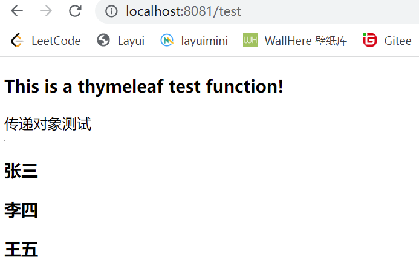

## 1 对象赋值

### 1.1 @Value 方式

$ Student $

`component 用来声明该类是一个组件, 可以通过 Autowired 进行注入`

```java
package com.example.demo.bean;

import org.springframework.beans.factory.annotation.Value;
import org.springframework.stereotype.Component;

@Component
public class Student {
    int id;
    @Value("默认名称")
    String name;
    @Value("18")
    int age;
    @Value("未知")
    String sex;
    String phone;
    String address;     //住址

    public Student(int id, String name, int age, String sex, String phone, String address) {
        this.id = id;
        this.name = name;
        this.age = age;
        this.sex = sex;
        this.phone = phone;
        this.address = address;
    }

    public Student() {
    }

    @Override
    public String toString() {
        return "Student{" +
                "id=" + id +
                ", name='" + name + '\'' +
                ", age=" + age +
                ", sex='" + sex + '\'' +
                ", phone='" + phone + '\'' +
                ", address='" + address + '\'' +
                '}';
    }

    public int getId() {
        return id;
    }

    public void setId(int id) {
        this.id = id;
    }

    public String getName() {
        return name;
    }

    public void setName(String name) {
        this.name = name;
    }

    public int getAge() {
        return age;
    }

    public void setAge(int age) {
        this.age = age;
    }

    public String getSex() {
        return sex;
    }

    public void setSex(String sex) {
        this.sex = sex;
    }

    public String getPhone() {
        return phone;
    }

    public void setPhone(String phone) {
        this.phone = phone;
    }

    public String getAddress() {
        return address;
    }

    public void setAddress(String address) {
        this.address = address;
    }
}

```

$Test$

```java
@SpringBootTest
class DemoApplicationTests {
    @Autowired
    Student student;

    @Test
    void contextLoads() {
        System.out.println(student.toString());
    }
}
>>>
Student{id=0, name='默认名称', age=18, sex='未知', phone='null', address='null'}
```


### 1.2 yaml 配对方式

$ Student $

`ConfigurationProperties 用来匹配 yaml 配置文件名为 person 的对象`

```java
package com.example.demo.bean;

import org.springframework.beans.factory.annotation.Value;
import org.springframework.boot.context.properties.ConfigurationProperties;
import org.springframework.stereotype.Component;

@Component
@ConfigurationProperties(prefix = "person")
public class Student {
    int id;
    @Value("默认名称")
    String name;
    @Value("18")
    int age;
    @Value("未知")
    String sex;
    String phone;
    String address;     //住址

    ...
}
```

$Test$

```java
@SpringBootTest
class DemoApplicationTests {
    @Autowired
    Student student;

    @Test
    void contextLoads() {
        System.out.println(student.toString());
    }

}
```

$application.yaml$

```yaml
person:
  id: 1
  name: 张三
  age: 20
  sex: 男
  phone: 15599955555
  address: 北京朝阳区
```


## 2 JSR303 校验

`分类：Bean Validation 中内置的 constraint`

```
Constraint	详细信息
@Null	被注释的元素必须为 null
@NotNull	被注释的元素必须不为 null
@AssertTrue	被注释的元素必须为 true
@AssertFalse	被注释的元素必须为 false
@Min(value)	被注释的元素必须是一个数字，其值必须大于等于指定的最小值
@Max(value)	被注释的元素必须是一个数字，其值必须小于等于指定的最大值
@DecimalMin(value)	被注释的元素必须是一个数字，其值必须大于等于指定的最小值
@DecimalMax(value)	被注释的元素必须是一个数字，其值必须小于等于指定的最大值
@Size(max, min)	被注释的元素的大小必须在指定的范围内
@Digits (integer, fraction)	被注释的元素必须是一个数字，其值必须在可接受的范围内
@Past	被注释的元素必须是一个过去的日期
@Futuret	被注释的元素必须是一个将来的日期
@Pattern(value)	被注释的元素必须符合指定的正则表达式
```


`分类：Hibernate Validator 附加的 constraint`

```
Constraint	详细信息
@Email	被注释的元素必须是电子邮箱地址
@Length	被注释的字符串的大小必须在指定的范围内
@NotEmpty	被注释的字符串的必须非空
@Range	被注释的元素必须在合适的范围内
```


`使用`

```java
public class User {
  private long id;
  @NotNull//非空
  @Email(message = "必须是邮箱地址类型")//必须是邮箱地址类型
  private String name;
  @Pattern(regexp = "^[A-Z]$/",message = "首字母必须是A-Z")//使用正则表达式自定义校验规则，首字母必须是A-Z
  private String city;
  @NotEmpty
  private String sex;

}
```


## 3 小技巧

### 3.1 设置首页

`将 index.html 放到 public 文件夹下默认访问 index.html`


### 3.2 修改项目网站图标

`将 图标图片修改名称为 favicon.ico 放到 static 文件夹下即可完成修改`


---


### 3.3 项目国际化(中英文切换)

#### ① 在 resources 目录下创建 i18n 目录存放 properties

`这里需要创建 3 个文件, login.properties  login_zh.properties  login_en.properties`

`在配置文件左下角 Resource Bundle 编辑`


#### ②  MyLocaleResolver 类

```java
package com.example.demo.config;

import org.apache.tomcat.jni.Local;
import org.springframework.web.servlet.LocaleResolver;
import org.thymeleaf.util.StringUtils;

import javax.servlet.http.HttpServletRequest;
import javax.servlet.http.HttpServletResponse;
import java.util.Locale;

public class MyLocaleResolver implements LocaleResolver {
    @Override
    public Locale resolveLocale(HttpServletRequest request) {
        String language = request.getParameter("language");
        Locale locale = Locale.getDefault();

        //如果请求语言不为空
        if(!StringUtils.isEmpty(language)){
            String[] split = language.split("_");
            return new Locale(split[0], split[1]);
        }
        return locale;
    }

    @Override
    public void setLocale(HttpServletRequest request, HttpServletResponse response, Locale locale) {

    }
}

```


#### ③ 配置 application.yaml

```yaml
spring:
  messages:
    basename: i18n.login
```

---


### 3.4 SpringBoot 集成 Mybatis 实现用户登录

> 这里我们书写这个的意义不仅是为了实现简单的用户登录功能, 而是为了了解 SpringBoot - MVC 设计模式的基本使用流程。 我们可以通过对用户登录一个功能的学习, 而拓展到各种常见功能如 CRUD 的操作。

#### ① 引入 mybatis 依赖

`引入 mysql 以及 mybatis 依赖`

```xml
<!-- https://mvnrepository.com/artifact/mysql/mysql-connector-java -->
<dependency>
    <groupId>mysql</groupId>
    <artifactId>mysql-connector-java</artifactId>
    <version>8.0.29</version>
</dependency>
<!-- https://mvnrepository.com/artifact/org.mybatis.spring.boot/mybatis-spring-boot-starter -->
<dependency>
    <groupId>org.mybatis.spring.boot</groupId>
    <artifactId>mybatis-spring-boot-starter</artifactId>
    <version>2.2.2</version>
</dependency>
```


#### ② 创建 bean 类

`Admin`

```java
package com.example.demo.bean;

public class Admin {
    int id;
    String username;
    String password;

    public Admin() {
    }

    public Admin(int id, String username, String password) {
        this.id = id;
        this.username = username;
        this.password = password;
    }

    @Override
    public String toString() {
        return "Admin{" +
                "id=" + id +
                ", username='" + username + '\'' +
                ", password='" + password + '\'' +
                '}';
    }

    public int getId() {
        return id;
    }

    public void setId(int id) {
        this.id = id;
    }

    public String getUsername() {
        return username;
    }

    public void setUsername(String username) {
        this.username = username;
    }

    public String getPassword() {
        return password;
    }

    public void setPassword(String password) {
        this.password = password;
    }
}

```


#### ③ mapper 层

`Admin.mapper`

```java
package com.example.demo.mapper;

import com.example.demo.bean.Admin;
import org.apache.ibatis.annotations.Mapper;
import org.springframework.stereotype.Repository;

@Mapper
@Repository
public interface AdminMapper {
    Admin login(Admin user);

    void saveAdmin(Admin user);

    void modAdmin(Admin user);

    Admin findAdminById(int id);
}
```

`AdminMapper.xml`

```xml
<?xml version="1.0" encoding="UTF-8" ?>
<!DOCTYPE mapper
        PUBLIC "-//mybatis.org//DTD Mapper 3.0//EN"
        "http://mybatis.org/dtd/mybatis-3-mapper.dtd">

<!-- 绑定一个 DAO/Mapper 接口 -->
<mapper namespace="com.example.demo.mapper.AdminMapper">
    <select id="login" parameterType="admin" resultType="admin">
        select * from admin where username = #{username} and password = #{password};
    </select>

    <insert id="saveAdmin" parameterType="admin">
        insert into admin(id,username,password)
        values(#{id},#{username},#{password});
    </insert>

    <select id="findAdminById" parameterType="int" resultType="admin">
        select * from admin where id = #{id};
    </select>

    <update id="modAdmin" parameterType="admin" >
        update admin set username = #{username},password = #{password}
        where id = #{id};
    </update>
</mapper>
```


#### ⑤ service 层

`AdminService 接口`

```java
package com.example.demo.services;

import com.example.demo.bean.Admin;
import org.apache.ibatis.annotations.Mapper;
import org.springframework.stereotype.Repository;
import org.springframework.stereotype.Service;

public interface AdminService {
    Admin login(Admin user);

    void signIn(Admin user);

    void modAdmin(Admin user);

    Admin findAdminById(int id);
}
```

`AdminService 实现`

```java
package com.example.demo.services.impl;


import com.example.demo.bean.Admin;
import com.example.demo.mapper.AdminMapper;
import com.example.demo.services.AdminService;
import org.springframework.beans.factory.annotation.Autowired;
import org.springframework.stereotype.Service;

@Service
public class AdminServiceImpl implements AdminService {
    @Autowired
    private AdminMapper adminMapper;

    public Admin login(Admin user) {
        return adminMapper.login(user);
    }

    public void signIn(Admin user) {
        adminMapper.saveAdmin(user);
    }

    public void modAdmin(Admin user) {
        adminMapper.modAdmin(user);
    }

    public Admin findAdminById(int id) {
        return adminMapper.findAdminById(id);
    }
}
```


#### ⑥ controller 层

`AdminController`

```java
package com.example.demo.controller;

import com.example.demo.bean.Admin;
import com.example.demo.services.AdminService;
import org.springframework.beans.factory.annotation.Autowired;
import org.springframework.stereotype.Controller;
import org.springframework.ui.Model;
import org.springframework.web.bind.annotation.RequestMapping;

import java.util.List;

@RequestMapping("/admin")
@Controller
public class AdminController {
    @Autowired
    AdminService adminService;

    @RequestMapping("/login")
    public String login(Admin admin, Model model){
        Admin loginAdmin = adminService.login(admin);
        if(loginAdmin != null){
            return "dashboard";
        } else {
            model.addAttribute("login_msg", "用户名或密码错误!");
            return "index";
        }
    }
}
```


#### ⑦ 前端界面

`index.html 集成 thymeleaf`

```java
<!DOCTYPE html>
<html lang="en" xmlns:th="http://www.thymeleaf.org">
	<head>
		<meta http-equiv="Content-Type" content="text/html; charset=UTF-8">
		<meta name="viewport" content="width=device-width, initial-scale=1, shrink-to-fit=no">
		<meta name="description" content="">
		<meta name="author" content="">
		<title>Signin Template for Bootstrap</title>
		<!-- Bootstrap core CSS -->
		<link th:href="@{asserts/css/bootstrap.min.css}" rel="stylesheet">
		<!-- Custom styles for this template -->
		<link th:href="@{asserts/css/signin.css}" rel="stylesheet">
	</head>

	<body class="text-center">
		<form class="form-signin" th:action="@{/admin/login}">
			
			<h1 class="h3 mb-3 font-weight-normal" th:text="#{login.tips}">Please sign in</h1>
			<label class="sr-only" >Username</label>
			<input type="text" name="username" class="form-control" th:placeholder="#{login.username}" required="" autofocus="">
			<label class="sr-only" >Password</label>
			<input type="password" name="password" class="form-control" th:placeholder="#{login.password}" required="">
			<div class="checkbox mb-3">
				<label>
          <input type="checkbox" value="remember-me"> [[#{login.remember}]]
        </label>
			</div>
			<button class="btn btn-lg btn-primary btn-block" type="submit">[[#{login.btn}]]</button>
			<p class="mt-5 mb-3 text-muted">© 2017-2018</p>
			<a class="btn btn-sm" th:href="@{/index.html(language='zh_CN')}">中文</a>
			<a class="btn btn-sm" th:href="@{/index.html(language='en_US')}">English</a>
		</form>

	</body>

</html>
```


#### ⑧ 数据库

```sql
SET NAMES utf8mb4;
SET FOREIGN_KEY_CHECKS = 0;

-- ----------------------------
-- Table structure for admin
-- ----------------------------
DROP TABLE IF EXISTS `admin`;
CREATE TABLE `admin`  (
  `id` int(0) NOT NULL AUTO_INCREMENT,
  `username` varchar(30) CHARACTER SET utf8 COLLATE utf8_bin NULL DEFAULT NULL,
  `password` varchar(30) CHARACTER SET utf8 COLLATE utf8_bin NULL DEFAULT NULL,
  PRIMARY KEY (`id`) USING BTREE
) ENGINE = InnoDB AUTO_INCREMENT = 2 CHARACTER SET = utf8 COLLATE = utf8_bin ROW_FORMAT = Dynamic;

SET FOREIGN_KEY_CHECKS = 1;
```


#### ⑨ 运行结果


---


### 3.5 SpringBoot 配置拦截器

#### ① 将登录的对象存到 session

`AdminController  核心添加session`

```java
package com.example.demo.controller;

import com.example.demo.bean.Admin;
import com.example.demo.services.AdminService;
import org.springframework.beans.factory.annotation.Autowired;
import org.springframework.boot.web.servlet.server.Session;
import org.springframework.stereotype.Controller;
import org.springframework.ui.Model;
import org.springframework.web.bind.annotation.RequestMapping;

import javax.servlet.http.HttpSession;
import java.util.List;

@Controller
public class AdminController {
    @Autowired
    AdminService adminService;

    @RequestMapping("/admin/login")
    public String login(Admin admin, Model model, HttpSession session){
        Admin loginAdmin = adminService.login(admin);
        if(loginAdmin != null){
            session.setAttribute("loginUser",admin.getUsername());		//core
            return "main-admin";
        } else {
            model.addAttribute("login_msg", "用户名或密码错误!");
            return "index";
        }
    }
}

```


#### ② 自定义拦截器

`LoginInterceptor`

```java
package com.example.demo.config;

import com.example.demo.bean.Admin;
import org.springframework.web.servlet.HandlerInterceptor;

import javax.servlet.http.HttpServletRequest;
import javax.servlet.http.HttpServletResponse;

public class LoginInterceptor implements HandlerInterceptor {
    @Override
    public boolean preHandle(HttpServletRequest request, HttpServletResponse response, Object handler) throws Exception {
        Object admin = request.getSession().getAttribute("loginUser");
        if(admin == null){
            request.setAttribute("login_msg","没有权限,请先登录!");
            request.getRequestDispatcher("/index.html").forward(request,response);
            return false;
        } else {
            return true;
        }
    }
}
```


#### ③  在 WebMvcConfigurer 中注册拦截器

`WebConfiger  这里需要主要排除的拦截资源,防止登录页面或者样式资源被拦截的情况`

```java
package com.example.demo.config;

import org.springframework.context.annotation.Bean;
import org.springframework.context.annotation.Configuration;
import org.springframework.web.servlet.LocaleResolver;
import org.springframework.web.servlet.config.annotation.InterceptorRegistry;
import org.springframework.web.servlet.config.annotation.ViewControllerRegistry;
import org.springframework.web.servlet.config.annotation.WebMvcConfigurer;

@Configuration
public class WebConfiger implements WebMvcConfigurer {

    @Override
    public void addViewControllers(ViewControllerRegistry registry) {
        registry.addViewController("/").setViewName("index");
        registry.addViewController("/index.html").setViewName("index");
        registry.addViewController("/main.html").setViewName("main-admin");
    }

    //自定义国际化组件
    @Bean
    public LocaleResolver localeResolver() {
        return new MyLocaleResolver();
    }

    @Override
    public void addInterceptors(InterceptorRegistry registry) {
        registry.addInterceptor(new LoginInterceptor()).
                addPathPatterns("/**").
                excludePathPatterns("/index.html","/","/admin/login","/asserts/**");
    }
}
```

---


### 3.6 SpringBoot 集成 Mybatis 实现用户登录

#### ① 引入 pom 依赖

```xml
<!-- 引入 mail -->
<dependency>
    <groupId>org.springframework.boot</groupId>
    <artifactId>spring-boot-starter-mail</artifactId>
</dependency>
```


#### ② 发送邮件

```java
@SpringBootTest
class DemoApplicationTests {
    @Autowired
    Student student;

    @Autowired
    JavaMailSenderImpl mailSender;

    @Test
    void contextLoads() {
        //简单邮件
        SimpleMailMessage mailMessage = new SimpleMailMessage();
        mailMessage.setSubject("邮件测试");
        mailMessage.setText("这是一封测试邮件");

        mailMessage.setFrom("1719831051@qq.com");
        mailMessage.setTo("1152329507@qq.com");
        mailSender.send(mailMessage);
    }

    @Test
    void contextLoads2() throws MessagingException, IOException {
        //复杂邮件
        MimeMessage mimeMessage = mailSender.createMimeMessage();
        MimeMessageHelper helper = new MimeMessageHelper(mimeMessage, true);

        String str = "";
        String fileName = "D:\\Codes\\WEB\\Springboot-project\\src\\main\\resources\\templates\\mail.html";
        try (Scanner sc = new Scanner(new FileReader(fileName))) {
            while (sc.hasNextLine()) {  //按行读取字符串
                String line = sc.nextLine();
                str += line;
            }
        }
        System.out.println(str);


        helper.setSubject("邮件测试");
        helper.setText(str,true);

        //添加附件
        helper.addAttachment("1.jpg",new File("C:\\Users\\闫晶\\Pictures\\1.jpg"));

        helper.setFrom("1719831051@qq.com");
        helper.setTo("1152329507@qq.com");
        mailSender.send(mimeMessage);
    }
}
```

---


## 4 thymeleaf 模板引擎

### 4.1 初探 thumeleaf

#### ① 引入 pom 依赖

```xml
<dependency>
    <groupId>org.springframework.boot</groupId>
    <artifactId>spring-boot-starter-thymeleaf</artifactId>
    <version>2.6.7</version>
</dependency>
```


#### ② Controller 映射

```java
@Controller
public class IndexController {
    @RequestMapping("/test")
    public String testThymeleaf(Model model){
        model.addAttribute("msg","传递对象测试");
        return "thymeleaf";
    }
}
```


#### ③ themeleaf.html

```html
<!DOCTYPE html>
<html lang="en" xmlns:th="http://www.thymeleaf.org">
<head>
  <meta charset="UTF-8">
  <title>Title</title>
</head>
<body>
<h3>This is a thymeleaf test function!</h3>
<div th:text="${msg}"></div>

</body>
</html>
```


#### ④ 结果


---


### 4.2  thymeleaf 语法

#### 4.2.1 常用语法(each & if)

$基本语法文档$     http://c.biancheng.net/spring_boot/thymeleaf.html

##### ① themeleaf.html

```html
<!DOCTYPE html>
<html lang="en" xmlns:th="http://www.thymeleaf.org">
<head>
  <meta charset="UTF-8">
  <title>Title</title>
</head>
<body>
<h3>This is a thymeleaf test function!</h3>
<div th:text="${msg}"></div>

</body>
</html>
```


##### ② Controller 映射

```java
@Controller
public class IndexController {
    @RequestMapping("/test")
    public String testThymeleaf(Model model){
        model.addAttribute("msg","传递对象测试");
        model.addAttribute("list", Arrays.asList("张三","李四","王五"));
        model.addAttribute("isShow","true");
        return "thymeleaf";
    }
}
```


##### ③ 结果



---


## 5 SpringSecurity 使用

### 5.1 使用步骤

#### ① 引入 pom 依赖

```xml
 <!-- https://mvnrepository.com/artifact/org.springframework.boot/spring-boot-starter-thymeleaf -->
<dependency>
    <groupId>org.springframework.boot</groupId>
    <artifactId>spring-boot-starter-thymeleaf</artifactId>
    <version>2.6.7</version>
</dependency>

<!-- security架包 -->
<dependency>
    <groupId>org.springframework.boot</groupId>
    <artifactId>spring-boot-starter-security</artifactId>
</dependency>

<!--引入thymeleaf与Spring Security整合的依赖-->
<dependency>
    <groupId>org.thymeleaf.extras</groupId>
    <artifactId>thymeleaf-extras-springsecurity5</artifactId>
</dependency>
```


#### ② 添加配置文件

```java
package com.example.demo.config;

import org.springframework.security.config.annotation.authentication.builders.AuthenticationManagerBuilder;
import org.springframework.security.config.annotation.web.builders.HttpSecurity;
import org.springframework.security.config.annotation.web.configuration.EnableWebSecurity;
import org.springframework.security.config.annotation.web.configuration.WebSecurityConfiguration;
import org.springframework.security.config.annotation.web.configuration.WebSecurityConfigurerAdapter;
import org.springframework.security.crypto.bcrypt.BCryptPasswordEncoder;

//开启拦截器
@EnableWebSecurity
public class SecurityConfig extends WebSecurityConfigurerAdapter {

    //授权规则
    @Override
    protected void configure(HttpSecurity http) throws Exception {
        //请求授权的规则
        http.authorizeRequests()
                .antMatchers("/").permitAll()
                .antMatchers("/level1/**").hasRole("vip1")
                .antMatchers("/level2/**").hasRole("vip2")
                .antMatchers("/level3/**").hasRole("vip3");

        //没有权限默认跳转登录页
        //定制登录页
        http.formLogin().loginPage("/toLogin").usernameParameter("user").passwordParameter("pwd").loginProcessingUrl("/login");
        //开启注销
        http.logout().logoutSuccessUrl("/security");
        //开启记住我 cookie 默认保存两周
        http.rememberMe().rememberMeParameter("remember");
    }

    //认证规则
    //密码需要加密
    @Override
    protected void configure(AuthenticationManagerBuilder auth) throws Exception {
        //类引用
        auth.inMemoryAuthentication().passwordEncoder(new BCryptPasswordEncoder())
                .withUser("vip1").password(new BCryptPasswordEncoder().encode("1")).roles("vip1")
                .and()
                .withUser("vip2").password(new BCryptPasswordEncoder().encode("1")).roles("vip2")
                .and()
                .withUser("vip3").password(new BCryptPasswordEncoder().encode("1")).roles("vip3")
                .and()
                .withUser("root").password(new BCryptPasswordEncoder().encode("1")).roles("vip1","vip2","vip3");

        //数据库引用
    }
}
```


#### ③ 整合 Thymeleaf

> `注意:`
>
> `xmlns:th="http://www.thymeleaf.org"`
>
> `xmlns:sec="http://www.thymeleaf.org/extras/spring-security">`
>
> `是必须引入的命名空间, 这样 thymeleaf 才能够被引用使用`


$security.html$

```html
<!DOCTYPE html>
<html lang="en" xmlns:th="http://www.thymeleaf.org" xmlns:sec="http://www.thymeleaf.org/extras/spring-security">
<head>
    <meta charset="UTF-8">
    <meta name="viewport" content="width=device-width, initial-scale=1, maximum-scale=1">
    <title>首页</title>
    <link th:href="@{/qinjiang/css/semantic.min.css}" rel="stylesheet">
    <link th:href="@{/qinjiang/css/qinstyle.css}" rel="stylesheet">
</head>
<body>

<!--主容器-->
<div class="ui container">

    <div class="ui segment" id="index-header-nav" th:fragment="nav-menu">
        <div class="ui secondary menu">
            <a class="item"  th:href="@{/security}">首页</a>

            <!--登录注销-->
            <div class="right menu">
              <!--未登录-->
              <div sec:authorize="!isAuthenticated()">
                  <a class="item" th:href="@{/toLogin}">
                    <i class="address card icon"></i> 登录
                  </a>
              </div>

              <div sec:authorize="isAuthenticated()">
                  <a class="item">
                    登录名：<span sec:authentication="name"></span>
                    角色权限：<span sec:authentication="principal.authorities"></span>
                    <!-- 获取登录用户名 -->
                    Username：<span sec:authentication="principal.username"></span>
                    <!-- 获取登录的其他属性，比如密码 -->
                    Password：<span sec:authentication="principal.password"></span>
                  </a>
              </div>

              <!--已登录 -->
              <div sec:authorize="isAuthenticated()">
                  <a class="item" th:href="@{/logout}">
                    <i class="address card icon"></i> 注销
                  </a>
              </div>

            </div>
        </div>
    </div>

    <div class="ui segment" style="text-align: center">
        <h3>Spring Security Study by 秦疆</h3>
    </div>

    <div>
        <br>
        <div class="ui three column stackable grid">
            <div class="column" sec:authorize="hasRole('vip1')">
                <div class="ui raised segment">
                    <div class="ui">
                        <div class="content">
                            <h5 class="content">Level 1</h5>
                            <hr>
                            <div><a th:href="@{/level1/1}"><i class="bullhorn icon"></i> Level-1-1</a></div>
                            <div><a th:href="@{/level1/2}"><i class="bullhorn icon"></i> Level-1-2</a></div>
                            <div><a th:href="@{/level1/3}"><i class="bullhorn icon"></i> Level-1-3</a></div>
                        </div>
                    </div>
                </div>
            </div>

            <div class="column" sec:authorize="hasRole('vip2')">
                <div class="ui raised segment">
                    <div class="ui">
                        <div class="content">
                            <h5 class="content">Level 2</h5>
                            <hr>
                            <div><a th:href="@{/level2/1}"><i class="bullhorn icon"></i> Level-2-1</a></div>
                            <div><a th:href="@{/level2/2}"><i class="bullhorn icon"></i> Level-2-2</a></div>
                            <div><a th:href="@{/level2/3}"><i class="bullhorn icon"></i> Level-2-3</a></div>
                        </div>
                    </div>
                </div>
            </div>

            <div class="column" sec:authorize="hasRole('vip3')">
                <div class="ui raised segment">
                    <div class="ui">
                        <div class="content">
                            <h5 class="content">Level 3</h5>
                            <hr>
                            <div><a th:href="@{/level3/1}"><i class="bullhorn icon"></i> Level-3-1</a></div>
                            <div><a th:href="@{/level3/2}"><i class="bullhorn icon"></i> Level-3-2</a></div>
                            <div><a th:href="@{/level3/3}"><i class="bullhorn icon"></i> Level-3-3</a></div>
                        </div>
                    </div>
                </div>
            </div>

        </div>
    </div>
    
</div>


<script th:src="@{/qinjiang/js/jquery-3.1.1.min.js}"></script>
<script th:src="@{/qinjiang/js/semantic.min.js}"></script>

</body>
</html>
```


$login.html$

```html
<!DOCTYPE html>
<html lang="en" xmlns:th="http://www.thymeleaf.org">
<head>
    <meta charset="UTF-8">
    <meta name="viewport" content="width=device-width, initial-scale=1, maximum-scale=1">
    <title>登录</title>
    <!--semantic-ui-->
  <link th:href="@{/qinjiang/css/semantic.min.css}" rel="stylesheet">
</head>
<body>

<!--主容器-->
<div class="ui container">

    <div class="ui segment">

        <div style="text-align: center">
            <h1 class="header">登录</h1>
        </div>

        <div class="ui placeholder segment">
            <div class="ui column very relaxed stackable grid">
                <div class="column">
                    <div class="ui form">
                        <form th:action="@{/login}" method="post">
                            <div class="field">
                                <label>Username</label>
                                <div class="ui left icon input">
                                    <input type="text" placeholder="Username" name="user">
                                    <i class="user icon"></i>
                                </div>
                            </div>
                            <div class="field">
                                <label>Password</label>
                                <div class="ui left icon input">
                                    <input type="password" name="pwd">
                                    <i class="lock icon"></i>
                                </div>
                            </div>
                          <div class="field">
                            <input type="checkbox" name="remember"> 记住我
                          </div>
                            <input type="submit" class="ui blue submit button"/>
                        </form>
                    </div>
                </div>
            </div>
        </div>

        <div style="text-align: center">
            <div class="ui label">
                </i>注册
            </div>
            <br><br>
            <small>blog.kuangstudy.com</small>
        </div>
        <div class="ui segment" style="text-align: center">
            <h3>Spring Security Study by 秦疆</h3>
        </div>
    </div>

</div>

<script th:src="@{/qinjiang/js/jquery-3.1.1.min.js}"></script>
<script th:src="@{/qinjiang/js/semantic.min.js}"></script>

</body>
</html>
```


#### ④ 结果

>以上代码完成了: 
>
>1、用户拦截: 	未登录时跳转到登录界面
>
>2、认证与授权:    给不同的用户授予不同的权限(认证)     设定用户访问的页面所需权限(拦截)
>
>3、注销:  注销之前的登录
>
>4、记住我:  存到 cookie , 保存时间2周


## 6 SpringCache 使用

### 6.1 注解介绍

#### (1) @Cacheable

如果缓存中不存在目标值，则将调用目标方法并将返回的值存入缓存；如果存在，则直接返回缓存中的值，不会执行方法体。即使方法体内进行了数据库的更新操作，也不会执行。

该注解常用参数如下：

- cacheNames/value ：存储方法调用结果的缓存的名称
- key ：缓存数据使用的key，可以用它来指定，key="#param"可以指定参数值，也可以是其他属性

- keyGenerator ：key的生成器，用来自定义key的生成，与key为二选一，不能兼存
- condition：用于使方法缓存有条件，默认为"" ，表示方法结果始终被缓存。conditon="#id>1000"表示id>1000的数据才进行缓存
- unless：用于否决方法缓存，此表达式在方法被调用后计算，因此可以引用方法返回值(result)，默认为"" ，这意味着缓存永远不会被否决。unless = "#result==null"表示除非该方法返回值为null，否则将方法返回值进行缓存
- sync ：是否使用异步模式，默认为false不使用异步


#### (2) @CachePut

如果缓存中先前存在目标值，则更新缓存中的值为该方法的返回值；如果不存在，则将方法的返回值存入缓存。

该注解常用参数同@Cacheable，不过@CachePut没有sync 这个参数


#### (3) @CacheEvict

如果缓存中存在存在目标值，则将其从缓存中删除
该注解常用参数如下：

- cacheNames/value、key、keyGenerator、condition同@Cacheable
- allEntries：如果指定allEntries为true，Spring Cache将忽略指定的key清除缓存中的所有元素，默认情况下为false。
- beforeInvocation：删除缓存操作默认是在对应方法成功执行之后触发的，方法如果因为抛出异常而未能成功返回时也不会触发删除操作。如果指定beforeInvocation为true ，则无论方法结果如何，无论方法是否抛出异常都会导致删除缓存。


### 6.2 SpringCache + mybatisplus分页

#### ① 依赖

```xml
<dependency>
    <groupId>com.baomidou</groupId>
    <artifactId>mybatis-plus-boot-starter</artifactId>
    <version>3.4.2</version>
</dependency>

<dependency>
    <groupId>org.springframework.boot</groupId>
    <artifactId>spring-boot-starter-data-redis</artifactId>
</dependency>

<dependency>
    <groupId>org.springframework.boot</groupId>
    <artifactId>spring-boot-starter-cache</artifactId>
</dependency>
```


#### ② 主启动类

`主启动类添加 @EnableCaching`

```java
@SpringBootApplication
@EnableCaching
public class DemoApplication {
    public static void main(String[] args) {
        SpringApplication.run(DemoApplication.class, args);
    }
}
```


#### ③ MybatisConfig 分页配置

```java
/**
 * 配置 MP 分页插件
 */
@Configuration
public class MybatisPlusConfig {
    @Bean
    public MybatisPlusInterceptor mybatisPlusInterceptor(){
        MybatisPlusInterceptor mybatisPlusInterceptor = new MybatisPlusInterceptor();
        mybatisPlusInterceptor.addInnerInterceptor(new PaginationInnerInterceptor());
        return mybatisPlusInterceptor;
    }
}
```


#### ④ Controller

```java
package com.example.demo.controller;


import com.alibaba.fastjson.JSON;
import com.baomidou.mybatisplus.core.conditions.query.LambdaQueryWrapper;
import com.baomidou.mybatisplus.extension.plugins.pagination.Page;
import com.example.demo.bean.Admin;
import com.example.demo.bean.Staff;
import com.example.demo.services.StaffService;
import com.example.demo.utils.LayuiUtils;
import com.github.pagehelper.PageInfo;
import org.springframework.beans.factory.annotation.Autowired;
import org.springframework.cache.annotation.CacheEvict;
import org.springframework.cache.annotation.CachePut;
import org.springframework.cache.annotation.Cacheable;
import org.springframework.stereotype.Controller;
import org.springframework.ui.Model;
import org.springframework.web.bind.annotation.PathVariable;
import org.springframework.web.bind.annotation.RequestMapping;
import org.springframework.web.bind.annotation.RequestParam;
import org.springframework.web.bind.annotation.ResponseBody;
import org.springframework.web.servlet.ModelAndView;

import javax.servlet.http.HttpSession;
import java.util.List;

/**
 * 在该文件集成了 Redis 缓存
 */

@RequestMapping("/staff")
@Controller
public class StaffController {
    @Autowired
    private StaffService staffService;

    @RequestMapping("/save")
    @ResponseBody
    @CachePut(value = "staffCache", key="object.getId()")  //清理 setmeal 缓存下的所有数据
    public LayuiUtils<List<Staff>> save(Staff object){
        System.out.println("save:"+object.toString());
        staffService.save(object);
        //打印封装数据
        LayuiUtils<List<Staff>> result = new LayuiUtils<List<Staff>>("1", null,1,0);
        return result;
    }

    @RequestMapping("/modify")
    @ResponseBody
    @CacheEvict(value = "staffCache", allEntries = true)  //清理 setmeal 缓存下的所有数据
    public LayuiUtils<List<Staff>> modify(Staff staff){
        System.out.println("modify:"+staff.toString());
        staffService.updateById(staff);
        //打印封装数据
        LayuiUtils<List<Staff>> result = new LayuiUtils<List<Staff>>("1", null,1,0);
        return result;
    }

    //产品删除
    @RequestMapping("/deleteSelected")
    @ResponseBody
    @CacheEvict(value = "staffCache", allEntries = true)  //清理 setmeal 缓存下的所有数据
    public LayuiUtils<List<Staff>> deleteSelected(@RequestParam(value = "id", defaultValue = "") String ids) throws Exception {
        staffService.deleteSelected(ids);
        //打印封装数据
        LayuiUtils<List<Staff>> result = new LayuiUtils<List<Staff>>("1", null,1,0);
        return result;
    }

    @RequestMapping("/loadData/{id}")
    public ModelAndView loadData(@PathVariable("id") int id){
        //type 用来控制返回页面的类型
        ModelAndView mv = new ModelAndView();
        Staff staff = staffService.getById(id);
        //设置模型
        mv.addObject("staff", JSON.toJSONString(staff));
        System.out.println(JSON.toJSONString(staff));
        //设置视图
        mv.setViewName("staff-modify");
        return mv;
    }

    @RequestMapping("/delete")
    @ResponseBody
    @CacheEvict(value = "staffCache", allEntries = true)  //清理 setmeal 缓存下的所有数据
    public LayuiUtils<List<Staff>> delete(@RequestParam(name="id",required = true)String id) {
        System.out.println("delete:"+id);
        staffService.deleteSelected(id);
        //打印封装数据
        LayuiUtils<List<Staff>> result = new LayuiUtils<List<Staff>>("1", null,1,0);
        return result;
    }

    @RequestMapping("/toAdd")
    public String toAdd(){
        return "staff-add";
    }


    @RequestMapping("/toList")
    public String toList(Admin admin, Model model, HttpSession session){
        return "staff-list";
    }

    //采用分页代码方法
    @RequestMapping("/list")
    @ResponseBody
    @Cacheable(value = "staffCache", key="#page", condition="#size == 10")
    //@Cacheable 属性开启后会自动保存方法执行返回的数据, 因此页面修改页面 大小 size 的请求会被忽略直接返回值, 因此需要判断 size 是否发生变化
    public LayuiUtils<List<Staff>> list(@RequestParam(name="page",required = true,defaultValue = "1")int page,@RequestParam(name="limit",required = true,defaultValue = "15")int size) {
        ModelAndView mv = new ModelAndView();
        //条件构造器对象
        LambdaQueryWrapper<Staff> queryWrapper = new LambdaQueryWrapper<>();
        //添加排序条件，根据sort排序
        queryWrapper.orderByAsc(Staff::getName);
        //进行分页查询
        Page<Staff> pageinfo = new Page<Staff>(page, size);
        staffService.page(pageinfo,queryWrapper);
        System.out.println(page + "  " + size);
        System.out.println(pageinfo.getRecords());

        System.out.println(pageinfo.toString());
        //打印封装数据
        LayuiUtils<List<Staff>> result = new LayuiUtils<List<Staff>>("", pageinfo.getRecords(),0,(int)pageinfo.getTotal());
        return result;
    }

    @RequestMapping("/search")
    @ResponseBody
    public LayuiUtils<List<Staff>> search(String name, String position){
        System.out.println("search:"+name + position);
        Staff staff = new Staff();
        //设置参数
        staff.setName(name);
        staff.setPosition(position);
        LambdaQueryWrapper<Staff> lambdaQueryWrapper = new LambdaQueryWrapper<Staff>();
        lambdaQueryWrapper.like(name != null, Staff::getName,name);
        lambdaQueryWrapper.like(position != null, Staff::getPosition,position);
        List<Staff> staffList = staffService.list(lambdaQueryWrapper);
        //使用PageInfo包装数据
        PageInfo<Staff> pageInfo = new PageInfo<Staff> (staffList,3);
        //打印封装数据
        LayuiUtils<List<Staff>> result = new LayuiUtils<List<Staff>>("", staffList,0,(int)pageInfo.getTotal());
        System.out.println(JSON.toJSONString(result));
        return result;
    }
}
```


