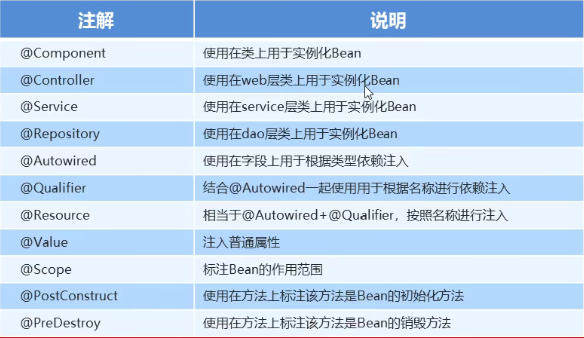
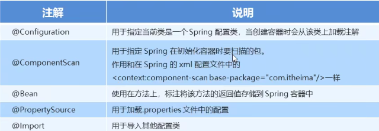
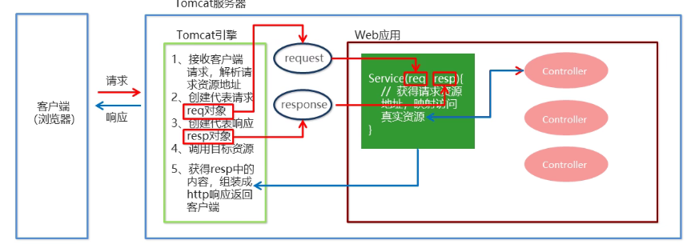
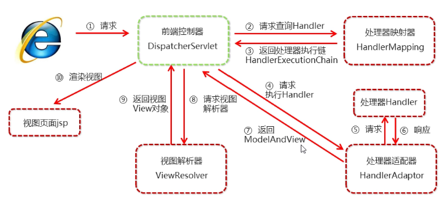
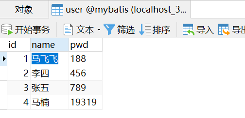
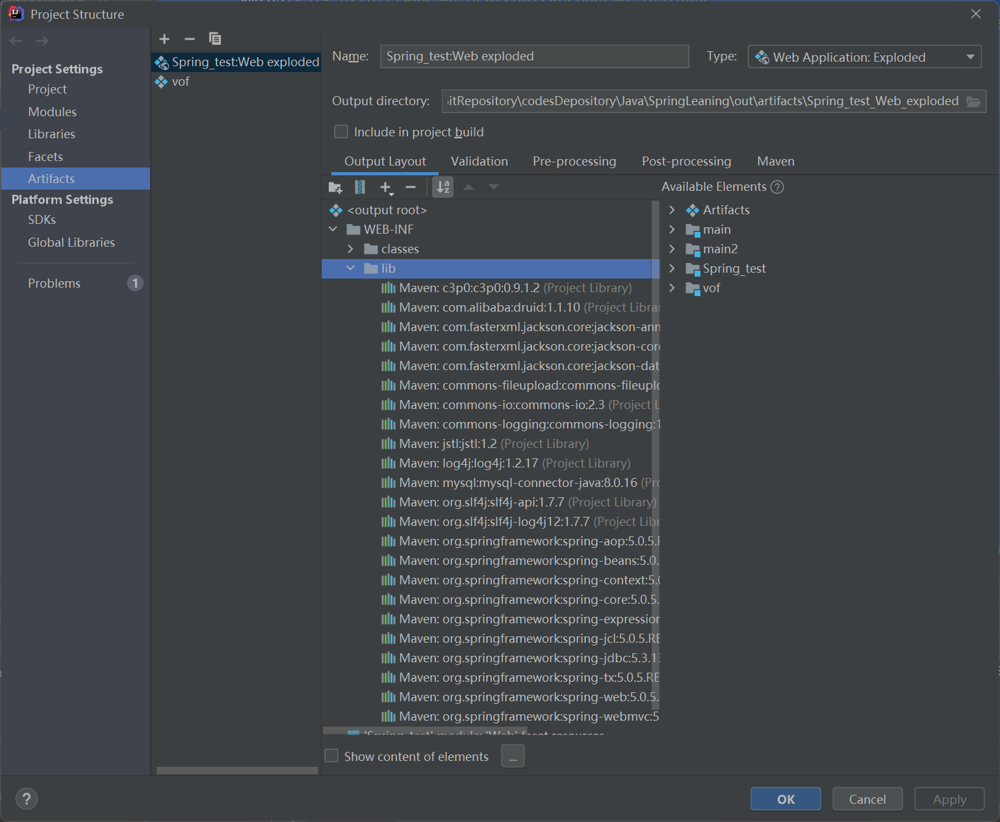
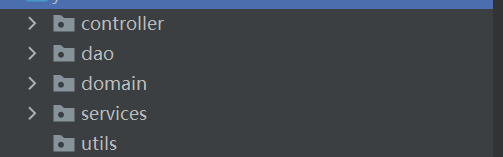
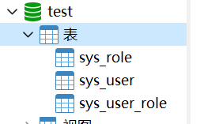
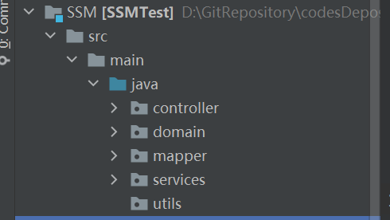

# 1 Spring 开发细节

## 1.1 Spring 开发步骤

1. 导入Spring开发的基本包坐标
2. 编写Dao接口和实现类
3. 创建Spring核心配置文件
4. 在Spring配置文件中配置UserDaolmpl
5. 使用Spring的API获得Bean 实例

---


## 1.2 Spring 引入配置文件(分模块开发)

实际开发中，*Spring* 的配置内容非常多，这就导致 *Spring* 配置很繁杂且体积很大，所以，可以将部分配置拆解到其他配置文件中，而在 *Spring* 主配置文件通过 *import* 标签进行加载。也即对于不同的依赖注入类型, 按照分层(domian、dao、service)、分对象(User、Goods) 等定义不同的 配置文件, 在通过主配置文件对子配置文件进行引用。

```xml
<import resource="applicationcontext-xxx. xml"/>
```

---


# 2 Bean 详解

## 2.1 Bean 属性

```java
<bean id="userDao" class="DAO.impl.UserDaoImpl" scope="prototype" init-method="init" destroy-method="destory"></bean>

id 			唯一性标识
class		依赖包属性
scope		允许创建次数
    singleton		仅允许创建一个,也即多个类对象公用一个bean对象 
    				在加载 xml 配置文件时就创建类对象
    				容器在,对象一直存货
    				应用卸载,容器销毁,对象被销毁
    prototype		允许创建多个, 也即一类对象对应一个bean对象
    				在 生成对象获取Bean 时才创建类对象,创建多次
    				对象在使用中,就一直活着
    				对象长时间不用,就被回收
init-method		指定初始化方法
destroy-method	指定销毁方法  
----------------------------------------------------------------------------
```

---


## 2.2 Bean 实例化方式

- **无参构造**

  ```
  <bean id="userDao" class="DAO.impl.UserDaoImpl"></bean>
  ```

- **工厂静态方法**

  创建**静态**工厂方法, 返回实例化对象

  ```java
  public class staticFactory {
      public static UserDao getUserDao(){
          return new UserDaoImpl();
      }
  }
  
  <bean id="userDao" class="factory.staticFactory" factory-method="getUserDao"></bean>
  ```

- **工厂实例方法**

  方法不需要静态, 但获取时需要先构建 factory 的 Bean 对象, 然后再获取 factory 的 方法

  ```java
  public class DynamicFactory {
      public UserDao getUserDao(){
          return new UserDaoImpl();
      }
  }
  
  <bean id="factory" class="factory.DynamicFactory"></bean>
  <bean id="userDao" factory-bean="factory" factory-method="getUserDao"></bean>
  ```

  

## 2.3 Bean 依赖注入

`概念: 依赖注入指程序运行过程中，如果需要调用另一个对象协助时，无须在代码中创建被调用者，而是依赖于外部的注入。`

### 2.3.1 注入数据类型

- **普通数据类型**

  使用 *get* 方式注入, 需要实现 *get* 方法。

  ```java
  public class UserDaoImpl implements UserDao {
      private String name;
      private int age;
  
  <bean id="userDao" class="DAO.impl.UserDaoImpl" scope="prototype" init-method="init" destroy-method="destory">
  	<property name="name" value="zhangsan"></property>
  	<property name="age" value="18"></property>
  </bean>
  ```

- **其他数据类型**

  在实现类中定义属性并实现 set 方法, 通过在配置文件中定义数据值, 完成数据注入。

  ```java
  public class UserDaoImpl implements UserDao {
      private String name;
      private int age;
      private List<String> stringList;
      private Map<String, User> userMap;
      private Properties properties;
  
  
      public void save() {
          System.out.println("name:"+name+"age:"+age);
          System.out.println("saving...");
          System.out.println(stringList);
          System.out.println(userMap);
          System.out.println(properties);
      }
      
  <bean id="userDao" class="DAO.impl.UserDaoImpl" scope="prototype" init-method="init" destroy-method="destory">
  	<property name="name" value="zhangsan"></property>
  	<property name="age" value="18"></property>
  	<property name="stringList">
  		<list>
  			<value>aaa</value>
  			<value>bbb</value>
  			<value>ccc</value>
  		</list>
  	</property>
  	<property name="userMap">
  		<map>
  			<entry key="u1" value-ref="user1"></entry>
  			<entry key="u2" value-ref="user1"></entry>
  		</map>
  	</property>
  	<property name="properties">
  		<props>
  			<prop key="p1">ppp1</prop>
  			<prop key="p2">ppp2</prop>
  			<prop key="p3">ppp3</prop>
  		</props>
  	</property>
  </bean>
  
  <bean id="user1" class="Domain.User">
  	<property name="name" value="tom"></property>
  	<property name="age" value="13"></property>
  </bean>
  
  <bean id="user2" class="Domain.User">
  	<property name="name" value="linda"></property>
  	<property name="age" value="21"></property>
  </bean>
  ```

---


### 2.3.2 注入数据方式

- ***set* 依赖注入**

  还可以使用 p 命名空间注入

  ```java
  private UserDao userDao;
  public void setUserDao(UserDao userDao){
  	this.userDao = userDao;
  }
  
  <bean id="userService" class="service.impl.UserServiceImpl" scope="prototype">
  	<property name="userDao" ref="userDao"></property>
  </bean>
  ```

- **构造方法 注入**

  ```java
  private UserDao userDao;
  public UserServiceImpl(UserDao userDao) {
  	this.userDao = userDao;
  }
  public UserServiceImpl() {
  }
  
  <bean id="userService" class="service.impl.UserServiceImpl" scope="prototype">
  	<constructor-arg name="userDao" ref="userDao"></constructor-arg>
  </bean>
  ```

---


# 3 Spring API

## 3.1 ApplicationContext 实现类

```wiki
ClassPathXmlApplicationContext
   		它是从类的根路径下加载配置文件推荐使用这种
FileSystemXmlApplicationContext
   		它是从磁盘路径上加载配置文件，配置文件可以在磁盘的任意位置。
AnnotationConfigApplicationContext
   		当使用注解配置容器对象时，需要使用此类来创建spring容器。它用来读取注解。
```


## 3.2 getBean() 方法

```java
//可以获取多个相同对象的 Bean 对象
UserDao userDao = (UserDao) app.getBean("userDao");
public object getBean(string name)throws BeansException {
    assertBeanFactoryActive();
    return getBeanFactory().getBean (name);
}

//不能获取多个相同对象的 Bean 对象   UserService1/UserService2
UserDao userDao = app.getBean(UserService.class);
public <T> T getBean (Class<T> requiredType) throws BeansException {
    assertBeanFactoryActive();
    return getBeanFactory().getBean (requiredType);
}
```

---


# 4 Spring 数据源

`概念: 数据源 (连接池) 是提高程序性能如出现的, 且一般由第三方提供, 在使用前事先实例化数据源，初始化部分连接资源, 使用连接资源时从数据源中获取, 使用完毕后将连接资源归还给数据源。  常见的数据源(连接池): DBCP、C3PO、BoneCP、Druid等`

## 4.1 数据源使用测试

- **C3P0 数据源**

  ```java
  // c3p0 数据源使用测试
  @Test
  public void test1() throws Exception{
      ComboPooledDataSource dataSource = new ComboPooledDataSource();
      dataSource.setDriverClass("com.mysql.jdbc.Driver");
      dataSource.setJdbcUrl("jdbc:mysql://localhost:3306/defect");
      dataSource.setUser("root");
      dataSource.setPassword("yan19991001");
      Connection connection = dataSource.getConnection();
      System.out.println(connection);
      connection.close();
  }
  ```

- **Druid 数据源**

  ```java
  // druid 数据源使用测试
  @Test
  public void test2() throws Exception{
      DruidDataSource dataSource = new DruidDataSource();
      dataSource.setDriverClassName("com.mysql.jdbc.Driver");
      dataSource.setUrl("jdbc:mysql://localhost:3306/defect");
      dataSource.setUsername("root");
      dataSource.setPassword("yan19991001");
      Connection connection = dataSource.getConnection();
      System.out.println(connection);
      connection.close();
  }
  ```

- **读取配置文件方式获取连接参数**

  ```java
  // druid 数据源使用测试 读取配置文件方式
  @Test
  public void test3() throws Exception{
      //获取配置文件
      ResourceBundle resourceBundle = ResourceBundle.getBundle("jdbc");
      String driver = resourceBundle.getString("driver");
      String url = resourceBundle.getString("url");
      String username = resourceBundle.getString("username");
      String password = resourceBundle.getString("password");
      //创建连接源对象
      DruidDataSource dataSource = new DruidDataSource();
      dataSource.setDriverClassName(driver);
      dataSource.setUrl(url);
      dataSource.setUsername(username);
      dataSource.setPassword(password);
      Connection connection = dataSource.getConnection();
      System.out.println(connection);
      connection.close();
  }
  
  //jdbc.properties
  driver=com.mysql.jdbc.Driver
  url=jdbc:mysql://localhost:3306/defect
  username=root
  password=yan19991001
  ```


## 4.2 Spring 自动配置数据源

- **配置 `C3P0` 数据源**

  ```java
  //1、引入 maven 坐标
  <dependency>
      <groupId>org.springframework</groupId>
      <artifactId>spring-context</artifactId>
      <version>5.3.9</version>
  </dependency>
      
  //2、配置 Context 文件
  <bean id="dataSource" class="com.mchange.v2.c3p0.ComboPooledDataSource">
      <property name="driverClass" value="com.mysql.jdbc.Driver"></property>
      <property name="jdbcUrl" value="jdbc:mysql://localhost:3306/defect"</property>
      <property name="user" value="root"></property>
      <property name="password" value="yan19991001"></property>
  </bean>
      
  //3、引用 实例化链接
  @Test
  public void test4() throws Exception{
      ApplicationContext app = new 		
      ClassPathXmlApplicationContext("applicationContext.xml");
      DataSource dataSource = app.getBean(DataSource.class);
      Connection connection = dataSource.getConnection();
      System.out.println(connection);
      connection.close();
  }
  ```

- **引用 properties 配置文件加载参数,配置 `Druid` 数据源**

  ```java
  //Spring 自动加载测试
  @Test
  public void test4() throws Exception{
      ApplicationContext app = new ClassPathXmlApplicationContext("applicationContext.xml");
      DataSource dataSource = app.getBean(DataSource.class);
      Connection connection = dataSource.getConnection();
      System.out.println(connection);
      connection.close();
  }
  ```

  #### 踩坑一

  **注意: 避免数据库链接时,在 `jdbc.properties` 内用户名使用 `username` 命名。`username` 是 `spring` 的 key 中的		一个关键字，所以在使用 `username`的时候，就等于说是调用了这个关键字，而不是 config.properties 中的  `username` 属性值，所以在进行spring的数据库连接池配置时，应该尽可能的避免使用username。**

  使用如下定义即可

  ```properties
  driver=com.mysql.jdbc.Driver
  url=jdbc:mysql://localhost:3306/defect
  user=root
  password=yan19991001
  ```

---


# 5 Spring 注解开发

## 5.1 Spring 原始注解

- **注解方式**

  

  

- **注解使用方法**

  ```c
  //1、注解引入
  @Component("userService")
  public class UserServiceImpl implements UserService {
  
  @Component("userDao")
  public class UserDaoImpl implements UserDao {
      
  @Component("userService")
  public class UserServiceImpl implements UserService {
      @Autowired		//依赖注入,根据数据类型匹配
      @Qualifier("userDao")	//按照名称进行匹配
      private UserDao userDao;
  
  //2、配置文件中说明 Spring 扫描注解的包位置
  <context:component-scan base-package="DAO,service"/>
  ```

- **分类型注入**

  ```java
  //1、注解引入
  @Service("userService")
  public class UserServiceImpl implements UserService {
  
  @Repository("userDao")
  public class UserDaoImpl implements UserDao {
  
  @Component("userService")
  public class UserServiceImpl implements UserService {
      //@Resource 等价于下面两个
      @Autowired		//依赖注入,根据数据类型匹配
      @Qualifier("userDao")	//按照名称进行匹配
      private UserDao userDao;
  
  //2、配置文件中说明 Spring 扫描注解的包位置
  <context:component-scan base-package="DAO,service"/>
  ```

- **变量注入**

  ```java
  //以下需要引入 jdbc.properties 文件到 applicationContext.xml 中
  @Value("${driver}")
  private String driver;
  
  //为注入类型设定是单例还是多例
  @Scope("singleton")
  @Scope("prototype")
  ```

---


## 5.2 新注解方式

### 5.2.1 为什么使用新注解

使用上面的注解还不能全部替代xml配置文件，还需要使用注解替代的配置如下:

- 非自定义的Bean的配置:  `<bean>`
- 加载properties文件的配置: `<contextproperty-placeholder>`组件扫描的配置: 
- `<context:component-scan>`
- 引入其他文件: `<import>`


### 5.2.2 Spring 新注解




### 5.2.3 代码实现

```java
//1、引入 DataSourceConfiguration 配置
//声明是配置类
@Configuration
@ComponentScan({"service","DAO"})
@Import(DataSourceConfiguration.class)
public class SpringConfig {

}

//2、实现数据源配置文件
import javax.sql.DataSource;
@PropertySource("classpath:jdbc.properties")
public class DataSourceConfiguration {
    @Value("${driver}")
    private String driver;
    @Value("${url}")
    private String url;
    @Value("${user}")
    private String user;
    @Value("${password}")
    private String password;

    @Bean("dataSource")
    public DataSource getDataSource(){
        DruidDataSource dataSource = new DruidDataSource();
        dataSource.setDriverClassName("com.mysql.jdbc.Driver");
        dataSource.setUrl("jdbc:mysql://localhost:3306/defect");
        dataSource.setUsername("root");
        dataSource.setPassword("yan19991001");
        return dataSource;
    }
}

//3、测试
public static void main(String[] args) {
    ApplicationContext app = new AnnotationConfigApplicationContext(SpringConfig.class);
    UserService userService = (UserService) app.getBean(UserService.class);
    userService.save();
}
```

---


## 5.3 Spring 集成 Junit

### 5.3.1 问题

每个测试单元都需要引入如下两行代码,因为需要进行容器测试

```
ApplicationContext app = new ClassPathXmlApplicationContext("applicationContext.xml");
DataSource dataSource = app.getBean(DataSource.class);
```

**如何解决**

> ① 让 SpringJunit 创建 Spring 让其, 但是需要将配置文件名称告诉它
>
> ② 将需要进行测试的Bean 直接在测试类中进行注入


### 5.3.2 集成步骤

① 导入 `Spring` 集成 `Junit` 的坐标
② 使用 @`Runwith` 注解替换原来的运行期
③ 使用 @`contextconfiguration` 指定配置文件或配置类
④ 使用 @`Autowired` 注入需要测试的对象
⑤ 创建测试方法进行测试


### 5.3.3 配置代码

- 集成测试

  ```java
  //1、SpringJunitTest
  @RunWith(SpringJUnit4ClassRunner.class)
  @ContextConfiguration("classpath:applicationContext.xml")
  //@ContextConfiguration(classes = {SpringConfig.class})  //使用加载类加载配置
  public class SpringJunitTest {
      @Autowired
      private UserService userService;
  
      @Test
      public void test1(){
          userService.save();
      }
  }
  
  //2、applicationContext.xml
  <dependency>
      <groupId>org.springframework</groupId>
      <artifactId>spring-test</artifactId>
      <version>5.3.9</version>
  </dependency>
  ```

---


# 6 SpringMVC

## 6.1 Spring 集成 web 环境

### 6.1.1 自定义 应用上下文获取方式

`手撕源码`

应用上下文对象是通过 `new ClasspathXmIApplicationContext(spring配置文件)` 方式获取的，但是每次从容器中获得 `Bean` 时都要编写`new ClasspathXmlApplicationContext(spring配置文件)`，这样的弊端是配置文件加载多次，应用上下友对象创建多次。

在Web项目中，可以使用 `ServletContextListener` 监听Web应用的启动，我们可以在 Web 应用启动时，就加载 Spring 的配置文件，创建应用上下文对象`ApplicationContext`，在将其存储到最大的域 `servletContext` 域中，这样就可以在任意位置从域中获得应用上下文 `ApplicationContext` 对象了。

**代码**

```java
//1、监听器
public class ContextLoaderListener implements ServletContextListener {
    //初始化
    public void contextInitialized(ServletContextEvent servletContextEvent) {
        ApplicationContext app = new ClassPathXmlApplicationContext("applicationContext.xml");
        //将上下文对象存储到 ServletContext 域中
        ServletContext servletContext = servletContextEvent.getServletContext();
        servletContext.setAttribute("app",app);
        System.out.println("Spring 容器启动完毕!!!");
    }

    //销毁
    public void contextDestroyed(ServletContextEvent servletContextEvent) {

    }
}

//2、userServlet
public class UserServlet extends HttpServlet {
    @Override
    protected void doGet(HttpServletRequest req, HttpServletResponse resp) throws ServletException, IOException {
//      ApplicationContext app = new ClassPathXmlApplicationContext("applicationContext.xml");
        ServletContext servletContext = this.getServletContext();
        ApplicationContext app = (ApplicationContext) servletContext.getAttribute("app");
        UserService userService = app.getBean(UserService.class);
        userService.save();
    }
}
```

-  **使用 web.xml 初始化配置文件名解耦**

  ```java
  //1、ContextLoaderListener 
  //初始化
  public void contextInitialized(ServletContextEvent servletContextEvent) {
      //将上下文对象存储到 ServletContext 域中
      ServletContext servletContext = servletContextEvent.getServletContext();
  
      //读取 web.xml 的全局参数
      String contextConfigLocation = servletContext.getInitParameter("contextConfigLocation");
      ApplicationContext app = new ClassPathXmlApplicationContext(contextConfigLocation);
  
      servletContext.setAttribute("app",app);
      System.out.println("Spring 容器启动完毕!!!");
  }
  
  //2、web.xml
  <!-- 全局初始化参数 !-->
  <context-param>
      <param-name>contextConfigLocation</param-name>
      <param-value>applicationContext.xml</param-value>
  </context-param>
  ```

- **使用 Utils 解耦 ApplicationContext 名称**

  ```java
  //1、WebApplicationContextUtils
  public class WebApplicationContextUtils {
      public static ApplicationContext getWebApplicationContext(ServletContext servletContext){
          return (ApplicationContext) servletContext.getAttribute("app");
      }
  }
  //2、UserServlet
      @Override
      protected void doGet(HttpServletRequest req, HttpServletResponse resp) throws ServletException, IOException {
  //      ApplicationContext app = new ClassPathXmlApplicationContext("applicationContext.xml");
          ServletContext servletContext = this.getServletContext();
  //        ApplicationContext app = (ApplicationContext) servletContext.getAttribute("app");
          ApplicationContext app = WebApplicationContextUtils.getWebApplicationContext(servletContext);
          UserService userService = app.getBean(UserService.class);
          userService.save();
      }
  ```


### 6.1.2 Spring 提供获取应用上下文的工具

上面的分析不用手动实现，Spring提供了一个监听器 `ContextLoaderListener` 就是对上述功能的封装，该监听器内部加载 `Spring` 配置文件，创建应用上下文对象，并存储到 `ServletContext` 域中，提供了一个客户端工具 `WebApplicationContextUtils` 供使用者获得应用上下文对象。
所以我们需要做的只有两件事:
在web.xml中配置 `ContextLoaderListener` 监听器(导入 spring-web 坐标)使用 `WebApplicationContextUtils` 获得应用上下文对象 `ApplicationContext`

```java
 //1、引入 spring-web 坐标
        <dependency>
            <groupId>org.springframework</groupId>
            <artifactId>spring-web</artifactId>
            <version>5.3.9</version>
            <scope>compile</scope>
        </dependency>

//2、在 web.xml 添加 配置文件参数和监听器
    <!-- 全局初始化参数 !-->
    <context-param>
        <param-name>contextConfigLocation</param-name>
        <param-value>classpath:applicationContext.xml</param-value>
    </context-param>
    
    <!--    配置监听器-->
    <listener>
        <listener-class>org.springframework.web.context.ContextLoaderListener</listener-class>
    </listener>

//3、使用 Spring 提供的监听器
    @Override
    protected void doGet(HttpServletRequest req, HttpServletResponse resp) throws ServletException, IOException {
		//ApplicationContext app = new ClassPathXmlApplicationContext("applicationContext.xml");
        ServletContext servletContext = this.getServletContext();
        //ApplicationContext app = (ApplicationContext) servletContext.getAttribute("app");
        //ApplicationContext app = WebApplicationContextUtils.getWebApplicationContext(servletContext);
        WebApplicationContext app = WebApplicationContextUtils.getWebApplicationContext(servletContext);
        UserService userService = app.getBean(UserService.class);
        userService.save();
    }
```

---


## 6.2 SpringMVC 概述

`SpringMVC` 是一种基于Java的实现`MVC`设计模型的请求驱动类型的轻星级Web框架，属于 `SpringFrameWork` 的后续产品，已经融合在 `Spring WebFlow` 中。
`SpringMVC` 已经成为目前最主流的MVC框架之一，并且随着 `Spring3.0` 的发布，全面超越 `Struts2`，成为最优秀的 `MVC` 框架。它通过一套注解，让一个简单的 Java 类成为处理请求的控制器，而无须实现任何接口。同时它还支持 `RESTful` 编程风格的请求。

---


## 6.3 SpringMVC 快速入门

需求: 客户端发起请求，服务器端接收请求。执行逻辑并进行视图跳转。

- **开发步骤**

  ① 导入SpringMVC相关坐标
  ② 配置SpringMVC核心控制器DispathcerServlet
  ③ 创建Controller类和视图页面
  ④ 使用注解配置Controller类中业务方法的映射地址
  ⑤ 配置SpringMVC核心文件spring-mvc.xml
  ⑥ 客户端发起请求测试

- **代码**

  ```java
  //1、导入坐标 pom.xml
      <dependency>
          <groupId>org.springframework</groupId>
          <artifactId>spring-webmvc</artifactId>
          <version>5.3.9</version>
          <scope>compile</scope>
      </dependency>
  //2、配置前端控制器 web.xml
   <!-- 配置SpringMVC 前端控制器-->
      <servlet>
          <servlet-name>DispatcherServlet</servlet-name>
          <servlet-class>org.springframework.web.servlet.DispatcherServlet</servlet-class>
          <init-param>
              <param-name>contextConfigLocation</param-name>
              <param-value>classpath:spring-mvc.xml</param-value>
          </init-param>
          <load-on-startup>1</load-on-startup>
      </servlet>
      <servlet-mapping>
          <servlet-name>DispatcherServlet</servlet-name>
          <url-pattern>/</url-pattern>
      </servlet-mapping>
  //3、创建 controller 与 jsp
      @Controller
      public class UserController {
          @RequestMapping("/quickStart")
          public String save(){
              System.out.println("Controller Running!!!");
              return "success.jsp";
          }
      }
  
  //4、使用注解配置Controller类中业务方法的映射地址
  	//success.jsp
      <%@ page contentType="text/html;charset=UTF-8" language="java" %>
      <html>
      <head>
          <title>Title</title>
      </head>
      <body>
      <p>Hellow, you are execute a right method, congratulation!!!</p>
      </body>
      </html>
  
  //5、配置SpringMVC核心文件 spring-mvc.xml
      <?xml version="1.0" encoding="UTF-8"?>
      <beans xmlns="http://www.springframework.org/schema/beans"
             xmlns:xsi="http://www.w3.org/2001/XMLSchema-instance"
             xmlns:context="http://www.springframework.org/schema/context"
             xsi:schemaLocation="http://www.springframework.org/schema/beans 	
             	http://www.springframework.org/schema/beans/spring-beans.xsd
              http://www.springframework.org/schema/context http://www.springframework.org/schema/context/spring-context.xsd">
          <!--controller 组件扫描-->
          <context:component-scan base-package="contorller"/>
      </beans>
  //6、测试
  ```

- **流程图**

  

---


## 6.4 SpringMVC 组件解析

### 6.4.1 SpringMVC 执行流程

- **流程图**

  

- **流程**

  ① 用户发送请求至前端控制器 `DispatcherServlet`。
  ② `DispatcherServlet` 收到请求调用`HandlerMapping`处理器映射器。
  ③ 处理器映射器找到具体的处理器(可以根据`xml`配置、注解进行查找)，生成处理器对象及处理器拦截器 (如果有则生成) 一并返回给`DispatcherServlet`。
  ④ `DispatcherServlet` 调用 `HandlerAdapter`处理器适配器。
  ⑤ `HandlerAdapter` 经过适配调用具体的处理器(`Controller`，也叫后端控制器)。
  ⑥ `Controller` 执行完成返回`ModelAndView`,
  ⑦ `HandlerAdapter` 将 `controller`执行结果`ModelAndView`返回给 `DispatcherServlet`。
  ⑧ `DispatcherServlet`将  `ModelAndView`传给`ViewReslover`视图解析器。
  ⑨ `ViewReslover` 解析后返回具体View`,`
  ⑩ `DispatcherServlet` 根据View进行渲染视图(即将模型数据填充至视图中)。`DispatcherServlet`响应用户。

---


### 6.4.2 SpringMVC 组件解析

##### 1) @RequestMapping

```java
作用: 
	用于建立请求URL和处理请求方法之间的对应关系
位置:
	类上，  请求URL的第一级访问目录。此处不写的话，就相当于应用的根目录
	方法上，请求URL的第二级访问目录，与类上的使用@ReqquestMapping标注的一级目录一起组成访问虚拟路径
属性:
	value:  用于指定请求的URL。它和path属性的作用是一样的method:用于指定请求的方式
	params: 用于指定限制请求参数的条件。它支持简单的表达式。要求请求参数的key和value必须和配置的一模一样
例如:
	params = {"accountName"}，表示请求参数必须有  
	params = {"moeny!100"}，  表示请求参数中money不能是100
```


##### 2) SpringMVC 注解解析

- **MVC 命名空间引入**
  命名空间: 

  ```
  xmlns:context="http://www.springframework.org/schema/context"
  xmlns:mvc="http://www.springframework.org/schema/mvc"
  ```

- **约束地址**

  ```xml
  http://www.springframework.org/schema/context
  http://www.springframework.org/schema/context/spring-context.xsd
  http://www.springframework.org/schema/mvc
  http://www.springframework.org/schema/mvc/spring-mvc.xsd
  ```

- **组件扫描**

  springMVC 基于spring容器，所以在进行 `springMVC` 操作时，需要将`controller`存储到 `spring` 容器中，如果使用 `@controller` 注解标注的话，就需要使用如下代码进行组件扫描。

  注解可以配置 include 和 exclude 两种限制包扫描的方式

  ```xml
  <context : component-scan base-package="com.itheima.controller" />
  ```


##### 3) SpringMVC的相关组件

1. 前端控制器:DispatcherServlet
2. 处理器映射器:HandlerMapping
3. 处理器适配器:HandlerAdapter
4. 处理器:Handler
5. 视图解析器: View Resolver
6. 视图: View


##### 4) SpringMVC的注解和配置

请求映射注解:@RequestMappingl

视图解析器配置:

```
REDIRECT_URL_PREFIX = "redirect:"
FORWARD_URL_PREFIX = "forward:"
prefix = "";
suffix = "";
```

---


## 6.5 SpringMVC 数据响应

### 6.5.1 数据响应方式

#### **1) 页面跳转**

- 直接返回字符串·
- 通过ModelAndView对象返回

#### **2) 回写数据**

- 直接返回字符串·
- 返回对象或集含


### 6.5.2 页面跳转

通过 `ModelAndView` 对象返回

#### 1) 方式一

- **代码**

  访问   `/quick2` 即可跳转

  ```java
  @RequestMapping("/quick2")
  public ModelAndView save2(){
      //模型: 封装数据
      //视图: 展示数据
      ModelAndView modelAndView = new ModelAndView();
      //设置模型数据
      modelAndView.addObject("username","super");
      modelAndView.setViewName("success.jsp");
      return modelAndView;
  }
  ```

- **运行结果**

  ```
  Hellow, you are execute a right method, congratulation!!! username = super
  ```


#### 2) 方式二

- **代码**

  `SpingMVC 注入实参`

  ```java
  @RequestMapping("/quick3")
  public ModelAndView save3(ModelAndView modelAndView){
      modelAndView.addObject("username","quick3");
      modelAndView.setViewName("success.jsp");
      return modelAndView;
  }
  
  @RequestMapping("/quick4")
  public String save4(Model model){
      model.addAttribute("username","quick4");
      return "success.jsp";
  }
  
  @RequestMapping("/quick5")
  public String save5(HttpServletRequest servletRequest){
      servletRequest.setAttribute("username","quick5");
      return "success.jsp";
  }
  ```

- **运行结果**

  ```
  Hellow, you are execute a right method, congratulation!!! username = quick3
  Hellow, you are execute a right method, congratulation!!! username = quick4
  Hellow, you are execute a right method, congratulation!!! username = quick5
  ```


### 6.5.3 回写数据

#### 1) 直接返回字符串

Web基础阶段，客户端访问服务器端，如果想直接回写字符串作为响应体返回的话，只需要使用
`response.getWriter().print(“hello world”)` 即可，那么在 `Controller` 中想直接回写字符串该怎样呢?

- **代码**

  ①使用 `HttpServletResponse` 回写

  ②使用注解告知框架返回 `ResponseBody`

  ```java
  //回写数据
  @RequestMapping("/quick6")
  public void save5(HttpServletResponse servletResponse) throws IOException {
      servletResponse.getWriter().print("Hello it's a response print!");
  }
  
  //回写数据
  @RequestMapping("/quick7")
  @ResponseBody
  public String save5() throws IOException {
      return "Hello, it's a response test about SpringMVC auto in!";
  }
  ```

- **打印结果**

  ```
  Hello it's a response print!
  Hello, it's a response test about SpringMVC auto in!
  ```


#### 2) 返回指定格式字符串

- **代码**

  - **引入坐标**

    ```xml
    <dependency>
        <groupId>com.fasterxml.jackson.core</groupId>
        <artifactId>jackson-core</artifactId>
        <version>2.12.3</version>
    </dependency>
    
    <dependency>
        <groupId>com.fasterxml.jackson.core</groupId>
        <artifactId>jackson-databind</artifactId>
        <version>2.12.3</version>
    </dependency>
    <dependency>
        <groupId>com.fasterxml.jackson.core</groupId>
        <artifactId>jackson-annotations</artifactId>
        <version>2.12.3</version>
    </dependency>
    ```

  - **实现**

    ```java
    //回写数据 - 返回指定格式 JSON
    @RequestMapping("/quick8")
    @ResponseBody
    public String save8() throws IOException {
        return "{\"username\":\"zhangsan\",\"age\":\"18\"}";
    }
    
    //使用封装好的工具转换 JSON
    @RequestMapping("/quick9")
    @ResponseBody
    public String save9() throws IOException {
        User user = new User();
        user.setName("zhangsan");
        user.setAge(18);
        //使用 JSON 转换工具进行转换
        ObjectMapper mapper = new ObjectMapper();
        String json = mapper.writeValueAsString(user);
        return json;
    }
    ```

- **结果**

  ```
  {"username":"zhangsan","age":"18"}
  {"username":"zhangsan","age":"18"}
  ```


#### 3) 使用适配器自动转换对象为 JSON 数据

- **XML 配置映射**

  ```xml
  <!--    配置处理器映射器-->
      <bean class="org.springframework.web.servlet.mvc.method.annotation.RequestMappingHandlerAdapter">
          <property name="messageConverters">
              <list>
                  <bean class="org.springframework.http.converter.json.MappingJackson2HttpMessageConverter"/>
              </list>
          </property>
      </bean>
  ```

- **实现**

  ```java
  //适配器自动转换为 JSON 格式
  @RequestMapping("/quick10")
  @ResponseBody
  public User save10() throws IOException {
      User user = new User();
      user.setName("LiSa");
      user.setAge(30);
      return user;
  }
  ```


#### 4) 使用注解替代适配器配置

在方法上添加 `@ResponseBody` 就可以返回 json 格式的字符串，但是这样配置比较麻烦，配置的代码比较多，因此，我们可以使用 mvc 的注解驱动代替上述配置。

在SpringMVC的各个组件中，处理器映射器、处理器适配器、视图解析器称为SpringMVC的三大组件。使用 `mvc:annotation-driven` 自动加载 `RequestMappingHandlerMapping` (处理映射器）和
`RequestMappingHandlerAdapter` (处理适配器），可用在 `Spring-xml.xml` 配置文件中使用`mvc:annotation-driven` 替代注解处理器和适配器的配置。同时使用`mvc:annotation-driven` 默认底层就会集成jackson进行对象或集合的json格式字符串的转换.

- **配置 MVC** 

  ```xml
  xmlns:mvc="http://www.springframework.org/schema/mvc"
  xsi:schemaLocation="
  http://www.springframework.org/schema/mvc http://www.springframework.org/schema/mvc/spring-mvc.xsd"
  ```

- **注解**

  ```xml
  <!--    注解驱动-->
      <mvc:annotation-driven/>
  ```

- **实现**

  ```java
  //适配器自动转换为 JSON 格式
  @RequestMapping("/quick10")
  @ResponseBody
  public User save10() throws IOException {
      User user = new User();
      user.setName("LiSa");
      user.setAge(30);
      return user;
  }
  ```

  

## 6.6 SpringMVC 获取请求数据

### 6.6.1 获取请求参数

客户端请求参数的格式是: `name=value&name=value... ...`
服务器端要获得请求的参数，有时还需要进行数据的封装，SpringMVC可以接收如下类型的参数:

- 基本类型参数
- POJO类型参数(简单 JavaBean)
- 数组类型参数
- 集合类型参数


### 6.6.2 基本类型数据

Controller中的业务方法的参数名称要与请求参数的name一致，参数值会自动映射匹配。
`http://localhost:8080/itheima_springmvc1/quick9?username=zhangsan&age=12`

- **代码**

  ```java
  @RequestMapping("/getData1")
  @ResponseBody
  public void getData1(String username,int age) throws IOException {
      System.out.println(username);
      System.out.println(age);
  }
  ```

- **结果**

  ```
  //请求
  http://localhost:8080/SpringMVC/getData1?username=zhangsan&age=19
  
  zhangsan
  19
  ```

  

### 6.6.3 POJO 类型数据

Controller中的业务方法的POJO参数的属性名与请求参数的name一致，参数值会自动映射匹配。
`http://localhost:8080/itheima_springmvc1/quick9?username=zhangsan&age=12`

- **代码**

  ```java
  //POJO
  @RequestMapping("/getData2")
  @ResponseBody
  public void getData2(User user) throws IOException {
      System.out.println(user.toString());
  }
  ```

- **结果**

  ```
  //请求
  http://localhost:8080/SpringMVC/getData2?username=zhangsan&age=999
  
  User{username='zhangsan', age=999}
  ```

  

### 6.6.4 数组类型数据

`Controller` 中的业务方法的数组名称与请求参数的 `name` 一致，参数值会自动映射匹配。

- **代码**

  ```java
  //数组方式
  @RequestMapping("/getData3")
  @ResponseBody
  public void getData3(String[] list) throws IOException {
      System.out.println(Arrays.asList(list));
  }
  ```

- **结果**

  ```
  //请求
  http://localhost:8080/SpringMVC/getData3?list=aaa&list=bbb&list=ccc
  [aaa, bbb, ccc]
  ```


### 6.6.5 集合类型数据

#### 1) 方式一

获得集合参数时，要将集合参数包装到一个 `POJO` 中才可以。

- **代码**

  - **前端** 

    出现点击 提交按钮 无反应的情况, 后来通过修改成功。 似乎是因为 form 标签没有封闭导致, 写法没问题, 可能是因为内部问题。

    ```jsp
    VO.jsp
    <%@ page contentType="text/html;charset=UTF-8" language="java" %>
    <html>
    <head>
        <title>de1de1</title>
    </head>
    <body>
        <form action="${pageContext.request.contextPath}/getData4" method="post">
            <input type="text" name="userList[0].username"/><br/>
            <input type="text" name="userList[0].age"/><br/>
            <input type="text" name="userList[1].username"/><br/>
            <input type="text" name="userList[1].age"/><br/>
            <input type="submit" name="提交"><br/>
        </form>
    </body>
    </html>
    ```

  - **后端**

    ```java
    //集合方式
    @RequestMapping("/getData4")
    @ResponseBody
    public void getData4(VO vo) throws IOException {
        System.out.println(vo);
    }
    ```

  - **Bean**

    ```java
    package Domain;
    
    import java.util.List;
    
    public class VO {
        private List<User> userList;
    
        public List<User> getUserList() {
            return userList;
        }
    
        public void setUserList(List<User> userList) {
            this.userList = userList;
        }
    
        @Override
        public String toString() {
            return "VO{" +
                    "userList=" + userList +
                    '}';
        }
    }
    ```


#### 2) 方式二

- **前端**

  ```
  <%--
    Created by IntelliJ IDEA.
    User: LAPTOP
    Date: 2021/12/17
    Time: 20:58
    To change this template use File | Settings | File Templates.
  --%>
  <%@ page contentType="text/html;charset=UTF-8" language="java" %>
  <html>
  <head>
      <title>ajax</title>
      <script src="js/jquery-2.1.0.min.js"></script>
      <script>
          var userList = new Array();
          userList.push({username:"zhangsan",age:18});
          userList.push({username:"lisi",age:20});
  
          $.ajax({
              type:"POST",
              url:"${pageContext.request.contextPath}/getData5",
              data:JSON.stringify(userList),
              contentType:"application/json;charset=utf-8"
          })
      </script>
  </head>
  <body>
  
  </body>
  </html>
  
  ```

- **后端**

  ```java
  @RequestMapping("/getData5")
  @ResponseBody
  //名称匹配但是，但是目标对象不匹配 所以 加  @RequestBody
  public void getData5(@RequestBody List<User> userList) throws IOException {
      System.out.println(userList);
  }
  ```

- **资源拦截**

  ```xml
  <servlet-mapping>
      <servlet-name>default</servlet-name>
      <url-pattern>*.js</url-pattern>
  </servlet-mapping>
  ```

- **开发资源的访问**

  ```
  <!--    开发资源的访问-->
  <mvc:resources mapping="/js/**" location="/js/"/>
  ```


### 6.6.6 请求数据乱码问题

通过表单提交数据时, 中文转换会出现乱码的情况, 因此我们需要配置一个 filter 来过滤乱码。

- **XML**

  ```xml
  !--配置全局过滤的filter-->
  <filter>
      <filter-name>CharacterEncodingFilter</filter-name>
      <filter-class>org.springframework.web.filter.CharacterEncodingFilter</filter-class>
      <init-param>
          <param-name>encoding</param-name>
          <param-value>UTF-8</param-value>
      </init-param>
  </filter>
  <filter-mapping>
      <filter-name>CharacterEncodingFilter</filter-name>
      <url-pattern>/*</url-pattern>
  </filter-mapping>
  ```


### 6.6.7 参数绑定注解

当请求的参数名称与Controller的业务方法参数名称不一致时，就需要通过 `@RequestParam` 注解显示的绑定。

- **使用不同的参数名 也可以获取**

  ```java
  @RequestMapping("/setParm")
  @ResponseBody
  public void setParm(@RequestParam(value="name") String username) throws IOException {
      System.out.println(username);
  }
  
  //结果
  zhangsan
  ```

  `@RequestParam(value="name")`

  注解 `@RequestParam` 还有如下参数可以使用:
  `value`: 与请求参数名称
  `required`: 此在指定的请求参数是否必须包括，默认是 true ，提交时如果没有此参数则报错`defaultvalue`: 当没有指定请求参数时，则使用指定的默认值赋值。 赋值到指定的默认值 "111"等


### 6.6.8 获取 Restful 风格的参数

**Restful** 是一种软件 **架构风格、设计风格**，而不是标准，只是提供了一组设计原则和约束条件。主要用于客户端和服务器交互类的软件，基于这个风格设计的软件可以更简洁，更有层次，更易于实现缓存机制等。
**Restful** 风格的请求是使用 **“url+请求方式”** 表示一次请求目的的，HTTP协议里面四个表示操作方式的动词如下:

- GET:用于获取资源
- POST:用于新建资源
- PUT:用于更新资源
- DELETE:用于删除资源

**例如**

```
/user/1  	GET :	   得到id = 1的user
/user/1 	DELETE:		删除 id = 1的user
/user/1 	PUT:		更新id =1的user
/user		POST:		新增user
```

上述url地址 `/user/1` 中的 1 就是要获得的请求参数，在 `SpringMVC` 中可以使用占位符进行参数绑定。地址 `/user/1` 可以写成 `/user/{id}`，占位符 {id} 对应的就是1的值。在业务方法中我们可以使用`@PathVariable` 注解进行占位符的匹配获取工作。

- **代码**

  不需要直到属性名称, 直接赋值

  ```java
  /*
   * Restful 参数 解析请求参数并映射到对应变量
   */
  @RequestMapping("/restful/{username}")
  @ResponseBody
  public void restful(@PathVariable(value="username") String username) throws IOException {
      System.out.println(username);
  }
  ```

- **结果**

  ```
  http://localhost:8080/SpringMVC/restful/zhangsan
  
  zhangsan
  ```


### 6.6.9 自定义类型转换器

SpringMVC 默认已经提供了一些常用的类型转换器, 例如客户端提交的字符串转换成int型进行参数设置。但是不是所有的数据类型都提供了转换器,没有提供的就需要自定义转换器，例如:日期类型的数据就需要自定义转换器。

自定义类型转换器的开发步骤

① 定义转换器类实现 `Converter` 接口

② 在配置文件中声明转换器

③ 在`<annotation-driven>` 中用转换器


`DateConverter`

```java
package converter;


import org.springframework.core.convert.converter.Converter;

import java.text.ParseException;
import java.text.SimpleDateFormat;
import java.util.Date;

public class DateConverter implements Converter<String,Date> {
    public Date convert(String dateStr) {
        SimpleDateFormat  format= new SimpleDateFormat("yyyy-MM-dd");
        Date date = null;
        try {
            date = format.parse(dateStr);
        } catch (ParseException e) {
            e.printStackTrace();
        }
        return date;
    }
}
```


`sping-mvc.xml`

```xml
<!-- MVC注解驱动 -->
<mvc:annotation-driven conversion-service="conversionService"/>

<!-- 声明转换器 -->
<bean id="conversionService" class="org.springframework.context.support.ConversionServiceFactoryBean">
    <property name="converters">
        <list>
            <bean class="converter.DateConverter"></bean>
        </list>
    </property>
</bean>
```


### 6.6.10  获取 Servlet 相关 API

`SpringMVC` 支持使用原始 `ServletAPI` 对象作为控制器方法的参数进行注入,常用的对象如下: 

- HttpServletRequest

- HttpServletResponse
- HttpSession

```java
//获取 Servlet 相关API
@RequestMapping("/getServlet")
@ResponseBody
public void showServlet(HttpServletRequest httpServletRequest, HttpServletResponse httpServletResponse, HttpSession httpSession){
    System.out.println(httpServletRequest);
    System.out.println(httpServletResponse);
    System.out.println(httpSession);
}
```


### 6.6.11 获取请求头

- 使用 `@RequestHeader` 可以获得请求头信息，相当于web阶段学习的 `request.getHeader(name)`
  `@RequestHeader` 注解的属性如下:
  `value`          请求头的名称
  `required`    是否必须携带此请求头

  ```java
  //获取请求头
  @RequestMapping("/getHeader")
  @ResponseBody
  public void getHeader(@RequestHeader("User-Agent") String user_agent){
      System.out.println(user_agent);
  }
  ```

  

- 使用 `@CookieValue` 可以获得 `cookie` 的值
  使用 `@CookieValue` 可以获得指定 `Cookie` 的值
  `@CookieValue` 注解的属性如下:
  `value`          指定 `cookie` 的名称
  `required`    是否必须携带此 `cookie`

  ```java
  //获取 Cookie 的值
  @RequestMapping("/getCookie")
  @ResponseBody
  public void getCookie(@CookieValue("JSESSIONID") String sessionid){
      System.out.println(sessionid);
  }
  ```


### 6.6.12 文件上传

#### 1) 文件上传客户端三要素

- 表单项 `type= "file"`
- 表单的提交方式是 `post`
- 表单的 `enctype` 属性是多部分表单形式， 及 `enctype= "multipart/form-data"` 


#### 2) 文件上传原理

- 当form表单修改为多部分表单时，`request.getParameter0` 将失效。
  `enctype= " application/x-www-form-urlencoded"` 时, form表单的正文内容格式是:
  `key=value&key= value&key=value`
- 当 `form` 表单的 `enctype` 取值为 `Mutilpart/form-data` 时,请求正文内容就变成多部分形式:


#### 3) 单文件上传步骤

**① 导入 `fileupload` 和 IO坐标**

`upload.jsp`

```jsp
<%@ page contentType="text/html;charset=UTF-8" language="java" %>
<html>
<head>
    <title>Title</title>
</head>
<body>
    <form action="${pageContext.request.contextPath}/upload" method="post" enctype="multipart/form-data">
        名称: <input type="text" name="username"/> <br>
        文件: <input type="file" name="uploadFile"/><br>
        <input type="submit"value="提交">
    </form>
</body>
</html>
```


`导入依赖`

```xml
<!-- 文件上传 -->
<dependency>
    <groupId>commons-fileupload</groupId>
    <artifactId>commons-fileupload</artifactId>
    <version>1.3.3</version>
</dependency>
<dependency>
    <groupId>commons-io</groupId>
    <artifactId>commons-io</artifactId>
    <version>2.8.0</version>
</dependency>
```


**② 配置文件上传解析器**

```xml
<!-- 配置上传文件解析器 -->
<bean id="multipartResolver" class="org.springframework.web.multipart.commons.CommonsMultipartResolver">
    <property name="defaultEncoding" value="UTF-8"/>
    <property name="maxUploadSize" value="5000"/>
</bean>
```


**③ 编写文件上传代码**

```java
//上传文件
@RequestMapping("/upload")
@ResponseBody
public void uploadFile(String username, MultipartFile uploadFile) throws IOException{
    System.out.println(username);
    //获取上传文件的名称
    String originalFilename = uploadFile.getOriginalFilename();
    uploadFile.transferTo(new File("C:\\upload\\"+originalFilename));
}
```


#### 4) 多文件上传步骤

**① 导入 `fileupload` 和 IO坐标**

`multupload.jsp`

```jsp
<%@ page contentType="text/html;charset=UTF-8" language="java" %>
<html>
<head>
    <title>Title</title>
</head>
<body>
    <form action="${pageContext.request.contextPath}/multUpload" method="post" enctype="multipart/form-data">
        名称: <input type="text" name="username"/> <br>
        文件1: <input type="file" name="uploadFile"/><br>
        文件2: <input type="file" name="uploadFile"/><br>
        <input type="submit"value="提交">
    </form>
</body>
</html>

```


`导入依赖`

```xml
<!-- 文件上传 -->
<dependency>
    <groupId>commons-fileupload</groupId>
    <artifactId>commons-fileupload</artifactId>
    <version>1.3.3</version>
</dependency>
<dependency>
    <groupId>commons-io</groupId>
    <artifactId>commons-io</artifactId>
    <version>2.8.0</version>
</dependency>
```


**② 配置文件上传解析器**

```xml
<!-- 配置上传文件解析器 -->
<bean id="multipartResolver" class="org.springframework.web.multipart.commons.CommonsMultipartResolver">
    <property name="defaultEncoding" value="UTF-8"/>
    <property name="maxUploadSize" value="5000"/>
</bean>
```


**③ 编写文件上传代码**

```java
//上传文件
@RequestMapping("/multUpload")
@ResponseBody
public void multUpload(String username, MultipartFile[] uploadFile) throws IOException{
    System.out.println(username);
    //获取上传文件的名称
    for(MultipartFile multipartFile : uploadFile){
        String originalFilename = multipartFile.getOriginalFilename();
        multipartFile.transferTo(new File("C:\\upload\\"+originalFilename));
    }
}
```


## 6.7 JdbcTemplate 使用

> 它是 spring 框架中提供的一个对象，是对原始繁琐的Jdbc API对象的简单封装。spring框架为我们提供了很多的操作
> 模板类。例如:操作关系型数据的 `JdbcTemplate` 和 ibernate' Template,操作nosq|数据库的RedisTemplate, 操
> 作消息队列的 `JmsTemplate` 等等。


### 6.7.1 JdbcTemplate开发步骤

①导入spring-jdbc和spring-tx坐标 导包

```xml
<!-- jdbc -->
<dependency>
    <groupId>org.springframework</groupId>
    <artifactId>spring-jdbc</artifactId>
    <version>5.3.13</version>
</dependency>
<!-- https://mvnrepository.com/artifact/org.springframework/spring-tx -->
<dependency>
    <groupId>org.springframework</groupId>
    <artifactId>spring-tx</artifactId>
    <version>5.3.13</version>
</dependency>
```


②创建数据库表和实体




③创建 `JdbcTemplate` 对象

```xml
<!--数据源对象-->
<!-- 加载外部文件-->
<context:property-placeholder location="classpath:jdbc.properties" />
<bean id="dataSource" class="com.alibaba.druid.pool.DruidDataSource">
    <property name="driverClassName" value="${driver}"></property>
    <property name="url" value="${url}"></property>
    <property name="username" value="${user}"></property>
    <property name="password" value="${password}"></property>
</bean>
<!--jdbc模板对象-->
<bean id="jdbcTemplate" class="org.springframework.jdbc.core.JdbcTemplate">
    <property name="dataSource" ref="dataSource"/>
</bean>
```


```properties
driver=com.mysql.cj.jdbc.Driver
url=jdbc:mysql://localhost:3306/mybatis?useSSL=true&useUnicode=true&characterEncoding=UTF8&serverTimezone=Asia/Shanghai
user=root
password=yan19991001
```


④执行数据库操作

```java
@Test
public void add() {
    ApplicationContext applicationContext = new ClassPathXmlApplicationContext("applicationContext.xml");
    JdbcTemplate jdbcTemplate = applicationContext.getBean(JdbcTemplate.class);
    int row = jdbcTemplate.update("delete from user where id = 1");
    System.out.println(row);
}
```


## 7 SpringMVC 拦截器

在系统中，经常需要在处理用户请求之前和之后执行一些行为，例如检测用户的权限，或者将请求的信息记录到日志中，即平时所说的“权限检测”及“日志记录”。当然不仅仅这些，所以需要一种机制，拦截用户的请求，在请求的前后添加处理逻辑。

Spring MVC 提供了 Interceptor 拦截器机制，用于请求的预处理和后处理。

在开发一个网站时可能有这样的需求：某些页面只希望几个特定的用户浏览。对于这样的访问权限控制，应该如何实现呢？拦截器就可以实现上述需求。在 Struts2 框架中，拦截器是其重要的组成部分，Spring MVC 框架也提供了拦截器功能。

Spring MVC 的拦截器（Interceptor）与 Java Servlet 的过滤器（Filter）类似，它主要用于拦截用户的请求并做相应的处理，通常应用在权限验证、记录请求信息的日志、判断用户是否登录等功能上。


`Spring-MVC 配置`

```xml
<!-- 配置拦截器 -->
<mvc:interceptors>
    <!-- 对那些资源进行拦截 -->
    <mvc:interceptor>
        <mvc:mapping path="/**"/>
        <bean class="interceptor.MyIntercepter"/>
    </mvc:interceptor>
</mvc:interceptors>
```


`测试`

```java
package contorller;

import org.springframework.web.bind.annotation.RequestMapping;
import org.springframework.web.servlet.ModelAndView;

public class TargetController {
    @RequestMapping("/target")
    public ModelAndView show(){
        System.out.println("资源执行中...");
        ModelAndView modelAndView = new ModelAndView();
        modelAndView.addObject("name","super");
        modelAndView.setViewName("index");
        return modelAndView;
    }
}
>>>
MyHandlerInterceptor->preHandle 先执行
MyHandlerInterceptor->postHandle 中执行
MyHandlerInterceptor->afterCompletion 完成后执行
```


`自定义拦截器`

下述拦截器的定义中实现了 HandlerInterceptor 接口，并实现了接口中的 3 个方法，说明如下。

- preHandle( )：该方法在控制器的处理请求方法前执行，其返回值表示是否中断后续操作，返回 true 表示继续向下执行，返回 false 表示中断后续操作。
- postHandle( )：该方法在控制器的处理请求方法调用之后、解析视图之前执行，可以通过此方法对请求域中的模型和视图做进一步的修改。
- afterCompletion( )：该方法在控制器的处理请求方法执行完成后执行，即视图渲染结束后执行，可以通过此方法实现一些资源清理、记录日志信息等工作。

```java
package interceptor;

import org.springframework.web.servlet.HandlerInterceptor;
import org.springframework.web.servlet.ModelAndView;

import javax.servlet.http.HttpServletRequest;
import javax.servlet.http.HttpServletResponse;

public class MyIntercepter implements HandlerInterceptor {
    public boolean preHandle(HttpServletRequest request, HttpServletResponse response, Object handler)
            throws Exception {
        System.out.println("MyHandlerInterceptor->preHandle 先执行");
        return true;
    }

    public void postHandle(HttpServletRequest request, HttpServletResponse response, Object handler,
                           ModelAndView modelAndView) throws Exception {
        System.out.println("MyHandlerInterceptor->postHandle 中执行");
    }

    public void afterCompletion(HttpServletRequest request, HttpServletResponse response, Object handler, Exception ex)
            throws Exception {
        System.out.println("MyHandlerInterceptor->afterCompletion 完成后执行");
    }

}
```


## 8 Spring 未集成 MyBatis DEMO

### 步骤

> ① 创建工程(Project&Module)
> ② 导入静态页面(见资料jsp页面)
> ③ 导入需要坐标(见资料中的pom.xml)
> ④ 创建包结构(controller. service、 daokdomain、 utils)
> ⑤ 导入数据库脚本(见资料testsql)
> ⑥ 创建POJO类(见资料User.java和Role.java)
> ⑦ 创建配置文件(applicationContext.xml、 spring-mvc .xml. jdbc properties log4j.properties)


#### 导入坐标 pom.xml

```xml
<?xml version="1.0" encoding="UTF-8"?>
<project xmlns="http://maven.apache.org/POM/4.0.0"
         xmlns:xsi="http://www.w3.org/2001/XMLSchema-instance"
         xsi:schemaLocation="http://maven.apache.org/POM/4.0.0 http://maven.apache.org/xsd/maven-4.0.0.xsd">
    <modelVersion>4.0.0</modelVersion>

    <groupId>vof</groupId>
    <artifactId>vof</artifactId>
    <version>1.0-SNAPSHOT</version>
    <dependencies>
        <dependency>
            <groupId>org.springframework</groupId>
            <artifactId>spring-context</artifactId>
            <version>5.3.9</version>
            <scope>compile</scope>
        </dependency>
        <dependency>
            <groupId>org.springframework</groupId>
            <artifactId>spring-web</artifactId>
            <version>5.3.9</version>
            <scope>compile</scope>
        </dependency>
        <dependency>
            <groupId>org.springframework</groupId>
            <artifactId>spring-webmvc</artifactId>
            <version>5.3.9</version>
            <scope>compile</scope>
        </dependency>
        <dependency>
            <groupId>javax.servlet</groupId>
            <artifactId>servlet-api</artifactId>
            <version>2.5</version>
        </dependency>
        <!-- https://mvnrepository.com/artifact/com.fasterxml.jackson.core/jackson-core -->
        <dependency>
            <groupId>com.fasterxml.jackson.core</groupId>
            <artifactId>jackson-core</artifactId>
            <version>2.12.3</version>
        </dependency>

        <dependency>
            <groupId>com.fasterxml.jackson.core</groupId>
            <artifactId>jackson-databind</artifactId>
            <version>2.12.3</version>
        </dependency>
        <dependency>
            <groupId>com.fasterxml.jackson.core</groupId>
            <artifactId>jackson-annotations</artifactId>
            <version>2.12.3</version>
        </dependency>

        <!-- 文件上传 -->
        <dependency>
            <groupId>commons-fileupload</groupId>
            <artifactId>commons-fileupload</artifactId>
            <version>1.3.3</version>
        </dependency>
        <dependency>
            <groupId>commons-io</groupId>
            <artifactId>commons-io</artifactId>
            <version>2.8.0</version>
        </dependency>

        <!-- jdbc -->
        <dependency>
            <groupId>org.springframework</groupId>
            <artifactId>spring-jdbc</artifactId>
            <version>5.3.13</version>
        </dependency>
        <!-- https://mvnrepository.com/artifact/org.springframework/spring-tx -->
        <dependency>
            <groupId>org.springframework</groupId>
            <artifactId>spring-tx</artifactId>
            <version>5.3.13</version>
        </dependency>

        <!-- https://mvnrepository.com/artifact/com.alibaba/druid -->
        <dependency>
            <groupId>com.alibaba</groupId>
            <artifactId>druid</artifactId>
            <version>1.1.12</version>
        </dependency>
        <!-- mysql 驱动 -->
        <!-- https://mvnrepository.com/artifact/mysql/mysql-connector-java -->
        <dependency>
            <groupId>mysql</groupId>
            <artifactId>mysql-connector-java</artifactId>
            <version>8.0.16</version>
        </dependency>

        <dependency>
            <groupId>junit</groupId>
            <artifactId>junit</artifactId>
            <version>4.12</version>
        </dependency>
    </dependencies>
</project>
```

注意: 这里使用 Tomcat 启动时经常会出现找不到包而引发的错误, 如果遇到可以在 

`ProjectStructure > Artifacts > Output Layout`  下添加对应的包即可




#### 创建包结构




#### 导入数据库脚本




#### 创建POJO类 (Bean) 


#### 创建配置文件


`applicationContext.xml`

```xml
<?xml version="1.0" encoding="UTF-8"?>
<beans xmlns="http://www.springframework.org/schema/beans"
       xmlns:xsi="http://www.w3.org/2001/XMLSchema-instance"
       xmlns:context="http://www.springframework.org/schema/context"
       xsi:schemaLocation="http://www.springframework.org/schema/beans http://www.springframework.org/schema/beans/spring-beans.xsd
http://www.springframework.org/schema/context http://www.springframework.org/schema/context/spring-context.xsd">


    <!--数据源对象-->
    <!-- 加载 jdbc.properties -->
    <context:property-placeholder location="classpath:jdbc.properties" />
    <bean id="dataSource" class="com.alibaba.druid.pool.DruidDataSource">
        <property name="driverClassName" value="${driver}"></property>
        <property name="url" value="${url}"></property>
        <property name="username" value="${user}"></property>
        <property name="password" value="${password}"></property>
    </bean>
    <!--jdbc模板对象-->
    <bean id="jdbcTemplate" class="org.springframework.jdbc.core.JdbcTemplate">
        <property name="dataSource" ref="dataSource"/>
    </bean>

    <!-- 配置 roleService -->
    <bean id="roleService" class="services.RoleServiceImpl">
        <property name="roleDao" ref="roleDao"/>
    </bean>
    <bean id="userService" class="services.UserServiceImpl">
        <property name="userDao" ref="userDao"/>
        <property name="roleDao" ref="roleDao"/>
    </bean>

    <!-- 配置 roleDao -->
    <bean id="roleDao" class="dao.RoleDaoImpl">
        <property name="jdbcTemplate" ref="jdbcTemplate"/>
    </bean>
    <bean id="userDao" class="dao.UserDaoImpl">
        <property name="jdbcTemplate" ref="jdbcTemplate"/>
    </bean>


</beans>
```


 `spring-mvc .xml`

```xml
<?xml version="1.0" encoding="UTF-8"?>
<beans xmlns="http://www.springframework.org/schema/beans"
       xmlns:xsi="http://www.w3.org/2001/XMLSchema-instance"
       xmlns:mvc="http://www.springframework.org/schema/mvc"
       xmlns:context="http://www.springframework.org/schema/context"
       xsi:schemaLocation="http://www.springframework.org/schema/beans http://www.springframework.org/schema/beans/spring-beans.xsd
        http://www.springframework.org/schema/mvc http://www.springframework.org/schema/mvc/spring-mvc.xsd
    http://www.springframework.org/schema/context http://www.springframework.org/schema/context/spring-context.xsd
">


    <!-- mvc注解驱动 -->
    <mvc:annotation-driven/>

    <!-- 视图解析器 配置链接前缀和后缀 -->
    <bean class="org.springframework.web.servlet.view.InternalResourceViewResolver">
        <property name="prefix" value="/pages/"/>
        <property name="suffix" value=".jsp"/>
    </bean>

    <!-- 静态资源的访问权限 -->
    <mvc:default-servlet-handler/>

    <!-- 组件扫描 -->
    <context:component-scan base-package="controller"/>

</beans>
```


 `jdbc properties` 

```properties
driver=com.mysql.cj.jdbc.Driver
url=jdbc:mysql://localhost:3306/test?useSSL=true&useUnicode=true&characterEncoding=UTF8&serverTimezone=Asia/Shanghai
user=root
password=yan19991001
```


`log4j.properties`

```properties
### direct log messages to stdout ###
log4j.appender.stdout=org.apache.log4j.ConsoleAppender
log4j.appender.stdout.Target=System.out
log4j.appender.stdout.layout=org.apache.log4j.PatternLayout
log4j.appender.stdout.layout.ConversionPattern=%d{ABSOLUTE} %5p %c{1}:%L - %m%n

### direct messages to file mylog.log ###
log4j.appender.file=org.apache.log4j.FileAppender
log4j.appender.file.File=c:/mylog.log
log4j.appender.file.layout=org.apache.log4j.PatternLayout
log4j.appender.file.layout.ConversionPattern=%d{ABSOLUTE} %5p %c{1}:%L - %m%n

### set log levels - for more verbose logging change 'info' to 'debug' ###

log4j.rootLogger=info, stdout
```


#### 配置 web.xml

```xml
<?xml version="1.0" encoding="UTF-8"?>
<web-app xmlns="http://xmlns.jcp.org/xml/ns/javaee"
         xmlns:xsi="http://www.w3.org/2001/XMLSchema-instance"
         xsi:schemaLocation="http://xmlns.jcp.org/xml/ns/javaee http://xmlns.jcp.org/xml/ns/javaee/web-app_4_0.xsd"
         version="4.0">

    <!-- 全局初始化参数 -->
    <context-param>
        <param-name>contextConfigLocation</param-name>
        <param-value>classpath:applicationContext.xml</param-value>
    </context-param>
    <!-- Spring 监听器 -->
    <listener>
        <listener-class>org.springframework.web.context.ContextLoaderListener</listener-class>
    </listener>

    <!-- 前端控制器 -->
    <servlet>
        <servlet-name>Dispatcher</servlet-name>
        <servlet-class>org.springframework.web.servlet.DispatcherServlet</servlet-class>
        <init-param>
            <param-name>contextConfigLocation</param-name>
            <param-value>classpath:spring-mvc.xml</param-value>
        </init-param>
    </servlet>
    <servlet-mapping>
        <servlet-name>Dispatcher</servlet-name>
        <url-pattern>/</url-pattern>
    </servlet-mapping>

    <!-- 乱码过滤器 -->
    <filter>
        <filter-name>encodingFilter</filter-name>
        <filter-class>org.springframework.web.filter.CharacterEncodingFilter</filter-class>
        <init-param>
            <param-name>encoding</param-name>
            <param-value>UTF-8</param-value>
        </init-param>
    </filter>
    <filter-mapping>
        <filter-name>encodingFilter</filter-name>
        <url-pattern>/*</url-pattern>
    </filter-mapping>
</web-app>
```


---


## 9 Spring 集成 Mybatis DEMO

### 步骤

#### 导入坐标 pom.xml

```xml
<?xml version="1.0" encoding="UTF-8"?>
<project xmlns="http://maven.apache.org/POM/4.0.0"
         xmlns:xsi="http://www.w3.org/2001/XMLSchema-instance"
         xsi:schemaLocation="http://maven.apache.org/POM/4.0.0 http://maven.apache.org/xsd/maven-4.0.0.xsd">
    <modelVersion>4.0.0</modelVersion>

    <groupId>org.example</groupId>
    <artifactId>SSMTest</artifactId>
    <version>1.0-SNAPSHOT</version>
    <dependencies>
        <!-- https://mvnrepository.com/artifact/mysql/mysql-connector-java -->
        <dependency>
            <groupId>mysql</groupId>
            <artifactId>mysql-connector-java</artifactId>
            <version>8.0.19</version>
        </dependency>
        <dependency>
            <groupId>c3p0</groupId>
            <artifactId>c3p0</artifactId>
            <version>0.9.1.2</version>
        </dependency>
        <dependency>
            <groupId>com.alibaba</groupId>
            <artifactId>druid</artifactId>
            <version>1.1.10</version>
        </dependency>
        <dependency>
            <groupId>junit</groupId>
            <artifactId>junit</artifactId>
            <version>4.12</version>
            <scope>test</scope>
        </dependency>
        <dependency>
            <groupId>org.springframework</groupId>
            <artifactId>spring-context</artifactId>
            <version>5.0.5.RELEASE</version>
        </dependency>
        <dependency>
            <groupId>org.springframework</groupId>
            <artifactId>spring-test</artifactId>
            <version>5.0.5.RELEASE</version>
        </dependency>
        <dependency>
            <groupId>org.springframework</groupId>
            <artifactId>spring-web</artifactId>
            <version>5.0.5.RELEASE</version>
        </dependency>
        <dependency>
            <groupId>org.springframework</groupId>
            <artifactId>spring-webmvc</artifactId>
            <version>5.0.5.RELEASE</version>
        </dependency>
        <dependency>
            <groupId>javax.servlet</groupId>
            <artifactId>javax.servlet-api</artifactId>
            <version>3.0.1</version>
            <scope>provided</scope>
        </dependency>
        <dependency>
            <groupId>javax.servlet.jsp</groupId>
            <artifactId>javax.servlet.jsp-api</artifactId>
            <version>2.2.1</version>
            <scope>provided</scope>
        </dependency>
        <dependency>
            <groupId>com.fasterxml.jackson.core</groupId>
            <artifactId>jackson-core</artifactId>
            <version>2.9.0</version>
        </dependency>
        <dependency>
            <groupId>com.fasterxml.jackson.core</groupId>
            <artifactId>jackson-databind</artifactId>
            <version>2.9.0</version>
        </dependency>
        <dependency>
            <groupId>com.fasterxml.jackson.core</groupId>
            <artifactId>jackson-annotations</artifactId>
            <version>2.9.0</version>
        </dependency>
        <dependency>
            <groupId>commons-fileupload</groupId>
            <artifactId>commons-fileupload</artifactId>
            <version>1.3.1</version>
        </dependency>
        <dependency>
            <groupId>commons-io</groupId>
            <artifactId>commons-io</artifactId>
            <version>2.3</version>
        </dependency>
        <dependency>
            <groupId>commons-logging</groupId>
            <artifactId>commons-logging</artifactId>
            <version>1.2</version>
        </dependency>
        <dependency>
            <groupId>org.slf4j</groupId>
            <artifactId>slf4j-log4j12</artifactId>
            <version>1.7.7</version>
        </dependency>
        <dependency>
            <groupId>log4j</groupId>
            <artifactId>log4j</artifactId>
            <version>1.2.17</version>
        </dependency>
        <dependency>
            <groupId>org.springframework</groupId>
            <artifactId>spring-jdbc</artifactId>
            <version>5.0.5.RELEASE</version>
        </dependency>
        <dependency>
            <groupId>org.springframework</groupId>
            <artifactId>spring-tx</artifactId>
            <version>5.0.5.RELEASE</version>
        </dependency>
        <dependency>
            <groupId>jstl</groupId>
            <artifactId>jstl</artifactId>
            <version>1.2</version>
        </dependency>
        <!-- mybatis -->
        <dependency>
            <groupId>org.mybatis</groupId>
            <artifactId>mybatis</artifactId>
            <version>3.5.2</version>
        </dependency>
        <!-- https://mvnrepository.com/artifact/org.mybatis/mybatis-spring -->
        <dependency>
            <groupId>org.mybatis</groupId>
            <artifactId>mybatis-spring</artifactId>
            <version>2.0.3</version>
        </dependency>
    </dependencies>

    <!--    maven，在build中配置resources，防止一些资源导出失败的问题-->
<!--    <build>-->
<!--        <resources>-->
<!--            <resource>-->
<!--                <directory>src/main/resources</directory>-->
<!--                <includes>-->
<!--                    <include>**/*.properties</include>-->
<!--                    <include>**/*.xml</include>-->
<!--                </includes>-->
<!--                <filtering>true</filtering>-->
<!--            </resource>-->
<!--            <resource>-->
<!--                <directory>src/main/java</directory>-->
<!--                <includes>-->
<!--                    <include>**/*.properties</include>-->
<!--                    <include>**/*.xml</include>-->
<!--                </includes>-->
<!--                <filtering>true</filtering>-->
<!--            </resource>-->
<!--        </resources>-->
<!--    </build>-->
</project>
```


#### 创建包结构




#### 导入数据库脚本


#### 创建 POJO 类

```java
package domain;

public class Role {

    private Long id;
    private String roleName;
    private String roleDesc;

    public Long getId() {
        return id;
    }

    public void setId(Long id) {
        this.id = id;
    }

    public String getRoleName() {
        return roleName;
    }

    public void setRoleName(String roleName) {
        this.roleName = roleName;
    }

    public String getRoleDesc() {
        return roleDesc;
    }

    public void setRoleDesc(String roleDesc) {
        this.roleDesc = roleDesc;
    }

    @Override
    public String toString() {
        return "Role{" +
                "id=" + id +
                ", roleName='" + roleName + '\'' +
                ", roleDesc='" + roleDesc + '\'' +
                '}';
    }
}
```


#### 创建配置文件

`spring-mvc.xml`

```xml
<?xml version="1.0" encoding="UTF8"?>
<beans xmlns="http://www.springframework.org/schema/beans"
       xmlns:xsi="http://www.w3.org/2001/XMLSchema-instance"
       xmlns:mvc="http://www.springframework.org/schema/mvc"
       xmlns:context="http://www.springframework.org/schema/context"
       xsi:schemaLocation="http://www.springframework.org/schema/beans http://www.springframework.org/schema/beans/spring-beans.xsd
        http://www.springframework.org/schema/mvc http://www.springframework.org/schema/mvc/spring-mvc.xsd
    http://www.springframework.org/schema/context http://www.springframework.org/schema/context/spring-context.xsd
">

    <!-- mvc注解驱动 使用@ 类型注解-->
    <mvc:annotation-driven/>

    <!-- 视图解析器 配置访问的前缀和后缀-->
    <bean class="org.springframework.web.servlet.view.InternalResourceViewResolver">
        <property name="prefix" value="/pages/"/>
        <property name="suffix" value=".jsp"/>
    </bean>

    <!-- 静态资源的访问权限 默认方式 -->
    <mvc:default-servlet-handler/>

    <!-- 组件扫描 扫描 controller-->
    <context:component-scan base-package="controller"/>

</beans>
```


`mybatis-config.xml`

```xml
<?xml version="1.0" encoding="UTF8"?>
<!DOCTYPE configuration
        PUBLIC "-//mybatis.org//DTD Config 3.0//EN"
        "http://mybatis.org/dtd/mybatis-3-config.dtd">
<configuration>

    <!-- 给类起别名,方便使用 -->
    <typeAliases>
        <!--方式一 起别名-->
        <!-- <typeAlias type="Bean.User" alias="User"/>-->
        <!--方式二 扫描包,默认以包下的类名的小写 User -> user 作为别名-->
        <package name="domain"/>
    </typeAliases>

<!--    绑定接口-->
<!--    <mappers>-->
<!--        &lt;!&ndash;通用方式, 注册以 Mapper 为结尾的所有 xml 文件&ndash;&gt;-->
<!--        <mapper resource="mapper/*Mapper.xml"/>-->
<!--    </mappers>-->
</configuration>
```


`log4j.properties`

```properties
### direct log messages to stdout ###
log4j.appender.stdout=org.apache.log4j.ConsoleAppender
log4j.appender.stdout.Target=System.out
log4j.appender.stdout.layout=org.apache.log4j.PatternLayout
log4j.appender.stdout.layout.ConversionPattern=%d{ABSOLUTE} %5p %c{1}:%L - %m%n

### direct messages to file mylog.log ###
log4j.appender.file=org.apache.log4j.FileAppender
log4j.appender.file.File=c:/mylog.log
log4j.appender.file.layout=org.apache.log4j.PatternLayout
log4j.appender.file.layout.ConversionPattern=%d{ABSOLUTE} %5p %c{1}:%L - %m%n

### set log levels - for more verbose logging change 'info' to 'debug' ###

log4j.rootLogger=info, stdout
```


`jdbc.properties`

```
driver=com.mysql.cj.jdbc.Driver
url=jdbc:mysql://localhost:3306/test?useSSL=true&useUnicode=true&characterEncoding=UTF8&serverTimezone=Asia/Shanghai
user=root
password=yan19991001
```


`applicationContext.xml`

```xml
<?xml version="1.0" encoding="UTF-8"?>
<beans xmlns="http://www.springframework.org/schema/beans"
       xmlns:xsi="http://www.w3.org/2001/XMLSchema-instance"
       xmlns:context="http://www.springframework.org/schema/context"
       xsi:schemaLocation="http://www.springframework.org/schema/beans http://www.springframework.org/schema/beans/spring-beans.xsd
http://www.springframework.org/schema/context http://www.springframework.org/schema/context/spring-context.xsd">


    <!--数据源对象-->
    <!-- 加载 jdbc.properties -->
    <context:property-placeholder location="classpath:jdbc.properties" />
    <bean id="dataSource" class="com.alibaba.druid.pool.DruidDataSource">
        <property name="driverClassName" value="${driver}"></property>
        <property name="url" value="${url}"></property>
        <property name="username" value="${user}"></property>
        <property name="password" value="${password}"></property>
    </bean>

    <!-- 配置 mybatis  sessionFactory 用于和数据库获取链接并执行事务-->
    <bean name="sessionFactory" class="org.mybatis.spring.SqlSessionFactoryBean">
        <property name="dataSource" ref="dataSource"/>
        <!-- 加载 mybatis 核心文件 -->
        <property name="configLocation" value="classpath:mybatis-config.xml"/>
    </bean>

    <!-- 扫描所有的包 -->
    <bean class="org.mybatis.spring.mapper.MapperScannerConfigurer">
        <property name="basePackage" value="mapper"/>
    </bean>

    <!-- 配置 roleService -->
    <bean id="roleService" class="services.RoleServiceImpl">
    </bean>
</beans>
```


#### 配置 mapper.xml

mapper 跟 dao 的作用一样, 这里我们主需要创建接口, 然后等待框架注入对象即可。

`RoleMapper.java`

```
package mapper;

import domain.Role;

import java.util.List;

public interface RoleMapper {
    List<Role> findAll();

    void save(Role role);

    List<Role> findRoleByUserId(Long id);

    void del(Long roleId);

    Role findById(Long roleId);

    void modify(Role role);
}
```


`RoleMapper.xml`

```xml
<?xml version="1.0" encoding="UTF-8" ?>
<!DOCTYPE mapper
        PUBLIC "-//mybatis.org//DTD Mapper 3.0//EN"
        "http://mybatis.org/dtd/mybatis-3-mapper.dtd">

<!-- 绑定一个 DAO/Mapper 接口 -->
<mapper namespace="mapper.RoleMapper">
    <select id="findAll" resultType="role">
        select * from sys_role;
    </select>

    <select id="findById" parameterType="long" resultType="role">
        select * from sys_role where id = #{id};
    </select>

    <insert id="save" parameterType="role">
        insert into sys_role(id,roleName,roleDesc) values(#{id},#{roleName},#{roleDesc});
    </insert>

    <update id="modify" parameterType="role" >
        update sys_role set roleName = #{roleName},roleDesc = #{roleDesc} where id = #{id};
    </update>

    <delete id="del" parameterType="long">
        delete from sys_role where id = #{id};
    </delete>
</mapper>
```


#### 配置 web.xml

```xml
<?xml version="1.0" encoding="UTF-8"?>
<web-app xmlns="http://xmlns.jcp.org/xml/ns/javaee"
         xmlns:xsi="http://www.w3.org/2001/XMLSchema-instance"
         xsi:schemaLocation="http://xmlns.jcp.org/xml/ns/javaee http://xmlns.jcp.org/xml/ns/javaee/web-app_4_0.xsd"
         version="4.0">

    <!-- 全局初始化参数 -->
    <context-param>
        <param-name>contextConfigLocation</param-name>
        <param-value>classpath:applicationContext.xml</param-value>
    </context-param>
    <!-- Spring 监听器 -->
    <listener>
        <listener-class>org.springframework.web.context.ContextLoaderListener</listener-class>
    </listener>

    <!-- 前端控制器 -->
    <servlet>
        <servlet-name>Dispatcher</servlet-name>
        <servlet-class>org.springframework.web.servlet.DispatcherServlet</servlet-class>
        <init-param>
            <param-name>contextConfigLocation</param-name>
            <param-value>classpath:spring-mvc.xml</param-value>
        </init-param>
    </servlet>
    <servlet-mapping>
        <servlet-name>Dispatcher</servlet-name>
        <url-pattern>/</url-pattern>
    </servlet-mapping>

    <!-- 乱码过滤器 -->
    <filter>
        <filter-name>encodingFilter</filter-name>
        <filter-class>org.springframework.web.filter.CharacterEncodingFilter</filter-class>
        <init-param>
            <param-name>encoding</param-name>
            <param-value>UTF-8</param-value>
        </init-param>
    </filter>
    <filter-mapping>
        <filter-name>encodingFilter</filter-name>
        <url-pattern>/*</url-pattern>
    </filter-mapping>
</web-app>
```


#### 引用 Service

`RoleService 接口`

```java
package services;

import domain.Role;
import org.springframework.jdbc.core.JdbcTemplate;
import org.springframework.stereotype.Service;

import java.util.List;


public interface RoleService {
    List<Role> list();

    void save(Role role);

    void del(Long roleId);

    Role findRoleById(Long roleId);

    void modify(Role role);
}

```


`RoleServiceImpl 实现类`

```java
package services;


import domain.Role;
import mapper.RoleMapper;
import org.springframework.beans.factory.annotation.Autowired;
import org.springframework.stereotype.Service;

import java.util.List;

@Service("roleService")
public class RoleServiceImpl implements RoleService{
    @Autowired
    private RoleMapper roleMapper;

    public List<Role> list() {
        List<Role> roles = roleMapper.findAll();
        return roles;
    }

    public void save(Role role) {
        roleMapper.save(role);
    }

    public void del(Long roleId) {
        roleMapper.del(roleId);
    }

    public Role findRoleById(Long roleId) {
        return roleMapper.findById(roleId);
    }

    public void modify(Role role) {
        roleMapper.modify(role);
    }
}
```


---


