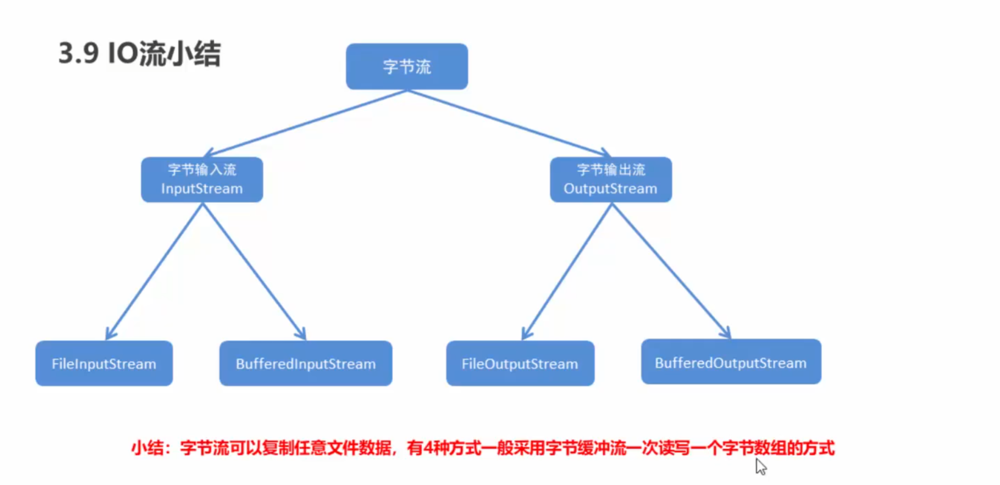
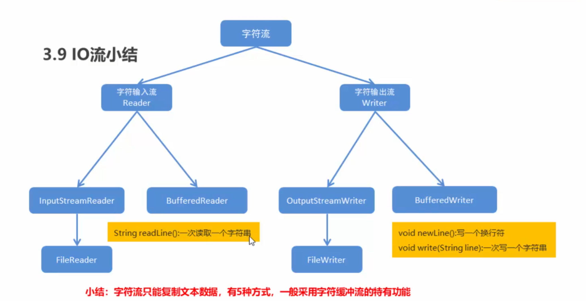
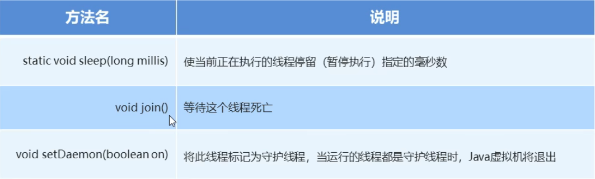
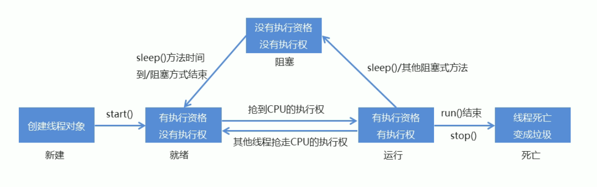
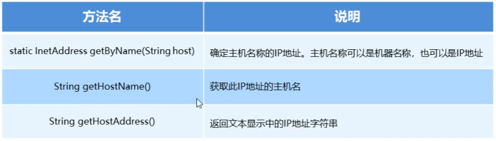

#一    java 基础补充

## 1 数组

### 定义

```java
datatype dataname[] = new datatype[datasize];			//1D
datatype dataname[][] = new datatype[colsize][rowsize];	//2D
datatype dataname[] = {datas};			//initial datas
```

**code**

```java
public class for_each {
    public static void main(String[] args) {
        //一维数组
        double doubleNums[] = new double[10];    //浮点型数组
        int intNums[] = new int[10];            //整型数组
        char chars[] = new char[10];            //字符数组
        float floatNums[] = new float[10];      //浮点型数组
        String strs[] = new String[10];         //字符串数组

        //二维数组
        double d2D[][] = new double[5][5];      //浮点型二维数组
        int i2D[][] = new int[5][5];            //浮点型二维数组
        char c2D[][] = new char[5][5];          //字符型二维数组
        float f2D[][] = new float[5][5];        //浮点型二维数组
        
        //静态初始化
        int array[] = {1,2,3,4};
        double darray[] = {1.0,2.0};s
        char carray[] = {'a','b'};
        String sarray[] = {"1231","123131"};
    }
}
```


### 数组遍历 for-each

 ```
 for(datatype varname : array)
 	...
 ```

**code**

```java
public class for_each {                                       
    public static void main(String[] args) {                  
        String strs[] = new String[10];         //字符串数组       
                                                              
        //初始化变量                                               
        for(int i = 0;i < strs.length;i++)                    
            strs[i] = Integer.toString(i);                    
                                                              
        //for-each 循环                                         
        for(String str : strs)                                
            System.out.print(str + " ");                      
    }                                                         
}     
>>>
0 1 2 3 4 5 6 7 8 9 
```


### 数组操作类 Arrays

`包含用于操作数组的各种方法`

```java
import java.util.Arrays;

public class arrays {
    public static void main(String[] args) {
        int nums[] = {1,3,54,75,8,5,3,241,57,453,213};
        System.out.println("排序前:"+Arrays.toString(nums));
        Arrays.sort(nums);
        System.out.println("排序后:"+Arrays.toString(nums));
    }
}
>>>
排序前:[1, 3, 54, 75, 8, 5, 3, 241, 57, 453, 213]
排序后:[1, 3, 3, 5, 8, 54, 57, 75, 213, 241, 453]
```


## 2 方法重载与重写

### 重载 overload

`方法名相同,参数列表不同或返回值不同`

```java
public class overload {
    public static double sum(int num1,int num2){
        return num1 + num2;
    }

    public static double sum(double num1,double num2){
        return num1 + num2;
    }

    public static int sum(int num1,int num2,int num3){
        return num1 + num2 + num3;
    }

    public static void main(String[] args) {
        System.out.println(sum(1,1));
        System.out.println(sum(1.9,2.3));
        System.out.println(sum(1,1,1));
    }

}
```


### 重写 Override

重写是子类对父类的允许访问的方法的实现过程进行重新编写, 返回值和形参都不能改变。**即外壳不变，核心重写！**

重写的好处在于子类可以根据需要，定义特定于自己的行为。 也就是说子类能够根据需要实现父类的方法。

重写方法不能抛出新的检查异常或者比被重写方法申明更加宽泛的异常。例如： 父类的一个方法申明了一个检查异常 IOException，但是在重写这个方法的时候不能抛出 Exception 异常，因为 Exception 是 IOException 的父类，抛出 IOException 异常或者 IOException 的子类异常。

在面向对象原则里，重写意味着可以重写任何现有方法。

```java
class Animal{
   public void move(){
      System.out.println("动物可以移动");
   }
}
 
class Dog extends Animal{
   public void move(){
      System.out.println("狗可以跑和走");
   }
}
 
public class TestDog{
   public static void main(String args[]){
      Animal a = new Animal(); // Animal 对象
      Animal b = new Dog(); // Dog 对象
 
      a.move();// 执行 Animal 类的方法
 
      b.move();//执行 Dog 类的方法
   }
}
>>>
动物可以移动
狗可以跑和走
```


## 3 杂项

### 关键字

```java
super		//父类
	super.age		//父类成员的年龄
	super.name		//父类成员的姓名
this		//当前类
	this.age	//当前类的年龄
	this.name	//当前类的姓名
final
    final class		//类不可被继承
    final method	//方法不可修改
    final var		//变量不可修改
static		//被类的所有成员共享 
    static method 	//仅可访问静态成员方法
```


### Properties

通常用于配置常用的属性,如 数据库配置文件

$get \ put$

```java
import java.util.HashSet;
import java.util.Properties;
import java.util.Set;

public class Properties_way {
    public static void main(String[] args) {
        Properties properties = new Properties();
        properties.put("1","leader");
        properties.put("2","staff");
        properties.put("3","other");

        //使用set 访问 map集合
        Set<Object> set = properties.keySet();
        for(Object key : set){
            Object value = properties.get(key);
            System.out.println(value);
        }
    }
}
>>>
other
staff
leader
```


$setProperty \ getProperty$

```java
package Properties;

import java.util.Properties;
import java.util.Set;

public class Properties_1 {
    public static void main(String[] args) {
        Properties properties = new Properties();
        properties.setProperty("1","leader");
        properties.setProperty("2","staff");
        properties.setProperty("3","other");

        //获取 value
        System.out.println(properties.getProperty("1"));

        //获取 key 的名称
        Set<String> names = properties.stringPropertyNames();
        for(String key : names){
            String value = properties.getProperty(key);
            System.out.println(key+","+value);
        }
    }
}
>>>
leader
3,other
2,staff
1,leader
```


$load \ store$

```java
package Properties;

import javax.annotation.processing.Filer;
import java.io.FileReader;
import java.io.FileWriter;
import java.io.IOException;
import java.util.Properties;
import java.util.Set;

public class Properties_IO {
    public static void main(String[] args) throws IOException {
        //调用保存方法
        myStore();
        myLoad();
    }

    public static void myLoad() throws IOException {
        Properties properties = new Properties();
        FileReader fileReader = new FileReader("./test.txt");
        properties.load(fileReader);
        fileReader.close();
        System.out.println(properties);
    }

    public static void myStore() throws IOException {
        Properties properties = new Properties();
        properties.setProperty("1","leader");
        properties.setProperty("2","staff");
        properties.setProperty("3","other");

        FileWriter fileWriter = new FileWriter("./test.txt");
        properties.store(fileWriter,null);
        fileWriter.close();
    }
}
>>>
{3=other, 2=staff, 1=leader}
```

---


### Iteator

**迭代器是集合中的概念, 其主要使用在集合的循环迭代中**

```java
// 引入 ArrayList 和 Iterator 类
import java.util.ArrayList;
import java.util.Iterator;

public class RunoobTest {
    public static void main(String[] args) {

        // 创建集合
        ArrayList<String> sites = new ArrayList<String>();
        sites.add("Google");
        sites.add("Runoob");
        sites.add("Taobao");
        sites.add("Zhihu");

        // 获取迭代器
        Iterator<String> it = sites.iterator();

        // 输出集合中的第一个元素
        System.out.println(it.next());
    }
}
```


## 4 集合

### List

#### ArrayList

```java
ArrayList<datatype / object> varname = new ArrayList<datatype>();
```

**code**

```java
import java.util.ArrayList;

public class arraylist {
    public static void main(String[] args) {
        ArrayList<String> arrayList = new ArrayList<String>();
        arrayList.add("war1");
        arrayList.add("war2");
        arrayList.add("war3");
        System.out.println(arrayList);
        arrayList.remove(0);        //删除下标元素
        System.out.println(arrayList);
        arrayList.set(1,"new War");         //设置指定下标元素
        System.out.println(arrayList);
        System.out.println(arrayList.size());   //列表大小
    }
}
```


#### LinkedList

`以链表为数据结构构造的列表`

```java
import java.util.Arrays;
import java.util.LinkedList;

public class linkedlist {
    public static void main(String[] args) {
        LinkedList<String> list = new LinkedList();

        list.add("war1");
        list.add("war2");
        list.add("war3");

        System.out.println(Arrays.toString(list.toArray()));

        list.addFirst("war head");
        list.addLast("war last");
        System.out.println(Arrays.toString(list.toArray()));
        System.out.println(list.getFirst());
        System.out.println(list.getLast());
    }
}
>>>
[war1, war2, war3]
[war head, war1, war2, war3, war last]
war head
war last
```


### Set

`Set 集合不包含重复元素`

#### HashSet

> 底层数据结构是哈希表
>
> 对集合的迭代顺序不作任何保证，也就是说不保证存储和取出的元素顺序一致
>
> 没有带索引的方法，所以不能使用普通for循环遍历
>
> 由于是Set集合，所以是不包含重复元素的集合

```java
import java.util.HashSet;

public class Hashset {
    public static void main(String[] args) {
        HashSet<String> hashSet = new HashSet<String>();
        hashSet.add("war1");
        hashSet.add("war2");
        hashSet.add("war3");
        hashSet.add("war3");
        for(String str : hashSet)
            System.out.println(str);
    }
}
>>>
war3
war2
war1
```


#### TreeSet

> 1、元素有序，这里的顺序不是指存储和取出的顺序，而是按照一-定的规则进行排序，具体排序方式取决于构造方法
> 			TreeSet():根据其元素的自然排序进行排序
> 			TreeSet(Comparator comparator) :根据指定的比较器进行排序
> 2、没有带索引的方法，所以不能使用普通for循环遍历
> 3、由于是Set集合，所以不包含重复元素的集合

```java
import java.util.TreeSet;

public class Treeset {
    public static void main(String[] args) {
        TreeSet<Integer> treeSet = new TreeSet<Integer>();
        //添加元素
        treeSet.add(10);
        treeSet.add(80);
        treeSet.add(60);
        treeSet.add(90);
        treeSet.add(100);

        treeSet.add(100);       //不包含重复元素
        for(int item : treeSet)
            System.out.println(item);
    }
}
>>>
10
60
80
90
100
```

**Comparator 使用**

```java
package compareable;

import java.util.Comparator;
import java.util.TreeSet;

public class ComparatorDemo {
    public static void main(String[] args) {
        TreeSet<Student> treeSet = new TreeSet<Student>(new Comparator<Student>() {
            @Override
            public int compare(Student o1, Student o2) {
                int get = o1.age - o2.age;    //升序
                int returned = get == 0 ? o1.name.compareTo(o2.name) : get;    //防止年龄重复,但姓名不重复,发生不存储数据的情况
                return returned;
            }
        });

        //创建学生对象
        Student s1 = new Student("张三",19);
        Student s2 = new Student("张五",29);
        Student s3 = new Student("李磊",31);
        Student s4 = new Student("马飞",8);
        Student s5 = new Student("吴强",8);


        //添加元素
        treeSet.add(s1);
        treeSet.add(s2);
        treeSet.add(s3);
        treeSet.add(s4);
        treeSet.add(s5);

        for(Student item : treeSet)
            System.out.println(item);
    }
}
>>>
Student{name='吴强', age=8}
Student{name='马飞', age=8}
Student{name='张三', age=19}
Student{name='张五', age=29}
Student{name='李磊', age=31}
```


### Map

> Interface Map<K,V>
>
> ​		K:键的类型; 		V:值的类型
>
> ​		将键映射到值的对象;不能包含重复的键;每个键可以映射到最多一个值。如果 key 重复,则新元素覆盖旧元素的值

**基本属性**

$put \ remove \ clear \ containsKey$

```java
package Map;

import java.util.HashMap;
import java.util.Map;

public class MapDemo {
    public static void main(String[] args) {
        Map<String,String> map = new HashMap<String,String>();

        //V put (K key, V value) 将指定的值与该映射中的指定键相关联
        map.put("1","林青霞");
        map.put("2","张曼玉");
        map.put("3","王祖贤");
        map.put("4","柳岩");
        //输出集合对象
        System.out.println(map);

        map.remove("1");
        System.out.println(map);

        System.out.println(map.containsKey("2"));
        System.out.println(map.get("2"));

        map.clear();
        System.out.println(map);
        System.out.println(map.isEmpty());
    }
}
>>>
{1=林青霞, 2=张曼玉, 3=王祖贤, 4=柳岩}
{2=张曼玉, 3=王祖贤, 4=柳岩}
true
张曼玉
{}
true
```


**集合遍历**

```java
package Map;

import java.util.HashMap;
import java.util.HashSet;
import java.util.Map;
import java.util.Set;

public class MapIter {
    public static void main(String[] args) {
        Map<String,String> map = new HashMap<String,String>();

        //V put (K key, V value) 将指定的值与该映射中的指定键相关联
        map.put("1","林青霞");
        map.put("2","张曼玉");
        map.put("3","王祖贤");
        map.put("4","柳岩");

        //遍历方式一
        Set<String> mapSet =map.keySet();
        for(String key : mapSet){
            String value = map.get(key);
            System.out.println(key + ":" + value);
        }

        System.out.println("-------------------");
        //遍历方式二
        Set<Map.Entry<String,String>> entries = map.entrySet();
        for(Map.Entry<String,String> me : entries)
            System.out.println(me.getKey() + ":" + me.getValue());
    }
}
>>>
1:林青霞
2:张曼玉
3:王祖贤
4:柳岩
-------------------
1:林青霞
2:张曼玉
3:王祖贤
4:柳岩
```


### Collections

> Collections类的概述
>
> ​		是针对集合操作的工具类
>
> Collections类的常用方法
>
> ​		public static <T extends Comparable<? super T>> void sort(List<T> list): 将指定的列表按升序排序
>
> ​		public static void reverse(List<?> list): 反转指定列表中元素的顺序
>
> ​		public static void shuffle(List<?> list): 使用默认的随机源随机排列指定的列表

**基本函数**

$sort \ reverse \ shuffle$

```java
package Colleactions;

import java.util.ArrayList;
import java.util.Collections;
import java.util.List;

public class CollectionsDemo {
    public static void main(String[] args) {
        List<Integer> list = new ArrayList<Integer>();

        //添加元素
        list.add(10);
        list.add(40);
        list.add(20);
        list.add(80);

        //排序
        System.out.println(list);
        Collections.sort(list);
        System.out.println(list);
        System.out.println("--------------");

        //翻转
        System.out.println(list);
        Collections.reverse(list);
        System.out.println(list);
        System.out.println("--------------");

        //随机置换
        System.out.println(list);
        Collections.shuffle(list);
        System.out.println(list);
        System.out.println("--------------");
    }
}
>>>
[10, 40, 20, 80]
[10, 20, 40, 80]
--------------
[10, 20, 40, 80]
[80, 40, 20, 10]
--------------
[80, 40, 20, 10]
[40, 20, 10, 80]
--------------
```

---


## 5 接口

### Comparable

**Student 类**

`实现 Comparable 接口并重写 compareTo 方法`

```java
package compareable;

public class Student implements Comparable<Student>{
    String name;
    int age;

    public Student() {
    }

    public Student(String name, int age) {
        this.name = name;
        this.age = age;
    }

    public String getName() {
        return name;
    }

    public void setName(String name) {
        this.name = name;
    }

    public int getAge() {
        return age;
    }

    public void setAge(int age) {
        this.age = age;
    }

    @Override
    public String toString() {
        return "Student{" +
                "name='" + name + '\'' +
                ", age=" + age +
                '}';
    }


    @Override
    public int compareTo(Student s) {
//        return 0;       //返回重复元素
//        return 1;       //正序输出
//        return -1;      //倒序输出
        int get = this.age - s.age;    //升序
        int returned = get == 0 ? this.name.compareTo(s.name) : get;    //防止年龄重复,但姓名不重复,发生不存储数据的情况
        return returned;
//        return s.age - this.age;    //降序
    }
}
```


**测试类**

```java
package compareable;

import java.util.TreeSet;

public class TreesetDemo {
    public static void main(String[] args) {
        TreeSet<Student> treeSet = new TreeSet<Student>();
        //创建学生对象
        Student s1 = new Student("张三",19);
        Student s2 = new Student("张五",29);
        Student s3 = new Student("李磊",31);
        Student s4 = new Student("马飞",8);
        Student s5 = new Student("吴强",8);


        //添加元素
        treeSet.add(s1);
        treeSet.add(s2);
        treeSet.add(s3);
        treeSet.add(s4);
        treeSet.add(s5);

        for(Student item : treeSet)
            System.out.println(item);
    }
}
```


**结果**

```java
Student{name='吴强', age=8}
Student{name='马飞', age=8}
Student{name='张三', age=19}
Student{name='张五', age=29}
Student{name='李磊', age=31}
```

---


### Serializable

#### 概念

​		Java 提供了一种对象序列化的机制，该机制中，一个对象可以被表示为一个字节序列，该字节序列包括该对象的数据、有关对象的类型的信息和存储在对象中数据的类型。

​		将序列化对象写入文件之后，可以从文件中读取出来，并且对它进行反序列化，也就是说，对象的类型信息、对象的数据，还有对象中的数据类型可以用来在内存中新建对象。

​		整个过程都是 Java 虚拟机（JVM）独立的，也就是说，在一个平台上序列化的对象可以在另一个完全不同的平台上反序列化该对象。


#### 实现类

类 `ObjectInputStream` 和 `ObjectOutputStream` 是高层次的数据流，它们包含反序列化和序列化对象的方法。

```
以下方法序列化一个对象，并将它发送到输出流。
public final void writeObject(Object x) throws IOException

以下方法反序列化一个对象,也即将序列化的对象进行解码。
public final Object readObject() throws IOException, 
                                 ClassNotFoundException
```


#### 相关问题

> **用对象序列化流序列化了一一个对象后，假如我们修改了对象所属的类文件,读取数据会不会出问题呢?**
>
> ​			**会出问题, 抛出`InvalidClassException`异常**
>
> **如果出问题了，如何解决呢?**
>
> ​			**给对象所属的类加一 个 `serialVersionUID`**
>
> ​			**`private static final long serialVersionUID = 42L;`**
>
> **如果一个对象中的某个成员变量的值不想被序列化，又该如何实现呢?**
>
> ​		**给该成员变量加transient关键字修饰，该关键字标记的成员变量不参与序列化过程**


#### 示例

**Student 类**

```java
package Interface.Serializable_way;

import java.io.Serializable;

public class Student implements Serializable {
    String name;
    int age;

    public Student() {
    }

    public Student(String name, int age) {
        this.name = name;
        this.age = age;
    }

    public String getName() {
        return name;
    }

    public void setName(String name) {
        this.name = name;
    }

    public int getAge() {
        return age;
    }

    public void setAge(int age) {
        this.age = age;
    }

    @Override
    public String toString() {
        return "Student{" +
                "name='" + name + '\'' +
                ", age=" + age +
                '}';
    }
}
```


**test 类**

```java
package Interface.Serializable_way;

import java.io.*;

public class test {
    public static void main(String[] args) throws IOException, ClassNotFoundException {
        ObjectOutputStream o = new ObjectOutputStream(new FileOutputStream("./test.txt"));
        Student s = new Student("战三",19);
        o.writeObject(s);
        o.close();

        ObjectInputStream ois = new ObjectInputStream(new FileInputStream("./test.txt"));
        Object object = ois.readObject();
        Student student = (Student)object;
        System.out.println(s.toString());
        ois.close();
    }
}

```


**结果**

第一行为序列化后的 `Student` 对象, 第二行为反序列化后的 `Student` 对象

```
�� sr "Interface.Serializable_way.Student��`�5%�� I ageL namet Ljava/lang/String;xp   t 战三
Student{name='战三', age=19}
```


## 6 泛型

Java 泛型（generics）是 JDK 5 中引入的一个新特性, 泛型提供了编译时类型安全检测机制，该机制允许程序员在编译时检测到非法的类型。 泛型的本质是参数化类型，也就是说所操作的数据类型被指定为一个参数。


#### 泛型方法

你可以写一个泛型方法，该方法在调用时可以接收不同类型的参数。根据传递给泛型方法的参数类型，编译器适当地处理每一个方法调用。

下面是定义泛型方法的规则：

- 所有泛型方法声明都有一个类型参数声明部分（由尖括号分隔），该类型参数声明部分在方法返回类型之前（在下面例子中的 **<E>**）。

- 每一个类型参数声明部分包含一个或多个类型参数，参数间用逗号隔开。一个泛型参数，也被称为一个类型变量，是用于指定一个泛型类型名称的标识符。

- 类型参数能被用来声明返回值类型，并且能作为泛型方法得到的实际参数类型的占位符。

- 泛型方法体的声明和其他方法一样。注意类型参数只能代表引用型类型，不能是原始类型（像 **int、double、char** 等）。

  

**Java  中泛型标记**

- **E** - Element (在集合中使用，因为集合中存放的是元素)

- **T** - Type（Java 类）

- **K** - Key（键）

- **V** - Value（值）

- **N** - Number（数值类型）

- **？** - 表示不确定的 java 类型

  

**实例**

下面的例子演示了如何使用泛型方法打印不同类型的数组元素：

```java
package Generic;

public class GenericMethod {
    // 泛型方法 printArray
    public static <E> void printArray( E[] inputArray )
    {
        // 输出数组元素
        for ( E element : inputArray ){
            System.out.printf( "%s ", element );
        }
        System.out.println();
    }

    public static void main( String args[] )
    {
        // 创建不同类型数组： Integer, Double 和 Character
        Integer[] intArray = { 1, 2, 3, 4, 5 };
        Double[] doubleArray = { 1.1, 2.2, 3.3, 4.4 };
        Character[] charArray = { 'H', 'E', 'L', 'L', 'O' };

        System.out.println( "整型数组元素为:" );
        printArray( intArray  ); // 传递一个整型数组

        System.out.println( "\n双精度型数组元素为:" );
        printArray( doubleArray ); // 传递一个双精度型数组

        System.out.println( "\n字符型数组元素为:" );
        printArray( charArray ); // 传递一个字符型数组
    }
}
>>>
整型数组元素为:
1 2 3 4 5 

双精度型数组元素为:
1.1 2.2 3.3 4.4 

字符型数组元素为:
H E L L O 
```


#### 泛型类

泛型类的声明和非泛型类的声明类似，除了在类名后面添加了类型参数声明部分。

和泛型方法一样，泛型类的类型参数声明部分也包含一个或多个类型参数，参数间用逗号隔开。一个泛型参数，也被称为一个类型变量，是用于指定一个泛型类型名称的标识符。因为他们接受一个或多个参数，这些类被称为参数化的类或参数化的类型。

**实例**

如下实例演示了我们如何定义一个泛型类:

```java
package Generic;

public class GenericClass<T>{
    private T t;

    public void add(T t) {
        this.t = t;
    }

    public T get() {
        return t;
    }

    public static void main(String[] args) {
        GenericClass<Integer> integerBox = new GenericClass<Integer>();
        GenericClass<String> stringBox = new GenericClass<String>();

        integerBox.add(new Integer(10));
        stringBox.add(new String("菜鸟教程"));

        System.out.printf("整型值为 :%d\n\n", integerBox.get());
        System.out.printf("字符串为 :%s\n", stringBox.get());
    }
}
>>>
整型值为 :10

字符串为 :菜鸟教程
```


## 7 可变参数

> 包含多个参数, 可变参数需要放到最后  	- 	跟 C++ 可变参数相同
>
> ​			`public static int sum(int b, int ...a)`

实现多参数整形数组相加

```java
public class VarArgs {
    public static void main(String[] args) {
        System.out.println(sum(10,20));
        System.out.println(sum(10,20,30));
        System.out.println(sum( 10,20,30,40));
        System.out.println(sum( 10,20,30,40,50));
        System.out.println(sum( 10,20,30,40,50,60));
        System.out.println(sum( 10,20, 30,40,50,60,70));
        System.out.println(sum(10,20,30,40,50,60,70,80,90,100));

    }

    public static int sum(int ...a){
        int result = 0;
        for(int i : a)
            result += i;
        return result;
    }
}
>>>
30
60
100
150
210
280
550
```


## 8 IO

$File构造 \ $

```java
package file;

import java.io.File;
import java.io.IOException;

public class FileDemo {
    public static void main(String[] args) throws IOException {
        File newFile = new File("C:\\Users\\闫晶\\IdeaProjects\\JavaBase\\src\\file\\test.txt");
        System.out.println(newFile);

        //创建文件
        System.out.println(newFile.createNewFile());    //有文件存在 - false; 无文件存在 - true

        //创建文件
        File newFile1 = new File("C:\\Users\\闫晶\\IdeaProjects\\JavaBase\\src\\file\\newDir");
        System.out.println(newFile1.mkdir());        //有目录存在 - false; 无目录存在 - true

        //创建多级目录
        //System.out.println(newFile1.mkdirs());        //有目录存在 - false; 无目录存在 - true
    }
}
```

$File判断$

```java
package file;

import java.io.File;

public class FileJudge {
    public static void main(String[] args) {
        File newFile = new File("C:\\Users\\闫晶\\IdeaProjects\\JavaBase\\src\\file\\test.txt");
        System.out.println(newFile.isDirectory());
        System.out.println(newFile.isFile());
        System.out.println(newFile.exists());

        System.out.println(newFile.getAbsolutePath());
        System.out.println(newFile.getName());
        System.out.println(newFile.getPath());
    }
}
>>>
false
true
true
C:\Users\闫晶\IdeaProjects\JavaBase\src\file\test.txt
test.txt
C:\Users\闫晶\IdeaProjects\JavaBase\src\file\test.txt
```

$File删除 - delete$

```java
File newFile = new File("C:\\Users\\闫晶\\IdeaProjects\\JavaBase\\src\\file\\test.txt");
System.out.println(newFile.delete());	//同样可以删除目录
```


### 字节流



#### FileOutputStream

$写入文件$

```java
package file.OutputStream;

import java.io.FileNotFoundException;
import java.io.FileOutputStream;
import java.io.IOException;

public class FileOutputstream {
    public static void main(String[] args) throws IOException {
        FileOutputStream file = new FileOutputStream("./test.txt");
        //单字符写入
        file.write(97);     //ASCII - a

        //字节数组写入
        byte[] bytes = " we are going to war!".getBytes();
        file.write(bytes);

        file.close();
    }
}
>>>
a we are going to war!
```


$小问题$

```java
package file.OutputStream;

import java.io.FileNotFoundException;
import java.io.FileOutputStream;
import java.io.IOException;

public class problem {
    public static void main(String[] args) throws IOException {
        FileOutputStream file = new FileOutputStream("./test.txt",true);        //拼接
        //单字符写入
        file.write(97);     //ASCII - a
        file.write("\r\nb".getBytes());     //换行
        file.write("\r\nb".getBytes());     //换行
    }
}
>>>
a
b
b
```


#### FileInputStream

$读取文件$

```java
package file.Out_InStream;

import java.io.FileInputStream;
import java.io.IOException;

public class FileInStream {
    public static void main(String[] args) throws IOException {
        FileInputStream file = new FileInputStream("./test.txt");

        //单字符读取
        int by = file.read();        //ASCII - a
        System.out.println(by);      //读取到末尾 -1
        System.out.println((char)by);

        //字节数组读取
        byte[] bytes = new byte[10];
        int len = file.read(bytes);
        System.out.println(len);
        System.out.println(new String(bytes));
        
        file.close();
    }
}
>>>
97
a
10
 we are go
```


**IO - Demo**

$复制文件$

```java
package file.Out_InStream;

import java.io.FileInputStream;
import java.io.FileOutputStream;
import java.io.IOException;

public class CopyFile {
    public static void main(String[] args) throws IOException {
        FileOutputStream outfile = new FileOutputStream("./testCopy.txt");
        FileInputStream file = new FileInputStream("./test.txt");

        int by;     //每次一个字节
        while((by = file.read()) != -1)
            outfile.write(by);

        outfile.close();
        file.close();
    }
}
```

$复制图片$

```java
package file.Out_InStream;

import java.io.FileInputStream;
import java.io.FileOutputStream;
import java.io.IOException;

public class CopyImg {
    public static void main(String[] args) throws IOException {
        FileOutputStream outfile = new FileOutputStream("./1_copy.jpg");
        FileInputStream file = new FileInputStream("./1.jpg");

        byte[] bytes = new byte[1024];
        int len;
        while((len = file.read(bytes)) != -1)
            outfile.write(bytes);

        outfile.close();
        file.close();
    }
}
```

---


### 字符流

> ① 由于字节流操作中文不是特别的方便，所以ava就提供字符流
>
> ​		字符流 = 字节流+编码表
>
> 用字节流复制文本文件时，本文件也会有中文,但是没有问题，原因是最终底层操作会自动进行字节拼接成
>
> ② 中文，如何识别是中文的呢?
>
> ​		汉字在存储的时候， 无论选择哪种编码存储，第一个字节都负数
>
> ③ 字符流输入和输出流不能同时存在, 需要互斥使用




#### BufferedOutputStream

```java
package file.BufferStream;

import java.io.*;

public class Out {
    public static void main(String[] args) throws IOException {
        BufferedOutputStream bufferedOutputStream = new BufferedOutputStream(new FileOutputStream("./test.txt"));
        //写数据
        bufferedOutputStream.write("this is".getBytes());
        bufferedOutputStream.write(" my war".getBytes());
        bufferedOutputStream.close();
    }
}
```


#### BufferedInputStream

```java
package file.BufferStream;

import java.io.BufferedInputStream;
import java.io.FileInputStream;
import java.io.IOException;

public class BufferInputStream {
    public static void main(String[] args) throws IOException {
        //读取数据
        BufferedInputStream bufferedInputStream = new BufferedInputStream(new FileInputStream("./test.txt"));
        byte[] buffer = new byte[1024];
        int len;
        while((len = bufferedInputStream.read(buffer)) != -1)
            System.out.println(new String(buffer));
        bufferedInputStream.close();
    }
}
```


**IO - Demo**

$复制视频$

```java
package file.BufferStream;

import java.io.*;

public class CopyVideo {
    public static void main(String[] args) throws IOException {
        long start = System.currentTimeMillis();

        method1();

        long end = System.currentTimeMillis();
        System.out.println("耗时" + (end - start));
    }

    public static void method1() throws IOException {
        BufferedInputStream bufferedInputStream = new BufferedInputStream(new FileInputStream("./1.mp4"));
        BufferedOutputStream bufferedOutputStream = new BufferedOutputStream(new FileOutputStream("./2.mp4"));

        byte[] bytes = new byte[1024];
        int len;
        while((len = bufferedInputStream.read(bytes)) != -1)
            bufferedOutputStream.write(bytes);
    }
}

```

---


#### BufferedReader

```
package file.Reader_Writer;

import java.io.BufferedReader;
import java.io.FileReader;
import java.io.IOException;

public class BufferReader_Writer {
    public static void main(String[] args) throws IOException {
        BufferedReader bufferedReader = new BufferedReader(new FileReader("./test.txt"));
        char chs[] = new char[1024];
        int len = 0;
        while((len = bufferedReader.read(chs)) != -1)
            System.out.println(new String(chs,0,len));
        bufferedReader.close();
    }
}

```


#### BufferedWriter

```java
package file.Reader_Writer.bufferReader_Writer;

import java.io.BufferedWriter;
import java.io.FileWriter;
import java.io.IOException;

public class BufferWriter {
    public static void main(String[] args) throws IOException {
        BufferedWriter bufferWriter = new BufferedWriter(new FileWriter("./test.txt"));
        char chs[] = "this is my war, just go away!".toCharArray();
        bufferWriter.write(chs);
        bufferWriter.close();
    }
}
```


**DEMO**

```java
package file.Reader_Writer.bufferReader_Writer;

import java.io.*;

public class demo {
    public static void main(String[] args) throws IOException {
        BufferedWriter bufferWriter = new BufferedWriter(new FileWriter("./test1.txt"));
        BufferedReader bufferedReader = new BufferedReader(new FileReader("./test.txt"));
        char chs[] = new char[1024];
        int len = 0;
        while((len = bufferedReader.read(chs)) != -1)
            bufferWriter.write(chs,0,len);
        bufferWriter.close();
        bufferedReader.close();
    }
}
```

---


#### OutputStreamWriter

```java
package file.outputStreamWriter;

import java.io.*;

public class OutputStreamWriter_1 {
    public static void main(String[] args) throws IOException {
        OutputStreamWriter outputStreamWriter = new OutputStreamWriter(new FileOutputStream("./test.txt"));
        outputStreamWriter.write("中国");
        outputStreamWriter.close();
    }
}

```


#### InputStreamReader

```java
package file.outputStreamWriter;

import java.io.*;

public class InputStreamReader_1 {
    public static void main(String[] args) throws IOException {
        InputStreamReader inputStreamReader = new InputStreamReader(new FileInputStream("./test.txt"));
        //一次读取一个字符
//        int ch;
//        while((ch = inputStreamReader.read()) != -1)
//            System.out.println((char)ch);

        //一次读取一个字符数组
        char str[] = new char[100];
        inputStreamReader.read(str);
        System.out.println(str);
        inputStreamReader.close();
    }
}
```


**IO - Demo**

```java
package file.Reader_Writer;

import java.io.*;

public class demo {
    public static void main(String[] args) throws IOException {
        OutputStreamWriter outputStreamWriter = new OutputStreamWriter(new FileOutputStream("./java_copy.java"));
        InputStreamReader inputStreamReader = new InputStreamReader(new FileInputStream("./java1.java"));
        //字符数组方式读取
        char chs[] = new char[1024];
        int len = 0;
        while((len = inputStreamReader.read(chs)) != -1)
            outputStreamWriter.write(chs,0,len);

        inputStreamReader.close();
        outputStreamWriter.close();
    }
}
```

---


#### FileReader/Writer

```java
package file.Reader_Writer;

import java.io.FileReader;
import java.io.FileWriter;
import java.io.IOException;

public class Reader_Writer {
    public static void main(String[] args) throws IOException {
        FileReader fileReader = new FileReader("./java1.java");
        FileWriter fileWriter = new FileWriter("./java_copy2.java");

        char chs[] = new char[1024];
        int len = 0;
        while((len = fileReader.read(chs))!= -1)
            fileWriter.write(chs,0,len);
        fileReader.close();
        fileWriter.close();
    }
}
```


#### DEMO

$ArrayListToFile$

```java
package file.ArraytoFile;

import java.io.*;
import java.util.ArrayList;

public class arrayToFile {
    public static void main(String[] args) throws IOException {
        ArrayList<String> arrayList = new ArrayList<>();

        //添加元素
        arrayList.add("super");
        arrayList.add("yellow");
        arrayList.add("white");

        //读取文件流
        BufferedWriter b = new BufferedWriter(new FileWriter("./test.txt"));

        for(String s : arrayList){
            b.write(s);
            b.newLine();
            b.flush();
        }
        b.close();
    }
}
```


$ FileToArrayList$

```java
package file.ArraytoFile;

import java.io.*;
import java.util.ArrayList;

public class FileToArray {
    public static void main(String[] args) throws IOException {
        ArrayList<String> arrayList = new ArrayList<>();

        //读取文件流
        BufferedReader b = new BufferedReader(new FileReader("./test.txt"));
        String line;
        while((line = b.readLine()) != null)
            arrayList.add(line);
        b.close();

        for(String s : arrayList)
            System.out.println(s);
    }
}
>>>
super
yellow
white
```


 $ObjectToFile$

```java
package file.FIleIO_Student;

import java.io.BufferedWriter;
import java.io.FileWriter;
import java.io.IOException;
import java.util.ArrayList;

public class WriteFile {
    public static void main(String[] args) throws IOException {
        ArrayList<Student> a = new ArrayList<>();
        //添加学生信息
        a.add(new Student("马飞", "男", 19));
        a.add(new Student("李欢", "男", 19));
        a.add(new Student("吴媛媛", "女", 18));

        BufferedWriter b = new BufferedWriter(new FileWriter("C:\\Users\\闫晶\\IdeaProjects\\JavaBase\\src\\file\\FIleIO_Student\\1.txt"));

        for(Student s : a){
            String str = "";
            str += s.name + "," + s.sex + "," + Integer.toString(s.age);
            b.write(str);
            b.newLine();
            b.flush();
        }
        b.close();

    }

}
```


$FileToObject$

```java
package file.FIleIO_Student;

import java.io.*;
import java.util.ArrayList;

public class ReadFile {
    public static void main(String[] args) throws IOException {
        ArrayList<Student> a = new ArrayList<>();

        BufferedReader b = new BufferedReader(new FileReader("C:\\Users\\闫晶\\IdeaProjects\\JavaBase\\src\\file\\FIleIO_Student\\1.txt"));
        String line;
        while((line = b.readLine()) != null){
            String strArray[] = line.split(",");
            Student student = new Student(strArray[0],strArray[1],Integer.parseInt(strArray[2]));
            System.out.println(student);
        }
        b.close();
    }
}
```


$复制文件夹$

```java
package file.DEMO;

import java.io.*;

public class CopyDirectory {
    public static void main(String[] args) throws IOException {
        File srcFolder = new File("C:\\Users\\闫晶\\IdeaProjects\\JavaBase\\src\\file\\ArraytoFile");
        //获取名称
        String srcName = srcFolder.getName();

        File disForder = new File("copy",srcName);      //自动在根目录进行复制
        if(!disForder.exists())
            disForder.mkdirs();

        File[] files = srcFolder.listFiles();

        for(File srcFile : files){
            String srcFileName = srcFile.getName();
            File disFile = new File(disForder,srcFileName);
            copy(srcFile,disFile);
        }
    }

    public static void copy(File srcFile,File disFile) throws IOException {
        BufferedInputStream bufferedInputStream = new BufferedInputStream(new FileInputStream(srcFile));
        BufferedOutputStream bufferedOutputStream = new BufferedOutputStream(new FileOutputStream(disFile));

        byte[] bytes = new byte[1024];
        int len;
        while((len = bufferedInputStream.read(bytes)) != -1){
            bufferedOutputStream.write(bytes);
        }
        bufferedInputStream.close();
        bufferedOutputStream.close();
    }
}
```


$复制多级文件夹$

```java
package file.DEMO;

import java.io.*;

public class CopyMoreDirectory {
    public static void main(String[] args) throws IOException {
        File srcFolder = new File("C:\\Users\\闫晶\\IdeaProjects\\JavaBase\\src\\file");
        File disFile = new File("C:\\Users\\闫晶\\IdeaProjects\\JavaBase\\src");
        copyFolder(srcFolder,disFile);
    }

    public static void copyFolder(File srcFile, File disFile) throws IOException {
        if(srcFile.isDirectory()){
            String srcFileName = srcFile.getName();
            File newFolder = new File("copyFolder",srcFileName);
            if(!newFolder.exists())
                newFolder.mkdirs();

            //获取list数组
            File[] files = srcFile.listFiles();

            for(File file : files){
                copyFolder(file,newFolder);
            }
        } else{
            File newFile = new File(disFile,srcFile.getName());
            copy(srcFile,newFile);
        }
    }

    public static void copy(File srcFile, File disFile) throws IOException {
        BufferedInputStream bufferedInputStream = new BufferedInputStream(new FileInputStream(srcFile));
        BufferedOutputStream bufferedOutputStream = new BufferedOutputStream(new FileOutputStream(disFile));

        byte[] bytes = new byte[1024];
        int len;
        while((len = bufferedInputStream.read(bytes)) != -1){
            bufferedOutputStream.write(bytes,0,len);
        }
        bufferedInputStream.close();
        bufferedOutputStream.close();
    }
}
```


$Scanner$

```java
import java.util.Scanner;

public class Scanner_way {
    public static void main(String[] args) {
        Scanner input = new Scanner(System.in);
        System.out.println("please input some str!");
        String str = input.nextLine();
        System.out.println("this is your input: " + str);


        System.out.println("please input some str!");
        double num =input.nextDouble();
        System.out.println("this is your input: " + num);
    }
}
```


## 9 多线程

**线程**

是进程中的单个顺序控制流，是一条执行路径

- 单线程:一个进程如果只有一条执行路径，则称为单线程程序
- 多线程: 一个进程如果有多条执行路径,则称为多线程程序


### 基本方法

#### 方法一 继承 Thread 类

- 创建 MyThread 类继承 Thread 类
- 重写 run() 方法
- 创建多个线程 - 实例化 MyThread
- 使用 start() 方法开启线程

```java
package MultThreading;

public class MyThread extends Thread{
    @Override
    public void run() {
        for(int i = 0; i < 100;i++)
            System.out.println(getName() + i);
    }
}

```


```java
package MultThreading;

public class ThreadDemo {
    public static void main(String[] args) {
        MyThread myThread1 = new MyThread();
        MyThread myThread2 = new MyThread();

        myThread1.setName("线程一");	//设置线程名称
        myThread2.setName("线程二");
        
        myThread1.start();      //开启线程
        myThread2.start();      //开启线程
    }
}
>>>
线程一0
线程二0
线程一1
线程一2
线程一3
......
线程一97
线程一98
线程一99
```


#### 方法二 实现Runnable接口

- 定义一个类MyRunnable实现Runnable接口
- 在MyRunnable类中重写run0方法
- 创建MyRunnable类的对象
- 创建Thread类的对象,把MyRunnable对象作为构造方法的参数
- 启动线程


```java
package MultThreading.BaseUse.way2;

public class MyRunnable implements Runnable{
    @Override
    public void run() {
        for(int i = 0; i < 100;i++)
            System.out.println(Thread.currentThread().getName() + i);
    }
}
```


```java
package MultThreading.BaseUse.way2;

public class RunnableDemo {
    public static void main(String[] args) {
        MyRunnable my = new MyRunnable();    //实例化

        Thread t1 = new Thread(my,"线程一");
        Thread t2 = new Thread(my,"线程二");

        t1.start();      //开启线程
        t2.start();      //开启线程
    }
}
>>>
线程一0
线程二0
线程一1
线程二1
```


---


### 线程调度

线程有两种调度模型

- 分时调度模型

  所有线程轮流使用CPU的使用权，平均分配每个线程占用CPU的时间片

- 抢占式调度模型

  优先让优先级高的线程使用CPU,如果线程的优先级相同，那么会随机选择-个， 优先级高的线程
  获取的CPU时间片相对多些

  

Java 使用的是 **抢占式调度模型**

假如计算机只有一个CPU,那么CPU在某一个时刻只能执行条指令, 线程只有得到CPU时间片,也就是使用权,才可以执行指令。所以说多线程程序的执行是有随机性，因为谁抢到CPU的使用权是不一定的

**Thread类中设置和获取线程优先级的方法**

```java
public final int getPriority();			//返回此线程的优先级
public final void setPriority(int newPriority);		//更改此线程的优先级
```


**优先级**

Java 中线程优先级范围为 $[1,10]$, 每个线程的优先级默认为 5, 最低为 1, 最高为 10。


$setPriority(10)$ 

```java
package MultThreading.ThreadPriority;

public class MyThread extends Thread{
    @Override
    public void run() {
        for(int i = 0; i < 100;i++)
            System.out.println(getName() + i);
    }
}
```


```java
package MultThreading.ThreadPriority;

public class ThreadDemo {
    public static void main(String[] args) {
        MyThread myThread1 = new MyThread();    //实例化
        MyThread myThread2 = new MyThread();

        myThread1.setName("线程一");       //设置线程名称
        myThread2.setName("线程二");

        //设置线程优先级
        myThread1.setPriority(10);       //设置线程名称
        myThread2.setPriority(1);

        myThread1.start();      //开启线程
        myThread2.start();      //开启线程
    }
}
```

---


### 线程控制




**主类**

```java
package MultThreading.ThreadControl;

public class MyThread extends Thread{
    @Override
    public void run() {
        for(int i = 0; i < 100;i++){
            System.out.println(getName() + i);
            try {
                Thread.sleep(1000);     //休眠1000毫秒
            } catch (InterruptedException e) {
                e.printStackTrace();
            }
        }

    }
}
```


$sleep()$

```java
package MultThreading.ThreadControl;

public class ThreadDemo {
    public static void main(String[] args) {
        MyThread myThread1 = new MyThread();    //实例化
        MyThread myThread2 = new MyThread();

        myThread1.setName("线程一");       //设置线程名称
        myThread2.setName("线程二");

        //设置线程优先级
        myThread1.setPriority(10);       //设置线程名称
        myThread2.setPriority(1);

        myThread1.start();      //开启线程
        myThread2.start();      //开启线程
    }
}
>>>		线程抢占资源后睡眠 1000 ms, 因此两个线程轮流争抢资源
线程二0
线程一0
线程一1
线程二1
```


$join()$

```java
package MultThreading.ThreadControl;

public class ThreadJoinDemo {
    public static void main(String[] args) {
        MyThread myThread1 = new MyThread();    //实例化
        MyThread myThread2 = new MyThread();

        myThread1.setName("线程一");       //设置线程名称
        myThread2.setName("线程二");

        myThread1.start();      //开启线程
        //设置线程优先级
        try {
            myThread1.join();       //等待线程死亡
        } catch (InterruptedException e) {
            e.printStackTrace();
        }

        myThread2.start();      //开启线程
    }
}
>>>	线程一执行完后才轮到线程二
线程一0
线程一1
线程一2
线程一3
```


$setDaemon(true)$

```java
package MultThreading.ThreadControl;

public class ThreadDaemonDemo {
    public static void main(String[] args) {
        MyThread myThread1 = new MyThread();    //实例化
        MyThread myThread2 = new MyThread();

        myThread1.setName("线程一");       //设置线程名称
        myThread2.setName("线程二");

        //设置主线程
        Thread.currentThread().setName("线程三");

        myThread1.setDaemon(true);  //设置为守护线程
        myThread2.setDaemon(true);

        myThread1.start();      //开启线程
        myThread2.start();      //开启线程

        for(int i = 0;i < 10;i++)
            System.out.println(Thread.currentThread().getName() + ":" + i);
    }
}
>>>		线程三先运行, 线程三运行完后终止程序。
线程三:0
线程二0
线程一0
线程三:1
线程三:2
线程三:3
线程三:4
线程三:5
线程三:6
线程三:7
线程三:8
线程三:9
```

---


### 线程的生命周期




### 线程同步

#### 同步代码块

$synchronized (Object/this) \{...\}$

对于两个不同 synchronized 线程方法同步, Object 必须是相同的, 否则不生效。

```java
package MultThreading.SynchronizeImpl;

public class SellTicker implements Runnable{
    private int ticket = 100;
    private Object obj = new Object();

    @Override
    public void run() {
        while(true) {
            synchronized (obj) {
                if (ticket > 0) {
                    try {
                        Thread.sleep(100);      //卖票有延时
                    } catch (InterruptedException e) {
                        e.printStackTrace();
                    }
                    System.out.println(Thread.currentThread().getName() + "正在出售第" + ticket + "张票");
                    ticket--;
                }
            }
        }
    }
}
```


```java
package MultThreading.SynchronizeImpl;

public class SellTicketDemo {
    public static void main(String[] args) {
        SellTicker s = new SellTicker();

        Thread t1 = new Thread(s,"窗口1");
        Thread t2 = new Thread(s,"窗口2");
        Thread t3 = new Thread(s,"窗口3");

        t1.start();
        t2.start();
        t3.start();
    }
}
```

---


#### 同步方法

$修饰符 \ synchronized \ 返回值 \ 方法名()$

```java
private synchronized void sellTicket(){
    if (ticket > 0) {
        try {
            Thread.sleep(100);      //卖票有延时
        } catch (InterruptedException e) {
            e.printStackTrace();
        }
        System.out.println(Thread.currentThread().getName() + "正在出售第" + ticket + "张票");
        ticket--;
    }
}
```


$修饰符 \ static \ synchronized \ 返回值 \ 方法名()$

```java
package MultThreading.SynchronizeImpl;

public class SellTicker implements Runnable{
    private static int ticket = 100;
    private Object obj = new Object();

    @Override
    public void run() {
        while(true) {
            synchronized (SellTicker.class) {
                sellTicket();
            }
        }
    }

    private static synchronized void sellTicket(){
        if (ticket > 0) {
            try {
                Thread.sleep(100);      //卖票有延时
            } catch (InterruptedException e) {
                e.printStackTrace();
            }
            System.out.println(Thread.currentThread().getName() + "正在出售第" + ticket + "张票");
            ticket--;
        }
    }

}
```

---


#### 线程安全的类

$$
StringBuffer \\
Vector \\
HashTable
$$

---


#### Lock 锁

可以用来替代 $synchronized$ 实现线程安全

```java
@Override
public void run() {
    while(true) {
        try {
            lock.lock();
            if (ticket > 0) {
                try {
                    Thread.sleep(100);      //卖票有延时
                } catch (InterruptedException e) {
                    e.printStackTrace();
                }
                System.out.println(Thread.currentThread().getName() + "正在出售第" + ticket + "张票");
                ticket--;
            }
        } finally {
            lock.unlock();
        }
    }
}
```

---


### 生产者和消费者案例

$wait() - 等待线程\ \ notifyAll() - 唤醒其他线程$

$Box$

```java
package MultThreading.CustomerAndProducer;

public class Box {
    private int milk;
    private Boolean state = false;  //奶的状态

    public synchronized void put(int milk){
        if(state){
            try {
                wait();
            } catch (InterruptedException e) {
                e.printStackTrace();
            }
        }

        this.milk = milk;
        System.out.println("放入第" + milk + "瓶奶!");
        //修改状态
        state = true;
        //唤醒其他线程
        notifyAll();
    }

    public synchronized void get(){
        if(!state){
            try {
                wait();
            } catch (InterruptedException e) {
                e.printStackTrace();
            }
        }
        System.out.println("拿到第" + milk + "瓶奶!");
        state = false;
        //唤醒其他线程
        notifyAll();
    }
}
```


$Producer$

```java
package MultThreading.CustomerAndProducer;

public class Producer implements Runnable{
    private Box b;

    public Producer(Box b) {
        this.b = b;
    }

    @Override
    public void run() {
        for(int i = 0; i < 5;i++){
            b.put(i);
        }
    }
}
```


$Customer$

```java
package MultThreading.CustomerAndProducer;

public class Customer implements Runnable{
    private Box b;

    public Customer(Box b) {
        this.b = b;
    }

    @Override
    public void run() {
        while (true) {
            b.get();
        }
    }
}
```


$BoxDemo$

```java
package MultThreading.CustomerAndProducer;

public class BoxDemo {
    public static void main(String[] args) {
        Box b = new Box();

        Producer producer = new Producer(b);
        Customer customer = new Customer(b);

        //创建线程
        Thread t1 = new Thread(producer);
        Thread t2 = new Thread(customer);

        t1.start();
        t2.start();
    }
}
>>>
放入第0瓶奶!
拿到第0瓶奶!
放入第1瓶奶!
拿到第1瓶奶!
放入第2瓶奶!
拿到第2瓶奶!
放入第3瓶奶!
拿到第3瓶奶!
放入第4瓶奶!
拿到第4瓶奶!
```


---


## 10 网络编程

### 网络编程三要素

- **IP 地址**
  要想让网络中的计算机能够互相通信， 必为每台计算机指定一个标识号 ，通过这个标识号来指定要接收数
  据的计算机和识别发送的计算机，而IP地址就是这个标识号。也就是设备的标识

- **端口**

  网络的通信，本质上是两个应用程序的通信。每台计算机都有很多的应用程序，那么在网络通信时,如何区
  分这些应用程序呢?如果说IP地址可以唯一标识网络中的设备, 那么端口号就可以唯一标识设备中的应用程序
  了。也就是应用程序的标识

- **协议**

  通过计算机网络可以使多台计算机实现连接， 位于同一一个网络中的计算机在进行连接和通信时需要遵守一定.
  的规则，这就好比在道路中行驶的汽车一定要遵守交通规则一 样。在计算机网络中，这些连接和通信的规则
  被称为网络通信协议，它对数据的传输格式、传输速率、传输步骤等做了统-规定, 通信双方必须同时遵守
  才能完成数据交换。常见的协议有UDP协议和TCP协议

---


### InetAddress




```java
package SocketCoding;

import java.net.InetAddress;
import java.net.UnknownHostException;

public class InetAddress_ {
    public static void main(String[] args) throws UnknownHostException {
        InetAddress inetAddress = InetAddress.getByName("LAPTOP-U9S4VG2J");

        String name = inetAddress.getHostName();

        String ipAddress = inetAddress.getHostAddress();

        System.out.println("主机名:" + name);
        System.out.println("IP地址" + ipAddress);

    }
}
>>>
主机名:LAPTOP-U9S4VG2J
IP地址10.94.31.134
```

---


### 协议

#### UDP 协议

**用户数据报协议**  (User Datagram Protocol)

- UDP是无连接通信协议，即在数据传输时，数据的发送端和接收端不建立逻辑连接。简单来说，当一台计
  算机向另外-台计算机发送数据时，发送端不会确认接收端是否存在，就会发出数据，同样接收端在收到
  数据时，也不会向发送端反馈是否收到数据。
  由于使用UDP协议消耗资源小，通信效率高，所以通常都会用于音频、视频和普通数据的传输

- 例如视频会议通常采用UDP协议，因为这种情况即使偶尔丢失一两个数据包，也不会对接收结果产生大
  影响。但是在使用UDP协议传送数据时，由于UDP的面向无连接性,不能保证数据的完整性，因此在传输
  重要数据时不建议使用UDP协议


**基本使用**

$Sender$

发送数据的步骤

-  创建发送端的Socket对象(DatagramSocket)
    			DatagramSocket()
-  创建数据, 并把数据打包
    			DatagramPacket(byte[] buf, int length, InetAddress address, int port)
- 调用DatagramSocke对象的方法发送数据
  			void send(DatagramPacket p)
- 关闭发送端
  			void close()

`案例`

```java
package SocketCoding.UDP;

import java.io.IOException;
import java.net.*;

public class Sender {
    public static void main(String[] args) throws IOException {
        DatagramSocket ds = new DatagramSocket();

        byte[] bytes = "This is my war!".getBytes();

        DatagramPacket datagramPacket = new DatagramPacket(bytes, bytes.length, InetAddress.getByName("LAPTOP-U9S4VG2J"),10086);
        ds.send(datagramPacket);

        ds.close();

    }
}
```


$Receiver$

接收数据的步骤

- 创建接收端的Socket对象(DatagramSocket)
  			DatagramSocket(int port)
- 创建-个数据包，用于接收数据
  			DatagramPacket(byte[ buf, int length)
- 调用DatagramSocke对象的方法接收数据
  			void receive(DatagramPacketp)
- 解析数据包， 并把数据在控制台显示
  			byte[] getData0
    			int getLength0
- 关闭接收端
  			void close0

`案例`

```java
package SocketCoding.UDP;

import java.io.IOException;
import java.net.DatagramPacket;
import java.net.DatagramSocket;

public class Receive {
    public static void main(String[] args) throws IOException {
        DatagramSocket ds = new DatagramSocket(10086);

        byte[] bytes = new byte[1024];

        DatagramPacket datagramPacket = new DatagramPacket(bytes, bytes.length);
        ds.receive(datagramPacket);

        System.out.println("数据:" + new String(datagramPacket.getData(),0,datagramPacket.getLength()));
    	ds.close();
    }
}
>>>
数据:This is my war!
```


$DEMO$

- $发送键盘输入信息$

  ReceiveDemo

  ```java
  package SocketCoding.UDP.DEMO;
  
  import java.io.IOException;
  import java.net.DatagramPacket;
  import java.net.DatagramSocket;
  
  public class ReceiveDemo {
      public static void main(String[] args) throws IOException {
          DatagramSocket ds = new DatagramSocket(10086);
  
          while(true){
              byte[] bytes = new byte[1024];
              DatagramPacket datagramPacket = new DatagramPacket(bytes, bytes.length);
              ds.receive(datagramPacket);
              String get = new String(datagramPacket.getData(),0,datagramPacket.getLength());
              System.out.println("数据:" + get);
              if(get.equals("886")){
                  System.out.println("断开链接!");
                  break;
              }
          }
          ds.close();
      }
  }
  >>>
  数据:1
  数据:2
  数据:3
  ```

  

  SendDemo

  ```java
  package SocketCoding.UDP.DEMO;
  
  import java.io.BufferedReader;
  import java.io.IOException;
  import java.io.InputStreamReader;
  import java.net.DatagramPacket;
  import java.net.DatagramSocket;
  import java.net.InetAddress;
  import java.net.SocketException;
  
  public class SendDemo {
      public static void main(String[] args) throws IOException {
          DatagramSocket ds = new DatagramSocket();
  
          //封装键盘输入
          BufferedReader br = new BufferedReader(new InputStreamReader(System.in));
          String line;
          while((line = br.readLine()) != null){
              if("886".equals(line))
                  break;
              else{
                  byte[] bytes = line.getBytes();
  
                  DatagramPacket datagramPacket = new DatagramPacket(bytes, bytes.length, InetAddress.getByName("LAPTOP-U9S4VG2J"),10086);
                  ds.send(datagramPacket);
              }
          }
  
          ds.close();
      }
  }
  ```

  

  ---

  


#### TCP 协议

**用户数据报协议** (User Datagram Protocol)

- UDP是无连接通信协议，即在数据传输时，数据的发送端和接收端不建立逻辑连接。简单来说，当一台计
  算机向另外-台计算机发送数据时，发送端不会确认接收端是否存在，就会发出数据，同样接收端在收到
  数据时，也不会向发送端反馈是否收到数据。
  由于使用UDP协议消耗资源小，通信效率高，所以通常都会用于音频、视频和普通数据的传输

- 例如视频会议通常采用UDP协议，因为这种情况即使偶尔丢失一两个数据包，也不会对接收结果产生大
  影响。但是在使用UDP协议传送数据时，由于UDP的面向无连接性,不能保证数据的完整性，因此在传输
  重要数据时不建议使用UDP协议


**TCP 概述**

TCP通信协议是一种可靠的网络协议, 它在通信的两端各建立一个Socke对象, 从而在通信的两端形成网络虚拟链路,
一旦建立 了虚拟的网络链路,两端的程序就可以通过虚拟链路进行通信。

Java 对基于TCP协议的的网络提供了良好的封装，使用 Socket 对象来代表两端的通信端口，并通过 Socket 产生 IO流 来进行网络通信
Java 为客户端提供了 Socket 类,为服务器端提供了 ServerSocket 类


**基本使用**

$Sender$

发送数据的步骤

- 创建客户端的Socket对象(Socket)
  		Socket(String host, int port)
- 获取输出流， 写数据
          OutputStreamgetOutputStream0
- 释放资源
          void close()

`案例`

```java
package SocketCoding.TCP;
import java.io.IOException;
import java.io.OutputStream;
import java.net.Socket;

public class Sender {
    public static void main(String[] args) throws IOException {
        Socket socket = new Socket("10.94.31.134",10000);

        //获取输出流, 写入要发送的数据
        OutputStream out = socket.getOutputStream();
        out.write("Hellow My TCP application!".getBytes());

        socket.close();     //关闭
    }
}
```


$Receiver$

接收数据的步骤

- 创建服务器端的Socket对象(ServerSocket)
- 监听客户端连接， 返回一个Socket对象
- 获取输入流, 读数据，并把数据显示在控制台
- 释放资源

`案例`

```java
package SocketCoding.TCP;

import java.io.IOException;
import java.io.InputStream;
import java.net.ServerSocket;
import java.net.Socket;

public class Receiver {
    public static void main(String[] args) throws IOException {
        //打开服务端
        ServerSocket serverSocket = new ServerSocket(10000);

        //监听服务端的发送信息
        Socket s = serverSocket.accept();

        //打开输入流,读取数据
        InputStream is = s.getInputStream();

        byte[] buf = new byte[1024];
        int len = is.read(buf);
        String data = new String(buf, 0, len);
        System.out.println(data);
        //关闭
        serverSocket.close();
        s.close();
    }
}
>>>
Hellow My TCP application!
```


$DEMO$

- $发送键盘输入信息$

  ReceiveDemo

  ```java
  package SocketCoding.TCP.DEMO;
  
  import java.io.BufferedReader;
  import java.io.IOException;
  import java.io.InputStreamReader;
  import java.net.ServerSocket;
  import java.net.Socket;
  
  public class ReceiveDemo {
      public static void main(String[] args) throws IOException {
          //打开服务端
          ServerSocket serverSocket = new ServerSocket(10000);
  
          //监听服务端的发送信息
          Socket s = serverSocket.accept();
  
          BufferedReader br = new BufferedReader(new InputStreamReader(s.getInputStream()));
          String line;
          while((line = br.readLine()) != null){
              System.out.println(line);
          }
          serverSocket.close();
      }
  }
  >>>
  123
  456
  ```

  

  SendDemo

  ```java
  package SocketCoding.TCP.DEMO;
  
  import java.io.*;
  import java.net.Socket;
  
  public class SendDemo {
      public static void main(String[] args) throws IOException {
          Socket socket = new Socket("10.94.31.134",10000);
  
          //封装键盘输入
          BufferedReader br = new BufferedReader(new InputStreamReader(System.in));
          String line;
          BufferedWriter bw = new BufferedWriter(new OutputStreamWriter(socket.getOutputStream()));
          while ((line = br.readLine()) != null) {
              if("886".equals(line))
                  break;
  
              bw.write(line);
              bw.newLine();
              bw.flush();
          }
          socket.close();     //关闭
      }
  }
  ```

  ---


- $保存客户端信息到文件$

  `ReceiveDemo` 

  ```java
  package SocketCoding.TCP.DEMO.saveInFile;
  
  import java.io.*;
  import java.net.ServerSocket;
  import java.net.Socket;
  
  public class ReceiveDemo {
      public static void main(String[] args) throws IOException {
          //打开服务端
          ServerSocket serverSocket = new ServerSocket(10000);
  
          //监听服务端的发送信息
          Socket s = serverSocket.accept();
  
          //接收数据
          BufferedReader br = new BufferedReader(new InputStreamReader(s.getInputStream()));
          //写入数据
          BufferedWriter bw = new BufferedWriter(new FileWriter("./test.txt"));
  
          String line;
          while((line = br.readLine()) != null){
              bw.write(line);
              bw.newLine();
              bw.flush();
          }
          serverSocket.close();
      }
  }
  ```

  `SendDemo`

  ```java
  package SocketCoding.TCP.DEMO.saveInFile;
  
  import java.io.*;
  import java.net.Socket;
  
  public class SendDemo {
      public static void main(String[] args) throws IOException {
          Socket socket = new Socket("10.94.31.134",10000);
  
          //封装键盘输入
          BufferedReader br = new BufferedReader(new InputStreamReader(System.in));
          String line;
          BufferedWriter bw = new BufferedWriter(new OutputStreamWriter(socket.getOutputStream()));
          while ((line = br.readLine()) != null) {
              if("886".equals(line))
                  break;
  
              bw.write(line);
              bw.newLine();
              bw.flush();
          }
          socket.close();     //关闭
      }
  }
  ```

  ---

  

- $从文件读取信息发送$

  `ReceiveDemo`

  ```java
  package SocketCoding.TCP.DEMO.readInFile;
  
  import java.io.BufferedReader;
  import java.io.IOException;
  import java.io.InputStreamReader;
  import java.net.ServerSocket;
  import java.net.Socket;
  
  public class ReceiveDemo {
      public static void main(String[] args) throws IOException {
          //打开服务端
          ServerSocket serverSocket = new ServerSocket(10000);
  
          //监听服务端的发送信息
          Socket s = serverSocket.accept();
  
          BufferedReader br = new BufferedReader(new InputStreamReader(s.getInputStream()));
          String line;
          while((line = br.readLine()) != null){
              System.out.println(line);
          }
          serverSocket.close();
      }
  }
  >>>
  this is my way,
  please just go away!
  ```

  `SendDemo`

  ```java
  package SocketCoding.TCP.DEMO.readInFile;
  
  import java.io.*;
  import java.net.Socket;
  
  public class SendDemo {
      public static void main(String[] args) throws IOException {
          Socket socket = new Socket("10.94.31.134",10000);
  
          //封装键盘输入
          BufferedReader br = new BufferedReader(new FileReader("./test.txt"));
          String line;
          BufferedWriter bw = new BufferedWriter(new OutputStreamWriter(socket.getOutputStream()));
          while ((line = br.readLine()) != null) {
              if("886".equals(line))
                  break;
  
              bw.write(line);
              bw.newLine();
              bw.flush();
          }
          socket.close();     //关闭
          br.close();
      }
  }
  ```

  ---


- $服务器的反馈 \ shutdownInput()$

  想要服务器在客户端断开链接后发送 "传输完毕" 这样的反馈信息, 需要保证服务器端在接受数据完毕后, 自行关闭输入接口, 否则服务器就会一直陷于 **等待客户端发送信息的** 状态中, 无法关闭。

  ```java
  public class ReceiveDemo {
      public static void main(String[] args) throws IOException {
          //打开服务端
          ServerSocket serverSocket = new ServerSocket(10000);
  
          //监听服务端的发送信息
          Socket s = serverSocket.accept();
  
          BufferedReader br = new BufferedReader(new InputStreamReader(s.getInputStream()));
          String line;
          while((line = br.readLine()) != null){
              System.out.println(line);
              if(line.equals("886")){
                  System.out.println("断开链接!");
                  s.shutdownInput();      //关闭链接
                  break;
              }
          }
          System.out.println("客户端断开链接!");
          serverSocket.close();
      }
  }
  >>>
  123
  456
  789
  客户端断开链接!
  ```

  ---


- $多线程实现文件发送$

  `ServerThread`

  ```java
  package SocketCoding.TCP.DEMO.MultThreadWay;
  
  import java.io.*;
  import java.net.Socket;
  
  public class ServerThread implements Runnable{
      private Socket s;
  
      public ServerThread(Socket s) {
          this.s = s;
      }
  
      @Override
      public void run() {
  
          try {
              //接收数据
              BufferedReader br = new BufferedReader(new InputStreamReader(s.getInputStream()));
              //保存到文件
              int count = 0;
              //名称冲突问题
              File file = new File("./testCopy" + count +".txt");
              if(file.exists()){
                  count++;
                  file = new File("./testCopy" + count +".txt");
              }
              //写入数据
              BufferedWriter bw = new BufferedWriter(new FileWriter(file));
  
              String line;
              while((line = br.readLine()) != null){
                  bw.write(line);
                  bw.newLine();
                  bw.flush();
              }
              //给出反馈
              BufferedWriter bufferedWriter = new BufferedWriter(new OutputStreamWriter(s.getOutputStream()));
              bufferedWriter.write("文件上传成功!");
              bufferedWriter.newLine();
              bufferedWriter.flush();
  
              bw.close();
              s.close();
          } catch (IOException e) {
              e.printStackTrace();
          }
      }
  }
  ```

  `SendDemo`

  ```java
  package SocketCoding.TCP.DEMO.MultThreadWay;
  
  import java.io.*;
  import java.net.Socket;
  
  public class SendDemo {
      public static void main(String[] args) throws IOException {
          Socket socket = new Socket("10.94.31.134",10000);
  
          //封装键盘输入
          BufferedReader br = new BufferedReader(new FileReader("./test.txt"));
          String line;
          BufferedWriter bw = new BufferedWriter(new OutputStreamWriter(socket.getOutputStream()));
          while ((line = br.readLine()) != null) {
              bw.write(line);
              bw.newLine();
              bw.flush();
          }
          socket.shutdownOutput();
  
          //接受反馈
          BufferedReader brGet = new BufferedReader(new InputStreamReader(socket.getInputStream()));
          String str = brGet.readLine();
          System.out.println("反馈信息:"+str);
  
          socket.close();     //关闭
          br.close();
      }
  }
  ```

  `ReceiveDemo`

  ```java
  package SocketCoding.TCP.DEMO.MultThreadWay;
  
  import java.io.*;
  import java.net.ServerSocket;
  import java.net.Socket;
  
  public class ReceiveDemo {
      public static void main(String[] args) throws IOException {
          //打开服务端
          ServerSocket serverSocket = new ServerSocket(10000);
  
          while(true){
              Socket socket = serverSocket.accept();
              new Thread(new ServerThread(socket)).start();
          }
      }
  }
  ```

  ---


## 11 函数式编程

### λ 表达式

​		Lambda 表达式，也可称为闭包，它是推动 Java 8 发布的最重要新特性。

​		Lambda 允许把函数作为一个方法的参数（函数作为参数传递进方法中）。

​		使用 Lambda 表达式可以使代码变的更加简洁紧凑。

​		它主要用来实现对接口方法的实现, 特别是在接口仅有单个方法时, $\lambda 表达式$ 能够极大的减少代码量。


#### 语法

lambda 表达式的语法格式如下：

```java
(parameters) -> expression 
(parameters) ->{ statements; }
```


**重要特征**

- 可选类型声明：不需要声明参数类型，编译器可以统一识别参数值。
- 可选的参数圆括号：一个参数无需定义圆括号，但多个参数需要定义圆括号。
- 可选的大括号：如果主体包含了一个语句，就不需要使用大括号。
- 可选的返回关键字：如果主体只有一个表达式返回值则编译器会自动返回值，大括号需要指定表达式返回了一个数值。


**注意事项**

- 使用Lambda必须要有接口， 并且要求接口中有且仅有一个抽象方法
- 必须有 上下文环境,才能推导出 $\lambda$ 对应的接口
- 根据局部变量的赋值得知 $\lambda$ 对应的接口
  - `Runnable r = ()-> System.out.printIn("Lambda表达式");`
- 根据调用方法的参数得知 $\lambda$对应的接口
  - `new Thread(() -> System.out.printIn("Lambda表达式).start;`


 **$\lambda$ 表达式和匿名内部类的区别**

- 所需类型不同

  - 匿名内部类:可以是接口，也可以是抽象类,还可以是具体类

  - Lambda表达式:只能是接口

- 使用限制不同

  - 如果接口中有且仅有一个抽象方法，可以使用L ambda表达式，也可以使用匿名内部类

  - 如果接口中多于-个抽象方法，只能使用匿名内部类,而不能使用,ambda表达式


#### 使用方法

​	① 定义接口

​	② 在测试类中定义使用接口的方法

​	③ 通过测试类中的方法使用 $\lambda 表达式$  实现接口方法


- $不带参方式使用$

  `Eatable 接口`

  ```java
  package FunctionCoding.lambda.demo1;
  
  public interface Eatable {
      void eat();
  }
  ```

  `EatableImpl 实现类`

  ```java
  package FunctionCoding.lambda.demo1;
  
  public class EatableImpl implements Eatable{
      @Override
      public void eat() {
          System.out.println("Impl 实现 Eatable!");
      }
  }
  ```

  `test 实现类`

  ```java
  package FunctionCoding.lambda.demo1;
  
  public class test {
      public static void main(String[] args) {
          Eatable eatable = new EatableImpl();
          eatable.eat();
  
          //匿名内部类
          useEatable(new Eatable() {
              @Override
              public void eat() {
                  System.out.println("匿名内部类实现 eat");
              }
          });
  
          //lambda 表达式
          useEatable(() -> {
              System.out.println("lambda 表达式实现 eat");
          });
      }
  
      public static void useEatable(Eatable e){
          e.eat();
      }
  }
  >>>
  Impl 实现 Eatable!
  匿名内部类实现 eat
  lambda 表达式实现 eat
  ```

  ---

- $带参方式使用$

  `Flyable 接口`

  ```java
  package FunctionCoding.lambda.demo2;
  
  public interface Flyable {
      void fly(String s);
  }
  ```

  `test 类`

  ```java
  package FunctionCoding.lambda.demo2;
  
  public class test {
      public static void main(String[] args) {
          //匿名内部类
          useFlyable(new Flyable() {
              @Override
              public void fly(String s) {
                  System.out.println(s);
                  System.out.println("匿名内部类实现 fly");
              }
          });
  
          //lambda 表达式
          useFlyable((String s) -> {
              System.out.println(s);
              System.out.println("lambda 表达式实现");
          });
      }
  
      public static void useFlyable(Flyable f){
          f.fly("调用 fly 方法");
      }
  }
  >>>
  调用 fly 方法
  匿名内部类实现 fly
  调用 fly 方法
  lambda 表达式实现
  ```

  ---

- $带返回值方式$

  Addable 接口

  ```
  package FunctionCoding.lambda.demo3;
  
  public interface Addable {
      int add(int x,int y);
  }
  ```

  test 类

  ```
  package FunctionCoding.lambda.demo3;
  
  public class test {
      public static void main(String[] args) {
          useAddable(new Addable() {
              @Override
              public int add(int x, int y) {
                  System.out.println("内部类:" + (x+y));
                  return x + y;
              }
          });
  
          useAddable((int x,int y) -> {
              System.out.println("lambda 表达式:" + (x+y));
              return x + y;
          });
      }
  
      public static int useAddable(Addable ad){
          return ad.add(3,10);
      }
  }
  >>>
  内部类:13
  lambda 表达式:13
  ```

  ---


#### 省略规则

- 参数类型可以省略。但是有多个参数的情况下，不能只省略一个。
- 如果参数有且仅有一个,那么小括号可以省略。
- 如果代码块的语句只有一条， 可以省略大括号和分号，甚至是 `return`

$test$

```java
package FunctionCoding.lambda.demo4;

import FunctionCoding.lambda.demo2.Flyable;
import FunctionCoding.lambda.demo3.Addable;

public class test {
    public static void main(String[] args) {
//        useAddable((int x,int y) -> {
//            System.out.println("lambda 表达式:" + (x+y));
//            return x + y;
//        });

        //省略模式
        //1、省略参数类型
//        useAddable((x,y) -> {
//            return x + y;
//        });
        //2、省略大括号和分号 有且仅有一条语句, return 也可省略
//        useAddable((x,y) -> x+y);

        //1、省略小括号 仅有一个参数
        useFlyable(s -> System.out.println("fly"));
        //2、
    }

    public static int useAddable(Addable ad){
        return ad.add(3,10);
    }

    public static void useFlyable(Flyable f){
        f.fly("调用 fly 方法");
    }
}
```

---


### 接口

#### 默认方法

- 接口中默认方法的定义格式
  - 格式: `public default 返回值 类型 方法名(参数列表){ }`
  - 范例: `public default void show3() { }`
- 接口中默认方法的注意事项
  - 默认方法不是抽象方法， 所以不强制被重写。但是可以被重写,重写的时候去掉default关键字
  - public可以省略，default不能省略


$基本使用$

`Car 接口`

```
package FunctionCoding.InterfaceMethod;

public interface Car {
    public default void show(){
        System.out.println("默认方法的show");
    };
}
```

`CarImpl 实现类`

```
package FunctionCoding.InterfaceMethod;

public class CarImpl implements Car{
	//进行了重写,可以不重写,默认调用接口内部的实现
    @Override
    public void show() {
        System.out.println("CarImpl 重写的 show");
    }
}
```

`test 类`

```
package FunctionCoding.InterfaceMethod;

public class test {
    public static void main(String[] args) {
        Car car = new CarImpl();
        car.show();
    }
}
>>>
CarImpl 重写的 show
```

---


#### 静态方法

- 接口中静态方法的定义格式
  - 格式: `public static 返回值类型 方法名 (参数列表) { }`
  - 范例: public static void show() { }
- 接口中静态方法的注意事项
  - 静态方法只能通过接口名调用， 不能通过实现类名或者对象名调用
  - `public` 可以省略, `static` 不能省略


$基本使用$

`Car`

```java
package FunctionCoding.InterfaceMethod;

public interface Car {
    public default void show(){
        System.out.println("默认方法的show");
    };

    //静态方法
    public static void move(){
        System.out.println("静态方法 移动");
    }
}

```

`test`

```java
package FunctionCoding.InterfaceMethod;

public class test {
    public static void main(String[] args) {
        Car car = new CarImpl();
        car.show();

        Car.move();         //只能通过 接口进行访问
    }
}
```

---


#### 私有方法

Java 9 中新增了带方法体的私有方法,这其实在 Java 8中就埋下了伏笔: Java 8允许在接口中定义带方法体的默认方法
和静态方法。这样可能就会引发一个问题:当两个默认方法或者静态方法中包含一段相同的代码实现时， 程序必然考虑
将这段实现代码抽取成一个共性方法，而这个共性方法是不需要让别人使用的，因此用私有给隐藏起来,这就是Java9
增加私有方法的必然性。

接口中私有方法的定义格式

- 格式1: private 返回值类型方法名(参数列表){ }
- 范例1: private void show( { }
- 格式2: private static返回值类型方法名(参数列表){ }
- 范例2: private static void method0{ }

私有方法实质上就是为了 抽取接口中方法之间 **重复部分** 而设立的

$基本使用$

`Car`

```java
package FunctionCoding.InterfaceMethod;

public interface Car {
    public default void show(){
        System.out.println("默认方法的show");
    };

    //静态方法
    public static void move(){
        System.out.println("静态方法 移动");
        //desc();
    }

    //私有方法
//    private void desc(){
//        System.out.println("私有方法");
//    }
}
```

`test`

```java
package FunctionCoding.InterfaceMethod;

public class test {
    public static void main(String[] args) {
        Car car = new CarImpl();
        car.show();

        Car.move();         //只能通过 接口进行访问
    }
}
```

---


### 方法引用

在使用 $\lambda$ 表达式的时候，我们实际上传递进去的代码就是一种解决方案: 拿参数做操作
那么考虑一种情况:如果我们在Lambda中所指定的操作方案，已经有地方存在相同方案，那是否还有必要再写重复逻辑呢?
		答案肯定是没有必要
那我们又是如何使用已经存在的方案的呢?
		这就是我们要讲解的方法引用，我们是通过方法引用来使用已经存在的方案。


#### 方法引用符

`::` 该符号为引用运算符,而它所在的表达式被称为方法引用


方法引用和 $\lambda$ 表达式

- Lambda表达式   
  - `usePrintable(s -> System.out.println());`
  - 分析:  拿到参数 s 之后通过 $\lambda$ 表达式，传递给 `System.out.printin` 方法去处理
- 方法引用             
  - `usePrintable(System.out:printIn);`
  - 分析:  直接使用 `System.out` 中的 `println` 方法来取代 $\lambda$, 代码更加的简洁


推导与省略

- 如果使用Lambda,那么根据“可推导就是可省略”的原则，无需指定参数类型，也无需指定的重载形式,它们都将被自动推导
- 如果使用方法引用，也是同样可以根据上下文进行推导
- 方法引用是L ambda的李生兄弟


#### 引用类方法

`Printable`

```java
package FunctionCoding.MethodLink;

public interface Printable {
    void print(String str);
}
```

`test`

```java
package FunctionCoding.MethodLink;

public class test {
    public static void main(String[] args) {
        //直接将参数传递给了已有的 Stystem.out 方法
        usePrintable(System.out::println);
    }

    public static void usePrintable(Printable p){
        p.print("print method");
    }
}
>>>
print method
```

---


#### 引用对象的实例方法

引用对象的实例方法,其实就引用类中的成员方法

- 格式

  `对象::成员方法`

- 范例
  `"HelloWorld"::toUpperCase`
  `String` 类中的方法: `public String toUpperCase0` 将此 `String` 所有字符转换为大写

- 步骤

  ① 实例化类

  ② 引用方法

- 代码

  ```java
  //引用对象的实例方法
  PrintString ps = new PrintString();
  usePrinter(ps::printUpper);
  
  private static void usePrinter(Printer p) {
      p.printUpperCase( S: "He11oWor1d");
  }
  ```

---


#### 引用类的实例方法

引用类的实例方法，其实就是引用类中的成员方法

- 格式

  - 类名::成员方法

- 范例

  - `String::substring` 
  - `String` 类中的方法: `public String substring(int beginIndex,int endIndex)`
    从 `beginIndex` 开始到 `endIndex` 结束，截取字符串。返回一个子串,子串的长度为 `endIndex-beginIndex`

- 代码

  ```java
  //引用类的实例方法r
  useMyString(String::substring);
  
  private static void useMyString(MyString my) {
      String s = my.mySubString("He1loWorld",2,5);
      System.out.println(s);
  }
  ```

---


#### 引用构造器

- 其实就是引用构造方法
  格式
  - `类名::new`
- 范例
  - `Student:new`

- 代码

  ```java
  //引用构造器
  useStudentBuilder(Student: :new) ;
  //Lambda表达式被构造器替代的时候，它的形式参数全部传递给构造器作为参数
  
  //这里调用的是 Student(name,age) 的构造方法
  private static void useStudentBuilder(StudentBuilder sb) {
      Student s = sb. build("林青霞",30);
      System.out.println(s.getName() + "," + s.getAge());
  }
  >>>
  林青霞,30
  ```

---


## 12 反射

### Java 反射机制

在运行时去获取一个类的变量和方法信息。然后通过获取到的信息来创建对象，调用方法的一种机制。由于这种动态性，可以极大的增强程序的灵活性,程序不用在编译期就完成确定,在运行期仍然可以扩展。


$调用 Bean 类$

```java
javapackage Reflect;

import java.io.Serializable;

public class Student implements Serializable {
    String name;
    int age;


    private Student(String name){
        this.name = name;
    }

    public Student() {
    }

    public Student(String name, int age) {
        this.name = name;
        this.age = age;
    }

    public void method1(){
        System.out.println("method1 has been used");
    };

    public void method2(){};


    public String getName() {
        return name;
    }

    public void setName(String name) {
        this.name = name;
    }

    public int getAge() {
        return age;
    }

    public void setAge(int age) {
        this.age = age;
    }

    @Override
    public String toString() {
        return "Student{" +
                "name='" + name + '\'' +
                ", age=" + age +
                '}';
    }
}
```


### 获取 Java类 的对象

$getClass() \ \ \ Class.forName()$

我们要想通过反射去使用一个类，首先我们要获取到该类的字节码文件对象，也就是类型为Class类型的对象

- 使用类的class属性来获取该类对应的Class对象。举例: Student.class将 会返回Student类对应的Class对象
  调用对象的getClass0方法，返回该对象所属类对应的Class对象

- 该方法是Object类中的方法，所有的Java对象都可以调用该方法

- 使用Class类中的静态方法forName(StringclassName), 访法需要传入字符串参数,该字符串参数的值是某
  个类的全路径，也就是完整包名的路径

```java
package Reflect;

public class ClassReflect {
    public static void main(String[] args) throws ClassNotFoundException {
        //使用类的class属性获取类
        Class<Student> student = Student.class;
        System.out.println(student);

        //使用对象的 getClass 方法进行获取
        Student s = new Student();
        Class<? extends Student> sClass = s.getClass();
        System.out.println(sClass);

        //使用class的静态方法 forName(String className)
        Class<?> c4 = Class.forName("Reflect.Student");
        System.out.println(c4);
    }
}
>>>
class Reflect.Student
class Reflect.Student
class Reflect.Student
```


### 获取构造方法并使用

$getConstructor()$

Class类中用于获取构造方法的方法

- Constructor<?> [] getConstructors0:  返回所有公共构造方法对象的数组

- Constructor<?> [] getDeclaredConstructors():  返回所有构造方法对象的数组

- Constructor<T> getConstructor(Class <?> .. parameterTypes):  返回单个公共构造方法对象

- Constructor<T> getDeclaredConstructor(Class <?>... parameterTypes):  返回单个构造方法对象

```java
package Reflect;

import java.lang.reflect.Constructor;
import java.lang.reflect.InvocationTargetException;

public class ConstructerReflect {
    public static void main(String[] args) throws ClassNotFoundException, NoSuchMethodException, IllegalAccessException, InvocationTargetException, InstantiationException {
        //获取 Class 对象
        Class<?> c = Class.forName("Reflect.Student");

        //获取所有公共构造方法对象的数组
        Constructor<?>[] cons =c.getConstructors();
        for(Constructor con : cons){
            System.out.println(con);
        }
        System.out.println("--------------------");

        //获取所有定义构造方法数组
        Constructor<?>[] cons1 =c.getDeclaredConstructors();
        for(Constructor con : cons1){
            System.out.println(con);
        }
        System.out.println("--------------------");

        //使用某一个公共构造方法
        Constructor<?> con2 = c.getConstructor();       //默认构造
        Object o = con2.newInstance();
        System.out.println(o);
        System.out.println("--------------------");

        //使用某一个私有构造方法
        Constructor<?> con3 = c.getDeclaredConstructor();       //默认构造
        Object o1 = con3.newInstance();
        System.out.println(o1);
        System.out.println("--------------------");

    }
}
>>>
public Reflect.Student(java.lang.String,int)
public Reflect.Student()
--------------------
public Reflect.Student(java.lang.String,int)
public Reflect.Student()
private Reflect.Student(java.lang.String)
--------------------
Student{name='null', age=0}
--------------------
Student{name='null', age=0}
--------------------
```


$DEMO$

```java
package Reflect;

import java.lang.reflect.Constructor;
import java.lang.reflect.InvocationTargetException;

public class ConsReflectDemo {
    public static void main(String[] args) throws ClassNotFoundException, NoSuchMethodException, IllegalAccessException, InvocationTargetException, InstantiationException {
        Class<?> c = Class.forName("Reflect.Student");
        Constructor<?> constructor = c.getConstructor(String.class,int.class);      //获取带参构造
        Object s = constructor.newInstance("马飞飞",19);
        System.out.println(s);
    }
}
```


### 获取成员变量并使用

$getField()$

Class类中用于获取成员变量的方法

- Field[ getFields():  返回所有公共成员变量对象的数组

- Field[ getDeclaredFields():  返回所有成员变量对象的数组

- Field getField(String name):  返回单个公共成员量对象

- Field getDeclaredField(String name):  返回单个成员变量对象

Field类中用于给成员变量赋值的方法

- void set(Object obj, Objectvalue):  给obj对象的成员变量赋值为value

**field.setAccessible(true)		//如果为私有属性, 暴力获取访问**

```java
package Reflect;

import java.lang.reflect.Constructor;
import java.lang.reflect.Field;
import java.lang.reflect.InvocationTargetException;

public class FieldsReflect {
    public static void main(String[] args) throws ClassNotFoundException, NoSuchFieldException, NoSuchMethodException, IllegalAccessException, InvocationTargetException, InstantiationException {
        Class<?> c = Class.forName("Reflect.Student");
        Field[] fields = c.getDeclaredFields();     //获取所有的成员变量
        for (Field field : fields)
            System.out.println(field);
        System.out.println("----------------");

        System.out.println(c.getDeclaredField("name"));     //获取所有已定义的成员变量 - 包括 private & protected

        //获取属性
        Field nameField = c.getDeclaredField("name");
        //获取构造方法,构造对象
        Constructor<?> constructor = c.getConstructor();
        Object o = constructor.newInstance();
        //为成员变量的 name 属性赋值
        nameField.set(o,"张三");
        System.out.println(o);
    }
}
```


### 获取成员方法并使用

Class类中用于获取成员方法的方法

- Method[ getMethods():    返回所有公共成员方法对象的数组,包括继承的

- Method[ getDeclaredMethods():   返回所有成员方法对象的数组，不包括继承的

- Method getMethod(String namdeClass <?> .. parameterTypes):   返回单个公共成员方法对象

- Method getDeclaredMethod(String name, Class <?> .. parameterTypes):    返回单个成员方法对象


```java
package Reflect;

import java.lang.reflect.Constructor;
import java.lang.reflect.InvocationTargetException;
import java.lang.reflect.Method;

public class MethodReflect {
    public static void main(String[] args) throws ClassNotFoundException, NoSuchMethodException, IllegalAccessException, InvocationTargetException, InstantiationException {
        Class<?> c = Class.forName("Reflect.Student");

        Method[] methods = c.getMethods();
        for(Method m : methods){
            System.out.println(m);
        }

        System.out.println("---------------");
        //通过反射调用对应的成员方法
        Method method = c.getMethod("method1");
        Constructor<?> constructor = c.getConstructor();
        Object o = constructor.newInstance();
        //调用成员方法
        method.invoke(o);       
    }
}
>>>
public java.lang.String Reflect.Student.toString()
public java.lang.String Reflect.Student.getName()
public void Reflect.Student.setName(java.lang.String)
public void Reflect.Student.setAge(int)
public void Reflect.Student.method1()
public int Reflect.Student.getAge()
public void Reflect.Student.method2()
public final void java.lang.Object.wait() throws java.lang.InterruptedException
public final void java.lang.Object.wait(long,int) throws java.lang.InterruptedException
public final native void java.lang.Object.wait(long) throws java.lang.InterruptedException
public boolean java.lang.Object.equals(java.lang.Object)
public native int java.lang.Object.hashCode()
public final native java.lang.Class java.lang.Object.getClass()
public final native void java.lang.Object.notify()
public final native void java.lang.Object.notifyAll()
---------------
method1 has been used
```


### 案例

$使用反射想列表中添加元素$

```java
package Reflect;

import java.lang.reflect.InvocationTargetException;
import java.lang.reflect.Method;
import java.util.ArrayList;

public class ReflectDemo {
    public static void main(String[] args) throws NoSuchMethodException, InvocationTargetException, IllegalAccessException {
        //创建集合
        ArrayList<Integer> arrayList = new ArrayList<Integer>();
        Class<? extends ArrayList> c = arrayList.getClass();

        //获取方法
        Method method = c.getMethod("add",Object.class);

        method.invoke(arrayList,"this");
        method.invoke(arrayList,"is");
        method.invoke(arrayList,"my war");

        System.out.println(arrayList);
    }
}
```


$运行配置文件调用反射方法$

```
package Reflect;

import java.io.FileNotFoundException;
import java.io.FileReader;
import java.io.IOException;
import java.lang.reflect.Constructor;
import java.lang.reflect.InvocationTargetException;
import java.lang.reflect.Method;
import java.util.Properties;

public class PropertiesReflect {
    public static void main(String[] args) throws IOException, ClassNotFoundException, NoSuchMethodException, IllegalAccessException, InvocationTargetException, InstantiationException {
        Properties properties = new Properties();
        FileReader fr = new FileReader("./test.txt");
        properties.load(fr);

        String className = properties.getProperty("className");
        String methodName = properties.getProperty("methodName");

        //使用反射调用方法
        Class<?> c = Class.forName(className);
        Constructor<?> constructor = c.getConstructor();

        Object o = constructor.newInstance();
        //获取方法
        Method m = c.getMethod(methodName);
        //调用方法
        m.invoke(o);
    }
}
>>>
method1 has been used
```


test.txt

```
className=Reflect.Student
methodName=method1
```

