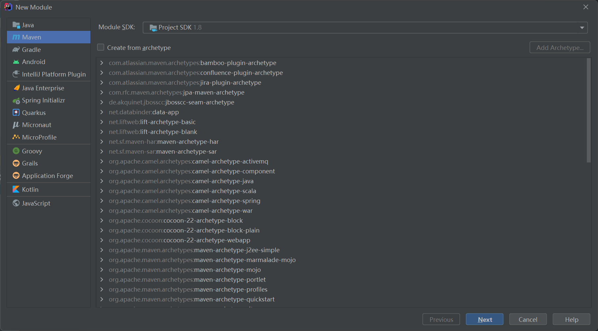

## 1 mybatis 基本使用

### 1) 创建 `maven` 项目




### 2) 在 `pom` 文件中添加如下内容

```xml
<?xml version="1.0" encoding="UTF-8"?>
<project xmlns="http://maven.apache.org/POM/4.0.0"
         xmlns:xsi="http://www.w3.org/2001/XMLSchema-instance"
         xsi:schemaLocation="http://maven.apache.org/POM/4.0.0 http://maven.apache.org/xsd/maven-4.0.0.xsd">
    <parent>
        <artifactId>mybatis-study</artifactId>
        <groupId>org.example</groupId>
        <version>1.0-SNAPSHOT</version>
    </parent>
    <modelVersion>4.0.0</modelVersion>

    <artifactId>mybatis-01</artifactId>


    <!--    maven，在build中配置resources，防止一些资源导出失败的问题-->
    <build>
        <resources>
            <resource>
                <directory>src/main/resources</directory>
                <includes>
                    <include>**/*.properties</include>
                    <include>**/*.xml</include>
                </includes>
                <filtering>true</filtering>
            </resource>
            <resource>
                <directory>src/main/java</directory>
                <includes>
                    <include>**/*.properties</include>
                    <include>**/*.xml</include>
                </includes>
                <filtering>true</filtering>
            </resource>
        </resources>
    </build>

</project>
```


### 3) 在 `resources` 中添加  `mybatis-config.xml` 文件

```xml
<?xml version="1.0" encoding="UTF8"?>
<!DOCTYPE configuration
        PUBLIC "-//mybatis.org//DTD Config 3.0//EN"
        "http://mybatis.org/dtd/mybatis-3-config.dtd">
<configuration>
    <environments default="development">
        <environment id="development">
            <transactionManager type="JDBC"/>
            <dataSource type="POOLED">
                <property name="driver" value="com.mysql.cj.jdbc.Driver"/>
                <property name="url" value="jdbc:mysql://localhost:3306/mybatis?useSSL=true&amp;useUnicode=true&amp;characterEncoding=UTF8&amp;serverTimezone=Asia/Shanghai"/>
                <property name="username" value="root"/>
                <property name="password" value="yan19991001"/>
            </dataSource>
        </environment>
    </environments>
    <!-- 需要注册 mapper, 才能实现配置生效 -->
    <mappers>
        <mapper resource="mapper/UserMapper.xml"/>
    </mappers>
</configuration>
```


### 4) 在 `Utils` 创建 `MyBatisUtils` 工具类

```java
package Utils;

import org.apache.ibatis.io.Resources;
import org.apache.ibatis.session.SqlSession;
import org.apache.ibatis.session.SqlSessionFactory;
import org.apache.ibatis.session.SqlSessionFactoryBuilder;

import java.io.IOException;
import java.io.InputStream;

public class MybatisUtils {
    private static SqlSessionFactory sqlSessionFactory;
    static{
        //获取 SqlSessionFactory
        String resource = "mybatis-config.xml";
        try {
            InputStream inputStream = Resources.getResourceAsStream(resource);
            sqlSessionFactory = new SqlSessionFactoryBuilder().build(inputStream);
        } catch (IOException e) {
            e.printStackTrace();
        }
    }

    //获取 sqlserssion, 也即获取操作实例 用来与数据库进行操作
    public static SqlSession getSession(){
        //设置自动提交事务, 不在需要 commit
        return sqlSessionFactory.openSession(true);
    }

}
```


### 5) 创建 `Bean` 类

```java
package Bean;

public class User {
    private int id;
    private String name;
    private String pwd;

    public User() {
    }

    public User(int id, String name, String pwd) {
        this.id = id;
        this.name = name;
        this.pwd = pwd;
    }

    @Override
    public String toString() {
        return "User{" +
                "id=" + id +
                ", name='" + name + '\'' +
                ", pwd='" + pwd + '\'' +
                '}';
    }

    public int getId() {
        return id;
    }

    public void setId(int id) {
        this.id = id;
    }

    public String getName() {
        return name;
    }

    public void setName(String name) {
        this.name = name;
    }

    public String getPwd() {
        return pwd;
    }

    public void setPwd(String pwd) {
        this.pwd = pwd;
    }
}
```


### 6) 创建 `mapper` 接口

```java
package mapper;

import Bean.User;

import java.util.HashMap;
import java.util.List;

public interface UserMapper {
    List<User> getUserList();

    //根据 用户名 模糊查询
    List<User> seaUserList(String name);

    //分页查询
    List<User> seaUserByPage(HashMap map);

    //根据 id 查询用户
    User getUserById(int i);

    //添加用户
    int addUser(User user);

    //修改用户
    int updateUser(User user);

    //删除用户
    int delUser(int id);

}
```


### 7) 创建 `xml` 配置 `mapper`

```xml
<?xml version="1.0" encoding="UTF-8" ?>
<!DOCTYPE mapper
        PUBLIC "-//mybatis.org//DTD Mapper 3.0//EN"
        "http://mybatis.org/dtd/mybatis-3-mapper.dtd">

<!-- 绑定一个 DAO/Mapper 接口 -->
<mapper namespace="mapper.UserMapper">
    <select id="getUserList" resultType="user">
        select * from mybatis.user;
    </select>

    <!-- 根据 用户名 模糊查询-->
    <select id="seaUserList" resultType="user" parameterType="String">
        select * from mybatis.user where name like #{name};
    </select>

    <!-- 分页查询 -->
    <select id="seaUserByPage" resultType="user" parameterType="map">
        select * from mybatis.user limit #{startIndex},#{pageSize};
    </select>

    <select id="getUserById" parameterType="int" resultType="user">
        select * from mybatis.user where id = #{id};
    </select>

    <insert id="addUser" parameterType="user">
        insert into mybatis.user(id,name,pwd) values(#{id},#{name},#{pwd});
    </insert>

    <update id="updateUser" parameterType="user" >
        update mybatis.user set name = #{name},pwd = #{pwd} where id = #{id};
    </update>

    <delete id="delUser" parameterType="int">
        delete from mybatis.user where id = #{id};
    </delete>
</mapper>
```


### 8) 创建 `test` 类, 使用 `JUnit` 进行测试

```java
import Bean.User;
import Utils.MybatisUtils;
import mapper.UserMapper;
import org.apache.ibatis.session.SqlSession;
import org.junit.Test;

import java.util.HashMap;
import java.util.List;

public class mianTest {

    @org.junit.Test
    public void test1(){
        //1、获取 session 对象
        SqlSession session = MybatisUtils.getSession();
        //2、执行 sql  方式一 - getMapper
        UserMapper mapper = session.getMapper(UserMapper.class);
        List<User> userList = mapper.getUserList();

        for (User user : userList) {
            System.out.println(user.toString());
        }

        session.close();
    }


    @org.junit.Test
    public void getUserByID(){
        //1、获取 session 对象
        SqlSession session = MybatisUtils.getSession();
        //2、执行 sql  方式一 - getMapper
        UserMapper mapper = session.getMapper(UserMapper.class);

        User user = mapper.getUserById(1);
        System.out.println(user.toString());

        session.close();
    }

    //根据 用户名 模糊查询
    @org.junit.Test
    public void seaUserByName(){
        //1、获取 session 对象
        SqlSession session = MybatisUtils.getSession();
        //2、执行 sql  方式一 - getMapper
        UserMapper mapper = session.getMapper(UserMapper.class);

        List<User> userList = mapper.seaUserList("%" + "张" + "%");
        for (User user : userList) {
            System.out.println(user.toString());
        }

        session.close();
    }


    //分页查询
    @org.junit.Test
    public void seaUserByPage(){
        //1、获取 session 对象
        SqlSession session = MybatisUtils.getSession();
        //2、执行 sql  方式一 - getMapper
        UserMapper mapper = session.getMapper(UserMapper.class);

        HashMap<String,Integer> map = new HashMap<String,Integer>();
        map.put("startIndex",0);
        map.put("pageSize",2);
        List<User> userList = mapper.seaUserByPage(map);
        for (User user : userList) {
            System.out.println(user.toString());
        }
        session.close();
    }


    @org.junit.Test
    public void addUser(){
        //1、获取 session 对象
        SqlSession session = MybatisUtils.getSession();
        //2、执行 sql  方式一 - getMapper
        UserMapper mapper = session.getMapper(UserMapper.class);

        int column = mapper.addUser(new User(4,"吴恩","1562"));
        System.out.println("受影响行数:"+column);
        session.commit();
        session.close();
    }

    @org.junit.Test
    public void updateUser(){
        //1、获取 session 对象
        SqlSession session = MybatisUtils.getSession();
        //2、执行 sql  方式一 - getMapper
        UserMapper mapper = session.getMapper(UserMapper.class);

        mapper.updateUser(new User(1,"李想","188"));

        session.commit();
        session.close();
    }

    @org.junit.Test
    public void delUser() {
        //1、获取 session 对象
        SqlSession session = MybatisUtils.getSession();
        //2、执行 sql  方式一 - getMapper
        UserMapper mapper = session.getMapper(UserMapper.class);

        int column = mapper.delUser(4);
        System.out.println("受影响行数:"+column);
        session.commit();
        session.close();
    
    }
}
```


## 2 一些比较重要的改进

1. 使用 配置文件 properties 加载数据库链接
2. 使用 别名 引入 Mapper
3. 引入日志
4. 分页功能
5. 使用注解与数据库交互
6. lombok 插件


## 3 lombok

#### 概述

使用注解的方式, 自动补全类中如下方法

```
//目前一次只能使用一个
@Data          		 //获取 get set toString equals 等重写  - 无参构造AllArgsConstructor     //获取带参构造
@NoArgsConstructor  //生成无参构造
@ToString           //toString 方法

getter
setter
toString
无参构造
带参构造
equals
```


#### 使用方式

- 在 IDEA 中添加 `lombok` 插件
- 在 `maven` 项目的 `pom` 文件中添加 `lompok` 依赖
- 在 类 或 类属性 上添加注解来使用 `lombok`