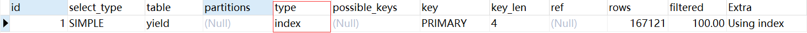

## SQL 优化

### 1 优化方法

#### 1) EXPLAIN 分析语句

> `EXPLAIN`是一种SQL语句，用于解释查询的执行计划。它可以显示MySQL优化器在执行查询时所使用的算法、索引、表连接顺序等信息，以及查询中每个操作的执行顺序和所用的资源。
>
> ​	通过分析`EXPLAIN`返回的结果，可以确定查询中哪些操作是最耗时的，以及如何优化查询以提高性能。例如，可以通过添加索引、优化查询条件、使用分区表等方法来改进查询性能。需要注意的是，`EXPLAIN`语句只能提供查询执行计划的信息，不会实际执行查询。因此，如果查询涉及到复杂的数据类型、函数、子查询等，`EXPLAIN`返回的结果可能会有误，需要结合实际情况进行分析。


在MySQL中，可以使用`EXPLAIN`语句来查看查询执行计划。例如，使用以下语句可以查看`SELECT * FROM table_name`查询的执行计划：

```sql
EXPLAIN SELECT * FROM table_name;
```


- `EXPLAIN`语句返回的结果包含以下信息：

  1. `id`: 查询中每个操作的唯一标识符，用于标识查询中各个操作的执行顺序。

  2. `select_type`: 查询的类型，例如`SIMPLE`、`PRIMARY`、`UNION`等。

  3. `table`: 查询涉及的表名。

  4. `type`: MySQL优化器选择的索引类型。

  5. `possible_keys`: 可能使用的索引列表。

  6. `key`: MySQL优化器实际使用的索引。

  7. `key_len`: MySQL优化器使用的索引长度。

  8. `ref`: 用于与索引比较的常量或列的列表。

  9. `rows`: 扫描的行数估计值。

  10. `Extra`: 附加信息，例如使用的临时表、文件排序等。

      其中核心的字段为 `Type`, 表示MySQL优化器选择的索引类型，它的取值范围包括以下几种类型（按性能从高到低排序）：

      1. `system`: 表只有一行记录（等同于系统表），这是特殊情况，一般不会出现。
      2. `const`: 通过索引一次就能找到对应的记录，例如使用主键或唯一索引进行查询。
      3. `eq_ref`: 类似`const`，但是使用了外键约束或唯一索引进行查询。
      4. `ref`: 使用普通索引进行查询。
      5. `range`: 使用索引范围查询，例如使用`BETWEEN`、`IN`等条件进行查询。
      6. `index`: 全表扫描，但是只扫描索引树。
      7. `all`: 全表扫描，性能最差。




#### 2) EXPLAIN 分析语句


### 2 优化问题

#### 1) COUNT(*) 查询耗时过久

> 描述: Mybatis-plus 使用 PageHelper 进行分页时调用了 `.page(page, queryWrapper)` 方法, 该方法首先会调用 `SELECT COUNT(*) FROM tablename` 语句查询表内数据个数, 使用该语句进行查询时 26w 条数据耗时 16s, 使用的索引为 `index & PRIMARY` 索引, 按说速度不会这么慢, 查阅资料说是缓存|索引的问题, 添加索引和关闭缓存都没用。

- 解决办法

  将语句改为 `SELECT COUNT(*) FROM yield WHERE id >= 0` 添加了 `WHERE` 条件, 使得索引变为 `RANGE & PRIMARY  `, 查询耗时变为 `0.085s`

- 项目修改

  使用项目为 `SpringBoot + Mybatisplus(PageHelper)` , 只需要在 `.page` 添加 `queryWrapper` 条件即可, 如下所示。

  ```java
  //条件构造器对象
  LambdaQueryWrapper<Yield> queryWrapper = new LambdaQueryWrapper<>();
  //添加排序条件，根据sort排序
  queryWrapper.ge(Yield::getId,0);
  //进行分页查询
  Page<Yield> pageinfo = new Page<Yield>(page, size);
  yieldService.page(pageinfo, queryWrapper);
  ```

  