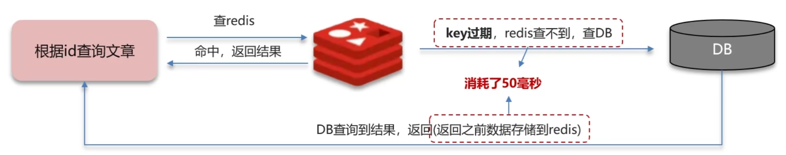

## 1 Redis

### 1.1 缓存

#### 1) 缓存穿透

> 概念: 查询一个不存在的数据, MySQL查询不到数据也不会直接写入缓存,就会导致每次请求都查询数据库。

- 方案一: 缓存空数据, 查询返回的结果为空,仍把空结果进行缓存
  - 优点: 简单
  - 缺点: 消耗内存, 可能发生不一致的问题
- 方案二: 布隆过滤器
  - bitmap(位图): 以 bit 为单位的数组, 数组中的值为 0|1
  - 布隆过滤器通过初始1个值全为0的数组, 再通过 hash (3次hash) 的方法判断元素是否在集合中。**存储数据**: id为1的数据，通过多个hash函数获取hash值，根据hash计算数组对应位置改为1; **查询数据**:使用相同hash函数获取hash值，判断对应位置是否都为1。
  - 存在误判, 如果某个 id 对应的hash值被其他已存在 id 的hash值覆盖, 就会使得本来不存在的数据被判定为存在(一般设置误判率为5%以内)。
  - 在查询时首先通过布隆过滤器查询是否存在, 不存在则直接返回, 存在则查redis。注意: 缓存预热时需要同步预热布隆过滤器, 也即 redis 的相关更新也需要同步到布隆过滤器。

#### 2) 缓存击穿

> 概念: 给某一个 key 设置了过期时间, 当 key 过期的时候, 恰好这时间点对这个 key 有大量的并发请求过来, 这些并发的请求可能会瞬间把 DB 击穿。



- 互斥锁
  - 由于 key 过期需要进行缓存重建, 为了避免"击穿"的发生, 给用以重建缓存数据的线程1加锁(也即获取互斥锁), 此时在线程1没有完成缓存重建过程之前, 其余线程只能不断重试, 直到线程1缓存重建成功并释放 互斥锁。  
  - **特点**:强一致性 性能差 
- 逻辑过期
  - redis key 并不设置过期时间, 而是为数据添加过期字段'expire'。当线程1发现字段逻辑过期之后, 获取互斥锁开启新线程2, 用以重建缓存数据。 这时线程1会直接返回过期数据, 如果在线程2重建缓存的过程中还有新的线程获取该数据, 由于互斥锁被占用, 此时该线程会返回过期数据; 当线程2完成重建缓存之后, 所有的线程就可以访问到最新的数据了。
  - **特点**: 高可用、性能优  -  实质上就是通过维护缓存时间字段来判断过期与否, 不为 redis 设置过期时间。

#### 3) 缓存雪崩

> 在同一时间段内缓存key同时过期或者 redis 服务宕机, 导致大量请求访问到数据库, 带来巨大压力。

- 给不同的 Key 的 TTL(失效时间) 添加随机值
- 给 redis 集群提高服务可用型  - 哨兵模式、集群模式
- 给缓存业务添加降级限流策略 - ngxin | SpringCloud GateWay (同样可用于穿透、击穿)
- 给业务添加多级缓存 -  Guava | Caffeine

#### 4) 双写一致性

> 当修改了数据库的数据同时需要更新缓存的数据, 缓存和数据库的数据需要保持一致。

- 读取

  - 缓存命中直接返回; 缓存未命中查询数据库, 写入缓存, 设定超时时间。

- 写入

  **强一致性**

  - **延迟双删**

    删除缓存 -> 修改数据库 ->(延时) 删除缓存  (一般的是删除缓存->修改数据库)。这样极大的控制了脏数据的风险, 但是由于数据库的主从模式, 延时也不一定能保证"脏数据"不存在。

    特点: 脏数据 - 性能高

  - **分布式锁**

    共享锁: 读锁 `readLock`，加锁之后，其他线程可以共享读操作。

    排他锁: 独占锁 `writeLock`，加锁之后，阻塞其他线程读写操作。

    特点: 强一致 性能低

  **允许短暂不同步**

  - MQ 作为中间件完成消息传递, 保证一致性
  - Canal 作为中间件通过 MySQL 的变化监听并向缓存发送消息提示更新。

#### 5) 持久化

> 持久化方式: 
>
> - RDB: RDB全称Redis Database Backup file(Redis数据备份文件)，也被叫做Redis数据快照。简单来说就是把内存中的所有数据都记录到磁盘中。当Redis实例故障重启后，从磁盘读取快照文件，恢复数据。fork采用的是copy-on-write技术:
>   当主进程执行读操作时，访问共享内存;
>   当主进程执行写操作时，则会拷贝一份数据，执行写操作。
>
>   ```cmd
>   > save
>   > bgsave
>   > save 900 1   //900s内有1个key被修改
>   > save 300 10
>   > save 60 10000
>   ```
>
>   执行原理: bgsave 会 fork(拷贝) 主进程得到子进程, 子进程共享主进程的内存数据(拷贝了页表-映射关系), 完成 fork 后读取内存数据并写入 RDB 文件。
>
> - AOF: AOF全称为Append Only File(追加文件)。Redis处理的每一个写命令都会记录在AOF文件，可以看做是命令日志文件。


