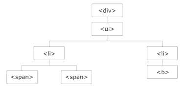

[TOC]


# jQuery笔记

## 1  jQuery与JS对象的相互转化

- **JQuery对象和s对象区别与转换**

  - JQuery对象在操作时，更加方便。
  - Query对象和js对象方法不通用的．
  - 两者相互转换
    jq -- > js : jq对象[索引]或者jq对象.get(索引)js -- > jq : $(js对象)

   通过 jQuery，您可以选取（查询，query） HTML 元素，并对它们执行"操作"（actions）。


## 2  jQuery 语法

### 2.1  jQuery语法

   jQuery 语法是通过选取 HTML 元素，并对选取的元素执行某些操作。

- **基础语法**： `$(\*selector\*).\*action\*()`

  - 美元符号定义 jQuery
  - 选择符（selector）"查询"和"查找" HTML 元素
  - jQuery 的 action() 执行对元素的操作

- **实例:**

  ```javascript
  $(this).hide()      隐藏当前元素
  
  $("p").hide()       隐藏所有 <p> 元素
  
  $("p.test").hide()  隐藏所有 class="test" 的 <p> 元素
  
  $("#test").hide()   隐藏 id="test" 的元素
  ```

  


### 2.2  文档就绪事件

您也许已经注意到在我们的实例中的所有 jQuery 函数位于一个 document ready 函数中：

```java
$(document).ready(function(){
   // 开始写 jQuery 代码...
});
>>
简洁写法
    $(function(){
    // 开始写 jQuery 代码...  
	});
```


这是为了防止文档在完全加载（就绪）之前运行 jQuery 代码，即在 DOM 加载完成后才可以对 DOM 进行操作。

如果在文档没有完全加载之前就运行函数，操作可能失败。

```javascript
<input type="button" value="Click Here!" id="b1">
<script>
    $("#b1").click(function(){
        alert("Finish click!");
    });
</script>
# b1(也即button)的定义必须在script代码前,否则会出现未加载的情况
```


## 3  选择器

### 3.1  元素选择器

jQuery 元素选择器基于元素名选取元素。

**语法如下**:   `$("p")`

**实例:**   以下实现了对元素 p 的隐藏

**实例:**  以下实现了对元素 p 的隐藏

```javascript
<p>这是要隐藏的段落</p>
    <input type="button" value="Click Here!" id="b1">
    <script>
        $("#b1").click(function(){
            $("p").hide();
        });
    </script>
```


### 3.2  ID选择器

页面中元素的 id 应该是唯一的，所以您要在页面中选取唯一的元素需要通过 #id 选择器。

**语法如下**：     `$("#test")`

**实例: **  以下实现了对 div 标签的背景变为 pink

```javascript
<div id="div1" style="background: red">
    div
</div>
<input type="button" value="Click Here!" id="b1">
<script>
    $(function () {
        $("#b1").click(function(){
            $("#div1").css("backgroundColor","pink");
        });
    });
</script>
```


### 3.3 CLASS 选择器

**语法如下**：   `$(".test")`

**实例**:    用户点击按钮后所有带有 class="test" 属性的背景变为 pink

```javascript
<div class="test" style="background: red">
    div
</div>
<input type="button" value="Click Here!" id="b1">
<script>
    $(function () {
        $("#b1").click(function(){
            $(".test").css("backgroundColor","pink");
        });
    });
</script>
```


## 4  jQuery事件

### 4.1 事件概述

页面对不同访问者的响应叫做事件。

事件处理程序指的是当 HTML 中发生某些事件时所调用的方法。

**实例**：

- 在元素上移动鼠标。
- 选取单选按钮
- 点击元素

在事件中经常使用术语"触发"（或"激发"）例如： "当您按下按键时触发 keypress 事件"。


### 4.2 事件处理

#### 4.2.1 常见 DOM 事件

事件总共分为4大类,即: 鼠标事件、键盘事件、表单事件、文档/窗口事件等


#### 4.2.2 事件处理语法

在 jQuery 中，大多数 DOM 事件都由以下两步组成: 

① 页面中指定一个点击事件：

```javascript
$("p").click();
```

② 定义点击后触发事件

```javascript
$("p").click(function(){
    // 动作触发后执行的代码!!
});
```


#### 4.2.3 事件处理案例

- **双击事件案例**

  当用户 双击 按钮时会弹出  *Double click!*  的提示框

  ```javascript
    <input type="button" value="Click Here!" id="b1">
      <script>
          $("#b1").dblclick(function(){
              alert("Double click!");
          });
      </script>
  ```

- **鼠标移开事件**

  ```javascript
  $("#b1").mouseup(function(){
      alert("鼠标在段落上松开。");
  });
  ```

- **鼠标穿过事件**

  ```javascript
  $("#b1").mouseenter(function(){
      alert('您的鼠标移到了 id="p1" 的元素上!');
  });
  ```

  当我们在使用多个同类型的事件时, 事件之间会发生重叠失去响应的情况。


## 5  jQuery效果

### 5.1  隐藏和显示

#### 5.1.1 hide() 与 show()

- **语法**

  ```javascript
  $(selector).hide(speed,callback); 
  
  $(selector).show(speed,callback);
  ```

  

  **① speed 参数**

  speed 表示 隐藏/显示 的速度 , 可以取以下值："slow"、"fast" 或毫秒。

  **示例**: 实现 p标签内文字在 1000 ms内隐藏的效果

  ```
  $("#b1").click(function(){
      $("p").hide(1000);
  });
  ```

  

  **② callback 参数**

  callback 表示为字符串, 提示过渡方法为哪一类的缓动函数。  *linear / swing*

  ```javascript
  $("#b1").click(function(){
      $("p").hide(1000,"linear",function(){
          alert("Hide() 方法已完成!");
      });
  });
  ```


- **简单案例**

  通过 *hide()* 和 *show()* 方法我们可以隐藏和显示 HTML 元素

  ```javascript
     <p>这是隐藏的内容!</p>
      <input type="button" value="隐藏" id="b1">
      <input type="button" value="显示" id="b2">
  
      <script>
          $("#b1").click(function(){
              $("p").hide();
          });
          $("#b2").click(function(){
              $("p").show();
          });
      </script>
  ```


#### 5.1.2 toggle() 切换方法

- **语法**

  toggle()  同样具有 speed 和 callback 两个参数

  ```javascript
  $(*selector*).toggle(*speed,callback*);
  ```


- **简单案例**

  toggle() 方法也就是在一个按钮上实现 hide() 和 show() 函数的切换。

  如下所示, 按钮在点击后会从 当前态转换为另一态(隐藏→显示  显示→隐藏  )

  ```javascript
  $("#b2").click(function(){
      $("p").toggle();
  });
  ```


### 5.2 淡入淡出 fading

#### 5.2.1 fadein() 淡入隐藏元素

- **语法**

  *speed* 效果时长   *callback* 完成后回调函数名

  ```
  $(selector).fadeIn(speed,callback);
  ```


- **实例**

  以下代码实现了 id = div1 元素的淡入效果。  #id(编号)      p(标签)     .class(class选择)

  ```javascript
  $("#b1").click(function(){
    $("#div1").fadeIn();    
    $("#div2").fadeIn("slow");
    $("#div3").fadeIn(3000);
  });
  ```

  

#### 5.2.2 fadeOut() 淡出可见元素

- **语法**

  ```
  $(selector).fadeOut(speed,callback);
  ```


- **实例**

  以下代码实现了 id = div1 元素的淡出效果。

  ```javascript
  $("#b2").click(function(){  $("#div1").fadeOut();  $("#div2").fadeOut("slow");  $("#div3").fadeOut(3000);});
  ```


#### 5.2.3 Toggle() 切换方法

- 语法

  ```
  $(selector).fadeToggle(speed,callback);
  ```


- 实例

  ```javascript
  $("#b3").click(function(){  $("#div1").fadeToggle();  $("#div2").fadeToggle("slow");  $("#div3").fadeToggle(3000);});
  ```

  

#### 5.2.4 fadeTo()  允许渐变为给定的不透明度

- **语法**

  *speed* 速度    *opacity* 不透明度(0 - 1)    *callback* 回调函数名       

  ```
  $(selector).fadeTo(speed,opacity,callback);
  ```


- **实例**

  以下代码实现了对 div 标签内元素透明度的修改

  ```javascript
  $("#b4").click(function(){  $("#div1").fadeTo("slow",0.15);  $("#div2").fadeTo("slow",0.4);  $("#div3").fadeTo("slow",0.7);});
  ```

  

### 5.3 滑动 slide

#### 5.3.1 slideDown() 向下滑动

- **语法**

  ```
  $(selector).slideDown(speed,callback);
  ```


- **实例**

  ```javascript
  $("#b1").click(function(){    $("p").slideDown(1000);});
  ```


#### 5.3.2 slideUp() 向上滑动

- **语法**

  ```
  $(selector).slideUp(speed,callback);
  ```


- **实例**

  ```javascript
  $("#b2").click(function(){    $("p").slideUp(1000);});
  ```


#### 5.3.3 slideToggle() 切换方法

- 语法

  ```
  $(selector).slideToggle(speed,callback);
  ```


- **实例**

  ```javascript
  $("#b3").click(function(){
      $("p").slideToggle(1000);
  });
  ```

  

### 5.4 动画 animate

#### 5.4.1 animate() 创建自定义动画

- **语法**

  *params* 定义动画 css 属性    *speed* 定义效果时长   *callback* 回调函数名  

  ```javascript
  $(selector).animate({params},speed,callback);
  ```


- **实例**

  以下代码实现 p 标签文字的右移 250px

  ```javascript
  $("#b1").click(function(){    $("p").animate({right:'250px'});});
  ```


#### 5.4.2 animate() 操作多个属性

- **实例**

  以下代码实现绿色正方形方块的下移、放大、透明度缩小

  ```javascript
  $("#b2").click(function(){  $("div").animate({    left:'250px',    opacity:'0.5',    height:'150px',    width:'150px'  });});
  ```

  

#### 5.4.3  animate() 使用相对值

- **实例**

  以下代码实现 div 方块的相对当前位置的平移  *+= / -=*

  ```javascript
  $("#b3").click(function(){    $("div").animate({        left:'250px',        height:'+=150px',        width:'+=150px'    });});
  ```

  

#### 5.4.4 animate() 使用预定义的值

- **实例**

  以下代码使用 var 变量获取了 div 标签的对象地址, 然后通过 var 来调用已经定义好的动画。

  ```javascript
  $("#b4").click(function(){
      var div=$("div");
      div.animate({height:'300px',opacity:'0.4'},"slow");
      div.animate({width:'300px',opacity:'0.8'},"slow");
      div.animate({height:'100px',opacity:'0.4'},"slow");
      div.animate({width:'100px',opacity:'0.8'},"slow");
  });
  ```


#### 5.4.5 stop() 停止动画

- **语法**

  stop() 方法用于停止动画或效果，在它们完成之前。

  stop() 方法适用于所有 jQuery 效果函数，包括滑动、淡入淡出和自定义动画。

  *stopAll* 是否应该清除动画队列(boolean)    *goToEnd* 是否立即完成当前动画(boolean)

  ```
  $(selector).stop(stopAll,goToEnd);
  ```


- **实例**

  以下代码实现了按下按钮使得动画播放停止的效果

  ```javascript
  $("#stop").click(function(){
    $("#panel").stop();
  });
  ```

  

### 5.5 jQuery 链式写法

- **实例**

  **链接**（chaining）技术，允许我们在相同的元素上运行多条 jQuery 命令，一条接着另一条。

  **提示：** 这样的话，浏览器就不必多次查找相同的元素。

  如需链接一个动作，您只需简单地把该动作追加到之前的动作上。

  下面的例子把 css()、slideUp() 和 slideDown() 链接在一起。"div" 元素首先会变为红色，然后向上滑动，再然后向下滑动：

  ```javascript
  $("div").css("background","red").slideUp(2000).slideDown(2000);// 以下代码和上述代码运行结果一致$("div").css("color","red")    .slideUp(2000)    .slideDown(2000);
  ```


## 6 jQuery HTML

### 6.1 jQuery 捕获

#### 6.1.1 text() 获取和设置所选元素文本内容

- **实例**

  以下 **获取** p 标签的文本内容

  ```javascript
  $("#b1").click(function(){     alert("Text:" + $("p").text());});
  ```

  以下 **设置** p标签的文本内容

  ```javascript
  $("#b5").click(function(){    $("p").text("Hello world!");});
  ```

  

#### 6.1.2 html() 设置或返回所选元素的内容

- **实例**

  以下 **获取** p 标签的所有标签内容, 也即完整代码    我是 '<b> 粗体</b> ' 

  ```javascript
  $("#b2").click(function(){	alert("HTML:" + $("p").html());});
  ```

  以下 **设置** p 标签的所有标签内容

  ```javascript
  $("#b6").click(function(){    $("p").html("<b>Hello world!</b>");});
  ```

  

####  6.1.3 val() 获取输入字段的值

- **实例**

  以下代码 **获取** 输入框内的输入值

  ```
  $("#b3").click(function(){    alert("val:" + $("#input1").val());});
  ```

  以下代码 **设置** 输入框内的输入值

  ```javascript
  $("#b7").click(function(){
      $("#input1").val("RUNOOB");
  });
  ```

  

#### 6.1.4 attr() 获取属性值

- **实例**

  以下代码演示如何 **获得** 链接中 href 属性的值

  ```javascript
  $("#b4").click(function(){
      alert($("#runoob").attr("href"));
  });
  ```

  以下代码演示如何 **设置** 链接中 href 属性的值

  ```javascript
  $("#b8").click(function(){
      $("#runoob").attr("href","http://www.runoob.com/jquery");
  });
  ```

  

#### 6.1.5 attr() 回调函数

- 实例

  jQuery 方法 attr()，也提供回调函数。回调函数有两个参数：被选元素列表中当前元素的下标，以及原始（旧的）值。然后以函数新值返回您希望使用的字符串。

  下面的例子演示带有回调函数的 attr() 方法：

  ```javascript
  $("button").click(function(){
    $("#runoob").attr("href", function(i,origValue){
      return origValue + "/jquery"; 
    });
  });
  ```

  

### 6.2 添加元素

#### 6.2.1 append() 和 prepend() 被选元素结尾/开头插入内容

- **实例**

  在 p 标签文字 **结尾** 拼接文本

  ```javascript
  $("p").append("追加文本");
  ```


- **实例**

  在 p 标签文字 **开头** 拼接文本

  ```javascript
  $("p").prepend("在开头追加文本");
  ```

  

#### 6.2.2 append() 与 prepend() 多元素添加

- **实例**

  在上面的例子中，我们只在被选元素的开头/结尾插入文本/HTML。

  不过，append() 和 prepend() 方法能够通过参数接收无限数量的新元素。可以通过 jQuery 来生成文本/HTML（就像上面的例子那样），或者通过 JavaScript 代码和 DOM 元素。

  以下代码实现 用户按键后 在 body 标签的最后附加新元素。

  ```javascript
  $("#b3").click(    function appendText(){        var txt1="<p>文本-1。</p>";              // 使用 HTML 标签创建文本        var txt2=$("<p></p>").text("文本-2。");  // 使用 jQuery 创建文本        var txt3=document.createElement("p");        txt3.innerHTML="文本-3。";               // 使用 DOM 创建文本 text with DOM        $("body").append(txt1,txt2,txt3);        // 追加新元素    });
  ```

  

#### 6.2.3 after() 与 before() 被选元素结尾/开头插入内容

- **实例**

  ```javascript
  $("img").after("在后面添加文本");$("img").before("在前面添加文本");
  ```

  

#### 6.2.4 after() 与 before() 多元素添加

- **实例**

  after() 和 before() 方法能够通过参数接收无限数量的新元素。可以通过 text/HTML、jQuery 或者 JavaScript/DOM 来创建新元素。

  在下面的例子中，我们创建若干新元素。这些元素可以通过 text/HTML、jQuery 或者 JavaScript/DOM 来创建。然后我们通过 after() 方法把这些新元素插到文本中（对 before() 同样有效）：

  ```javascript
  $("#b7").click(    function afterText()    {        var txt1="<b>I </b>";                    // 使用 HTML 创建元素        var txt2=$("<i></i>").text("love ");     // 使用 jQuery 创建元素        var txt3=document.createElement("big");  // 使用 DOM 创建元素        txt3.innerHTML="jQuery!";        $("body").after(txt1,txt2,txt3);          // 在图片后添加文本    });
  ```

  

### 6.3 删除元素

#### 6.3.1 remove() 删除被选元素及其子元素

- **实例**

  删除被选元素和子元素

  ```javascript
  $("#div1").remove();
  ```

- **过滤**

  删除 class="italic" 的所有 **p** 元素：

  ```javascript
  $("p").remove(".italic");
  ```

  

#### 6.3.2 empty() 删除被选元素的子元素

- **实例**

  以下实现删除 div 标签内的子元素

  ```javascript
  $("#div1").empty();
  ```

  

## 7 jQuery CSS

### 7.1 CSS类

#### 7.1.1 addClass() 添加 class 属性

- **实例**

  下面的例子展示如何向不同的元素添加 class 属性, *blue* 与 *important* 是 css 样式

  ```javascript
  $("button").click(function(){
    $("h1,h2,p").addClass("blue");
    $("div").addClass("important");
  });
  ```

  

#### 7.1.2 removeClass() 删除 class 属性

- **实例**

  在不同的元素中删除指定的 class 属性

  ```javascript
  $("#b2").click(function(){
      $("p").removeClass("blue");
      $("div").removeClass("important");
  });
  ```


#### 7.1.3 toggleClass() 切换方法

- **实例**

  对被选元素进行添加/删除类的切换操作

  ```javascript
  $("#b3").click(function(){
      $("p").toggleClass("blue");
      $("div").toggleClass("important");
  });
  ```

  

### 7.2 CSS方法

#### 7.1.1 返回和设置 CSS 属性

- **实例**

  **返回** 首个匹配元素的 *color* 值

  ```javascript
  $("#b1").click(function(){    alert($("p").css("color"));});
  ```


- **实例**

  **设置** 首个匹配元素的 *color* 值

  ```javascript
  $("#b2").click(function(){    $("p").css("background-color","yellow");});
  ```


- **实例**

  为 **所有匹配元素设置** background-color 和 font-size

  ```javascript
  $("#b3").click(function(){
      $("p").css({"background-color":"yellow","font-size":"200%"});
  });
  ```


### 7.2 尺寸

#### 7.2.1 width() 和 height()

- **实例**

  width() 方法设置或返回元素的宽度（不包括内边距、边框或外边距）。

  height() 方法设置或返回元素的高度（不包括内边距、边框或外边距）。

  下面的例子返回指定的 **div** 元素的宽度和高度：

  ```javascript
  $("button").click(function(){
    var txt="";
    txt+="div 的宽度是: " + $("#div1").width() + "</br>";
    txt+="div 的高度是: " + $("#div1").height();
    $("#div1").html(txt);
  });
  ```

  

#### 7.2.2 innerWidth() 与 innerHeight() 

- **实例**

  innerWidth() 方法返回元素的宽度（包括内边距）。

  innerHeight() 方法返回元素的高度（包括内边距）。

  下面的例子返回指定的 ***div*** 元素的 inner-width/height：

  ```javascript
  $("button").click(function(){
    var txt="";
    txt+="div 宽度，包含内边距: " + $("#div1").innerWidth() + "</br>";
      txt+="div 高度，包含内边距: " + $("#div1").innerHeight();
    $("#div1").html(txt);
  });
  ```


#### 7.2.3 outerWidth() 与 outerHeight()

- **实例**

  outerWidth() 方法返回元素的宽度（包括内边距和边框）。

  outerHeight() 方法返回元素的高度（包括内边距和边框）。

  下面的例子返回指定的 **div** 元素的 outer-width/height：

  ```javascript
  $("button").click(function(){
    var txt="";
    txt+="div 宽度，包含内边距和边框: " + $("#div1").outerWidth() + "</br>";
    txt+="div 高度，包含内边距和边框: " + $("#div1").outerHeight();
    $("#div1").html(txt);
  });
  ```


## 8 jQuery 遍历

### 8.1 遍历概述

#### 8.1.1 遍历是什么

jQuery 遍历，意为"移动"，用于根据其相对于其他元素的关系来"查找"（或选取）HTML 元素。以某项选择开始，并沿着这个选择移动，直到抵达您期望的元素为止。

下图展示了一个家族树。通过 jQuery 遍历，您能够从被选（当前的）元素开始，轻松地在家族树中向上移动（祖先），向下移动（子孙），水平移动（同胞）。这种移动被称为对 DOM 进行遍历。




### 8.2 祖先 向上遍历

祖先是父、祖父或曾祖父等等。 通过 jQuery，您能够向上遍历 DOM 树，以查找元素的祖先,也即父节点。


#### 8.2.1 parent() 返回直接父元素

- **实例**

  *parent()* 方法返回被选元素的直接父元素。该方法只会向上一级对 DOM 树进行遍历。

  下面的例子返回每个 **span** 元素的直接父元素：

  ```javascript
  $(document).ready(function(){
    $("span").parent();
  });
  ```

  

#### 8.2.2 parents() 返回所有祖先元素

- **实例**

  *parents()* 方法返回被选元素的所有祖先元素，它一路向上直到文档的根元素 (<html>)。

  下面的例子返回所有 **span** 元素的所有祖先：

  ```javascript
  $(document).ready(function(){
    $("span").parents("ul");
  });
  ```


#### 8.2.3 parentsUntil() 返回两个元素之间的所有祖先元素

- **实例**

  *parentsUntil()* 方法返回介于两个给定元素之间的所有祖先元素。

  下面的例子返回介于 **span** 与 **div** 元素之间的所有祖先元素：

  ```javascript
  $(document).ready(function(){
    $("span").parentsUntil("div");
  });
  ```

  

### 8.3 后代 向后遍历

后代是子、孙、曾孙等等。

通过 jQuery，您能够向下遍历 DOM 树，以查找元素的后代。


#### 8.3.1 children() 返回所有子元素

- **实例**

  children() 方法返回被选元素的所有直接子元素。

  该方法只会向下一级对 DOM 树进行遍历。

  下面的例子返回每个 **div** 元素的所有直接子元素：

  ```javascript
  $(document).ready(function(){
    $("div").children();
  });
  ```

- **过滤实例**

  您也可以使用可选参数来过滤对子元素的搜索。

  下面的例子返回类名为 "1" 的所有 p 元素，并且它们是 div 的直接子元素：

  ```javascript
  $(document).ready(function(){
    $("div").children("p.1");
  });
  ```

  

#### 8.3.2 find() 返回所有后代元素

- **实例**

  find() 方法返回被选元素的后代元素，一路向下直到最后一个后代。

  下面的例子返回属于 **div** 后代的所有 **span** 元素：

  ```
  $(document).ready(function(){
    $("div").find("span");
  });
  ```

  返回所有 **div** 的所有后代

  ```javascript
  $(document).ready(function(){
    $("div").find("*");
  });
  ```

  

### 8.4 同胞 水平遍历

同胞拥有相同的父元素。

通过 jQuery，您能够在 DOM 树中遍历元素的同胞元素。

#### 8.4.1 siblings() 返回所有同胞元素

- **实例**

  siblings() 方法返回被选元素的所有同胞元素。

  下面的例子返回 **h2** 的同胞元素：

  ```javascript
  $(document).ready(function(){
    $("h2").siblings();
  });
  ```

- **过滤实例**

  您也可以使用可选参数来过滤对同胞元素的搜索。

  下面的例子返回属于 **h2** 的同胞元素的所有 **p** 元素：

  ```javascript
  $(document).ready(function(){
    $("h2").siblings("p");
  });
  ```

  

#### 8.4.2 next() 返回下一个同胞元素

- **实例**

  next() 方法返回被选元素的下一个同胞元素。

  该方法只返回一个元素。

  下面的例子返回 **h2** 的下一个同胞元素：

  ```javascript
  $(document).ready(function(){
    $("h2").next();
  });
  ```

  

#### 8.4.3 nextAll() 返回所有跟随的同胞元素

- **实例**

  nextAll() 方法返回被选元素的所有跟随的同胞元素。

  下面的例子返回 **h2** 的所有跟随的同胞元素：

  ```javascript
  $(document).ready(function(){
    $("h2").nextAll();
  });
  ```


#### 8.4.5 nextUntil() 返回两个参数之间跟随的同胞元素

- **实例**

  nextUntil() 方法返回介于两个给定参数之间的所有跟随的同胞元素。

  下面的例子返回介于 **h2** 与 **h6** 元素之间的所有同胞元素：

  ```javascript
  $(document).ready(function(){  $("h2").nextUntil("h6");});
  ```

  

#### 8.4.6 prev() prevAll() prevUntil()  向前遍历同胞元素

prev(), prevAll() 以及 prevUntil() 方法的工作方式与上面的方法类似，只不过方向相反而已：

它们返回的是前面的同胞元素（在 DOM 树中沿着同胞之前元素遍历，而不是之后元素遍历）。


### 8.5 过滤

#### 8.5.1 first() 返回首个元素

- **实例**

  first() 方法返回被选元素的首个元素。

  下面的例子选取首个 **div** 元素内部的第一个 **p** 元素：

  ```javascript
  $(document).ready(function(){
    $("div p").first();
  });
  ```

  

#### 8.5.2 last() 返回末尾元素

- **实例**

  last() 方法返回被选元素的最后一个元素。

  下面的例子选择最后一个 **div** 元素中的最后一个 **p** 元素：

  ````javascript
  $(document).ready(function(){
    $("div p").last();
  });
  ````


#### 8.5.3 eq() 返回带有指定索引的元素

- **实例**

  eq() 方法返回被选元素中带有指定索引号的元素。

  索引号从 0 开始，因此首个元素的索引号是 0 而不是 1。下面的例子选取第二个 **p** 元素（索引号 1）：

  ```javascript
  $(document).ready(function(){
    $("p").eq(1);
  });
  ```

  

#### 8.5.4 filter() 规定过滤标准再返回

- **实例**

  filter() 方法允许您规定一个标准。不匹配这个标准的元素会被从集合中删除，匹配的元素会被返回。

  下面的例子返回带有类名 "url" 的所有 **p** 元素：

  ```javascript
  $(document).ready(function(){
    $("p").filter(".url");
  });
  ```

  

#### 8.5.5 not() 返回不匹配标准的所有元素

- **实例**

  not() 方法返回不匹配标准的所有元素。

  提示：not() 方法与 filter() 相反。

  下面的例子返回不带有类名 "url" 的所有 **p** 元素：

  ```javascript
  $(document).ready(function(){
    $("p").not(".url");
  });
  ```

  

## 9 Ajax 技术

#### 9.1 Ajax 概述

- **什么是 Ajax**

  AJAX = 异步 JavaScript 和 XML（Asynchronous JavaScript and XML）。

  简短地说，在不重载整个网页的情况下，AJAX 通过后台加载数据，并在网页上进行显示。


#### 9.2 Ajax 方法

#### 9.2.1 load() 方法

​	jQuery load() 方法是简单但强大的 AJAX 方法。

​	load() 方法从服务器加载数据，并把返回的数据放入被选元素中。

- **语法**

  *URL*  加载条件   data 键值对集合  callback 回调函数名

  ```javascript
  $(selector).load(URL,data,callback);
  ```

  

- **实例**

  下面的例子会把文件 "demo_test.txt" 的内容加载到指定的 **div** 元素中

  ```javascript
  $("#div1").load("demo_test.txt");
  ```

  

#### 9.2.2 get() 与 post() 

##### 1)  HTTP请求  GET & POST

两种在客户端和服务器端进行请求-响应的常用方法是：GET 和 POST。

- *GET* - 从指定的资源请求数据
- *POST* - 向指定的资源提交要处理的数据

GET 基本上用于从服务器获得（取回）数据。注释：GET 方法可能返回缓存数据。

POST 也可用于从服务器获取数据。不过，POST 方法不会缓存数据，并且常用于连同请求一起发送数据。


##### 2)  $.get() 请求数据

- **语法**

  *URL*  加载条件  callback 回调函数名

  ```javascript
  $.get(URL,callback);
  ```

- **实例**

  ```javascript
  $("button").click(function(){
    $.get("demo_test.php",function(data,status){
      alert("数据: " + data + "\n状态: " + status);
    });
  });
  ```


##### 3) $.post() 提交数据

- **语法**

  ```
  $.post(URL,data,callback);
  ```

- **实例**

  *URL* 请求参数  *data*  发送数据   *callback* 回调函数

  ```javascript
  $("button").click(function(){
      $.post("/try/ajax/demo_test_post.php",
      {
          name:"菜鸟教程",
          url:"http://www.runoob.com"
      },
      function(data,status){
          alert("数据: \n" + data + "\n状态: " + status);
      });
  });
  ```

  

#### 9.2.3 案例

**ajaxServlet 代码**

```java
@WebServlet("/ajaxServlet")
public class AjaxServlet extends HttpServlet {
    protected void doPost(HttpServletRequest request, HttpServletResponse response) throws ServletException, IOException {
        //1.获取请求参数
        String username = request.getParameter("username");
        //2.打印username
        System.out.println(username);
        //3.响应
        response.getWriter().write("hello : " + username);
    }

    protected void doGet(HttpServletRequest request, HttpServletResponse response) throws ServletException, IOException {
        this.doPost(request, response);
    }
}
```

##### 1) ajax() 方法

```
<input type="button" value="发送异步请求" onclick="fun();">
<script>
    //定义方法
    function  fun() {
        //使用$.ajax()发送异步请求
        $.ajax({
            url: "ajaxServlet1111", // 请求路径
            type: "POST", //请求方式
            //data: "username=jack&age=23",//请求参数
            data: {"username": "jack", "age": 23},
            success: function (data) {
                alert(data);
            },//响应成功后的回调函数
            error: function () {
                alert("出错啦...")
            },//表示如果请求响应出现错误，会执行的回调函数

            dataType: "text"//设置接受到的响应数据的格式
        });
    }
</script>
```


##### 2) get方法

```javascript
<input type="button" value="发送异步请求" onclick="fun();">
<script>
    //定义方法
    function  fun() {
        $.get("ajaxServlet",{username:"rose"},function (data) {
            alert(data);
        },"text");
    }
</script>
```


##### 3) post方法

```javascript
<input type="button" value="发送异步请求" onclick="fun();">
<script>
    //定义方法
    function  fun() {
        $.get("ajaxServlet",{username:"rose"},function (data) {
            alert(data);
        },"text");
    }
</script>
```

##### 4) 异步与同步的区别

异步: 服务器和客户端可以同时操作,用户仍然可以继续操作,不用等待服务器响应

同步: 用户必须等待服务器返回数据才可以继续操作


## 10 JSON 技术

### 10.1 概念

多用于存储和交换文本信息的语法

进行数据的传输

JSON 比 XML 更小、更快、更容易解析

### 10.2 语法

#### 10.2.1 JSON 数据类型

##### 1) 支持的数据类型

- **JSON** 支持以下数据类型

  |        类型        |                     描述                     |
  | :----------------: | :------------------------------------------: |
  |  数字型（Number）  |       JavaScript 中的双精度浮点型格式        |
  | 字符串型（String） |  双引号包裹的 Unicode 字符和反斜杠转义字符   |
  | 布尔型（Boolean）  |                true 或 false                 |
  |   数组（Array）    |                 有序的值序列                 |
  |    值（Value）     | 可以是字符串，数字，true 或 false，null 等等 |
  |   对象（Object）   |              无序的键:值对集合               |
  | 空格（Whitespace） |             可用于任意符号对之间             |
  |        null        |                      空                      |


##### 2) 数字型

- **JavaScript 中的双精度浮点型格式**

  下表展示了数字类型：

  | 类型             | 描述                            |
  | :--------------- | :------------------------------ |
  | 整形（Integer）  | 数字1-9，0和正负数              |
  | 分数（Fraction） | 分数，比如 .3，.9               |
  | 指数（Exponent） | 指数，比如 e，e+，e-，E，E+，E- |

  **语法：**

  ```
  var json-object-name = { string : number_value, .......}
  ```

  **示例：**

  下面的示例展示了数字类型，其值不应该使用引号包裹：

  ```javascript
  var obj = {marks: 97}
  ```


##### 3) 字符串型

- **零个或多个双引号包裹的字符以及反斜杠转义序列**

  **语法：**

  ```
  var json-object-name = { string : "string value", .......}
  ```

  **示例：**

  下面的示例展示了字符串数据类型：

  ```
  var obj = {name: 'Amit'}
  ```


##### 4) 布尔型

- 包含 true 和 false 两种类型

  **语法：**

  ```
  var json-object-name = { string : true/false, .......}
  ```

  **示例：**

  ```
  var obj = {name: 'Amit', marks: 97, distinction: true}
  ```


##### 5) 数组

- **有序的值集合**

  **语法：**

  ```
  [ value, .......]
  ```

  **示例：**

  下面的示例展示了一个包含多个对象的数组：

  ```
  {
      "books": [
          { "language":"Java" , "edition":"second" },
          { "language":"C++" , "lastName":"fifth" },
          { "language":"C" , "lastName":"third" }
      ]
  }
  ```


##### 6) 对象

- **无序的名/值对集合**

  **语法：**

  ```
  { string : value, .......}
  ```

  **示例：**

  下面的例子展示了对象：

  ```
  {
      "id": "011A",
      "language": "JAVA",
      "price": 500,
  }
  ```

  

#### 10.2.2 JSON 数据定义与获取

##### 1) 定义基本格式

```javascript
var person = {"name": "张三", age: 23, 'gender': true};
//数据获取
var name = person.name;
var name = person["name"];
alert(name);
```


##### 2) 嵌套格式

**格式1 : {} + []**

```javascript
var persons = {
    "persons": [
        {"name": "张三", "age": 23, "gender": true},
        {"name": "李四", "age": 24, "gender": true},
        {"name": "王五", "age": 25, "gender": false}
        ]
};
//数据获取
alert(persons);
var name1 = persons.persons[2].name;
```

**格式2 : [] + {}**

```javascript
var ps = [
    {"name": "张三", "age": 23, "gender": true},
    {"name": "李四", "age": 24, "gender": true},
    {"name": "王五", "age": 25, "gender": false}
];
//数据获取
ps[1].name
```


##### 3) 使用 for 循环遍历

```javascript
var ps = [
    {"name": "张三", "age": 23, "gender": true},
    {"name": "李四", "age": 24, "gender": true},
    {"name": "王五", "age": 25, "gender": false}
];
//获取ps中的所有值 外层对象长度3 内层键值参数 3 共打印9次
 for (var i = 0; i < ps.length; i++) {
     var p = ps[i];
     for(var key in p){
         alert(key+":"+p[key]);
     }
 }
```


#### 10.2.3 Java 与 JSON 数据转换

##### 1)  Java 对象转 JSON

- **使用步骤**

  > 1、导入jackson的相关jar包
  > 2、创建Jackson核心对象 ObjectMapper
  > 3、调用ObjectMapper的相关方法进行转换
  > 				writeValue(json字符串数据,Class)

  

- **writeValue(参数1，obj) 方法**

  将 Java 对象通过 File Writer 等路径进行保存

  - **参数1**

    > File：将obj对象转换为JSON字符串，并保存到指定的文件中
    > Writer：将obj对象转换为JSON字符串，并将json数据填充到字符输出流中
    > OutputStream：将obj对象转换为JSON字符串，并将json数据填充到字节输出流中
    
  - **代码**

    ```java
    //1.创建Person对象
    Person p = new Person();
    p.setName("张三");
    p.setAge(23);
    p.setGender("男");
    p.setBirthday(new Date());
    
    //2.转换
    ObjectMapper mapper = new ObjectMapper();
    //3.将数据写到d://a.txt文件中
    mapper.writeValue(new File("d://a.txt"),p);
    ```

    

- **writeValueAsString(obj) 方法**

  将对象转为json字符串
  
  - **代码**
  
    ```java
    //1.创建Person对象
    Person p = new Person();
    p.setName("张三");
    p.setAge(23);
    p.setGender("男");
    p.setBirthday(new Date());
    
    //2.转换
    ObjectMapper mapper = new ObjectMapper();
    String json = mapper.writeValueAsString(p);
    System.out.println(json);
    ```
  
    
  
- **注解**

  ```java
  @JsonIgnore：排除属性。
  ​		@JsonIgnore
  ​		Date birthday;      //忽略birthday属性转换
  @JsonFormat：属性值的格式化  
  ​		@JsonFormat(pattern = "yyyy-MM-dd")
  ```

  

- **复杂 Java 对象转换**

  List：数组类型
  Map：与对象格式一致

  

##### 2)  JSON 对象转 Java

- **使用步骤**

  > 1、导入jackson的相关jar包
  > 2、创建Jackson核心对象 ObjectMapper
  > 3、调用ObjectMapper的相关方法进行转换
  > 				readValue(json字符串数据,Class)

- **代码**

  ```java
  //1.初始化JSON字符串
  String json = "{\"gender\":\"男\",\"name\":\"张三\",\"age\":23}";
  
  //2.创建ObjectMapper对象
  ObjectMapper mapper = new ObjectMapper();
  //3.转换为Java对象 Person对象
  Person person = mapper.readValue(json, Person.class);
  ```

  

#### 10.2.4 校验新用户名是否存在

##### 1) 代码

- **register.html** 

  ```html
  <!DOCTYPE html>
  <html lang="en">
  <head>
      <meta charset="UTF-8">
      <title>注册页面</title>
      <script src="js/jquery-3.3.1.min.js"></script>
      <script>
          //在页面加载完成后
          $(function () {
             //给username绑定blur事件
             $("#username").blur(function () {
                 //获取username文本输入框的值
                 var username = $(this).val();
                 //发送ajax请求
                 //期望服务器响应的数据格式：{"userExsit":true,"msg":"用户名太受欢迎,请更换一个"}
                 //  {"userExsit":false,"msg":"用户名可用"}
                 $.get("findUserServlet",{username:username},function (data) {
                     //判断userExsit键的值是否是true
                     // alert(data);
                     var span = $("#s_username");
                     if(data.userExsit){
                         //用户名存在
                         span.css("color","red");
                         span.html(data.msg);
                     }else{
                         //用户名不存在
                         span.css("color","green");
                         span.html(data.msg);
                     }
                 });
             }); 
          });
      </script>
  </head>
  <body>
      <form>
          <input type="text" id="username" name="username" placeholder="请输入用户名">
          <span id="s_username"></span>
          <br>
          <input type="password" name="password" placeholder="请输入密码"><br>
          <input type="submit" value="注册"><br>
      </form>
  </body>
  </html>
  ```

- **FindUserServlet.java**

  ```java
  @WebServlet("/findUserServlet")
  public class FindUserServlet extends HttpServlet {
      protected void doPost(HttpServletRequest request, HttpServletResponse response) throws ServletException, IOException {
          //1.获取用户名
          String username = request.getParameter("username");
  
          //2.调用service层判断用户名是否存在
  
          //期望服务器响应回的数据格式：{"userExsit":true,"msg":"此用户名太受欢迎,请更换一个"}
          //                         {"userExsit":false,"msg":"用户名可用"}
  
          //设置响应的数据格式为json
          response.setContentType("application/json;charset=utf-8");
          Map<String,Object> map = new HashMap<String,Object>();
  
          if("tom".equals(username)){
              //存在
              map.put("userExsit",true);
              map.put("msg","此用户名太受欢迎,请更换一个");
          }else{
              //不存在
              map.put("userExsit",false);
              map.put("msg","用户名可用");
          }
  
          //将map转为json，并且传递给客户端
          //将map转为json
          ObjectMapper mapper = new ObjectMapper();
          //并且传递给客户端
          mapper.writeValue(response.getWriter(),map);
      }
  
      protected void doGet(HttpServletRequest request, HttpServletResponse response) throws ServletException, IOException {
          this.doPost(request, response);
      }
  }
  ```

  启动 Tomcat 进行部署, 然后获取结果

##### 2) 总结

服务器响应的数据，在客户端使用时，要想当做json数据格式使用。有两种解决方案：

> $.get(type):将最后一个参数type指定为"json"
>
> 在服务器端设置MIME类型 
>
> ​		response.setContentType("application/json;charset=utf-8");
