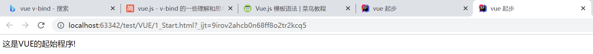
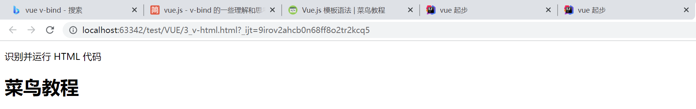
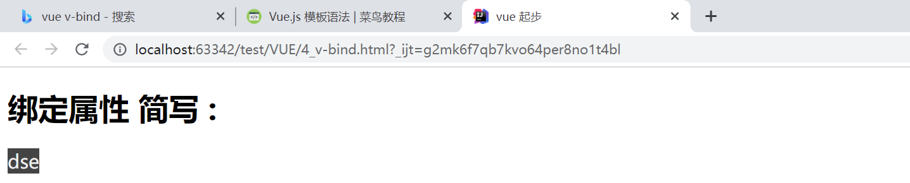
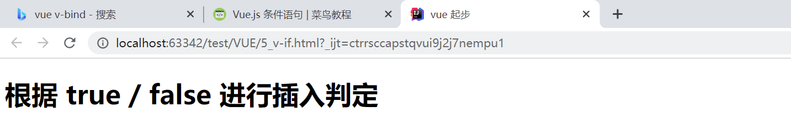
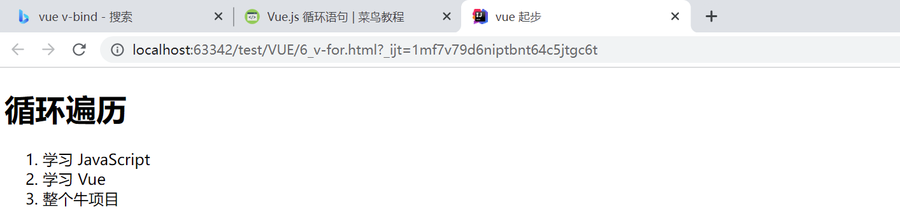
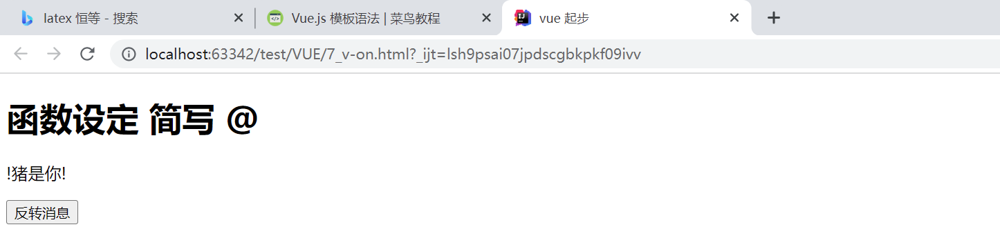
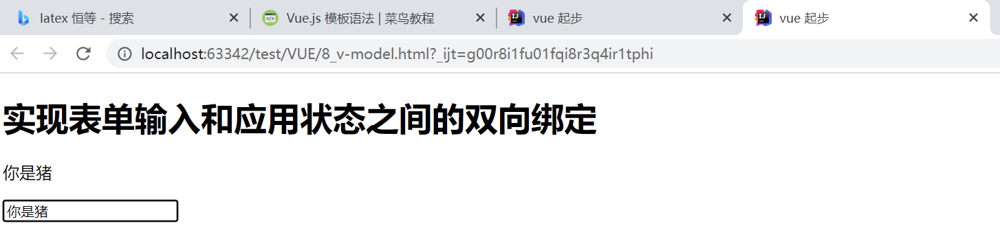
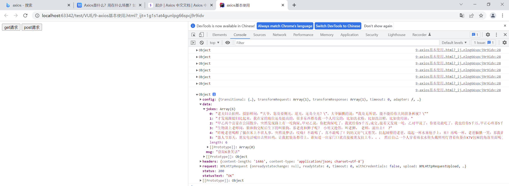

# 1 第一个 VUE 程序

**代码**

 使用 `{{ }}` 实现数据挂载,  `el` 限定生效域

```vue
<div id="app">
    {{ message }}
</div>

<script>
    var app = new Vue({
        el:'#app',
        data:{
            message: '这是VUE的起始程序!'
        }
    })
</script>
```

**结果**



---


# 2 VUE 语法

## 2.1  识别 HTML 代码( v-html)

**代码**

使用 `v-html` 识别后台传回的 `HTML` 代码并进行渲染

```vue
<p>识别并运行 HTML 代码</p>
<div id="app" v-html="message">
</div>

<script src="./vue.js"></script>
<script>
    var app = new Vue({
        el:'#app',
        data:{
            message: '<h1>菜鸟教程</h1>',
        }
    })
</script>
```

**结果**



---


## 2.2 绑定 HTML 属性(v-bind)

**代码**

使用 `v-bind 简写为 :` 为 `<h>` 标签绑定 `class = 'class1'`

$v-bind:class \ \equiv  \ :class$

```vue
<!DOCTYPE html>
<html lang="en">
<head>
    <meta charset="UTF-8">
    <title>vue 起步</title>
    <style>
        .class1{
            background: #444;
            color: #eee;
            font-size: 20px;
        }
    </style>
    <script src="./vue.js"></script>
</head>
<body>

    <h1>绑定属性 简写 :</h1>
    <div id="app-2">
          <h v-bind:class="message">
                dse
          </h>
    </div>

    <script>
        var app2 = new Vue({
            el: '#app-2',
            data: {
                message: 'class1'
            }
        })
    </script>
</body>
</html>
```

**结果**



---


## 2.3 条件语句

### 2.3.1 v-if

**代码**

根据 `v-if` 绑定的属性值 `seen` 判定是否显示所在标签 `<p>`

```vue
<!DOCTYPE html>
<html lang="en">
<head>
    <meta charset="UTF-8">
    <title>vue 起步</title>
    <script src="./vue.js"></script>
</head>
<body>
    <h1>根据 true / false 进行插入判定</h1>
    <div id="app">
        <p v-if="seen">现在你看到我了</p>
    </div>

    <script>
        new Vue({
            el: '#app',
            data: {
                seen: false
            }
        })
    </script>
</body>
</html>
```

**结果**



---


### 2.3.2  v-if 的近亲 v-show

**与 `v-if` 的用法一样, 用来控制元素是否显示**,  $ true 显示 /  false不显示$

**代码**

```vue
<!DOCTYPE html>
<html lang="en">
<head>
    <meta charset="UTF-8">
    <title>vue 起步</title>
    <script src="./vue.js"></script>
</head>
<body>
    <h1>根据 true / false 进行插入判定</h1>
    <div id="app">
        <p v-show="seen">现在你看到我了</p>
    </div>

    <script>
        new Vue({
            el: '#app',
            data: {
                seen: false
            }
        })
    </script>
</body>
</html>
```

**结果**


---


### 2.3.3 同胞 v-else 与 v-else-if

#### ① v-else

`可以用 v-else 指令给 v-if 添加一个 "else" 块：`

**代码**

```vue
<div id="app">
    <div v-if="Math.random() > 0.5">
      Sorry
    </div>
    <div v-else>
      Not sorry
    </div>
</div>
    
<script>
    new Vue({
      el: '#app'
    })
</script>
```


#### ② v-else-if

`v-else-if` 在 2.1.0 新增，顾名思义，用作 `v-if` 的 `else-if` 块。可以链式的多次使用：

**代码**

```vue
<div id="app">
    <div v-if="type === 'A'">
      A
    </div>
    <div v-else-if="type === 'B'">
      B
    </div>
    <div v-else-if="type === 'C'">
      C
    </div>
    <div v-else>
      Not A/B/C
    </div>
</div>
    
<script>
    new Vue({
      el: '#app',
      data: {
        type: 'C'
      }
    })
</script>
```

**注意: *v-else 、v-else-if 必须跟在 v-if 或者 v-else-if之后***

---


## 2.4 循环语句 v-for

循环使用 `v-for` 指令。

`v-for` 指令需要以 **site in sites** 形式的特殊语法， `sites` 是源数据数组并且 `site` 是数组元素迭代的别名。

**代码**

v-for 可以绑定数据到数组来渲染一个列表：

```vue
<h1>循环遍历</h1>
<div id="app-4">
    <ol>
        <li v-for="todo in messages">
            {{todo.text }}
        </li>
    </ol>
</div>

<script>
    var app4 = new Vue({
        el: '#app-4',
        data: {
            messages: [
                { text: '学习 JavaScript' },
                { text: '学习 Vue' },
                { text: '整个牛项目' }
            ]
        }
    })
</script>
```

**结果**



---


## 2.5 函数绑定 v-on

`v-on:` 可以简写为 @:

$v-on:click \ \equiv  \ @click$

**代码**

按钮实现 `<p>` 标签内元素的翻转

```vue
<h1>函数设定 简写 @</h1>
<div id="app-5">
    <p>{{ message }}</p>
    <button v-on:click="reverseMessage">反转消息</button>
</div>

<script>
    var app5 = new Vue({
        el: '#app-5',
        data: {
            message: '!你是猪!'
        },
        methods: {
            reverseMessage: function () {
                this.message = this.message.split('').reverse().join('')
            }
        }
    })
</script>
```

**结果**



---

---


## 2.6 双向绑定 v-model

实现表单输入和应用状态之间的双向绑定

**代码**

将 `<p>` 标签和 `input` 标签属性进行同步, 也即使用 `message` 属性实现双向绑定

```vue
<h1>实现表单输入和应用状态之间的双向绑定</h1>
<div id="app-6">
    <p>{{ message }}</p>
    <!-- 绑定 message -->
    <input v-model="message">
</div>

<script>
    var app6 = new Vue({
        el: '#app-6',
        data: {
            message: 'Hello Vue!'
        }
    })
</script>
```


**结果**



---


# 3 axios

## Axios是什么？

Axios 是一个基于 promise 的 HTTP 库，简单的讲就是可以发送get、post请求。说到get、post，大家应该第一时间想到的就是Jquery吧，毕竟前几年Jquery比较火的时候，大家都在用他。但是由于Vue、React等框架的出现，Jquery也不是那么吃香了。也正是Vue、React等框架的出现，促使了Axios轻量级库的出现，因为Vue等，不需要操作Dom，所以不需要引入Jquery.js了。


## Axios特性

1、可以在浏览器中发送 XMLHttpRequests
2、可以在 node.js 发送 http 请求
3、支持 Promise API
4、拦截请求和响应
5、转换请求数据和响应数据
6、能够取消请求
7、自动转换 JSON 数据
8、客户端支持保护安全免受 XSRF 攻击


## Axios用在什么场景？

在特性里面已经有提到，浏览器发送请求，或者Node.js发送请求都可以用到Axios。像Vue、React、Node等项目就可以使用Axios，如果你的项目里面用了Jquery，此时就不需要多此一举了，jquery里面本身就可以发送请求。


## Axios 实现讲笑话功能

主要使用 `Axios` 实现了 `post` 和 `get` 的功能, 也即从外部接口 `获取/发送` 数据。

```vue
<!DOCTYPE html>
<html lang="en">

<head>
    <meta charset="UTF-8" />
    <meta name="viewport" content="width=device-width, initial-scale=1.0" />
    <meta http-equiv="X-UA-Compatible" content="ie=edge" />
    <title>axios基本使用</title>
</head>

<body>
    <input type="button" value="get请求" class="get">
    <input type="button" value="post请求" class="post">
    <!-- 官网提供的 axios 在线地址 -->
    <script src="https://unpkg.com/axios/dist/axios.min.js"></script>
    <script>
        /*
            接口1:随机笑话
            请求地址:https://autumnfish.cn/api/joke/list
            请求方法:get
            请求参数:num(笑话条数,数字)
            响应内容:随机笑话
        */
        document.querySelector(".get").onclick = function () {
            axios.get("https://autumnfish.cn/api/joke/list?num=6")
            // axios.get("https://autumnfish.cn/api/joke/list1234?num=6")
            .then(function (response) {
                console.log(response);
              },function(err){
                  console.log(err);
              })
        }
        /*
             接口2:用户注册
             请求地址:https://autumnfish.cn/api/user/reg
             请求方法:post
             请求参数:username(用户名,字符串)
             响应内容:注册成功或失败
         */
        document.querySelector(".post").onclick = function () {
            axios.post("https://autumnfish.cn/api/user/reg",{username:"盐焗西兰花"})
            .then(function(response){
                console.log(response);
                console.log(this.skill);
            },function (err) {
                console.log(err);
              })
          }

    </script>
</body>
</html>
```

**结果**



---


# 4 相关项目

## 4.1 小黑记事本

```vue
<html>

<head>
  <meta http-equiv="content-type" content="text/html; charset=UTF-8" />
  <title>小黑记事本</title>
  <meta http-equiv="content-type" content="text/html; charset=UTF-8" />
  <meta name="robots" content="noindex, nofollow" />
  <meta name="googlebot" content="noindex, nofollow" />
  <meta name="viewport" content="width=device-width, initial-scale=1" />
  <link rel="stylesheet" type="text/css" href="./css/index.css" />
</head>

<body>
<!-- 主体区域 -->
<section id="todoapp">
  <!-- 输入框 -->
  <header class="header">
    <h1>小黑记事本</h1>
    <input v-model="inputValue" v-on:keyup.enter="add" autofocus="autofocus" autocomplete="off" placeholder="请输入任务"
           class="new-todo" />
  </header>
  <!-- 列表区域 -->
  <section class="main">
    <ul class="todo-list">
      <li class="todo" v-for="(item,index) in list">
        <div class="view">
          <span class="index">{{ index+1 }}.</span>
          <label>{{ item }}</label>
          <button class="destroy" v-on:click="remove(index)"></button>
        </div>
      </li>
    </ul>
  </section>
  <!-- 统计和清空 -->
  <footer class="footer" >
      <span class="todo-count" v-if="list.length!=0">
        <strong>{{ list.length }}</strong> items left
      </span>
    <button class="clear-completed" v-on:click="clear" v-if="list.length!=0">
      Clear
    </button>
  </footer>
</section>
<!-- 底部 -->
<footer class="info">
  <p>
    <a href="http://www.itheima.com/"></a>
  </p>
</footer>
<a href></a>
<!-- 开发环境版本，包含了有帮助的命令行警告 -->
<script src="https://cdn.jsdelivr.net/npm/vue/dist/vue.js"></script>
<script>
    var app = new Vue({
        el:"#todoapp",
        data:{
          list:["写代码","吃饭","睡觉"],
          inputValue:"测试数据",
        },
        methods:{
          add:function(){
            this.list.push(this.inputValue);
          },
          remove:function (index) {
            // 方法一
            //this.list.pop(index);
            // 方法二
            this.list.splice(index,1);    //每次去除1行
          },
          clear:function () {
            this.list = [];
          }
        }
    })
</script>
</body>

</html>
```

---


## 4.2 天知道

**HTML 代码**

```html
<!DOCTYPE html>
<html lang="en">

<head>
  <meta charset="UTF-8" />
  <meta name="viewport" content="width=device-width, initial-scale=1.0" />
  <meta http-equiv="X-UA-Compatible" content="ie=edge" />
  <title>天知道</title>
  <link rel="stylesheet" href="css/reset.css" />
  <link rel="stylesheet" href="css/index.css" />
</head>

<body>
  <div class="wrap" id="app">
    <div class="search_form">
      <div class="logo"></div>
      <div class="form_group">
        <input type="text" v-model="city"  @keyup.enter="searchWeather"   class="input_txt" placeholder="请输入查询的天气"/>
        <button class="input_sub" @click="searchWeather()">
          搜 索
        </button>
      </div>
      <div class="hotkey" >
        <a href="javascript:;" v-on:click="changeCity('北京')">北京</a>
        <a href="javascript:;" v-on:click="changeCity('上海')">上海</a>
        <a href="javascript:;" v-on:click="changeCity('广州')">广州</a>
        <a href="javascript:;" v-on:click="changeCity('深圳')">深圳</a>
      </div>
    </div>
    <ul class="weather_list">
      <li v-for="item in weatherList">
        <div class="info_type"><span class="iconfont">{{ item.type }}</span></div>
        <div class="info_temp">
          <b>{{ item.low }}</b>
          ~
          <b>{{ item.high }}</b>
        </div>
        <div class="info_date"><span>{{ item.date }}</span></div>
      </li>
    </ul>
  </div>
  <!-- 开发环境版本，包含了有帮助的命令行警告 -->
  <script src="https://cdn.jsdelivr.net/npm/vue/dist/vue.js"></script>
  <!-- 官网提供的 axios 在线地址 -->
  <script src="https://unpkg.com/axios/dist/axios.min.js"></script>
  <!-- 自己的js -->
  <script src="js/test.js"></script>
</body>

</html>
```


**JS 代码**

```js
var app = new Vue({
    el:"#app",
    data:{
        city:'',
        weatherList:[]
    },
    methods:{
        searchWeather:function () {
            var that = this;
            console.log("天气查询");
            axios.get('http://wthrcdn.etouch.cn/weather_mini?city='+this.city).then(
                function (response) {
                    console.log(response.data.data.forecast);
                    that.weatherList = response.data.data.forecast;
                }).catch(function (err) {
            })
        },
        changeCity:function (city) {
            this.city = city;
            this.searchWeather();
        }
    }
})
```

---


## 4.3 悦听播放器

**HTML代码**

```html
<!DOCTYPE html>
<html lang="en">

<head>
  <meta charset="UTF-8" />
  <meta name="viewport" content="width=device-width, initial-scale=1.0" />
  <meta http-equiv="X-UA-Compatible" content="ie=edge" />
  <title>悦听player</title>
  <!-- 样式 -->
  <link rel="stylesheet" href="css/index.css">
</head>

<body>
  <div class="wrap">
    <!-- 播放器主体区域 -->
    <div class="play_wrap" id="player">
      <div class="search_bar">
        
        <!-- 搜索歌曲 -->
        <input type="text" autocomplete="off" v-model="query" @keyup.enter="searchMusic" placeholder="请输入歌手获或歌名"/>
      </div>
      <div class="center_con">
        <!-- 搜索歌曲列表 -->
        <div class='song_wrapper'>
          <ul class="song_list">
            <li v-for="item in musicList">
              <a href="javascript:;" @click="playMusic(item.id)"></a> 
              <b>{{ item.name }}</b> 
              <span v-if="item.mvid!=0" @click="playMV(item.mvid)"><i></i></span>
            </li>
          </ul>
          
        </div>
        <!-- 歌曲信息容器 -->
        <div class="player_con" :class="{playing:isPlaying}">
          
          <!-- 黑胶碟片 -->
          
          
        </div>

        <!--详细信息容器-->
        <div class="detail_con">
          <b>{{ title }}</b>
        </div>


        <!-- 评论容器 -->
        <div class="comment_wrapper">
          <h5 class='title'>热门留言</h5>
          <div class='comment_list'>
            <dl v-for="item in hotComments">
              <dt></dt>
              <dd class="name">{{ item.nickname}}</dd>
              <dd class="detail">
                {{ item.content }}
              </dd>
            </dl>
          </div>
          
        </div>
      </div>
      <div class="audio_con">
        <audio ref='audio' @play="play" @pause="pause" :src="musicUrl" controls autoplay loop class="myaudio"></audio>
      </div>
      <div class="video_con" v-show="isShow" style="display: none;">
        <video :src="mvUrl" controls="controls"></video>
        <div class="mask" @click="hide"></div>
      </div>
    </div>
  </div>
  <!-- 开发环境版本，包含了有帮助的命令行警告 -->
  <script src="https://cdn.jsdelivr.net/npm/vue/dist/vue.js"></script>
  <!-- 官网提供的 axios 在线地址 -->
  <script src="https://unpkg.com/axios/dist/axios.min.js"></script>
  <script src="js/main.js"></script>
</body>

</html>
```


**js 代码**

```js
/*
  1:歌曲搜索接口
    请求地址:https://autumnfish.cn/search
    请求方法:get
    请求参数:keywords(查询关键字)
    响应内容:歌曲搜索结果

  2:歌曲url获取接口
    请求地址:https://autumnfish.cn/song/url
    请求方法:get
    请求参数:id(歌曲id)
    响应内容:歌曲url地址
  3.歌曲详情获取
    请求地址:https://autumnfish.cn/song/detail
    请求方法:get
    请求参数:ids(歌曲id)
    响应内容:歌曲详情(包括封面信息)
  4.热门评论获取
    请求地址:https://autumnfish.cn/comment/hot?type=0
    请求方法:get
    请求参数:id(歌曲id,地址中的type固定为0)
    响应内容:歌曲的热门评论
  5.mv地址获取
    请求地址:https://autumnfish.cn/mv/url
    请求方法:get
    请求参数:id(mvid,为0表示没有mv)
    响应内容:mv的地址
*/
var app = new Vue({
  el: "#player",
  data: {
    // 查询关键字
    query: "",
    // 歌曲数组
    musicList: [],

      //歌曲详细信息
      title:"",
      lyric:"",

    // 歌曲地址
    musicUrl: "",
    // 歌曲封面
    musicCover: "https://p1.music.126.net/R7gU6oGYmVSWIkRfuZ6Bag==/109951164000969173.jpg",
    // 歌曲评论
    hotComments: [],
    // 动画播放状态
    isPlaying: false,
    // 遮罩层的显示状态
    isShow: false,
    // mv地址
    mvUrl: "",
  },
  methods: {
    // 歌曲搜索
    searchMusic: function() {
      var that = this;
      axios.get("https://autumnfish.cn/search?keywords=" + this.query).then(
          function(response) {
            // console.log(response);
            that.musicList = response.data.result.songs;
            //console.log(response.data.result.songs);
          },
          function(err) {}
      );
    },
    // 歌曲播放
    playMusic: function(musicId) {
      var that = this;
      that.musicUrl = "http://music.163.com/song/media/outer/url?id=" + musicId + ".mp3";

      // 歌曲详情获取
      axios.get("https://api.paugram.com/netease?id=" + musicId).then(
          function(response) {
            console.log(response.data);
            that.musicCover = response.data.cover;
            that.title = response.data.title;
          },
          function(err) {}
      );

      // 歌曲评论获取
      axios.get("https://autumnfish.cn/comment/hot?type=0&id=" + musicId).then(
          function(response) {
            // console.log(response);
            // console.log(response.data.hotComments);
            that.hotComments = response.data.hotComments;
          },
          function(err) {}
      );
    },
    // 歌曲播放
    play: function() {
      // console.log("play");
      this.isPlaying = true;
    },
    // 歌曲暂停
    pause: function() {
      // console.log("pause");
      this.isPlaying = false;
    },
    // 播放mv
    playMV: function(mvid) {
      var that = this;
      axios.get("https://autumnfish.cn/mv/url?id=" + mvid).then(
          function(response) {
            // console.log(response);
            //console.log(response.data.data.url);
            that.isShow = true;
            that.mvUrl = response.data.data.url;
          },
          function(err) {}
      );
    },
    // 隐藏
    hide: function() {
      this.isShow = false;
    }
  }
});
```


# 5 VUE 环境搭建

视频 link  https://www.bilibili.com/video/BV1QU4y1E7qo?p=4&spm_id_from=pageDriver

- node.js

- npm

- cnpm  提高下载速度

- yarn 包管理工具

- vue-cli          vue 项目管理工具

  ```cmd
  /* 创建项目 */
      //旧版本
      vue init webpack permission-ui
      //新版本
      vue create myvue
  
  /* 运行项目 */
  npm run serve
  ```

  
