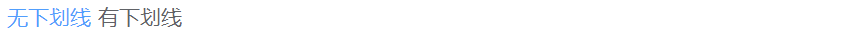
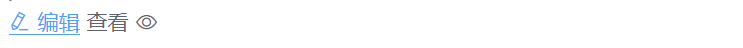
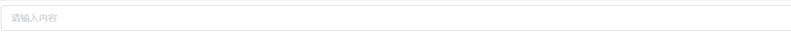
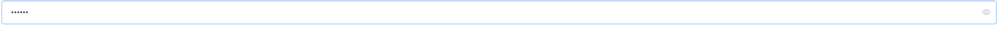
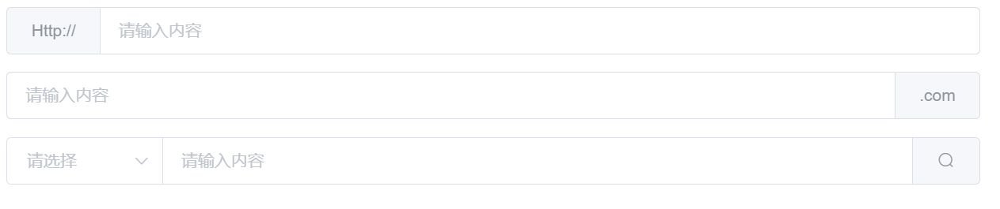

# elementUI 笔记

基于 `VUE` 开发的 `UI 框架`, 它与 `VUE` 一样提供了调用 `DOM` 的接口。使用户不再直接和 `DOM` 直接操作, 而是通过框架来完成相应的渲染展示。 因此它于其他基于 `JQuery` 的 UI框架,如 `BootStrap`、`LayUI` 等不同, `elementUI` 仅可搭配 `VUE框架`进行使用。 


**模板**

本地化需要引入 `elementUI组件包` 以及 `vue.js` 文件

以下模板是结合其后的 elementUI 组件代码组合使用的, 将后续代码放入 `<div id="app"> 放入此位置</div>` 其中即可渲染运行

```html
<!DOCTYPE html>
<html lang="en">
<head>
  <meta charset="UTF-8">
  <title>模板</title>
  <!-- 引入组件库 -->
  <script src="./lib/vue.js"></script>
  <!-- 引入组件库 -->
  <script src="./lib/elementUI/index.js"></script>
  <!-- 引入样式 -->
  <link rel="stylesheet" href="./lib/elementUI/theme-chalk/index.css">
</head>
<body>
<div id="app">


</div>
</body>

<script>
  var apps = new Vue({
      el:'#app',
  })
</script>
</html>
```


## 1 按钮 el-button

### 1.1 默认样式


```html
  <el-row>
    <el-button>默认按钮</el-button>
    <el-button type="primary">主要按钮</el-button>
    <el-button type="success">成功按钮</el-button>
    <el-button type="info">信息按钮</el-button>
    <el-button type="warning">警告按钮</el-button>
    <el-button type="danger">危险按钮</el-button>
  </el-row>
```


### 1.2 朴素样式


```html
<el-row>
  <el-button plain>朴素按钮</el-button>
  <el-button type="primary" plain>主要按钮</el-button>
  <el-button type="success" plain>成功按钮</el-button>
  <el-button type="info" plain>信息按钮</el-button>
  <el-button type="warning" plain>警告按钮</el-button>
  <el-button type="danger" plain>危险按钮</el-button>
</el-row>
```


### 1.3 圆角样式


```html
<el-row>
  <el-button round>圆角按钮</el-button>
  <el-button type="primary" round>主要按钮</el-button>
  <el-button type="success" round>成功按钮</el-button>
  <el-button type="info" round>信息按钮</el-button>
  <el-button type="warning" round>警告按钮</el-button>
  <el-button type="danger" round>危险按钮</el-button>
</el-row>
```


### 1.4 功能按钮


```html
<el-row>
  <el-button icon="el-icon-search" circle></el-button>
  <el-button type="primary" icon="el-icon-edit" circle></el-button>
  <el-button type="success" icon="el-icon-check" circle></el-button>
  <el-button type="info" icon="el-icon-message" circle></el-button>
  <el-button type="warning" icon="el-icon-star-off" circle></el-button>
  <el-button type="danger" icon="el-icon-delete" circle></el-button>
</el-row>
```


### 1.5 禁用按钮

你可以使用`disabled`属性来定义按钮是否可用，它接受一个`Boolean`值。


```html
<el-row>
  <el-button disabled>默认按钮</el-button>
  <el-button type="primary" disabled>主要按钮</el-button>
  <el-button type="success" disabled>成功按钮</el-button>
  <el-button type="info" disabled>信息按钮</el-button>
  <el-button type="warning" disabled>警告按钮</el-button>
  <el-button type="danger" disabled>危险按钮</el-button>
</el-row>
```


### 1.6 文字按钮

没有边框和背景色的按钮。


```html
<el-button type="text">文字按钮</el-button>
<el-button type="text" disabled>文字按钮</el-button>
```


### 1.7 图标按钮

带图标的按钮可增强辨识度（有文字）或节省空间（无文字）。


```html
<el-button type="primary" icon="el-icon-edit"></el-button>
<el-button type="primary" icon="el-icon-share"></el-button>
<el-button type="primary" icon="el-icon-delete"></el-button>
<el-button type="primary" icon="el-icon-search">搜索</el-button>
<el-button type="primary">上传<i class="el-icon-upload el-icon--right"></i></el-button>
```


### 1.8 按钮组


```html
<el-button-group>
  <el-button type="primary" icon="el-icon-edit"></el-button>
  <el-button type="primary" icon="el-icon-share"></el-button>
  <el-button type="primary" icon="el-icon-delete"></el-button>
</el-button-group>
```


### 1.9 加载中

点击按钮后进行数据加载操作，在按钮上显示加载状态。

要设置为 loading 状态，只要设置`loading`属性为`true`即可。


```html
<el-button type="primary" :loading="true">加载中</el-button>
```


### 1.10 不同尺寸

Button 组件提供除了默认值以外的三种尺寸，可以在不同场景下选择合适的按钮尺寸。


额外的尺寸：`medium`、`small`、`mini`，通过设置`size`属性来配置它们。

```html
<el-row>
  <el-button>默认按钮</el-button>
  <el-button size="medium">中等按钮</el-button>
  <el-button size="small">小型按钮</el-button>
  <el-button size="mini">超小按钮</el-button>
</el-row>
<el-row>
  <el-button round>默认按钮</el-button>
  <el-button size="medium" round>中等按钮</el-button>
  <el-button size="small" round>小型按钮</el-button>
  <el-button size="mini" round>超小按钮</el-button>
</el-row>
```


## 2 文字链接 el-link

### 2.1 基础用法

基础的文字链接用法。

**注意: 在 `elementUI` 的网址引用必须加入 `https://` 前缀, 否则会默认以本地路径进行跳转。**


```html
  <div>
    <el-link href="https://www.baidu.com" target="_blank" type="danger">百度</el-link>
    <el-link href="https://element.eleme.io" target="_blank">默认链接</el-link>
    <el-link type="primary">主要链接</el-link>
    <el-link type="success">成功链接</el-link>
    <el-link type="warning">警告链接</el-link>
    <el-link type="danger">危险链接</el-link>
    <el-link type="info">信息链接</el-link>
  </div>
```


### 2.2 禁用状态

文字链接不可用状态。

`disabled`


```html
<div>
  <el-link disabled>默认链接</el-link>
  <el-link type="primary" disabled>主要链接</el-link>
  <el-link type="success" disabled>成功链接</el-link>
  <el-link type="warning" disabled>警告链接</el-link>
  <el-link type="danger" disabled>危险链接</el-link>
  <el-link type="info" disabled>信息链接</el-link>
</div>
```


### 2.3 下划线

文字链接下划线。

`:underline="false" / "true"`

这里的区别在于, 鼠标移动到 `link` 标签上是文字显示是否包含下划线



```html
<div>
  <el-link :underline="false">无下划线</el-link>
  <el-link>有下划线</el-link>
</div>
```


### 2.4 图标链接

`带图标`的文字链接可增强辨识度。

`icon="el-icon-edit"` 



```html
<div>
  <el-link icon="el-icon-edit">编辑</el-link>
  <el-link>查看<i class="el-icon-view el-icon--right"></i> </el-link>
</div>
```


### 2.5 相关属性

| 参数      | 说明           | 类型    | 可选值                                      | 默认值  |
| :-------- | :------------- | :------ | :------------------------------------------ | :------ |
| type      | 类型           | string  | primary / success / warning / danger / info | default |
| underline | 是否下划线     | boolean | —                                           | true    |
| disabled  | 是否禁用状态   | boolean | —                                           | false   |
| href      | 原生 href 属性 | string  | —                                           | -       |
| icon      | 图标类名       | string  | —                                           | -       |


## 3 单选框 el-radio

在一组备选项中进行单选

### 3.1 基础用法

由于选项默认可见，不宜过多，若选项过多，建议使用 `Select` 选择器。


要使用 `Radio` 组件，只需要设置`v-model`绑定变量，选中意味着变量的值为相应 Radio `label`属性的值，`label`可以是`String`、`Number`或`Boolean`。

**注意: 使用 `radio` 组件需要使用 `v-model` 进行双向绑定, 否则无法进行选择**

```html
<template>
  <el-radio v-model="radio" label="1">备选项</el-radio>
  <el-radio v-model="radio" label="2">备选项</el-radio>
</template>

<script>
  var apps = new Vue({
      el:'#app',
      data:{
        radio:1,
      }
  })
</script>
```


### 3.2 禁用状态

单选框不可用的状态。


只要在`el-radio`元素中设置`disabled`属性即可，它接受一个`Boolean`，`true`为禁用。

```html
<template>
  <el-radio disabled v-model="radio" label="禁用">备选项</el-radio>
  <el-radio disabled v-model="radio" label="选中且禁用">备选项</el-radio>
</template>

<script>
  var apps = new Vue({
      el:'#app',
      data:{
        radio:"选中且禁用",
      }
  })
</script>
```


### 3.3 单选框组

适用于在多个互斥的选项中选择的场景


结合`el-radio-group`元素和子元素`el-radio`可以实现单选组，在`el-radio-group`中绑定`v-model`，在`el-radio`中设置好`label`即可，无需再给每一个`el-radio`绑定变量，另外，还提供了`change`事件来响应变化，它会传入一个参数`value`。

```html
<template>
  <el-radio-group v-model="radio">
    <el-radio :label="3">备选项</el-radio>
    <el-radio :label="6">备选项</el-radio>
    <el-radio :label="9">备选项</el-radio>
  </el-radio-group>
</template>

<script>
  export default {
    data () {
      return {
        radio: 3
      };
    }
  }
</script>
```


### 3.4 按钮样式

按钮样式的单选组合。

`el-radio-group`


只需要把`el-radio`元素换成`el-radio-button`元素即可，此外，Element 还提供了`size`属性。

```html
<template>
  <div>
    <el-radio-group v-model="radio1">
      <el-radio-button label="上海"></el-radio-button>
      <el-radio-button label="北京"></el-radio-button>
      <el-radio-button label="广州"></el-radio-button>
      <el-radio-button label="深圳"></el-radio-button>
    </el-radio-group>
  </div>
  <div style="margin-top: 20px">
    <el-radio-group v-model="radio2" size="medium">
      <el-radio-button label="上海" ></el-radio-button>
      <el-radio-button label="北京"></el-radio-button>
      <el-radio-button label="广州"></el-radio-button>
      <el-radio-button label="深圳"></el-radio-button>
    </el-radio-group>
  </div>
  <div style="margin-top: 20px">
    <el-radio-group v-model="radio3" size="small">
      <el-radio-button label="上海"></el-radio-button>
      <el-radio-button label="北京" disabled ></el-radio-button>
      <el-radio-button label="广州"></el-radio-button>
      <el-radio-button label="深圳"></el-radio-button>
    </el-radio-group>
  </div>
  <div style="margin-top: 20px">
    <el-radio-group v-model="radio4" disabled size="mini">
      <el-radio-button label="上海"></el-radio-button>
      <el-radio-button label="北京"></el-radio-button>
      <el-radio-button label="广州"></el-radio-button>
      <el-radio-button label="深圳"></el-radio-button>
    </el-radio-group>
  </div>
</template>

<script>
  var apps = new Vue({
      el:'#app',
      data:{
        radio:3,
      }
  })
</script>
```


### 3.5 带有边框


设置`border`属性可以渲染为带有边框的单选框。

```html
<template>
  <div>
    <el-radio v-model="radio1" label="1" border>备选项1</el-radio>
    <el-radio v-model="radio1" label="2" border>备选项2</el-radio>
  </div>
  <div style="margin-top: 20px">
    <el-radio v-model="radio2" label="1" border size="medium">备选项1</el-radio>
    <el-radio v-model="radio2" label="2" border size="medium">备选项2</el-radio>
  </div>
  <div style="margin-top: 20px">
    <el-radio-group v-model="radio3" size="small">
      <el-radio label="1" border>备选项1</el-radio>
      <el-radio label="2" border disabled>备选项2</el-radio>
    </el-radio-group>
  </div>
  <div style="margin-top: 20px">
    <el-radio-group v-model="radio4" size="mini" disabled>
      <el-radio label="1" border>备选项1</el-radio>
      <el-radio label="2" border>备选项2</el-radio>
    </el-radio-group>
  </div>
</template>

<script>
  var apps = new Vue({
      el:'#app',
      data:{
        radio1:1,
        radio2:1,
        radio3:1,
        radio4:1,
      }
  })
</script>
```


### 3.6 属性

#### Radio Attributes

| 参数            | 说明                                 | 类型                      | 可选值                | 默认值 |
| :-------------- | :----------------------------------- | :------------------------ | :-------------------- | :----- |
| value / v-model | 绑定值                               | string / number / boolean | —                     | —      |
| label           | Radio 的 value                       | string / number / boolean | —                     | —      |
| disabled        | 是否禁用                             | boolean                   | —                     | false  |
| border          | 是否显示边框                         | boolean                   | —                     | false  |
| size            | Radio 的尺寸，仅在 border 为真时有效 | string                    | medium / small / mini | —      |
| name            | 原生 name 属性                       | string                    | —                     | —      |


#### Radio Events

| 事件名称 | 说明                   | 回调参数              |
| :------- | :--------------------- | :-------------------- |
| change   | 绑定值变化时触发的事件 | 选中的 Radio label 值 |


#### Radio-group Attributes

| 参数            | 说明                                                       | 类型                      | 可选值                | 默认值  |
| :-------------- | :--------------------------------------------------------- | :------------------------ | :-------------------- | :------ |
| value / v-model | 绑定值                                                     | string / number / boolean | —                     | —       |
| size            | 单选框组尺寸，仅对按钮形式的 Radio 或带有边框的 Radio 有效 | string                    | medium / small / mini | —       |
| disabled        | 是否禁用                                                   | boolean                   | —                     | false   |
| text-color      | 按钮形式的 Radio 激活时的文本颜色                          | string                    | —                     | #ffffff |
| fill            | 按钮形式的 Radio 激活时的填充色和边框色                    | string                    | —                     | #409EFF |


#### Radio-group Events

| 事件名称 | 说明                   | 回调参数              |
| :------- | :--------------------- | :-------------------- |
| change   | 绑定值变化时触发的事件 | 选中的 Radio label 值 |


#### Radio-button Attributes

| 参数     | 说明           | 类型            | 可选值 | 默认值 |
| :------- | :------------- | :-------------- | :----- | :----- |
| label    | Radio 的 value | string / number | —      | —      |
| disabled | 是否禁用       | boolean         | —      | false  |
| name     | 原生 name 属性 | string          | —      | —      |


## 4 多选框 el-checkbox

一组备选项中进行多选

### 4.1 基础用法

单独使用可以表示两种状态之间的切换，写在标签中的内容为 `checkbox` 按钮后的介绍。


在`el-checkbox`元素中定义`v-model`绑定变量，单一的`checkbox`中，默认绑定变量的值会是`Boolean`，选中为`true`。

```html
 <template>
    <!-- `checked` 为 true 或 false -->
    <el-checkbox v-model="checked">备选项</el-checkbox>
    <el-checkbox v-model="checked">备选项</el-checkbox>
 </template>
  
<script>
  var apps = new Vue({
    el:'#app',
    data:{
      checked:true,
    }
  })
</script>
```


### 4.2 禁用状态

多选框不可用状态。


设置`disabled`属性即可。

```html
<template>
    <!-- `checked` 为 true 或 false -->
    <el-checkbox v-model="checked" disabled>备选项</el-checkbox>
    <el-checkbox v-model="checked" disabled>备选项</el-checkbox>
</template>
<script>
  var apps = new Vue({
    el:'#app',
    data:{
      checked:true,
    }
  })
</script>
```


### 4.3 多选框组

适用于多个勾选框绑定到同一个数组的情景，通过是否勾选来表示这一组选项中选中的项。


`checkbox-group`元素能把多个 `checkbox` 管理为一组，只需要在 `Group` 中使用`v-model`绑定`Array`类型的变量即可。 `el-checkbox` 的 `label`属性是该 `checkbox` 对应的值，若该标签中无内容，则该属性也充当 `checkbox` 按钮后的介绍。`label`与数组中的元素值相对应，如果存在指定的值则为选中状态，否则为不选中。

```html
<template>
  <el-checkbox-group v-model="checkList">
    <el-checkbox label="复选框 A"></el-checkbox>
    <el-checkbox label="复选框 B"></el-checkbox>
    <el-checkbox label="复选框 C"></el-checkbox>
    <el-checkbox label="禁用" disabled></el-checkbox>
    <el-checkbox label="选中且禁用" disabled></el-checkbox>
  </el-checkbox-group>
</template>

<script>
  var apps = new Vue({
    el:'#app',
    data:{
      checked:true,
      checkList: ['选中且禁用','复选框 A'],
    }
  })
</script>
```


### 4.4 indeterminate 状态

`indeterminate` 属性用以表示 checkbox 的不确定状态，一般用于实现全选的效果

**indeterminate 仅仅是控制样式,  true 显示 为 短横线, false 显示为 √**

`:indeterminate="isIndeterminate"`


```html
 <template>
    <el-checkbox :indeterminate="isIndeterminate" v-model="checkAll" @change="handleCheckAllChange">全选	  </el-checkbox>
    <div style="margin: 15px 0;"></div>
    <el-checkbox-group v-model="checkedCities" @change="handleCheckedCitiesChange">
      <el-checkbox v-for="city in cities" :label="city" :key="city">{{city}}</el-checkbox>
    </el-checkbox-group>
 </template>


<script>
  const cityOptions = ['上海', '北京', '广州', '深圳'];
  var apps = new Vue({
    el:'#app',
    data:{
      checked:true,
      checkList: ['选中且禁用','复选框 A'],
      checkAll: false,
      checkedCities: ['上海', '北京'],
      cities: cityOptions,
      isIndeterminate: true
    },
    methods: {
      //如果 val 也即全选按钮被点击开始执行
      handleCheckAllChange(val) {
        this.checkedCities = val ? cityOptions : [];  //置空 或是置满
        this.isIndeterminate = false;                 //
      },
      handleCheckedCitiesChange(value) {
        let checkedCount = value.length;
        this.checkAll = checkedCount === this.cities.length;  //如果选中的数量 == 城市的数量, 置 checekALl = ture 否则为 false
        this.isIndeterminate = checkedCount > 0 && checkedCount < this.cities.length; //更改样式 为短横线
      }
    }
  })
</script>
```


### 4.5 可选项目数量的限制

使用 `min` 和 `max` 属性能够限制可以被勾选的项目的数量。

`:min="1"`
`:max="2"`


```html
<template>
  <el-checkbox-group 
    v-model="checkedCities"
    :min="1"
    :max="2">
    <el-checkbox v-for="city in cities" :label="city" :key="city">{{city}}</el-checkbox>
  </el-checkbox-group>
</template>
<script>
  const cityOptions = ['上海', '北京', '广州', '深圳'];
  export default {
    data() {
      return {
        checkedCities: ['上海', '北京'],
        cities: cityOptions
      };
    }
  };
</script>
```


### 4.6 按钮样式

按钮样式的多选组合。

`el-checkbox-button` 


只需要把`el-checkbox`元素替换为`el-checkbox-button`元素即可。此外，`Element` 还提供了`size`属性。

```html
<template>
  <div>
    <el-checkbox-group v-model="checkboxGroup1">
      <el-checkbox-button v-for="city in cities" :label="city" :key="city">{{city}}</el-checkbox-button>
    </el-checkbox-group>
  </div>
  <div style="margin-top: 20px">
    <el-checkbox-group v-model="checkboxGroup2" size="medium">
      <el-checkbox-button v-for="city in cities" :label="city" :key="city">{{city}}</el-checkbox-button>
    </el-checkbox-group>
  </div>
  <div style="margin-top: 20px">
    <el-checkbox-group v-model="checkboxGroup3" size="small">
      <el-checkbox-button v-for="city in cities" :label="city" :disabled="city === '北京'" :key="city">{{city}}</el-checkbox-button>
    </el-checkbox-group>
  </div>
  <div style="margin-top: 20px">
    <el-checkbox-group v-model="checkboxGroup4" size="mini" disabled>
      <el-checkbox-button v-for="city in cities" :label="city" :key="city">{{city}}</el-checkbox-button>
    </el-checkbox-group>
  </div>
</template>
<script>
  const cityOptions = ['上海', '北京', '广州', '深圳'];
  var apps = new Vue({
      el:'#app',
      data:{
      	  checkboxGroup1: ['上海'],
          checkboxGroup2: ['上海'],
          checkboxGroup3: ['上海'],
          checkboxGroup4: ['上海'],
      }
  })
</script>
```


### 4.7 带有边框

`border`


设置`border`属性可以渲染为带有边框的多选框。

```html
<template>
  <div>
    <el-checkbox v-model="checked1" label="备选项1" border></el-checkbox>
    <el-checkbox v-model="checked2" label="备选项2" border></el-checkbox>
  </div>
  <div style="margin-top: 20px">
    <el-checkbox v-model="checked3" label="备选项1" border size="medium"></el-checkbox>
    <el-checkbox v-model="checked4" label="备选项2" border size="medium"></el-checkbox>
  </div>
  <div style="margin-top: 20px">
    <el-checkbox-group v-model="checkboxGroup1" size="small">
      <el-checkbox label="备选项1" border></el-checkbox>
      <el-checkbox label="备选项2" border disabled></el-checkbox>
    </el-checkbox-group>
  </div>
  <div style="margin-top: 20px">
    <el-checkbox-group v-model="checkboxGroup2" size="mini" disabled>
      <el-checkbox label="备选项1" border></el-checkbox>
      <el-checkbox label="备选项2" border></el-checkbox>
    </el-checkbox-group>
  </div>
</template>

<script>
  export default {
    data () {
      return {
        checked1: true,
        checked2: false,
        checked3: false,
        checked4: true,
        checkboxGroup1: [],
        checkboxGroup2: []
      };
    }
  }
</script>
```


### 4.8 相关属性

#### Checkbox Attributes

| 参数            | 说明                                                         | 类型                      | 可选值                | 默认值 |
| :-------------- | :----------------------------------------------------------- | :------------------------ | :-------------------- | :----- |
| value / v-model | 绑定值                                                       | string / number / boolean | —                     | —      |
| label           | 选中状态的值（只有在`checkbox-group`或者绑定对象类型为`array`时有效） | string / number / boolean | —                     | —      |
| true-label      | 选中时的值                                                   | string / number           | —                     | —      |
| false-label     | 没有选中时的值                                               | string / number           | —                     | —      |
| disabled        | 是否禁用                                                     | boolean                   | —                     | false  |
| border          | 是否显示边框                                                 | boolean                   | —                     | false  |
| size            | Checkbox 的尺寸，仅在 border 为真时有效                      | string                    | medium / small / mini | —      |
| name            | 原生 name 属性                                               | string                    | —                     | —      |
| checked         | 当前是否勾选                                                 | boolean                   | —                     | false  |
| indeterminate   | 设置 indeterminate 状态，只负责样式控制                      | boolean                   | —                     | false  |


#### Checkbox Events

| 事件名称 | 说明                     | 回调参数   |
| :------- | :----------------------- | :--------- |
| change   | 当绑定值变化时触发的事件 | 更新后的值 |


#### Checkbox-group Attributes

| 参数            | 说明                                                         | 类型    | 可选值                | 默认值  |
| :-------------- | :----------------------------------------------------------- | :------ | :-------------------- | :------ |
| value / v-model | 绑定值                                                       | array   | —                     | —       |
| size            | 多选框组尺寸，仅对按钮形式的 Checkbox 或带有边框的 Checkbox 有效 | string  | medium / small / mini | —       |
| disabled        | 是否禁用                                                     | boolean | —                     | false   |
| min             | 可被勾选的 checkbox 的最小数量                               | number  | —                     | —       |
| max             | 可被勾选的 checkbox 的最大数量                               | number  | —                     | —       |
| text-color      | 按钮形式的 Checkbox 激活时的文本颜色                         | string  | —                     | #ffffff |
| fill            | 按钮形式的 Checkbox 激活时的填充色和边框色                   | string  | —                     | #409EFF |


#### Checkbox-group Events

| 事件名称 | 说明                     | 回调参数   |
| :------- | :----------------------- | :--------- |
| change   | 当绑定值变化时触发的事件 | 更新后的值 |


#### Checkbox-button Attributes

| 参数        | 说明                                                         | 类型                      | 可选值 | 默认值 |
| :---------- | :----------------------------------------------------------- | :------------------------ | :----- | :----- |
| label       | 选中状态的值（只有在`checkbox-group`或者绑定对象类型为`array`时有效） | string / number / boolean | —      | —      |
| true-label  | 选中时的值                                                   | string / number           | —      | —      |
| false-label | 没有选中时的值                                               | string / number           | —      | —      |
| disabled    | 是否禁用                                                     | boolean                   | —      | false  |
| name        | 原生 name 属性                                               | string                    | —      | —      |
| checked     | 当前是否勾选                                                 | boolean                   | —      | false  |


## 5 输入框 el-input

> 通过鼠标或键盘输入字符
>
> Input 为受控组件，它**总会显示 Vue 绑定值**。
>
> 通常情况下，应当处理 `input` 事件，并更新组件的绑定值（或使用`v-model`）。否则，输入框内显示的值将不会改变。
>
> 不支持 `v-model` 修饰符。


### 5.1 基础用法

`el-input`



```
<el-input v-model="input" placeholder="请输入内容"></el-input>

<script>
  var apps = new Vue({
    el:'#app',
    data:{
        input:''
    }
  })
</script>
```


### 5.2 禁用状态

`disabled`

通过 `disabled` 属性指定是否禁用 input 组件


```html
<el-input v-model="input" placeholder="请输入内容" disabled></el-input>

<script>
  var apps = new Vue({
    el:'#app',
    data:{
        input:''
    }
  })
</script>
```


### 5.3 可清空

`clearable`

使用`clearable`属性即可得到一个可清空的输入框


```html
<el-input v-model="input" placeholder="请输入内容" clearable></el-input>

<script>
  var apps = new Vue({
    el:'#app',
    data:{
        input:''
    }
  })
</script>
```


### 5.4 密码框

`show-password`

使用`show-password`属性即可得到一个可切换显示隐藏的密码框



```html
<el-input v-model="input" placeholder="请输入内容" show-password></el-input>

<script>
  var apps = new Vue({
    el:'#app',
    data:{
        input:''
    }
  })
</script>
```


### 5.5 带 icon 的输入框

`prefix-icon` 和 `suffix-icon `  $后置/前置$

带有图标标记输入类型


可以通过 `prefix-icon` 和 `suffix-icon` 属性在 input 组件首部和尾部增加显示图标，也可以通过 `slot` 来放置图标。

`slot` `自行添加图标位置`

```html
<div class="demo-input-suffix">
  属性方式：
  <el-input
    placeholder="请选择日期"
    suffix-icon="el-icon-date"
    v-model="input1">
  </el-input>
  <el-input
    placeholder="请输入内容"
    prefix-icon="el-icon-search"
    v-model="input2">
  </el-input>
</div>
<div class="demo-input-suffix">
  slot 方式：
  <el-input
    placeholder="请选择日期"
    v-model="input3">
    <i slot="suffix" class="el-input__icon el-icon-date"></i>
  </el-input>
  <el-input
    placeholder="请输入内容"
    v-model="input4">
    <i slot="prefix" class="el-input__icon el-icon-search"></i>
  </el-input>
</div>

<script>
  var apps = new Vue({
    el:'#app',
    data:{
        input:''
    }
  })
</script>
```


### 5.6 文本域

`textarea`

用于输入多行文本信息，通过将 `type` 属性的值指定为 `textarea`。

文本域高度可通过 `rows` 属性控制


```html
<el-input
  type="textarea"
  :rows="2"
  placeholder="请输入内容"
  v-model="textarea">
</el-input>

<script>
  var apps = new Vue({
    el:'#app',
    data:{
      input:'',
      textarea:'',
    }
  })
</script>
```


### 5.7 可自适应文本高度的文本域

`autosize`

通过设置 `autosize` 属性可以使得文本域的高度能够根据文本内容自动进行调整，并且 `autosize` 还可以设定为一个对象，指定最小行数和最大行数。


```html
<el-input
  type="textarea"
  autosize
  placeholder="请输入内容"
  v-model="textarea1">
</el-input>
<div style="margin: 20px 0;"></div>
<el-input
  type="textarea"
  :autosize="{ minRows: 2, maxRows: 4}"
  placeholder="请输入内容"
  v-model="textarea2">
</el-input>

<script>
  var apps = new Vue({
    el:'#app',
    data:{
      input:'',
      textarea:'',
      textarea1:'',
      textarea2:'',
    }
  })
</script>
```


### 5.8 复合型输入框

可前置或后置元素，一般为标签或按钮

$prepend-前置; append-后置$

```
<template slot="prepend">Http://</template>
<template slot="append">.com</template>
```

可通过 slot 来指定在 input 中前置或者后置内容。



```html
<div>
  <el-input placeholder="请输入内容" v-model="input1">
    <template slot="prepend">Http://</template>
  </el-input>
</div>
<div style="margin-top: 15px;">
  <el-input placeholder="请输入内容" v-model="input2">
    <template slot="append">.com</template>
  </el-input>
</div>
<div style="margin-top: 15px;">
  <el-input placeholder="请输入内容" v-model="input3" class="input-with-select">
    <el-select v-model="select" slot="prepend" placeholder="请选择">
      <el-option label="餐厅名" value="1"></el-option>
      <el-option label="订单号" value="2"></el-option>
      <el-option label="用户电话" value="3"></el-option>
    </el-select>
    <el-button slot="append" icon="el-icon-search"></el-button>
  </el-input>
</div>
<style>
  .el-select .el-input {
    width: 130px;
  }
  .input-with-select .el-input-group__prepend {
    background-color: #fff;
  }
</style>
<script>
  var apps = new Vue({
    el:'#app',
    data:{
      input:'',
      textarea:'',
      textarea1:'',
      textarea2:'',
    }
  })
</script>
```


### 5.9 尺寸

可通过 `size` 属性指定输入框的尺寸，除了默认的大小外，还提供了 `large`、`small` 和 `mini` 三种尺寸。


```html
<div class="demo-input-size">
  <el-input
    placeholder="请输入内容"
    suffix-icon="el-icon-date"
    v-model="input1">
  </el-input>
  <el-input
    size="medium"
    placeholder="请输入内容"
    suffix-icon="el-icon-date"
    v-model="input2">
  </el-input>
  <el-input
    size="small"
    placeholder="请输入内容"
    suffix-icon="el-icon-date"
    v-model="input3">
  </el-input>
  <el-input
    size="mini"
    placeholder="请输入内容"
    suffix-icon="el-icon-date"
    v-model="input4">
  </el-input>
</div>

<script>
  var apps = new Vue({
    el:'#app',
    data:{
      input:'',
      textarea:'',
      textarea1:'',
      textarea2:'',
    }
  })
</script>
```


### 5.10 带输入建议

**这里的 loadAll 函数有问题**

根据输入内容提供对应的输入建议


`autocomplete` 是一个可带输入建议的输入框组件，`fetch-suggestions` 是一个返回输入建议的方法属性，如 `querySearch(queryString, cb)`，在该方法中你可以在你的输入建议数据准备好时通过 cb(data) 返回到 `autocomplete` 组件中。

```
<el-row class="demo-autocomplete">
  <el-col :span="12">
    <div class="sub-title">激活即列出输入建议</div>
    <el-autocomplete
      class="inline-input"
      v-model="state1"
      :fetch-suggestions="querySearch"
      placeholder="请输入内容"
      @select="handleSelect"
    ></el-autocomplete>
  </el-col>
  <el-col :span="12">
    <div class="sub-title">输入后匹配输入建议</div>
    <el-autocomplete
      class="inline-input"
      v-model="state2"
      :fetch-suggestions="querySearch"
      placeholder="请输入内容"
      :trigger-on-focus="false"
      @select="handleSelect"
    ></el-autocomplete>
  </el-col>
</el-row>
<script>
  export default {
    data() {
      return {
        restaurants: [],
        state1: '',
        state2: ''
      };
    },
    methods: {
      querySearch(queryString, cb) {
        var restaurants = this.restaurants;
        var results = queryString ? restaurants.filter(this.createFilter(queryString)) : restaurants;
        // 调用 callback 返回建议列表的数据
        cb(results);
      },
      createFilter(queryString) {
        return (restaurant) => {
          return (restaurant.value.toLowerCase().indexOf(queryString.toLowerCase()) === 0);
        };
      },
      loadAll() {
        return [
          { "value": "三全鲜食（北新泾店）", "address": "长宁区新渔路144号" },
          { "value": "Hot honey 首尔炸鸡（仙霞路）", "address": "上海市长宁区淞虹路661号" },
          { "value": "新旺角茶餐厅", "address": "上海市普陀区真北路988号创邑金沙谷6号楼113" },
          { "value": "泷千家(天山西路店)", "address": "天山西路438号" },
          { "value": "胖仙女纸杯蛋糕（上海凌空店）", "address": "上海市长宁区金钟路968号1幢18号楼一层商铺18-101" },
          { "value": "贡茶", "address": "上海市长宁区金钟路633号" },
          { "value": "豪大大香鸡排超级奶爸", "address": "上海市嘉定区曹安公路曹安路1685号" },
          { "value": "茶芝兰（奶茶，手抓饼）", "address": "上海市普陀区同普路1435号" },
          { "value": "十二泷町", "address": "上海市北翟路1444弄81号B幢-107" },
          { "value": "星移浓缩咖啡", "address": "上海市嘉定区新郁路817号" },
          { "value": "阿姨奶茶/豪大大", "address": "嘉定区曹安路1611号" },
          { "value": "新麦甜四季甜品炸鸡", "address": "嘉定区曹安公路2383弄55号" },
          { "value": "Monica摩托主题咖啡店", "address": "嘉定区江桥镇曹安公路2409号1F，2383弄62号1F" },
          { "value": "浮生若茶（凌空soho店）", "address": "上海长宁区金钟路968号9号楼地下一层" },
          { "value": "NONO JUICE  鲜榨果汁", "address": "上海市长宁区天山西路119号" },
          { "value": "CoCo都可(北新泾店）", "address": "上海市长宁区仙霞西路" },
          { "value": "快乐柠檬（神州智慧店）", "address": "上海市长宁区天山西路567号1层R117号店铺" },
          { "value": "Merci Paul cafe", "address": "上海市普陀区光复西路丹巴路28弄6号楼819" },
          { "value": "猫山王（西郊百联店）", "address": "上海市长宁区仙霞西路88号第一层G05-F01-1-306" },
          { "value": "枪会山", "address": "上海市普陀区棕榈路" },
          { "value": "纵食", "address": "元丰天山花园(东门) 双流路267号" },
          { "value": "钱记", "address": "上海市长宁区天山西路" },
          { "value": "壹杯加", "address": "上海市长宁区通协路" },
          { "value": "唦哇嘀咖", "address": "上海市长宁区新泾镇金钟路999号2幢（B幢）第01层第1-02A单元" },
          { "value": "爱茜茜里(西郊百联)", "address": "长宁区仙霞西路88号1305室" },
          { "value": "爱茜茜里(近铁广场)", "address": "上海市普陀区真北路818号近铁城市广场北区地下二楼N-B2-O2-C商铺" },
          { "value": "鲜果榨汁（金沙江路和美广店）", "address": "普陀区金沙江路2239号金沙和美广场B1-10-6" },
          { "value": "开心丽果（缤谷店）", "address": "上海市长宁区威宁路天山路341号" },
          { "value": "超级鸡车（丰庄路店）", "address": "上海市嘉定区丰庄路240号" },
          { "value": "妙生活果园（北新泾店）", "address": "长宁区新渔路144号" },
          { "value": "香宜度麻辣香锅", "address": "长宁区淞虹路148号" },
          { "value": "凡仔汉堡（老真北路店）", "address": "上海市普陀区老真北路160号" },
          { "value": "港式小铺", "address": "上海市长宁区金钟路968号15楼15-105室" },
          { "value": "蜀香源麻辣香锅（剑河路店）", "address": "剑河路443-1" },
          { "value": "北京饺子馆", "address": "长宁区北新泾街道天山西路490-1号" },
          { "value": "饭典*新简餐（凌空SOHO店）", "address": "上海市长宁区金钟路968号9号楼地下一层9-83室" },
          { "value": "焦耳·川式快餐（金钟路店）", "address": "上海市金钟路633号地下一层甲部" },
          { "value": "动力鸡车", "address": "长宁区仙霞西路299弄3号101B" },
          { "value": "浏阳蒸菜", "address": "天山西路430号" },
          { "value": "四海游龙（天山西路店）", "address": "上海市长宁区天山西路" },
          { "value": "樱花食堂（凌空店）", "address": "上海市长宁区金钟路968号15楼15-105室" },
          { "value": "壹分米客家传统调制米粉(天山店)", "address": "天山西路428号" },
          { "value": "福荣祥烧腊（平溪路店）", "address": "上海市长宁区协和路福泉路255弄57-73号" },
          { "value": "速记黄焖鸡米饭", "address": "上海市长宁区北新泾街道金钟路180号1层01号摊位" },
          { "value": "红辣椒麻辣烫", "address": "上海市长宁区天山西路492号" },
          { "value": "(小杨生煎)西郊百联餐厅", "address": "长宁区仙霞西路88号百联2楼" },
          { "value": "阳阳麻辣烫", "address": "天山西路389号" },
          { "value": "南拳妈妈龙虾盖浇饭", "address": "普陀区金沙江路1699号鑫乐惠美食广场A13" }
        ];
      },
      handleSelect(item) {
        console.log(item);
      }
    },
    mounted() {
      this.restaurants = this.loadAll();
    }
  }
</script>
```


### 5.11 自定义模板

可自定义输入建议的显示

使用`scoped slot`自定义输入建议的模板。该 scope 的参数为`item`，表示当前输入建议对象。


```html
<el-autocomplete
  popper-class="my-autocomplete"
  v-model="state"
  :fetch-suggestions="querySearch"
  placeholder="请输入内容"
  @select="handleSelect">
  <i
    class="el-icon-edit el-input__icon"
    slot="suffix"
    @click="handleIconClick">
  </i>
  <template slot-scope="{ item }">
    <div class="name">{{ item.value }}</div>
    <span class="addr">{{ item.address }}</span>
  </template>
</el-autocomplete>

<style>
.my-autocomplete {
  li {
    line-height: normal;
    padding: 7px;

    .name {
      text-overflow: ellipsis;
      overflow: hidden;
    }
    .addr {
      font-size: 12px;
      color: #b4b4b4;
    }

    .highlighted .addr {
      color: #ddd;
    }
  }
}
</style>

<script>
  export default {
    data() {
      return {
        restaurants: [],
        state: ''
      };
    },
    methods: {
      querySearch(queryString, cb) {
        var restaurants = this.restaurants;
        var results = queryString ? restaurants.filter(this.createFilter(queryString)) : restaurants;
        // 调用 callback 返回建议列表的数据
        cb(results);
      },
      createFilter(queryString) {
        return (restaurant) => {
          return (restaurant.value.toLowerCase().indexOf(queryString.toLowerCase()) === 0);
        };
      },
      loadAll() {
        return [
          { "value": "三全鲜食（北新泾店）", "address": "长宁区新渔路144号" },
          { "value": "Hot honey 首尔炸鸡（仙霞路）", "address": "上海市长宁区淞虹路661号" },
          { "value": "新旺角茶餐厅", "address": "上海市普陀区真北路988号创邑金沙谷6号楼113" },
          { "value": "泷千家(天山西路店)", "address": "天山西路438号" },
          { "value": "胖仙女纸杯蛋糕（上海凌空店）", "address": "上海市长宁区金钟路968号1幢18号楼一层商铺18-101" },
          { "value": "贡茶", "address": "上海市长宁区金钟路633号" },
          { "value": "豪大大香鸡排超级奶爸", "address": "上海市嘉定区曹安公路曹安路1685号" },
          { "value": "茶芝兰（奶茶，手抓饼）", "address": "上海市普陀区同普路1435号" },
          { "value": "十二泷町", "address": "上海市北翟路1444弄81号B幢-107" },
          { "value": "星移浓缩咖啡", "address": "上海市嘉定区新郁路817号" },
          { "value": "阿姨奶茶/豪大大", "address": "嘉定区曹安路1611号" },
          { "value": "新麦甜四季甜品炸鸡", "address": "嘉定区曹安公路2383弄55号" },
          { "value": "Monica摩托主题咖啡店", "address": "嘉定区江桥镇曹安公路2409号1F，2383弄62号1F" },
          { "value": "浮生若茶（凌空soho店）", "address": "上海长宁区金钟路968号9号楼地下一层" },
          { "value": "NONO JUICE  鲜榨果汁", "address": "上海市长宁区天山西路119号" },
          { "value": "CoCo都可(北新泾店）", "address": "上海市长宁区仙霞西路" },
          { "value": "快乐柠檬（神州智慧店）", "address": "上海市长宁区天山西路567号1层R117号店铺" },
          { "value": "Merci Paul cafe", "address": "上海市普陀区光复西路丹巴路28弄6号楼819" },
          { "value": "猫山王（西郊百联店）", "address": "上海市长宁区仙霞西路88号第一层G05-F01-1-306" },
          { "value": "枪会山", "address": "上海市普陀区棕榈路" },
          { "value": "纵食", "address": "元丰天山花园(东门) 双流路267号" },
          { "value": "钱记", "address": "上海市长宁区天山西路" },
          { "value": "壹杯加", "address": "上海市长宁区通协路" },
          { "value": "唦哇嘀咖", "address": "上海市长宁区新泾镇金钟路999号2幢（B幢）第01层第1-02A单元" },
          { "value": "爱茜茜里(西郊百联)", "address": "长宁区仙霞西路88号1305室" },
          { "value": "爱茜茜里(近铁广场)", "address": "上海市普陀区真北路818号近铁城市广场北区地下二楼N-B2-O2-C商铺" },
          { "value": "鲜果榨汁（金沙江路和美广店）", "address": "普陀区金沙江路2239号金沙和美广场B1-10-6" },
          { "value": "开心丽果（缤谷店）", "address": "上海市长宁区威宁路天山路341号" },
          { "value": "超级鸡车（丰庄路店）", "address": "上海市嘉定区丰庄路240号" },
          { "value": "妙生活果园（北新泾店）", "address": "长宁区新渔路144号" },
          { "value": "香宜度麻辣香锅", "address": "长宁区淞虹路148号" },
          { "value": "凡仔汉堡（老真北路店）", "address": "上海市普陀区老真北路160号" },
          { "value": "港式小铺", "address": "上海市长宁区金钟路968号15楼15-105室" },
          { "value": "蜀香源麻辣香锅（剑河路店）", "address": "剑河路443-1" },
          { "value": "北京饺子馆", "address": "长宁区北新泾街道天山西路490-1号" },
          { "value": "饭典*新简餐（凌空SOHO店）", "address": "上海市长宁区金钟路968号9号楼地下一层9-83室" },
          { "value": "焦耳·川式快餐（金钟路店）", "address": "上海市金钟路633号地下一层甲部" },
          { "value": "动力鸡车", "address": "长宁区仙霞西路299弄3号101B" },
          { "value": "浏阳蒸菜", "address": "天山西路430号" },
          { "value": "四海游龙（天山西路店）", "address": "上海市长宁区天山西路" },
          { "value": "樱花食堂（凌空店）", "address": "上海市长宁区金钟路968号15楼15-105室" },
          { "value": "壹分米客家传统调制米粉(天山店)", "address": "天山西路428号" },
          { "value": "福荣祥烧腊（平溪路店）", "address": "上海市长宁区协和路福泉路255弄57-73号" },
          { "value": "速记黄焖鸡米饭", "address": "上海市长宁区北新泾街道金钟路180号1层01号摊位" },
          { "value": "红辣椒麻辣烫", "address": "上海市长宁区天山西路492号" },
          { "value": "(小杨生煎)西郊百联餐厅", "address": "长宁区仙霞西路88号百联2楼" },
          { "value": "阳阳麻辣烫", "address": "天山西路389号" },
          { "value": "南拳妈妈龙虾盖浇饭", "address": "普陀区金沙江路1699号鑫乐惠美食广场A13" }
        ];
      },
      handleSelect(item) {
        console.log(item);
      },
      handleIconClick(ev) {
        console.log(ev);
      }
    },
    mounted() {
      this.restaurants = this.loadAll();
    }
  }
</script>
```


### 5.12 远程搜索

从服务端搜索数据


```html
<el-autocomplete
  v-model="state"
  :fetch-suggestions="querySearchAsync"
  placeholder="请输入内容"
  @select="handleSelect"
></el-autocomplete>
<script>
  export default {
    data() {
      return {
        restaurants: [],
        state: '',
        timeout:  null
      };
    },
    methods: {
      loadAll() {
        return [
          { "value": "三全鲜食（北新泾店）", "address": "长宁区新渔路144号" },
          { "value": "Hot honey 首尔炸鸡（仙霞路）", "address": "上海市长宁区淞虹路661号" },
          { "value": "新旺角茶餐厅", "address": "上海市普陀区真北路988号创邑金沙谷6号楼113" },
          { "value": "泷千家(天山西路店)", "address": "天山西路438号" },
          { "value": "胖仙女纸杯蛋糕（上海凌空店）", "address": "上海市长宁区金钟路968号1幢18号楼一层商铺18-101" },
          { "value": "贡茶", "address": "上海市长宁区金钟路633号" },
          { "value": "豪大大香鸡排超级奶爸", "address": "上海市嘉定区曹安公路曹安路1685号" },
          { "value": "茶芝兰（奶茶，手抓饼）", "address": "上海市普陀区同普路1435号" },
          { "value": "十二泷町", "address": "上海市北翟路1444弄81号B幢-107" },
          { "value": "星移浓缩咖啡", "address": "上海市嘉定区新郁路817号" },
          { "value": "阿姨奶茶/豪大大", "address": "嘉定区曹安路1611号" },
          { "value": "新麦甜四季甜品炸鸡", "address": "嘉定区曹安公路2383弄55号" },
          { "value": "Monica摩托主题咖啡店", "address": "嘉定区江桥镇曹安公路2409号1F，2383弄62号1F" },
          { "value": "浮生若茶（凌空soho店）", "address": "上海长宁区金钟路968号9号楼地下一层" },
          { "value": "NONO JUICE  鲜榨果汁", "address": "上海市长宁区天山西路119号" },
          { "value": "CoCo都可(北新泾店）", "address": "上海市长宁区仙霞西路" },
          { "value": "快乐柠檬（神州智慧店）", "address": "上海市长宁区天山西路567号1层R117号店铺" },
          { "value": "Merci Paul cafe", "address": "上海市普陀区光复西路丹巴路28弄6号楼819" },
          { "value": "猫山王（西郊百联店）", "address": "上海市长宁区仙霞西路88号第一层G05-F01-1-306" },
          { "value": "枪会山", "address": "上海市普陀区棕榈路" },
          { "value": "纵食", "address": "元丰天山花园(东门) 双流路267号" },
          { "value": "钱记", "address": "上海市长宁区天山西路" },
          { "value": "壹杯加", "address": "上海市长宁区通协路" },
          { "value": "唦哇嘀咖", "address": "上海市长宁区新泾镇金钟路999号2幢（B幢）第01层第1-02A单元" },
          { "value": "爱茜茜里(西郊百联)", "address": "长宁区仙霞西路88号1305室" },
          { "value": "爱茜茜里(近铁广场)", "address": "上海市普陀区真北路818号近铁城市广场北区地下二楼N-B2-O2-C商铺" },
          { "value": "鲜果榨汁（金沙江路和美广店）", "address": "普陀区金沙江路2239号金沙和美广场B1-10-6" },
          { "value": "开心丽果（缤谷店）", "address": "上海市长宁区威宁路天山路341号" },
          { "value": "超级鸡车（丰庄路店）", "address": "上海市嘉定区丰庄路240号" },
          { "value": "妙生活果园（北新泾店）", "address": "长宁区新渔路144号" },
          { "value": "香宜度麻辣香锅", "address": "长宁区淞虹路148号" },
          { "value": "凡仔汉堡（老真北路店）", "address": "上海市普陀区老真北路160号" },
          { "value": "港式小铺", "address": "上海市长宁区金钟路968号15楼15-105室" },
          { "value": "蜀香源麻辣香锅（剑河路店）", "address": "剑河路443-1" },
          { "value": "北京饺子馆", "address": "长宁区北新泾街道天山西路490-1号" },
          { "value": "饭典*新简餐（凌空SOHO店）", "address": "上海市长宁区金钟路968号9号楼地下一层9-83室" },
          { "value": "焦耳·川式快餐（金钟路店）", "address": "上海市金钟路633号地下一层甲部" },
          { "value": "动力鸡车", "address": "长宁区仙霞西路299弄3号101B" },
          { "value": "浏阳蒸菜", "address": "天山西路430号" },
          { "value": "四海游龙（天山西路店）", "address": "上海市长宁区天山西路" },
          { "value": "樱花食堂（凌空店）", "address": "上海市长宁区金钟路968号15楼15-105室" },
          { "value": "壹分米客家传统调制米粉(天山店)", "address": "天山西路428号" },
          { "value": "福荣祥烧腊（平溪路店）", "address": "上海市长宁区协和路福泉路255弄57-73号" },
          { "value": "速记黄焖鸡米饭", "address": "上海市长宁区北新泾街道金钟路180号1层01号摊位" },
          { "value": "红辣椒麻辣烫", "address": "上海市长宁区天山西路492号" },
          { "value": "(小杨生煎)西郊百联餐厅", "address": "长宁区仙霞西路88号百联2楼" },
          { "value": "阳阳麻辣烫", "address": "天山西路389号" },
          { "value": "南拳妈妈龙虾盖浇饭", "address": "普陀区金沙江路1699号鑫乐惠美食广场A13" }
        ];
      },
      querySearchAsync(queryString, cb) {
        var restaurants = this.restaurants;
        var results = queryString ? restaurants.filter(this.createStateFilter(queryString)) : restaurants;

        clearTimeout(this.timeout);
        this.timeout = setTimeout(() => {
          cb(results);
        }, 3000 * Math.random());
      },
      createStateFilter(queryString) {
        return (state) => {
          return (state.value.toLowerCase().indexOf(queryString.toLowerCase()) === 0);
        };
      },
      handleSelect(item) {
        console.log(item);
      }
    },
    mounted() {
      this.restaurants = this.loadAll();
    }
  };
</script>
```


### 5.13 输入长度限制

`maxlength` `minlength`

`maxlength` 和 `minlength` 是原生属性，用来限制输入框的字符长度，其中字符长度是用 Javascript 的字符串长度统计的。对于类型为 `text` 或 `textarea` 的输入框，在使用 `maxlength` 属性限制最大输入长度的同时，可通过设置 `show-word-limit` 属性来展示字数统计。


```html
<el-input
  type="text"
  placeholder="请输入内容"
  v-model="text"
  maxlength="10"
  show-word-limit
>
</el-input>
<div style="margin: 20px 0;"></div>
<el-input
  type="textarea"
  placeholder="请输入内容"
  v-model="textarea"
  maxlength="30"
  show-word-limit
>
</el-input>

<script>
export default {
  data() {
    return {
      text: '',
      textarea: ''
    }
  }
}
</script>
```


### 5.13 相关属性

#### Input Attributes

| 参数            | 说明                                                         | 类型             | 可选值                                                       | 默认值 |
| :-------------- | :----------------------------------------------------------- | :--------------- | :----------------------------------------------------------- | :----- |
| type            | 类型                                                         | string           | text，textarea 和其他 [原生 input 的 type 值](https://developer.mozilla.org/en-US/docs/Web/HTML/Element/input#Form__types) | text   |
| value / v-model | 绑定值                                                       | string / number  | —                                                            | —      |
| maxlength       | 原生属性，最大输入长度                                       | number           | —                                                            | —      |
| minlength       | 原生属性，最小输入长度                                       | number           | —                                                            | —      |
| show-word-limit | 是否显示输入字数统计，只在 `type = "text"` 或 `type = "textarea"` 时有效 | boolean          | —                                                            | false  |
| placeholder     | 输入框占位文本                                               | string           | —                                                            | —      |
| clearable       | 是否可清空                                                   | boolean          | —                                                            | false  |
| show-password   | 是否显示切换密码图标                                         | boolean          | —                                                            | false  |
| disabled        | 禁用                                                         | boolean          | —                                                            | false  |
| size            | 输入框尺寸，只在 `type!="textarea"` 时有效                   | string           | medium / small / mini                                        | —      |
| prefix-icon     | 输入框头部图标                                               | string           | —                                                            | —      |
| suffix-icon     | 输入框尾部图标                                               | string           | —                                                            | —      |
| rows            | 输入框行数，只对 `type="textarea"` 有效                      | number           | —                                                            | 2      |
| autosize        | 自适应内容高度，只对 `type="textarea"` 有效，可传入对象，如，{ minRows: 2, maxRows: 6 } | boolean / object | —                                                            | false  |
| autocomplete    | 原生属性，自动补全                                           | string           | on, off                                                      | off    |
| auto-complete   | 下个主版本弃用                                               | string           | on, off                                                      | off    |
| name            | 原生属性                                                     | string           | —                                                            | —      |
| readonly        | 原生属性，是否只读                                           | boolean          | —                                                            | false  |
| max             | 原生属性，设置最大值                                         | —                | —                                                            | —      |
| min             | 原生属性，设置最小值                                         | —                | —                                                            | —      |
| step            | 原生属性，设置输入字段的合法数字间隔                         | —                | —                                                            | —      |
| resize          | 控制是否能被用户缩放                                         | string           | none, both, horizontal, vertical                             | —      |
| autofocus       | 原生属性，自动获取焦点                                       | boolean          | true, false                                                  | false  |
| form            | 原生属性                                                     | string           | —                                                            | —      |
| label           | 输入框关联的label文字                                        | string           | —                                                            | —      |
| tabindex        | 输入框的tabindex                                             | string           | -                                                            | -      |
| validate-event  | 输入时是否触发表单的校验                                     | boolean          | -                                                            | true   |


#### Input Slots

| name    | 说明                                    |
| :------ | :-------------------------------------- |
| prefix  | 输入框头部内容，只对 `type="text"` 有效 |
| suffix  | 输入框尾部内容，只对 `type="text"` 有效 |
| prepend | 输入框前置内容，只对 `type="text"` 有效 |
| append  | 输入框后置内容，只对 `type="text"` 有效 |


#### Input Events

| 事件名称 | 说明                                          | 回调参数                  |
| :------- | :-------------------------------------------- | :------------------------ |
| blur     | 在 Input 失去焦点时触发                       | (event: Event)            |
| focus    | 在 Input 获得焦点时触发                       | (event: Event)            |
| change   | 仅在输入框失去焦点或用户按下回车时触发        | (value: string \| number) |
| input    | 在 Input 值改变时触发                         | (value: string \| number) |
| clear    | 在点击由 `clearable` 属性生成的清空按钮时触发 | —                         |


#### Input Methods

| 方法名 | 说明                | 参数 |
| :----- | :------------------ | :--- |
| focus  | 使 input 获取焦点   | —    |
| blur   | 使 input 失去焦点   | —    |
| select | 选中 input 中的文字 | —    |


#### Autocomplete Attributes

| 参数                  | 说明                                                         | 类型                            | 可选值                                                       | 默认值       |
| :-------------------- | :----------------------------------------------------------- | :------------------------------ | :----------------------------------------------------------- | :----------- |
| placeholder           | 输入框占位文本                                               | string                          | —                                                            | —            |
| disabled              | 禁用                                                         | boolean                         | —                                                            | false        |
| value-key             | 输入建议对象中用于显示的键名                                 | string                          | —                                                            | value        |
| value                 | 必填值，输入绑定值                                           | string                          | —                                                            | —            |
| debounce              | 获取输入建议的去抖延时                                       | number                          | —                                                            | 300          |
| placement             | 菜单弹出位置                                                 | string                          | top / top-start / top-end / bottom / bottom-start / bottom-end | bottom-start |
| fetch-suggestions     | 返回输入建议的方法，仅当你的输入建议数据 resolve 时，通过调用 callback(data:[]) 来返回它 | Function(queryString, callback) | —                                                            | —            |
| popper-class          | Autocomplete 下拉列表的类名                                  | string                          | —                                                            | —            |
| trigger-on-focus      | 是否在输入框 focus 时显示建议列表                            | boolean                         | —                                                            | true         |
| name                  | 原生属性                                                     | string                          | —                                                            | —            |
| select-when-unmatched | 在输入没有任何匹配建议的情况下，按下回车是否触发 `select` 事件 | boolean                         | —                                                            | false        |
| label                 | 输入框关联的label文字                                        | string                          | —                                                            | —            |
| prefix-icon           | 输入框头部图标                                               | string                          | —                                                            | —            |
| suffix-icon           | 输入框尾部图标                                               | string                          | —                                                            | —            |
| hide-loading          | 是否隐藏远程加载时的加载图标                                 | boolean                         | —                                                            | false        |
| popper-append-to-body | 是否将下拉列表插入至 body 元素。在下拉列表的定位出现问题时，可将该属性设置为 false | boolean                         | -                                                            | true         |
| highlight-first-item  | 是否默认突出显示远程搜索建议中的第一项                       | boolean                         | —                                                            | false        |


#### Autocomplete Slots

| name    | 说明           |
| :------ | :------------- |
| prefix  | 输入框头部内容 |
| suffix  | 输入框尾部内容 |
| prepend | 输入框前置内容 |
| append  | 输入框后置内容 |


#### Scoped Slot

| name | 说明                            |
| :--- | :------------------------------ |
| —    | 自定义输入建议，参数为 { item } |


#### Autocomplete Events

| 事件名称 | 说明                  | 回调参数                  |
| :------- | :-------------------- | :------------------------ |
| select   | 点击选中建议项时触发  | 选中建议项                |
| change   | 在 Input 值改变时触发 | (value: string \| number) |


#### Autocomplete Methods

| 方法名 | 说明              | 参数 |
| :----- | :---------------- | :--- |
| focus  | 使 input 获取焦点 | -    |


## 6 计数器 el-input-number

仅允许输入标准的数字值，可定义范围

### 6.1 基础用法

要使用它，只需要在`el-input-number`元素中使用`v-model`绑定变量即可，变量的初始值即为默认值。


```html
<template>
  <el-input-number v-model="num" @change="handleChange" :min="1" :max="10" label="描述文字"></el-input-number>
</template>
<script>
  var apps = new Vue({
      el:'#app',
      data:{
        num:1,
      },
      methods:{
        handleChange:function(value) {
          console.log(value);
        }
      }
  })
</script>
```


### 6.2 禁用状态

`disabled`属性接受一个`Boolean`，设置为`true`即可禁用整个组件，如果你只需要控制数值在某一范围内，可以设置`min`属性和`max`属性，不设置`min`和`max`时，最小值为 0。


```html
<template>
  <el-input-number v-model="num" :disabled="true"></el-input-number>
</template>
<script>
  var apps = new Vue({
      el:'#app',
      data:{
        num:1,
      },
      methods:{
        handleChange:function(value) {
          console.log(value);
        }
      }
  })
</script>
```


### 6.3 步数

允许定义递增递减的步数控制

设置`step`属性可以控制步长，接受一个`Number`。


```html
<template>
<el-input-number v-model="num" @change="handleChange" :min="1" :max="10" label="描述文字" :step="2"></el-input-number>
</template>
<script>
  export default {
    data() {
      return {
        num: 5
      }
    }
  };
</script>
```


### 6.4 严格步数

`step-strictly`属性接受一个`Boolean`。如果这个属性被设置为`true`，则只能输入步数的倍数。


```html
<template>
  <el-input-number v-model="num" :step="2" step-strictly></el-input-number>
</template>
<script>
  export default {
    data() {
      return {
        num: 1
      }
    }
  };
</script>
```


### 6.5 精度

设置 `precision` 属性可以控制数值精度，接收一个 `Number`。


```html
<template>
  <el-input-number v-model="num" :precision="2" :step="0.1" :max="10"></el-input-number>
</template>
<script>
  var apps = new Vue({
      el:'#app',
      data:{
        num:1,
        num1:1
      },
      methods:{
        handleChange:function(value) {
          console.log(value);
        }
      }
  })
</script>
```

`precision` 的值必须是一个非负整数，并且不能小于 `step` 的小数位数。


### 6.6 尺寸

额外提供了 `medium`、`small`、`mini` 三种尺寸的数字输入框

$ size=medium/small/mini $


```html
<template>
  <el-input-number v-model="num1"></el-input-number>
  <el-input-number size="medium" v-model="num2"></el-input-number>
  <el-input-number size="small" v-model="num3"></el-input-number>
  <el-input-number size="mini" v-model="num4"></el-input-number>
</template>
<script>
  export default {
    data() {
      return {
        num1: 1,
        num2: 1,
        num3: 1,
        num4: 1
      }
    }
  };
</script>
```


### 6.7 按钮位置

设置 `controls-position` 属性可以控制按钮位置。


```html
<template>
  <el-input-number v-model="num" controls-position="right" @change="handleChange" :min="1" :max="10"></el-input-number>
</template>
<script>
  export default {
    data() {
      return {
        num1: 1,
        num2: 1,
        num3: 1,
        num4: 1
      }
    }
  };
</script>
```

### 

### 6.8 相关属性

#### Attributes

| 参数              | 说明                     | 类型    | 可选值       | 默认值    |
| :---------------- | :----------------------- | :------ | :----------- | :-------- |
| value / v-model   | 绑定值                   | number  | —            | 0         |
| min               | 设置计数器允许的最小值   | number  | —            | -Infinity |
| max               | 设置计数器允许的最大值   | number  | —            | Infinity  |
| step              | 计数器步长               | number  | —            | 1         |
| step-strictly     | 是否只能输入 step 的倍数 | boolean | —            | false     |
| precision         | 数值精度                 | number  | —            | —         |
| size              | 计数器尺寸               | string  | large, small | —         |
| disabled          | 是否禁用计数器           | boolean | —            | false     |
| controls          | 是否使用控制按钮         | boolean | —            | true      |
| controls-position | 控制按钮位置             | string  | right        | -         |
| name              | 原生属性                 | string  | —            | —         |
| label             | 输入框关联的label文字    | string  | —            | —         |
| placeholder       | 输入框默认 placeholder   | string  | -            | -         |


#### Events

| 事件名称 | 说明                        | 回调参数               |
| :------- | :-------------------------- | :--------------------- |
| change   | 绑定值被改变时触发          | currentValue, oldValue |
| blur     | 在组件 Input 失去焦点时触发 | (event: Event)         |
| focus    | 在组件 Input 获得焦点时触发 | (event: Event)         |


#### Methods

| 方法名 | 说明                | 参数 |
| :----- | :------------------ | :--- |
| focus  | 使 input 获取焦点   | -    |
| select | 选中 input 中的文字 | —    |


## 7 Select 选择器

当选项过多时，使用下拉菜单展示并选择内容。

### 7.1 基础用法

适用广泛的基础单选

`v-model`的值为当前被选中的`el-option`的 value 属性值


```html
<template>
  <el-select v-model="value" placeholder="请选择">
    <el-option
      v-for="item in options"
      :key="item.value"
      :label="item.label"
      :value="item.value">
    </el-option>
  </el-select>
</template>

<script>
  var apps = new Vue({
      el:'#app',
      data:{
          options: [{
            value: '选项1',
            label: '黄金糕'
          }, {
            value: '选项2',
            label: '双皮奶'
          }, {
            value: '选项3',
            label: '蚵仔煎'
          }, {
            value: '选项4',
            label: '龙须面'
          }, {
            value: '选项5',
            label: '北京烤鸭'
          }],
          value: ''
      }
  })
</script>
```


### 7.2 有禁用选项

在`el-option`中，设定`disabled`值为 true，即可禁用该选项
$$
:disabled="item.disabled"		\\
disabled: true
$$


```
<template>
  <el-select v-model="value" placeholder="请选择">
    <el-option
      v-for="item in options"
      :key="item.value"
      :label="item.label"
      :value="item.value"
      :disabled="item.disabled">
    </el-option>
  </el-select>
</template>

<script>
  var apps = new Vue({
      el:'#app',
      data:{
          options: [{
            value: '选项1',
            label: '黄金糕'
          }, {
            value: '选项2',
            label: '双皮奶',
            disabled: true
          }, {
            value: '选项3',
            label: '蚵仔煎'
          }, {
            value: '选项4',
            label: '龙须面'
          }, {
            value: '选项5',
            label: '北京烤鸭'
          }],
          value: ''
      }
  })
</script>
```


### 7.3 禁用状态

选择器不可用状态

为`el-select`设置`disabled`属性，则整个选择器不可用


```
<template>
  <el-select v-model="value" disabled placeholder="请选择">
    <el-option
      v-for="item in options"
      :key="item.value"
      :label="item.label"
      :value="item.value">
    </el-option>
  </el-select>
</template>
  
<script>
  var apps = new Vue({
      el:'#app',
      data:{
          options: [{
            value: '选项1',
            label: '黄金糕'
          }, {
            value: '选项2',
            label: '双皮奶',
            disabled: true
          }, {
            value: '选项3',
            label: '蚵仔煎'
          }, {
            value: '选项4',
            label: '龙须面'
          }, {
            value: '选项5',
            label: '北京烤鸭'
          }],
          value: ''
      }
  })
</script>
```


### 7.4 可清空单选

包含清空按钮，可将选择器清空为初始状态

为`el-select`设置`clearable`属性，则可将选择器清空。需要注意的是，`clearable`属性仅适用于单选。


```
<template>
  <el-select v-model="value" clearable placeholder="请选择">
    <el-option
      v-for="item in options"
      :key="item.value"
      :label="item.label"
      :value="item.value">
    </el-option>
  </el-select>
</template>

<script>
  var apps = new Vue({
      el:'#app',
      data:{
          options: [{
            value: '选项1',
            label: '黄金糕'
          }, {
            value: '选项2',
            label: '双皮奶',
            disabled: true
          }, {
            value: '选项3',
            label: '蚵仔煎'
          }, {
            value: '选项4',
            label: '龙须面'
          }, {
            value: '选项5',
            label: '北京烤鸭'
          }],
          value: ''
      }
  })
</script>
```


### 7.5 基础多选

适用性较广的基础多选，用 Tag 展示已选项

 

为`el-select`设置`multiple`属性即可启用多选，此时`v-model`的值为当前选中值所组成的数组。默认情况下选中值会以 Tag 的形式展现，你也可以设置`collapse-tags`属性将它们合并为一段文字。

```
<template>
  <el-select v-model="value1" multiple placeholder="请选择">
    <el-option
      v-for="item in options"
      :key="item.value"
      :label="item.label"
      :value="item.value">
    </el-option>
  </el-select>

  <el-select
    v-model="value2"
    multiple
    collapse-tags
    style="margin-left: 20px;"
    placeholder="请选择">
    <el-option
      v-for="item in options"
      :key="item.value"
      :label="item.label"
      :value="item.value">
    </el-option>
  </el-select>
</template>

<script>
  var apps = new Vue({
      el:'#app',
      data:{
          options: [{
            value: '选项1',
            label: '黄金糕'
          }, {
            value: '选项2',
            label: '双皮奶',
            disabled: true
          }, {
            value: '选项3',
            label: '蚵仔煎'
          }, {
            value: '选项4',
            label: '龙须面'
          }, {
            value: '选项5',
            label: '北京烤鸭'
          }],
          value: '',
          value1: [],
          value2: []
      }
  })
</script>
```


### 7.6 自定义模板

可以自定义备选项

将自定义的 HTML 模板插入`el-option`的 slot 中即可。


```
<template>
  <el-select v-model="value" placeholder="请选择">
    <el-option
      v-for="item in cities"
      :key="item.value"
      :label="item.label"
      :value="item.value">
      <span style="float: left">{{ item.label }}</span>
      <span style="float: right; color: #8492a6; font-size: 13px">{{ item.value }}</span>
    </el-option>
  </el-select>
</template>

<script>
  var apps = new Vue({
      el:'#app',
      data:{
          options: [{
            value: '选项1',
            label: '黄金糕'
          }, {
            value: '选项2',
            label: '双皮奶',
            disabled: true
          }, {
            value: '选项3',
            label: '蚵仔煎'
          }, {
            value: '选项4',
            label: '龙须面'
          }, {
            value: '选项5',
            label: '北京烤鸭'
          }],
          value: '',


          value1: [],
          value2: [],
        cities: [{
          value: 'Beijing',
          label: '北京'
        }, {
          value: 'Shanghai',
          label: '上海'
        }, {
          value: 'Nanjing',
          label: '南京'
        }, {
          value: 'Chengdu',
          label: '成都'
        }, {
          value: 'Shenzhen',
          label: '深圳'
        }, {
          value: 'Guangzhou',
          label: '广州'
        }]
      }
  })
</script>
```


### 7.7 分组

备选项进行分组展示

使用`el-option-group`对备选项进行分组，它的`label`属性为分组名


```
<template>
  <el-select v-model="value" placeholder="请选择">
    <el-option-group
      v-for="group in options"
      :key="group.label"
      :label="group.label">
      <el-option
        v-for="item in group.options"
        :key="item.value"
        :label="item.label"
        :value="item.value">
      </el-option>
    </el-option-group>
  </el-select>
</template>

<script>
  export default {
    data() {
      return {
        options: [{
          label: '热门城市',
          options: [{
            value: 'Shanghai',
            label: '上海'
          }, {
            value: 'Beijing',
            label: '北京'
          }]
        }, {
          label: '城市名',
          options: [{
            value: 'Chengdu',
            label: '成都'
          }, {
            value: 'Shenzhen',
            label: '深圳'
          }, {
            value: 'Guangzhou',
            label: '广州'
          }, {
            value: 'Dalian',
            label: '大连'
          }]
        }],
        value: ''
      }
    }
  }
</script>
```


### 7.8 可搜索

可以利用搜索功能快速查找选项

为`el-select`添加`filterable`属性即可启用搜索功能。默认情况下，Select 会找出所有`label`属性包含输入值的选项。如果希望使用其他的搜索逻辑，可以通过传入一个`filter-method`来实现。`filter-method`为一个`Function`，它会在输入值发生变化时调用，参数为当前输入值。


```
<template>
  <el-select v-model="value" filterable placeholder="请选择">
    <el-option
      v-for="item in options"
      :key="item.value"
      :label="item.label"
      :value="item.value">
    </el-option>
  </el-select>
</template>

<script>
  var apps = new Vue({
      el:'#app',
      data:{
          options: [{
            value: '选项1',
            label: '黄金糕'
          }, {
            value: '选项2',
            label: '双皮奶',
            disabled: true
          }, {
            value: '选项3',
            label: '蚵仔煎'
          }, {
            value: '选项4',
            label: '龙须面'
          }, {
            value: '选项5',
            label: '北京烤鸭'
          }],
          value: ''
      }
  })
</script>
```


### 7.9 远程搜索

从服务器搜索数据，输入关键字进行查找

为了启用远程搜索，需要将`filterable`和`remote`设置为`true`，同时传入一个`remote-method`。`remote-method`为一个`Function`，它会在输入值发生变化时调用，参数为当前输入值。需要注意的是，如果`el-option`是通过`v-for`指令渲染出来的，此时需要为`el-option`添加`key`属性，且其值需具有唯一性，比如此例中的`item.value`。

```
<template>
  <el-select
    v-model="value"
    multiple
    filterable
    remote
    reserve-keyword
    placeholder="请输入关键词"
    :remote-method="remoteMethod"
    :loading="loading">
    <el-option
      v-for="item in options"
      :key="item.value"
      :label="item.label"
      :value="item.value">
    </el-option>
  </el-select>
</template>

<script>
  export default {
    data() {
      return {
        options: [],
        value: [],
        list: [],
        loading: false,
        states: ["Alabama", "Alaska", "Arizona",
        "Arkansas", "California", "Colorado",
        "Connecticut", "Delaware", "Florida",
        "Georgia", "Hawaii", "Idaho", "Illinois",
        "Indiana", "Iowa", "Kansas", "Kentucky",
        "Louisiana", "Maine", "Maryland",
        "Massachusetts", "Michigan", "Minnesota",
        "Mississippi", "Missouri", "Montana",
        "Nebraska", "Nevada", "New Hampshire",
        "New Jersey", "New Mexico", "New York",
        "North Carolina", "North Dakota", "Ohio",
        "Oklahoma", "Oregon", "Pennsylvania",
        "Rhode Island", "South Carolina",
        "South Dakota", "Tennessee", "Texas",
        "Utah", "Vermont", "Virginia",
        "Washington", "West Virginia", "Wisconsin",
        "Wyoming"]
      }
    },
    mounted() {
      this.list = this.states.map(item => {
        return { value: `value:${item}`, label: `label:${item}` };
      });
    },
    methods: {
      remoteMethod(query) {
        if (query !== '') {
          this.loading = true;
          setTimeout(() => {
            this.loading = false;
            this.options = this.list.filter(item => {
              return item.label.toLowerCase()
                .indexOf(query.toLowerCase()) > -1;
            });
          }, 200);
        } else {
          this.options = [];
        }
      }
    }
  }
</script>
```


### 7.10 创建条目

可以创建并选中选项中不存在的条目

`可自行添加属性`

使用`allow-create`属性即可通过在输入框中输入文字来创建新的条目。注意此时`filterable`必须为真。本例还使用了`default-first-option`属性，在该属性打开的情况下，按下回车就可以选中当前选项列表中的第一个选项，无需使用鼠标或键盘方向键进行定位。


```
<template>
  <el-select
    v-model="value"
    multiple
    filterable
    allow-create
    default-first-option
    placeholder="请选择文章标签">
    <el-option
      v-for="item in options"
      :key="item.value"
      :label="item.label"
      :value="item.value">
    </el-option>
  </el-select>
</template>

<script>
  export default {
    data() {
      return {
        options: [{
          value: 'HTML',
          label: 'HTML'
        }, {
          value: 'CSS',
          label: 'CSS'
        }, {
          value: 'JavaScript',
          label: 'JavaScript'
        }],
        value: []
      }
    }
  }
</script>
```

如果 Select 的绑定值为对象类型，请务必指定 `value-key` 作为它的唯一性标识。


## 7.11 相关属性

### Select Attributes

| 参数                  | 说明                                                         | 类型                      | 可选值            | 默认值     |
| :-------------------- | :----------------------------------------------------------- | :------------------------ | :---------------- | :--------- |
| value / v-model       | 绑定值                                                       | boolean / string / number | —                 | —          |
| multiple              | 是否多选                                                     | boolean                   | —                 | false      |
| disabled              | 是否禁用                                                     | boolean                   | —                 | false      |
| value-key             | 作为 value 唯一标识的键名，绑定值为对象类型时必填            | string                    | —                 | value      |
| size                  | 输入框尺寸                                                   | string                    | medium/small/mini | —          |
| clearable             | 是否可以清空选项                                             | boolean                   | —                 | false      |
| collapse-tags         | 多选时是否将选中值按文字的形式展示                           | boolean                   | —                 | false      |
| multiple-limit        | 多选时用户最多可以选择的项目数，为 0 则不限制                | number                    | —                 | 0          |
| name                  | select input 的 name 属性                                    | string                    | —                 | —          |
| autocomplete          | select input 的 autocomplete 属性                            | string                    | —                 | off        |
| auto-complete         | 下个主版本弃用                                               | string                    | —                 | off        |
| placeholder           | 占位符                                                       | string                    | —                 | 请选择     |
| filterable            | 是否可搜索                                                   | boolean                   | —                 | false      |
| allow-create          | 是否允许用户创建新条目，需配合 `filterable` 使用             | boolean                   | —                 | false      |
| filter-method         | 自定义搜索方法                                               | function                  | —                 | —          |
| remote                | 是否为远程搜索                                               | boolean                   | —                 | false      |
| remote-method         | 远程搜索方法                                                 | function                  | —                 | —          |
| loading               | 是否正在从远程获取数据                                       | boolean                   | —                 | false      |
| loading-text          | 远程加载时显示的文字                                         | string                    | —                 | 加载中     |
| no-match-text         | 搜索条件无匹配时显示的文字，也可以使用`slot="empty"`设置     | string                    | —                 | 无匹配数据 |
| no-data-text          | 选项为空时显示的文字，也可以使用`slot="empty"`设置           | string                    | —                 | 无数据     |
| popper-class          | Select 下拉框的类名                                          | string                    | —                 | —          |
| reserve-keyword       | 多选且可搜索时，是否在选中一个选项后保留当前的搜索关键词     | boolean                   | —                 | false      |
| default-first-option  | 在输入框按下回车，选择第一个匹配项。需配合 `filterable` 或 `remote` 使用 | boolean                   | -                 | false      |
| popper-append-to-body | 是否将弹出框插入至 body 元素。在弹出框的定位出现问题时，可将该属性设置为 false | boolean                   | -                 | true       |
| automatic-dropdown    | 对于不可搜索的 Select，是否在输入框获得焦点后自动弹出选项菜单 | boolean                   | -                 | false      |


### Select Events

| 事件名称       | 说明                                     | 回调参数                      |
| :------------- | :--------------------------------------- | :---------------------------- |
| change         | 选中值发生变化时触发                     | 目前的选中值                  |
| visible-change | 下拉框出现/隐藏时触发                    | 出现则为 true，隐藏则为 false |
| remove-tag     | 多选模式下移除tag时触发                  | 移除的tag值                   |
| clear          | 可清空的单选模式下用户点击清空按钮时触发 | —                             |
| blur           | 当 input 失去焦点时触发                  | (event: Event)                |
| focus          | 当 input 获得焦点时触发                  | (event: Event)                |


### Select Slots

| name   | 说明                |
| :----- | :------------------ |
| —      | Option 组件列表     |
| prefix | Select 组件头部内容 |
| empty  | 无选项时的列表      |


### Option Group Attributes

| 参数     | 说明                           | 类型    | 可选值 | 默认值 |
| :------- | :----------------------------- | :------ | :----- | :----- |
| label    | 分组的组名                     | string  | —      | —      |
| disabled | 是否将该分组下所有选项置为禁用 | boolean | —      | false  |


### Option Attributes

| 参数     | 说明                                      | 类型                 | 可选值 | 默认值 |
| :------- | :---------------------------------------- | :------------------- | :----- | :----- |
| value    | 选项的值                                  | string/number/object | —      | —      |
| label    | 选项的标签，若不设置则默认与 `value` 相同 | string/number        | —      | —      |
| disabled | 是否禁用该选项                            | boolean              | —      | false  |


### Methods

| 方法名 | 说明                            | 参数 |
| :----- | :------------------------------ | :--- |
| focus  | 使 input 获取焦点               | -    |
| blur   | 使 input 失去焦点，并隐藏下拉框 | -    |


## 8 开关 switch

表示两种相互对立的状态间的切换，多用于触发「开/关」。

### 8.1 基本用法

绑定`v-model`到一个`Boolean`类型的变量。可以使用`active-color`属性与`inactive-color`属性来设置开关的背景色。


```
<el-switch
  v-model="value"
  active-color="#13ce66"
  inactive-color="#ff4949">
</el-switch>

<script>
  var apps = new Vue({
      el:'#app',
      data:{
        value:true
      }
  })
</script>
```


### 8.2 文字描述

按年付费按月付费

按年付费按月付费

使用`active-text`属性与`inactive-text`属性来设置开关的文字描述。


```
<el-switch
  v-model="value1"
  active-text="按月付费"
  inactive-text="按年付费">
</el-switch>
<el-switch
  style="display: block"
  v-model="value2"
  active-color="#13ce66"
  inactive-color="#ff4949"
  active-text="按月付费"
  inactive-text="按年付费">
</el-switch>

<script>
  var apps = new Vue({
      el:'#app',
      data:{
        value:true,
        value1:true,
        value2:true
      }
  })
</script>
```


### 8.3 扩展的 value 类型

设置`active-value`和`inactive-value`属性，接受`Boolean`, `String`或`Number`类型的值。


```
<el-tooltip :content="'Switch value: ' + value" placement="top">
  <el-switch
    v-model="value"
    active-color="#13ce66"
    inactive-color="#ff4949"
    active-value="100"
    inactive-value="0">
  </el-switch>
</el-tooltip>

<script>
  var apps = new Vue({
      el:'#app',
      data:{
        value:'100',
      }
  })
</script>
```


### 8.4 禁用状态

设置`disabled`属性，接受一个`Boolean`，设置`true`即可禁用。


```
<el-switch
  v-model="value1"
  disabled>
</el-switch>
<el-switch
  v-model="value2"
  disabled>
</el-switch>
<script>
  var apps = new Vue({
      el:'#app',
      data:{
        value:'100',
        value1:true,
        value2:true
      }
  })
</script>
```


### 8.5 相关属性

#### Attributes

| 参数                | 说明                                                         | 类型                      | 可选值 | 默认值  |
| :------------------ | :----------------------------------------------------------- | :------------------------ | :----- | :------ |
| value / v-model     | 绑定值                                                       | boolean / string / number | —      | —       |
| disabled            | 是否禁用                                                     | boolean                   | —      | false   |
| width               | switch 的宽度（像素）                                        | number                    | —      | 40      |
| active-icon-class   | switch 打开时所显示图标的类名，设置此项会忽略 `active-text`  | string                    | —      | —       |
| inactive-icon-class | switch 关闭时所显示图标的类名，设置此项会忽略 `inactive-text` | string                    | —      | —       |
| active-text         | switch 打开时的文字描述                                      | string                    | —      | —       |
| inactive-text       | switch 关闭时的文字描述                                      | string                    | —      | —       |
| active-value        | switch 打开时的值                                            | boolean / string / number | —      | true    |
| inactive-value      | switch 关闭时的值                                            | boolean / string / number | —      | false   |
| active-color        | switch 打开时的背景色                                        | string                    | —      | #409EFF |
| inactive-color      | switch 关闭时的背景色                                        | string                    | —      | #C0CCDA |
| name                | switch 对应的 name 属性                                      | string                    | —      | —       |
| validate-event      | 改变 switch 状态时是否触发表单的校验                         | boolean                   | -      | true    |


#### Events

| 事件名称 | 说明                            | 回调参数   |
| :------- | :------------------------------ | :--------- |
| change   | switch 状态发生变化时的回调函数 | 新状态的值 |


#### Methods

| 方法名 | 说明               | 参数 |
| :----- | :----------------- | :--- |
| focus  | 使 Switch 获取焦点 | -    |


## 9 Rate 评分 el-rate

评分组件

### 9.1 基础用法

评分默认被分为三个等级，可以利用颜色数组对分数及情感倾向进行分级（默认情况下不区分颜色）。三个等级所对应的颜色用`colors`属性设置，而它们对应的两个阈值则通过 `low-threshold` 和 `high-threshold` 设定。你也可以通过传入颜色对象来自定义分段，键名为分段的界限值，键值为对应的颜色。


```
  <div class="block">
    <span class="demonstration">默认不区分颜色</span>
    <el-rate v-model="value1"></el-rate>
  </div>
  <div class="block">
    <span class="demonstration">区分颜色</span>
    <el-rate
            v-model="value2"
            :colors="colors">
    </el-rate>
  </div>

<script>
  var apps = new Vue({
      el:'#app',
      data:{
          value1: null,
          value2: null,
          colors: ['#99A9BF', '#F7BA2A', '#FF9900']  // 等同于 { 2: '#99A9BF', 4: { value: '#F7BA2A', excluded: true }, 5: '#FF9900' }
      }
  })
</script>
```


### 9.2 辅助文字

用辅助文字直接地表达对应分数

为组件设置 `show-text` 属性会在右侧显示辅助文字。通过设置 `texts` 可以为每一个分值指定对应的辅助文字。`texts` 为一个数组，长度应等于最大值 `max`。


```
<el-rate
  v-model="value"
  show-text>
</el-rate>

<script>
  var apps = new Vue({
      el:'#app',
      data:{
        value:null,
      }
    }
  }
</script>
```


### 9.3 其它 icon

当有多层评价时，可以用不同类型的 icon 区分评分层级

设置`icon-classes`属性可以自定义不同分段的图标。若传入数组，共有 3 个元素，为 3 个分段所对应的类名；若传入对象，可自定义分段，键名为分段的界限值，键值为对应的类名。本例还使用`void-icon-class`指定了未选中时的图标类名。


```
<el-rate
  v-model="value"
  :icon-classes="iconClasses"
  void-icon-class="icon-rate-face-off"
  :colors="['#99A9BF', '#F7BA2A', '#FF9900']">
</el-rate>

<script>
  var apps = new Vue({
      el:'#app',
      data:{
        value:null,
        value1: null,
        value2: null,
        value3: null,
        colors: ['#99A9BF', '#F7BA2A', '#FF9900'],  // 等同于 { 2: '#99A9BF', 4: { value: '#F7BA2A', excluded: true }, 5: '#FF9900' }
        iconClasses: ['icon-rate-face-1', 'icon-rate-face-2', 'icon-rate-face-3'] // 等同于 { 2: 'icon-rate-face-1', 4: { value: 'icon-rate-face-2', excluded: true }, 5: 'icon-rate-face-3' }

      }
  })
</script>
```


### 9.4 只读

只读的评分用来展示分数，允许出现半星

为组件设置 `disabled` 属性表示组件为只读，支持小数分值。此时若设置 `show-score`，则会在右侧显示目前的分值。可以提供 `score-template` 作为显示模板，模板为一个包含了 `{value}` 的字符串，`{value}` 会被解析为分值。


```
<el-rate
  v-model="value"
  disabled
  show-score
  text-color="#ff9900"
  score-template="{value}">
</el-rate>

<script>
  var apps = new Vue({
      el:'#app',
      data:{
        value:null,
        value1: null,
        value2: null,
        value3: null,
        colors: ['#99A9BF', '#F7BA2A', '#FF9900'],  // 等同于 { 2: '#99A9BF', 4: { value: '#F7BA2A', excluded: true }, 5: '#FF9900' }
        iconClasses: ['icon-rate-face-1', 'icon-rate-face-2', 'icon-rate-face-3'] // 等同于 { 2: 'icon-rate-face-1', 4: { value: 'icon-rate-face-2', excluded: true }, 5: 'icon-rate-face-3' }

      }
  })
</script>
```


### 9.5 相关属性

####  Attributes

| 参数                     | 说明                                                         | 类型         | 可选值 | 默认值                                                   |
| :----------------------- | :----------------------------------------------------------- | :----------- | :----- | :------------------------------------------------------- |
| value / v-model          | 绑定值                                                       | number       | —      | 0                                                        |
| max                      | 最大分值                                                     | number       | —      | 5                                                        |
| disabled                 | 是否为只读                                                   | boolean      | —      | false                                                    |
| allow-half               | 是否允许半选                                                 | boolean      | —      | false                                                    |
| low-threshold            | 低分和中等分数的界限值，值本身被划分在低分中                 | number       | —      | 2                                                        |
| high-threshold           | 高分和中等分数的界限值，值本身被划分在高分中                 | number       | —      | 4                                                        |
| colors                   | icon 的颜色。若传入数组，共有 3 个元素，为 3 个分段所对应的颜色；若传入对象，可自定义分段，键名为分段的界限值，键值为对应的颜色 | array/object | —      | ['#F7BA2A', '#F7BA2A', '#F7BA2A']                        |
| void-color               | 未选中 icon 的颜色                                           | string       | —      | #C6D1DE                                                  |
| disabled-void-color      | 只读时未选中 icon 的颜色                                     | string       | —      | #EFF2F7                                                  |
| icon-classes             | icon 的类名。若传入数组，共有 3 个元素，为 3 个分段所对应的类名；若传入对象，可自定义分段，键名为分段的界限值，键值为对应的类名 | array/object | —      | ['el-icon-star-on', 'el-icon-star-on','el-icon-star-on'] |
| void-icon-class          | 未选中 icon 的类名                                           | string       | —      | el-icon-star-off                                         |
| disabled-void-icon-class | 只读时未选中 icon 的类名                                     | string       | —      | el-icon-star-on                                          |
| show-text                | 是否显示辅助文字，若为真，则会从 texts 数组中选取当前分数对应的文字内容 | boolean      | —      | false                                                    |
| show-score               | 是否显示当前分数，show-score 和 show-text 不能同时为真       | boolean      | —      | false                                                    |
| text-color               | 辅助文字的颜色                                               | string       | —      | #1F2D3D                                                  |
| texts                    | 辅助文字数组                                                 | array        | —      | ['极差', '失望', '一般', '满意', '惊喜']                 |
| score-template           | 分数显示模板                                                 | string       | —      | {value}                                                  |


#### Events

| 事件名称 | 说明           | 回调参数     |
| :------- | :------------- | :----------- |
| change   | 分值改变时触发 | 改变后的分值 |


## 10 表格 el-table

用于展示多条结构类似的数据，可对数据进行排序、筛选、对比或其他自定义操作。

### 10.1 基础表格

基础的表格展示用法。

当`el-table`元素中注入`data`对象数组后，在`el-table-column`中用`prop`属性来对应对象中的键名即可填入数据，用`label`属性来定义表格的列名。可以使用`width`属性来定义列宽。


```
  <template>
    <el-table
      :data="tableData"
      style="width: 100%">
      <el-table-column
        prop="date"
        label="日期"
        width="180">
      </el-table-column>
      <el-table-column
        prop="name"
        label="姓名"
        width="180">
      </el-table-column>
      <el-table-column
        prop="address"
        label="地址">
      </el-table-column>
    </el-table>
  </template>

  <script>
    export default {
      data() {
        return {
          tableData: [{
            date: '2016-05-02',
            name: '王小虎',
            address: '上海市普陀区金沙江路 1518 弄'
          }, {
            date: '2016-05-04',
            name: '王小虎',
            address: '上海市普陀区金沙江路 1517 弄'
          }, {
            date: '2016-05-01',
            name: '王小虎',
            address: '上海市普陀区金沙江路 1519 弄'
          }, {
            date: '2016-05-03',
            name: '王小虎',
            address: '上海市普陀区金沙江路 1516 弄'
          }]
        }
      }
    }
  </script>
```


### 10.2 带斑马纹表格

使用带斑马纹的表格，可以更容易区分出不同行的数据。

`stripe`属性可以创建带斑马纹的表格。它接受一个`Boolean`，默认为`false`，设置为`true`即为启用。


```
<template>
  <el-table
    :data="tableData"
    stripe
    style="width: 100%">
    <el-table-column
      prop="date"
      label="日期"
      width="180">
    </el-table-column>
    <el-table-column
      prop="name"
      label="姓名"
      width="180">
    </el-table-column>
    <el-table-column
      prop="address"
      label="地址">
    </el-table-column>
  </el-table>
</template>

<script>
  var apps = new Vue({
      el:'#app',
      data:{
        tableData: [{
          date: '2016-05-02',
          name: '王小虎',
          address: '上海市普陀区金沙江路 1518 弄'
        }, {
          date: '2016-05-04',
          name: '王小虎',
          address: '上海市普陀区金沙江路 1517 弄'
        }, {
          date: '2016-05-01',
          name: '王小虎',
          address: '上海市普陀区金沙江路 1519 弄'
        }, {
          date: '2016-05-03',
          name: '王小虎',
          address: '上海市普陀区金沙江路 1516 弄'
        }]
      }
  })
</script>
```


### 10.3 带边框表格

默认情况下，Table 组件是不具有竖直方向的边框的，如果需要，可以使用`border`属性，它接受一个`Boolean`，设置为`true`即可启用。


```
<template>
  <el-table
    :data="tableData"
    border
    style="width: 100%">
    <el-table-column
      prop="date"
      label="日期"
      width="180">
    </el-table-column>
    <el-table-column
      prop="name"
      label="姓名"
      width="180">
    </el-table-column>
    <el-table-column
      prop="address"
      label="地址">
    </el-table-column>
  </el-table>
</template>

<script>
  var apps = new Vue({
      el:'#app',
      data:{
        tableData: [{
          date: '2016-05-02',
          name: '王小虎',
          address: '上海市普陀区金沙江路 1518 弄'
        }, {
          date: '2016-05-04',
          name: '王小虎',
          address: '上海市普陀区金沙江路 1517 弄'
        }, {
          date: '2016-05-01',
          name: '王小虎',
          address: '上海市普陀区金沙江路 1519 弄'
        }, {
          date: '2016-05-03',
          name: '王小虎',
          address: '上海市普陀区金沙江路 1516 弄'
        }]
      }
  })
</script>
```


### 10.4 带状态表格

可将表格内容 highlight 显示，方便区分「成功、信息、警告、危险」等内容。

可以通过指定 Table 组件的 `row-class-name` 属性来为 Table 中的某一行添加 class，表明该行处于某种状态。


```
<template>
  <el-table
    :data="tableData"
    style="width: 100%"
    :row-class-name="tableRowClassName">
    <el-table-column
      prop="date"
      label="日期"
      width="180">
    </el-table-column>
    <el-table-column
      prop="name"
      label="姓名"
      width="180">
    </el-table-column>
    <el-table-column
      prop="address"
      label="地址">
    </el-table-column>
  </el-table>
</template>

<style>
  .el-table .warning-row {
    background: oldlace;
  }

  .el-table .success-row {
    background: #f0f9eb;
  }
</style>

<script>
  export default {
    methods: {
      tableRowClassName({row, rowIndex}) {
        if (rowIndex === 1) {
          return 'warning-row';
        } else if (rowIndex === 3) {
          return 'success-row';
        }
        return '';
      }
    },
    data() {
      return {
        tableData: [{
          date: '2016-05-02',
          name: '王小虎',
          address: '上海市普陀区金沙江路 1518 弄',
        }, {
          date: '2016-05-04',
          name: '王小虎',
          address: '上海市普陀区金沙江路 1518 弄'
        }, {
          date: '2016-05-01',
          name: '王小虎',
          address: '上海市普陀区金沙江路 1518 弄',
        }, {
          date: '2016-05-03',
          name: '王小虎',
          address: '上海市普陀区金沙江路 1518 弄'
        }]
      }
    }
  }
</script>
```


### 10.5 固定表头

纵向内容过多时，可选择固定表头。

只要在`el-table`元素中定义了`height`属性，即可实现固定表头的表格，而不需要额外的代码。


```
<template>
  <el-table
    :data="tableData"
    height="250"
    border
    style="width: 100%">
    <el-table-column
      prop="date"
      label="日期"
      width="180">
    </el-table-column>
    <el-table-column
      prop="name"
      label="姓名"
      width="180">
    </el-table-column>
    <el-table-column
      prop="address"
      label="地址">
    </el-table-column>
  </el-table>
</template>

<script>
  var apps = new Vue({
      el:'#app',
      data:{
        tableData: [{
          date: '2016-05-02',
          name: '王小虎',
          address: '上海市普陀区金沙江路 1518 弄'
        }, {
          date: '2016-05-04',
          name: '王小虎',
          address: '上海市普陀区金沙江路 1517 弄'
        }, {
          date: '2016-05-01',
          name: '王小虎',
          address: '上海市普陀区金沙江路 1519 弄'
        }, {
          date: '2016-05-03',
          name: '王小虎',
          address: '上海市普陀区金沙江路 1516 弄'
        }]
      }
  })
</script>
```


